# Chapter 10 / Section 2: Post Reporting for export / re-export of items under GAET

**Chapter Title:** SCOMET: Special Chemicals, Organisms, Materials, Equipment and Technologies

**Pages:** 30, 31

**Purpose:** Post Reporting for export / re-export of items under GAET
a.

**Purpose Thanglish:** Indha Post Reporting for export / re-export of items under GAET section-la, Post Reporting for export / re-export of items under GAET
a.

**Summary:** 2. Post Reporting for export / re-export of items under GAET
a. The Indian exporter shall submit post-shipment details of each
export/re-export of SCOMET items under the above Categories/sub-
categories under GAET for 3 years on quarterly basis
(March/June/September/December) by the end of subsequent month of
each quarter, in respect of exports made in the previous quarter;
pg.

**Business Meaning:** Post Reporting for export / re-export of items under GAET governs how DGFT business controls should be applied, validated, and enforced.

**Business Explanation:** Post Reporting for export / re-export of items under GAET explains the operating rule set that DEKAI should enforce. Key control points include The Indian exporter shall submit post-shipment details of each
export/re-export of SCOMET items under the above Categories/sub-
categories under GAET for 3 years on quarterly basis
(March/June/September/December) by the end of subsequent month of
each quarter, in respect of exports made in the previous quarter;
pg. The section also drives actions such as Post Reporting for export / re-export of items under GAET
a..

**Business Explanation Thanglish:** Indha Post Reporting for export / re-export of items under GAET section-la, Post Reporting for export / re-export of items under GAET explains the operating rule set that DEKAI should enforce. Key control points include The Indian exporter kandippa submit post-shipment details of each
export/re-export of SCOMET items under the above Categories/sub-
categories under GAET for 3 years on quarterly basis
(March/June/September/December) by the end of subsequent month of
each quarter, in respect of exports made in the previous quarter;
pg. The section also drives actions such as Post Reporting for export / re-export of items under GAET
a..

## Business Logic
- The Indian exporter shall submit post-shipment details of each
export/re-export of SCOMET items under the above Categories/sub-
categories under GAET for 3 years on quarterly basis
(March/June/September/December) by the end of subsequent month of
each quarter, in respect of exports made in the previous quarter;
pg.
- After issuance of GAET authorization and before actual export, the
applicant exporter must ensure the following:
2.
- The Indian exporter shall submit post-shipment details of each
export/re-export of SCOMET items under the above Categories/sub-
categories
under
GAET
for
3
years
on
quarterly
basis
(March/June/September/December) by the end of subsequent month of
each quarter, in respect of exports made in the previous quarter;
b.

## Business Rules
- rule_id=CH10-SEC2-R001, rule_description=The Indian exporter shall submit post-shipment details of each
export/re-export of SCOMET items under the above Categories/sub-
categories under GAET for 3 years on quarterly basis
(March/June/September/December) by the end of subsequent month of
each quarter, in respect of exports made in the previous quarter;
pg., trigger=Post Reporting for export / re-export of items under GAET, condition=198
with intended item(s) of re-export;
 Bill of entry containing details of the items to be re-exported;
 Export License (if applicable) or any other documents showing that
export regulation of the country of export does not have any
restriction on re- export from India;
 In case of any such restriction, the exporter will provide a letter of
explanation detailing the list of countries/entities, to which re-
export/return is restricted / regulated;
 Purchase order
viii., validation=The Indian exporter shall submit post-shipment details of each
export/re-export of SCOMET items under the above Categories/sub-
categories under GAET for 3 years on quarterly basis
(March/June/September/December) by the end of subsequent month of
each quarter, in respect of exports made in the previous quarter;
pg., action=Post Reporting for export / re-export of items under GAET
a., exception=No explicit exception found in uploaded documents., output=DEKAI should produce a compliance decision for 2 - Post Reporting for export / re-export of items under GAET.
- rule_id=CH10-SEC2-R002, rule_description=After issuance of GAET authorization and before actual export, the
applicant exporter must ensure the following:
2., trigger=Post Reporting for export / re-export of items under GAET, condition=After issuance of GAET authorization and before actual export, the
applicant exporter must ensure the following:
2., validation=After issuance of GAET authorization and before actual export, the
applicant exporter must ensure the following:
2., action=The Indian exporter shall submit post-shipment details of each
export/re-export of SCOMET items under the above Categories/sub-
categories under GAET for 3 years on quarterly basis
(March/June/September/December) by the end of subsequent month of
each quarter, in respect of exports made in the previous quarter;
pg., exception=No explicit exception found in uploaded documents., output=DEKAI should produce a compliance decision for 2 - Post Reporting for export / re-export of items under GAET.
- rule_id=CH10-SEC2-R003, rule_description=The Indian exporter shall submit post-shipment details of each
export/re-export of SCOMET items under the above Categories/sub-
categories
under
GAET
for
3
years
on
quarterly
basis
(March/June/September/December) by the end of subsequent month of
each quarter, in respect of exports made in the previous quarter;
b., trigger=Post Reporting for export / re-export of items under GAET, condition=In case of re-export of imported items, the additional documents as
mentioned in 1.b.vii.(i) have to be submitted at the time of post
reporting., validation=The Indian exporter shall submit post-shipment details of each
export/re-export of SCOMET items under the above Categories/sub-
categories
under
GAET
for
3
years
on
quarterly
basis
(March/June/September/December) by the end of subsequent month of
each quarter, in respect of exports made in the previous quarter;
b., action=The Indian exporter shall submit post-shipment details of each
export/re-export of SCOMET items under the above Categories/sub-
categories
under
GAET
for
3
years
on
quarterly
basis
(March/June/September/December) by the end of subsequent month of
each quarter, in respect of exports made in the previous quarter;
b., exception=No explicit exception found in uploaded documents., output=DEKAI should produce a compliance decision for 2 - Post Reporting for export / re-export of items under GAET.

## Conditions
- 198
with intended item(s) of re-export;
 Bill of entry containing details of the items to be re-exported;
 Export License (if applicable) or any other documents showing that
export regulation of the country of export does not have any
restriction on re- export from India;
 In case of any such restriction, the exporter will provide a letter of
explanation detailing the list of countries/entities, to which re-
export/return is restricted / regulated;
 Purchase order
viii.
- After issuance of GAET authorization and before actual export, the
applicant exporter must ensure the following:
2.
- In case of re-export of imported items, the additional documents as
mentioned in 1.b.vii.(i) have to be submitted at the time of post
reporting.

## Condition Logic
- id=10.2.1, if=198
with intended item(s) of re-export;
 Bill of entry containing details of the items to be re-exported;
 Export License (if applicable) or any other documents showing that
export regulation of the country of export does not have any
restriction on re- export from India;
 In case of any such restriction, the exporter will provide a letter of
explanation detailing the list of countries/entities, to which re-
export/return is restricted / regulated;
 Purchase order
viii., then=Post Reporting for export / re-export of items under GAET
a., source=198
with intended item(s) of re-export;
 Bill of entry containing details of the items to be re-exported;
 Export License (if applicable) or any other documents showing that
export regulation of the country of export does not have any
restriction on re- export from India;
 In case of any such restriction, the exporter will provide a letter of
explanation detailing the list of countries/entities, to which re-
export/return is restricted / regulated;
 Purchase order
viii.
- id=10.2.2, if=After issuance of GAET authorization and before actual export, the
applicant exporter must ensure the following:
2., then=Post Reporting for export / re-export of items under GAET
a., source=After issuance of GAET authorization and before actual export, the
applicant exporter must ensure the following:
2.
- id=10.2.3, if=In case of re-export of imported items, the additional documents as
mentioned in 1.b.vii.(i) have to be submitted at the time of post
reporting., then=Post Reporting for export / re-export of items under GAET
a., source=In case of re-export of imported items, the additional documents as
mentioned in 1.b.vii.(i) have to be submitted at the time of post
reporting.

## Validations
- The Indian exporter shall submit post-shipment details of each
export/re-export of SCOMET items under the above Categories/sub-
categories under GAET for 3 years on quarterly basis
(March/June/September/December) by the end of subsequent month of
each quarter, in respect of exports made in the previous quarter;
pg.
- After issuance of GAET authorization and before actual export, the
applicant exporter must ensure the following:
2.
- The Indian exporter shall submit post-shipment details of each
export/re-export of SCOMET items under the above Categories/sub-
categories
under
GAET
for
3
years
on
quarterly
basis
(March/June/September/December) by the end of subsequent month of
each quarter, in respect of exports made in the previous quarter;
b.

## Exceptions
- None identified

## Dependencies
- 1
- 3

## Authorities
- None identified

## Required Documents
- Export License
- In case of re-export of imported items, the additional documents as
mentioned in 1.b.vii.(i) have to be submitted at the time of post
reporting.

## Timelines
- The Indian exporter shall submit post-shipment details of each
export/re-export of SCOMET items under the above Categories/sub-
categories under GAET for 3 years on quarterly basis
(March/June/September/December) by the end of subsequent month of
each quarter, in respect of exports made in the previous quarter;
pg.
- After issuance of GAET authorization and before actual export, the
applicant exporter must ensure the following:
2.
- The Indian exporter shall submit post-shipment details of each
export/re-export of SCOMET items under the above Categories/sub-
categories
under
GAET
for
3
years
on
quarterly
basis
(March/June/September/December) by the end of subsequent month of
each quarter, in respect of exports made in the previous quarter;
b.

## Actions
- Post Reporting for export / re-export of items under GAET
a.
- The Indian exporter shall submit post-shipment details of each
export/re-export of SCOMET items under the above Categories/sub-
categories under GAET for 3 years on quarterly basis
(March/June/September/December) by the end of subsequent month of
each quarter, in respect of exports made in the previous quarter;
pg.
- The Indian exporter shall submit post-shipment details of each
export/re-export of SCOMET items under the above Categories/sub-
categories
under
GAET
for
3
years
on
quarterly
basis
(March/June/September/December) by the end of subsequent month of
each quarter, in respect of exports made in the previous quarter;
b.
- In case of re-export of imported items, the additional documents as
mentioned in 1.b.vii.(i) have to be submitted at the time of post
reporting.

## Workflow
- Evaluate condition: 198
with intended item(s) of re-export;
 Bill of entry containing details of the items to be re-exported;
 Export License (if applicable) or any other documents showing that
export regulation of the country of export does not have any
restriction on re- export from India;
 In case of any such restriction, the exporter will provide a letter of
explanation detailing the list of countries/entities, to which re-
export/return is restricted / regulated;
 Purchase order
viii.
- Evaluate condition: After issuance of GAET authorization and before actual export, the
applicant exporter must ensure the following:
2.
- Evaluate condition: In case of re-export of imported items, the additional documents as
mentioned in 1.b.vii.(i) have to be submitted at the time of post
reporting.
- Post Reporting for export / re-export of items under GAET
a.
- The Indian exporter shall submit post-shipment details of each
export/re-export of SCOMET items under the above Categories/sub-
categories under GAET for 3 years on quarterly basis
(March/June/September/December) by the end of subsequent month of
each quarter, in respect of exports made in the previous quarter;
pg.
- The Indian exporter shall submit post-shipment details of each
export/re-export of SCOMET items under the above Categories/sub-
categories
under
GAET
for
3
years
on
quarterly
basis
(March/June/September/December) by the end of subsequent month of
each quarter, in respect of exports made in the previous quarter;
b.
- In case of re-export of imported items, the additional documents as
mentioned in 1.b.vii.(i) have to be submitted at the time of post
reporting.
- Run validation: The Indian exporter shall submit post-shipment details of each
export/re-export of SCOMET items under the above Categories/sub-
categories under GAET for 3 years on quarterly basis
(March/June/September/December) by the end of subsequent month of
each quarter, in respect of exports made in the previous quarter;
pg.
- Run validation: After issuance of GAET authorization and before actual export, the
applicant exporter must ensure the following:
2.
- Run validation: The Indian exporter shall submit post-shipment details of each
export/re-export of SCOMET items under the above Categories/sub-
categories
under
GAET
for
3
years
on
quarterly
basis
(March/June/September/December) by the end of subsequent month of
each quarter, in respect of exports made in the previous quarter;
b.

## Workflow ASCII
```text
Post Reporting for export / re-export of items under GAET
Evaluate condition: 198
with intended item(s) of re-export;
 Bill of entry containing details of the items to be re-exported;
 Export License (if applicable) or any other documents showing that
export regulation of the country of export does not have any
restriction on re- export from India;
 In case of any such restriction, the exporter will provide a letter of
explanation detailing the list of countries/entities, to which re-
export/return is restricted / regulated;
 Purchase order
viii.
   |
   v
Evaluate condition: After issuance of GAET authorization and before actual export, the
applicant exporter must ensure the following:
2.
   |
   v
Evaluate condition: In case of re-export of imported items, the additional documents as
mentioned in 1.b.vii.(i) have to be submitted at the time of post
reporting.
   |
   v
Post Reporting for export / re-export of items under GAET
a.
   |
   v
The Indian exporter shall submit post-shipment details of each
export/re-export of SCOMET items under the above Categories/sub-
categories under GAET for 3 years on quarterly basis
(March/June/September/December) by the end of subsequent month of
each quarter, in respect of exports made in the previous quarter;
pg.
   |
   v
The Indian exporter shall submit post-shipment details of each
export/re-export of SCOMET items under the above Categories/sub-
categories
under
GAET
for
3
years
on
quarterly
basis
(March/June/September/December) by the end of subsequent month of
each quarter, in respect of exports made in the previous quarter;
b.
   |
   v
In case of re-export of imported items, the additional documents as
mentioned in 1.b.vii.(i) have to be submitted at the time of post
reporting.
   |
   v
Run validation: The Indian exporter shall submit post-shipment details of each
export/re-export of SCOMET items under the above Categories/sub-
categories under GAET for 3 years on quarterly basis
(March/June/September/December) by the end of subsequent month of
each quarter, in respect of exports made in the previous quarter;
pg.
   |
   v
Run validation: After issuance of GAET authorization and before actual export, the
applicant exporter must ensure the following:
2.
   |
   v
Run validation: The Indian exporter shall submit post-shipment details of each
export/re-export of SCOMET items under the above Categories/sub-
categories
under
GAET
for
3
years
on
quarterly
basis
(March/June/September/December) by the end of subsequent month of
each quarter, in respect of exports made in the previous quarter;
b.
```

## Decision Tree
- IF 198
with intended item(s) of re-export;
 Bill of entry containing details of the items to be re-exported;
 Export License (if applicable) or any other documents showing that
export regulation of the country of export does not have any
restriction on re- export from India;
 In case of any such restriction, the exporter will provide a letter of
explanation detailing the list of countries/entities, to which re-
export/return is restricted / regulated;
 Purchase order
viii. THEN Post Reporting for export / re-export of items under GAET
a.
- IF After issuance of GAET authorization and before actual export, the
applicant exporter must ensure the following:
2. THEN Post Reporting for export / re-export of items under GAET
a.
- IF In case of re-export of imported items, the additional documents as
mentioned in 1.b.vii.(i) have to be submitted at the time of post
reporting. THEN Post Reporting for export / re-export of items under GAET
a.

## Decision Tree ASCII
```text
Post Reporting for export / re-export of items under GAET Decision
IF 198
with intended item(s) of re-export;
 Bill of entry containing details of the items to be re-exported;
 Export License (if applicable) or any other documents showing that
export regulation of the country of export does not have any
restriction on re- export from India;
 In case of any such restriction, the exporter will provide a letter of
explanation detailing the list of countries/entities, to which re-
export/return is restricted / regulated;
 Purchase order
viii. THEN Post Reporting for export / re-export of items under GAET
a.
   |
   v
IF After issuance of GAET authorization and before actual export, the
applicant exporter must ensure the following:
2. THEN Post Reporting for export / re-export of items under GAET
a.
   |
   v
IF In case of re-export of imported items, the additional documents as
mentioned in 1.b.vii.(i) have to be submitted at the time of post
reporting. THEN Post Reporting for export / re-export of items under GAET
a.
```

## Examples
- User asks to process Post Reporting for export / re-export of items under GAET; the platform checks conditions, validations, and documents before action.

**Real-world Example:** Example: an importer or exporter invokes Post Reporting for export / re-export of items under GAET, submits Export License, In case of re-export of imported items, the additional documents as
mentioned in 1.b.vii.(i) have to be submitted at the time of post
reporting., and DEKAI uses the extracted rules to post reporting for export / re-export of items under gaet
a..

**Real-world Example Thanglish:** Indha Post Reporting for export / re-export of items under GAET section-la, Example: an importer or exporter invokes Post Reporting for export / re-export of items under GAET, submits export license, In case of re-export of imported items, the additional documents as
mentioned in 1.b.vii.(i) have to be submitted at the time of post
reporting., and DEKAI uses the extracted rules to post reporting for export / re-export of items under gaet
a..

## AI Rules
- IF detected context matches section rule THEN enforce: The Indian exporter shall submit post-shipment details of each
export/re-export of SCOMET items under the above Categories/sub-
categories under GAET for 3 years on quarterly basis
(March/June/September/December) by the end of subsequent month of
each quarter, in respect of exports made in the previous quarter;
pg.
- IF detected context matches section rule THEN enforce: After issuance of GAET authorization and before actual export, the
applicant exporter must ensure the following:
2.
- IF detected context matches section rule THEN enforce: The Indian exporter shall submit post-shipment details of each
export/re-export of SCOMET items under the above Categories/sub-
categories
under
GAET
for
3
years
on
quarterly
basis
(March/June/September/December) by the end of subsequent month of
each quarter, in respect of exports made in the previous quarter;
b.
- IF validations pass THEN recommend action: Post Reporting for export / re-export of items under GAET
a.

## Database Fields
- name=section_code, type=string, required=True, source=parsed_section_heading
- name=section_title, type=string, required=True, source=parsed_section_heading
- name=for_flag, type=boolean, required=False, source=keyword:for
- name=the_flag, type=boolean, required=False, source=keyword:The
- name=end_flag, type=boolean, required=False, source=keyword:end
- name=any_flag, type=boolean, required=False, source=keyword:any
- name=not_flag, type=boolean, required=False, source=keyword:not
- name=and_flag, type=boolean, required=False, source=keyword:and
- name=vii_flag, type=boolean, required=False, source=keyword:vii
- name=may_flag, type=boolean, required=False, source=keyword:may
- name=document_1_submitted, type=boolean, required=True, source=Export License
- name=document_2_submitted, type=boolean, required=True, source=In case of re-export of imported items, the additional documents as
mentioned in 1.b.vii.(i) have to be submitted at the time of post
reporting.

## API Requirements
- method=GET, path=/api/dgft/sections/2, purpose=Retrieve knowledge payload for section 2, query_params=['include=workflow,decision_tree,validations'], response_fields=['section', 'title', 'summary', 'conditions', 'validations', 'exceptions', 'workflow', 'decision_tree']
- method=POST, path=/api/dgft/Post-Reporting-for-export-re-export-of-items-under-GAET/validate, purpose=Validate inputs and documents for Post Reporting for export / re-export of items under GAET, request_fields=['section_code', 'section_title', 'document_1_submitted', 'document_2_submitted'], response_fields=['status', 'errors', 'warnings', 'next_actions']
- method=POST, path=/api/dgft/Post-Reporting-for-export-re-export-of-items-under-GAET/execute, purpose=Trigger business action for Post Reporting for export / re-export of items under GAET
a., request_fields=['section_code', 'section_title', 'document_1_submitted', 'document_2_submitted'], response_fields=['reference_id', 'status', 'authority', 'timeline']

## UI Screens
- screen_id=Post_Reporting_for_export_re_export_of_items_under_GAET_overview, name=Post Reporting for export / re-export of items under GAET Overview, purpose=Show section summary, authority, timeline, and eligibility cues., widgets=['summary_card', 'conditions_table', 'authority_badges', 'timeline_panel']
- screen_id=Post_Reporting_for_export_re_export_of_items_under_GAET_submission, name=Post Reporting for export / re-export of items under GAET Submission, purpose=Capture applicant data and supporting documents., widgets=['dynamic_form', 'document_uploader', 'validation_panel', 'next_action_footer'], fields=['section_code', 'section_title', 'for_flag', 'the_flag', 'end_flag', 'any_flag', 'not_flag', 'and_flag']

## Error Messages
- Validation failed because the section requirements were not fully met.

## FAQ
- question_en=What is the purpose of section 2?, answer_en=Post Reporting for export / re-export of items under GAET explains the operating rule set that DEKAI should enforce. Key control points include The Indian exporter shall submit post-shipment details of each
export/re-export of SCOMET items under the above Categories/sub-
categories under GAET for 3 years on quarterly basis
(March/June/September/December) by the end of subsequent month of
each quarter, in respect of exports made in the previous quarter;
pg. The section also drives actions such as Post Reporting for export / re-export of items under GAET
a.., question_thanglish=Indha Post Reporting for export / re-export of items under GAET section-la, What is the purpose of section 2?, answer_thanglish=Indha Post Reporting for export / re-export of items under GAET section-la, Post Reporting for export / re-export of items under GAET explains the operating rule set that DEKAI should enforce. Key control points include The Indian exporter kandippa submit post-shipment details of each
export/re-export of SCOMET items under the above Categories/sub-
categories under GAET for 3 years on quarterly basis
(March/June/September/December) by the end of subsequent month of
each quarter, in respect of exports made in the previous quarter;
pg. The section also drives actions such as Post Reporting for export / re-export of items under GAET
a..
- question_en=What documents are required under Post Reporting for export / re-export of items under GAET?, answer_en=Export License, In case of re-export of imported items, the additional documents as
mentioned in 1.b.vii.(i) have to be submitted at the time of post
reporting., question_thanglish=Indha Post Reporting for export / re-export of items under GAET section-la, What documents are required under Post Reporting for export / re-export of items under GAET?, answer_thanglish=Indha Post Reporting for export / re-export of items under GAET section-la, export license, In case of re-export of imported items, the additional documents as
mentioned in 1.b.vii.(i) have to be submitted at the time of post
reporting.
- question_en=Which authority handles Post Reporting for export / re-export of items under GAET?, answer_en=Not explicitly covered in uploaded documents., question_thanglish=Indha Post Reporting for export / re-export of items under GAET section-la, Which authority handles Post Reporting for export / re-export of items under GAET?, answer_thanglish=Indha Post Reporting for export / re-export of items under GAET section-la, Not explicitly covered in uploaded documents.

## Questions Users May Ask
- What does Post Reporting for export / re-export of items under GAET require?
- Which documents are needed for Post Reporting for export / re-export of items under GAET?
- How does DEKAI validate Post Reporting for export / re-export of items under GAET requests?
- What action should be taken for Post Reporting for export / re-export of items under GAET?

## Expected AI Answers
- Post Reporting for export / re-export of items under GAET requires the platform to interpret the section text, apply the extracted business rules, and present the correct next action.
- Required documents are inferred from the section text: Export License, In case of re-export of imported items, the additional documents as
mentioned in 1.b.vii.(i) have to be submitted at the time of post
reporting.
- DEKAI validates Post Reporting for export / re-export of items under GAET by checking conditions, required documents, authority references, and exception clauses before recommending an outcome.
- The primary extracted action is: Post Reporting for export / re-export of items under GAET
a.

## AI Q&A Examples
- question_en=User asks: How do I comply with Post Reporting for export / re-export of items under GAET?, answer_en=AI answers: DEKAI should evaluate section 2, apply the extracted rules, and guide the user through Evaluate condition: 198
with intended item(s) of re-export;
 Bill of entry containing details of the items to be re-exported;
 Export License (if applicable) or any other documents showing that
export regulation of the country of export does not have any
restriction on re- export from India;
 In case of any such restriction, the exporter will provide a letter of
explanation detailing the list of countries/entities, to which re-
export/return is restricted / regulated;
 Purchase order
viii.., question_thanglish=Indha Post Reporting for export / re-export of items under GAET section-la, User asks: How do I comply with Post Reporting for export / re-export of items under GAET?, answer_thanglish=Indha Post Reporting for export / re-export of items under GAET section-la, AI answers: DEKAI should evaluate section 2, apply the extracted rules, and guide the user through Evaluate condition: 198
with intended item(s) of re-export;
 Bill of entry containing details of the items to be re-exported;
 export license (if applicable) or any other documents showing that
export regulation of the country of export does not have any
restriction on re- export from India;
 In case of any such restriction, the exporter will provide a letter of
explanation detailing the list of countries/entities, to which re-
export/return is restricted / regulated;
 Purchase order
viii..
- question_en=User asks: Which validations apply to Post Reporting for export / re-export of items under GAET?, answer_en=AI answers: Applicable validations are The Indian exporter shall submit post-shipment details of each
export/re-export of SCOMET items under the above Categories/sub-
categories under GAET for 3 years on quarterly basis
(March/June/September/December) by the end of subsequent month of
each quarter, in respect of exports made in the previous quarter;
pg., After issuance of GAET authorization and before actual export, the
applicant exporter must ensure the following:
2., The Indian exporter shall submit post-shipment details of each
export/re-export of SCOMET items under the above Categories/sub-
categories
under
GAET
for
3
years
on
quarterly
basis
(March/June/September/December) by the end of subsequent month of
each quarter, in respect of exports made in the previous quarter;
b., question_thanglish=Indha Post Reporting for export / re-export of items under GAET section-la, User asks: Which validations apply to Post Reporting for export / re-export of items under GAET?, answer_thanglish=Indha Post Reporting for export / re-export of items under GAET section-la, AI answers: Applicable validations are The Indian exporter kandippa submit post-shipment details of each
export/re-export of SCOMET items under the above Categories/sub-
categories under GAET for 3 years on quarterly basis
(March/June/September/December) by the end of subsequent month of
each quarter, in respect of exports made in the previous quarter;
pg., After issuance of GAET authorization and before actual export, the
applicant exporter must ensure the following:
2., The Indian exporter kandippa submit post-shipment details of each
export/re-export of SCOMET items under the above Categories/sub-
categories
under
GAET
for
3
years
on
quarterly
basis
(March/June/September/December) by the end of subsequent month of
each quarter, in respect of exports made in the previous quarter;
b.

## DEKAI AI Implementation Notes
- Capture chapter 10, section 2, title, and page references as immutable knowledge metadata.
- Bind validations for Post Reporting for export / re-export of items under GAET into a rule engine keyed by the rule IDs extracted for this section.
- Expose document upload controls for: Export License, In case of re-export of imported items, the additional documents as
mentioned in 1.b.vii.(i) have to be submitted at the time of post
reporting..
- Show contextual links to related sections: 1, 3.

## DEKAI AI Implementation Notes Thanglish
- Indha Post Reporting for export / re-export of items under GAET section-la, Capture chapter 10, section 2, title, and page references as immutable knowledge metadata.
- Indha Post Reporting for export / re-export of items under GAET section-la, Bind validations for Post Reporting for export / re-export of items under GAET into a rule engine keyed by the rule IDs extracted for this section.
- Indha Post Reporting for export / re-export of items under GAET section-la, Expose document upload controls for: export license, In case of re-export of imported items, the additional documents as
mentioned in 1.b.vii.(i) have to be submitted at the time of post
reporting..
- Indha Post Reporting for export / re-export of items under GAET section-la, Show contextual links to related sections: 1, 3.

## AI Metadata
- Keywords: for, The, end, any, not, and, vii, may, Post, GAET, each, made, with, item, Bill, that, does, have, from, case
- Search Keywords: for, The, end, any, not, and, vii, may, Post, GAET, each, made, with, item, Bill, that, does, have, from, case
- Intent: Support Post Reporting for export / re-export of items under GAET processing and compliance validation.
- Tags: 2, Post Reporting for export / re-export of items under GAET, business-rule, document-driven, dgft
- Related Sections: 1, 3
- Related Chapters: 
- Related Rules: The Indian exporter shall submit post-shipment details of each
export/re-export of SCOMET items under the above Categories/sub-
categories under GAET for 3 years on quarterly basis
(March/June/September/December) by the end of subsequent month of
each quarter, in respect of exports made in the previous quarter;
pg., After issuance of GAET authorization and before actual export, the
applicant exporter must ensure the following:
2., The Indian exporter shall submit post-shipment details of each
export/re-export of SCOMET items under the above Categories/sub-
categories
under
GAET
for
3
years
on
quarterly
basis
(March/June/September/December) by the end of subsequent month of
each quarter, in respect of exports made in the previous quarter;
b.

## Mermaid

```mermaid
flowchart TD
    S1["Evaluate condition: 198
with intended item(s) of re-export;
 Bill of entry containing details of the items to be re-exported;
 Export License (if applicable) or any other documents showing that
export regulation of the country of export does not have any
restriction on re- export from India;
 In case of any such restriction, the exporter will provide a letter of
explanation detailing the list of countries/entities, to which re-
export/return is restricted / regulated;
 Purchase order
viii."]
    S2["Evaluate condition: After issuance of GAET authorization and before actual export, the
applicant exporter must ensure the following:
2."]
    S1 --> S2
    S3["Evaluate condition: In case of re-export of imported items, the additional documents as
mentioned in 1.b.vii.(i) have to be submitted at the time of post
reporting."]
    S2 --> S3
    S4["Post Reporting for export / re-export of items under GAET
a."]
    S3 --> S4
    S5["The Indian exporter shall submit post-shipment details of each
export/re-export of SCOMET items under the above Categories/sub-
categories under GAET for 3 years on quarterly basis
(March/June/September/December) by the end of subsequent month of
each quarter, in respect of exports made in the previous quarter;
pg."]
    S4 --> S5
    S6["The Indian exporter shall submit post-shipment details of each
export/re-export of SCOMET items under the above Categories/sub-
categories
under
GAET
for
3
years
on
quarterly
basis
(March/June/September/December) by the end of subsequent month of
each quarter, in respect of exports made in the previous quarter;
b."]
    S5 --> S6
    S7["In case of re-export of imported items, the additional documents as
mentioned in 1.b.vii.(i) have to be submitted at the time of post
reporting."]
    S6 --> S7
    S8["Run validation: The Indian exporter shall submit post-shipment details of each
export/re-export of SCOMET items under the above Categories/sub-
categories under GAET for 3 years on quarterly basis
(March/June/September/December) by the end of subsequent month of
each quarter, in respect of exports made in the previous quarter;
pg."]
    S7 --> S8
    S9["Run validation: After issuance of GAET authorization and before actual export, the
applicant exporter must ensure the following:
2."]
    S8 --> S9
    S10["Run validation: The Indian exporter shall submit post-shipment details of each
export/re-export of SCOMET items under the above Categories/sub-
categories
under
GAET
for
3
years
on
quarterly
basis
(March/June/September/December) by the end of subsequent month of
each quarter, in respect of exports made in the previous quarter;
b."]
    S9 --> S10
```


## PlantUML
```plantuml
@startuml
start
:Evaluate condition\: 198
with intended item(s) of re-export;
 Bill of entry containing details of the items to be re-exported;
 Export License (if applicable) or any other documents showing that
export regulation of the country of export does not have any
restriction on re- export from India;
 In case of any such restriction, the exporter will provide a letter of
explanation detailing the list of countries/entities, to which re-
export/return is restricted / regulated;
 Purchase order
viii.;
:Evaluate condition\: After issuance of GAET authorization and before actual export, the
applicant exporter must ensure the following\:
2.;
:Evaluate condition\: In case of re-export of imported items, the additional documents as
mentioned in 1.b.vii.(i) have to be submitted at the time of post
reporting.;
:Post Reporting for export / re-export of items under GAET
a.;
:The Indian exporter shall submit post-shipment details of each
export/re-export of SCOMET items under the above Categories/sub-
categories under GAET for 3 years on quarterly basis
(March/June/September/December) by the end of subsequent month of
each quarter, in respect of exports made in the previous quarter;
pg.;
:The Indian exporter shall submit post-shipment details of each
export/re-export of SCOMET items under the above Categories/sub-
categories
under
GAET
for
3
years
on
quarterly
basis
(March/June/September/December) by the end of subsequent month of
each quarter, in respect of exports made in the previous quarter;
b.;
:In case of re-export of imported items, the additional documents as
mentioned in 1.b.vii.(i) have to be submitted at the time of post
reporting.;
:Run validation\: The Indian exporter shall submit post-shipment details of each
export/re-export of SCOMET items under the above Categories/sub-
categories under GAET for 3 years on quarterly basis
(March/June/September/December) by the end of subsequent month of
each quarter, in respect of exports made in the previous quarter;
pg.;
:Run validation\: After issuance of GAET authorization and before actual export, the
applicant exporter must ensure the following\:
2.;
:Run validation\: The Indian exporter shall submit post-shipment details of each
export/re-export of SCOMET items under the above Categories/sub-
categories
under
GAET
for
3
years
on
quarterly
basis
(March/June/September/December) by the end of subsequent month of
each quarter, in respect of exports made in the previous quarter;
b.;
stop
@enduml
```
