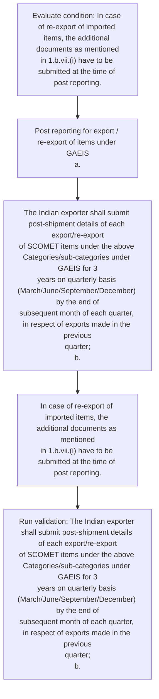

# Chapter 10 / Section 2: Post reporting for export / re-export of items under GAEIS

**Chapter Title:** SCOMET: Special Chemicals, Organisms, Materials, Equipment and Technologies

**Pages:** 34

**Purpose:** Post reporting for export / re-export of items under GAEIS
a.

**Purpose Thanglish:** Indha Post reporting for export / re-export of items under GAEIS section-la, Post reporting for export / re-export of items under GAEIS
a.

**Summary:** 2. Post reporting for export / re-export of items under GAEIS
a. The Indian exporter shall submit post-shipment details of each export/re-export
of SCOMET items under the above Categories/sub-categories under GAEIS for 3
years on quarterly basis (March/June/September/December) by the end of
subsequent month of each quarter, in respect of exports made in the previous
quarter;
b.

**Business Meaning:** Post reporting for export / re-export of items under GAEIS governs how DGFT business controls should be applied, validated, and enforced.

**Business Explanation:** Post reporting for export / re-export of items under GAEIS explains the operating rule set that DEKAI should enforce. Key control points include The Indian exporter shall submit post-shipment details of each export/re-export
of SCOMET items under the above Categories/sub-categories under GAEIS for 3
years on quarterly basis (March/June/September/December) by the end of
subsequent month of each quarter, in respect of exports made in the previous
quarter;
b. The section also drives actions such as Post reporting for export / re-export of items under GAEIS
a..

**Business Explanation Thanglish:** Indha Post reporting for export / re-export of items under GAEIS section-la, Post reporting for export / re-export of items under GAEIS explains the operating rule set that DEKAI should enforce. Key control points include The Indian exporter kandippa submit post-shipment details of each export/re-export
of SCOMET items under the above Categories/sub-categories under GAEIS for 3
years on quarterly basis (March/June/September/December) by the end of
subsequent month of each quarter, in respect of exports made in the previous
quarter;
b. The section also drives actions such as Post reporting for export / re-export of items under GAEIS
a..

## Business Logic
- The Indian exporter shall submit post-shipment details of each export/re-export
of SCOMET items under the above Categories/sub-categories under GAEIS for 3
years on quarterly basis (March/June/September/December) by the end of
subsequent month of each quarter, in respect of exports made in the previous
quarter;
b.

## Business Rules
- rule_id=CH10-SEC2-R001, rule_description=The Indian exporter shall submit post-shipment details of each export/re-export
of SCOMET items under the above Categories/sub-categories under GAEIS for 3
years on quarterly basis (March/June/September/December) by the end of
subsequent month of each quarter, in respect of exports made in the previous
quarter;
b., trigger=Post reporting for export / re-export of items under GAEIS, condition=In case of re-export of imported items, the additional documents as mentioned
in 1.b.vii.(i) have to be submitted at the time of post reporting., validation=The Indian exporter shall submit post-shipment details of each export/re-export
of SCOMET items under the above Categories/sub-categories under GAEIS for 3
years on quarterly basis (March/June/September/December) by the end of
subsequent month of each quarter, in respect of exports made in the previous
quarter;
b., action=Post reporting for export / re-export of items under GAEIS
a., exception=No explicit exception found in uploaded documents., output=DEKAI should produce a compliance decision for 2 - Post reporting for export / re-export of items under GAEIS.

## Conditions
- In case of re-export of imported items, the additional documents as mentioned
in 1.b.vii.(i) have to be submitted at the time of post reporting.

## Condition Logic
- id=10.2.1, if=In case of re-export of imported items, the additional documents as mentioned
in 1.b.vii.(i) have to be submitted at the time of post reporting., then=Post reporting for export / re-export of items under GAEIS
a., source=In case of re-export of imported items, the additional documents as mentioned
in 1.b.vii.(i) have to be submitted at the time of post reporting.

## Validations
- The Indian exporter shall submit post-shipment details of each export/re-export
of SCOMET items under the above Categories/sub-categories under GAEIS for 3
years on quarterly basis (March/June/September/December) by the end of
subsequent month of each quarter, in respect of exports made in the previous
quarter;
b.

## Exceptions
- None identified

## Dependencies
- 1
- 3

## Authorities
- None identified

## Required Documents
- In case of re-export of imported items, the additional documents as mentioned
in 1.b.vii.(i) have to be submitted at the time of post reporting.

## Timelines
- The Indian exporter shall submit post-shipment details of each export/re-export
of SCOMET items under the above Categories/sub-categories under GAEIS for 3
years on quarterly basis (March/June/September/December) by the end of
subsequent month of each quarter, in respect of exports made in the previous
quarter;
b.

## Actions
- Post reporting for export / re-export of items under GAEIS
a.
- The Indian exporter shall submit post-shipment details of each export/re-export
of SCOMET items under the above Categories/sub-categories under GAEIS for 3
years on quarterly basis (March/June/September/December) by the end of
subsequent month of each quarter, in respect of exports made in the previous
quarter;
b.
- In case of re-export of imported items, the additional documents as mentioned
in 1.b.vii.(i) have to be submitted at the time of post reporting.

## Workflow
- Evaluate condition: In case of re-export of imported items, the additional documents as mentioned
in 1.b.vii.(i) have to be submitted at the time of post reporting.
- Post reporting for export / re-export of items under GAEIS
a.
- The Indian exporter shall submit post-shipment details of each export/re-export
of SCOMET items under the above Categories/sub-categories under GAEIS for 3
years on quarterly basis (March/June/September/December) by the end of
subsequent month of each quarter, in respect of exports made in the previous
quarter;
b.
- In case of re-export of imported items, the additional documents as mentioned
in 1.b.vii.(i) have to be submitted at the time of post reporting.
- Run validation: The Indian exporter shall submit post-shipment details of each export/re-export
of SCOMET items under the above Categories/sub-categories under GAEIS for 3
years on quarterly basis (March/June/September/December) by the end of
subsequent month of each quarter, in respect of exports made in the previous
quarter;
b.

## Workflow ASCII
```text
Post reporting for export / re-export of items under GAEIS
Evaluate condition: In case of re-export of imported items, the additional documents as mentioned
in 1.b.vii.(i) have to be submitted at the time of post reporting.
   |
   v
Post reporting for export / re-export of items under GAEIS
a.
   |
   v
The Indian exporter shall submit post-shipment details of each export/re-export
of SCOMET items under the above Categories/sub-categories under GAEIS for 3
years on quarterly basis (March/June/September/December) by the end of
subsequent month of each quarter, in respect of exports made in the previous
quarter;
b.
   |
   v
In case of re-export of imported items, the additional documents as mentioned
in 1.b.vii.(i) have to be submitted at the time of post reporting.
   |
   v
Run validation: The Indian exporter shall submit post-shipment details of each export/re-export
of SCOMET items under the above Categories/sub-categories under GAEIS for 3
years on quarterly basis (March/June/September/December) by the end of
subsequent month of each quarter, in respect of exports made in the previous
quarter;
b.
```

## Decision Tree
- IF In case of re-export of imported items, the additional documents as mentioned
in 1.b.vii.(i) have to be submitted at the time of post reporting. THEN Post reporting for export / re-export of items under GAEIS
a.

## Decision Tree ASCII
```text
Post reporting for export / re-export of items under GAEIS Decision
IF In case of re-export of imported items, the additional documents as mentioned
in 1.b.vii.(i) have to be submitted at the time of post reporting. THEN Post reporting for export / re-export of items under GAEIS
a.
```

## Examples
- User asks to process Post reporting for export / re-export of items under GAEIS; the platform checks conditions, validations, and documents before action.

**Real-world Example:** Example: an importer or exporter invokes Post reporting for export / re-export of items under GAEIS, submits In case of re-export of imported items, the additional documents as mentioned
in 1.b.vii.(i) have to be submitted at the time of post reporting., and DEKAI uses the extracted rules to post reporting for export / re-export of items under gaeis
a..

**Real-world Example Thanglish:** Indha Post reporting for export / re-export of items under GAEIS section-la, Example: an importer or exporter invokes Post reporting for export / re-export of items under GAEIS, submits In case of re-export of imported items, the additional documents as mentioned
in 1.b.vii.(i) have to be submitted at the time of post reporting., and DEKAI uses the extracted rules to post reporting for export / re-export of items under gaeis
a..

## AI Rules
- IF detected context matches section rule THEN enforce: The Indian exporter shall submit post-shipment details of each export/re-export
of SCOMET items under the above Categories/sub-categories under GAEIS for 3
years on quarterly basis (March/June/September/December) by the end of
subsequent month of each quarter, in respect of exports made in the previous
quarter;
b.
- IF validations pass THEN recommend action: Post reporting for export / re-export of items under GAEIS
a.

## Database Fields
- name=section_code, type=string, required=True, source=parsed_section_heading
- name=section_title, type=string, required=True, source=parsed_section_heading
- name=for_flag, type=boolean, required=False, source=keyword:for
- name=the_flag, type=boolean, required=False, source=keyword:The
- name=end_flag, type=boolean, required=False, source=keyword:end
- name=vii_flag, type=boolean, required=False, source=keyword:vii
- name=may_flag, type=boolean, required=False, source=keyword:may
- name=post_flag, type=boolean, required=False, source=keyword:Post
- name=each_flag, type=boolean, required=False, source=keyword:each
- name=made_flag, type=boolean, required=False, source=keyword:made
- name=document_1_submitted, type=boolean, required=True, source=In case of re-export of imported items, the additional documents as mentioned
in 1.b.vii.(i) have to be submitted at the time of post reporting.

## API Requirements
- method=GET, path=/api/dgft/sections/2, purpose=Retrieve knowledge payload for section 2, query_params=['include=workflow,decision_tree,validations'], response_fields=['section', 'title', 'summary', 'conditions', 'validations', 'exceptions', 'workflow', 'decision_tree']
- method=POST, path=/api/dgft/Post-reporting-for-export-re-export-of-items-under-GAEIS/validate, purpose=Validate inputs and documents for Post reporting for export / re-export of items under GAEIS, request_fields=['section_code', 'section_title', 'document_1_submitted'], response_fields=['status', 'errors', 'warnings', 'next_actions']
- method=POST, path=/api/dgft/Post-reporting-for-export-re-export-of-items-under-GAEIS/execute, purpose=Trigger business action for Post reporting for export / re-export of items under GAEIS
a., request_fields=['section_code', 'section_title', 'document_1_submitted'], response_fields=['reference_id', 'status', 'authority', 'timeline']

## UI Screens
- screen_id=Post_reporting_for_export_re_export_of_items_under_GAEIS_overview, name=Post reporting for export / re-export of items under GAEIS Overview, purpose=Show section summary, authority, timeline, and eligibility cues., widgets=['summary_card', 'conditions_table', 'authority_badges', 'timeline_panel']
- screen_id=Post_reporting_for_export_re_export_of_items_under_GAEIS_submission, name=Post reporting for export / re-export of items under GAEIS Submission, purpose=Capture applicant data and supporting documents., widgets=['dynamic_form', 'document_uploader', 'validation_panel', 'next_action_footer'], fields=['section_code', 'section_title', 'for_flag', 'the_flag', 'end_flag', 'vii_flag', 'may_flag', 'post_flag']

## Error Messages
- Validation failed because the section requirements were not fully met.

## FAQ
- question_en=What is the purpose of section 2?, answer_en=Post reporting for export / re-export of items under GAEIS explains the operating rule set that DEKAI should enforce. Key control points include The Indian exporter shall submit post-shipment details of each export/re-export
of SCOMET items under the above Categories/sub-categories under GAEIS for 3
years on quarterly basis (March/June/September/December) by the end of
subsequent month of each quarter, in respect of exports made in the previous
quarter;
b. The section also drives actions such as Post reporting for export / re-export of items under GAEIS
a.., question_thanglish=Indha Post reporting for export / re-export of items under GAEIS section-la, What is the purpose of section 2?, answer_thanglish=Indha Post reporting for export / re-export of items under GAEIS section-la, Post reporting for export / re-export of items under GAEIS explains the operating rule set that DEKAI should enforce. Key control points include The Indian exporter kandippa submit post-shipment details of each export/re-export
of SCOMET items under the above Categories/sub-categories under GAEIS for 3
years on quarterly basis (March/June/September/December) by the end of
subsequent month of each quarter, in respect of exports made in the previous
quarter;
b. The section also drives actions such as Post reporting for export / re-export of items under GAEIS
a..
- question_en=What documents are required under Post reporting for export / re-export of items under GAEIS?, answer_en=In case of re-export of imported items, the additional documents as mentioned
in 1.b.vii.(i) have to be submitted at the time of post reporting., question_thanglish=Indha Post reporting for export / re-export of items under GAEIS section-la, What documents are required under Post reporting for export / re-export of items under GAEIS?, answer_thanglish=Indha Post reporting for export / re-export of items under GAEIS section-la, In case of re-export of imported items, the additional documents as mentioned
in 1.b.vii.(i) have to be submitted at the time of post reporting.
- question_en=Which authority handles Post reporting for export / re-export of items under GAEIS?, answer_en=Not explicitly covered in uploaded documents., question_thanglish=Indha Post reporting for export / re-export of items under GAEIS section-la, Which authority handles Post reporting for export / re-export of items under GAEIS?, answer_thanglish=Indha Post reporting for export / re-export of items under GAEIS section-la, Not explicitly covered in uploaded documents.

## Questions Users May Ask
- What does Post reporting for export / re-export of items under GAEIS require?
- Which documents are needed for Post reporting for export / re-export of items under GAEIS?
- How does DEKAI validate Post reporting for export / re-export of items under GAEIS requests?
- What action should be taken for Post reporting for export / re-export of items under GAEIS?

## Expected AI Answers
- Post reporting for export / re-export of items under GAEIS requires the platform to interpret the section text, apply the extracted business rules, and present the correct next action.
- Required documents are inferred from the section text: In case of re-export of imported items, the additional documents as mentioned
in 1.b.vii.(i) have to be submitted at the time of post reporting.
- DEKAI validates Post reporting for export / re-export of items under GAEIS by checking conditions, required documents, authority references, and exception clauses before recommending an outcome.
- The primary extracted action is: Post reporting for export / re-export of items under GAEIS
a.

## AI Q&A Examples
- question_en=User asks: How do I comply with Post reporting for export / re-export of items under GAEIS?, answer_en=AI answers: DEKAI should evaluate section 2, apply the extracted rules, and guide the user through Evaluate condition: In case of re-export of imported items, the additional documents as mentioned
in 1.b.vii.(i) have to be submitted at the time of post reporting.., question_thanglish=Indha Post reporting for export / re-export of items under GAEIS section-la, User asks: How do I comply with Post reporting for export / re-export of items under GAEIS?, answer_thanglish=Indha Post reporting for export / re-export of items under GAEIS section-la, AI answers: DEKAI should evaluate section 2, apply the extracted rules, and guide the user through Evaluate condition: In case of re-export of imported items, the additional documents as mentioned
in 1.b.vii.(i) have to be submitted at the time of post reporting..
- question_en=User asks: Which validations apply to Post reporting for export / re-export of items under GAEIS?, answer_en=AI answers: Applicable validations are The Indian exporter shall submit post-shipment details of each export/re-export
of SCOMET items under the above Categories/sub-categories under GAEIS for 3
years on quarterly basis (March/June/September/December) by the end of
subsequent month of each quarter, in respect of exports made in the previous
quarter;
b., question_thanglish=Indha Post reporting for export / re-export of items under GAEIS section-la, User asks: Which validations apply to Post reporting for export / re-export of items under GAEIS?, answer_thanglish=Indha Post reporting for export / re-export of items under GAEIS section-la, AI answers: Applicable validations are The Indian exporter kandippa submit post-shipment details of each export/re-export
of SCOMET items under the above Categories/sub-categories under GAEIS for 3
years on quarterly basis (March/June/September/December) by the end of
subsequent month of each quarter, in respect of exports made in the previous
quarter;
b.

## DEKAI AI Implementation Notes
- Capture chapter 10, section 2, title, and page references as immutable knowledge metadata.
- Bind validations for Post reporting for export / re-export of items under GAEIS into a rule engine keyed by the rule IDs extracted for this section.
- Expose document upload controls for: In case of re-export of imported items, the additional documents as mentioned
in 1.b.vii.(i) have to be submitted at the time of post reporting..
- Show contextual links to related sections: 1, 3.

## DEKAI AI Implementation Notes Thanglish
- Indha Post reporting for export / re-export of items under GAEIS section-la, Capture chapter 10, section 2, title, and page references as immutable knowledge metadata.
- Indha Post reporting for export / re-export of items under GAEIS section-la, Bind validations for Post reporting for export / re-export of items under GAEIS into a rule engine keyed by the rule IDs extracted for this section.
- Indha Post reporting for export / re-export of items under GAEIS section-la, Expose document upload controls for: In case of re-export of imported items, the additional documents as mentioned
in 1.b.vii.(i) have to be submitted at the time of post reporting..
- Indha Post reporting for export / re-export of items under GAEIS section-la, Show contextual links to related sections: 1, 3.

## AI Metadata
- Keywords: for, The, end, vii, may, Post, each, made, case, have, time, items, under, GAEIS, shall, above, years, basis, month, export
- Search Keywords: for, The, end, vii, may, Post, each, made, case, have, time, items, under, GAEIS, shall, above, years, basis, month, export
- Intent: Support Post reporting for export / re-export of items under GAEIS processing and compliance validation.
- Tags: 2, Post reporting for export / re-export of items under GAEIS, business-rule, document-driven, dgft
- Related Sections: 1, 3
- Related Chapters: 
- Related Rules: The Indian exporter shall submit post-shipment details of each export/re-export
of SCOMET items under the above Categories/sub-categories under GAEIS for 3
years on quarterly basis (March/June/September/December) by the end of
subsequent month of each quarter, in respect of exports made in the previous
quarter;
b.

## Mermaid


## PlantUML
```plantuml
@startuml
start
:Evaluate condition\: In case of re-export of imported items, the additional documents as mentioned
in 1.b.vii.(i) have to be submitted at the time of post reporting.;
:Post reporting for export / re-export of items under GAEIS
a.;
:The Indian exporter shall submit post-shipment details of each export/re-export
of SCOMET items under the above Categories/sub-categories under GAEIS for 3
years on quarterly basis (March/June/September/December) by the end of
subsequent month of each quarter, in respect of exports made in the previous
quarter;
b.;
:In case of re-export of imported items, the additional documents as mentioned
in 1.b.vii.(i) have to be submitted at the time of post reporting.;
:Run validation\: The Indian exporter shall submit post-shipment details of each export/re-export
of SCOMET items under the above Categories/sub-categories under GAEIS for 3
years on quarterly basis (March/June/September/December) by the end of
subsequent month of each quarter, in respect of exports made in the previous
quarter;
b.;
stop
@enduml
```
