# Chapter 10 / Section 2: Proof of obligation for repair of defective/damaged items:

**Chapter Title:** SCOMET: Special Chemicals, Organisms, Materials, Equipment and Technologies

**Pages:** 16

**Purpose:** Proof of obligation for repair of defective/damaged items:
pg.

**Purpose Thanglish:** Indha Proof of obligation for repair of defective/damaged items: section-la, Proof of obligation for repair of defective/damaged items:
pg.

**Summary:** 2. Proof of obligation for repair of defective/damaged items:
pg. 184
pg.

**Business Meaning:** Proof of obligation for repair of defective/damaged items: governs how DGFT business controls should be applied, validated, and enforced.

**Business Explanation:** Proof of obligation for repair of defective/damaged items: explains the operating rule set that DEKAI should enforce. Key control points include The exporter is required to register and obtain General authorization for export
after repair only once during the validity period. The section also drives actions such as The exporter is required to register and obtain General authorization for export
after repair only once during the validity period..

**Business Explanation Thanglish:** Indha Proof of obligation for repair of defective/damaged items: section-la, Proof of obligation for repair of defective/damaged items: explains the operating rule set that DEKAI should enforce. Key control points include The exporter is required to register and obtain General authorization for export
after repair only once during the validity period. The section also drives actions such as The exporter is required to register and obtain General authorization for export
after repair only once during the validity period..

## Business Logic
- The exporter is required to register and obtain General authorization for export
after repair only once during the validity period.
- Subsequent export/re-export is
subject to post reporting;
d.
- The exporter is required to provide Bill of Entry for the imported item while
applying for GAER for the first shipment.
- General authorization for export after repair shall be valid for a period of one year
from the date of issue of General authorization subject to subsequent post
reporting(s) within 30 days from the date of such export;
f.
- GAER issued for specific item and specific entity (buyer/end user) shall not be
applicable in case the re-export is of a different imported item or to a different
entity or Authorised OEM.
- Certified / approved Internal Compliance Programme or demonstrating
compliance to the ICP of the foreign company or ICP certified by the compliance
manager of that company shall be mandatory[only for intra-company transfers].
- Authorized Economic Operator (AEO) Certification along with ICP compliance shall
be mandatory.

## Business Rules
- rule_id=CH10-SEC2-R001, rule_description=The exporter is required to register and obtain General authorization for export
after repair only once during the validity period., trigger=Proof of obligation for repair of defective/damaged items:, condition=184
different from exporter) and entity abroad defining ‘Statement of Work (SOW)’/
‘Scope of Work’ including conditions for undertaking repair in India;
b., validation=The exporter is required to register and obtain General authorization for export
after repair only once during the validity period., action=The exporter is required to register and obtain General authorization for export
after repair only once during the validity period., exception=No explicit exception found in uploaded documents., output=DEKAI should produce a compliance decision for 2 - Proof of obligation for repair of defective/damaged items:.
- rule_id=CH10-SEC2-R002, rule_description=Subsequent export/re-export is
subject to post reporting;
d., trigger=Proof of obligation for repair of defective/damaged items:, condition=The exporter is required to register and obtain General authorization for export
after repair only once during the validity period., validation=The exporter is required to provide Bill of Entry for the imported item while
applying for GAER for the first shipment., action=Subsequent export/re-export is
subject to post reporting;
d., exception=No explicit exception found in uploaded documents., output=DEKAI should produce a compliance decision for 2 - Proof of obligation for repair of defective/damaged items:.
- rule_id=CH10-SEC2-R003, rule_description=The exporter is required to provide Bill of Entry for the imported item while
applying for GAER for the first shipment., trigger=Proof of obligation for repair of defective/damaged items:, condition=Subsequent export/re-export is
subject to post reporting;
d., validation=General authorization for export after repair shall be valid for a period of one year
from the date of issue of General authorization subject to subsequent post
reporting(s) within 30 days from the date of such export;
f., action=The exporter is required to provide Bill of Entry for the imported item while
applying for GAER for the first shipment., exception=No explicit exception found in uploaded documents., output=DEKAI should produce a compliance decision for 2 - Proof of obligation for repair of defective/damaged items:.
- rule_id=CH10-SEC2-R004, rule_description=General authorization for export after repair shall be valid for a period of one year
from the date of issue of General authorization subject to subsequent post
reporting(s) within 30 days from the date of such export;
f., trigger=Proof of obligation for repair of defective/damaged items:, condition=General authorization for export after repair shall be valid for a period of one year
from the date of issue of General authorization subject to subsequent post
reporting(s) within 30 days from the date of such export;
f., validation=No details of ‘End Use’ and ‘End Use Certificate’ would be required;
k., action=General authorization for export after repair shall be valid for a period of one year
from the date of issue of General authorization subject to subsequent post
reporting(s) within 30 days from the date of such export;
f., exception=No explicit exception found in uploaded documents., output=DEKAI should produce a compliance decision for 2 - Proof of obligation for repair of defective/damaged items:.
- rule_id=CH10-SEC2-R005, rule_description=GAER issued for specific item and specific entity (buyer/end user) shall not be
applicable in case the re-export is of a different imported item or to a different
entity or Authorised OEM., trigger=Proof of obligation for repair of defective/damaged items:, condition=Note: Same entity would imply that (a) foreign
buyer (b) consignee or intermediaries, if any (c) the end user are exactly the same
for which authorisation has been issued to the applicant exporter., validation=GAER issued for specific item and specific entity (buyer/end user) shall not be
applicable in case the re-export is of a different imported item or to a different
entity or Authorised OEM., action=Subsequent export would be allowed to the same entity and location to which the
license has originally been issued., exception=No explicit exception found in uploaded documents., output=DEKAI should produce a compliance decision for 2 - Proof of obligation for repair of defective/damaged items:.
- rule_id=CH10-SEC2-R006, rule_description=Certified / approved Internal Compliance Programme or demonstrating
compliance to the ICP of the foreign company or ICP certified by the compliance
manager of that company shall be mandatory[only for intra-company transfers]., trigger=Proof of obligation for repair of defective/damaged items:, condition=There has been no change to the original characteristics/specifications of the
SCOMET item(s) after repair and no value addition has been done during the repair
work;
h., validation=Certified / approved Internal Compliance Programme or demonstrating
compliance to the ICP of the foreign company or ICP certified by the compliance
manager of that company shall be mandatory[only for intra-company transfers]., action=Note: Same entity would imply that (a) foreign
buyer (b) consignee or intermediaries, if any (c) the end user are exactly the same
for which authorisation has been issued to the applicant exporter., exception=No explicit exception found in uploaded documents., output=DEKAI should produce a compliance decision for 2 - Proof of obligation for repair of defective/damaged items:.
- rule_id=CH10-SEC2-R007, rule_description=Authorized Economic Operator (AEO) Certification along with ICP compliance shall
be mandatory., trigger=Proof of obligation for repair of defective/damaged items:, condition=No Export Authorisation would be granted when the initial export authorisation
has been suspended, modified or revoked by country of import;
i., validation=Authorized Economic Operator (AEO) Certification along with ICP compliance shall
be mandatory., action=GAER issued for specific item and specific entity (buyer/end user) shall not be
applicable in case the re-export is of a different imported item or to a different
entity or Authorised OEM., exception=No explicit exception found in uploaded documents., output=DEKAI should produce a compliance decision for 2 - Proof of obligation for repair of defective/damaged items:.

## Conditions
- 184
different from exporter) and entity abroad defining ‘Statement of Work (SOW)’/
‘Scope of Work’ including conditions for undertaking repair in India;
b.
- The exporter is required to register and obtain General authorization for export
after repair only once during the validity period.
- Subsequent export/re-export is
subject to post reporting;
d.
- General authorization for export after repair shall be valid for a period of one year
from the date of issue of General authorization subject to subsequent post
reporting(s) within 30 days from the date of such export;
f.
- Note: Same entity would imply that (a) foreign
buyer (b) consignee or intermediaries, if any (c) the end user are exactly the same
for which authorisation has been issued to the applicant exporter.
- There has been no change to the original characteristics/specifications of the
SCOMET item(s) after repair and no value addition has been done during the repair
work;
h.
- No Export Authorisation would be granted when the initial export authorisation
has been suspended, modified or revoked by country of import;
i.
- No details of ‘End Use’ and ‘End Use Certificate’ would be required;
k.
- GAER issued for specific item and specific entity (buyer/end user) shall not be
applicable in case the re-export is of a different imported item or to a different
entity or Authorised OEM.
- Certified / approved Internal Compliance Programme or demonstrating
compliance to the ICP of the foreign company or ICP certified by the compliance
manager of that company shall be mandatory[only for intra-company transfers].
- Authorized Economic Operator (AEO) Certification along with ICP compliance shall
be mandatory.

## Condition Logic
- id=10.2.1, if=184
different from exporter) and entity abroad defining ‘Statement of Work (SOW)’/
‘Scope of Work’ including conditions for undertaking repair in India;
b., then=The exporter is required to register and obtain General authorization for export
after repair only once during the validity period., source=184
different from exporter) and entity abroad defining ‘Statement of Work (SOW)’/
‘Scope of Work’ including conditions for undertaking repair in India;
b.
- id=10.2.2, if=The exporter is required to register and obtain General authorization for export
after repair only once during the validity period., then=The exporter is required to register and obtain General authorization for export
after repair only once during the validity period., source=The exporter is required to register and obtain General authorization for export
after repair only once during the validity period.
- id=10.2.3, if=Subsequent export/re-export is
subject to post reporting;
d., then=The exporter is required to register and obtain General authorization for export
after repair only once during the validity period., source=Subsequent export/re-export is
subject to post reporting;
d.
- id=10.2.4, if=General authorization for export after repair shall be valid for a period of one year
from the date of issue of General authorization subject to subsequent post
reporting(s) within 30 days from the date of such export;
f., then=The exporter is required to register and obtain General authorization for export
after repair only once during the validity period., source=General authorization for export after repair shall be valid for a period of one year
from the date of issue of General authorization subject to subsequent post
reporting(s) within 30 days from the date of such export;
f.
- id=10.2.5, if=Note: Same entity would imply that (a) foreign
buyer (b) consignee or intermediaries, if any (c) the end user are exactly the same
for which authorisation has been issued to the applicant exporter., then=The exporter is required to register and obtain General authorization for export
after repair only once during the validity period., source=Note: Same entity would imply that (a) foreign
buyer (b) consignee or intermediaries, if any (c) the end user are exactly the same
for which authorisation has been issued to the applicant exporter.
- id=10.2.6, if=There has been no change to the original characteristics/specifications of the
SCOMET item(s) after repair and no value addition has been done during the repair
work;
h., then=The exporter is required to register and obtain General authorization for export
after repair only once during the validity period., source=There has been no change to the original characteristics/specifications of the
SCOMET item(s) after repair and no value addition has been done during the repair
work;
h.
- id=10.2.7, if=No Export Authorisation would be granted when the initial export authorisation
has been suspended, modified or revoked by country of import;
i., then=The exporter is required to register and obtain General authorization for export
after repair only once during the validity period., source=No Export Authorisation would be granted when the initial export authorisation
has been suspended, modified or revoked by country of import;
i.
- id=10.2.8, if=No details of ‘End Use’ and ‘End Use Certificate’ would be required;
k., then=The exporter is required to register and obtain General authorization for export
after repair only once during the validity period., source=No details of ‘End Use’ and ‘End Use Certificate’ would be required;
k.
- id=10.2.9, if=GAER issued for specific item and specific entity (buyer/end user) shall not be
applicable in case the re-export is of a different imported item or to a different
entity or Authorised OEM., then=The exporter is required to register and obtain General authorization for export
after repair only once during the validity period., source=GAER issued for specific item and specific entity (buyer/end user) shall not be
applicable in case the re-export is of a different imported item or to a different
entity or Authorised OEM.
- id=10.2.10, if=Certified / approved Internal Compliance Programme or demonstrating
compliance to the ICP of the foreign company or ICP certified by the compliance
manager of that company shall be mandatory[only for intra-company transfers]., then=The exporter is required to register and obtain General authorization for export
after repair only once during the validity period., source=Certified / approved Internal Compliance Programme or demonstrating
compliance to the ICP of the foreign company or ICP certified by the compliance
manager of that company shall be mandatory[only for intra-company transfers].
- id=10.2.11, if=Authorized Economic Operator (AEO) Certification along with ICP compliance shall
be mandatory., then=The exporter is required to register and obtain General authorization for export
after repair only once during the validity period., source=Authorized Economic Operator (AEO) Certification along with ICP compliance shall
be mandatory.

## Validations
- The exporter is required to register and obtain General authorization for export
after repair only once during the validity period.
- The exporter is required to provide Bill of Entry for the imported item while
applying for GAER for the first shipment.
- General authorization for export after repair shall be valid for a period of one year
from the date of issue of General authorization subject to subsequent post
reporting(s) within 30 days from the date of such export;
f.
- No details of ‘End Use’ and ‘End Use Certificate’ would be required;
k.
- GAER issued for specific item and specific entity (buyer/end user) shall not be
applicable in case the re-export is of a different imported item or to a different
entity or Authorised OEM.
- Certified / approved Internal Compliance Programme or demonstrating
compliance to the ICP of the foreign company or ICP certified by the compliance
manager of that company shall be mandatory[only for intra-company transfers].
- Authorized Economic Operator (AEO) Certification along with ICP compliance shall
be mandatory.
- Documents Required for GAER

## Exceptions
- None identified

## Dependencies
- 10.12
- 1
- 3
- 4

## Authorities
- None identified

## Required Documents
- Proof of obligation for repair of defective/damaged items:
pg.
- 184
different from exporter) and entity abroad defining ‘Statement of Work (SOW)’/
‘Scope of Work’ including conditions for undertaking repair in India;
b.
- The exporter is required to provide Bill
- Subsequent export would be allowed to the same entity and location to which the
license has originally been issued.
- End Use Certificate
- In such cases, either a new GAER authorization may be
applied or application may be filed under Para 10.12(D) of HBP.
- Documents Required for GAER

## Timelines
- The exporter is required to register and obtain General authorization for export
after repair only once during the validity period.
- General authorization for export after repair shall be valid for a period of one year
from the date of issue of General authorization subject to subsequent post
reporting(s) within 30 days from the date of such export;
f.
- There has been no change to the original characteristics/specifications of the
SCOMET item(s) after repair and no value addition has been done during the repair
work;
h.

## Actions
- The exporter is required to register and obtain General authorization for export
after repair only once during the validity period.
- Subsequent export/re-export is
subject to post reporting;
d.
- The exporter is required to provide Bill of Entry for the imported item while
applying for GAER for the first shipment.
- General authorization for export after repair shall be valid for a period of one year
from the date of issue of General authorization subject to subsequent post
reporting(s) within 30 days from the date of such export;
f.
- Subsequent export would be allowed to the same entity and location to which the
license has originally been issued.
- Note: Same entity would imply that (a) foreign
buyer (b) consignee or intermediaries, if any (c) the end user are exactly the same
for which authorisation has been issued to the applicant exporter.
- GAER issued for specific item and specific entity (buyer/end user) shall not be
applicable in case the re-export is of a different imported item or to a different
entity or Authorised OEM.
- Certified / approved Internal Compliance Programme or demonstrating
compliance to the ICP of the foreign company or ICP certified by the compliance
manager of that company shall be mandatory[only for intra-company transfers].

## Workflow
- Evaluate condition: 184
different from exporter) and entity abroad defining ‘Statement of Work (SOW)’/
‘Scope of Work’ including conditions for undertaking repair in India;
b.
- Evaluate condition: The exporter is required to register and obtain General authorization for export
after repair only once during the validity period.
- Evaluate condition: Subsequent export/re-export is
subject to post reporting;
d.
- The exporter is required to register and obtain General authorization for export
after repair only once during the validity period.
- Subsequent export/re-export is
subject to post reporting;
d.
- The exporter is required to provide Bill of Entry for the imported item while
applying for GAER for the first shipment.
- General authorization for export after repair shall be valid for a period of one year
from the date of issue of General authorization subject to subsequent post
reporting(s) within 30 days from the date of such export;
f.
- Subsequent export would be allowed to the same entity and location to which the
license has originally been issued.
- Note: Same entity would imply that (a) foreign
buyer (b) consignee or intermediaries, if any (c) the end user are exactly the same
for which authorisation has been issued to the applicant exporter.
- Run validation: The exporter is required to register and obtain General authorization for export
after repair only once during the validity period.
- Run validation: The exporter is required to provide Bill of Entry for the imported item while
applying for GAER for the first shipment.
- Run validation: General authorization for export after repair shall be valid for a period of one year
from the date of issue of General authorization subject to subsequent post
reporting(s) within 30 days from the date of such export;
f.

## Workflow ASCII
```text
Proof of obligation for repair of defective/damaged items:
Evaluate condition: 184
different from exporter) and entity abroad defining ‘Statement of Work (SOW)’/
‘Scope of Work’ including conditions for undertaking repair in India;
b.
   |
   v
Evaluate condition: The exporter is required to register and obtain General authorization for export
after repair only once during the validity period.
   |
   v
Evaluate condition: Subsequent export/re-export is
subject to post reporting;
d.
   |
   v
The exporter is required to register and obtain General authorization for export
after repair only once during the validity period.
   |
   v
Subsequent export/re-export is
subject to post reporting;
d.
   |
   v
The exporter is required to provide Bill of Entry for the imported item while
applying for GAER for the first shipment.
   |
   v
General authorization for export after repair shall be valid for a period of one year
from the date of issue of General authorization subject to subsequent post
reporting(s) within 30 days from the date of such export;
f.
   |
   v
Subsequent export would be allowed to the same entity and location to which the
license has originally been issued.
   |
   v
Note: Same entity would imply that (a) foreign
buyer (b) consignee or intermediaries, if any (c) the end user are exactly the same
for which authorisation has been issued to the applicant exporter.
   |
   v
Run validation: The exporter is required to register and obtain General authorization for export
after repair only once during the validity period.
   |
   v
Run validation: The exporter is required to provide Bill of Entry for the imported item while
applying for GAER for the first shipment.
   |
   v
Run validation: General authorization for export after repair shall be valid for a period of one year
from the date of issue of General authorization subject to subsequent post
reporting(s) within 30 days from the date of such export;
f.
```

## Decision Tree
- IF 184
different from exporter) and entity abroad defining ‘Statement of Work (SOW)’/
‘Scope of Work’ including conditions for undertaking repair in India;
b. THEN The exporter is required to register and obtain General authorization for export
after repair only once during the validity period.
- IF The exporter is required to register and obtain General authorization for export
after repair only once during the validity period. THEN The exporter is required to register and obtain General authorization for export
after repair only once during the validity period.
- IF Subsequent export/re-export is
subject to post reporting;
d. THEN The exporter is required to register and obtain General authorization for export
after repair only once during the validity period.
- IF General authorization for export after repair shall be valid for a period of one year
from the date of issue of General authorization subject to subsequent post
reporting(s) within 30 days from the date of such export;
f. THEN The exporter is required to register and obtain General authorization for export
after repair only once during the validity period.
- IF Note: Same entity would imply that (a) foreign
buyer (b) consignee or intermediaries, if any (c) the end user are exactly the same
for which authorisation has been issued to the applicant exporter. THEN The exporter is required to register and obtain General authorization for export
after repair only once during the validity period.

## Decision Tree ASCII
```text
Proof of obligation for repair of defective/damaged items: Decision
IF 184
different from exporter) and entity abroad defining ‘Statement of Work (SOW)’/
‘Scope of Work’ including conditions for undertaking repair in India;
b. THEN The exporter is required to register and obtain General authorization for export
after repair only once during the validity period.
   |
   v
IF The exporter is required to register and obtain General authorization for export
after repair only once during the validity period. THEN The exporter is required to register and obtain General authorization for export
after repair only once during the validity period.
   |
   v
IF Subsequent export/re-export is
subject to post reporting;
d. THEN The exporter is required to register and obtain General authorization for export
after repair only once during the validity period.
   |
   v
IF General authorization for export after repair shall be valid for a period of one year
from the date of issue of General authorization subject to subsequent post
reporting(s) within 30 days from the date of such export;
f. THEN The exporter is required to register and obtain General authorization for export
after repair only once during the validity period.
   |
   v
IF Note: Same entity would imply that (a) foreign
buyer (b) consignee or intermediaries, if any (c) the end user are exactly the same
for which authorisation has been issued to the applicant exporter. THEN The exporter is required to register and obtain General authorization for export
after repair only once during the validity period.
```

## Examples
- User asks to process Proof of obligation for repair of defective/damaged items:; the platform checks conditions, validations, and documents before action.

**Real-world Example:** Example: an importer or exporter invokes Proof of obligation for repair of defective/damaged items:, submits Proof of obligation for repair of defective/damaged items:
pg., 184
different from exporter) and entity abroad defining ‘Statement of Work (SOW)’/
‘Scope of Work’ including conditions for undertaking repair in India;
b., The exporter is required to provide Bill, and DEKAI uses the extracted rules to the exporter is required to register and obtain general authorization for export
after repair only once during the validity period..

**Real-world Example Thanglish:** Indha Proof of obligation for repair of defective/damaged items: section-la, Example: an importer or exporter invokes Proof of obligation for repair of defective/damaged items:, submits Proof of obligation for repair of defective/damaged items:
pg., 184
different from exporter) and entity abroad defining ‘Statement of Work (SOW)’/
‘Scope of Work’ including conditions for undertaking repair in India;
b., The exporter is required to provide Bill, and DEKAI uses the extracted rules to the exporter is required to register and obtain general authorization for export
after repair only once during the validity period..

## AI Rules
- IF detected context matches section rule THEN enforce: The exporter is required to register and obtain General authorization for export
after repair only once during the validity period.
- IF detected context matches section rule THEN enforce: Subsequent export/re-export is
subject to post reporting;
d.
- IF detected context matches section rule THEN enforce: The exporter is required to provide Bill of Entry for the imported item while
applying for GAER for the first shipment.
- IF detected context matches section rule THEN enforce: General authorization for export after repair shall be valid for a period of one year
from the date of issue of General authorization subject to subsequent post
reporting(s) within 30 days from the date of such export;
f.
- IF detected context matches section rule THEN enforce: GAER issued for specific item and specific entity (buyer/end user) shall not be
applicable in case the re-export is of a different imported item or to a different
entity or Authorised OEM.
- IF detected context matches section rule THEN enforce: Certified / approved Internal Compliance Programme or demonstrating
compliance to the ICP of the foreign company or ICP certified by the compliance
manager of that company shall be mandatory[only for intra-company transfers].
- IF validations pass THEN recommend action: The exporter is required to register and obtain General authorization for export
after repair only once during the validity period.

## Database Fields
- name=section_code, type=string, required=True, source=parsed_section_heading
- name=section_title, type=string, required=True, source=parsed_section_heading
- name=for_flag, type=boolean, required=False, source=keyword:for
- name=and_flag, type=boolean, required=False, source=keyword:and
- name=sow_flag, type=boolean, required=False, source=keyword:SOW
- name=the_flag, type=boolean, required=False, source=keyword:The
- name=are_flag, type=boolean, required=False, source=keyword:are
- name=one_flag, type=boolean, required=False, source=keyword:one
- name=has_flag, type=boolean, required=False, source=keyword:has
- name=any_flag, type=boolean, required=False, source=keyword:any
- name=document_1_submitted, type=boolean, required=True, source=Proof of obligation for repair of defective/damaged items:
pg.
- name=document_2_submitted, type=boolean, required=True, source=184
different from exporter) and entity abroad defining ‘Statement of Work (SOW)’/
‘Scope of Work’ including conditions for undertaking repair in India;
b.
- name=document_3_submitted, type=boolean, required=True, source=The exporter is required to provide Bill
- name=document_4_submitted, type=boolean, required=True, source=Subsequent export would be allowed to the same entity and location to which the
license has originally been issued.
- name=document_5_submitted, type=boolean, required=True, source=End Use Certificate
- name=document_6_submitted, type=boolean, required=True, source=In such cases, either a new GAER authorization may be
applied or application may be filed under Para 10.12(D) of HBP.

## API Requirements
- method=GET, path=/api/dgft/sections/2, purpose=Retrieve knowledge payload for section 2, query_params=['include=workflow,decision_tree,validations'], response_fields=['section', 'title', 'summary', 'conditions', 'validations', 'exceptions', 'workflow', 'decision_tree']
- method=POST, path=/api/dgft/Proof-of-obligation-for-repair-of-defective-damaged-items/validate, purpose=Validate inputs and documents for Proof of obligation for repair of defective/damaged items:, request_fields=['section_code', 'section_title', 'document_1_submitted', 'document_2_submitted', 'document_3_submitted', 'document_4_submitted', 'document_5_submitted', 'document_6_submitted'], response_fields=['status', 'errors', 'warnings', 'next_actions']
- method=POST, path=/api/dgft/Proof-of-obligation-for-repair-of-defective-damaged-items/execute, purpose=Trigger business action for The exporter is required to register and obtain General authorization for export
after repair only once during the validity period., request_fields=['section_code', 'section_title', 'document_1_submitted', 'document_2_submitted', 'document_3_submitted', 'document_4_submitted', 'document_5_submitted', 'document_6_submitted'], response_fields=['reference_id', 'status', 'authority', 'timeline']

## UI Screens
- screen_id=Proof_of_obligation_for_repair_of_defective_damaged_items_overview, name=Proof of obligation for repair of defective/damaged items: Overview, purpose=Show section summary, authority, timeline, and eligibility cues., widgets=['summary_card', 'conditions_table', 'authority_badges', 'timeline_panel']
- screen_id=Proof_of_obligation_for_repair_of_defective_damaged_items_submission, name=Proof of obligation for repair of defective/damaged items: Submission, purpose=Capture applicant data and supporting documents., widgets=['dynamic_form', 'document_uploader', 'validation_panel', 'next_action_footer'], fields=['section_code', 'section_title', 'for_flag', 'and_flag', 'sow_flag', 'the_flag', 'are_flag', 'one_flag']

## Error Messages
- Validation failed because the section requirements were not fully met.

## FAQ
- question_en=What is the purpose of section 2?, answer_en=Proof of obligation for repair of defective/damaged items: explains the operating rule set that DEKAI should enforce. Key control points include The exporter is required to register and obtain General authorization for export
after repair only once during the validity period. The section also drives actions such as The exporter is required to register and obtain General authorization for export
after repair only once during the validity period.., question_thanglish=Indha Proof of obligation for repair of defective/damaged items: section-la, What is the purpose of section 2?, answer_thanglish=Indha Proof of obligation for repair of defective/damaged items: section-la, Proof of obligation for repair of defective/damaged items: explains the operating rule set that DEKAI should enforce. Key control points include The exporter is required to register and obtain General authorization for export
after repair only once during the validity period. The section also drives actions such as The exporter is required to register and obtain General authorization for export
after repair only once during the validity period..
- question_en=What documents are required under Proof of obligation for repair of defective/damaged items:?, answer_en=Proof of obligation for repair of defective/damaged items:
pg., 184
different from exporter) and entity abroad defining ‘Statement of Work (SOW)’/
‘Scope of Work’ including conditions for undertaking repair in India;
b., The exporter is required to provide Bill, Subsequent export would be allowed to the same entity and location to which the
license has originally been issued., End Use Certificate, In such cases, either a new GAER authorization may be
applied or application may be filed under Para 10.12(D) of HBP., Documents Required for GAER, question_thanglish=Indha Proof of obligation for repair of defective/damaged items: section-la, What documents are required under Proof of obligation for repair of defective/damaged items:?, answer_thanglish=Indha Proof of obligation for repair of defective/damaged items: section-la, Proof of obligation for repair of defective/damaged items:
pg., 184
different from exporter) and entity abroad defining ‘Statement of Work (SOW)’/
‘Scope of Work’ including conditions for undertaking repair in India;
b., The exporter is required to provide Bill, Subsequent export would be allowed to the same entity and location to which the
license has originally been issued., End Use Certificate, In such cases, either a new GAER authorization may be
applied or application may be filed under Para 10.12(D) of HBP., documents required for GAER
- question_en=Which authority handles Proof of obligation for repair of defective/damaged items:?, answer_en=Not explicitly covered in uploaded documents., question_thanglish=Indha Proof of obligation for repair of defective/damaged items: section-la, Which authority handles Proof of obligation for repair of defective/damaged items:?, answer_thanglish=Indha Proof of obligation for repair of defective/damaged items: section-la, Not explicitly covered in uploaded documents.

## Questions Users May Ask
- What does Proof of obligation for repair of defective/damaged items: require?
- Which documents are needed for Proof of obligation for repair of defective/damaged items:?
- How does DEKAI validate Proof of obligation for repair of defective/damaged items: requests?
- What action should be taken for Proof of obligation for repair of defective/damaged items:?

## Expected AI Answers
- Proof of obligation for repair of defective/damaged items: requires the platform to interpret the section text, apply the extracted business rules, and present the correct next action.
- Required documents are inferred from the section text: Proof of obligation for repair of defective/damaged items:
pg., 184
different from exporter) and entity abroad defining ‘Statement of Work (SOW)’/
‘Scope of Work’ including conditions for undertaking repair in India;
b., The exporter is required to provide Bill, Subsequent export would be allowed to the same entity and location to which the
license has originally been issued., End Use Certificate
- DEKAI validates Proof of obligation for repair of defective/damaged items: by checking conditions, required documents, authority references, and exception clauses before recommending an outcome.
- The primary extracted action is: The exporter is required to register and obtain General authorization for export
after repair only once during the validity period.

## AI Q&A Examples
- question_en=User asks: How do I comply with Proof of obligation for repair of defective/damaged items:?, answer_en=AI answers: DEKAI should evaluate section 2, apply the extracted rules, and guide the user through Evaluate condition: 184
different from exporter) and entity abroad defining ‘Statement of Work (SOW)’/
‘Scope of Work’ including conditions for undertaking repair in India;
b.., question_thanglish=Indha Proof of obligation for repair of defective/damaged items: section-la, User asks: How do I comply with Proof of obligation for repair of defective/damaged items:?, answer_thanglish=Indha Proof of obligation for repair of defective/damaged items: section-la, AI answers: DEKAI should evaluate section 2, apply the extracted rules, and guide the user through Evaluate condition: 184
different from exporter) and entity abroad defining ‘Statement of Work (SOW)’/
‘Scope of Work’ including conditions for undertaking repair in India;
b..
- question_en=User asks: Which validations apply to Proof of obligation for repair of defective/damaged items:?, answer_en=AI answers: Applicable validations are The exporter is required to register and obtain General authorization for export
after repair only once during the validity period., The exporter is required to provide Bill of Entry for the imported item while
applying for GAER for the first shipment., General authorization for export after repair shall be valid for a period of one year
from the date of issue of General authorization subject to subsequent post
reporting(s) within 30 days from the date of such export;
f., question_thanglish=Indha Proof of obligation for repair of defective/damaged items: section-la, User asks: Which validations apply to Proof of obligation for repair of defective/damaged items:?, answer_thanglish=Indha Proof of obligation for repair of defective/damaged items: section-la, AI answers: Applicable validations are The exporter is required to register and obtain General authorization for export
after repair only once during the validity period., The exporter is required to provide Bill of Entry for the imported item while
applying for GAER for the first shipment., General authorization for export after repair kandippa be valid for a period of one year
from the date of issue of General authorization subject to subsequent post
reporting(s) within 30 days from the date of such export;
f.

## DEKAI AI Implementation Notes
- Capture chapter 10, section 2, title, and page references as immutable knowledge metadata.
- Bind validations for Proof of obligation for repair of defective/damaged items: into a rule engine keyed by the rule IDs extracted for this section.
- Expose document upload controls for: Proof of obligation for repair of defective/damaged items:
pg., 184
different from exporter) and entity abroad defining ‘Statement of Work (SOW)’/
‘Scope of Work’ including conditions for undertaking repair in India;
b., The exporter is required to provide Bill, Subsequent export would be allowed to the same entity and location to which the
license has originally been issued., End Use Certificate, In such cases, either a new GAER authorization may be
applied or application may be filed under Para 10.12(D) of HBP..
- Show contextual links to related sections: 10.12, 1, 3, 4.

## DEKAI AI Implementation Notes Thanglish
- Indha Proof of obligation for repair of defective/damaged items: section-la, Capture chapter 10, section 2, title, and page references as immutable knowledge metadata.
- Indha Proof of obligation for repair of defective/damaged items: section-la, Bind validations for Proof of obligation for repair of defective/damaged items: into a rule engine keyed by the rule IDs extracted for this section.
- Indha Proof of obligation for repair of defective/damaged items: section-la, Expose document upload controls for: Proof of obligation for repair of defective/damaged items:
pg., 184
different from exporter) and entity abroad defining ‘Statement of Work (SOW)’/
‘Scope of Work’ including conditions for undertaking repair in India;
b., The exporter is required to provide Bill, Subsequent export would be allowed to the same entity and location to which the
license has originally been issued., End Use Certificate, In such cases, either a new GAER authorization may be
applied or application may be filed under Para 10.12(D) of HBP..
- Indha Proof of obligation for repair of defective/damaged items: section-la, Show contextual links to related sections: 10.12, 1, 3, 4.

## AI Metadata
- Keywords: for, and, SOW, The, are, one, has, any, end, Use, not, OEM, new, may, HBP, ICP, AEO, from, Work, only
- Search Keywords: for, and, SOW, The, are, one, has, any, end, Use, not, OEM, new, may, HBP, ICP, AEO, from, Work, only
- Intent: Support Proof of obligation for repair of defective/damaged items: processing and compliance validation.
- Tags: 2, Proof of obligation for repair of defective/damaged items:, business-rule, document-driven, dgft
- Related Sections: 10.12, 1, 3, 4
- Related Chapters: 
- Related Rules: The exporter is required to register and obtain General authorization for export
after repair only once during the validity period., Subsequent export/re-export is
subject to post reporting;
d., The exporter is required to provide Bill of Entry for the imported item while
applying for GAER for the first shipment., General authorization for export after repair shall be valid for a period of one year
from the date of issue of General authorization subject to subsequent post
reporting(s) within 30 days from the date of such export;
f., GAER issued for specific item and specific entity (buyer/end user) shall not be
applicable in case the re-export is of a different imported item or to a different
entity or Authorised OEM.

## Mermaid

```mermaid
flowchart TD
    S1["Evaluate condition: 184
different from exporter) and entity abroad defining ‘Statement of Work (SOW)’/
‘Scope of Work’ including conditions for undertaking repair in India;
b."]
    S2["Evaluate condition: The exporter is required to register and obtain General authorization for export
after repair only once during the validity period."]
    S1 --> S2
    S3["Evaluate condition: Subsequent export/re-export is
subject to post reporting;
d."]
    S2 --> S3
    S4["The exporter is required to register and obtain General authorization for export
after repair only once during the validity period."]
    S3 --> S4
    S5["Subsequent export/re-export is
subject to post reporting;
d."]
    S4 --> S5
    S6["The exporter is required to provide Bill of Entry for the imported item while
applying for GAER for the first shipment."]
    S5 --> S6
    S7["General authorization for export after repair shall be valid for a period of one year
from the date of issue of General authorization subject to subsequent post
reporting(s) within 30 days from the date of such export;
f."]
    S6 --> S7
    S8["Subsequent export would be allowed to the same entity and location to which the
license has originally been issued."]
    S7 --> S8
    S9["Note: Same entity would imply that (a) foreign
buyer (b) consignee or intermediaries, if any (c) the end user are exactly the same
for which authorisation has been issued to the applicant exporter."]
    S8 --> S9
    S10["Run validation: The exporter is required to register and obtain General authorization for export
after repair only once during the validity period."]
    S9 --> S10
    S11["Run validation: The exporter is required to provide Bill of Entry for the imported item while
applying for GAER for the first shipment."]
    S10 --> S11
    S12["Run validation: General authorization for export after repair shall be valid for a period of one year
from the date of issue of General authorization subject to subsequent post
reporting(s) within 30 days from the date of such export;
f."]
    S11 --> S12
```


## PlantUML
```plantuml
@startuml
start
:Evaluate condition\: 184
different from exporter) and entity abroad defining ‘Statement of Work (SOW)’/
‘Scope of Work’ including conditions for undertaking repair in India;
b.;
:Evaluate condition\: The exporter is required to register and obtain General authorization for export
after repair only once during the validity period.;
:Evaluate condition\: Subsequent export/re-export is
subject to post reporting;
d.;
:The exporter is required to register and obtain General authorization for export
after repair only once during the validity period.;
:Subsequent export/re-export is
subject to post reporting;
d.;
:The exporter is required to provide Bill of Entry for the imported item while
applying for GAER for the first shipment.;
:General authorization for export after repair shall be valid for a period of one year
from the date of issue of General authorization subject to subsequent post
reporting(s) within 30 days from the date of such export;
f.;
:Subsequent export would be allowed to the same entity and location to which the
license has originally been issued.;
:Note\: Same entity would imply that (a) foreign
buyer (b) consignee or intermediaries, if any (c) the end user are exactly the same
for which authorisation has been issued to the applicant exporter.;
:Run validation\: The exporter is required to register and obtain General authorization for export
after repair only once during the validity period.;
:Run validation\: The exporter is required to provide Bill of Entry for the imported item while
applying for GAER for the first shipment.;
:Run validation\: General authorization for export after repair shall be valid for a period of one year
from the date of issue of General authorization subject to subsequent post
reporting(s) within 30 days from the date of such export;
f.;
stop
@enduml
```
