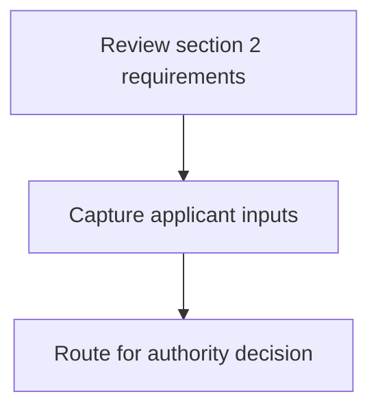
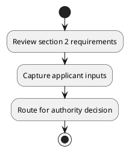

# Chapter 8 / Section 2: Representative of Bureau of India Standard (BIS):Member

**Chapter Title:** Quality Complaints and Trade Disputes

**Pages:** 3

**Purpose:** Defines the operational requirements for Representative of Bureau of India Standard (BIS):Member.

**Purpose Thanglish:** Indha Representative of Bureau of India Standard (BIS):Member section-la, Defines the operational requirements for Representative of Bureau of India Standard (BIS):Member.

**Summary:** 2. Representative of Bureau of India Standard (BIS):Member

**Business Meaning:** 2.

**Business Explanation:** 2. Representative of Bureau of India Standard (BIS):Member

**Business Explanation Thanglish:** Indha Representative of Bureau of India Standard (BIS):Member section-la, 2. Representative of Bureau of India Standard (BIS):Member

## Business Logic
- None identified

## Business Rules
- rule_id=CH8-SEC2-R001, rule_description=2. Representative of Bureau of India Standard (BIS):Member, trigger=Representative of Bureau of India Standard (BIS):Member, condition=Not explicitly covered in uploaded documents., validation=Not explicitly covered in uploaded documents., action=Manual review required., exception=No explicit exception found in uploaded documents., output=DEKAI should produce a compliance decision for 2 - Representative of Bureau of India Standard (BIS):Member.

## Conditions
- None identified

## Condition Logic
- None identified

## Validations
- None identified

## Exceptions
- None identified

## Dependencies
- None identified

## Authorities
- None identified

## Required Documents
- None identified

## Timelines
- None identified

## Actions
- None identified

## Workflow
- Review section 2 requirements
- Capture applicant inputs
- Route for authority decision

## Workflow ASCII
```text
Representative of Bureau of India Standard (BIS):Member
Review section 2 requirements
   |
   v
Capture applicant inputs
   |
   v
Route for authority decision
```

## Decision Tree
- IF section 2 applies THEN proceed with standard DGFT workflow

## Decision Tree ASCII
```text
Representative of Bureau of India Standard (BIS):Member Decision
IF section 2 applies THEN proceed with standard DGFT workflow
```

## Examples
- User asks to process Representative of Bureau of India Standard (BIS):Member; the platform checks conditions, validations, and documents before action.

**Real-world Example:** Example: an importer or exporter invokes Representative of Bureau of India Standard (BIS):Member, submits the prescribed DGFT records, and DEKAI uses the extracted rules to follow the representative of bureau of india standard (bis):member process.

**Real-world Example Thanglish:** Indha Representative of Bureau of India Standard (BIS):Member section-la, Example: an importer or exporter invokes Representative of Bureau of India Standard (BIS):Member, submits the prescribed DGFT records, and DEKAI uses the extracted rules to follow the representative of bureau of india standard (bis):member process.

## AI Rules
- None identified

## Database Fields
- name=section_code, type=string, required=True, source=parsed_section_heading
- name=section_title, type=string, required=True, source=parsed_section_heading
- name=bis_flag, type=boolean, required=False, source=keyword:BIS
- name=india_flag, type=boolean, required=False, source=keyword:India
- name=bureau_flag, type=boolean, required=False, source=keyword:Bureau
- name=member_flag, type=boolean, required=False, source=keyword:Member
- name=standard_flag, type=boolean, required=False, source=keyword:Standard
- name=representative_flag, type=boolean, required=False, source=keyword:Representative

## API Requirements
- method=GET, path=/api/dgft/sections/2, purpose=Retrieve knowledge payload for section 2, query_params=['include=workflow,decision_tree,validations'], response_fields=['section', 'title', 'summary', 'conditions', 'validations', 'exceptions', 'workflow', 'decision_tree']
- method=POST, path=/api/dgft/Representative-of-Bureau-of-India-Standard-BIS-Member/validate, purpose=Validate inputs and documents for Representative of Bureau of India Standard (BIS):Member, request_fields=['section_code', 'section_title'], response_fields=['status', 'errors', 'warnings', 'next_actions']

## UI Screens
- screen_id=Representative_of_Bureau_of_India_Standard_BIS_Member_overview, name=Representative of Bureau of India Standard (BIS):Member Overview, purpose=Show section summary, authority, timeline, and eligibility cues., widgets=['summary_card', 'conditions_table', 'authority_badges', 'timeline_panel']
- screen_id=Representative_of_Bureau_of_India_Standard_BIS_Member_submission, name=Representative of Bureau of India Standard (BIS):Member Submission, purpose=Capture applicant data and supporting documents., widgets=['dynamic_form', 'document_uploader', 'validation_panel', 'next_action_footer'], fields=['section_code', 'section_title', 'bis_flag', 'india_flag', 'bureau_flag', 'member_flag', 'standard_flag', 'representative_flag']

## Error Messages
- Validation failed because the section requirements were not fully met.

## FAQ
- question_en=What is the purpose of section 2?, answer_en=2. Representative of Bureau of India Standard (BIS):Member, question_thanglish=Indha Representative of Bureau of India Standard (BIS):Member section-la, What is the purpose of section 2?, answer_thanglish=Indha Representative of Bureau of India Standard (BIS):Member section-la, 2. Representative of Bureau of India Standard (BIS):Member
- question_en=What documents are required under Representative of Bureau of India Standard (BIS):Member?, answer_en=Not explicitly covered in uploaded documents., question_thanglish=Indha Representative of Bureau of India Standard (BIS):Member section-la, What documents are required under Representative of Bureau of India Standard (BIS):Member?, answer_thanglish=Indha Representative of Bureau of India Standard (BIS):Member section-la, Not explicitly covered in uploaded documents.
- question_en=Which authority handles Representative of Bureau of India Standard (BIS):Member?, answer_en=Not explicitly covered in uploaded documents., question_thanglish=Indha Representative of Bureau of India Standard (BIS):Member section-la, Which authority handles Representative of Bureau of India Standard (BIS):Member?, answer_thanglish=Indha Representative of Bureau of India Standard (BIS):Member section-la, Not explicitly covered in uploaded documents.

## Questions Users May Ask
- What does Representative of Bureau of India Standard (BIS):Member require?
- Which documents are needed for Representative of Bureau of India Standard (BIS):Member?
- How does DEKAI validate Representative of Bureau of India Standard (BIS):Member requests?

## Expected AI Answers
- Representative of Bureau of India Standard (BIS):Member requires the platform to interpret the section text, apply the extracted business rules, and present the correct next action.
- Required documents are inferred from the section text: no explicit documents were detected.
- DEKAI validates Representative of Bureau of India Standard (BIS):Member by checking conditions, required documents, authority references, and exception clauses before recommending an outcome.

## AI Q&A Examples
- question_en=User asks: How do I comply with Representative of Bureau of India Standard (BIS):Member?, answer_en=AI answers: DEKAI should evaluate section 2, apply the extracted rules, and guide the user through Review section 2 requirements., question_thanglish=Indha Representative of Bureau of India Standard (BIS):Member section-la, User asks: How do I comply with Representative of Bureau of India Standard (BIS):Member?, answer_thanglish=Indha Representative of Bureau of India Standard (BIS):Member section-la, AI answers: DEKAI should evaluate section 2, apply the extracted rules, and guide the user through Review section 2 requirements.
- question_en=User asks: Which validations apply to Representative of Bureau of India Standard (BIS):Member?, answer_en=AI answers: Applicable validations are not explicitly covered in the uploaded documents., question_thanglish=Indha Representative of Bureau of India Standard (BIS):Member section-la, User asks: Which validations apply to Representative of Bureau of India Standard (BIS):Member?, answer_thanglish=Indha Representative of Bureau of India Standard (BIS):Member section-la, AI answers: Applicable validations are not explicitly covered in the uploaded documents.

## DEKAI AI Implementation Notes
- Capture chapter 8, section 2, title, and page references as immutable knowledge metadata.
- Bind validations for Representative of Bureau of India Standard (BIS):Member into a rule engine keyed by the rule IDs extracted for this section.

## DEKAI AI Implementation Notes Thanglish
- Indha Representative of Bureau of India Standard (BIS):Member section-la, Capture chapter 8, section 2, title, and page references as immutable knowledge metadata.
- Indha Representative of Bureau of India Standard (BIS):Member section-la, Bind validations for Representative of Bureau of India Standard (BIS):Member into a rule engine keyed by the rule IDs extracted for this section.

## AI Metadata
- Keywords: BIS, India, Bureau, Member, Standard, Representative
- Search Keywords: BIS, India, Bureau, Member, Standard, Representative
- Intent: Provide knowledge guidance for Representative of Bureau of India Standard (BIS):Member.
- Tags: 2, Representative of Bureau of India Standard (BIS):Member, dgft
- Related Sections: 
- Related Chapters: 
- Related Rules: 

## Mermaid


## PlantUML

