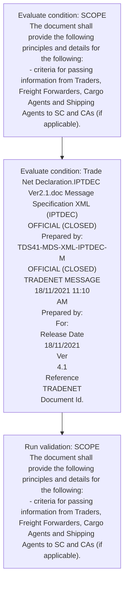
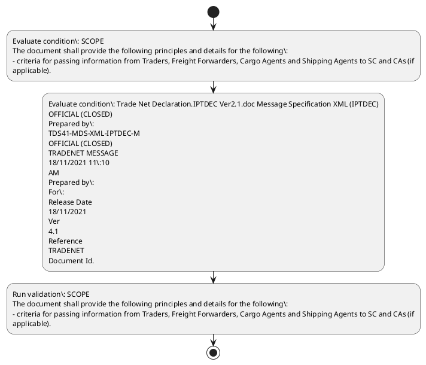

# Chapter  / Section 2: SCOPE

**Chapter Title:** TradeNetDeclaration.IPTDEC Ver2.1 (2)

**Pages:** 2, 3

**Purpose:** SCOPE
The document shall provide the following principles and details for the following:
- criteria for passing information from Traders, Freight Forwarders, Cargo Agents and Shipping Agents to SC and CAs (if
applicable).

**Purpose Thanglish:** Indha SCOPE section-la, SCOPE
The document kandippa provide the following principles and details for the following:
- criteria for passing information from Traders, Freight Forwarders, Cargo Agents and Shipping Agents to SC and CAs (if
applicable).

**Summary:** 2. SCOPE
The document shall provide the following principles and details for the following:
- criteria for passing information from Traders, Freight Forwarders, Cargo Agents and Shipping Agents to SC and CAs (if
applicable). - message format.

**Business Meaning:** SCOPE governs how DGFT business controls should be applied, validated, and enforced.

**Business Explanation:** SCOPE explains the operating rule set that DEKAI should enforce. Key control points include SCOPE
The document shall provide the following principles and details for the following:
- criteria for passing information from Traders, Freight Forwarders, Cargo Agents and Shipping Agents to SC and CAs (if
applicable).

**Business Explanation Thanglish:** Indha SCOPE section-la, SCOPE explains the operating rule set that DEKAI should enforce. Key control points include SCOPE
The document kandippa provide the following principles and details for the following:
- criteria for passing information from Traders, Freight Forwarders, Cargo Agents and Shipping Agents to SC and CAs (if
applicable).

## Business Logic
- SCOPE
The document shall provide the following principles and details for the following:
- criteria for passing information from Traders, Freight Forwarders, Cargo Agents and Shipping Agents to SC and CAs (if
applicable).

## Business Rules
- rule_id=CH-SEC2-R001, rule_description=SCOPE
The document shall provide the following principles and details for the following:
- criteria for passing information from Traders, Freight Forwarders, Cargo Agents and Shipping Agents to SC and CAs (if
applicable)., trigger=SCOPE, condition=SCOPE
The document shall provide the following principles and details for the following:
- criteria for passing information from Traders, Freight Forwarders, Cargo Agents and Shipping Agents to SC and CAs (if
applicable)., validation=SCOPE
The document shall provide the following principles and details for the following:
- criteria for passing information from Traders, Freight Forwarders, Cargo Agents and Shipping Agents to SC and CAs (if
applicable)., action=Manual review required., exception=No explicit exception found in uploaded documents., output=DEKAI should produce a compliance decision for 2 - SCOPE.

## Conditions
- SCOPE
The document shall provide the following principles and details for the following:
- criteria for passing information from Traders, Freight Forwarders, Cargo Agents and Shipping Agents to SC and CAs (if
applicable).
- Trade Net Declaration.IPTDEC Ver2.1.doc Message Specification XML (IPTDEC)
OFFICIAL (CLOSED)
Prepared by:
TDS41-MDS-XML-IPTDEC-M
OFFICIAL (CLOSED)
TRADENET MESSAGE
18/11/2021 11:10
AM
Prepared by:
For:
Release Date
18/11/2021
Ver
4.1
Reference
TRADENET
Document Id.

## Condition Logic
- id=.2.1, if=SCOPE
The document shall provide the following principles and details for the following:
- criteria for passing information from Traders, Freight Forwarders, Cargo Agents and Shipping Agents to SC and CAs (if
applicable)., then=Route for review, source=SCOPE
The document shall provide the following principles and details for the following:
- criteria for passing information from Traders, Freight Forwarders, Cargo Agents and Shipping Agents to SC and CAs (if
applicable).
- id=.2.2, if=Trade Net Declaration.IPTDEC Ver2.1.doc Message Specification XML (IPTDEC)
OFFICIAL (CLOSED)
Prepared by:
TDS41-MDS-XML-IPTDEC-M
OFFICIAL (CLOSED)
TRADENET MESSAGE
18/11/2021 11:10
AM
Prepared by:
For:
Release Date
18/11/2021
Ver
4.1
Reference
TRADENET
Document Id., then=Route for review, source=Trade Net Declaration.IPTDEC Ver2.1.doc Message Specification XML (IPTDEC)
OFFICIAL (CLOSED)
Prepared by:
TDS41-MDS-XML-IPTDEC-M
OFFICIAL (CLOSED)
TRADENET MESSAGE
18/11/2021 11:10
AM
Prepared by:
For:
Release Date
18/11/2021
Ver
4.1
Reference
TRADENET
Document Id.

## Validations
- SCOPE
The document shall provide the following principles and details for the following:
- criteria for passing information from Traders, Freight Forwarders, Cargo Agents and Shipping Agents to SC and CAs (if
applicable).

## Exceptions
- None identified

## Dependencies
- 1
- 3
- 4
- 8

## Authorities
- None identified

## Required Documents
- SCOPE
The document shall provide the following principles and details for the following:
- criteria for passing information from Traders, Freight Forwarders, Cargo Agents and Shipping Agents to SC and CAs (if
applicable).
- The segments, composite data elements, data elements and codes used in this document are based on the respective
directories in the UN/CEFACT.
- Trade Net Declaration

## Timelines
- None identified

## Actions
- None identified

## Workflow
- Evaluate condition: SCOPE
The document shall provide the following principles and details for the following:
- criteria for passing information from Traders, Freight Forwarders, Cargo Agents and Shipping Agents to SC and CAs (if
applicable).
- Evaluate condition: Trade Net Declaration.IPTDEC Ver2.1.doc Message Specification XML (IPTDEC)
OFFICIAL (CLOSED)
Prepared by:
TDS41-MDS-XML-IPTDEC-M
OFFICIAL (CLOSED)
TRADENET MESSAGE
18/11/2021 11:10
AM
Prepared by:
For:
Release Date
18/11/2021
Ver
4.1
Reference
TRADENET
Document Id.
- Run validation: SCOPE
The document shall provide the following principles and details for the following:
- criteria for passing information from Traders, Freight Forwarders, Cargo Agents and Shipping Agents to SC and CAs (if
applicable).

## Workflow ASCII
```text
SCOPE
Evaluate condition: SCOPE
The document shall provide the following principles and details for the following:
- criteria for passing information from Traders, Freight Forwarders, Cargo Agents and Shipping Agents to SC and CAs (if
applicable).
   |
   v
Evaluate condition: Trade Net Declaration.IPTDEC Ver2.1.doc Message Specification XML (IPTDEC)
OFFICIAL (CLOSED)
Prepared by:
TDS41-MDS-XML-IPTDEC-M
OFFICIAL (CLOSED)
TRADENET MESSAGE
18/11/2021 11:10
AM
Prepared by:
For:
Release Date
18/11/2021
Ver
4.1
Reference
TRADENET
Document Id.
   |
   v
Run validation: SCOPE
The document shall provide the following principles and details for the following:
- criteria for passing information from Traders, Freight Forwarders, Cargo Agents and Shipping Agents to SC and CAs (if
applicable).
```

## Decision Tree
- IF section 2 applies THEN proceed with standard DGFT workflow

## Decision Tree ASCII
```text
SCOPE Decision
IF section 2 applies THEN proceed with standard DGFT workflow
```

## Examples
- User asks to process SCOPE; the platform checks conditions, validations, and documents before action.

**Real-world Example:** Example: an importer or exporter invokes SCOPE, submits SCOPE
The document shall provide the following principles and details for the following:
- criteria for passing information from Traders, Freight Forwarders, Cargo Agents and Shipping Agents to SC and CAs (if
applicable)., The segments, composite data elements, data elements and codes used in this document are based on the respective
directories in the UN/CEFACT., Trade Net Declaration, and DEKAI uses the extracted rules to follow the scope process.

**Real-world Example Thanglish:** Indha SCOPE section-la, Example: an importer or exporter invokes SCOPE, submits SCOPE
The document kandippa provide the following principles and details for the following:
- criteria for passing information from Traders, Freight Forwarders, Cargo Agents and Shipping Agents to SC and CAs (if
applicable)., The segments, composite data elements, data elements and codes used in this document are based on the respective
directories in the UN/CEFACT., Trade Net Declaration, and DEKAI uses the extracted rules to follow the scope process.

## AI Rules
- IF detected context matches section rule THEN enforce: SCOPE
The document shall provide the following principles and details for the following:
- criteria for passing information from Traders, Freight Forwarders, Cargo Agents and Shipping Agents to SC and CAs (if
applicable).

## Database Fields
- name=section_code, type=string, required=True, source=parsed_section_heading
- name=section_title, type=string, required=True, source=parsed_section_heading
- name=the_flag, type=boolean, required=False, source=keyword:The
- name=and_flag, type=boolean, required=False, source=keyword:and
- name=for_flag, type=boolean, required=False, source=keyword:for
- name=cas_flag, type=boolean, required=False, source=keyword:CAs
- name=are_flag, type=boolean, required=False, source=keyword:are
- name=net_flag, type=boolean, required=False, source=keyword:Net
- name=doc_flag, type=boolean, required=False, source=keyword:doc
- name=xml_flag, type=boolean, required=False, source=keyword:XML
- name=document_1_submitted, type=boolean, required=True, source=SCOPE
The document shall provide the following principles and details for the following:
- criteria for passing information from Traders, Freight Forwarders, Cargo Agents and Shipping Agents to SC and CAs (if
applicable).
- name=document_2_submitted, type=boolean, required=True, source=The segments, composite data elements, data elements and codes used in this document are based on the respective
directories in the UN/CEFACT.
- name=document_3_submitted, type=boolean, required=True, source=Trade Net Declaration

## API Requirements
- method=GET, path=/api/dgft/sections/2, purpose=Retrieve knowledge payload for section 2, query_params=['include=workflow,decision_tree,validations'], response_fields=['section', 'title', 'summary', 'conditions', 'validations', 'exceptions', 'workflow', 'decision_tree']
- method=POST, path=/api/dgft/SCOPE/validate, purpose=Validate inputs and documents for SCOPE, request_fields=['section_code', 'section_title', 'document_1_submitted', 'document_2_submitted', 'document_3_submitted'], response_fields=['status', 'errors', 'warnings', 'next_actions']

## UI Screens
- screen_id=SCOPE_overview, name=SCOPE Overview, purpose=Show section summary, authority, timeline, and eligibility cues., widgets=['summary_card', 'conditions_table', 'authority_badges', 'timeline_panel']
- screen_id=SCOPE_submission, name=SCOPE Submission, purpose=Capture applicant data and supporting documents., widgets=['dynamic_form', 'document_uploader', 'validation_panel', 'next_action_footer'], fields=['section_code', 'section_title', 'the_flag', 'and_flag', 'for_flag', 'cas_flag', 'are_flag', 'net_flag']

## Error Messages
- Validation failed because the section requirements were not fully met.

## FAQ
- question_en=What is the purpose of section 2?, answer_en=SCOPE explains the operating rule set that DEKAI should enforce. Key control points include SCOPE
The document shall provide the following principles and details for the following:
- criteria for passing information from Traders, Freight Forwarders, Cargo Agents and Shipping Agents to SC and CAs (if
applicable)., question_thanglish=Indha SCOPE section-la, What is the purpose of section 2?, answer_thanglish=Indha SCOPE section-la, SCOPE explains the operating rule set that DEKAI should enforce. Key control points include SCOPE
The document kandippa provide the following principles and details for the following:
- criteria for passing information from Traders, Freight Forwarders, Cargo Agents and Shipping Agents to SC and CAs (if
applicable).
- question_en=What documents are required under SCOPE?, answer_en=SCOPE
The document shall provide the following principles and details for the following:
- criteria for passing information from Traders, Freight Forwarders, Cargo Agents and Shipping Agents to SC and CAs (if
applicable)., The segments, composite data elements, data elements and codes used in this document are based on the respective
directories in the UN/CEFACT., Trade Net Declaration, question_thanglish=Indha SCOPE section-la, What documents are required under SCOPE?, answer_thanglish=Indha SCOPE section-la, SCOPE
The document kandippa provide the following principles and details for the following:
- criteria for passing information from Traders, Freight Forwarders, Cargo Agents and Shipping Agents to SC and CAs (if
applicable)., The segments, composite data elements, data elements and codes used in this document are based on the respective
directories in the UN/CEFACT., Trade Net Declaration
- question_en=Which authority handles SCOPE?, answer_en=Not explicitly covered in uploaded documents., question_thanglish=Indha SCOPE section-la, Which authority handles SCOPE?, answer_thanglish=Indha SCOPE section-la, Not explicitly covered in uploaded documents.

## Questions Users May Ask
- What does SCOPE require?
- Which documents are needed for SCOPE?
- How does DEKAI validate SCOPE requests?

## Expected AI Answers
- SCOPE requires the platform to interpret the section text, apply the extracted business rules, and present the correct next action.
- Required documents are inferred from the section text: SCOPE
The document shall provide the following principles and details for the following:
- criteria for passing information from Traders, Freight Forwarders, Cargo Agents and Shipping Agents to SC and CAs (if
applicable)., The segments, composite data elements, data elements and codes used in this document are based on the respective
directories in the UN/CEFACT., Trade Net Declaration
- DEKAI validates SCOPE by checking conditions, required documents, authority references, and exception clauses before recommending an outcome.

## AI Q&A Examples
- question_en=User asks: How do I comply with SCOPE?, answer_en=AI answers: DEKAI should evaluate section 2, apply the extracted rules, and guide the user through Evaluate condition: SCOPE
The document shall provide the following principles and details for the following:
- criteria for passing information from Traders, Freight Forwarders, Cargo Agents and Shipping Agents to SC and CAs (if
applicable).., question_thanglish=Indha SCOPE section-la, User asks: How do I comply with SCOPE?, answer_thanglish=Indha SCOPE section-la, AI answers: DEKAI should evaluate section 2, apply the extracted rules, and guide the user through Evaluate condition: SCOPE
The document kandippa provide the following principles and details for the following:
- criteria for passing information from Traders, Freight Forwarders, Cargo Agents and Shipping Agents to SC and CAs (if
applicable)..
- question_en=User asks: Which validations apply to SCOPE?, answer_en=AI answers: Applicable validations are SCOPE
The document shall provide the following principles and details for the following:
- criteria for passing information from Traders, Freight Forwarders, Cargo Agents and Shipping Agents to SC and CAs (if
applicable)., question_thanglish=Indha SCOPE section-la, User asks: Which validations apply to SCOPE?, answer_thanglish=Indha SCOPE section-la, AI answers: Applicable validations are SCOPE
The document kandippa provide the following principles and details for the following:
- criteria for passing information from Traders, Freight Forwarders, Cargo Agents and Shipping Agents to SC and CAs (if
applicable).

## DEKAI AI Implementation Notes
- Capture chapter , section 2, title, and page references as immutable knowledge metadata.
- Bind validations for SCOPE into a rule engine keyed by the rule IDs extracted for this section.
- Expose document upload controls for: SCOPE
The document shall provide the following principles and details for the following:
- criteria for passing information from Traders, Freight Forwarders, Cargo Agents and Shipping Agents to SC and CAs (if
applicable)., The segments, composite data elements, data elements and codes used in this document are based on the respective
directories in the UN/CEFACT., Trade Net Declaration.
- Show contextual links to related sections: 1, 3, 4, 8.

## DEKAI AI Implementation Notes Thanglish
- Indha SCOPE section-la, Capture chapter , section 2, title, and page references as immutable knowledge metadata.
- Indha SCOPE section-la, Bind validations for SCOPE into a rule engine keyed by the rule IDs extracted for this section.
- Indha SCOPE section-la, Expose document upload controls for: SCOPE
The document kandippa provide the following principles and details for the following:
- criteria for passing information from Traders, Freight Forwarders, Cargo Agents and Shipping Agents to SC and CAs (if
applicable)., The segments, composite data elements, data elements and codes used in this document are based on the respective
directories in the UN/CEFACT., Trade Net Declaration.
- Indha SCOPE section-la, Show contextual links to related sections: 1, 3, 4, 8.

## AI Metadata
- Keywords: The, and, for, CAs, are, Net, doc, XML, Ver, from, data, used, this, more, Date, SCOPE, shall, Cargo, codes, based
- Search Keywords: The, and, for, CAs, are, Net, doc, XML, Ver, from, data, used, this, more, Date, SCOPE, shall, Cargo, codes, based
- Intent: Provide knowledge guidance for SCOPE.
- Tags: 2, SCOPE, business-rule, document-driven, dgft
- Related Sections: 1, 3, 4, 8
- Related Chapters: 
- Related Rules: SCOPE
The document shall provide the following principles and details for the following:
- criteria for passing information from Traders, Freight Forwarders, Cargo Agents and Shipping Agents to SC and CAs (if
applicable).

## Mermaid


## PlantUML

