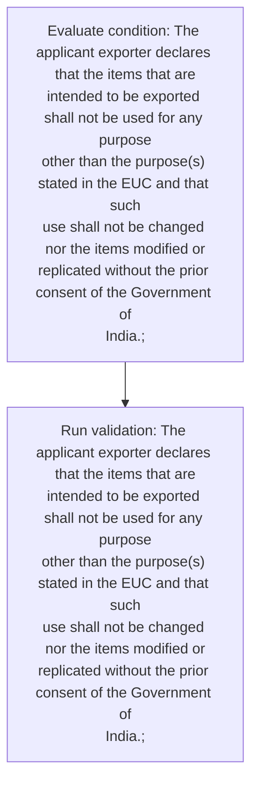
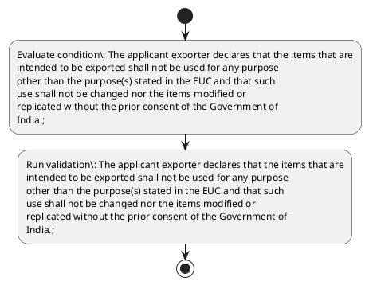

# Chapter 10 / Section 2: The applicant exporter declares that the items that are

**Chapter Title:** SCOMET: Special Chemicals, Organisms, Materials, Equipment and Technologies

**Pages:** 29

**Purpose:** The applicant exporter declares that the items that are
intended to be exported shall not be used for any purpose
other than the purpose(s) stated in the EUC and that such
use shall not be changed nor the items modified or
replicated without the prior consent of the Government of
India.;

**Purpose Thanglish:** Indha The applicant exporter declares that the items that are section-la, The applicant exporter declares that the items that are
intended to be exported kandippa not be used for any purpose
other than the purpose(s) stated in the EUC and that such
use kandippa not be changed nor the items modified or
replicated without the prior consent of the Government of
India.;

**Summary:** 2. The applicant exporter declares that the items that are
intended to be exported shall not be used for any purpose
other than the purpose(s) stated in the EUC and that such
use shall not be changed nor the items modified or
replicated without the prior consent of the Government of
India.;

**Business Meaning:** The applicant exporter declares that the items that are governs how DGFT business controls should be applied, validated, and enforced.

**Business Explanation:** The applicant exporter declares that the items that are explains the operating rule set that DEKAI should enforce. Key control points include The applicant exporter declares that the items that are
intended to be exported shall not be used for any purpose
other than the purpose(s) stated in the EUC and that such
use shall not be changed nor the items modified or
replicated without the prior consent of the Government of
India.;

**Business Explanation Thanglish:** Indha The applicant exporter declares that the items that are section-la, The applicant exporter declares that the items that are explains the operating rule set that DEKAI should enforce. Key control points include The applicant exporter declares that the items that are
intended to be exported kandippa not be used for any purpose
other than the purpose(s) stated in the EUC and that such
use kandippa not be changed nor the items modified or
replicated without the prior consent of the Government of
India.;

## Business Logic
- The applicant exporter declares that the items that are
intended to be exported shall not be used for any purpose
other than the purpose(s) stated in the EUC and that such
use shall not be changed nor the items modified or
replicated without the prior consent of the Government of
India.;

## Business Rules
- rule_id=CH10-SEC2-R001, rule_description=The applicant exporter declares that the items that are
intended to be exported shall not be used for any purpose
other than the purpose(s) stated in the EUC and that such
use shall not be changed nor the items modified or
replicated without the prior consent of the Government of
India.;, trigger=The applicant exporter declares that the items that are, condition=The applicant exporter declares that the items that are
intended to be exported shall not be used for any purpose
other than the purpose(s) stated in the EUC and that such
use shall not be changed nor the items modified or
replicated without the prior consent of the Government of
India.;, validation=The applicant exporter declares that the items that are
intended to be exported shall not be used for any purpose
other than the purpose(s) stated in the EUC and that such
use shall not be changed nor the items modified or
replicated without the prior consent of the Government of
India.;, action=Manual review required., exception=No explicit exception found in uploaded documents., output=DEKAI should produce a compliance decision for 2 - The applicant exporter declares that the items that are.

## Conditions
- The applicant exporter declares that the items that are
intended to be exported shall not be used for any purpose
other than the purpose(s) stated in the EUC and that such
use shall not be changed nor the items modified or
replicated without the prior consent of the Government of
India.;

## Condition Logic
- id=10.2.1, if=The applicant exporter declares that the items that are
intended to be exported shall not be used for any purpose
other than the purpose(s) stated in the EUC and that such
use shall not be changed nor the items modified or
replicated without the prior consent of the Government of
India.;, then=Route for review, source=The applicant exporter declares that the items that are
intended to be exported shall not be used for any purpose
other than the purpose(s) stated in the EUC and that such
use shall not be changed nor the items modified or
replicated without the prior consent of the Government of
India.;

## Validations
- The applicant exporter declares that the items that are
intended to be exported shall not be used for any purpose
other than the purpose(s) stated in the EUC and that such
use shall not be changed nor the items modified or
replicated without the prior consent of the Government of
India.;

## Exceptions
- None identified

## Dependencies
- None identified

## Authorities
- None identified

## Required Documents
- None identified

## Timelines
- None identified

## Actions
- None identified

## Workflow
- Evaluate condition: The applicant exporter declares that the items that are
intended to be exported shall not be used for any purpose
other than the purpose(s) stated in the EUC and that such
use shall not be changed nor the items modified or
replicated without the prior consent of the Government of
India.;
- Run validation: The applicant exporter declares that the items that are
intended to be exported shall not be used for any purpose
other than the purpose(s) stated in the EUC and that such
use shall not be changed nor the items modified or
replicated without the prior consent of the Government of
India.;

## Workflow ASCII
```text
The applicant exporter declares that the items that are
Evaluate condition: The applicant exporter declares that the items that are
intended to be exported shall not be used for any purpose
other than the purpose(s) stated in the EUC and that such
use shall not be changed nor the items modified or
replicated without the prior consent of the Government of
India.;
   |
   v
Run validation: The applicant exporter declares that the items that are
intended to be exported shall not be used for any purpose
other than the purpose(s) stated in the EUC and that such
use shall not be changed nor the items modified or
replicated without the prior consent of the Government of
India.;
```

## Decision Tree
- IF section 2 applies THEN proceed with standard DGFT workflow

## Decision Tree ASCII
```text
The applicant exporter declares that the items that are Decision
IF section 2 applies THEN proceed with standard DGFT workflow
```

## Examples
- User asks to process The applicant exporter declares that the items that are; the platform checks conditions, validations, and documents before action.

**Real-world Example:** Example: an importer or exporter invokes The applicant exporter declares that the items that are, submits the prescribed DGFT records, and DEKAI uses the extracted rules to follow the the applicant exporter declares that the items that are process.

**Real-world Example Thanglish:** Indha The applicant exporter declares that the items that are section-la, Example: an importer or exporter invokes The applicant exporter declares that the items that are, submits the prescribed DGFT records, and DEKAI uses the extracted rules to follow the the applicant exporter declares that the items that are process.

## AI Rules
- IF detected context matches section rule THEN enforce: The applicant exporter declares that the items that are
intended to be exported shall not be used for any purpose
other than the purpose(s) stated in the EUC and that such
use shall not be changed nor the items modified or
replicated without the prior consent of the Government of
India.;

## Database Fields
- name=section_code, type=string, required=True, source=parsed_section_heading
- name=section_title, type=string, required=True, source=parsed_section_heading
- name=the_flag, type=boolean, required=False, source=keyword:The
- name=are_flag, type=boolean, required=False, source=keyword:are
- name=not_flag, type=boolean, required=False, source=keyword:not
- name=for_flag, type=boolean, required=False, source=keyword:for
- name=any_flag, type=boolean, required=False, source=keyword:any
- name=euc_flag, type=boolean, required=False, source=keyword:EUC
- name=and_flag, type=boolean, required=False, source=keyword:and
- name=use_flag, type=boolean, required=False, source=keyword:use

## API Requirements
- method=GET, path=/api/dgft/sections/2, purpose=Retrieve knowledge payload for section 2, query_params=['include=workflow,decision_tree,validations'], response_fields=['section', 'title', 'summary', 'conditions', 'validations', 'exceptions', 'workflow', 'decision_tree']
- method=POST, path=/api/dgft/The-applicant-exporter-declares-that-the-items-that-are/validate, purpose=Validate inputs and documents for The applicant exporter declares that the items that are, request_fields=['section_code', 'section_title'], response_fields=['status', 'errors', 'warnings', 'next_actions']

## UI Screens
- screen_id=The_applicant_exporter_declares_that_the_items_that_are_overview, name=The applicant exporter declares that the items that are Overview, purpose=Show section summary, authority, timeline, and eligibility cues., widgets=['summary_card', 'conditions_table', 'authority_badges', 'timeline_panel']
- screen_id=The_applicant_exporter_declares_that_the_items_that_are_submission, name=The applicant exporter declares that the items that are Submission, purpose=Capture applicant data and supporting documents., widgets=['dynamic_form', 'document_uploader', 'validation_panel', 'next_action_footer'], fields=['section_code', 'section_title', 'the_flag', 'are_flag', 'not_flag', 'for_flag', 'any_flag', 'euc_flag']

## Error Messages
- Validation failed because the section requirements were not fully met.

## FAQ
- question_en=What is the purpose of section 2?, answer_en=The applicant exporter declares that the items that are explains the operating rule set that DEKAI should enforce. Key control points include The applicant exporter declares that the items that are
intended to be exported shall not be used for any purpose
other than the purpose(s) stated in the EUC and that such
use shall not be changed nor the items modified or
replicated without the prior consent of the Government of
India.;, question_thanglish=Indha The applicant exporter declares that the items that are section-la, What is the purpose of section 2?, answer_thanglish=Indha The applicant exporter declares that the items that are section-la, The applicant exporter declares that the items that are explains the operating rule set that DEKAI should enforce. Key control points include The applicant exporter declares that the items that are
intended to be exported kandippa not be used for any purpose
other than the purpose(s) stated in the EUC and that such
use kandippa not be changed nor the items modified or
replicated without the prior consent of the Government of
India.;
- question_en=What documents are required under The applicant exporter declares that the items that are?, answer_en=Not explicitly covered in uploaded documents., question_thanglish=Indha The applicant exporter declares that the items that are section-la, What documents are required under The applicant exporter declares that the items that are?, answer_thanglish=Indha The applicant exporter declares that the items that are section-la, Not explicitly covered in uploaded documents.
- question_en=Which authority handles The applicant exporter declares that the items that are?, answer_en=Not explicitly covered in uploaded documents., question_thanglish=Indha The applicant exporter declares that the items that are section-la, Which authority handles The applicant exporter declares that the items that are?, answer_thanglish=Indha The applicant exporter declares that the items that are section-la, Not explicitly covered in uploaded documents.

## Questions Users May Ask
- What does The applicant exporter declares that the items that are require?
- Which documents are needed for The applicant exporter declares that the items that are?
- How does DEKAI validate The applicant exporter declares that the items that are requests?

## Expected AI Answers
- The applicant exporter declares that the items that are requires the platform to interpret the section text, apply the extracted business rules, and present the correct next action.
- Required documents are inferred from the section text: no explicit documents were detected.
- DEKAI validates The applicant exporter declares that the items that are by checking conditions, required documents, authority references, and exception clauses before recommending an outcome.

## AI Q&A Examples
- question_en=User asks: How do I comply with The applicant exporter declares that the items that are?, answer_en=AI answers: DEKAI should evaluate section 2, apply the extracted rules, and guide the user through Evaluate condition: The applicant exporter declares that the items that are
intended to be exported shall not be used for any purpose
other than the purpose(s) stated in the EUC and that such
use shall not be changed nor the items modified or
replicated without the prior consent of the Government of
India.;., question_thanglish=Indha The applicant exporter declares that the items that are section-la, User asks: How do I comply with The applicant exporter declares that the items that are?, answer_thanglish=Indha The applicant exporter declares that the items that are section-la, AI answers: DEKAI should evaluate section 2, apply the extracted rules, and guide the user through Evaluate condition: The applicant exporter declares that the items that are
intended to be exported kandippa not be used for any purpose
other than the purpose(s) stated in the EUC and that such
use kandippa not be changed nor the items modified or
replicated without the prior consent of the Government of
India.;.
- question_en=User asks: Which validations apply to The applicant exporter declares that the items that are?, answer_en=AI answers: Applicable validations are The applicant exporter declares that the items that are
intended to be exported shall not be used for any purpose
other than the purpose(s) stated in the EUC and that such
use shall not be changed nor the items modified or
replicated without the prior consent of the Government of
India.;, question_thanglish=Indha The applicant exporter declares that the items that are section-la, User asks: Which validations apply to The applicant exporter declares that the items that are?, answer_thanglish=Indha The applicant exporter declares that the items that are section-la, AI answers: Applicable validations are The applicant exporter declares that the items that are
intended to be exported kandippa not be used for any purpose
other than the purpose(s) stated in the EUC and that such
use kandippa not be changed nor the items modified or
replicated without the prior consent of the Government of
India.;

## DEKAI AI Implementation Notes
- Capture chapter 10, section 2, title, and page references as immutable knowledge metadata.
- Bind validations for The applicant exporter declares that the items that are into a rule engine keyed by the rule IDs extracted for this section.

## DEKAI AI Implementation Notes Thanglish
- Indha The applicant exporter declares that the items that are section-la, Capture chapter 10, section 2, title, and page references as immutable knowledge metadata.
- Indha The applicant exporter declares that the items that are section-la, Bind validations for The applicant exporter declares that the items that are into a rule engine keyed by the rule IDs extracted for this section.

## AI Metadata
- Keywords: The, are, not, for, any, EUC, and, use, nor, that, used, than, such, items, shall, other, prior, India, stated, purpose
- Search Keywords: The, are, not, for, any, EUC, and, use, nor, that, used, than, such, items, shall, other, prior, India, stated, purpose
- Intent: Provide knowledge guidance for The applicant exporter declares that the items that are.
- Tags: 2, The applicant exporter declares that the items that are, business-rule, dgft
- Related Sections: 
- Related Chapters: 
- Related Rules: The applicant exporter declares that the items that are
intended to be exported shall not be used for any purpose
other than the purpose(s) stated in the EUC and that such
use shall not be changed nor the items modified or
replicated without the prior consent of the Government of
India.;

## Mermaid


## PlantUML

