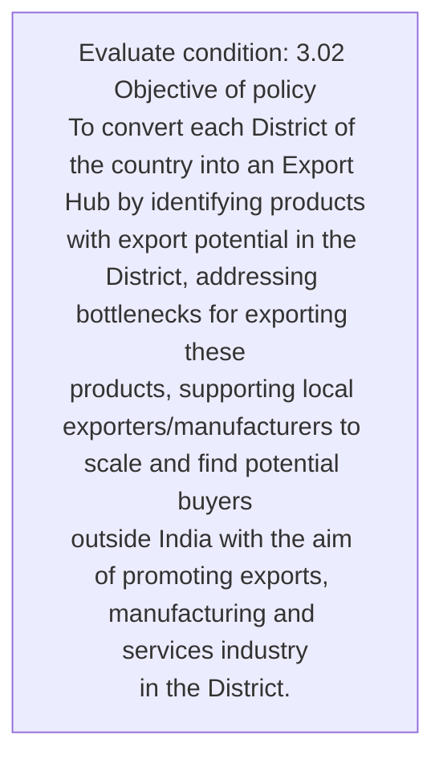
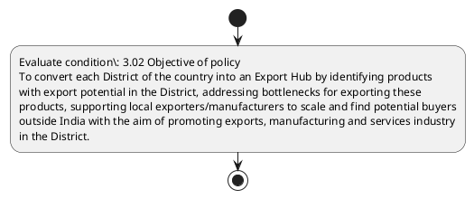

# Chapter 3 / Section 3.02: Objective of policy

**Chapter Title:** Developing Districts as Export Hubs

**Pages:** 2

**Purpose:** 3.02 Objective of policy
To convert each District of the country into an Export Hub by identifying products
with export potential in the District, addressing bottlenecks for exporting these
products, supporting local exporters/manufacturers to scale and find potential buyers
outside India with the aim of promoting exports, manufacturing and services industry
in the District.

**Purpose Thanglish:** Indha Objective of policy section-la, 3.02 Objective of policy
To convert each District of the country into an export Hub by identifying products
with export potential in the District, addressing bottlenecks for exporting these
products, supporting local exporters/manufacturers to scale and find potential buyers
outside India with the aim of promoting exports, manufacturing and services industry
in the District.

**Summary:** 3.02 Objective of policy
To convert each District of the country into an Export Hub by identifying products
with export potential in the District, addressing bottlenecks for exporting these
products, supporting local exporters/manufacturers to scale and find potential buyers
outside India with the aim of promoting exports, manufacturing and services industry
in the District. To enable a conducive foreign trade environment, any policy strategy
to boost exports formulated by the Central Government can only be effectively
implemented with the collaboration of State Governments and the District
Administration. Earlier, export promotion was a subject, primarily dealt by only the
Central government, without any active mechanism involving the State or District
level stakeholders into the decision making to promote goods and services produced
at the grassroots level.

**Business Meaning:** 3.02 Objective of policy
To convert each District of the country into an Export Hub by identifying products
with export potential in the District, addressing bottlenecks for exporting these
products, supporting local exporters/manufacturers to scale and find potential buyers
outside India with the aim of promoting exports, manufacturing and services industry
in the District.

**Business Explanation:** 3.02 Objective of policy
To convert each District of the country into an Export Hub by identifying products
with export potential in the District, addressing bottlenecks for exporting these
products, supporting local exporters/manufacturers to scale and find potential buyers
outside India with the aim of promoting exports, manufacturing and services industry
in the District. To enable a conducive foreign trade environment, any policy strategy
to boost exports formulated by the Central Government can only be effectively
implemented with the collaboration of State Governments and the District
Administration. Earlier, export promotion was a subject, primarily dealt by only the
Central government, without any active mechanism involving the State or District
level stakeholders into the decision making to promote goods and services produced
at the grassroots level.

**Business Explanation Thanglish:** Indha Objective of policy section-la, 3.02 Objective of policy
To convert each District of the country into an export Hub by identifying products
with export potential in the District, addressing bottlenecks for exporting these
products, supporting local exporters/manufacturers to scale and find potential buyers
outside India with the aim of promoting exports, manufacturing and services industry
in the District. To enable a conducive foreign trade environment, any policy strategy
to boost exports formulated by the Central Government can only be effectively
implemented with the collaboration of State Governments and the District
Administration. Earlier, export promotion was a subject, primarily dealt by only the
Central government, without any active mechanism involving the State or District
level stakeholders into the decision making to promote goods and services produced
at the grassroots level.

## Business Logic
- None identified

## Business Rules
- rule_id=CH3-SEC3_02-R001, rule_description=3.02 Objective of policy
To convert each District of the country into an Export Hub by identifying products
with export potential in the District, addressing bottlenecks for exporting these
products, supporting local exporters/manufacturers to scale and find potential buyers
outside India with the aim of promoting exports, manufacturing and services industry
in the District. To enable a conducive foreign trade environment, any policy strategy
to boost exports formulated by the Central Government can only be effectively
implemented with the collaboration of State Governments and the District
Administration. Earlier, export promotion was a subject, primarily dealt by only the
Central government, without any active mechanism involving the State or District
level stakeholders into the decision making to promote goods and services produced
at the grassroots level., trigger=Objective of policy, condition=3.02 Objective of policy
To convert each District of the country into an Export Hub by identifying products
with export potential in the District, addressing bottlenecks for exporting these
products, supporting local exporters/manufacturers to scale and find potential buyers
outside India with the aim of promoting exports, manufacturing and services industry
in the District., validation=Not explicitly covered in uploaded documents., action=Manual review required., exception=No explicit exception found in uploaded documents., output=DEKAI should produce a compliance decision for 3.02 - Objective of policy.

## Conditions
- 3.02 Objective of policy
To convert each District of the country into an Export Hub by identifying products
with export potential in the District, addressing bottlenecks for exporting these
products, supporting local exporters/manufacturers to scale and find potential buyers
outside India with the aim of promoting exports, manufacturing and services industry
in the District.

## Condition Logic
- id=3.3.02.1, if=3.02 Objective of policy
To convert each District of the country into an Export Hub by identifying products
with export potential in the District, addressing bottlenecks for exporting these
products, supporting local exporters/manufacturers to scale and find potential buyers
outside India with the aim of promoting exports, manufacturing and services industry
in the District., then=Route for review, source=3.02 Objective of policy
To convert each District of the country into an Export Hub by identifying products
with export potential in the District, addressing bottlenecks for exporting these
products, supporting local exporters/manufacturers to scale and find potential buyers
outside India with the aim of promoting exports, manufacturing and services industry
in the District.

## Validations
- None identified

## Exceptions
- None identified

## Dependencies
- None identified

## Authorities
- Central Government

## Required Documents
- None identified

## Timelines
- None identified

## Actions
- None identified

## Workflow
- Evaluate condition: 3.02 Objective of policy
To convert each District of the country into an Export Hub by identifying products
with export potential in the District, addressing bottlenecks for exporting these
products, supporting local exporters/manufacturers to scale and find potential buyers
outside India with the aim of promoting exports, manufacturing and services industry
in the District.

## Workflow ASCII
```text
Objective of policy
Evaluate condition: 3.02 Objective of policy
To convert each District of the country into an Export Hub by identifying products
with export potential in the District, addressing bottlenecks for exporting these
products, supporting local exporters/manufacturers to scale and find potential buyers
outside India with the aim of promoting exports, manufacturing and services industry
in the District.
```

## Decision Tree
- IF section 3.02 applies THEN proceed with standard DGFT workflow

## Decision Tree ASCII
```text
Objective of policy Decision
IF section 3.02 applies THEN proceed with standard DGFT workflow
```

## Examples
- User asks to process Objective of policy; the platform checks conditions, validations, and documents before action.

**Real-world Example:** Example: an importer or exporter invokes Objective of policy, submits the prescribed DGFT records, and DEKAI uses the extracted rules to follow the objective of policy process.

**Real-world Example Thanglish:** Indha Objective of policy section-la, Example: an importer or exporter invokes Objective of policy, submits the prescribed DGFT records, and DEKAI uses the extracted rules to follow the objective of policy process.

## AI Rules
- None identified

## Database Fields
- name=section_code, type=string, required=True, source=parsed_section_heading
- name=section_title, type=string, required=True, source=parsed_section_heading
- name=the_flag, type=boolean, required=False, source=keyword:the
- name=hub_flag, type=boolean, required=False, source=keyword:Hub
- name=for_flag, type=boolean, required=False, source=keyword:for
- name=and_flag, type=boolean, required=False, source=keyword:and
- name=aim_flag, type=boolean, required=False, source=keyword:aim
- name=any_flag, type=boolean, required=False, source=keyword:any
- name=can_flag, type=boolean, required=False, source=keyword:can
- name=was_flag, type=boolean, required=False, source=keyword:was

## API Requirements
- method=GET, path=/api/dgft/sections/3.02, purpose=Retrieve knowledge payload for section 3.02, query_params=['include=workflow,decision_tree,validations'], response_fields=['section', 'title', 'summary', 'conditions', 'validations', 'exceptions', 'workflow', 'decision_tree']
- method=POST, path=/api/dgft/Objective-of-policy/validate, purpose=Validate inputs and documents for Objective of policy, request_fields=['section_code', 'section_title'], response_fields=['status', 'errors', 'warnings', 'next_actions']

## UI Screens
- screen_id=Objective_of_policy_overview, name=Objective of policy Overview, purpose=Show section summary, authority, timeline, and eligibility cues., widgets=['summary_card', 'conditions_table', 'authority_badges', 'timeline_panel']
- screen_id=Objective_of_policy_submission, name=Objective of policy Submission, purpose=Capture applicant data and supporting documents., widgets=['dynamic_form', 'document_uploader', 'validation_panel', 'next_action_footer'], fields=['section_code', 'section_title', 'the_flag', 'hub_flag', 'for_flag', 'and_flag', 'aim_flag', 'any_flag']

## Error Messages
- Validation failed because the section requirements were not fully met.

## FAQ
- question_en=What is the purpose of section 3.02?, answer_en=3.02 Objective of policy
To convert each District of the country into an Export Hub by identifying products
with export potential in the District, addressing bottlenecks for exporting these
products, supporting local exporters/manufacturers to scale and find potential buyers
outside India with the aim of promoting exports, manufacturing and services industry
in the District. To enable a conducive foreign trade environment, any policy strategy
to boost exports formulated by the Central Government can only be effectively
implemented with the collaboration of State Governments and the District
Administration. Earlier, export promotion was a subject, primarily dealt by only the
Central government, without any active mechanism involving the State or District
level stakeholders into the decision making to promote goods and services produced
at the grassroots level., question_thanglish=Indha Objective of policy section-la, What is the purpose of section 3.02?, answer_thanglish=Indha Objective of policy section-la, 3.02 Objective of policy
To convert each District of the country into an export Hub by identifying products
with export potential in the District, addressing bottlenecks for exporting these
products, supporting local exporters/manufacturers to scale and find potential buyers
outside India with the aim of promoting exports, manufacturing and services industry
in the District. To enable a conducive foreign trade environment, any policy strategy
to boost exports formulated by the Central Government can only be effectively
implemented with the collaboration of State Governments and the District
Administration. Earlier, export promotion was a subject, primarily dealt by only the
Central government, without any active mechanism involving the State or District
level stakeholders into the decision making to promote goods and services produced
at the grassroots level.
- question_en=What documents are required under Objective of policy?, answer_en=Not explicitly covered in uploaded documents., question_thanglish=Indha Objective of policy section-la, What documents are required under Objective of policy?, answer_thanglish=Indha Objective of policy section-la, Not explicitly covered in uploaded documents.
- question_en=Which authority handles Objective of policy?, answer_en=Central Government, question_thanglish=Indha Objective of policy section-la, Which authority handles Objective of policy?, answer_thanglish=Indha Objective of policy section-la, Central Government

## Questions Users May Ask
- What does Objective of policy require?
- Which documents are needed for Objective of policy?
- How does DEKAI validate Objective of policy requests?

## Expected AI Answers
- Objective of policy requires the platform to interpret the section text, apply the extracted business rules, and present the correct next action.
- Required documents are inferred from the section text: no explicit documents were detected.
- DEKAI validates Objective of policy by checking conditions, required documents, authority references, and exception clauses before recommending an outcome.

## AI Q&A Examples
- question_en=User asks: How do I comply with Objective of policy?, answer_en=AI answers: DEKAI should evaluate section 3.02, apply the extracted rules, and guide the user through Evaluate condition: 3.02 Objective of policy
To convert each District of the country into an Export Hub by identifying products
with export potential in the District, addressing bottlenecks for exporting these
products, supporting local exporters/manufacturers to scale and find potential buyers
outside India with the aim of promoting exports, manufacturing and services industry
in the District.., question_thanglish=Indha Objective of policy section-la, User asks: How do I comply with Objective of policy?, answer_thanglish=Indha Objective of policy section-la, AI answers: DEKAI should evaluate section 3.02, apply the extracted rules, and guide the user through Evaluate condition: 3.02 Objective of policy
To convert each District of the country into an export Hub by identifying products
with export potential in the District, addressing bottlenecks for exporting these
products, supporting local exporters/manufacturers to scale and find potential buyers
outside India with the aim of promoting exports, manufacturing and services industry
in the District..
- question_en=User asks: Which validations apply to Objective of policy?, answer_en=AI answers: Applicable validations are not explicitly covered in the uploaded documents., question_thanglish=Indha Objective of policy section-la, User asks: Which validations apply to Objective of policy?, answer_thanglish=Indha Objective of policy section-la, AI answers: Applicable validations are not explicitly covered in the uploaded documents.

## DEKAI AI Implementation Notes
- Capture chapter 3, section 3.02, title, and page references as immutable knowledge metadata.
- Bind validations for Objective of policy into a rule engine keyed by the rule IDs extracted for this section.
- Route escalations or approvals to: Central Government.

## DEKAI AI Implementation Notes Thanglish
- Indha Objective of policy section-la, Capture chapter 3, section 3.02, title, and page references as immutable knowledge metadata.
- Indha Objective of policy section-la, Bind validations for Objective of policy into a rule engine keyed by the rule IDs extracted for this section.
- Indha Objective of policy section-la, Route escalations or approvals to: Central Government.

## AI Metadata
- Keywords: the, Hub, for, and, aim, any, can, was, each, into, with, find, only, both, make, these, local, scale, India, trade
- Search Keywords: the, Hub, for, and, aim, any, can, was, each, into, with, find, only, both, make, these, local, scale, India, trade
- Intent: Provide knowledge guidance for Objective of policy.
- Tags: 3.02, Objective of policy, dgft
- Related Sections: 
- Related Chapters: 
- Related Rules: 

## Mermaid


## PlantUML

