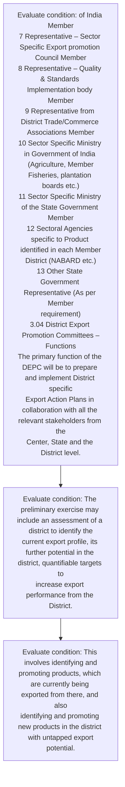
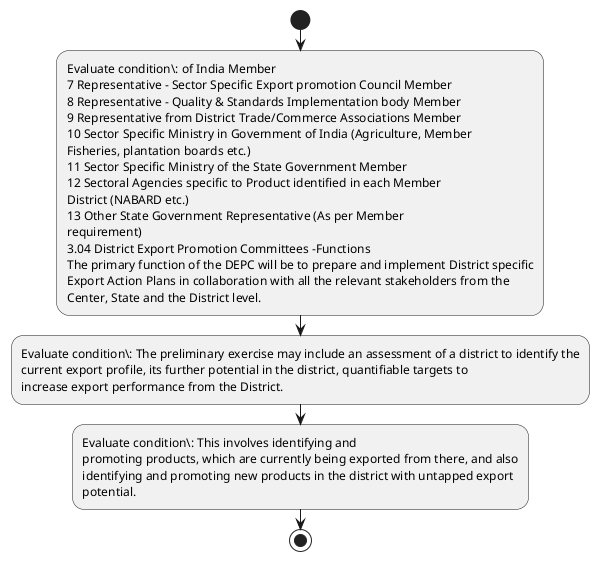

# Chapter 3 / Section 3.03: District Export Promotion Committees -Institutional Mechanism at

**Chapter Title:** Developing Districts as Export Hubs

**Pages:** 2, 3

**Purpose:** Defines the operational requirements for District Export Promotion Committees -Institutional Mechanism at.

**Purpose Thanglish:** Indha District Export Promotion Committees -Institutional Mechanism at section-la, Defines the operational requirements for District export Promotion Committees -Institutional Mechanism at.

**Summary:** 3.03 District Export Promotion Committees -Institutional Mechanism at
District Level
Each District has a District Export Promotion Committee (DEPC) which is mostly
chaired by Collector/DM/DC of the District and co-chaired by designated DGFT
Regional Authority with various other stakeholders as its members. The likely composition of the DEPC is as under:
Serial Official/Department Role
No. 1 Collector/DM/DC Chairperson
2 Designated DGFT Regional Authority Co-Chair
3 GM – District Industries Center (DIC) Convener
pg.

**Business Meaning:** 3.03 District Export Promotion Committees -Institutional Mechanism at
District Level
Each District has a District Export Promotion Committee (DEPC) which is mostly
chaired by Collector/DM/DC of the District and co-chaired by designated DGFT
Regional Authority with various other stakeholders as its members.

**Business Explanation:** 3.03 District Export Promotion Committees -Institutional Mechanism at
District Level
Each District has a District Export Promotion Committee (DEPC) which is mostly
chaired by Collector/DM/DC of the District and co-chaired by designated DGFT
Regional Authority with various other stakeholders as its members. The likely composition of the DEPC is as under:
Serial Official/Department Role
No. 1 Collector/DM/DC Chairperson
2 Designated DGFT Regional Authority Co-Chair
3 GM – District Industries Center (DIC) Convener
pg.

**Business Explanation Thanglish:** Indha District Export Promotion Committees -Institutional Mechanism at section-la, 3.03 District export Promotion Committees -Institutional Mechanism at
District Level
Each District has a District export Promotion Committee (DEPC) which is mostly
chaired by Collector/DM/DC of the District and co-chaired by designated DGFT
Regional authority with various other stakeholders as its members. The likely composition of the DEPC is as under:
Serial Official/Department Role
No. 1 Collector/DM/DC Chairperson
2 Designated DGFT Regional authority Co-Chair
3 GM – District Industries Center (DIC) Convener
pg.

## Business Logic
- None identified

## Business Rules
- rule_id=CH3-SEC3_03-R001, rule_description=3.03 District Export Promotion Committees -Institutional Mechanism at
District Level
Each District has a District Export Promotion Committee (DEPC) which is mostly
chaired by Collector/DM/DC of the District and co-chaired by designated DGFT
Regional Authority with various other stakeholders as its members. The likely composition of the DEPC is as under:
Serial Official/Department Role
No. 1 Collector/DM/DC Chairperson
2 Designated DGFT Regional Authority Co-Chair
3 GM – District Industries Center (DIC) Convener
pg., trigger=District Export Promotion Committees -Institutional Mechanism at, condition=of India Member
7 Representative – Sector Specific Export promotion Council Member
8 Representative – Quality & Standards Implementation body Member
9 Representative from District Trade/Commerce Associations Member
10 Sector Specific Ministry in Government of India (Agriculture, Member
Fisheries, plantation boards etc.)
11 Sector Specific Ministry of the State Government Member
12 Sectoral Agencies specific to Product identified in each Member
District (NABARD etc.)
13 Other State Government Representative (As per Member
requirement)
3.04 District Export Promotion Committees –Functions
The primary function of the DEPC will be to prepare and implement District specific
Export Action Plans in collaboration with all the relevant stakeholders from the
Center, State and the District level., validation=Not explicitly covered in uploaded documents., action=Manual review required., exception=No explicit exception found in uploaded documents., output=DEKAI should produce a compliance decision for 3.03 - District Export Promotion Committees -Institutional Mechanism at.

## Conditions
- of India Member
7 Representative – Sector Specific Export promotion Council Member
8 Representative – Quality & Standards Implementation body Member
9 Representative from District Trade/Commerce Associations Member
10 Sector Specific Ministry in Government of India (Agriculture, Member
Fisheries, plantation boards etc.)
11 Sector Specific Ministry of the State Government Member
12 Sectoral Agencies specific to Product identified in each Member
District (NABARD etc.)
13 Other State Government Representative (As per Member
requirement)
3.04 District Export Promotion Committees –Functions
The primary function of the DEPC will be to prepare and implement District specific
Export Action Plans in collaboration with all the relevant stakeholders from the
Center, State and the District level.
- The preliminary exercise may include an assessment of a district to identify the
current export profile, its further potential in the district, quantifiable targets to
increase export performance from the District.
- This involves identifying and
promoting products, which are currently being exported from there, and also
identifying and promoting new products in the district with untapped export
potential.

## Condition Logic
- id=3.3.03.1, if=of India Member
7 Representative – Sector Specific Export promotion Council Member
8 Representative – Quality & Standards Implementation body Member
9 Representative from District Trade/Commerce Associations Member
10 Sector Specific Ministry in Government of India (Agriculture, Member
Fisheries, plantation boards etc.)
11 Sector Specific Ministry of the State Government Member
12 Sectoral Agencies specific to Product identified in each Member
District (NABARD etc.)
13 Other State Government Representative (As per Member
requirement)
3.04 District Export Promotion Committees –Functions
The primary function of the DEPC will be to prepare and implement District specific
Export Action Plans in collaboration with all the relevant stakeholders from the
Center, State and the District level., then=Route for review, source=of India Member
7 Representative – Sector Specific Export promotion Council Member
8 Representative – Quality & Standards Implementation body Member
9 Representative from District Trade/Commerce Associations Member
10 Sector Specific Ministry in Government of India (Agriculture, Member
Fisheries, plantation boards etc.)
11 Sector Specific Ministry of the State Government Member
12 Sectoral Agencies specific to Product identified in each Member
District (NABARD etc.)
13 Other State Government Representative (As per Member
requirement)
3.04 District Export Promotion Committees –Functions
The primary function of the DEPC will be to prepare and implement District specific
Export Action Plans in collaboration with all the relevant stakeholders from the
Center, State and the District level.
- id=3.3.03.2, if=The preliminary exercise may include an assessment of a district to identify the
current export profile, its further potential in the district, quantifiable targets to
increase export performance from the District., then=Route for review, source=The preliminary exercise may include an assessment of a district to identify the
current export profile, its further potential in the district, quantifiable targets to
increase export performance from the District.
- id=3.3.03.3, if=This involves identifying and
promoting products, which are currently being exported from there, and also
identifying and promoting new products in the district with untapped export
potential., then=Route for review, source=This involves identifying and
promoting products, which are currently being exported from there, and also
identifying and promoting new products in the district with untapped export
potential.

## Validations
- None identified

## Exceptions
- None identified

## Dependencies
- 1
- 2
- 3
- 4
- 5
- 6
- 7
- 8
- 9
- 10
- 11
- 12
- 13

## Authorities
- DGFT
- Regional Authority
- District Export Promotion Committees
- District Export Promotion Committee
- Export Promotion Committee
- Each District has a District Export Promotion Committee
- Collector/DM/DC of the District and co-chaired by designated DGFT
- Designated DGFT Regional Authority
- State Government
- Nominated member from the State Government
- Sector Specific Ministry in Government
- Sector Specific Ministry of the State Government
- Other State Government
- The suggestive functions of the District Export Promotion Committee

## Required Documents
- None identified

## Timelines
- None identified

## Actions
- None identified

## Workflow
- Evaluate condition: of India Member
7 Representative – Sector Specific Export promotion Council Member
8 Representative – Quality & Standards Implementation body Member
9 Representative from District Trade/Commerce Associations Member
10 Sector Specific Ministry in Government of India (Agriculture, Member
Fisheries, plantation boards etc.)
11 Sector Specific Ministry of the State Government Member
12 Sectoral Agencies specific to Product identified in each Member
District (NABARD etc.)
13 Other State Government Representative (As per Member
requirement)
3.04 District Export Promotion Committees –Functions
The primary function of the DEPC will be to prepare and implement District specific
Export Action Plans in collaboration with all the relevant stakeholders from the
Center, State and the District level.
- Evaluate condition: The preliminary exercise may include an assessment of a district to identify the
current export profile, its further potential in the district, quantifiable targets to
increase export performance from the District.
- Evaluate condition: This involves identifying and
promoting products, which are currently being exported from there, and also
identifying and promoting new products in the district with untapped export
potential.

## Workflow ASCII
```text
District Export Promotion Committees -Institutional Mechanism at
Evaluate condition: of India Member
7 Representative – Sector Specific Export promotion Council Member
8 Representative – Quality & Standards Implementation body Member
9 Representative from District Trade/Commerce Associations Member
10 Sector Specific Ministry in Government of India (Agriculture, Member
Fisheries, plantation boards etc.)
11 Sector Specific Ministry of the State Government Member
12 Sectoral Agencies specific to Product identified in each Member
District (NABARD etc.)
13 Other State Government Representative (As per Member
requirement)
3.04 District Export Promotion Committees –Functions
The primary function of the DEPC will be to prepare and implement District specific
Export Action Plans in collaboration with all the relevant stakeholders from the
Center, State and the District level.
   |
   v
Evaluate condition: The preliminary exercise may include an assessment of a district to identify the
current export profile, its further potential in the district, quantifiable targets to
increase export performance from the District.
   |
   v
Evaluate condition: This involves identifying and
promoting products, which are currently being exported from there, and also
identifying and promoting new products in the district with untapped export
potential.
```

## Decision Tree
- IF section 3.03 applies THEN proceed with standard DGFT workflow

## Decision Tree ASCII
```text
District Export Promotion Committees -Institutional Mechanism at Decision
IF section 3.03 applies THEN proceed with standard DGFT workflow
```

## Examples
- User asks to process District Export Promotion Committees -Institutional Mechanism at; the platform checks conditions, validations, and documents before action.

**Real-world Example:** Example: an importer or exporter invokes District Export Promotion Committees -Institutional Mechanism at, submits the prescribed DGFT records, and DEKAI uses the extracted rules to follow the district export promotion committees -institutional mechanism at process.

**Real-world Example Thanglish:** Indha District Export Promotion Committees -Institutional Mechanism at section-la, Example: an importer or exporter invokes District export Promotion Committees -Institutional Mechanism at, submits the prescribed DGFT records, and DEKAI uses the extracted rules to follow the district export promotion committees -institutional mechanism at process.

## AI Rules
- None identified

## Database Fields
- name=section_code, type=string, required=True, source=parsed_section_heading
- name=section_title, type=string, required=True, source=parsed_section_heading
- name=has_flag, type=boolean, required=False, source=keyword:has
- name=the_flag, type=boolean, required=False, source=keyword:the
- name=and_flag, type=boolean, required=False, source=keyword:and
- name=its_flag, type=boolean, required=False, source=keyword:its
- name=dic_flag, type=boolean, required=False, source=keyword:DIC
- name=etc_flag, type=boolean, required=False, source=keyword:etc
- name=per_flag, type=boolean, required=False, source=keyword:per
- name=all_flag, type=boolean, required=False, source=keyword:all

## API Requirements
- method=GET, path=/api/dgft/sections/3.03, purpose=Retrieve knowledge payload for section 3.03, query_params=['include=workflow,decision_tree,validations'], response_fields=['section', 'title', 'summary', 'conditions', 'validations', 'exceptions', 'workflow', 'decision_tree']
- method=POST, path=/api/dgft/District-Export-Promotion-Committees-Institutional-Mechanism-at/validate, purpose=Validate inputs and documents for District Export Promotion Committees -Institutional Mechanism at, request_fields=['section_code', 'section_title'], response_fields=['status', 'errors', 'warnings', 'next_actions']

## UI Screens
- screen_id=District_Export_Promotion_Committees_Institutional_Mechanism_at_overview, name=District Export Promotion Committees -Institutional Mechanism at Overview, purpose=Show section summary, authority, timeline, and eligibility cues., widgets=['summary_card', 'conditions_table', 'authority_badges', 'timeline_panel']
- screen_id=District_Export_Promotion_Committees_Institutional_Mechanism_at_submission, name=District Export Promotion Committees -Institutional Mechanism at Submission, purpose=Capture applicant data and supporting documents., widgets=['dynamic_form', 'document_uploader', 'validation_panel', 'next_action_footer'], fields=['section_code', 'section_title', 'has_flag', 'the_flag', 'and_flag', 'its_flag', 'dic_flag', 'etc_flag']

## Error Messages
- Validation failed because the section requirements were not fully met.

## FAQ
- question_en=What is the purpose of section 3.03?, answer_en=3.03 District Export Promotion Committees -Institutional Mechanism at
District Level
Each District has a District Export Promotion Committee (DEPC) which is mostly
chaired by Collector/DM/DC of the District and co-chaired by designated DGFT
Regional Authority with various other stakeholders as its members. The likely composition of the DEPC is as under:
Serial Official/Department Role
No. 1 Collector/DM/DC Chairperson
2 Designated DGFT Regional Authority Co-Chair
3 GM – District Industries Center (DIC) Convener
pg., question_thanglish=Indha District Export Promotion Committees -Institutional Mechanism at section-la, What is the purpose of section 3.03?, answer_thanglish=Indha District Export Promotion Committees -Institutional Mechanism at section-la, 3.03 District export Promotion Committees -Institutional Mechanism at
District Level
Each District has a District export Promotion Committee (DEPC) which is mostly
chaired by Collector/DM/DC of the District and co-chaired by designated DGFT
Regional authority with various other stakeholders as its members. The likely composition of the DEPC is as under:
Serial Official/Department Role
No. 1 Collector/DM/DC Chairperson
2 Designated DGFT Regional authority Co-Chair
3 GM – District Industries Center (DIC) Convener
pg.
- question_en=What documents are required under District Export Promotion Committees -Institutional Mechanism at?, answer_en=Not explicitly covered in uploaded documents., question_thanglish=Indha District Export Promotion Committees -Institutional Mechanism at section-la, What documents are required under District export Promotion Committees -Institutional Mechanism at?, answer_thanglish=Indha District Export Promotion Committees -Institutional Mechanism at section-la, Not explicitly covered in uploaded documents.
- question_en=Which authority handles District Export Promotion Committees -Institutional Mechanism at?, answer_en=DGFT, Regional Authority, District Export Promotion Committees, District Export Promotion Committee, Export Promotion Committee, Each District has a District Export Promotion Committee, Collector/DM/DC of the District and co-chaired by designated DGFT, Designated DGFT Regional Authority, State Government, Nominated member from the State Government, Sector Specific Ministry in Government, Sector Specific Ministry of the State Government, Other State Government, The suggestive functions of the District Export Promotion Committee, question_thanglish=Indha District Export Promotion Committees -Institutional Mechanism at section-la, Which authority handles District export Promotion Committees -Institutional Mechanism at?, answer_thanglish=Indha District Export Promotion Committees -Institutional Mechanism at section-la, DGFT, Regional authority, District export Promotion Committees, District export Promotion Committee, export Promotion Committee, Each District has a District export Promotion Committee, Collector/DM/DC of the District and co-chaired by designated DGFT, Designated DGFT Regional authority, State Government, Nominated member from the State Government, Sector Specific Ministry in Government, Sector Specific Ministry of the State Government, Other State Government, The suggestive functions of the District export Promotion Committee

## Questions Users May Ask
- What does District Export Promotion Committees -Institutional Mechanism at require?
- Which documents are needed for District Export Promotion Committees -Institutional Mechanism at?
- How does DEKAI validate District Export Promotion Committees -Institutional Mechanism at requests?

## Expected AI Answers
- District Export Promotion Committees -Institutional Mechanism at requires the platform to interpret the section text, apply the extracted business rules, and present the correct next action.
- Required documents are inferred from the section text: no explicit documents were detected.
- DEKAI validates District Export Promotion Committees -Institutional Mechanism at by checking conditions, required documents, authority references, and exception clauses before recommending an outcome.

## AI Q&A Examples
- question_en=User asks: How do I comply with District Export Promotion Committees -Institutional Mechanism at?, answer_en=AI answers: DEKAI should evaluate section 3.03, apply the extracted rules, and guide the user through Evaluate condition: of India Member
7 Representative – Sector Specific Export promotion Council Member
8 Representative – Quality & Standards Implementation body Member
9 Representative from District Trade/Commerce Associations Member
10 Sector Specific Ministry in Government of India (Agriculture, Member
Fisheries, plantation boards etc.)
11 Sector Specific Ministry of the State Government Member
12 Sectoral Agencies specific to Product identified in each Member
District (NABARD etc.)
13 Other State Government Representative (As per Member
requirement)
3.04 District Export Promotion Committees –Functions
The primary function of the DEPC will be to prepare and implement District specific
Export Action Plans in collaboration with all the relevant stakeholders from the
Center, State and the District level.., question_thanglish=Indha District Export Promotion Committees -Institutional Mechanism at section-la, User asks: How do I comply with District export Promotion Committees -Institutional Mechanism at?, answer_thanglish=Indha District Export Promotion Committees -Institutional Mechanism at section-la, AI answers: DEKAI should evaluate section 3.03, apply the extracted rules, and guide the user through Evaluate condition: of India Member
7 Representative – Sector Specific export promotion Council Member
8 Representative – Quality & Standards Implementation body Member
9 Representative from District Trade/Commerce Associations Member
10 Sector Specific Ministry in Government of India (Agriculture, Member
Fisheries, plantation boards etc.)
11 Sector Specific Ministry of the State Government Member
12 Sectoral Agencies specific to Product identified in each Member
District (NABARD etc.)
13 Other State Government Representative (As per Member
requirement)
3.04 District export Promotion Committees –Functions
The primary function of the DEPC will be to prepare and implement District specific
export Action Plans in collaboration with all the relevant stakeholders from the
Center, State and the District level..
- question_en=User asks: Which validations apply to District Export Promotion Committees -Institutional Mechanism at?, answer_en=AI answers: Applicable validations are not explicitly covered in the uploaded documents., question_thanglish=Indha District Export Promotion Committees -Institutional Mechanism at section-la, User asks: Which validations apply to District export Promotion Committees -Institutional Mechanism at?, answer_thanglish=Indha District Export Promotion Committees -Institutional Mechanism at section-la, AI answers: Applicable validations are not explicitly covered in the uploaded documents.

## DEKAI AI Implementation Notes
- Capture chapter 3, section 3.03, title, and page references as immutable knowledge metadata.
- Bind validations for District Export Promotion Committees -Institutional Mechanism at into a rule engine keyed by the rule IDs extracted for this section.
- Route escalations or approvals to: DGFT, Regional Authority, District Export Promotion Committees, District Export Promotion Committee.
- Show contextual links to related sections: 1, 2, 3, 4, 5, 6, 7, 8, 9, 10, 11, 12, 13.

## DEKAI AI Implementation Notes Thanglish
- Indha District Export Promotion Committees -Institutional Mechanism at section-la, Capture chapter 3, section 3.03, title, and page references as immutable knowledge metadata.
- Indha District Export Promotion Committees -Institutional Mechanism at section-la, Bind validations for District export Promotion Committees -Institutional Mechanism at into a rule engine keyed by the rule IDs extracted for this section.
- Indha District Export Promotion Committees -Institutional Mechanism at section-la, Route escalations or approvals to: DGFT, Regional authority, District export Promotion Committees, District export Promotion Committee.
- Indha District Export Promotion Committees -Institutional Mechanism at section-la, Show contextual links to related sections: 1, 2, 3, 4, 5, 6, 7, 8, 9, 10, 11, 12, 13.

## AI Metadata
- Keywords: has, the, and, its, DIC, etc, per, all, may, are, new, map, Each, DEPC, DGFT, with, Role, Hubs, from, Lead
- Search Keywords: has, the, and, its, DIC, etc, per, all, may, are, new, map, Each, DEPC, DGFT, with, Role, Hubs, from, Lead
- Intent: Provide knowledge guidance for District Export Promotion Committees -Institutional Mechanism at.
- Tags: 3.03, District Export Promotion Committees -Institutional Mechanism at, dgft
- Related Sections: 1, 2, 3, 4, 5, 6, 7, 8, 9, 10, 11, 12, 13
- Related Chapters: 
- Related Rules: 

## Mermaid


## PlantUML

