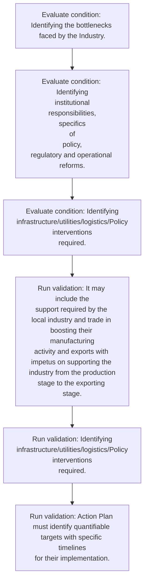
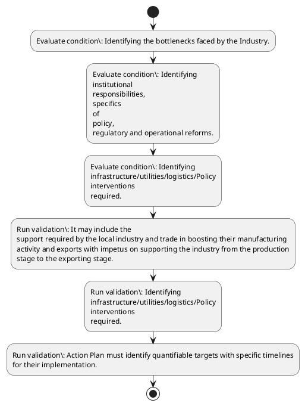

# Chapter 3 / Section 3.05: District Export Action Plans for Each District

**Chapter Title:** Developing Districts as Export Hubs

**Pages:** 5

**Purpose:** 3.05 District Export Action Plans for Each District
The District Export Action Plan may be prepared for each District.

**Purpose Thanglish:** Indha District Export Action Plans for Each District section-la, 3.05 District export Action Plans for Each District
The District export Action Plan may be prepared for each District.

**Summary:** 3.05 District Export Action Plans for Each District
The District Export Action Plan may be prepared for each District. It may include the
support required by the local industry and trade in boosting their manufacturing
activity and exports with impetus on supporting the industry from the production
stage to the exporting stage. Informative material on various incentives provided by
the Government of India and the respective State Government of exporters may be
disseminated to the industry and other potential exporters.

**Business Meaning:** District Export Action Plans for Each District governs how DGFT business controls should be applied, validated, and enforced.

**Business Explanation:** District Export Action Plans for Each District explains the operating rule set that DEKAI should enforce. Key control points include Action Plan must identify quantifiable targets with specific timelines
for their implementation.

**Business Explanation Thanglish:** Indha District Export Action Plans for Each District section-la, District export Action Plans for Each District explains the operating rule set that DEKAI should enforce. Key control points include Action Plan must identify quantifiable targets with specific timelines
for their implementation.

## Business Logic
- Action Plan must identify quantifiable targets with specific timelines
for their implementation.

## Business Rules
- rule_id=CH3-SEC3_05-R001, rule_description=Action Plan must identify quantifiable targets with specific timelines
for their implementation., trigger=District Export Action Plans for Each District, condition=Identifying the bottlenecks faced by the Industry., validation=It may include the
support required by the local industry and trade in boosting their manufacturing
activity and exports with impetus on supporting the industry from the production
stage to the exporting stage., action=Manual review required., exception=No explicit exception found in uploaded documents., output=DEKAI should produce a compliance decision for 3.05 - District Export Action Plans for Each District.

## Conditions
- Identifying the bottlenecks faced by the Industry.
- Identifying
institutional
responsibilities,
specifics
of
policy,
regulatory and operational reforms.
- Identifying
infrastructure/utilities/logistics/Policy
interventions
required.
- Action Plan must identify quantifiable targets with specific timelines
for their implementation.
- Clear identification of incentives/Support provided by the State and
Central Government.
- Training
and
development
needs
for
identified
export
products/services.

## Condition Logic
- id=3.3.05.1, if=Identifying the bottlenecks faced by the Industry., then=Route for review, source=Identifying the bottlenecks faced by the Industry.
- id=3.3.05.2, if=Identifying
institutional
responsibilities,
specifics
of
policy,
regulatory and operational reforms., then=Route for review, source=Identifying
institutional
responsibilities,
specifics
of
policy,
regulatory and operational reforms.
- id=3.3.05.3, if=Identifying
infrastructure/utilities/logistics/Policy
interventions
required., then=Route for review, source=Identifying
infrastructure/utilities/logistics/Policy
interventions
required.
- id=3.3.05.4, if=Action Plan must identify quantifiable targets with specific timelines
for their implementation., then=Route for review, source=Action Plan must identify quantifiable targets with specific timelines
for their implementation.
- id=3.3.05.5, if=Clear identification of incentives/Support provided by the State and
Central Government., then=Route for review, source=Clear identification of incentives/Support provided by the State and
Central Government.
- id=3.3.05.6, if=Training
and
development
needs
for
identified
export
products/services., then=Route for review, source=Training
and
development
needs
for
identified
export
products/services.

## Validations
- It may include the
support required by the local industry and trade in boosting their manufacturing
activity and exports with impetus on supporting the industry from the production
stage to the exporting stage.
- Identifying
infrastructure/utilities/logistics/Policy
interventions
required.
- Action Plan must identify quantifiable targets with specific timelines
for their implementation.

## Exceptions
- None identified

## Dependencies
- 1
- 2
- 3
- 4
- 5
- 6
- 7
- 8
- 9

## Authorities
- State Government
- Government of India and the respective State Government
- Central Government

## Required Documents
- None identified

## Timelines
- None identified

## Actions
- None identified

## Workflow
- Evaluate condition: Identifying the bottlenecks faced by the Industry.
- Evaluate condition: Identifying
institutional
responsibilities,
specifics
of
policy,
regulatory and operational reforms.
- Evaluate condition: Identifying
infrastructure/utilities/logistics/Policy
interventions
required.
- Run validation: It may include the
support required by the local industry and trade in boosting their manufacturing
activity and exports with impetus on supporting the industry from the production
stage to the exporting stage.
- Run validation: Identifying
infrastructure/utilities/logistics/Policy
interventions
required.
- Run validation: Action Plan must identify quantifiable targets with specific timelines
for their implementation.

## Workflow ASCII
```text
District Export Action Plans for Each District
Evaluate condition: Identifying the bottlenecks faced by the Industry.
   |
   v
Evaluate condition: Identifying
institutional
responsibilities,
specifics
of
policy,
regulatory and operational reforms.
   |
   v
Evaluate condition: Identifying
infrastructure/utilities/logistics/Policy
interventions
required.
   |
   v
Run validation: It may include the
support required by the local industry and trade in boosting their manufacturing
activity and exports with impetus on supporting the industry from the production
stage to the exporting stage.
   |
   v
Run validation: Identifying
infrastructure/utilities/logistics/Policy
interventions
required.
   |
   v
Run validation: Action Plan must identify quantifiable targets with specific timelines
for their implementation.
```

## Decision Tree
- IF section 3.05 applies THEN proceed with standard DGFT workflow

## Decision Tree ASCII
```text
District Export Action Plans for Each District Decision
IF section 3.05 applies THEN proceed with standard DGFT workflow
```

## Examples
- User asks to process District Export Action Plans for Each District; the platform checks conditions, validations, and documents before action.

**Real-world Example:** Example: an importer or exporter invokes District Export Action Plans for Each District, submits the prescribed DGFT records, and DEKAI uses the extracted rules to follow the district export action plans for each district process.

**Real-world Example Thanglish:** Indha District Export Action Plans for Each District section-la, Example: an importer or exporter invokes District export Action Plans for Each District, submits the prescribed DGFT records, and DEKAI uses the extracted rules to follow the district export action plans for each district process.

## AI Rules
- IF detected context matches section rule THEN enforce: Action Plan must identify quantifiable targets with specific timelines
for their implementation.

## Database Fields
- name=section_code, type=string, required=True, source=parsed_section_heading
- name=section_title, type=string, required=True, source=parsed_section_heading
- name=for_flag, type=boolean, required=False, source=keyword:for
- name=the_flag, type=boolean, required=False, source=keyword:The
- name=may_flag, type=boolean, required=False, source=keyword:may
- name=and_flag, type=boolean, required=False, source=keyword:and
- name=mai_flag, type=boolean, required=False, source=keyword:MAI
- name=each_flag, type=boolean, required=False, source=keyword:Each
- name=plan_flag, type=boolean, required=False, source=keyword:Plan
- name=with_flag, type=boolean, required=False, source=keyword:with

## API Requirements
- method=GET, path=/api/dgft/sections/3.05, purpose=Retrieve knowledge payload for section 3.05, query_params=['include=workflow,decision_tree,validations'], response_fields=['section', 'title', 'summary', 'conditions', 'validations', 'exceptions', 'workflow', 'decision_tree']
- method=POST, path=/api/dgft/District-Export-Action-Plans-for-Each-District/validate, purpose=Validate inputs and documents for District Export Action Plans for Each District, request_fields=['section_code', 'section_title'], response_fields=['status', 'errors', 'warnings', 'next_actions']

## UI Screens
- screen_id=District_Export_Action_Plans_for_Each_District_overview, name=District Export Action Plans for Each District Overview, purpose=Show section summary, authority, timeline, and eligibility cues., widgets=['summary_card', 'conditions_table', 'authority_badges', 'timeline_panel']
- screen_id=District_Export_Action_Plans_for_Each_District_submission, name=District Export Action Plans for Each District Submission, purpose=Capture applicant data and supporting documents., widgets=['dynamic_form', 'document_uploader', 'validation_panel', 'next_action_footer'], fields=['section_code', 'section_title', 'for_flag', 'the_flag', 'may_flag', 'and_flag', 'mai_flag', 'each_flag']

## Error Messages
- Validation failed because the section requirements were not fully met.

## FAQ
- question_en=What is the purpose of section 3.05?, answer_en=District Export Action Plans for Each District explains the operating rule set that DEKAI should enforce. Key control points include Action Plan must identify quantifiable targets with specific timelines
for their implementation., question_thanglish=Indha District Export Action Plans for Each District section-la, What is the purpose of section 3.05?, answer_thanglish=Indha District Export Action Plans for Each District section-la, District export Action Plans for Each District explains the operating rule set that DEKAI should enforce. Key control points include Action Plan must identify quantifiable targets with specific timelines
for their implementation.
- question_en=What documents are required under District Export Action Plans for Each District?, answer_en=Not explicitly covered in uploaded documents., question_thanglish=Indha District Export Action Plans for Each District section-la, What documents are required under District export Action Plans for Each District?, answer_thanglish=Indha District Export Action Plans for Each District section-la, Not explicitly covered in uploaded documents.
- question_en=Which authority handles District Export Action Plans for Each District?, answer_en=State Government, Government of India and the respective State Government, Central Government, question_thanglish=Indha District Export Action Plans for Each District section-la, Which authority handles District export Action Plans for Each District?, answer_thanglish=Indha District Export Action Plans for Each District section-la, State Government, Government of India and the respective State Government, Central Government

## Questions Users May Ask
- What does District Export Action Plans for Each District require?
- Which documents are needed for District Export Action Plans for Each District?
- How does DEKAI validate District Export Action Plans for Each District requests?

## Expected AI Answers
- District Export Action Plans for Each District requires the platform to interpret the section text, apply the extracted business rules, and present the correct next action.
- Required documents are inferred from the section text: no explicit documents were detected.
- DEKAI validates District Export Action Plans for Each District by checking conditions, required documents, authority references, and exception clauses before recommending an outcome.

## AI Q&A Examples
- question_en=User asks: How do I comply with District Export Action Plans for Each District?, answer_en=AI answers: DEKAI should evaluate section 3.05, apply the extracted rules, and guide the user through Evaluate condition: Identifying the bottlenecks faced by the Industry.., question_thanglish=Indha District Export Action Plans for Each District section-la, User asks: How do I comply with District export Action Plans for Each District?, answer_thanglish=Indha District Export Action Plans for Each District section-la, AI answers: DEKAI should evaluate section 3.05, apply the extracted rules, and guide the user through Evaluate condition: Identifying the bottlenecks faced by the Industry..
- question_en=User asks: Which validations apply to District Export Action Plans for Each District?, answer_en=AI answers: Applicable validations are It may include the
support required by the local industry and trade in boosting their manufacturing
activity and exports with impetus on supporting the industry from the production
stage to the exporting stage., Identifying
infrastructure/utilities/logistics/Policy
interventions
required., Action Plan must identify quantifiable targets with specific timelines
for their implementation., question_thanglish=Indha District Export Action Plans for Each District section-la, User asks: Which validations apply to District export Action Plans for Each District?, answer_thanglish=Indha District Export Action Plans for Each District section-la, AI answers: Applicable validations are It may include the
support required by the local industry and trade in boosting their manufacturing
activity and exports with impetus on supporting the industry from the production
stage to the exporting stage., Identifying
infrastructure/utilities/logistics/Policy
interventions
required., Action Plan must identify quantifiable targets with specific timelines
for their implementation.

## DEKAI AI Implementation Notes
- Capture chapter 3, section 3.05, title, and page references as immutable knowledge metadata.
- Bind validations for District Export Action Plans for Each District into a rule engine keyed by the rule IDs extracted for this section.
- Route escalations or approvals to: State Government, Government of India and the respective State Government, Central Government.
- Show contextual links to related sections: 1, 2, 3, 4, 5, 6, 7, 8, 9.

## DEKAI AI Implementation Notes Thanglish
- Indha District Export Action Plans for Each District section-la, Capture chapter 3, section 3.05, title, and page references as immutable knowledge metadata.
- Indha District Export Action Plans for Each District section-la, Bind validations for District export Action Plans for Each District into a rule engine keyed by the rule IDs extracted for this section.
- Indha District Export Action Plans for Each District section-la, Route escalations or approvals to: State Government, Government of India and the respective State Government, Central Government.
- Indha District Export Action Plans for Each District section-la, Show contextual links to related sections: 1, 2, 3, 4, 5, 6, 7, 8, 9.

## AI Metadata
- Keywords: for, The, may, and, MAI, Each, Plan, with, from, also, data, must, Plans, local, trade, their, stage, India, State, other
- Search Keywords: for, The, may, and, MAI, Each, Plan, with, from, also, data, must, Plans, local, trade, their, stage, India, State, other
- Intent: Provide knowledge guidance for District Export Action Plans for Each District.
- Tags: 3.05, District Export Action Plans for Each District, business-rule, dgft
- Related Sections: 1, 2, 3, 4, 5, 6, 7, 8, 9
- Related Chapters: 
- Related Rules: Action Plan must identify quantifiable targets with specific timelines
for their implementation.

## Mermaid


## PlantUML

