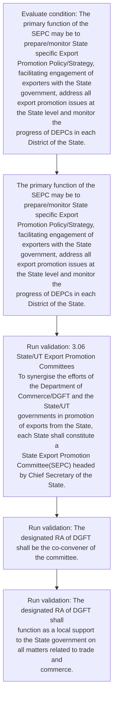
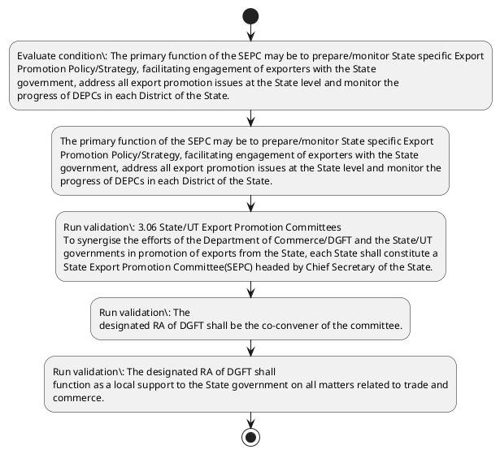

# Chapter 3 / Section 3.06: State/UT Export Promotion Committees

**Chapter Title:** Developing Districts as Export Hubs

**Pages:** 6

**Purpose:** 3.06 State/UT Export Promotion Committees
To synergise the efforts of the Department of Commerce/DGFT and the State/UT
governments in promotion of exports from the State, each State shall constitute a
State Export Promotion Committee(SEPC) headed by Chief Secretary of the State.

**Purpose Thanglish:** Indha State/UT Export Promotion Committees section-la, 3.06 State/UT export Promotion Committees
To synergise the efforts of the Department of Commerce/DGFT and the State/UT
governments in promotion of exports from the State, each State kandippa constitute a
State export Promotion Committee(SEPC) headed by Chief Secretary of the State.

**Summary:** 3.06 State/UT Export Promotion Committees
To synergise the efforts of the Department of Commerce/DGFT and the State/UT
governments in promotion of exports from the State, each State shall constitute a
State Export Promotion Committee(SEPC) headed by Chief Secretary of the State. The
designated RA of DGFT shall be the co-convener of the committee. The primary function of the SEPC may be to prepare/monitor State specific Export
Promotion Policy/Strategy, facilitating engagement of exporters with the State
government, address all export promotion issues at the State level and monitor the
progress of DEPCs in each District of the State.

**Business Meaning:** State/UT Export Promotion Committees governs how DGFT business controls should be applied, validated, and enforced.

**Business Explanation:** State/UT Export Promotion Committees explains the operating rule set that DEKAI should enforce. Key control points include 3.06 State/UT Export Promotion Committees
To synergise the efforts of the Department of Commerce/DGFT and the State/UT
governments in promotion of exports from the State, each State shall constitute a
State Export Promotion Committee(SEPC) headed by Chief Secretary of the State. The section also drives actions such as The primary function of the SEPC may be to prepare/monitor State specific Export
Promotion Policy/Strategy, facilitating engagement of exporters with the State
government, address all export promotion issues at the State level and monitor the
progress of DEPCs in each District of the State..

**Business Explanation Thanglish:** Indha State/UT Export Promotion Committees section-la, State/UT export Promotion Committees explains the operating rule set that DEKAI should enforce. Key control points include 3.06 State/UT export Promotion Committees
To synergise the efforts of the Department of Commerce/DGFT and the State/UT
governments in promotion of exports from the State, each State kandippa constitute a
State export Promotion Committee(SEPC) headed by Chief Secretary of the State. The section also drives actions such as The primary function of the SEPC may be to prepare/monitor State specific export
Promotion Policy/Strategy, facilitating engagement of exporters with the State
government, address all export promotion issues at the State level and monitor the
progress of DEPCs in each District of the State..

## Business Logic
- 3.06 State/UT Export Promotion Committees
To synergise the efforts of the Department of Commerce/DGFT and the State/UT
governments in promotion of exports from the State, each State shall constitute a
State Export Promotion Committee(SEPC) headed by Chief Secretary of the State.
- The
designated RA of DGFT shall be the co-convener of the committee.
- The designated RA of DGFT shall
function as a local support to the State government on all matters related to trade and
commerce.

## Business Rules
- rule_id=CH3-SEC3_06-R001, rule_description=3.06 State/UT Export Promotion Committees
To synergise the efforts of the Department of Commerce/DGFT and the State/UT
governments in promotion of exports from the State, each State shall constitute a
State Export Promotion Committee(SEPC) headed by Chief Secretary of the State., trigger=State/UT Export Promotion Committees, condition=The primary function of the SEPC may be to prepare/monitor State specific Export
Promotion Policy/Strategy, facilitating engagement of exporters with the State
government, address all export promotion issues at the State level and monitor the
progress of DEPCs in each District of the State., validation=3.06 State/UT Export Promotion Committees
To synergise the efforts of the Department of Commerce/DGFT and the State/UT
governments in promotion of exports from the State, each State shall constitute a
State Export Promotion Committee(SEPC) headed by Chief Secretary of the State., action=The primary function of the SEPC may be to prepare/monitor State specific Export
Promotion Policy/Strategy, facilitating engagement of exporters with the State
government, address all export promotion issues at the State level and monitor the
progress of DEPCs in each District of the State., exception=No explicit exception found in uploaded documents., output=DEKAI should produce a compliance decision for 3.06 - State/UT Export Promotion Committees.
- rule_id=CH3-SEC3_06-R002, rule_description=The
designated RA of DGFT shall be the co-convener of the committee., trigger=State/UT Export Promotion Committees, condition=The primary function of the SEPC may be to prepare/monitor State specific Export
Promotion Policy/Strategy, facilitating engagement of exporters with the State
government, address all export promotion issues at the State level and monitor the
progress of DEPCs in each District of the State., validation=The
designated RA of DGFT shall be the co-convener of the committee., action=The primary function of the SEPC may be to prepare/monitor State specific Export
Promotion Policy/Strategy, facilitating engagement of exporters with the State
government, address all export promotion issues at the State level and monitor the
progress of DEPCs in each District of the State., exception=No explicit exception found in uploaded documents., output=DEKAI should produce a compliance decision for 3.06 - State/UT Export Promotion Committees.
- rule_id=CH3-SEC3_06-R003, rule_description=The designated RA of DGFT shall
function as a local support to the State government on all matters related to trade and
commerce., trigger=State/UT Export Promotion Committees, condition=The primary function of the SEPC may be to prepare/monitor State specific Export
Promotion Policy/Strategy, facilitating engagement of exporters with the State
government, address all export promotion issues at the State level and monitor the
progress of DEPCs in each District of the State., validation=The designated RA of DGFT shall
function as a local support to the State government on all matters related to trade and
commerce., action=The primary function of the SEPC may be to prepare/monitor State specific Export
Promotion Policy/Strategy, facilitating engagement of exporters with the State
government, address all export promotion issues at the State level and monitor the
progress of DEPCs in each District of the State., exception=No explicit exception found in uploaded documents., output=DEKAI should produce a compliance decision for 3.06 - State/UT Export Promotion Committees.

## Conditions
- The primary function of the SEPC may be to prepare/monitor State specific Export
Promotion Policy/Strategy, facilitating engagement of exporters with the State
government, address all export promotion issues at the State level and monitor the
progress of DEPCs in each District of the State.

## Condition Logic
- id=3.3.06.1, if=The primary function of the SEPC may be to prepare/monitor State specific Export
Promotion Policy/Strategy, facilitating engagement of exporters with the State
government, address all export promotion issues at the State level and monitor the
progress of DEPCs in each District of the State., then=The primary function of the SEPC may be to prepare/monitor State specific Export
Promotion Policy/Strategy, facilitating engagement of exporters with the State
government, address all export promotion issues at the State level and monitor the
progress of DEPCs in each District of the State., source=The primary function of the SEPC may be to prepare/monitor State specific Export
Promotion Policy/Strategy, facilitating engagement of exporters with the State
government, address all export promotion issues at the State level and monitor the
progress of DEPCs in each District of the State.

## Validations
- 3.06 State/UT Export Promotion Committees
To synergise the efforts of the Department of Commerce/DGFT and the State/UT
governments in promotion of exports from the State, each State shall constitute a
State Export Promotion Committee(SEPC) headed by Chief Secretary of the State.
- The
designated RA of DGFT shall be the co-convener of the committee.
- The designated RA of DGFT shall
function as a local support to the State government on all matters related to trade and
commerce.

## Exceptions
- None identified

## Dependencies
- None identified

## Authorities
- DGFT
- State/UT Export Promotion Committees
- Export Promotion Committee
- To synergise the efforts of the Department of Commerce/DGFT
- State Export Promotion Committee
- RA
- RA of DGFT
- State government
- The designated RA of DGFT

## Required Documents
- None identified

## Timelines
- None identified

## Actions
- The primary function of the SEPC may be to prepare/monitor State specific Export
Promotion Policy/Strategy, facilitating engagement of exporters with the State
government, address all export promotion issues at the State level and monitor the
progress of DEPCs in each District of the State.

## Workflow
- Evaluate condition: The primary function of the SEPC may be to prepare/monitor State specific Export
Promotion Policy/Strategy, facilitating engagement of exporters with the State
government, address all export promotion issues at the State level and monitor the
progress of DEPCs in each District of the State.
- The primary function of the SEPC may be to prepare/monitor State specific Export
Promotion Policy/Strategy, facilitating engagement of exporters with the State
government, address all export promotion issues at the State level and monitor the
progress of DEPCs in each District of the State.
- Run validation: 3.06 State/UT Export Promotion Committees
To synergise the efforts of the Department of Commerce/DGFT and the State/UT
governments in promotion of exports from the State, each State shall constitute a
State Export Promotion Committee(SEPC) headed by Chief Secretary of the State.
- Run validation: The
designated RA of DGFT shall be the co-convener of the committee.
- Run validation: The designated RA of DGFT shall
function as a local support to the State government on all matters related to trade and
commerce.

## Workflow ASCII
```text
State/UT Export Promotion Committees
Evaluate condition: The primary function of the SEPC may be to prepare/monitor State specific Export
Promotion Policy/Strategy, facilitating engagement of exporters with the State
government, address all export promotion issues at the State level and monitor the
progress of DEPCs in each District of the State.
   |
   v
The primary function of the SEPC may be to prepare/monitor State specific Export
Promotion Policy/Strategy, facilitating engagement of exporters with the State
government, address all export promotion issues at the State level and monitor the
progress of DEPCs in each District of the State.
   |
   v
Run validation: 3.06 State/UT Export Promotion Committees
To synergise the efforts of the Department of Commerce/DGFT and the State/UT
governments in promotion of exports from the State, each State shall constitute a
State Export Promotion Committee(SEPC) headed by Chief Secretary of the State.
   |
   v
Run validation: The
designated RA of DGFT shall be the co-convener of the committee.
   |
   v
Run validation: The designated RA of DGFT shall
function as a local support to the State government on all matters related to trade and
commerce.
```

## Decision Tree
- IF The primary function of the SEPC may be to prepare/monitor State specific Export
Promotion Policy/Strategy, facilitating engagement of exporters with the State
government, address all export promotion issues at the State level and monitor the
progress of DEPCs in each District of the State. THEN The primary function of the SEPC may be to prepare/monitor State specific Export
Promotion Policy/Strategy, facilitating engagement of exporters with the State
government, address all export promotion issues at the State level and monitor the
progress of DEPCs in each District of the State.

## Decision Tree ASCII
```text
State/UT Export Promotion Committees Decision
IF The primary function of the SEPC may be to prepare/monitor State specific Export
Promotion Policy/Strategy, facilitating engagement of exporters with the State
government, address all export promotion issues at the State level and monitor the
progress of DEPCs in each District of the State. THEN The primary function of the SEPC may be to prepare/monitor State specific Export
Promotion Policy/Strategy, facilitating engagement of exporters with the State
government, address all export promotion issues at the State level and monitor the
progress of DEPCs in each District of the State.
```

## Examples
- User asks to process State/UT Export Promotion Committees; the platform checks conditions, validations, and documents before action.

**Real-world Example:** Example: an importer or exporter invokes State/UT Export Promotion Committees, submits the prescribed DGFT records, and DEKAI uses the extracted rules to the primary function of the sepc may be to prepare/monitor state specific export
promotion policy/strategy, facilitating engagement of exporters with the state
government, address all export promotion issues at the state level and monitor the
progress of depcs in each district of the state..

**Real-world Example Thanglish:** Indha State/UT Export Promotion Committees section-la, Example: an importer or exporter invokes State/UT export Promotion Committees, submits the prescribed DGFT records, and DEKAI uses the extracted rules to the primary function of the sepc may be to prepare/monitor state specific export
promotion policy/strategy, facilitating engagement of exporters with the state
government, address all export promotion issues at the state level and monitor the
progress of depcs in each district of the state..

## AI Rules
- IF detected context matches section rule THEN enforce: 3.06 State/UT Export Promotion Committees
To synergise the efforts of the Department of Commerce/DGFT and the State/UT
governments in promotion of exports from the State, each State shall constitute a
State Export Promotion Committee(SEPC) headed by Chief Secretary of the State.
- IF detected context matches section rule THEN enforce: The
designated RA of DGFT shall be the co-convener of the committee.
- IF detected context matches section rule THEN enforce: The designated RA of DGFT shall
function as a local support to the State government on all matters related to trade and
commerce.
- IF validations pass THEN recommend action: The primary function of the SEPC may be to prepare/monitor State specific Export
Promotion Policy/Strategy, facilitating engagement of exporters with the State
government, address all export promotion issues at the State level and monitor the
progress of DEPCs in each District of the State.

## Database Fields
- name=section_code, type=string, required=True, source=parsed_section_heading
- name=section_title, type=string, required=True, source=parsed_section_heading
- name=the_flag, type=boolean, required=False, source=keyword:the
- name=and_flag, type=boolean, required=False, source=keyword:and
- name=may_flag, type=boolean, required=False, source=keyword:may
- name=all_flag, type=boolean, required=False, source=keyword:all
- name=from_flag, type=boolean, required=False, source=keyword:from
- name=each_flag, type=boolean, required=False, source=keyword:each
- name=sepc_flag, type=boolean, required=False, source=keyword:SEPC
- name=dgft_flag, type=boolean, required=False, source=keyword:DGFT

## API Requirements
- method=GET, path=/api/dgft/sections/3.06, purpose=Retrieve knowledge payload for section 3.06, query_params=['include=workflow,decision_tree,validations'], response_fields=['section', 'title', 'summary', 'conditions', 'validations', 'exceptions', 'workflow', 'decision_tree']
- method=POST, path=/api/dgft/State-UT-Export-Promotion-Committees/validate, purpose=Validate inputs and documents for State/UT Export Promotion Committees, request_fields=['section_code', 'section_title'], response_fields=['status', 'errors', 'warnings', 'next_actions']
- method=POST, path=/api/dgft/State-UT-Export-Promotion-Committees/execute, purpose=Trigger business action for The primary function of the SEPC may be to prepare/monitor State specific Export
Promotion Policy/Strategy, facilitating engagement of exporters with the State
government, address all export promotion issues at the State level and monitor the
progress of DEPCs in each District of the State., request_fields=['section_code', 'section_title'], response_fields=['reference_id', 'status', 'authority', 'timeline']

## UI Screens
- screen_id=State_UT_Export_Promotion_Committees_overview, name=State/UT Export Promotion Committees Overview, purpose=Show section summary, authority, timeline, and eligibility cues., widgets=['summary_card', 'conditions_table', 'authority_badges', 'timeline_panel']
- screen_id=State_UT_Export_Promotion_Committees_submission, name=State/UT Export Promotion Committees Submission, purpose=Capture applicant data and supporting documents., widgets=['dynamic_form', 'document_uploader', 'validation_panel', 'next_action_footer'], fields=['section_code', 'section_title', 'the_flag', 'and_flag', 'may_flag', 'all_flag', 'from_flag', 'each_flag']

## Error Messages
- Validation failed because the section requirements were not fully met.

## FAQ
- question_en=What is the purpose of section 3.06?, answer_en=State/UT Export Promotion Committees explains the operating rule set that DEKAI should enforce. Key control points include 3.06 State/UT Export Promotion Committees
To synergise the efforts of the Department of Commerce/DGFT and the State/UT
governments in promotion of exports from the State, each State shall constitute a
State Export Promotion Committee(SEPC) headed by Chief Secretary of the State. The section also drives actions such as The primary function of the SEPC may be to prepare/monitor State specific Export
Promotion Policy/Strategy, facilitating engagement of exporters with the State
government, address all export promotion issues at the State level and monitor the
progress of DEPCs in each District of the State.., question_thanglish=Indha State/UT Export Promotion Committees section-la, What is the purpose of section 3.06?, answer_thanglish=Indha State/UT Export Promotion Committees section-la, State/UT export Promotion Committees explains the operating rule set that DEKAI should enforce. Key control points include 3.06 State/UT export Promotion Committees
To synergise the efforts of the Department of Commerce/DGFT and the State/UT
governments in promotion of exports from the State, each State kandippa constitute a
State export Promotion Committee(SEPC) headed by Chief Secretary of the State. The section also drives actions such as The primary function of the SEPC may be to prepare/monitor State specific export
Promotion Policy/Strategy, facilitating engagement of exporters with the State
government, address all export promotion issues at the State level and monitor the
progress of DEPCs in each District of the State..
- question_en=What documents are required under State/UT Export Promotion Committees?, answer_en=Not explicitly covered in uploaded documents., question_thanglish=Indha State/UT Export Promotion Committees section-la, What documents are required under State/UT export Promotion Committees?, answer_thanglish=Indha State/UT Export Promotion Committees section-la, Not explicitly covered in uploaded documents.
- question_en=Which authority handles State/UT Export Promotion Committees?, answer_en=DGFT, State/UT Export Promotion Committees, Export Promotion Committee, To synergise the efforts of the Department of Commerce/DGFT, State Export Promotion Committee, RA, RA of DGFT, State government, The designated RA of DGFT, question_thanglish=Indha State/UT Export Promotion Committees section-la, Which authority handles State/UT export Promotion Committees?, answer_thanglish=Indha State/UT Export Promotion Committees section-la, DGFT, State/UT export Promotion Committees, export Promotion Committee, To synergise the efforts of the Department of Commerce/DGFT, State export Promotion Committee, RA, RA of DGFT, State government, The designated RA of DGFT

## Questions Users May Ask
- What does State/UT Export Promotion Committees require?
- Which documents are needed for State/UT Export Promotion Committees?
- How does DEKAI validate State/UT Export Promotion Committees requests?
- What action should be taken for State/UT Export Promotion Committees?

## Expected AI Answers
- State/UT Export Promotion Committees requires the platform to interpret the section text, apply the extracted business rules, and present the correct next action.
- Required documents are inferred from the section text: no explicit documents were detected.
- DEKAI validates State/UT Export Promotion Committees by checking conditions, required documents, authority references, and exception clauses before recommending an outcome.
- The primary extracted action is: The primary function of the SEPC may be to prepare/monitor State specific Export
Promotion Policy/Strategy, facilitating engagement of exporters with the State
government, address all export promotion issues at the State level and monitor the
progress of DEPCs in each District of the State.

## AI Q&A Examples
- question_en=User asks: How do I comply with State/UT Export Promotion Committees?, answer_en=AI answers: DEKAI should evaluate section 3.06, apply the extracted rules, and guide the user through Evaluate condition: The primary function of the SEPC may be to prepare/monitor State specific Export
Promotion Policy/Strategy, facilitating engagement of exporters with the State
government, address all export promotion issues at the State level and monitor the
progress of DEPCs in each District of the State.., question_thanglish=Indha State/UT Export Promotion Committees section-la, User asks: How do I comply with State/UT export Promotion Committees?, answer_thanglish=Indha State/UT Export Promotion Committees section-la, AI answers: DEKAI should evaluate section 3.06, apply the extracted rules, and guide the user through Evaluate condition: The primary function of the SEPC may be to prepare/monitor State specific export
Promotion Policy/Strategy, facilitating engagement of exporters with the State
government, address all export promotion issues at the State level and monitor the
progress of DEPCs in each District of the State..
- question_en=User asks: Which validations apply to State/UT Export Promotion Committees?, answer_en=AI answers: Applicable validations are 3.06 State/UT Export Promotion Committees
To synergise the efforts of the Department of Commerce/DGFT and the State/UT
governments in promotion of exports from the State, each State shall constitute a
State Export Promotion Committee(SEPC) headed by Chief Secretary of the State., The
designated RA of DGFT shall be the co-convener of the committee., The designated RA of DGFT shall
function as a local support to the State government on all matters related to trade and
commerce., question_thanglish=Indha State/UT Export Promotion Committees section-la, User asks: Which validations apply to State/UT export Promotion Committees?, answer_thanglish=Indha State/UT Export Promotion Committees section-la, AI answers: Applicable validations are 3.06 State/UT export Promotion Committees
To synergise the efforts of the Department of Commerce/DGFT and the State/UT
governments in promotion of exports from the State, each State kandippa constitute a
State export Promotion Committee(SEPC) headed by Chief Secretary of the State., The
designated RA of DGFT kandippa be the co-convener of the committee., The designated RA of DGFT kandippa
function as a local support to the State government on all matters related to trade and
commerce.

## DEKAI AI Implementation Notes
- Capture chapter 3, section 3.06, title, and page references as immutable knowledge metadata.
- Bind validations for State/UT Export Promotion Committees into a rule engine keyed by the rule IDs extracted for this section.
- Route escalations or approvals to: DGFT, State/UT Export Promotion Committees, Export Promotion Committee, To synergise the efforts of the Department of Commerce/DGFT.

## DEKAI AI Implementation Notes Thanglish
- Indha State/UT Export Promotion Committees section-la, Capture chapter 3, section 3.06, title, and page references as immutable knowledge metadata.
- Indha State/UT Export Promotion Committees section-la, Bind validations for State/UT export Promotion Committees into a rule engine keyed by the rule IDs extracted for this section.
- Indha State/UT Export Promotion Committees section-la, Route escalations or approvals to: DGFT, State/UT export Promotion Committees, export Promotion Committee, To synergise the efforts of the Department of Commerce/DGFT.

## AI Metadata
- Keywords: the, and, may, all, from, each, SEPC, DGFT, with, State, shall, Chief, level, DEPCs, local, trade, Export, headed, issues, efforts
- Search Keywords: the, and, may, all, from, each, SEPC, DGFT, with, State, shall, Chief, level, DEPCs, local, trade, Export, headed, issues, efforts
- Intent: Support State/UT Export Promotion Committees processing and compliance validation.
- Tags: 3.06, State/UT Export Promotion Committees, business-rule, dgft
- Related Sections: 
- Related Chapters: 
- Related Rules: 3.06 State/UT Export Promotion Committees
To synergise the efforts of the Department of Commerce/DGFT and the State/UT
governments in promotion of exports from the State, each State shall constitute a
State Export Promotion Committee(SEPC) headed by Chief Secretary of the State., The
designated RA of DGFT shall be the co-convener of the committee., The designated RA of DGFT shall
function as a local support to the State government on all matters related to trade and
commerce.

## Mermaid


## PlantUML

