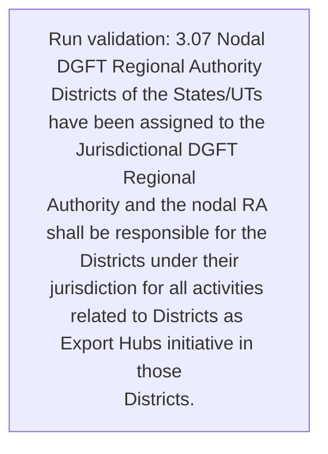
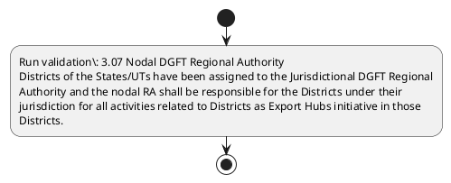

# Chapter 3 / Section 3.07: Nodal DGFT Regional Authority

**Chapter Title:** Developing Districts as Export Hubs

**Pages:** 6

**Purpose:** 3.07 Nodal DGFT Regional Authority
Districts of the States/UTs have been assigned to the Jurisdictional DGFT Regional
Authority and the nodal RA shall be responsible for the Districts under their
jurisdiction for all activities related to Districts as Export Hubs initiative in those
Districts.

**Purpose Thanglish:** Indha Nodal DGFT Regional Authority section-la, 3.07 Nodal DGFT Regional authority
Districts of the States/UTs have been assigned to the Jurisdictional DGFT Regional
authority and the nodal RA kandippa be responsible for the Districts under their
jurisdiction for all activities related to Districts as export Hubs initiative in those
Districts.

**Summary:** 3.07 Nodal DGFT Regional Authority
Districts of the States/UTs have been assigned to the Jurisdictional DGFT Regional
Authority and the nodal RA shall be responsible for the Districts under their
jurisdiction for all activities related to Districts as Export Hubs initiative in those
Districts. Appendix 1A has the list of DGFT Regional Authorities with their District and
State wise Jurisdiction.

**Business Meaning:** Nodal DGFT Regional Authority governs how DGFT business controls should be applied, validated, and enforced.

**Business Explanation:** Nodal DGFT Regional Authority explains the operating rule set that DEKAI should enforce. Key control points include 3.07 Nodal DGFT Regional Authority
Districts of the States/UTs have been assigned to the Jurisdictional DGFT Regional
Authority and the nodal RA shall be responsible for the Districts under their
jurisdiction for all activities related to Districts as Export Hubs initiative in those
Districts.

**Business Explanation Thanglish:** Indha Nodal DGFT Regional Authority section-la, Nodal DGFT Regional authority explains the operating rule set that DEKAI should enforce. Key control points include 3.07 Nodal DGFT Regional authority
Districts of the States/UTs have been assigned to the Jurisdictional DGFT Regional
authority and the nodal RA kandippa be responsible for the Districts under their
jurisdiction for all activities related to Districts as export Hubs initiative in those
Districts.

## Business Logic
- 3.07 Nodal DGFT Regional Authority
Districts of the States/UTs have been assigned to the Jurisdictional DGFT Regional
Authority and the nodal RA shall be responsible for the Districts under their
jurisdiction for all activities related to Districts as Export Hubs initiative in those
Districts.

## Business Rules
- rule_id=CH3-SEC3_07-R001, rule_description=3.07 Nodal DGFT Regional Authority
Districts of the States/UTs have been assigned to the Jurisdictional DGFT Regional
Authority and the nodal RA shall be responsible for the Districts under their
jurisdiction for all activities related to Districts as Export Hubs initiative in those
Districts., trigger=Nodal DGFT Regional Authority, condition=Not explicitly covered in uploaded documents., validation=3.07 Nodal DGFT Regional Authority
Districts of the States/UTs have been assigned to the Jurisdictional DGFT Regional
Authority and the nodal RA shall be responsible for the Districts under their
jurisdiction for all activities related to Districts as Export Hubs initiative in those
Districts., action=Manual review required., exception=No explicit exception found in uploaded documents., output=DEKAI should produce a compliance decision for 3.07 - Nodal DGFT Regional Authority.

## Conditions
- None identified

## Condition Logic
- None identified

## Validations
- 3.07 Nodal DGFT Regional Authority
Districts of the States/UTs have been assigned to the Jurisdictional DGFT Regional
Authority and the nodal RA shall be responsible for the Districts under their
jurisdiction for all activities related to Districts as Export Hubs initiative in those
Districts.

## Exceptions
- None identified

## Dependencies
- None identified

## Authorities
- DGFT
- RA
- Regional Authority
- Nodal DGFT Regional Authority
- Districts of the States/UTs have been assigned to the Jurisdictional DGFT
- Authority and the nodal RA
- DGFT Regional Authorities

## Required Documents
- None identified

## Timelines
- None identified

## Actions
- None identified

## Workflow
- Run validation: 3.07 Nodal DGFT Regional Authority
Districts of the States/UTs have been assigned to the Jurisdictional DGFT Regional
Authority and the nodal RA shall be responsible for the Districts under their
jurisdiction for all activities related to Districts as Export Hubs initiative in those
Districts.

## Workflow ASCII
```text
Nodal DGFT Regional Authority
Run validation: 3.07 Nodal DGFT Regional Authority
Districts of the States/UTs have been assigned to the Jurisdictional DGFT Regional
Authority and the nodal RA shall be responsible for the Districts under their
jurisdiction for all activities related to Districts as Export Hubs initiative in those
Districts.
```

## Decision Tree
- IF section 3.07 applies THEN proceed with standard DGFT workflow

## Decision Tree ASCII
```text
Nodal DGFT Regional Authority Decision
IF section 3.07 applies THEN proceed with standard DGFT workflow
```

## Examples
- User asks to process Nodal DGFT Regional Authority; the platform checks conditions, validations, and documents before action.

**Real-world Example:** Example: an importer or exporter invokes Nodal DGFT Regional Authority, submits the prescribed DGFT records, and DEKAI uses the extracted rules to follow the nodal dgft regional authority process.

**Real-world Example Thanglish:** Indha Nodal DGFT Regional Authority section-la, Example: an importer or exporter invokes Nodal DGFT Regional authority, submits the prescribed DGFT records, and DEKAI uses the extracted rules to follow the nodal dgft regional authority process.

## AI Rules
- IF detected context matches section rule THEN enforce: 3.07 Nodal DGFT Regional Authority
Districts of the States/UTs have been assigned to the Jurisdictional DGFT Regional
Authority and the nodal RA shall be responsible for the Districts under their
jurisdiction for all activities related to Districts as Export Hubs initiative in those
Districts.

## Database Fields
- name=section_code, type=string, required=True, source=parsed_section_heading
- name=section_title, type=string, required=True, source=parsed_section_heading
- name=the_flag, type=boolean, required=False, source=keyword:the
- name=and_flag, type=boolean, required=False, source=keyword:and
- name=for_flag, type=boolean, required=False, source=keyword:for
- name=all_flag, type=boolean, required=False, source=keyword:all
- name=has_flag, type=boolean, required=False, source=keyword:has
- name=dgft_flag, type=boolean, required=False, source=keyword:DGFT
- name=have_flag, type=boolean, required=False, source=keyword:have
- name=been_flag, type=boolean, required=False, source=keyword:been

## API Requirements
- method=GET, path=/api/dgft/sections/3.07, purpose=Retrieve knowledge payload for section 3.07, query_params=['include=workflow,decision_tree,validations'], response_fields=['section', 'title', 'summary', 'conditions', 'validations', 'exceptions', 'workflow', 'decision_tree']
- method=POST, path=/api/dgft/Nodal-DGFT-Regional-Authority/validate, purpose=Validate inputs and documents for Nodal DGFT Regional Authority, request_fields=['section_code', 'section_title'], response_fields=['status', 'errors', 'warnings', 'next_actions']

## UI Screens
- screen_id=Nodal_DGFT_Regional_Authority_overview, name=Nodal DGFT Regional Authority Overview, purpose=Show section summary, authority, timeline, and eligibility cues., widgets=['summary_card', 'conditions_table', 'authority_badges', 'timeline_panel']
- screen_id=Nodal_DGFT_Regional_Authority_submission, name=Nodal DGFT Regional Authority Submission, purpose=Capture applicant data and supporting documents., widgets=['dynamic_form', 'document_uploader', 'validation_panel', 'next_action_footer'], fields=['section_code', 'section_title', 'the_flag', 'and_flag', 'for_flag', 'all_flag', 'has_flag', 'dgft_flag']

## Error Messages
- Validation failed because the section requirements were not fully met.

## FAQ
- question_en=What is the purpose of section 3.07?, answer_en=Nodal DGFT Regional Authority explains the operating rule set that DEKAI should enforce. Key control points include 3.07 Nodal DGFT Regional Authority
Districts of the States/UTs have been assigned to the Jurisdictional DGFT Regional
Authority and the nodal RA shall be responsible for the Districts under their
jurisdiction for all activities related to Districts as Export Hubs initiative in those
Districts., question_thanglish=Indha Nodal DGFT Regional Authority section-la, What is the purpose of section 3.07?, answer_thanglish=Indha Nodal DGFT Regional Authority section-la, Nodal DGFT Regional authority explains the operating rule set that DEKAI should enforce. Key control points include 3.07 Nodal DGFT Regional authority
Districts of the States/UTs have been assigned to the Jurisdictional DGFT Regional
authority and the nodal RA kandippa be responsible for the Districts under their
jurisdiction for all activities related to Districts as export Hubs initiative in those
Districts.
- question_en=What documents are required under Nodal DGFT Regional Authority?, answer_en=Not explicitly covered in uploaded documents., question_thanglish=Indha Nodal DGFT Regional Authority section-la, What documents are required under Nodal DGFT Regional authority?, answer_thanglish=Indha Nodal DGFT Regional Authority section-la, Not explicitly covered in uploaded documents.
- question_en=Which authority handles Nodal DGFT Regional Authority?, answer_en=DGFT, RA, Regional Authority, Nodal DGFT Regional Authority, Districts of the States/UTs have been assigned to the Jurisdictional DGFT, Authority and the nodal RA, DGFT Regional Authorities, question_thanglish=Indha Nodal DGFT Regional Authority section-la, Which authority handles Nodal DGFT Regional authority?, answer_thanglish=Indha Nodal DGFT Regional Authority section-la, DGFT, RA, Regional authority, Nodal DGFT Regional authority, Districts of the States/UTs have been assigned to the Jurisdictional DGFT, authority and the nodal RA, DGFT Regional Authorities

## Questions Users May Ask
- What does Nodal DGFT Regional Authority require?
- Which documents are needed for Nodal DGFT Regional Authority?
- How does DEKAI validate Nodal DGFT Regional Authority requests?

## Expected AI Answers
- Nodal DGFT Regional Authority requires the platform to interpret the section text, apply the extracted business rules, and present the correct next action.
- Required documents are inferred from the section text: no explicit documents were detected.
- DEKAI validates Nodal DGFT Regional Authority by checking conditions, required documents, authority references, and exception clauses before recommending an outcome.

## AI Q&A Examples
- question_en=User asks: How do I comply with Nodal DGFT Regional Authority?, answer_en=AI answers: DEKAI should evaluate section 3.07, apply the extracted rules, and guide the user through Run validation: 3.07 Nodal DGFT Regional Authority
Districts of the States/UTs have been assigned to the Jurisdictional DGFT Regional
Authority and the nodal RA shall be responsible for the Districts under their
jurisdiction for all activities related to Districts as Export Hubs initiative in those
Districts.., question_thanglish=Indha Nodal DGFT Regional Authority section-la, User asks: How do I comply with Nodal DGFT Regional authority?, answer_thanglish=Indha Nodal DGFT Regional Authority section-la, AI answers: DEKAI should evaluate section 3.07, apply the extracted rules, and guide the user through Run validation: 3.07 Nodal DGFT Regional authority
Districts of the States/UTs have been assigned to the Jurisdictional DGFT Regional
authority and the nodal RA kandippa be responsible for the Districts under their
jurisdiction for all activities related to Districts as export Hubs initiative in those
Districts..
- question_en=User asks: Which validations apply to Nodal DGFT Regional Authority?, answer_en=AI answers: Applicable validations are 3.07 Nodal DGFT Regional Authority
Districts of the States/UTs have been assigned to the Jurisdictional DGFT Regional
Authority and the nodal RA shall be responsible for the Districts under their
jurisdiction for all activities related to Districts as Export Hubs initiative in those
Districts., question_thanglish=Indha Nodal DGFT Regional Authority section-la, User asks: Which validations apply to Nodal DGFT Regional authority?, answer_thanglish=Indha Nodal DGFT Regional Authority section-la, AI answers: Applicable validations are 3.07 Nodal DGFT Regional authority
Districts of the States/UTs have been assigned to the Jurisdictional DGFT Regional
authority and the nodal RA kandippa be responsible for the Districts under their
jurisdiction for all activities related to Districts as export Hubs initiative in those
Districts.

## DEKAI AI Implementation Notes
- Capture chapter 3, section 3.07, title, and page references as immutable knowledge metadata.
- Bind validations for Nodal DGFT Regional Authority into a rule engine keyed by the rule IDs extracted for this section.
- Route escalations or approvals to: DGFT, RA, Regional Authority, Nodal DGFT Regional Authority.

## DEKAI AI Implementation Notes Thanglish
- Indha Nodal DGFT Regional Authority section-la, Capture chapter 3, section 3.07, title, and page references as immutable knowledge metadata.
- Indha Nodal DGFT Regional Authority section-la, Bind validations for Nodal DGFT Regional authority into a rule engine keyed by the rule IDs extracted for this section.
- Indha Nodal DGFT Regional Authority section-la, Route escalations or approvals to: DGFT, RA, Regional authority, Nodal DGFT Regional authority.

## AI Metadata
- Keywords: the, and, for, all, has, DGFT, have, been, Hubs, list, with, wise, Nodal, shall, under, their, those, State, Export, related
- Search Keywords: the, and, for, all, has, DGFT, have, been, Hubs, list, with, wise, Nodal, shall, under, their, those, State, Export, related
- Intent: Provide knowledge guidance for Nodal DGFT Regional Authority.
- Tags: 3.07, Nodal DGFT Regional Authority, business-rule, dgft
- Related Sections: 
- Related Chapters: 
- Related Rules: 3.07 Nodal DGFT Regional Authority
Districts of the States/UTs have been assigned to the Jurisdictional DGFT Regional
Authority and the nodal RA shall be responsible for the Districts under their
jurisdiction for all activities related to Districts as Export Hubs initiative in those
Districts.

## Mermaid


## PlantUML

