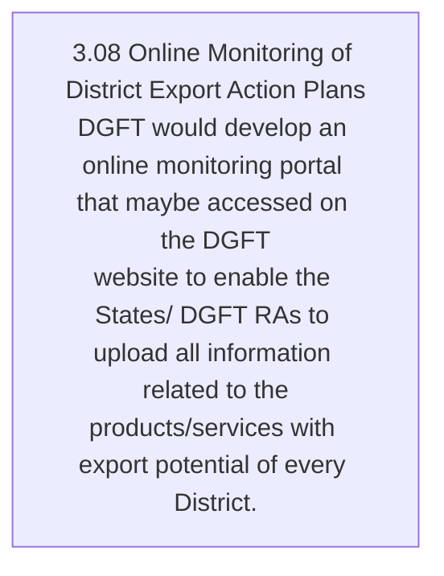
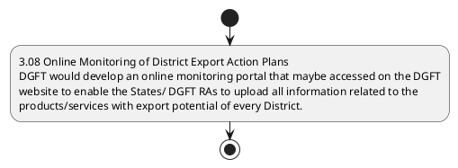

# Chapter 3 / Section 3.08: Online Monitoring of District Export Action Plans

**Chapter Title:** Developing Districts as Export Hubs

**Pages:** 6

**Purpose:** 3.08 Online Monitoring of District Export Action Plans
DGFT would develop an online monitoring portal that maybe accessed on the DGFT
website to enable the States/ DGFT RAs to upload all information related to the
products/services with export potential of every District.

**Purpose Thanglish:** Indha Online Monitoring of District Export Action Plans section-la, 3.08 Online Monitoring of District export Action Plans
DGFT would develop an online monitoring portal that maybe accessed on the DGFT
website to enable the States/ DGFT RAs to upload all information related to the
products/services with export potential of every District.

**Summary:** 3.08 Online Monitoring of District Export Action Plans
DGFT would develop an online monitoring portal that maybe accessed on the DGFT
website to enable the States/ DGFT RAs to upload all information related to the
products/services with export potential of every District. The portal mayalso help in
monitoring the progress of District Export Action Plan in all the Districts. Each DGFT
Jurisdictional RA will be primarily responsible for updating the information/progress
made in implementing Export Action Plan for each District under their Jurisdiction.

**Business Meaning:** 3.08 Online Monitoring of District Export Action Plans
DGFT would develop an online monitoring portal that maybe accessed on the DGFT
website to enable the States/ DGFT RAs to upload all information related to the
products/services with export potential of every District.

**Business Explanation:** 3.08 Online Monitoring of District Export Action Plans
DGFT would develop an online monitoring portal that maybe accessed on the DGFT
website to enable the States/ DGFT RAs to upload all information related to the
products/services with export potential of every District. The portal mayalso help in
monitoring the progress of District Export Action Plan in all the Districts. Each DGFT
Jurisdictional RA will be primarily responsible for updating the information/progress
made in implementing Export Action Plan for each District under their Jurisdiction.

**Business Explanation Thanglish:** Indha Online Monitoring of District Export Action Plans section-la, 3.08 Online Monitoring of District export Action Plans
DGFT would develop an online monitoring portal that maybe accessed on the DGFT
website to enable the States/ DGFT RAs to upload all information related to the
products/services with export potential of every District. The portal mayalso help in
monitoring the progress of District export Action Plan in all the Districts. Each DGFT
Jurisdictional RA will be primarily responsible for updating the information/progress
made in implementing export Action Plan for each District under their Jurisdiction.

## Business Logic
- None identified

## Business Rules
- rule_id=CH3-SEC3_08-R001, rule_description=IF validations pass THEN recommend action: 3.08 Online Monitoring of District Export Action Plans
DGFT would develop an online monitoring portal that maybe accessed on the DGFT
website to enable the States/ DGFT RAs to upload all information related to the
products/services with export potential of every District., trigger=Online Monitoring of District Export Action Plans, condition=Section 3.08 is applicable, validation=Not explicitly covered in uploaded documents., action=3.08 Online Monitoring of District Export Action Plans
DGFT would develop an online monitoring portal that maybe accessed on the DGFT
website to enable the States/ DGFT RAs to upload all information related to the
products/services with export potential of every District., exception=No explicit exception found in uploaded documents., output=DEKAI should produce a compliance decision for 3.08 - Online Monitoring of District Export Action Plans.

## Conditions
- None identified

## Condition Logic
- id=3.3.08.1, if=Section 3.08 is applicable, then=3.08 Online Monitoring of District Export Action Plans
DGFT would develop an online monitoring portal that maybe accessed on the DGFT
website to enable the States/ DGFT RAs to upload all information related to the
products/services with export potential of every District., source=Derived from uploaded documents

## Validations
- None identified

## Exceptions
- None identified

## Dependencies
- 3
- 8

## Authorities
- DGFT
- DGFT would develop an online monitoring portal that maybe accessed on the DGFT
- States/ DGFT
- RA
- Jurisdictional RA
- Each DGFT

## Required Documents
- None identified

## Timelines
- None identified

## Actions
- 3.08 Online Monitoring of District Export Action Plans
DGFT would develop an online monitoring portal that maybe accessed on the DGFT
website to enable the States/ DGFT RAs to upload all information related to the
products/services with export potential of every District.

## Workflow
- 3.08 Online Monitoring of District Export Action Plans
DGFT would develop an online monitoring portal that maybe accessed on the DGFT
website to enable the States/ DGFT RAs to upload all information related to the
products/services with export potential of every District.

## Workflow ASCII
```text
Online Monitoring of District Export Action Plans
3.08 Online Monitoring of District Export Action Plans
DGFT would develop an online monitoring portal that maybe accessed on the DGFT
website to enable the States/ DGFT RAs to upload all information related to the
products/services with export potential of every District.
```

## Decision Tree
- IF section 3.08 applies THEN 3.08 Online Monitoring of District Export Action Plans
DGFT would develop an online monitoring portal that maybe accessed on the DGFT
website to enable the States/ DGFT RAs to upload all information related to the
products/services with export potential of every District.

## Decision Tree ASCII
```text
Online Monitoring of District Export Action Plans Decision
IF section 3.08 applies THEN 3.08 Online Monitoring of District Export Action Plans
DGFT would develop an online monitoring portal that maybe accessed on the DGFT
website to enable the States/ DGFT RAs to upload all information related to the
products/services with export potential of every District.
```

## Examples
- User asks to process Online Monitoring of District Export Action Plans; the platform checks conditions, validations, and documents before action.

**Real-world Example:** Example: an importer or exporter invokes Online Monitoring of District Export Action Plans, submits the prescribed DGFT records, and DEKAI uses the extracted rules to 3.08 online monitoring of district export action plans
dgft would develop an online monitoring portal that maybe accessed on the dgft
website to enable the states/ dgft ras to upload all information related to the
products/services with export potential of every district..

**Real-world Example Thanglish:** Indha Online Monitoring of District Export Action Plans section-la, Example: an importer or exporter invokes Online Monitoring of District export Action Plans, submits the prescribed DGFT records, and DEKAI uses the extracted rules to 3.08 online monitoring of district export action plans
dgft would develop an online monitoring portal that maybe accessed on the dgft
website to enable the states/ dgft ras to upload all information related to the
products/services with export potential of every district..

## AI Rules
- IF validations pass THEN recommend action: 3.08 Online Monitoring of District Export Action Plans
DGFT would develop an online monitoring portal that maybe accessed on the DGFT
website to enable the States/ DGFT RAs to upload all information related to the
products/services with export potential of every District.

## Database Fields
- name=section_code, type=string, required=True, source=parsed_section_heading
- name=section_title, type=string, required=True, source=parsed_section_heading
- name=the_flag, type=boolean, required=False, source=keyword:the
- name=ras_flag, type=boolean, required=False, source=keyword:RAs
- name=all_flag, type=boolean, required=False, source=keyword:all
- name=for_flag, type=boolean, required=False, source=keyword:for
- name=dgft_flag, type=boolean, required=False, source=keyword:DGFT
- name=that_flag, type=boolean, required=False, source=keyword:that
- name=with_flag, type=boolean, required=False, source=keyword:with
- name=help_flag, type=boolean, required=False, source=keyword:help

## API Requirements
- method=GET, path=/api/dgft/sections/3.08, purpose=Retrieve knowledge payload for section 3.08, query_params=['include=workflow,decision_tree,validations'], response_fields=['section', 'title', 'summary', 'conditions', 'validations', 'exceptions', 'workflow', 'decision_tree']
- method=POST, path=/api/dgft/Online-Monitoring-of-District-Export-Action-Plans/validate, purpose=Validate inputs and documents for Online Monitoring of District Export Action Plans, request_fields=['section_code', 'section_title'], response_fields=['status', 'errors', 'warnings', 'next_actions']
- method=POST, path=/api/dgft/Online-Monitoring-of-District-Export-Action-Plans/execute, purpose=Trigger business action for 3.08 Online Monitoring of District Export Action Plans
DGFT would develop an online monitoring portal that maybe accessed on the DGFT
website to enable the States/ DGFT RAs to upload all information related to the
products/services with export potential of every District., request_fields=['section_code', 'section_title'], response_fields=['reference_id', 'status', 'authority', 'timeline']

## UI Screens
- screen_id=Online_Monitoring_of_District_Export_Action_Plans_overview, name=Online Monitoring of District Export Action Plans Overview, purpose=Show section summary, authority, timeline, and eligibility cues., widgets=['summary_card', 'conditions_table', 'authority_badges', 'timeline_panel']
- screen_id=Online_Monitoring_of_District_Export_Action_Plans_submission, name=Online Monitoring of District Export Action Plans Submission, purpose=Capture applicant data and supporting documents., widgets=['dynamic_form', 'document_uploader', 'validation_panel', 'next_action_footer'], fields=['section_code', 'section_title', 'the_flag', 'ras_flag', 'all_flag', 'for_flag', 'dgft_flag', 'that_flag']

## Error Messages
- Validation failed because the section requirements were not fully met.

## FAQ
- question_en=What is the purpose of section 3.08?, answer_en=3.08 Online Monitoring of District Export Action Plans
DGFT would develop an online monitoring portal that maybe accessed on the DGFT
website to enable the States/ DGFT RAs to upload all information related to the
products/services with export potential of every District. The portal mayalso help in
monitoring the progress of District Export Action Plan in all the Districts. Each DGFT
Jurisdictional RA will be primarily responsible for updating the information/progress
made in implementing Export Action Plan for each District under their Jurisdiction., question_thanglish=Indha Online Monitoring of District Export Action Plans section-la, What is the purpose of section 3.08?, answer_thanglish=Indha Online Monitoring of District Export Action Plans section-la, 3.08 Online Monitoring of District export Action Plans
DGFT would develop an online monitoring portal that maybe accessed on the DGFT
website to enable the States/ DGFT RAs to upload all information related to the
products/services with export potential of every District. The portal mayalso help in
monitoring the progress of District export Action Plan in all the Districts. Each DGFT
Jurisdictional RA will be primarily responsible for updating the information/progress
made in implementing export Action Plan for each District under their Jurisdiction.
- question_en=What documents are required under Online Monitoring of District Export Action Plans?, answer_en=Not explicitly covered in uploaded documents., question_thanglish=Indha Online Monitoring of District Export Action Plans section-la, What documents are required under Online Monitoring of District export Action Plans?, answer_thanglish=Indha Online Monitoring of District Export Action Plans section-la, Not explicitly covered in uploaded documents.
- question_en=Which authority handles Online Monitoring of District Export Action Plans?, answer_en=DGFT, DGFT would develop an online monitoring portal that maybe accessed on the DGFT, States/ DGFT, RA, Jurisdictional RA, Each DGFT, question_thanglish=Indha Online Monitoring of District Export Action Plans section-la, Which authority handles Online Monitoring of District export Action Plans?, answer_thanglish=Indha Online Monitoring of District Export Action Plans section-la, DGFT, DGFT would develop an online monitoring portal that maybe accessed on the DGFT, States/ DGFT, RA, Jurisdictional RA, Each DGFT

## Questions Users May Ask
- What does Online Monitoring of District Export Action Plans require?
- Which documents are needed for Online Monitoring of District Export Action Plans?
- How does DEKAI validate Online Monitoring of District Export Action Plans requests?
- What action should be taken for Online Monitoring of District Export Action Plans?

## Expected AI Answers
- Online Monitoring of District Export Action Plans requires the platform to interpret the section text, apply the extracted business rules, and present the correct next action.
- Required documents are inferred from the section text: no explicit documents were detected.
- DEKAI validates Online Monitoring of District Export Action Plans by checking conditions, required documents, authority references, and exception clauses before recommending an outcome.
- The primary extracted action is: 3.08 Online Monitoring of District Export Action Plans
DGFT would develop an online monitoring portal that maybe accessed on the DGFT
website to enable the States/ DGFT RAs to upload all information related to the
products/services with export potential of every District.

## AI Q&A Examples
- question_en=User asks: How do I comply with Online Monitoring of District Export Action Plans?, answer_en=AI answers: DEKAI should evaluate section 3.08, apply the extracted rules, and guide the user through 3.08 Online Monitoring of District Export Action Plans
DGFT would develop an online monitoring portal that maybe accessed on the DGFT
website to enable the States/ DGFT RAs to upload all information related to the
products/services with export potential of every District.., question_thanglish=Indha Online Monitoring of District Export Action Plans section-la, User asks: How do I comply with Online Monitoring of District export Action Plans?, answer_thanglish=Indha Online Monitoring of District Export Action Plans section-la, AI answers: DEKAI should evaluate section 3.08, apply the extracted rules, and guide the user through 3.08 Online Monitoring of District export Action Plans
DGFT would develop an online monitoring portal that maybe accessed on the DGFT
website to enable the States/ DGFT RAs to upload all information related to the
products/services with export potential of every District..
- question_en=User asks: Which validations apply to Online Monitoring of District Export Action Plans?, answer_en=AI answers: Applicable validations are not explicitly covered in the uploaded documents., question_thanglish=Indha Online Monitoring of District Export Action Plans section-la, User asks: Which validations apply to Online Monitoring of District export Action Plans?, answer_thanglish=Indha Online Monitoring of District Export Action Plans section-la, AI answers: Applicable validations are not explicitly covered in the uploaded documents.

## DEKAI AI Implementation Notes
- Capture chapter 3, section 3.08, title, and page references as immutable knowledge metadata.
- Bind validations for Online Monitoring of District Export Action Plans into a rule engine keyed by the rule IDs extracted for this section.
- Route escalations or approvals to: DGFT, DGFT would develop an online monitoring portal that maybe accessed on the DGFT, States/ DGFT, RA.
- Show contextual links to related sections: 3, 8.

## DEKAI AI Implementation Notes Thanglish
- Indha Online Monitoring of District Export Action Plans section-la, Capture chapter 3, section 3.08, title, and page references as immutable knowledge metadata.
- Indha Online Monitoring of District Export Action Plans section-la, Bind validations for Online Monitoring of District export Action Plans into a rule engine keyed by the rule IDs extracted for this section.
- Indha Online Monitoring of District Export Action Plans section-la, Route escalations or approvals to: DGFT, DGFT would develop an online monitoring portal that maybe accessed on the DGFT, States/ DGFT, RA.
- Indha Online Monitoring of District Export Action Plans section-la, Show contextual links to related sections: 3, 8.

## AI Metadata
- Keywords: the, RAs, all, for, DGFT, that, with, help, Plan, Each, will, made, also, Plans, would, maybe, every, under, their, trade
- Search Keywords: the, RAs, all, for, DGFT, that, with, help, Plan, Each, will, made, also, Plans, would, maybe, every, under, their, trade
- Intent: Support Online Monitoring of District Export Action Plans processing and compliance validation.
- Tags: 3.08, Online Monitoring of District Export Action Plans, dgft
- Related Sections: 3, 8
- Related Chapters: 
- Related Rules: 

## Mermaid


## PlantUML

