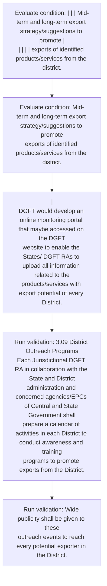

# Chapter 3 / Section 3.09: District Outreach Programs

**Chapter Title:** Developing Districts as Export Hubs

**Pages:** 6

**Purpose:** 3.09 District Outreach Programs
Each Jurisdictional DGFT RA in collaboration with the State and District
administration and concerned agencies/EPCs of Central and State Government shall
prepare a calendar of activities in each District to conduct awareness and training
programs to promote exports from the District.

**Purpose Thanglish:** Indha District Outreach Programs section-la, 3.09 District Outreach Programs
Each Jurisdictional DGFT RA in collaboration with the State and District
administration and concerned agencies/EPCs of Central and State Government kandippa
prepare a calendar of activities in each District to conduct awareness and training
programs to promote exports from the District.

**Summary:** 3.09 District Outreach Programs
Each Jurisdictional DGFT RA in collaboration with the State and District
administration and concerned agencies/EPCs of Central and State Government shall
prepare a calendar of activities in each District to conduct awareness and training
programs to promote exports from the District. Wide publicity shall be given to these
outreach events to reach every potential exporter in the District. pg.

**Business Meaning:** District Outreach Programs governs how DGFT business controls should be applied, validated, and enforced.

**Business Explanation:** District Outreach Programs explains the operating rule set that DEKAI should enforce. Key control points include 3.09 District Outreach Programs
Each Jurisdictional DGFT RA in collaboration with the State and District
administration and concerned agencies/EPCs of Central and State Government shall
prepare a calendar of activities in each District to conduct awareness and training
programs to promote exports from the District. The section also drives actions such as |
DGFT would develop an online monitoring portal that maybe accessed on the DGFT
website to enable the States/ DGFT RAs to upload all information related to the
products/services with export potential of every District..

**Business Explanation Thanglish:** Indha District Outreach Programs section-la, District Outreach Programs explains the operating rule set that DEKAI should enforce. Key control points include 3.09 District Outreach Programs
Each Jurisdictional DGFT RA in collaboration with the State and District
administration and concerned agencies/EPCs of Central and State Government kandippa
prepare a calendar of activities in each District to conduct awareness and training
programs to promote exports from the District. The section also drives actions such as |
DGFT would develop an online monitoring portal that maybe accessed on the DGFT
website to enable the States/ DGFT RAs to upload all information related to the
products/services with export potential of every District..

## Business Logic
- 3.09 District Outreach Programs
Each Jurisdictional DGFT RA in collaboration with the State and District
administration and concerned agencies/EPCs of Central and State Government shall
prepare a calendar of activities in each District to conduct awareness and training
programs to promote exports from the District.
- Wide publicity shall be given to these
outreach events to reach every potential exporter in the District.

## Business Rules
- rule_id=CH3-SEC3_09-R001, rule_description=3.09 District Outreach Programs
Each Jurisdictional DGFT RA in collaboration with the State and District
administration and concerned agencies/EPCs of Central and State Government shall
prepare a calendar of activities in each District to conduct awareness and training
programs to promote exports from the District., trigger=District Outreach Programs, condition=| | | Mid-term and long-term export strategy/suggestions to promote |
| | | | exports of identified products/services from the district., validation=3.09 District Outreach Programs
Each Jurisdictional DGFT RA in collaboration with the State and District
administration and concerned agencies/EPCs of Central and State Government shall
prepare a calendar of activities in each District to conduct awareness and training
programs to promote exports from the District., action=|
DGFT would develop an online monitoring portal that maybe accessed on the DGFT
website to enable the States/ DGFT RAs to upload all information related to the
products/services with export potential of every District., exception=No explicit exception found in uploaded documents., output=DEKAI should produce a compliance decision for 3.09 - District Outreach Programs.
- rule_id=CH3-SEC3_09-R002, rule_description=Wide publicity shall be given to these
outreach events to reach every potential exporter in the District., trigger=District Outreach Programs, condition=Mid-term and long-term export strategy/suggestions to promote
exports of identified products/services from the district., validation=Wide publicity shall be given to these
outreach events to reach every potential exporter in the District., action=|
DGFT would develop an online monitoring portal that maybe accessed on the DGFT
website to enable the States/ DGFT RAs to upload all information related to the
products/services with export potential of every District., exception=No explicit exception found in uploaded documents., output=DEKAI should produce a compliance decision for 3.09 - District Outreach Programs.

## Conditions
- | | | Mid-term and long-term export strategy/suggestions to promote |
| | | | exports of identified products/services from the district.
- Mid-term and long-term export strategy/suggestions to promote
exports of identified products/services from the district.

## Condition Logic
- id=3.3.09.1, if=| | | Mid-term and long-term export strategy/suggestions to promote |
| | | | exports of identified products/services from the district., then=|
DGFT would develop an online monitoring portal that maybe accessed on the DGFT
website to enable the States/ DGFT RAs to upload all information related to the
products/services with export potential of every District., source=| | | Mid-term and long-term export strategy/suggestions to promote |
| | | | exports of identified products/services from the district.
- id=3.3.09.2, if=Mid-term and long-term export strategy/suggestions to promote
exports of identified products/services from the district., then=|
DGFT would develop an online monitoring portal that maybe accessed on the DGFT
website to enable the States/ DGFT RAs to upload all information related to the
products/services with export potential of every District., source=Mid-term and long-term export strategy/suggestions to promote
exports of identified products/services from the district.

## Validations
- 3.09 District Outreach Programs
Each Jurisdictional DGFT RA in collaboration with the State and District
administration and concerned agencies/EPCs of Central and State Government shall
prepare a calendar of activities in each District to conduct awareness and training
programs to promote exports from the District.
- Wide publicity shall be given to these
outreach events to reach every potential exporter in the District.

## Exceptions
- None identified

## Dependencies
- None identified

## Authorities
- DGFT
- RA
- State Government
- Each Jurisdictional DGFT RA
- EPCs of Central and State Government
- DGFT would develop an online monitoring portal that maybe accessed on the DGFT
- States/ DGFT
- Jurisdictional RA
- Each DGFT

## Required Documents
- None identified

## Timelines
- None identified

## Actions
- |
DGFT would develop an online monitoring portal that maybe accessed on the DGFT
website to enable the States/ DGFT RAs to upload all information related to the
products/services with export potential of every District.

## Workflow
- Evaluate condition: | | | Mid-term and long-term export strategy/suggestions to promote |
| | | | exports of identified products/services from the district.
- Evaluate condition: Mid-term and long-term export strategy/suggestions to promote
exports of identified products/services from the district.
- |
DGFT would develop an online monitoring portal that maybe accessed on the DGFT
website to enable the States/ DGFT RAs to upload all information related to the
products/services with export potential of every District.
- Run validation: 3.09 District Outreach Programs
Each Jurisdictional DGFT RA in collaboration with the State and District
administration and concerned agencies/EPCs of Central and State Government shall
prepare a calendar of activities in each District to conduct awareness and training
programs to promote exports from the District.
- Run validation: Wide publicity shall be given to these
outreach events to reach every potential exporter in the District.

## Workflow ASCII
```text
District Outreach Programs
Evaluate condition: | | | Mid-term and long-term export strategy/suggestions to promote |
| | | | exports of identified products/services from the district.
   |
   v
Evaluate condition: Mid-term and long-term export strategy/suggestions to promote
exports of identified products/services from the district.
   |
   v
|
DGFT would develop an online monitoring portal that maybe accessed on the DGFT
website to enable the States/ DGFT RAs to upload all information related to the
products/services with export potential of every District.
   |
   v
Run validation: 3.09 District Outreach Programs
Each Jurisdictional DGFT RA in collaboration with the State and District
administration and concerned agencies/EPCs of Central and State Government shall
prepare a calendar of activities in each District to conduct awareness and training
programs to promote exports from the District.
   |
   v
Run validation: Wide publicity shall be given to these
outreach events to reach every potential exporter in the District.
```

## Decision Tree
- IF | | | Mid-term and long-term export strategy/suggestions to promote |
| | | | exports of identified products/services from the district. THEN |
DGFT would develop an online monitoring portal that maybe accessed on the DGFT
website to enable the States/ DGFT RAs to upload all information related to the
products/services with export potential of every District.
- IF Mid-term and long-term export strategy/suggestions to promote
exports of identified products/services from the district. THEN |
DGFT would develop an online monitoring portal that maybe accessed on the DGFT
website to enable the States/ DGFT RAs to upload all information related to the
products/services with export potential of every District.

## Decision Tree ASCII
```text
District Outreach Programs Decision
IF | | | Mid-term and long-term export strategy/suggestions to promote |
| | | | exports of identified products/services from the district. THEN |
DGFT would develop an online monitoring portal that maybe accessed on the DGFT
website to enable the States/ DGFT RAs to upload all information related to the
products/services with export potential of every District.
   |
   v
IF Mid-term and long-term export strategy/suggestions to promote
exports of identified products/services from the district. THEN |
DGFT would develop an online monitoring portal that maybe accessed on the DGFT
website to enable the States/ DGFT RAs to upload all information related to the
products/services with export potential of every District.
```

## Examples
- User asks to process District Outreach Programs; the platform checks conditions, validations, and documents before action.

**Real-world Example:** Example: an importer or exporter invokes District Outreach Programs, submits the prescribed DGFT records, and DEKAI uses the extracted rules to |
dgft would develop an online monitoring portal that maybe accessed on the dgft
website to enable the states/ dgft ras to upload all information related to the
products/services with export potential of every district..

**Real-world Example Thanglish:** Indha District Outreach Programs section-la, Example: an importer or exporter invokes District Outreach Programs, submits the prescribed DGFT records, and DEKAI uses the extracted rules to |
dgft would develop an online monitoring portal that maybe accessed on the dgft
website to enable the states/ dgft ras to upload all information related to the
products/services with export potential of every district..

## AI Rules
- IF detected context matches section rule THEN enforce: 3.09 District Outreach Programs
Each Jurisdictional DGFT RA in collaboration with the State and District
administration and concerned agencies/EPCs of Central and State Government shall
prepare a calendar of activities in each District to conduct awareness and training
programs to promote exports from the District.
- IF detected context matches section rule THEN enforce: Wide publicity shall be given to these
outreach events to reach every potential exporter in the District.
- IF validations pass THEN recommend action: |
DGFT would develop an online monitoring portal that maybe accessed on the DGFT
website to enable the States/ DGFT RAs to upload all information related to the
products/services with export potential of every District.

## Database Fields
- name=section_code, type=string, required=True, source=parsed_section_heading
- name=section_title, type=string, required=True, source=parsed_section_heading
- name=the_flag, type=boolean, required=False, source=keyword:the
- name=and_flag, type=boolean, required=False, source=keyword:and
- name=ras_flag, type=boolean, required=False, source=keyword:RAs
- name=all_flag, type=boolean, required=False, source=keyword:all
- name=for_flag, type=boolean, required=False, source=keyword:for
- name=each_flag, type=boolean, required=False, source=keyword:Each
- name=dgft_flag, type=boolean, required=False, source=keyword:DGFT
- name=with_flag, type=boolean, required=False, source=keyword:with

## API Requirements
- method=GET, path=/api/dgft/sections/3.09, purpose=Retrieve knowledge payload for section 3.09, query_params=['include=workflow,decision_tree,validations'], response_fields=['section', 'title', 'summary', 'conditions', 'validations', 'exceptions', 'workflow', 'decision_tree']
- method=POST, path=/api/dgft/District-Outreach-Programs/validate, purpose=Validate inputs and documents for District Outreach Programs, request_fields=['section_code', 'section_title'], response_fields=['status', 'errors', 'warnings', 'next_actions']
- method=POST, path=/api/dgft/District-Outreach-Programs/execute, purpose=Trigger business action for |
DGFT would develop an online monitoring portal that maybe accessed on the DGFT
website to enable the States/ DGFT RAs to upload all information related to the
products/services with export potential of every District., request_fields=['section_code', 'section_title'], response_fields=['reference_id', 'status', 'authority', 'timeline']

## UI Screens
- screen_id=District_Outreach_Programs_overview, name=District Outreach Programs Overview, purpose=Show section summary, authority, timeline, and eligibility cues., widgets=['summary_card', 'conditions_table', 'authority_badges', 'timeline_panel']
- screen_id=District_Outreach_Programs_submission, name=District Outreach Programs Submission, purpose=Capture applicant data and supporting documents., widgets=['dynamic_form', 'document_uploader', 'validation_panel', 'next_action_footer'], fields=['section_code', 'section_title', 'the_flag', 'and_flag', 'ras_flag', 'all_flag', 'for_flag', 'each_flag']

## Error Messages
- Validation failed because the section requirements were not fully met.

## FAQ
- question_en=What is the purpose of section 3.09?, answer_en=District Outreach Programs explains the operating rule set that DEKAI should enforce. Key control points include 3.09 District Outreach Programs
Each Jurisdictional DGFT RA in collaboration with the State and District
administration and concerned agencies/EPCs of Central and State Government shall
prepare a calendar of activities in each District to conduct awareness and training
programs to promote exports from the District. The section also drives actions such as |
DGFT would develop an online monitoring portal that maybe accessed on the DGFT
website to enable the States/ DGFT RAs to upload all information related to the
products/services with export potential of every District.., question_thanglish=Indha District Outreach Programs section-la, What is the purpose of section 3.09?, answer_thanglish=Indha District Outreach Programs section-la, District Outreach Programs explains the operating rule set that DEKAI should enforce. Key control points include 3.09 District Outreach Programs
Each Jurisdictional DGFT RA in collaboration with the State and District
administration and concerned agencies/EPCs of Central and State Government kandippa
prepare a calendar of activities in each District to conduct awareness and training
programs to promote exports from the District. The section also drives actions such as |
DGFT would develop an online monitoring portal that maybe accessed on the DGFT
website to enable the States/ DGFT RAs to upload all information related to the
products/services with export potential of every District..
- question_en=What documents are required under District Outreach Programs?, answer_en=Not explicitly covered in uploaded documents., question_thanglish=Indha District Outreach Programs section-la, What documents are required under District Outreach Programs?, answer_thanglish=Indha District Outreach Programs section-la, Not explicitly covered in uploaded documents.
- question_en=Which authority handles District Outreach Programs?, answer_en=DGFT, RA, State Government, Each Jurisdictional DGFT RA, EPCs of Central and State Government, DGFT would develop an online monitoring portal that maybe accessed on the DGFT, States/ DGFT, Jurisdictional RA, Each DGFT, question_thanglish=Indha District Outreach Programs section-la, Which authority handles District Outreach Programs?, answer_thanglish=Indha District Outreach Programs section-la, DGFT, RA, State Government, Each Jurisdictional DGFT RA, EPCs of Central and State Government, DGFT would develop an online monitoring portal that maybe accessed on the DGFT, States/ DGFT, Jurisdictional RA, Each DGFT

## Questions Users May Ask
- What does District Outreach Programs require?
- Which documents are needed for District Outreach Programs?
- How does DEKAI validate District Outreach Programs requests?
- What action should be taken for District Outreach Programs?

## Expected AI Answers
- District Outreach Programs requires the platform to interpret the section text, apply the extracted business rules, and present the correct next action.
- Required documents are inferred from the section text: no explicit documents were detected.
- DEKAI validates District Outreach Programs by checking conditions, required documents, authority references, and exception clauses before recommending an outcome.
- The primary extracted action is: |
DGFT would develop an online monitoring portal that maybe accessed on the DGFT
website to enable the States/ DGFT RAs to upload all information related to the
products/services with export potential of every District.

## AI Q&A Examples
- question_en=User asks: How do I comply with District Outreach Programs?, answer_en=AI answers: DEKAI should evaluate section 3.09, apply the extracted rules, and guide the user through Evaluate condition: | | | Mid-term and long-term export strategy/suggestions to promote |
| | | | exports of identified products/services from the district.., question_thanglish=Indha District Outreach Programs section-la, User asks: How do I comply with District Outreach Programs?, answer_thanglish=Indha District Outreach Programs section-la, AI answers: DEKAI should evaluate section 3.09, apply the extracted rules, and guide the user through Evaluate condition: | | | Mid-term and long-term export strategy/suggestions to promote |
| | | | exports of identified products/services from the district..
- question_en=User asks: Which validations apply to District Outreach Programs?, answer_en=AI answers: Applicable validations are 3.09 District Outreach Programs
Each Jurisdictional DGFT RA in collaboration with the State and District
administration and concerned agencies/EPCs of Central and State Government shall
prepare a calendar of activities in each District to conduct awareness and training
programs to promote exports from the District., Wide publicity shall be given to these
outreach events to reach every potential exporter in the District., question_thanglish=Indha District Outreach Programs section-la, User asks: Which validations apply to District Outreach Programs?, answer_thanglish=Indha District Outreach Programs section-la, AI answers: Applicable validations are 3.09 District Outreach Programs
Each Jurisdictional DGFT RA in collaboration with the State and District
administration and concerned agencies/EPCs of Central and State Government kandippa
prepare a calendar of activities in each District to conduct awareness and training
programs to promote exports from the District., Wide publicity kandippa be given to these
outreach events to reach every potential exporter in the District.

## DEKAI AI Implementation Notes
- Capture chapter 3, section 3.09, title, and page references as immutable knowledge metadata.
- Bind validations for District Outreach Programs into a rule engine keyed by the rule IDs extracted for this section.
- Route escalations or approvals to: DGFT, RA, State Government, Each Jurisdictional DGFT RA.

## DEKAI AI Implementation Notes Thanglish
- Indha District Outreach Programs section-la, Capture chapter 3, section 3.09, title, and page references as immutable knowledge metadata.
- Indha District Outreach Programs section-la, Bind validations for District Outreach Programs into a rule engine keyed by the rule IDs extracted for this section.
- Indha District Outreach Programs section-la, Route escalations or approvals to: DGFT, RA, State Government, Each Jurisdictional DGFT RA.

## AI Metadata
- Keywords: the, and, RAs, all, for, Each, DGFT, with, from, Wide, that, help, Plan, will, made, also, data, ways, State, shall
- Search Keywords: the, and, RAs, all, for, Each, DGFT, with, from, Wide, that, help, Plan, will, made, also, data, ways, State, shall
- Intent: Support District Outreach Programs processing and compliance validation.
- Tags: 3.09, District Outreach Programs, business-rule, dgft
- Related Sections: 
- Related Chapters: 
- Related Rules: 3.09 District Outreach Programs
Each Jurisdictional DGFT RA in collaboration with the State and District
administration and concerned agencies/EPCs of Central and State Government shall
prepare a calendar of activities in each District to conduct awareness and training
programs to promote exports from the District., Wide publicity shall be given to these
outreach events to reach every potential exporter in the District.

## Mermaid


## PlantUML
```plantuml
@startuml
start
:Evaluate condition\: | | | Mid-term and long-term export strategy/suggestions to promote |
| | | | exports of identified products/services from the district.;
:Evaluate condition\: Mid-term and long-term export strategy/suggestions to promote
exports of identified products/services from the district.;
:|
DGFT would develop an online monitoring portal that maybe accessed on the DGFT
website to enable the States/ DGFT RAs to upload all information related to the
products/services with export potential of every District.;
:Run validation\: 3.09 District Outreach Programs
Each Jurisdictional DGFT RA in collaboration with the State and District
administration and concerned agencies/EPCs of Central and State Government shall
prepare a calendar of activities in each District to conduct awareness and training
programs to promote exports from the District.;
:Run validation\: Wide publicity shall be given to these
outreach events to reach every potential exporter in the District.;
stop
@enduml
```
