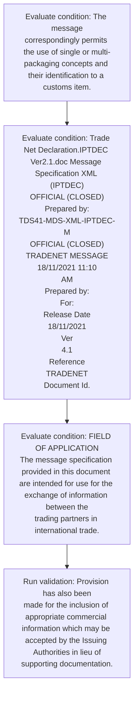
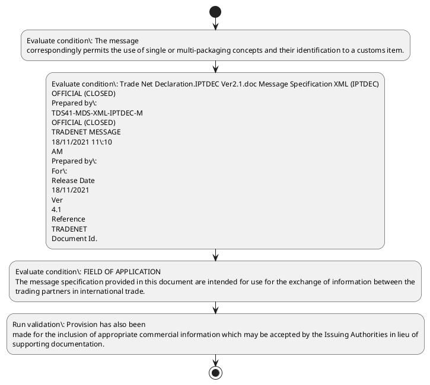

# Chapter  / Section 3.1: Principles

**Chapter Title:** TradeNetDeclaration.IPTDEC Ver2.1 (2)

**Pages:** 3, 4, 5

**Purpose:** Provision has also been
made for the inclusion of appropriate commercial information which may be accepted by the Issuing Authorities in lieu of
supporting documentation.

**Purpose Thanglish:** Indha Principles section-la, Provision has also been
made for the inclusion of appropriate commercial information which may be accepted by the Issuing Authorities in lieu of
supporting documentation.

**Summary:** 3.1 Principles
This message incorporates the necessary transport, statistical, and declaration information. Provision has also been
made for the inclusion of appropriate commercial information which may be accepted by the Issuing Authorities in lieu of
supporting documentation. The design principles adopted allow for referencing one or more commercial documents pertaining to the same declaration
and for the grouping of document lines into a single customs item.

**Business Meaning:** 3.1 Principles
This message incorporates the necessary transport, statistical, and declaration information.

**Business Explanation:** 3.1 Principles
This message incorporates the necessary transport, statistical, and declaration information. Provision has also been
made for the inclusion of appropriate commercial information which may be accepted by the Issuing Authorities in lieu of
supporting documentation. The design principles adopted allow for referencing one or more commercial documents pertaining to the same declaration
and for the grouping of document lines into a single customs item.

**Business Explanation Thanglish:** Indha Principles section-la, 3.1 Principles
This message incorporates the necessary transport, statistical, and declaration information. Provision has also been
made for the inclusion of appropriate commercial information which may be accepted by the Issuing Authorities in lieu of
supporting documentation. The design principles adopted allow for referencing one or more commercial documents pertaining to the same declaration
and for the grouping of document lines into a single customs item.

## Business Logic
- None identified

## Business Rules
- rule_id=CH-SEC3_1-R001, rule_description=3.1 Principles
This message incorporates the necessary transport, statistical, and declaration information. Provision has also been
made for the inclusion of appropriate commercial information which may be accepted by the Issuing Authorities in lieu of
supporting documentation. The design principles adopted allow for referencing one or more commercial documents pertaining to the same declaration
and for the grouping of document lines into a single customs item., trigger=Principles, condition=The message
correspondingly permits the use of single or multi-packaging concepts and their identification to a customs item., validation=Provision has also been
made for the inclusion of appropriate commercial information which may be accepted by the Issuing Authorities in lieu of
supporting documentation., action=Manual review required., exception=No explicit exception found in uploaded documents., output=DEKAI should produce a compliance decision for 3.1 - Principles.

## Conditions
- The message
correspondingly permits the use of single or multi-packaging concepts and their identification to a customs item.
- Trade Net Declaration.IPTDEC Ver2.1.doc Message Specification XML (IPTDEC)
OFFICIAL (CLOSED)
Prepared by:
TDS41-MDS-XML-IPTDEC-M
OFFICIAL (CLOSED)
TRADENET MESSAGE
18/11/2021 11:10
AM
Prepared by:
For:
Release Date
18/11/2021
Ver
4.1
Reference
TRADENET
Document Id.
- FIELD OF APPLICATION
The message specification provided in this document are intended for use for the exchange of information between the
trading partners in international trade.
- REFERENCES
S/ Document Name Document/Directory Rev Date
N Reference
1 Trade Net Declaration message specification TDS41-MDS-XML-
DECLARATION-TX
2 Trade Net Response message specification TDS41-MDS-XML-
RESPONSE-TX
3 UN/CEFACT XML Naming and Design Rules Naming And Design Rules
_2.0.doc
4 UN/ECE WP Recommendation No.
- 21, Codes CEFACT/ICG/2010/IC01 12 Jul 10
for Types of Cargo, Packages and Packaging Material 0/Rev.1
12 STDID Code Lists STDID-TDS41-COD
Trade Net Declaration.IPTDEC Ver2.1.doc Message Specification XML (IPTDEC)
OFFICIAL (CLOSED)
Prepared by:
TDS41-MDS-XML-IPTDEC-M
S/
N | Document Name | Document/Directory
Reference | Rev | Date
1 | Trade Net Declaration message specification | TDS41-MDS-XML-
DECLARATION-TX | |
2 | Trade Net Response message specification | TDS41-MDS-XML-
RESPONSE-TX | |
3 | UN/CEFACT XML Naming and Design Rules | Naming And Design Rules
_2.0.doc | |
4 | UN/ECE WP Recommendation No.
- REFERENCES
S/
N
Document Name
Document/Directory
Reference
Rev
Date
1
Trade Net Declaration message specification
TDS41-MDS-XML-
DECLARATION-TX
2
Trade Net Response message specification
TDS41-MDS-XML-
RESPONSE-TX
3
UN/CEFACT XML Naming and Design Rules
Naming And Design Rules
_2.0.doc
4
UN/ECE WP Recommendation No.

## Condition Logic
- id=.3.1.1, if=The message
correspondingly permits the use of single or multi-packaging concepts and their identification to a customs item., then=Route for review, source=The message
correspondingly permits the use of single or multi-packaging concepts and their identification to a customs item.
- id=.3.1.2, if=Trade Net Declaration.IPTDEC Ver2.1.doc Message Specification XML (IPTDEC)
OFFICIAL (CLOSED)
Prepared by:
TDS41-MDS-XML-IPTDEC-M
OFFICIAL (CLOSED)
TRADENET MESSAGE
18/11/2021 11:10
AM
Prepared by:
For:
Release Date
18/11/2021
Ver
4.1
Reference
TRADENET
Document Id., then=Route for review, source=Trade Net Declaration.IPTDEC Ver2.1.doc Message Specification XML (IPTDEC)
OFFICIAL (CLOSED)
Prepared by:
TDS41-MDS-XML-IPTDEC-M
OFFICIAL (CLOSED)
TRADENET MESSAGE
18/11/2021 11:10
AM
Prepared by:
For:
Release Date
18/11/2021
Ver
4.1
Reference
TRADENET
Document Id.
- id=.3.1.3, if=FIELD OF APPLICATION
The message specification provided in this document are intended for use for the exchange of information between the
trading partners in international trade., then=Route for review, source=FIELD OF APPLICATION
The message specification provided in this document are intended for use for the exchange of information between the
trading partners in international trade.
- id=.3.1.4, if=REFERENCES
S/ Document Name Document/Directory Rev Date
N Reference
1 Trade Net Declaration message specification TDS41-MDS-XML-
DECLARATION-TX
2 Trade Net Response message specification TDS41-MDS-XML-
RESPONSE-TX
3 UN/CEFACT XML Naming and Design Rules Naming And Design Rules
_2.0.doc
4 UN/ECE WP Recommendation No., then=Route for review, source=REFERENCES
S/ Document Name Document/Directory Rev Date
N Reference
1 Trade Net Declaration message specification TDS41-MDS-XML-
DECLARATION-TX
2 Trade Net Response message specification TDS41-MDS-XML-
RESPONSE-TX
3 UN/CEFACT XML Naming and Design Rules Naming And Design Rules
_2.0.doc
4 UN/ECE WP Recommendation No.
- id=.3.1.5, if=21, Codes CEFACT/ICG/2010/IC01 12 Jul 10
for Types of Cargo, Packages and Packaging Material 0/Rev.1
12 STDID Code Lists STDID-TDS41-COD
Trade Net Declaration.IPTDEC Ver2.1.doc Message Specification XML (IPTDEC)
OFFICIAL (CLOSED)
Prepared by:
TDS41-MDS-XML-IPTDEC-M
S/
N | Document Name | Document/Directory
Reference | Rev | Date
1 | Trade Net Declaration message specification | TDS41-MDS-XML-
DECLARATION-TX | |
2 | Trade Net Response message specification | TDS41-MDS-XML-
RESPONSE-TX | |
3 | UN/CEFACT XML Naming and Design Rules | Naming And Design Rules
_2.0.doc | |
4 | UN/ECE WP Recommendation No., then=Route for review, source=21, Codes CEFACT/ICG/2010/IC01 12 Jul 10
for Types of Cargo, Packages and Packaging Material 0/Rev.1
12 STDID Code Lists STDID-TDS41-COD
Trade Net Declaration.IPTDEC Ver2.1.doc Message Specification XML (IPTDEC)
OFFICIAL (CLOSED)
Prepared by:
TDS41-MDS-XML-IPTDEC-M
S/
N | Document Name | Document/Directory
Reference | Rev | Date
1 | Trade Net Declaration message specification | TDS41-MDS-XML-
DECLARATION-TX | |
2 | Trade Net Response message specification | TDS41-MDS-XML-
RESPONSE-TX | |
3 | UN/CEFACT XML Naming and Design Rules | Naming And Design Rules
_2.0.doc | |
4 | UN/ECE WP Recommendation No.
- id=.3.1.6, if=REFERENCES
S/
N
Document Name
Document/Directory
Reference
Rev
Date
1
Trade Net Declaration message specification
TDS41-MDS-XML-
DECLARATION-TX
2
Trade Net Response message specification
TDS41-MDS-XML-
RESPONSE-TX
3
UN/CEFACT XML Naming and Design Rules
Naming And Design Rules
_2.0.doc
4
UN/ECE WP Recommendation No., then=Route for review, source=REFERENCES
S/
N
Document Name
Document/Directory
Reference
Rev
Date
1
Trade Net Declaration message specification
TDS41-MDS-XML-
DECLARATION-TX
2
Trade Net Response message specification
TDS41-MDS-XML-
RESPONSE-TX
3
UN/CEFACT XML Naming and Design Rules
Naming And Design Rules
_2.0.doc
4
UN/ECE WP Recommendation No.

## Validations
- Provision has also been
made for the inclusion of appropriate commercial information which may be accepted by the Issuing Authorities in lieu of
supporting documentation.

## Exceptions
- None identified

## Dependencies
- None identified

## Authorities
- Issuing Authorities
- customs

## Required Documents
- 3.1 Principles
This message incorporates the necessary transport, statistical, and declaration information.
- Provision has also been
made for the inclusion of appropriate commercial information which may be accepted by the Issuing Authorities in lieu of
supporting documentation.
- The design principles adopted allow for referencing one or more commercial documents pertaining to the same declaration
and for the grouping of document lines into a single customs item.
- A customs item consists of the grouping of those
document lines having the same customs characteristics (eg.
- invoice number, Declaration Type etc).
- Trade Net Declaration
- FIELD OF APPLICATION
The message specification provided in this document are intended for use for the exchange of information between the
trading partners in international trade.
- S/ Document Name Document
- 21, Codes
for Types of Cargo, Packages and Packaging Material | CEFACT/ICG/2010/IC01
0/Rev.1 | | 12 Jul 10
12 | STDID Code Lists | STDID-TDS41-COD | |
OFFICIAL (CLOSED)
TRADENET MESSAGE
18/11/2021 11:10
AM
Prepared by:
For:
Release Date
18/11/2021
Ver
4.1
Reference
TRADENET
Document Id.

## Timelines
- None identified

## Actions
- None identified

## Workflow
- Evaluate condition: The message
correspondingly permits the use of single or multi-packaging concepts and their identification to a customs item.
- Evaluate condition: Trade Net Declaration.IPTDEC Ver2.1.doc Message Specification XML (IPTDEC)
OFFICIAL (CLOSED)
Prepared by:
TDS41-MDS-XML-IPTDEC-M
OFFICIAL (CLOSED)
TRADENET MESSAGE
18/11/2021 11:10
AM
Prepared by:
For:
Release Date
18/11/2021
Ver
4.1
Reference
TRADENET
Document Id.
- Evaluate condition: FIELD OF APPLICATION
The message specification provided in this document are intended for use for the exchange of information between the
trading partners in international trade.
- Run validation: Provision has also been
made for the inclusion of appropriate commercial information which may be accepted by the Issuing Authorities in lieu of
supporting documentation.

## Workflow ASCII
```text
Principles
Evaluate condition: The message
correspondingly permits the use of single or multi-packaging concepts and their identification to a customs item.
   |
   v
Evaluate condition: Trade Net Declaration.IPTDEC Ver2.1.doc Message Specification XML (IPTDEC)
OFFICIAL (CLOSED)
Prepared by:
TDS41-MDS-XML-IPTDEC-M
OFFICIAL (CLOSED)
TRADENET MESSAGE
18/11/2021 11:10
AM
Prepared by:
For:
Release Date
18/11/2021
Ver
4.1
Reference
TRADENET
Document Id.
   |
   v
Evaluate condition: FIELD OF APPLICATION
The message specification provided in this document are intended for use for the exchange of information between the
trading partners in international trade.
   |
   v
Run validation: Provision has also been
made for the inclusion of appropriate commercial information which may be accepted by the Issuing Authorities in lieu of
supporting documentation.
```

## Decision Tree
- IF section 3.1 applies THEN proceed with standard DGFT workflow

## Decision Tree ASCII
```text
Principles Decision
IF section 3.1 applies THEN proceed with standard DGFT workflow
```

## Examples
- User asks to process Principles; the platform checks conditions, validations, and documents before action.

**Real-world Example:** Example: an importer or exporter invokes Principles, submits 3.1 Principles
This message incorporates the necessary transport, statistical, and declaration information., Provision has also been
made for the inclusion of appropriate commercial information which may be accepted by the Issuing Authorities in lieu of
supporting documentation., The design principles adopted allow for referencing one or more commercial documents pertaining to the same declaration
and for the grouping of document lines into a single customs item., and DEKAI uses the extracted rules to follow the principles process.

**Real-world Example Thanglish:** Indha Principles section-la, Example: an importer or exporter invokes Principles, submits 3.1 Principles
This message incorporates the necessary transport, statistical, and declaration information., Provision has also been
made for the inclusion of appropriate commercial information which may be accepted by the Issuing Authorities in lieu of
supporting documentation., The design principles adopted allow for referencing one or more commercial documents pertaining to the same declaration
and for the grouping of document lines into a single customs item., and DEKAI uses the extracted rules to follow the principles process.

## AI Rules
- None identified

## Database Fields
- name=section_code, type=string, required=True, source=parsed_section_heading
- name=section_title, type=string, required=True, source=parsed_section_heading
- name=the_flag, type=boolean, required=False, source=keyword:the
- name=and_flag, type=boolean, required=False, source=keyword:and
- name=has_flag, type=boolean, required=False, source=keyword:has
- name=for_flag, type=boolean, required=False, source=keyword:for
- name=may_flag, type=boolean, required=False, source=keyword:may
- name=one_flag, type=boolean, required=False, source=keyword:one
- name=etc_flag, type=boolean, required=False, source=keyword:etc
- name=use_flag, type=boolean, required=False, source=keyword:use
- name=document_1_submitted, type=boolean, required=True, source=3.1 Principles
This message incorporates the necessary transport, statistical, and declaration information.
- name=document_2_submitted, type=boolean, required=True, source=Provision has also been
made for the inclusion of appropriate commercial information which may be accepted by the Issuing Authorities in lieu of
supporting documentation.
- name=document_3_submitted, type=boolean, required=True, source=The design principles adopted allow for referencing one or more commercial documents pertaining to the same declaration
and for the grouping of document lines into a single customs item.
- name=document_4_submitted, type=boolean, required=True, source=A customs item consists of the grouping of those
document lines having the same customs characteristics (eg.
- name=document_5_submitted, type=boolean, required=True, source=invoice number, Declaration Type etc).
- name=document_6_submitted, type=boolean, required=True, source=Trade Net Declaration

## API Requirements
- method=GET, path=/api/dgft/sections/3.1, purpose=Retrieve knowledge payload for section 3.1, query_params=['include=workflow,decision_tree,validations'], response_fields=['section', 'title', 'summary', 'conditions', 'validations', 'exceptions', 'workflow', 'decision_tree']
- method=POST, path=/api/dgft/Principles/validate, purpose=Validate inputs and documents for Principles, request_fields=['section_code', 'section_title', 'document_1_submitted', 'document_2_submitted', 'document_3_submitted', 'document_4_submitted', 'document_5_submitted', 'document_6_submitted'], response_fields=['status', 'errors', 'warnings', 'next_actions']

## UI Screens
- screen_id=Principles_overview, name=Principles Overview, purpose=Show section summary, authority, timeline, and eligibility cues., widgets=['summary_card', 'conditions_table', 'authority_badges', 'timeline_panel']
- screen_id=Principles_submission, name=Principles Submission, purpose=Capture applicant data and supporting documents., widgets=['dynamic_form', 'document_uploader', 'validation_panel', 'next_action_footer'], fields=['section_code', 'section_title', 'the_flag', 'and_flag', 'has_flag', 'for_flag', 'may_flag', 'one_flag']

## Error Messages
- Validation failed because the section requirements were not fully met.

## FAQ
- question_en=What is the purpose of section 3.1?, answer_en=3.1 Principles
This message incorporates the necessary transport, statistical, and declaration information. Provision has also been
made for the inclusion of appropriate commercial information which may be accepted by the Issuing Authorities in lieu of
supporting documentation. The design principles adopted allow for referencing one or more commercial documents pertaining to the same declaration
and for the grouping of document lines into a single customs item., question_thanglish=Indha Principles section-la, What is the purpose of section 3.1?, answer_thanglish=Indha Principles section-la, 3.1 Principles
This message incorporates the necessary transport, statistical, and declaration information. Provision has also been
made for the inclusion of appropriate commercial information which may be accepted by the Issuing Authorities in lieu of
supporting documentation. The design principles adopted allow for referencing one or more commercial documents pertaining to the same declaration
and for the grouping of document lines into a single customs item.
- question_en=What documents are required under Principles?, answer_en=3.1 Principles
This message incorporates the necessary transport, statistical, and declaration information., Provision has also been
made for the inclusion of appropriate commercial information which may be accepted by the Issuing Authorities in lieu of
supporting documentation., The design principles adopted allow for referencing one or more commercial documents pertaining to the same declaration
and for the grouping of document lines into a single customs item., A customs item consists of the grouping of those
document lines having the same customs characteristics (eg., invoice number, Declaration Type etc)., Trade Net Declaration, FIELD OF APPLICATION
The message specification provided in this document are intended for use for the exchange of information between the
trading partners in international trade., S/ Document Name Document, 21, Codes
for Types of Cargo, Packages and Packaging Material | CEFACT/ICG/2010/IC01
0/Rev.1 | | 12 Jul 10
12 | STDID Code Lists | STDID-TDS41-COD | |
OFFICIAL (CLOSED)
TRADENET MESSAGE
18/11/2021 11:10
AM
Prepared by:
For:
Release Date
18/11/2021
Ver
4.1
Reference
TRADENET
Document Id., question_thanglish=Indha Principles section-la, What documents are required under Principles?, answer_thanglish=Indha Principles section-la, 3.1 Principles
This message incorporates the necessary transport, statistical, and declaration information., Provision has also been
made for the inclusion of appropriate commercial information which may be accepted by the Issuing Authorities in lieu of
supporting documentation., The design principles adopted allow for referencing one or more commercial documents pertaining to the same declaration
and for the grouping of document lines into a single customs item., A customs item consists of the grouping of those
document lines having the same customs characteristics (eg., invoice number, Declaration Type etc)., Trade Net Declaration, FIELD OF application
The message specification provided in this document are intended for use for the exchange of information between the
trading partners in international trade., S/ Document Name Document, 21, Codes
for Types of Cargo, Packages and Packaging Material | CEFACT/ICG/2010/IC01
0/Rev.1 | | 12 Jul 10
12 | STDID Code Lists | STDID-TDS41-COD | |
OFFICIAL (CLOSED)
TRADENET MESSAGE
18/11/2021 11:10
AM
Prepared by:
For:
Release Date
18/11/2021
Ver
4.1
Reference
TRADENET
Document Id.
- question_en=Which authority handles Principles?, answer_en=Issuing Authorities, customs, question_thanglish=Indha Principles section-la, Which authority handles Principles?, answer_thanglish=Indha Principles section-la, Issuing Authorities, customs

## Questions Users May Ask
- What does Principles require?
- Which documents are needed for Principles?
- How does DEKAI validate Principles requests?

## Expected AI Answers
- Principles requires the platform to interpret the section text, apply the extracted business rules, and present the correct next action.
- Required documents are inferred from the section text: 3.1 Principles
This message incorporates the necessary transport, statistical, and declaration information., Provision has also been
made for the inclusion of appropriate commercial information which may be accepted by the Issuing Authorities in lieu of
supporting documentation., The design principles adopted allow for referencing one or more commercial documents pertaining to the same declaration
and for the grouping of document lines into a single customs item., A customs item consists of the grouping of those
document lines having the same customs characteristics (eg., invoice number, Declaration Type etc).
- DEKAI validates Principles by checking conditions, required documents, authority references, and exception clauses before recommending an outcome.

## AI Q&A Examples
- question_en=User asks: How do I comply with Principles?, answer_en=AI answers: DEKAI should evaluate section 3.1, apply the extracted rules, and guide the user through Evaluate condition: The message
correspondingly permits the use of single or multi-packaging concepts and their identification to a customs item.., question_thanglish=Indha Principles section-la, User asks: How do I comply with Principles?, answer_thanglish=Indha Principles section-la, AI answers: DEKAI should evaluate section 3.1, apply the extracted rules, and guide the user through Evaluate condition: The message
correspondingly permits the use of single or multi-packaging concepts and their identification to a customs item..
- question_en=User asks: Which validations apply to Principles?, answer_en=AI answers: Applicable validations are Provision has also been
made for the inclusion of appropriate commercial information which may be accepted by the Issuing Authorities in lieu of
supporting documentation., question_thanglish=Indha Principles section-la, User asks: Which validations apply to Principles?, answer_thanglish=Indha Principles section-la, AI answers: Applicable validations are Provision has also been
made for the inclusion of appropriate commercial information which may be accepted by the Issuing Authorities in lieu of
supporting documentation.

## DEKAI AI Implementation Notes
- Capture chapter , section 3.1, title, and page references as immutable knowledge metadata.
- Bind validations for Principles into a rule engine keyed by the rule IDs extracted for this section.
- Expose document upload controls for: 3.1 Principles
This message incorporates the necessary transport, statistical, and declaration information., Provision has also been
made for the inclusion of appropriate commercial information which may be accepted by the Issuing Authorities in lieu of
supporting documentation., The design principles adopted allow for referencing one or more commercial documents pertaining to the same declaration
and for the grouping of document lines into a single customs item., A customs item consists of the grouping of those
document lines having the same customs characteristics (eg., invoice number, Declaration Type etc)., Trade Net Declaration.
- Route escalations or approvals to: Issuing Authorities, customs.

## DEKAI AI Implementation Notes Thanglish
- Indha Principles section-la, Capture chapter , section 3.1, title, and page references as immutable knowledge metadata.
- Indha Principles section-la, Bind validations for Principles into a rule engine keyed by the rule IDs extracted for this section.
- Indha Principles section-la, Expose document upload controls for: 3.1 Principles
This message incorporates the necessary transport, statistical, and declaration information., Provision has also been
made for the inclusion of appropriate commercial information which may be accepted by the Issuing Authorities in lieu of
supporting documentation., The design principles adopted allow for referencing one or more commercial documents pertaining to the same declaration
and for the grouping of document lines into a single customs item., A customs item consists of the grouping of those
document lines having the same customs characteristics (eg., invoice number, Declaration Type etc)., Trade Net Declaration.
- Indha Principles section-la, Route escalations or approvals to: Issuing Authorities, customs.

## AI Metadata
- Keywords: the, and, has, for, may, one, etc, use, Net, doc, XML, Ver, are, not, Rev, Jan, ISO, Dec, Sep, III
- Search Keywords: the, and, has, for, may, one, etc, use, Net, doc, XML, Ver, are, not, Rev, Jan, ISO, Dec, Sep, III
- Intent: Provide knowledge guidance for Principles.
- Tags: 3.1, Principles, document-driven, dgft
- Related Sections: 
- Related Chapters: 
- Related Rules: 

## Mermaid


## PlantUML

