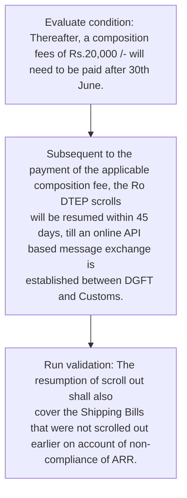
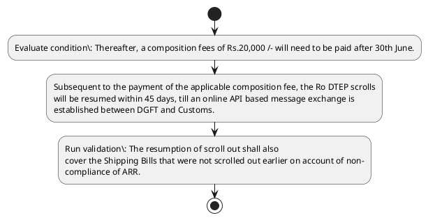

# Chapter 4 / Section 3: A composition fee of Rs. 10,000/- will need to be paid for delayed filing of ARR upto

**Chapter Title:** Duty Exemption / Remission Schemes

**Pages:** 55

**Purpose:** 10,000/- will need to be paid for delayed filing of ARR upto
30th June i.e.

**Purpose Thanglish:** Indha A composition fee of Rs. 10,000/- will need to be paid for delayed filing of ARR upto section-la, 10,000/- will need to be paid for delayed filing of ARR upto
30th June i.e.

**Summary:** 3. A composition fee of Rs. 10,000/- will need to be paid for delayed filing of ARR upto
30th June i.e.

**Business Meaning:** A composition fee of Rs. 10,000/- will need to be paid for delayed filing of ARR upto governs how DGFT business controls should be applied, validated, and enforced.

**Business Explanation:** A composition fee of Rs. 10,000/- will need to be paid for delayed filing of ARR upto explains the operating rule set that DEKAI should enforce. Key control points include The resumption of scroll out shall also
cover the Shipping Bills that were not scrolled out earlier on account of non-
compliance of ARR. The section also drives actions such as Subsequent to the payment of the applicable composition fee, the Ro DTEP scrolls
will be resumed within 45 days, till an online API based message exchange is
established between DGFT and Customs..

**Business Explanation Thanglish:** Indha A composition fee of Rs. 10,000/- will need to be paid for delayed filing of ARR upto section-la, A composition fee of Rs. 10,000/- will need to be paid for delayed filing of ARR upto explains the operating rule set that DEKAI should enforce. Key control points include The resumption of scroll out kandippa also
cover the Shipping Bills that were not scrolled out earlier on account of non-
compliance of ARR. The section also drives actions such as Subsequent to the payment of the applicable composition fee, the Ro DTEP scrolls
will be resumed within 45 days, till an online API based message exchange is
established between DGFT and Customs..

## Business Logic
- The resumption of scroll out shall also
cover the Shipping Bills that were not scrolled out earlier on account of non-
compliance of ARR.

## Business Rules
- rule_id=CH4-SEC3-R001, rule_description=The resumption of scroll out shall also
cover the Shipping Bills that were not scrolled out earlier on account of non-
compliance of ARR., trigger=A composition fee of Rs. 10,000/- will need to be paid for delayed filing of ARR upto, condition=Thereafter, a composition fees of Rs.20,000 /- will need to be paid after 30th June., validation=The resumption of scroll out shall also
cover the Shipping Bills that were not scrolled out earlier on account of non-
compliance of ARR., action=Subsequent to the payment of the applicable composition fee, the Ro DTEP scrolls
will be resumed within 45 days, till an online API based message exchange is
established between DGFT and Customs., exception=No explicit exception found in uploaded documents., output=DEKAI should produce a compliance decision for 3 - A composition fee of Rs. 10,000/- will need to be paid for delayed filing of ARR upto.

## Conditions
- Thereafter, a composition fees of Rs.20,000 /- will need to be paid after 30th June.

## Condition Logic
- id=4.3.1, if=Thereafter, a composition fees of Rs.20,000 /- will need to be paid after 30th June., then=Subsequent to the payment of the applicable composition fee, the Ro DTEP scrolls
will be resumed within 45 days, till an online API based message exchange is
established between DGFT and Customs., source=Thereafter, a composition fees of Rs.20,000 /- will need to be paid after 30th June.

## Validations
- The resumption of scroll out shall also
cover the Shipping Bills that were not scrolled out earlier on account of non-
compliance of ARR.

## Exceptions
- None identified

## Dependencies
- 1
- 2
- 4
- 5
- 6

## Authorities
- DGFT
- Customs
- DGFT and Customs

## Required Documents
- The resumption of scroll out shall also
cover the Shipping Bills that were not scrolled out earlier on account of non-
compliance of ARR.

## Timelines
- RODTEP claims information for Financial Year 2023-24 with
composition fees can be filed within a grace period of 3 months i.e.by 30.06.2025.
- Thereafter, a composition fees of Rs.20,000 /- will need to be paid after 30th June.
- Subsequent to the payment of the applicable composition fee, the Ro DTEP scrolls
will be resumed within 45 days, till an online API based message exchange is
established between DGFT and Customs.

## Actions
- Subsequent to the payment of the applicable composition fee, the Ro DTEP scrolls
will be resumed within 45 days, till an online API based message exchange is
established between DGFT and Customs.

## Workflow
- Evaluate condition: Thereafter, a composition fees of Rs.20,000 /- will need to be paid after 30th June.
- Subsequent to the payment of the applicable composition fee, the Ro DTEP scrolls
will be resumed within 45 days, till an online API based message exchange is
established between DGFT and Customs.
- Run validation: The resumption of scroll out shall also
cover the Shipping Bills that were not scrolled out earlier on account of non-
compliance of ARR.

## Workflow ASCII
```text
A composition fee of Rs. 10,000/- will need to be paid for delayed filing of ARR upto
Evaluate condition: Thereafter, a composition fees of Rs.20,000 /- will need to be paid after 30th June.
   |
   v
Subsequent to the payment of the applicable composition fee, the Ro DTEP scrolls
will be resumed within 45 days, till an online API based message exchange is
established between DGFT and Customs.
   |
   v
Run validation: The resumption of scroll out shall also
cover the Shipping Bills that were not scrolled out earlier on account of non-
compliance of ARR.
```

## Decision Tree
- IF Thereafter, a composition fees of Rs.20,000 /- will need to be paid after 30th June. THEN Subsequent to the payment of the applicable composition fee, the Ro DTEP scrolls
will be resumed within 45 days, till an online API based message exchange is
established between DGFT and Customs.

## Decision Tree ASCII
```text
A composition fee of Rs. 10,000/- will need to be paid for delayed filing of ARR upto Decision
IF Thereafter, a composition fees of Rs.20,000 /- will need to be paid after 30th June. THEN Subsequent to the payment of the applicable composition fee, the Ro DTEP scrolls
will be resumed within 45 days, till an online API based message exchange is
established between DGFT and Customs.
```

## Examples
- User asks to process A composition fee of Rs. 10,000/- will need to be paid for delayed filing of ARR upto; the platform checks conditions, validations, and documents before action.

**Real-world Example:** Example: an importer or exporter invokes A composition fee of Rs. 10,000/- will need to be paid for delayed filing of ARR upto, submits The resumption of scroll out shall also
cover the Shipping Bills that were not scrolled out earlier on account of non-
compliance of ARR., and DEKAI uses the extracted rules to subsequent to the payment of the applicable composition fee, the ro dtep scrolls
will be resumed within 45 days, till an online api based message exchange is
established between dgft and customs..

**Real-world Example Thanglish:** Indha A composition fee of Rs. 10,000/- will need to be paid for delayed filing of ARR upto section-la, Example: an importer or exporter invokes A composition fee of Rs. 10,000/- will need to be paid for delayed filing of ARR upto, submits The resumption of scroll out kandippa also
cover the Shipping Bills that were not scrolled out earlier on account of non-
compliance of ARR., and DEKAI uses the extracted rules to subsequent to the payment of the applicable composition fee, the ro dtep scrolls
will be resumed within 45 days, till an online api based message exchange is
established between dgft and customs..

## AI Rules
- IF detected context matches section rule THEN enforce: The resumption of scroll out shall also
cover the Shipping Bills that were not scrolled out earlier on account of non-
compliance of ARR.
- IF validations pass THEN recommend action: Subsequent to the payment of the applicable composition fee, the Ro DTEP scrolls
will be resumed within 45 days, till an online API based message exchange is
established between DGFT and Customs.

## Database Fields
- name=section_code, type=string, required=True, source=parsed_section_heading
- name=section_title, type=string, required=True, source=parsed_section_heading
- name=fee_flag, type=boolean, required=False, source=keyword:fee
- name=for_flag, type=boolean, required=False, source=keyword:for
- name=arr_flag, type=boolean, required=False, source=keyword:ARR
- name=can_flag, type=boolean, required=False, source=keyword:can
- name=the_flag, type=boolean, required=False, source=keyword:the
- name=api_flag, type=boolean, required=False, source=keyword:API
- name=and_flag, type=boolean, required=False, source=keyword:and
- name=out_flag, type=boolean, required=False, source=keyword:out
- name=document_1_submitted, type=boolean, required=True, source=The resumption of scroll out shall also
cover the Shipping Bills that were not scrolled out earlier on account of non-
compliance of ARR.

## API Requirements
- method=GET, path=/api/dgft/sections/3, purpose=Retrieve knowledge payload for section 3, query_params=['include=workflow,decision_tree,validations'], response_fields=['section', 'title', 'summary', 'conditions', 'validations', 'exceptions', 'workflow', 'decision_tree']
- method=POST, path=/api/dgft/A-composition-fee-of-Rs-10-000-will-need-to-be-paid-for-delayed-filing-of-ARR-upto/validate, purpose=Validate inputs and documents for A composition fee of Rs. 10,000/- will need to be paid for delayed filing of ARR upto, request_fields=['section_code', 'section_title', 'document_1_submitted'], response_fields=['status', 'errors', 'warnings', 'next_actions']
- method=POST, path=/api/dgft/A-composition-fee-of-Rs-10-000-will-need-to-be-paid-for-delayed-filing-of-ARR-upto/execute, purpose=Trigger business action for Subsequent to the payment of the applicable composition fee, the Ro DTEP scrolls
will be resumed within 45 days, till an online API based message exchange is
established between DGFT and Customs., request_fields=['section_code', 'section_title', 'document_1_submitted'], response_fields=['reference_id', 'status', 'authority', 'timeline']

## UI Screens
- screen_id=A_composition_fee_of_Rs_10_000_will_need_to_be_paid_for_delayed_filing_of_ARR_upto_overview, name=A composition fee of Rs. 10,000/- will need to be paid for delayed filing of ARR upto Overview, purpose=Show section summary, authority, timeline, and eligibility cues., widgets=['summary_card', 'conditions_table', 'authority_badges', 'timeline_panel']
- screen_id=A_composition_fee_of_Rs_10_000_will_need_to_be_paid_for_delayed_filing_of_ARR_upto_submission, name=A composition fee of Rs. 10,000/- will need to be paid for delayed filing of ARR upto Submission, purpose=Capture applicant data and supporting documents., widgets=['dynamic_form', 'document_uploader', 'validation_panel', 'next_action_footer'], fields=['section_code', 'section_title', 'fee_flag', 'for_flag', 'arr_flag', 'can_flag', 'the_flag', 'api_flag']

## Error Messages
- Validation failed because the section requirements were not fully met.

## FAQ
- question_en=What is the purpose of section 3?, answer_en=A composition fee of Rs. 10,000/- will need to be paid for delayed filing of ARR upto explains the operating rule set that DEKAI should enforce. Key control points include The resumption of scroll out shall also
cover the Shipping Bills that were not scrolled out earlier on account of non-
compliance of ARR. The section also drives actions such as Subsequent to the payment of the applicable composition fee, the Ro DTEP scrolls
will be resumed within 45 days, till an online API based message exchange is
established between DGFT and Customs.., question_thanglish=Indha A composition fee of Rs. 10,000/- will need to be paid for delayed filing of ARR upto section-la, What is the purpose of section 3?, answer_thanglish=Indha A composition fee of Rs. 10,000/- will need to be paid for delayed filing of ARR upto section-la, A composition fee of Rs. 10,000/- will need to be paid for delayed filing of ARR upto explains the operating rule set that DEKAI should enforce. Key control points include The resumption of scroll out kandippa also
cover the Shipping Bills that were not scrolled out earlier on account of non-
compliance of ARR. The section also drives actions such as Subsequent to the payment of the applicable composition fee, the Ro DTEP scrolls
will be resumed within 45 days, till an online API based message exchange is
established between DGFT and Customs..
- question_en=What documents are required under A composition fee of Rs. 10,000/- will need to be paid for delayed filing of ARR upto?, answer_en=The resumption of scroll out shall also
cover the Shipping Bills that were not scrolled out earlier on account of non-
compliance of ARR., question_thanglish=Indha A composition fee of Rs. 10,000/- will need to be paid for delayed filing of ARR upto section-la, What documents are required under A composition fee of Rs. 10,000/- will need to be paid for delayed filing of ARR upto?, answer_thanglish=Indha A composition fee of Rs. 10,000/- will need to be paid for delayed filing of ARR upto section-la, The resumption of scroll out kandippa also
cover the Shipping Bills that were not scrolled out earlier on account of non-
compliance of ARR.
- question_en=Which authority handles A composition fee of Rs. 10,000/- will need to be paid for delayed filing of ARR upto?, answer_en=DGFT, Customs, DGFT and Customs, question_thanglish=Indha A composition fee of Rs. 10,000/- will need to be paid for delayed filing of ARR upto section-la, Which authority handles A composition fee of Rs. 10,000/- will need to be paid for delayed filing of ARR upto?, answer_thanglish=Indha A composition fee of Rs. 10,000/- will need to be paid for delayed filing of ARR upto section-la, DGFT, Customs, DGFT and Customs

## Questions Users May Ask
- What does A composition fee of Rs. 10,000/- will need to be paid for delayed filing of ARR upto require?
- Which documents are needed for A composition fee of Rs. 10,000/- will need to be paid for delayed filing of ARR upto?
- How does DEKAI validate A composition fee of Rs. 10,000/- will need to be paid for delayed filing of ARR upto requests?
- What action should be taken for A composition fee of Rs. 10,000/- will need to be paid for delayed filing of ARR upto?

## Expected AI Answers
- A composition fee of Rs. 10,000/- will need to be paid for delayed filing of ARR upto requires the platform to interpret the section text, apply the extracted business rules, and present the correct next action.
- Required documents are inferred from the section text: The resumption of scroll out shall also
cover the Shipping Bills that were not scrolled out earlier on account of non-
compliance of ARR.
- DEKAI validates A composition fee of Rs. 10,000/- will need to be paid for delayed filing of ARR upto by checking conditions, required documents, authority references, and exception clauses before recommending an outcome.
- The primary extracted action is: Subsequent to the payment of the applicable composition fee, the Ro DTEP scrolls
will be resumed within 45 days, till an online API based message exchange is
established between DGFT and Customs.

## AI Q&A Examples
- question_en=User asks: How do I comply with A composition fee of Rs. 10,000/- will need to be paid for delayed filing of ARR upto?, answer_en=AI answers: DEKAI should evaluate section 3, apply the extracted rules, and guide the user through Evaluate condition: Thereafter, a composition fees of Rs.20,000 /- will need to be paid after 30th June.., question_thanglish=Indha A composition fee of Rs. 10,000/- will need to be paid for delayed filing of ARR upto section-la, User asks: How do I comply with A composition fee of Rs. 10,000/- will need to be paid for delayed filing of ARR upto?, answer_thanglish=Indha A composition fee of Rs. 10,000/- will need to be paid for delayed filing of ARR upto section-la, AI answers: DEKAI should evaluate section 3, apply the extracted rules, and guide the user through Evaluate condition: Thereafter, a composition fees of Rs.20,000 /- will need to be paid after 30th June..
- question_en=User asks: Which validations apply to A composition fee of Rs. 10,000/- will need to be paid for delayed filing of ARR upto?, answer_en=AI answers: Applicable validations are The resumption of scroll out shall also
cover the Shipping Bills that were not scrolled out earlier on account of non-
compliance of ARR., question_thanglish=Indha A composition fee of Rs. 10,000/- will need to be paid for delayed filing of ARR upto section-la, User asks: Which validations apply to A composition fee of Rs. 10,000/- will need to be paid for delayed filing of ARR upto?, answer_thanglish=Indha A composition fee of Rs. 10,000/- will need to be paid for delayed filing of ARR upto section-la, AI answers: Applicable validations are The resumption of scroll out kandippa also
cover the Shipping Bills that were not scrolled out earlier on account of non-
compliance of ARR.

## DEKAI AI Implementation Notes
- Capture chapter 4, section 3, title, and page references as immutable knowledge metadata.
- Bind validations for A composition fee of Rs. 10,000/- will need to be paid for delayed filing of ARR upto into a rule engine keyed by the rule IDs extracted for this section.
- Expose document upload controls for: The resumption of scroll out shall also
cover the Shipping Bills that were not scrolled out earlier on account of non-
compliance of ARR..
- Route escalations or approvals to: DGFT, Customs, DGFT and Customs.
- Show contextual links to related sections: 1, 2, 4, 5, 6.

## DEKAI AI Implementation Notes Thanglish
- Indha A composition fee of Rs. 10,000/- will need to be paid for delayed filing of ARR upto section-la, Capture chapter 4, section 3, title, and page references as immutable knowledge metadata.
- Indha A composition fee of Rs. 10,000/- will need to be paid for delayed filing of ARR upto section-la, Bind validations for A composition fee of Rs. 10,000/- will need to be paid for delayed filing of ARR upto into a rule engine keyed by the rule IDs extracted for this section.
- Indha A composition fee of Rs. 10,000/- will need to be paid for delayed filing of ARR upto section-la, Expose document upload controls for: The resumption of scroll out kandippa also
cover the Shipping Bills that were not scrolled out earlier on account of non-
compliance of ARR..
- Indha A composition fee of Rs. 10,000/- will need to be paid for delayed filing of ARR upto section-la, Route escalations or approvals to: DGFT, Customs, DGFT and Customs.
- Indha A composition fee of Rs. 10,000/- will need to be paid for delayed filing of ARR upto section-la, Show contextual links to related sections: 1, 2, 4, 5, 6.

## AI Metadata
- Keywords: fee, for, ARR, can, the, API, and, out, not, non, will, need, paid, upto, June, Year, with, fees, DTEP, days
- Search Keywords: fee, for, ARR, can, the, API, and, out, not, non, will, need, paid, upto, June, Year, with, fees, DTEP, days
- Intent: Support A composition fee of Rs. 10,000/- will need to be paid for delayed filing of ARR upto processing and compliance validation.
- Tags: 3, A composition fee of Rs. 10,000/- will need to be paid for delayed filing of ARR upto, business-rule, document-driven, dgft
- Related Sections: 1, 2, 4, 5, 6
- Related Chapters: 
- Related Rules: The resumption of scroll out shall also
cover the Shipping Bills that were not scrolled out earlier on account of non-
compliance of ARR.

## Mermaid


## PlantUML

