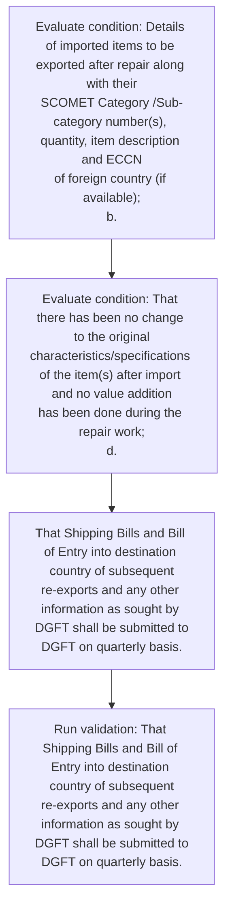

# Chapter 10 / Section 3: An Undertaking from the Indian exporter;

**Chapter Title:** SCOMET: Special Chemicals, Organisms, Materials, Equipment and Technologies

**Pages:** 17

**Purpose:** Details of imported items to be exported after repair along with their
SCOMET Category /Sub-category number(s), quantity, item description and ECCN
of foreign country (if available);
b.

**Purpose Thanglish:** Indha An Undertaking from the Indian exporter; section-la, Details of imported items to be exported after repair along with their
SCOMET Category /Sub-category number(s), quantity, item description and ECCN
of foreign country (if available);
b.

**Summary:** 3. An Undertaking from the Indian exporter;
An Undertaking from the applicant exporter (on the letter head of the firm duly
signed and stamped by the authorized signatory) stating:
a. Details of imported items to be exported after repair along with their
SCOMET Category /Sub-category number(s), quantity, item description and ECCN
of foreign country (if available);
b.

**Business Meaning:** An Undertaking from the Indian exporter; governs how DGFT business controls should be applied, validated, and enforced.

**Business Explanation:** An Undertaking from the Indian exporter; explains the operating rule set that DEKAI should enforce. Key control points include That Shipping Bills and Bill of Entry into destination country of subsequent
re-exports and any other information as sought by DGFT shall be submitted to
DGFT on quarterly basis. The section also drives actions such as That Shipping Bills and Bill of Entry into destination country of subsequent
re-exports and any other information as sought by DGFT shall be submitted to
DGFT on quarterly basis..

**Business Explanation Thanglish:** Indha An Undertaking from the Indian exporter; section-la, An Undertaking from the Indian exporter; explains the operating rule set that DEKAI should enforce. Key control points include That Shipping Bills and Bill of Entry into destination country of subsequent
re-exports and any other information as sought by DGFT kandippa be submitted to
DGFT on quarterly basis. The section also drives actions such as That Shipping Bills and Bill of Entry into destination country of subsequent
re-exports and any other information as sought by DGFT kandippa be submitted to
DGFT on quarterly basis..

## Business Logic
- That Shipping Bills and Bill of Entry into destination country of subsequent
re-exports and any other information as sought by DGFT shall be submitted to
DGFT on quarterly basis.

## Business Rules
- rule_id=CH10-SEC3-R001, rule_description=That Shipping Bills and Bill of Entry into destination country of subsequent
re-exports and any other information as sought by DGFT shall be submitted to
DGFT on quarterly basis., trigger=An Undertaking from the Indian exporter;, condition=Details of imported items to be exported after repair along with their
SCOMET Category /Sub-category number(s), quantity, item description and ECCN
of foreign country (if available);
b., validation=That Shipping Bills and Bill of Entry into destination country of subsequent
re-exports and any other information as sought by DGFT shall be submitted to
DGFT on quarterly basis., action=That Shipping Bills and Bill of Entry into destination country of subsequent
re-exports and any other information as sought by DGFT shall be submitted to
DGFT on quarterly basis., exception=No explicit exception found in uploaded documents., output=DEKAI should produce a compliance decision for 3 - An Undertaking from the Indian exporter;.

## Conditions
- Details of imported items to be exported after repair along with their
SCOMET Category /Sub-category number(s), quantity, item description and ECCN
of foreign country (if available);
b.
- That there has been no change to the original
characteristics/specifications of the item(s) after import and no value addition
has been done during the repair work;
d.

## Condition Logic
- id=10.3.1, if=Details of imported items to be exported after repair along with their
SCOMET Category /Sub-category number(s), quantity, item description and ECCN
of foreign country (if available);
b., then=That Shipping Bills and Bill of Entry into destination country of subsequent
re-exports and any other information as sought by DGFT shall be submitted to
DGFT on quarterly basis., source=Details of imported items to be exported after repair along with their
SCOMET Category /Sub-category number(s), quantity, item description and ECCN
of foreign country (if available);
b.
- id=10.3.2, if=That there has been no change to the original
characteristics/specifications of the item(s) after import and no value addition
has been done during the repair work;
d., then=That Shipping Bills and Bill of Entry into destination country of subsequent
re-exports and any other information as sought by DGFT shall be submitted to
DGFT on quarterly basis., source=That there has been no change to the original
characteristics/specifications of the item(s) after import and no value addition
has been done during the repair work;
d.

## Validations
- That Shipping Bills and Bill of Entry into destination country of subsequent
re-exports and any other information as sought by DGFT shall be submitted to
DGFT on quarterly basis.

## Exceptions
- None identified

## Dependencies
- 1

## Authorities
- DGFT

## Required Documents
- An Undertaking from the Indian exporter;
An Undertaking from the applicant exporter (on the letter head of the firm duly
signed and stamped by the authorized signatory) stating:
a.
- That Shipping Bills and Bill
- That items would not use for military applications or to develop, acquire,
manufacture, possess, transport, transfer or use, chemical, biological, nuclear
weapons or for missile capable of delivering such weapons.

## Timelines
- Details of imported items to be exported after repair along with their
SCOMET Category /Sub-category number(s), quantity, item description and ECCN
of foreign country (if available);
b.
- That there has been no change to the original
characteristics/specifications of the item(s) after import and no value addition
has been done during the repair work;
d.

## Actions
- That Shipping Bills and Bill of Entry into destination country of subsequent
re-exports and any other information as sought by DGFT shall be submitted to
DGFT on quarterly basis.

## Workflow
- Evaluate condition: Details of imported items to be exported after repair along with their
SCOMET Category /Sub-category number(s), quantity, item description and ECCN
of foreign country (if available);
b.
- Evaluate condition: That there has been no change to the original
characteristics/specifications of the item(s) after import and no value addition
has been done during the repair work;
d.
- That Shipping Bills and Bill of Entry into destination country of subsequent
re-exports and any other information as sought by DGFT shall be submitted to
DGFT on quarterly basis.
- Run validation: That Shipping Bills and Bill of Entry into destination country of subsequent
re-exports and any other information as sought by DGFT shall be submitted to
DGFT on quarterly basis.

## Workflow ASCII
```text
An Undertaking from the Indian exporter;
Evaluate condition: Details of imported items to be exported after repair along with their
SCOMET Category /Sub-category number(s), quantity, item description and ECCN
of foreign country (if available);
b.
   |
   v
Evaluate condition: That there has been no change to the original
characteristics/specifications of the item(s) after import and no value addition
has been done during the repair work;
d.
   |
   v
That Shipping Bills and Bill of Entry into destination country of subsequent
re-exports and any other information as sought by DGFT shall be submitted to
DGFT on quarterly basis.
   |
   v
Run validation: That Shipping Bills and Bill of Entry into destination country of subsequent
re-exports and any other information as sought by DGFT shall be submitted to
DGFT on quarterly basis.
```

## Decision Tree
- IF Details of imported items to be exported after repair along with their
SCOMET Category /Sub-category number(s), quantity, item description and ECCN
of foreign country (if available);
b. THEN That Shipping Bills and Bill of Entry into destination country of subsequent
re-exports and any other information as sought by DGFT shall be submitted to
DGFT on quarterly basis.
- IF That there has been no change to the original
characteristics/specifications of the item(s) after import and no value addition
has been done during the repair work;
d. THEN That Shipping Bills and Bill of Entry into destination country of subsequent
re-exports and any other information as sought by DGFT shall be submitted to
DGFT on quarterly basis.

## Decision Tree ASCII
```text
An Undertaking from the Indian exporter; Decision
IF Details of imported items to be exported after repair along with their
SCOMET Category /Sub-category number(s), quantity, item description and ECCN
of foreign country (if available);
b. THEN That Shipping Bills and Bill of Entry into destination country of subsequent
re-exports and any other information as sought by DGFT shall be submitted to
DGFT on quarterly basis.
   |
   v
IF That there has been no change to the original
characteristics/specifications of the item(s) after import and no value addition
has been done during the repair work;
d. THEN That Shipping Bills and Bill of Entry into destination country of subsequent
re-exports and any other information as sought by DGFT shall be submitted to
DGFT on quarterly basis.
```

## Examples
- User asks to process An Undertaking from the Indian exporter;; the platform checks conditions, validations, and documents before action.

**Real-world Example:** Example: an importer or exporter invokes An Undertaking from the Indian exporter;, submits An Undertaking from the Indian exporter;
An Undertaking from the applicant exporter (on the letter head of the firm duly
signed and stamped by the authorized signatory) stating:
a., That Shipping Bills and Bill, That items would not use for military applications or to develop, acquire,
manufacture, possess, transport, transfer or use, chemical, biological, nuclear
weapons or for missile capable of delivering such weapons., and DEKAI uses the extracted rules to that shipping bills and bill of entry into destination country of subsequent
re-exports and any other information as sought by dgft shall be submitted to
dgft on quarterly basis..

**Real-world Example Thanglish:** Indha An Undertaking from the Indian exporter; section-la, Example: an importer or exporter invokes An Undertaking from the Indian exporter;, submits An Undertaking from the Indian exporter;
An Undertaking from the applicant exporter (on the letter head of the firm duly
signed and stamped by the authorized signatory) stating:
a., That Shipping Bills and Bill, That items would not use for military applications or to develop, acquire,
manufacture, possess, transport, transfer or use, chemical, biological, nuclear
weapons or for missile capable of delivering such weapons., and DEKAI uses the extracted rules to that shipping bills and bill of entry into destination country of subsequent
re-exports and any other information as sought by dgft kandippa be submitted to
dgft on quarterly basis..

## AI Rules
- IF detected context matches section rule THEN enforce: That Shipping Bills and Bill of Entry into destination country of subsequent
re-exports and any other information as sought by DGFT shall be submitted to
DGFT on quarterly basis.
- IF validations pass THEN recommend action: That Shipping Bills and Bill of Entry into destination country of subsequent
re-exports and any other information as sought by DGFT shall be submitted to
DGFT on quarterly basis.

## Database Fields
- name=section_code, type=string, required=True, source=parsed_section_heading
- name=section_title, type=string, required=True, source=parsed_section_heading
- name=the_flag, type=boolean, required=False, source=keyword:the
- name=and_flag, type=boolean, required=False, source=keyword:and
- name=are_flag, type=boolean, required=False, source=keyword:are
- name=was_flag, type=boolean, required=False, source=keyword:was
- name=for_flag, type=boolean, required=False, source=keyword:for
- name=has_flag, type=boolean, required=False, source=keyword:has
- name=any_flag, type=boolean, required=False, source=keyword:any
- name=not_flag, type=boolean, required=False, source=keyword:not
- name=document_1_submitted, type=boolean, required=True, source=An Undertaking from the Indian exporter;
An Undertaking from the applicant exporter (on the letter head of the firm duly
signed and stamped by the authorized signatory) stating:
a.
- name=document_2_submitted, type=boolean, required=True, source=That Shipping Bills and Bill
- name=document_3_submitted, type=boolean, required=True, source=That items would not use for military applications or to develop, acquire,
manufacture, possess, transport, transfer or use, chemical, biological, nuclear
weapons or for missile capable of delivering such weapons.

## API Requirements
- method=GET, path=/api/dgft/sections/3, purpose=Retrieve knowledge payload for section 3, query_params=['include=workflow,decision_tree,validations'], response_fields=['section', 'title', 'summary', 'conditions', 'validations', 'exceptions', 'workflow', 'decision_tree']
- method=POST, path=/api/dgft/An-Undertaking-from-the-Indian-exporter/validate, purpose=Validate inputs and documents for An Undertaking from the Indian exporter;, request_fields=['section_code', 'section_title', 'document_1_submitted', 'document_2_submitted', 'document_3_submitted'], response_fields=['status', 'errors', 'warnings', 'next_actions']
- method=POST, path=/api/dgft/An-Undertaking-from-the-Indian-exporter/execute, purpose=Trigger business action for That Shipping Bills and Bill of Entry into destination country of subsequent
re-exports and any other information as sought by DGFT shall be submitted to
DGFT on quarterly basis., request_fields=['section_code', 'section_title', 'document_1_submitted', 'document_2_submitted', 'document_3_submitted'], response_fields=['reference_id', 'status', 'authority', 'timeline']

## UI Screens
- screen_id=An_Undertaking_from_the_Indian_exporter_overview, name=An Undertaking from the Indian exporter; Overview, purpose=Show section summary, authority, timeline, and eligibility cues., widgets=['summary_card', 'conditions_table', 'authority_badges', 'timeline_panel']
- screen_id=An_Undertaking_from_the_Indian_exporter_submission, name=An Undertaking from the Indian exporter; Submission, purpose=Capture applicant data and supporting documents., widgets=['dynamic_form', 'document_uploader', 'validation_panel', 'next_action_footer'], fields=['section_code', 'section_title', 'the_flag', 'and_flag', 'are_flag', 'was_flag', 'for_flag', 'has_flag']

## Error Messages
- Validation failed because the section requirements were not fully met.

## FAQ
- question_en=What is the purpose of section 3?, answer_en=An Undertaking from the Indian exporter; explains the operating rule set that DEKAI should enforce. Key control points include That Shipping Bills and Bill of Entry into destination country of subsequent
re-exports and any other information as sought by DGFT shall be submitted to
DGFT on quarterly basis. The section also drives actions such as That Shipping Bills and Bill of Entry into destination country of subsequent
re-exports and any other information as sought by DGFT shall be submitted to
DGFT on quarterly basis.., question_thanglish=Indha An Undertaking from the Indian exporter; section-la, What is the purpose of section 3?, answer_thanglish=Indha An Undertaking from the Indian exporter; section-la, An Undertaking from the Indian exporter; explains the operating rule set that DEKAI should enforce. Key control points include That Shipping Bills and Bill of Entry into destination country of subsequent
re-exports and any other information as sought by DGFT kandippa be submitted to
DGFT on quarterly basis. The section also drives actions such as That Shipping Bills and Bill of Entry into destination country of subsequent
re-exports and any other information as sought by DGFT kandippa be submitted to
DGFT on quarterly basis..
- question_en=What documents are required under An Undertaking from the Indian exporter;?, answer_en=An Undertaking from the Indian exporter;
An Undertaking from the applicant exporter (on the letter head of the firm duly
signed and stamped by the authorized signatory) stating:
a., That Shipping Bills and Bill, That items would not use for military applications or to develop, acquire,
manufacture, possess, transport, transfer or use, chemical, biological, nuclear
weapons or for missile capable of delivering such weapons., question_thanglish=Indha An Undertaking from the Indian exporter; section-la, What documents are required under An Undertaking from the Indian exporter;?, answer_thanglish=Indha An Undertaking from the Indian exporter; section-la, An Undertaking from the Indian exporter;
An Undertaking from the applicant exporter (on the letter head of the firm duly
signed and stamped by the authorized signatory) stating:
a., That Shipping Bills and Bill, That items would not use for military applications or to develop, acquire,
manufacture, possess, transport, transfer or use, chemical, biological, nuclear
weapons or for missile capable of delivering such weapons.
- question_en=Which authority handles An Undertaking from the Indian exporter;?, answer_en=DGFT, question_thanglish=Indha An Undertaking from the Indian exporter; section-la, Which authority handles An Undertaking from the Indian exporter;?, answer_thanglish=Indha An Undertaking from the Indian exporter; section-la, DGFT

## Questions Users May Ask
- What does An Undertaking from the Indian exporter; require?
- Which documents are needed for An Undertaking from the Indian exporter;?
- How does DEKAI validate An Undertaking from the Indian exporter; requests?
- What action should be taken for An Undertaking from the Indian exporter;?

## Expected AI Answers
- An Undertaking from the Indian exporter; requires the platform to interpret the section text, apply the extracted business rules, and present the correct next action.
- Required documents are inferred from the section text: An Undertaking from the Indian exporter;
An Undertaking from the applicant exporter (on the letter head of the firm duly
signed and stamped by the authorized signatory) stating:
a., That Shipping Bills and Bill, That items would not use for military applications or to develop, acquire,
manufacture, possess, transport, transfer or use, chemical, biological, nuclear
weapons or for missile capable of delivering such weapons.
- DEKAI validates An Undertaking from the Indian exporter; by checking conditions, required documents, authority references, and exception clauses before recommending an outcome.
- The primary extracted action is: That Shipping Bills and Bill of Entry into destination country of subsequent
re-exports and any other information as sought by DGFT shall be submitted to
DGFT on quarterly basis.

## AI Q&A Examples
- question_en=User asks: How do I comply with An Undertaking from the Indian exporter;?, answer_en=AI answers: DEKAI should evaluate section 3, apply the extracted rules, and guide the user through Evaluate condition: Details of imported items to be exported after repair along with their
SCOMET Category /Sub-category number(s), quantity, item description and ECCN
of foreign country (if available);
b.., question_thanglish=Indha An Undertaking from the Indian exporter; section-la, User asks: How do I comply with An Undertaking from the Indian exporter;?, answer_thanglish=Indha An Undertaking from the Indian exporter; section-la, AI answers: DEKAI should evaluate section 3, apply the extracted rules, and guide the user through Evaluate condition: Details of imported items to be exported after repair along with their
SCOMET Category /Sub-category number(s), quantity, item description and ECCN
of foreign country (if available);
b..
- question_en=User asks: Which validations apply to An Undertaking from the Indian exporter;?, answer_en=AI answers: Applicable validations are That Shipping Bills and Bill of Entry into destination country of subsequent
re-exports and any other information as sought by DGFT shall be submitted to
DGFT on quarterly basis., question_thanglish=Indha An Undertaking from the Indian exporter; section-la, User asks: Which validations apply to An Undertaking from the Indian exporter;?, answer_thanglish=Indha An Undertaking from the Indian exporter; section-la, AI answers: Applicable validations are That Shipping Bills and Bill of Entry into destination country of subsequent
re-exports and any other information as sought by DGFT kandippa be submitted to
DGFT on quarterly basis.

## DEKAI AI Implementation Notes
- Capture chapter 10, section 3, title, and page references as immutable knowledge metadata.
- Bind validations for An Undertaking from the Indian exporter; into a rule engine keyed by the rule IDs extracted for this section.
- Expose document upload controls for: An Undertaking from the Indian exporter;
An Undertaking from the applicant exporter (on the letter head of the firm duly
signed and stamped by the authorized signatory) stating:
a., That Shipping Bills and Bill, That items would not use for military applications or to develop, acquire,
manufacture, possess, transport, transfer or use, chemical, biological, nuclear
weapons or for missile capable of delivering such weapons..
- Route escalations or approvals to: DGFT.
- Show contextual links to related sections: 1.

## DEKAI AI Implementation Notes Thanglish
- Indha An Undertaking from the Indian exporter; section-la, Capture chapter 10, section 3, title, and page references as immutable knowledge metadata.
- Indha An Undertaking from the Indian exporter; section-la, Bind validations for An Undertaking from the Indian exporter; into a rule engine keyed by the rule IDs extracted for this section.
- Indha An Undertaking from the Indian exporter; section-la, Expose document upload controls for: An Undertaking from the Indian exporter;
An Undertaking from the applicant exporter (on the letter head of the firm duly
signed and stamped by the authorized signatory) stating:
a., That Shipping Bills and Bill, That items would not use for military applications or to develop, acquire,
manufacture, possess, transport, transfer or use, chemical, biological, nuclear
weapons or for missile capable of delivering such weapons..
- Indha An Undertaking from the Indian exporter; section-la, Route escalations or approvals to: DGFT.
- Indha An Undertaking from the Indian exporter; section-la, Show contextual links to related sections: 1.

## AI Metadata
- Keywords: the, and, are, was, for, has, any, not, use, from, head, firm, duly, with, item, ECCN, That, only, been, done
- Search Keywords: the, and, are, was, for, has, any, not, use, from, head, firm, duly, with, item, ECCN, That, only, been, done
- Intent: Support An Undertaking from the Indian exporter; processing and compliance validation.
- Tags: 3, An Undertaking from the Indian exporter;, business-rule, document-driven, dgft
- Related Sections: 1
- Related Chapters: 
- Related Rules: That Shipping Bills and Bill of Entry into destination country of subsequent
re-exports and any other information as sought by DGFT shall be submitted to
DGFT on quarterly basis.

## Mermaid


## PlantUML
```plantuml
@startuml
start
:Evaluate condition\: Details of imported items to be exported after repair along with their
SCOMET Category /Sub-category number(s), quantity, item description and ECCN
of foreign country (if available);
b.;
:Evaluate condition\: That there has been no change to the original
characteristics/specifications of the item(s) after import and no value addition
has been done during the repair work;
d.;
:That Shipping Bills and Bill of Entry into destination country of subsequent
re-exports and any other information as sought by DGFT shall be submitted to
DGFT on quarterly basis.;
:Run validation\: That Shipping Bills and Bill of Entry into destination country of subsequent
re-exports and any other information as sought by DGFT shall be submitted to
DGFT on quarterly basis.;
stop
@enduml
```
