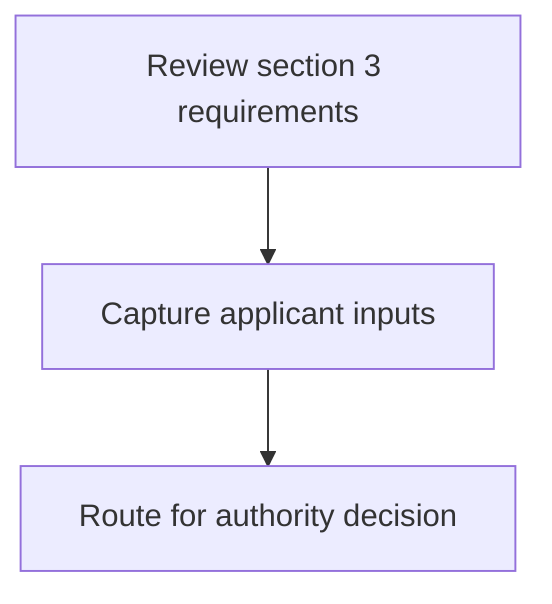
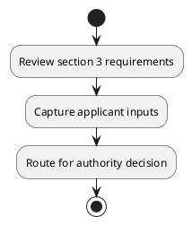

# Chapter 3 / Section 3: Comprehensive analysis of the major products (Goods and Services)

**Chapter Title:** Developing Districts as Export Hubs

**Pages:** 5

**Purpose:** Defines the operational requirements for Comprehensive analysis of the major products (Goods and Services).

**Purpose Thanglish:** Indha Comprehensive analysis of the major products (Goods and Services) section-la, Defines the operational requirements for Comprehensive analysis of the major products (Goods and Services).

**Summary:** 3. Comprehensive analysis of the major products (Goods and Services)
with export potential from District.

**Business Meaning:** 3.

**Business Explanation:** 3. Comprehensive analysis of the major products (Goods and Services)
with export potential from District.

**Business Explanation Thanglish:** Indha Comprehensive analysis of the major products (Goods and Services) section-la, 3. Comprehensive analysis of the major products (Goods and Services)
with export potential from District.

## Business Logic
- None identified

## Business Rules
- rule_id=CH3-SEC3-R001, rule_description=3. Comprehensive analysis of the major products (Goods and Services)
with export potential from District., trigger=Comprehensive analysis of the major products (Goods and Services), condition=Not explicitly covered in uploaded documents., validation=Not explicitly covered in uploaded documents., action=Manual review required., exception=No explicit exception found in uploaded documents., output=DEKAI should produce a compliance decision for 3 - Comprehensive analysis of the major products (Goods and Services).

## Conditions
- None identified

## Condition Logic
- None identified

## Validations
- None identified

## Exceptions
- None identified

## Dependencies
- None identified

## Authorities
- None identified

## Required Documents
- None identified

## Timelines
- None identified

## Actions
- None identified

## Workflow
- Review section 3 requirements
- Capture applicant inputs
- Route for authority decision

## Workflow ASCII
```text
Comprehensive analysis of the major products (Goods and Services)
Review section 3 requirements
   |
   v
Capture applicant inputs
   |
   v
Route for authority decision
```

## Decision Tree
- IF section 3 applies THEN proceed with standard DGFT workflow

## Decision Tree ASCII
```text
Comprehensive analysis of the major products (Goods and Services) Decision
IF section 3 applies THEN proceed with standard DGFT workflow
```

## Examples
- User asks to process Comprehensive analysis of the major products (Goods and Services); the platform checks conditions, validations, and documents before action.

**Real-world Example:** Example: an importer or exporter invokes Comprehensive analysis of the major products (Goods and Services), submits the prescribed DGFT records, and DEKAI uses the extracted rules to follow the comprehensive analysis of the major products (goods and services) process.

**Real-world Example Thanglish:** Indha Comprehensive analysis of the major products (Goods and Services) section-la, Example: an importer or exporter invokes Comprehensive analysis of the major products (Goods and Services), submits the prescribed DGFT records, and DEKAI uses the extracted rules to follow the comprehensive analysis of the major products (goods and services) process.

## AI Rules
- None identified

## Database Fields
- name=section_code, type=string, required=True, source=parsed_section_heading
- name=section_title, type=string, required=True, source=parsed_section_heading
- name=the_flag, type=boolean, required=False, source=keyword:the
- name=and_flag, type=boolean, required=False, source=keyword:and
- name=with_flag, type=boolean, required=False, source=keyword:with
- name=from_flag, type=boolean, required=False, source=keyword:from
- name=major_flag, type=boolean, required=False, source=keyword:major
- name=goods_flag, type=boolean, required=False, source=keyword:Goods
- name=export_flag, type=boolean, required=False, source=keyword:export
- name=analysis_flag, type=boolean, required=False, source=keyword:analysis

## API Requirements
- method=GET, path=/api/dgft/sections/3, purpose=Retrieve knowledge payload for section 3, query_params=['include=workflow,decision_tree,validations'], response_fields=['section', 'title', 'summary', 'conditions', 'validations', 'exceptions', 'workflow', 'decision_tree']
- method=POST, path=/api/dgft/Comprehensive-analysis-of-the-major-products-Goods-and-Services/validate, purpose=Validate inputs and documents for Comprehensive analysis of the major products (Goods and Services), request_fields=['section_code', 'section_title'], response_fields=['status', 'errors', 'warnings', 'next_actions']

## UI Screens
- screen_id=Comprehensive_analysis_of_the_major_products_Goods_and_Services_overview, name=Comprehensive analysis of the major products (Goods and Services) Overview, purpose=Show section summary, authority, timeline, and eligibility cues., widgets=['summary_card', 'conditions_table', 'authority_badges', 'timeline_panel']
- screen_id=Comprehensive_analysis_of_the_major_products_Goods_and_Services_submission, name=Comprehensive analysis of the major products (Goods and Services) Submission, purpose=Capture applicant data and supporting documents., widgets=['dynamic_form', 'document_uploader', 'validation_panel', 'next_action_footer'], fields=['section_code', 'section_title', 'the_flag', 'and_flag', 'with_flag', 'from_flag', 'major_flag', 'goods_flag']

## Error Messages
- Validation failed because the section requirements were not fully met.

## FAQ
- question_en=What is the purpose of section 3?, answer_en=3. Comprehensive analysis of the major products (Goods and Services)
with export potential from District., question_thanglish=Indha Comprehensive analysis of the major products (Goods and Services) section-la, What is the purpose of section 3?, answer_thanglish=Indha Comprehensive analysis of the major products (Goods and Services) section-la, 3. Comprehensive analysis of the major products (Goods and Services)
with export potential from District.
- question_en=What documents are required under Comprehensive analysis of the major products (Goods and Services)?, answer_en=Not explicitly covered in uploaded documents., question_thanglish=Indha Comprehensive analysis of the major products (Goods and Services) section-la, What documents are required under Comprehensive analysis of the major products (Goods and Services)?, answer_thanglish=Indha Comprehensive analysis of the major products (Goods and Services) section-la, Not explicitly covered in uploaded documents.
- question_en=Which authority handles Comprehensive analysis of the major products (Goods and Services)?, answer_en=Not explicitly covered in uploaded documents., question_thanglish=Indha Comprehensive analysis of the major products (Goods and Services) section-la, Which authority handles Comprehensive analysis of the major products (Goods and Services)?, answer_thanglish=Indha Comprehensive analysis of the major products (Goods and Services) section-la, Not explicitly covered in uploaded documents.

## Questions Users May Ask
- What does Comprehensive analysis of the major products (Goods and Services) require?
- Which documents are needed for Comprehensive analysis of the major products (Goods and Services)?
- How does DEKAI validate Comprehensive analysis of the major products (Goods and Services) requests?

## Expected AI Answers
- Comprehensive analysis of the major products (Goods and Services) requires the platform to interpret the section text, apply the extracted business rules, and present the correct next action.
- Required documents are inferred from the section text: no explicit documents were detected.
- DEKAI validates Comprehensive analysis of the major products (Goods and Services) by checking conditions, required documents, authority references, and exception clauses before recommending an outcome.

## AI Q&A Examples
- question_en=User asks: How do I comply with Comprehensive analysis of the major products (Goods and Services)?, answer_en=AI answers: DEKAI should evaluate section 3, apply the extracted rules, and guide the user through Review section 3 requirements., question_thanglish=Indha Comprehensive analysis of the major products (Goods and Services) section-la, User asks: How do I comply with Comprehensive analysis of the major products (Goods and Services)?, answer_thanglish=Indha Comprehensive analysis of the major products (Goods and Services) section-la, AI answers: DEKAI should evaluate section 3, apply the extracted rules, and guide the user through Review section 3 requirements.
- question_en=User asks: Which validations apply to Comprehensive analysis of the major products (Goods and Services)?, answer_en=AI answers: Applicable validations are not explicitly covered in the uploaded documents., question_thanglish=Indha Comprehensive analysis of the major products (Goods and Services) section-la, User asks: Which validations apply to Comprehensive analysis of the major products (Goods and Services)?, answer_thanglish=Indha Comprehensive analysis of the major products (Goods and Services) section-la, AI answers: Applicable validations are not explicitly covered in the uploaded documents.

## DEKAI AI Implementation Notes
- Capture chapter 3, section 3, title, and page references as immutable knowledge metadata.
- Bind validations for Comprehensive analysis of the major products (Goods and Services) into a rule engine keyed by the rule IDs extracted for this section.

## DEKAI AI Implementation Notes Thanglish
- Indha Comprehensive analysis of the major products (Goods and Services) section-la, Capture chapter 3, section 3, title, and page references as immutable knowledge metadata.
- Indha Comprehensive analysis of the major products (Goods and Services) section-la, Bind validations for Comprehensive analysis of the major products (Goods and Services) into a rule engine keyed by the rule IDs extracted for this section.

## AI Metadata
- Keywords: the, and, with, from, major, Goods, export, analysis, products, Services, District, potential, Comprehensive
- Search Keywords: the, and, with, from, major, Goods, export, analysis, products, Services, District, potential, Comprehensive
- Intent: Provide knowledge guidance for Comprehensive analysis of the major products (Goods and Services).
- Tags: 3, Comprehensive analysis of the major products (Goods and Services), dgft
- Related Sections: 
- Related Chapters: 
- Related Rules: 

## Mermaid


## PlantUML

