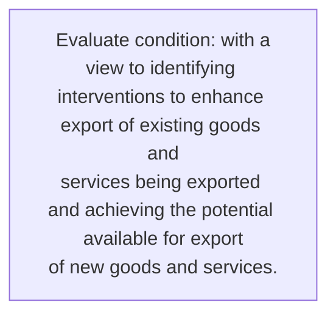
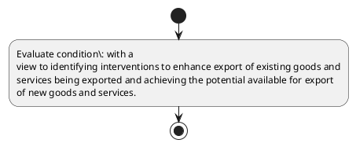

# Chapter 3 / Section 3: Comprehensive analysis of the strength of each district and the gaps in

**Chapter Title:** Developing Districts as Export Hubs

**Pages:** 4

**Purpose:** with a
view to identifying interventions to enhance export of existing goods and
services being exported and achieving the potential available for export
of new goods and services.

**Purpose Thanglish:** Indha Comprehensive analysis of the strength of each district and the gaps in section-la, with a
view to identifying interventions to enhance export of existing goods and
services being exported and achieving the potential available for export
of new goods and services.

**Summary:** 3. Comprehensive analysis of the strength of each district and the gaps in
product quality/design, production efficiency/competitiveness,
infrastructure, logistics, utilities, enforcement of standards etc. with a
view to identifying interventions to enhance export of existing goods and
services being exported and achieving the potential available for export
of new goods and services.

**Business Meaning:** 3.

**Business Explanation:** 3. Comprehensive analysis of the strength of each district and the gaps in
product quality/design, production efficiency/competitiveness,
infrastructure, logistics, utilities, enforcement of standards etc. with a
view to identifying interventions to enhance export of existing goods and
services being exported and achieving the potential available for export
of new goods and services.

**Business Explanation Thanglish:** Indha Comprehensive analysis of the strength of each district and the gaps in section-la, 3. Comprehensive analysis of the strength of each district and the gaps in
product quality/design, production efficiency/competitiveness,
infrastructure, logistics, utilities, enforcement of standards etc. with a
view to identifying interventions to enhance export of existing goods and
services being exported and achieving the potential available for export
of new goods and services.

## Business Logic
- None identified

## Business Rules
- rule_id=CH3-SEC3-R001, rule_description=3. Comprehensive analysis of the strength of each district and the gaps in
product quality/design, production efficiency/competitiveness,
infrastructure, logistics, utilities, enforcement of standards etc. with a
view to identifying interventions to enhance export of existing goods and
services being exported and achieving the potential available for export
of new goods and services., trigger=Comprehensive analysis of the strength of each district and the gaps in, condition=with a
view to identifying interventions to enhance export of existing goods and
services being exported and achieving the potential available for export
of new goods and services., validation=Not explicitly covered in uploaded documents., action=Manual review required., exception=No explicit exception found in uploaded documents., output=DEKAI should produce a compliance decision for 3 - Comprehensive analysis of the strength of each district and the gaps in.

## Conditions
- with a
view to identifying interventions to enhance export of existing goods and
services being exported and achieving the potential available for export
of new goods and services.

## Condition Logic
- id=3.3.1, if=with a
view to identifying interventions to enhance export of existing goods and
services being exported and achieving the potential available for export
of new goods and services., then=Route for review, source=with a
view to identifying interventions to enhance export of existing goods and
services being exported and achieving the potential available for export
of new goods and services.

## Validations
- None identified

## Exceptions
- None identified

## Dependencies
- None identified

## Authorities
- None identified

## Required Documents
- None identified

## Timelines
- None identified

## Actions
- None identified

## Workflow
- Evaluate condition: with a
view to identifying interventions to enhance export of existing goods and
services being exported and achieving the potential available for export
of new goods and services.

## Workflow ASCII
```text
Comprehensive analysis of the strength of each district and the gaps in
Evaluate condition: with a
view to identifying interventions to enhance export of existing goods and
services being exported and achieving the potential available for export
of new goods and services.
```

## Decision Tree
- IF section 3 applies THEN proceed with standard DGFT workflow

## Decision Tree ASCII
```text
Comprehensive analysis of the strength of each district and the gaps in Decision
IF section 3 applies THEN proceed with standard DGFT workflow
```

## Examples
- User asks to process Comprehensive analysis of the strength of each district and the gaps in; the platform checks conditions, validations, and documents before action.

**Real-world Example:** Example: an importer or exporter invokes Comprehensive analysis of the strength of each district and the gaps in, submits the prescribed DGFT records, and DEKAI uses the extracted rules to follow the comprehensive analysis of the strength of each district and the gaps in process.

**Real-world Example Thanglish:** Indha Comprehensive analysis of the strength of each district and the gaps in section-la, Example: an importer or exporter invokes Comprehensive analysis of the strength of each district and the gaps in, submits the prescribed DGFT records, and DEKAI uses the extracted rules to follow the comprehensive analysis of the strength of each district and the gaps in process.

## AI Rules
- None identified

## Database Fields
- name=section_code, type=string, required=True, source=parsed_section_heading
- name=section_title, type=string, required=True, source=parsed_section_heading
- name=the_flag, type=boolean, required=False, source=keyword:the
- name=and_flag, type=boolean, required=False, source=keyword:and
- name=etc_flag, type=boolean, required=False, source=keyword:etc
- name=for_flag, type=boolean, required=False, source=keyword:for
- name=new_flag, type=boolean, required=False, source=keyword:new
- name=each_flag, type=boolean, required=False, source=keyword:each
- name=gaps_flag, type=boolean, required=False, source=keyword:gaps
- name=with_flag, type=boolean, required=False, source=keyword:with

## API Requirements
- method=GET, path=/api/dgft/sections/3, purpose=Retrieve knowledge payload for section 3, query_params=['include=workflow,decision_tree,validations'], response_fields=['section', 'title', 'summary', 'conditions', 'validations', 'exceptions', 'workflow', 'decision_tree']
- method=POST, path=/api/dgft/Comprehensive-analysis-of-the-strength-of-each-district-and-the-gaps-in/validate, purpose=Validate inputs and documents for Comprehensive analysis of the strength of each district and the gaps in, request_fields=['section_code', 'section_title'], response_fields=['status', 'errors', 'warnings', 'next_actions']

## UI Screens
- screen_id=Comprehensive_analysis_of_the_strength_of_each_district_and_the_gaps_in_overview, name=Comprehensive analysis of the strength of each district and the gaps in Overview, purpose=Show section summary, authority, timeline, and eligibility cues., widgets=['summary_card', 'conditions_table', 'authority_badges', 'timeline_panel']
- screen_id=Comprehensive_analysis_of_the_strength_of_each_district_and_the_gaps_in_submission, name=Comprehensive analysis of the strength of each district and the gaps in Submission, purpose=Capture applicant data and supporting documents., widgets=['dynamic_form', 'document_uploader', 'validation_panel', 'next_action_footer'], fields=['section_code', 'section_title', 'the_flag', 'and_flag', 'etc_flag', 'for_flag', 'new_flag', 'each_flag']

## Error Messages
- Validation failed because the section requirements were not fully met.

## FAQ
- question_en=What is the purpose of section 3?, answer_en=3. Comprehensive analysis of the strength of each district and the gaps in
product quality/design, production efficiency/competitiveness,
infrastructure, logistics, utilities, enforcement of standards etc. with a
view to identifying interventions to enhance export of existing goods and
services being exported and achieving the potential available for export
of new goods and services., question_thanglish=Indha Comprehensive analysis of the strength of each district and the gaps in section-la, What is the purpose of section 3?, answer_thanglish=Indha Comprehensive analysis of the strength of each district and the gaps in section-la, 3. Comprehensive analysis of the strength of each district and the gaps in
product quality/design, production efficiency/competitiveness,
infrastructure, logistics, utilities, enforcement of standards etc. with a
view to identifying interventions to enhance export of existing goods and
services being exported and achieving the potential available for export
of new goods and services.
- question_en=What documents are required under Comprehensive analysis of the strength of each district and the gaps in?, answer_en=Not explicitly covered in uploaded documents., question_thanglish=Indha Comprehensive analysis of the strength of each district and the gaps in section-la, What documents are required under Comprehensive analysis of the strength of each district and the gaps in?, answer_thanglish=Indha Comprehensive analysis of the strength of each district and the gaps in section-la, Not explicitly covered in uploaded documents.
- question_en=Which authority handles Comprehensive analysis of the strength of each district and the gaps in?, answer_en=Not explicitly covered in uploaded documents., question_thanglish=Indha Comprehensive analysis of the strength of each district and the gaps in section-la, Which authority handles Comprehensive analysis of the strength of each district and the gaps in?, answer_thanglish=Indha Comprehensive analysis of the strength of each district and the gaps in section-la, Not explicitly covered in uploaded documents.

## Questions Users May Ask
- What does Comprehensive analysis of the strength of each district and the gaps in require?
- Which documents are needed for Comprehensive analysis of the strength of each district and the gaps in?
- How does DEKAI validate Comprehensive analysis of the strength of each district and the gaps in requests?

## Expected AI Answers
- Comprehensive analysis of the strength of each district and the gaps in requires the platform to interpret the section text, apply the extracted business rules, and present the correct next action.
- Required documents are inferred from the section text: no explicit documents were detected.
- DEKAI validates Comprehensive analysis of the strength of each district and the gaps in by checking conditions, required documents, authority references, and exception clauses before recommending an outcome.

## AI Q&A Examples
- question_en=User asks: How do I comply with Comprehensive analysis of the strength of each district and the gaps in?, answer_en=AI answers: DEKAI should evaluate section 3, apply the extracted rules, and guide the user through Evaluate condition: with a
view to identifying interventions to enhance export of existing goods and
services being exported and achieving the potential available for export
of new goods and services.., question_thanglish=Indha Comprehensive analysis of the strength of each district and the gaps in section-la, User asks: How do I comply with Comprehensive analysis of the strength of each district and the gaps in?, answer_thanglish=Indha Comprehensive analysis of the strength of each district and the gaps in section-la, AI answers: DEKAI should evaluate section 3, apply the extracted rules, and guide the user through Evaluate condition: with a
view to identifying interventions to enhance export of existing goods and
services being exported and achieving the potential available for export
of new goods and services..
- question_en=User asks: Which validations apply to Comprehensive analysis of the strength of each district and the gaps in?, answer_en=AI answers: Applicable validations are not explicitly covered in the uploaded documents., question_thanglish=Indha Comprehensive analysis of the strength of each district and the gaps in section-la, User asks: Which validations apply to Comprehensive analysis of the strength of each district and the gaps in?, answer_thanglish=Indha Comprehensive analysis of the strength of each district and the gaps in section-la, AI answers: Applicable validations are not explicitly covered in the uploaded documents.

## DEKAI AI Implementation Notes
- Capture chapter 3, section 3, title, and page references as immutable knowledge metadata.
- Bind validations for Comprehensive analysis of the strength of each district and the gaps in into a rule engine keyed by the rule IDs extracted for this section.

## DEKAI AI Implementation Notes Thanglish
- Indha Comprehensive analysis of the strength of each district and the gaps in section-la, Capture chapter 3, section 3, title, and page references as immutable knowledge metadata.
- Indha Comprehensive analysis of the strength of each district and the gaps in section-la, Bind validations for Comprehensive analysis of the strength of each district and the gaps in into a rule engine keyed by the rule IDs extracted for this section.

## AI Metadata
- Keywords: the, and, etc, for, new, each, gaps, with, view, goods, being, export, product, enhance, analysis, strength, district, existing, services, exported
- Search Keywords: the, and, etc, for, new, each, gaps, with, view, goods, being, export, product, enhance, analysis, strength, district, existing, services, exported
- Intent: Provide knowledge guidance for Comprehensive analysis of the strength of each district and the gaps in.
- Tags: 3, Comprehensive analysis of the strength of each district and the gaps in, dgft
- Related Sections: 
- Related Chapters: 
- Related Rules: 

## Mermaid


## PlantUML

