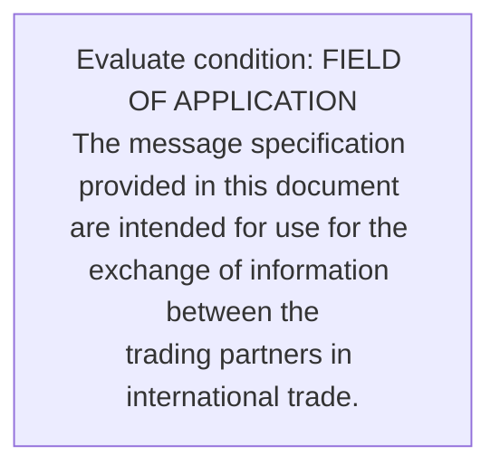
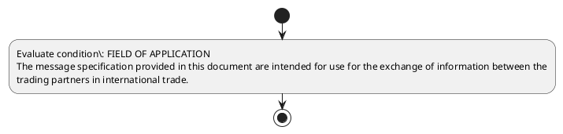

# Chapter  / Section 3: FIELD OF APPLICATION

**Chapter Title:** TradeNetDeclaration.IPTDEC Ver2.1 (2)

**Pages:** 3

**Purpose:** FIELD OF APPLICATION
The message specification provided in this document are intended for use for the exchange of information between the
trading partners in international trade.

**Purpose Thanglish:** Indha FIELD OF APPLICATION section-la, FIELD OF application
The message specification provided in this document are intended for use for the exchange of information between the
trading partners in international trade.

**Summary:** 3. FIELD OF APPLICATION
The message specification provided in this document are intended for use for the exchange of information between the
trading partners in international trade. This message may be applied for both national and international trade.

**Business Meaning:** 3.

**Business Explanation:** 3. FIELD OF APPLICATION
The message specification provided in this document are intended for use for the exchange of information between the
trading partners in international trade. This message may be applied for both national and international trade.

**Business Explanation Thanglish:** Indha FIELD OF APPLICATION section-la, 3. FIELD OF application
The message specification provided in this document are intended for use for the exchange of information between the
trading partners in international trade. This message may be applied for both national and international trade.

## Business Logic
- None identified

## Business Rules
- rule_id=CH-SEC3-R001, rule_description=3. FIELD OF APPLICATION
The message specification provided in this document are intended for use for the exchange of information between the
trading partners in international trade. This message may be applied for both national and international trade., trigger=FIELD OF APPLICATION, condition=FIELD OF APPLICATION
The message specification provided in this document are intended for use for the exchange of information between the
trading partners in international trade., validation=Not explicitly covered in uploaded documents., action=Manual review required., exception=No explicit exception found in uploaded documents., output=DEKAI should produce a compliance decision for 3 - FIELD OF APPLICATION.

## Conditions
- FIELD OF APPLICATION
The message specification provided in this document are intended for use for the exchange of information between the
trading partners in international trade.

## Condition Logic
- id=.3.1, if=FIELD OF APPLICATION
The message specification provided in this document are intended for use for the exchange of information between the
trading partners in international trade., then=Route for review, source=FIELD OF APPLICATION
The message specification provided in this document are intended for use for the exchange of information between the
trading partners in international trade.

## Validations
- None identified

## Exceptions
- None identified

## Dependencies
- None identified

## Authorities
- None identified

## Required Documents
- FIELD OF APPLICATION
The message specification provided in this document are intended for use for the exchange of information between the
trading partners in international trade.

## Timelines
- None identified

## Actions
- None identified

## Workflow
- Evaluate condition: FIELD OF APPLICATION
The message specification provided in this document are intended for use for the exchange of information between the
trading partners in international trade.

## Workflow ASCII
```text
FIELD OF APPLICATION
Evaluate condition: FIELD OF APPLICATION
The message specification provided in this document are intended for use for the exchange of information between the
trading partners in international trade.
```

## Decision Tree
- IF section 3 applies THEN proceed with standard DGFT workflow

## Decision Tree ASCII
```text
FIELD OF APPLICATION Decision
IF section 3 applies THEN proceed with standard DGFT workflow
```

## Examples
- User asks to process FIELD OF APPLICATION; the platform checks conditions, validations, and documents before action.

**Real-world Example:** Example: an importer or exporter invokes FIELD OF APPLICATION, submits FIELD OF APPLICATION
The message specification provided in this document are intended for use for the exchange of information between the
trading partners in international trade., and DEKAI uses the extracted rules to follow the field of application process.

**Real-world Example Thanglish:** Indha FIELD OF APPLICATION section-la, Example: an importer or exporter invokes FIELD OF application, submits FIELD OF application
The message specification provided in this document are intended for use for the exchange of information between the
trading partners in international trade., and DEKAI uses the extracted rules to follow the field of application process.

## AI Rules
- None identified

## Database Fields
- name=section_code, type=string, required=True, source=parsed_section_heading
- name=section_title, type=string, required=True, source=parsed_section_heading
- name=the_flag, type=boolean, required=False, source=keyword:The
- name=are_flag, type=boolean, required=False, source=keyword:are
- name=for_flag, type=boolean, required=False, source=keyword:for
- name=use_flag, type=boolean, required=False, source=keyword:use
- name=may_flag, type=boolean, required=False, source=keyword:may
- name=and_flag, type=boolean, required=False, source=keyword:and
- name=not_flag, type=boolean, required=False, source=keyword:not
- name=this_flag, type=boolean, required=False, source=keyword:this
- name=document_1_submitted, type=boolean, required=True, source=FIELD OF APPLICATION
The message specification provided in this document are intended for use for the exchange of information between the
trading partners in international trade.

## API Requirements
- method=GET, path=/api/dgft/sections/3, purpose=Retrieve knowledge payload for section 3, query_params=['include=workflow,decision_tree,validations'], response_fields=['section', 'title', 'summary', 'conditions', 'validations', 'exceptions', 'workflow', 'decision_tree']
- method=POST, path=/api/dgft/FIELD-OF-APPLICATION/validate, purpose=Validate inputs and documents for FIELD OF APPLICATION, request_fields=['section_code', 'section_title', 'document_1_submitted'], response_fields=['status', 'errors', 'warnings', 'next_actions']

## UI Screens
- screen_id=FIELD_OF_APPLICATION_overview, name=FIELD OF APPLICATION Overview, purpose=Show section summary, authority, timeline, and eligibility cues., widgets=['summary_card', 'conditions_table', 'authority_badges', 'timeline_panel']
- screen_id=FIELD_OF_APPLICATION_submission, name=FIELD OF APPLICATION Submission, purpose=Capture applicant data and supporting documents., widgets=['dynamic_form', 'document_uploader', 'validation_panel', 'next_action_footer'], fields=['section_code', 'section_title', 'the_flag', 'are_flag', 'for_flag', 'use_flag', 'may_flag', 'and_flag']

## Error Messages
- Validation failed because the section requirements were not fully met.

## FAQ
- question_en=What is the purpose of section 3?, answer_en=3. FIELD OF APPLICATION
The message specification provided in this document are intended for use for the exchange of information between the
trading partners in international trade. This message may be applied for both national and international trade., question_thanglish=Indha FIELD OF APPLICATION section-la, What is the purpose of section 3?, answer_thanglish=Indha FIELD OF APPLICATION section-la, 3. FIELD OF application
The message specification provided in this document are intended for use for the exchange of information between the
trading partners in international trade. This message may be applied for both national and international trade.
- question_en=What documents are required under FIELD OF APPLICATION?, answer_en=FIELD OF APPLICATION
The message specification provided in this document are intended for use for the exchange of information between the
trading partners in international trade., question_thanglish=Indha FIELD OF APPLICATION section-la, What documents are required under FIELD OF application?, answer_thanglish=Indha FIELD OF APPLICATION section-la, FIELD OF application
The message specification provided in this document are intended for use for the exchange of information between the
trading partners in international trade.
- question_en=Which authority handles FIELD OF APPLICATION?, answer_en=Not explicitly covered in uploaded documents., question_thanglish=Indha FIELD OF APPLICATION section-la, Which authority handles FIELD OF application?, answer_thanglish=Indha FIELD OF APPLICATION section-la, Not explicitly covered in uploaded documents.

## Questions Users May Ask
- What does FIELD OF APPLICATION require?
- Which documents are needed for FIELD OF APPLICATION?
- How does DEKAI validate FIELD OF APPLICATION requests?

## Expected AI Answers
- FIELD OF APPLICATION requires the platform to interpret the section text, apply the extracted business rules, and present the correct next action.
- Required documents are inferred from the section text: FIELD OF APPLICATION
The message specification provided in this document are intended for use for the exchange of information between the
trading partners in international trade.
- DEKAI validates FIELD OF APPLICATION by checking conditions, required documents, authority references, and exception clauses before recommending an outcome.

## AI Q&A Examples
- question_en=User asks: How do I comply with FIELD OF APPLICATION?, answer_en=AI answers: DEKAI should evaluate section 3, apply the extracted rules, and guide the user through Evaluate condition: FIELD OF APPLICATION
The message specification provided in this document are intended for use for the exchange of information between the
trading partners in international trade.., question_thanglish=Indha FIELD OF APPLICATION section-la, User asks: How do I comply with FIELD OF application?, answer_thanglish=Indha FIELD OF APPLICATION section-la, AI answers: DEKAI should evaluate section 3, apply the extracted rules, and guide the user through Evaluate condition: FIELD OF application
The message specification provided in this document are intended for use for the exchange of information between the
trading partners in international trade..
- question_en=User asks: Which validations apply to FIELD OF APPLICATION?, answer_en=AI answers: Applicable validations are not explicitly covered in the uploaded documents., question_thanglish=Indha FIELD OF APPLICATION section-la, User asks: Which validations apply to FIELD OF application?, answer_thanglish=Indha FIELD OF APPLICATION section-la, AI answers: Applicable validations are not explicitly covered in the uploaded documents.

## DEKAI AI Implementation Notes
- Capture chapter , section 3, title, and page references as immutable knowledge metadata.
- Bind validations for FIELD OF APPLICATION into a rule engine keyed by the rule IDs extracted for this section.
- Expose document upload controls for: FIELD OF APPLICATION
The message specification provided in this document are intended for use for the exchange of information between the
trading partners in international trade..

## DEKAI AI Implementation Notes Thanglish
- Indha FIELD OF APPLICATION section-la, Capture chapter , section 3, title, and page references as immutable knowledge metadata.
- Indha FIELD OF APPLICATION section-la, Bind validations for FIELD OF application into a rule engine keyed by the rule IDs extracted for this section.
- Indha FIELD OF APPLICATION section-la, Expose document upload controls for: FIELD OF application
The message specification provided in this document are intended for use for the exchange of information between the
trading partners in international trade..

## AI Metadata
- Keywords: The, are, for, use, may, and, not, this, both, type, FIELD, trade, based, message, between, trading, applied, provided, document, intended
- Search Keywords: The, are, for, use, may, and, not, this, both, type, FIELD, trade, based, message, between, trading, applied, provided, document, intended
- Intent: Provide knowledge guidance for FIELD OF APPLICATION.
- Tags: 3, FIELD OF APPLICATION, document-driven, dgft
- Related Sections: 
- Related Chapters: 
- Related Rules: 

## Mermaid


## PlantUML

