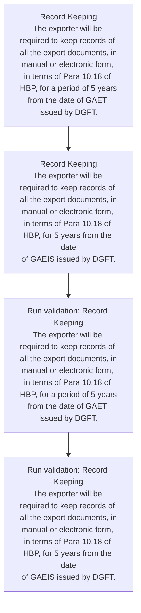
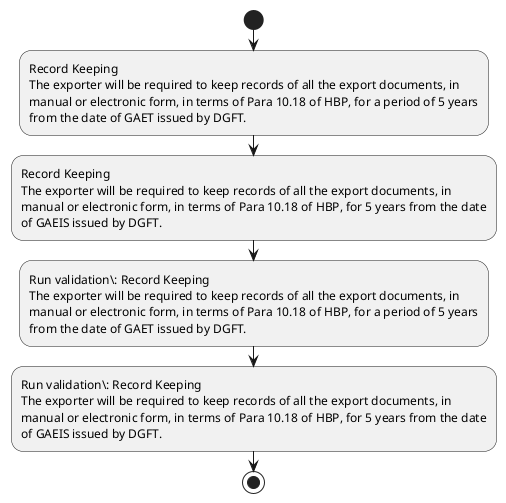

# Chapter 10 / Section 3: Record Keeping

**Chapter Title:** SCOMET: Special Chemicals, Organisms, Materials, Equipment and Technologies

**Pages:** 31, 34

**Purpose:** Record Keeping
The exporter will be required to keep records of all the export documents, in
manual or electronic form, in terms of Para 10.18 of HBP, for a period of 5 years
from the date of GAET issued by DGFT.

**Purpose Thanglish:** Indha Record Keeping section-la, Record Keeping
The exporter will be required to keep records of all the export documents, in
manual or electronic form, in terms of Para 10.18 of HBP, for a period of 5 years
from the date of GAET issued by DGFT.

**Summary:** 3. Record Keeping
The exporter will be required to keep records of all the export documents, in
manual or electronic form, in terms of Para 10.18 of HBP, for a period of 5 years
from the date of GAET issued by DGFT. 3.

**Business Meaning:** Record Keeping governs how DGFT business controls should be applied, validated, and enforced.

**Business Explanation:** Record Keeping explains the operating rule set that DEKAI should enforce. Key control points include Record Keeping
The exporter will be required to keep records of all the export documents, in
manual or electronic form, in terms of Para 10.18 of HBP, for a period of 5 years
from the date of GAET issued by DGFT. The section also drives actions such as Record Keeping
The exporter will be required to keep records of all the export documents, in
manual or electronic form, in terms of Para 10.18 of HBP, for a period of 5 years
from the date of GAET issued by DGFT..

**Business Explanation Thanglish:** Indha Record Keeping section-la, Record Keeping explains the operating rule set that DEKAI should enforce. Key control points include Record Keeping
The exporter will be required to keep records of all the export documents, in
manual or electronic form, in terms of Para 10.18 of HBP, for a period of 5 years
from the date of GAET issued by DGFT. The section also drives actions such as Record Keeping
The exporter will be required to keep records of all the export documents, in
manual or electronic form, in terms of Para 10.18 of HBP, for a period of 5 years
from the date of GAET issued by DGFT..

## Business Logic
- Record Keeping
The exporter will be required to keep records of all the export documents, in
manual or electronic form, in terms of Para 10.18 of HBP, for a period of 5 years
from the date of GAET issued by DGFT.
- Record Keeping
The exporter will be required to keep records of all the export documents, in
manual or electronic form, in terms of Para 10.18 of HBP, for 5 years from the date
of GAEIS issued by DGFT.

## Business Rules
- rule_id=CH10-SEC3-R001, rule_description=Record Keeping
The exporter will be required to keep records of all the export documents, in
manual or electronic form, in terms of Para 10.18 of HBP, for a period of 5 years
from the date of GAET issued by DGFT., trigger=Record Keeping, condition=Section 3 is applicable, validation=Record Keeping
The exporter will be required to keep records of all the export documents, in
manual or electronic form, in terms of Para 10.18 of HBP, for a period of 5 years
from the date of GAET issued by DGFT., action=Record Keeping
The exporter will be required to keep records of all the export documents, in
manual or electronic form, in terms of Para 10.18 of HBP, for a period of 5 years
from the date of GAET issued by DGFT., exception=No explicit exception found in uploaded documents., output=DEKAI should produce a compliance decision for 3 - Record Keeping.
- rule_id=CH10-SEC3-R002, rule_description=Record Keeping
The exporter will be required to keep records of all the export documents, in
manual or electronic form, in terms of Para 10.18 of HBP, for 5 years from the date
of GAEIS issued by DGFT., trigger=Record Keeping, condition=Section 3 is applicable, validation=Record Keeping
The exporter will be required to keep records of all the export documents, in
manual or electronic form, in terms of Para 10.18 of HBP, for 5 years from the date
of GAEIS issued by DGFT., action=Record Keeping
The exporter will be required to keep records of all the export documents, in
manual or electronic form, in terms of Para 10.18 of HBP, for 5 years from the date
of GAEIS issued by DGFT., exception=No explicit exception found in uploaded documents., output=DEKAI should produce a compliance decision for 3 - Record Keeping.

## Conditions
- None identified

## Condition Logic
- id=10.3.1, if=Section 3 is applicable, then=Record Keeping
The exporter will be required to keep records of all the export documents, in
manual or electronic form, in terms of Para 10.18 of HBP, for a period of 5 years
from the date of GAET issued by DGFT., source=Derived from uploaded documents

## Validations
- Record Keeping
The exporter will be required to keep records of all the export documents, in
manual or electronic form, in terms of Para 10.18 of HBP, for a period of 5 years
from the date of GAET issued by DGFT.
- Record Keeping
The exporter will be required to keep records of all the export documents, in
manual or electronic form, in terms of Para 10.18 of HBP, for 5 years from the date
of GAEIS issued by DGFT.

## Exceptions
- None identified

## Dependencies
- 10.18
- 1
- 5

## Authorities
- DGFT
- GAET issued by DGFT
- GAEIS issued by DGFT

## Required Documents
- Record Keeping
The exporter will be required to keep records of all the export documents, in
manual or electronic form, in terms of Para 10.18 of HBP, for a period of 5 years
from the date of GAET issued by DGFT.
- Record Keeping
The exporter will be required to keep records of all the export documents, in
manual or electronic form, in terms of Para 10.18 of HBP, for 5 years from the date
of GAEIS issued by DGFT.

## Timelines
- Record Keeping
The exporter will be required to keep records of all the export documents, in
manual or electronic form, in terms of Para 10.18 of HBP, for a period of 5 years
from the date of GAET issued by DGFT.
- Record Keeping
The exporter will be required to keep records of all the export documents, in
manual or electronic form, in terms of Para 10.18 of HBP, for 5 years from the date
of GAEIS issued by DGFT.

## Actions
- Record Keeping
The exporter will be required to keep records of all the export documents, in
manual or electronic form, in terms of Para 10.18 of HBP, for a period of 5 years
from the date of GAET issued by DGFT.
- Record Keeping
The exporter will be required to keep records of all the export documents, in
manual or electronic form, in terms of Para 10.18 of HBP, for 5 years from the date
of GAEIS issued by DGFT.

## Workflow
- Record Keeping
The exporter will be required to keep records of all the export documents, in
manual or electronic form, in terms of Para 10.18 of HBP, for a period of 5 years
from the date of GAET issued by DGFT.
- Record Keeping
The exporter will be required to keep records of all the export documents, in
manual or electronic form, in terms of Para 10.18 of HBP, for 5 years from the date
of GAEIS issued by DGFT.
- Run validation: Record Keeping
The exporter will be required to keep records of all the export documents, in
manual or electronic form, in terms of Para 10.18 of HBP, for a period of 5 years
from the date of GAET issued by DGFT.
- Run validation: Record Keeping
The exporter will be required to keep records of all the export documents, in
manual or electronic form, in terms of Para 10.18 of HBP, for 5 years from the date
of GAEIS issued by DGFT.

## Workflow ASCII
```text
Record Keeping
Record Keeping
The exporter will be required to keep records of all the export documents, in
manual or electronic form, in terms of Para 10.18 of HBP, for a period of 5 years
from the date of GAET issued by DGFT.
   |
   v
Record Keeping
The exporter will be required to keep records of all the export documents, in
manual or electronic form, in terms of Para 10.18 of HBP, for 5 years from the date
of GAEIS issued by DGFT.
   |
   v
Run validation: Record Keeping
The exporter will be required to keep records of all the export documents, in
manual or electronic form, in terms of Para 10.18 of HBP, for a period of 5 years
from the date of GAET issued by DGFT.
   |
   v
Run validation: Record Keeping
The exporter will be required to keep records of all the export documents, in
manual or electronic form, in terms of Para 10.18 of HBP, for 5 years from the date
of GAEIS issued by DGFT.
```

## Decision Tree
- IF section 3 applies THEN Record Keeping
The exporter will be required to keep records of all the export documents, in
manual or electronic form, in terms of Para 10.18 of HBP, for a period of 5 years
from the date of GAET issued by DGFT.

## Decision Tree ASCII
```text
Record Keeping Decision
IF section 3 applies THEN Record Keeping
The exporter will be required to keep records of all the export documents, in
manual or electronic form, in terms of Para 10.18 of HBP, for a period of 5 years
from the date of GAET issued by DGFT.
```

## Examples
- User asks to process Record Keeping; the platform checks conditions, validations, and documents before action.

**Real-world Example:** Example: an importer or exporter invokes Record Keeping, submits Record Keeping
The exporter will be required to keep records of all the export documents, in
manual or electronic form, in terms of Para 10.18 of HBP, for a period of 5 years
from the date of GAET issued by DGFT., Record Keeping
The exporter will be required to keep records of all the export documents, in
manual or electronic form, in terms of Para 10.18 of HBP, for 5 years from the date
of GAEIS issued by DGFT., and DEKAI uses the extracted rules to record keeping
the exporter will be required to keep records of all the export documents, in
manual or electronic form, in terms of para 10.18 of hbp, for a period of 5 years
from the date of gaet issued by dgft..

**Real-world Example Thanglish:** Indha Record Keeping section-la, Example: an importer or exporter invokes Record Keeping, submits Record Keeping
The exporter will be required to keep records of all the export documents, in
manual or electronic form, in terms of Para 10.18 of HBP, for a period of 5 years
from the date of GAET issued by DGFT., Record Keeping
The exporter will be required to keep records of all the export documents, in
manual or electronic form, in terms of Para 10.18 of HBP, for 5 years from the date
of GAEIS issued by DGFT., and DEKAI uses the extracted rules to record keeping
the exporter will be required to keep records of all the export documents, in
manual or electronic form, in terms of para 10.18 of hbp, for a period of 5 years
from the date of gaet issued by dgft..

## AI Rules
- IF detected context matches section rule THEN enforce: Record Keeping
The exporter will be required to keep records of all the export documents, in
manual or electronic form, in terms of Para 10.18 of HBP, for a period of 5 years
from the date of GAET issued by DGFT.
- IF detected context matches section rule THEN enforce: Record Keeping
The exporter will be required to keep records of all the export documents, in
manual or electronic form, in terms of Para 10.18 of HBP, for 5 years from the date
of GAEIS issued by DGFT.
- IF validations pass THEN recommend action: Record Keeping
The exporter will be required to keep records of all the export documents, in
manual or electronic form, in terms of Para 10.18 of HBP, for a period of 5 years
from the date of GAET issued by DGFT.

## Database Fields
- name=section_code, type=string, required=True, source=parsed_section_heading
- name=section_title, type=string, required=True, source=parsed_section_heading
- name=the_flag, type=boolean, required=False, source=keyword:The
- name=all_flag, type=boolean, required=False, source=keyword:all
- name=hbp_flag, type=boolean, required=False, source=keyword:HBP
- name=for_flag, type=boolean, required=False, source=keyword:for
- name=will_flag, type=boolean, required=False, source=keyword:will
- name=keep_flag, type=boolean, required=False, source=keyword:keep
- name=form_flag, type=boolean, required=False, source=keyword:form
- name=para_flag, type=boolean, required=False, source=keyword:Para
- name=document_1_submitted, type=boolean, required=True, source=Record Keeping
The exporter will be required to keep records of all the export documents, in
manual or electronic form, in terms of Para 10.18 of HBP, for a period of 5 years
from the date of GAET issued by DGFT.
- name=document_2_submitted, type=boolean, required=True, source=Record Keeping
The exporter will be required to keep records of all the export documents, in
manual or electronic form, in terms of Para 10.18 of HBP, for 5 years from the date
of GAEIS issued by DGFT.

## API Requirements
- method=GET, path=/api/dgft/sections/3, purpose=Retrieve knowledge payload for section 3, query_params=['include=workflow,decision_tree,validations'], response_fields=['section', 'title', 'summary', 'conditions', 'validations', 'exceptions', 'workflow', 'decision_tree']
- method=POST, path=/api/dgft/Record-Keeping/validate, purpose=Validate inputs and documents for Record Keeping, request_fields=['section_code', 'section_title', 'document_1_submitted', 'document_2_submitted'], response_fields=['status', 'errors', 'warnings', 'next_actions']
- method=POST, path=/api/dgft/Record-Keeping/execute, purpose=Trigger business action for Record Keeping
The exporter will be required to keep records of all the export documents, in
manual or electronic form, in terms of Para 10.18 of HBP, for a period of 5 years
from the date of GAET issued by DGFT., request_fields=['section_code', 'section_title', 'document_1_submitted', 'document_2_submitted'], response_fields=['reference_id', 'status', 'authority', 'timeline']

## UI Screens
- screen_id=Record_Keeping_overview, name=Record Keeping Overview, purpose=Show section summary, authority, timeline, and eligibility cues., widgets=['summary_card', 'conditions_table', 'authority_badges', 'timeline_panel']
- screen_id=Record_Keeping_submission, name=Record Keeping Submission, purpose=Capture applicant data and supporting documents., widgets=['dynamic_form', 'document_uploader', 'validation_panel', 'next_action_footer'], fields=['section_code', 'section_title', 'the_flag', 'all_flag', 'hbp_flag', 'for_flag', 'will_flag', 'keep_flag']

## Error Messages
- Validation failed because the section requirements were not fully met.

## FAQ
- question_en=What is the purpose of section 3?, answer_en=Record Keeping explains the operating rule set that DEKAI should enforce. Key control points include Record Keeping
The exporter will be required to keep records of all the export documents, in
manual or electronic form, in terms of Para 10.18 of HBP, for a period of 5 years
from the date of GAET issued by DGFT. The section also drives actions such as Record Keeping
The exporter will be required to keep records of all the export documents, in
manual or electronic form, in terms of Para 10.18 of HBP, for a period of 5 years
from the date of GAET issued by DGFT.., question_thanglish=Indha Record Keeping section-la, What is the purpose of section 3?, answer_thanglish=Indha Record Keeping section-la, Record Keeping explains the operating rule set that DEKAI should enforce. Key control points include Record Keeping
The exporter will be required to keep records of all the export documents, in
manual or electronic form, in terms of Para 10.18 of HBP, for a period of 5 years
from the date of GAET issued by DGFT. The section also drives actions such as Record Keeping
The exporter will be required to keep records of all the export documents, in
manual or electronic form, in terms of Para 10.18 of HBP, for a period of 5 years
from the date of GAET issued by DGFT..
- question_en=What documents are required under Record Keeping?, answer_en=Record Keeping
The exporter will be required to keep records of all the export documents, in
manual or electronic form, in terms of Para 10.18 of HBP, for a period of 5 years
from the date of GAET issued by DGFT., Record Keeping
The exporter will be required to keep records of all the export documents, in
manual or electronic form, in terms of Para 10.18 of HBP, for 5 years from the date
of GAEIS issued by DGFT., question_thanglish=Indha Record Keeping section-la, What documents are required under Record Keeping?, answer_thanglish=Indha Record Keeping section-la, Record Keeping
The exporter will be required to keep records of all the export documents, in
manual or electronic form, in terms of Para 10.18 of HBP, for a period of 5 years
from the date of GAET issued by DGFT., Record Keeping
The exporter will be required to keep records of all the export documents, in
manual or electronic form, in terms of Para 10.18 of HBP, for 5 years from the date
of GAEIS issued by DGFT.
- question_en=Which authority handles Record Keeping?, answer_en=DGFT, GAET issued by DGFT, GAEIS issued by DGFT, question_thanglish=Indha Record Keeping section-la, Which authority handles Record Keeping?, answer_thanglish=Indha Record Keeping section-la, DGFT, GAET issued by DGFT, GAEIS issued by DGFT

## Questions Users May Ask
- What does Record Keeping require?
- Which documents are needed for Record Keeping?
- How does DEKAI validate Record Keeping requests?
- What action should be taken for Record Keeping?

## Expected AI Answers
- Record Keeping requires the platform to interpret the section text, apply the extracted business rules, and present the correct next action.
- Required documents are inferred from the section text: Record Keeping
The exporter will be required to keep records of all the export documents, in
manual or electronic form, in terms of Para 10.18 of HBP, for a period of 5 years
from the date of GAET issued by DGFT., Record Keeping
The exporter will be required to keep records of all the export documents, in
manual or electronic form, in terms of Para 10.18 of HBP, for 5 years from the date
of GAEIS issued by DGFT.
- DEKAI validates Record Keeping by checking conditions, required documents, authority references, and exception clauses before recommending an outcome.
- The primary extracted action is: Record Keeping
The exporter will be required to keep records of all the export documents, in
manual or electronic form, in terms of Para 10.18 of HBP, for a period of 5 years
from the date of GAET issued by DGFT.

## AI Q&A Examples
- question_en=User asks: How do I comply with Record Keeping?, answer_en=AI answers: DEKAI should evaluate section 3, apply the extracted rules, and guide the user through Record Keeping
The exporter will be required to keep records of all the export documents, in
manual or electronic form, in terms of Para 10.18 of HBP, for a period of 5 years
from the date of GAET issued by DGFT.., question_thanglish=Indha Record Keeping section-la, User asks: How do I comply with Record Keeping?, answer_thanglish=Indha Record Keeping section-la, AI answers: DEKAI should evaluate section 3, apply the extracted rules, and guide the user through Record Keeping
The exporter will be required to keep records of all the export documents, in
manual or electronic form, in terms of Para 10.18 of HBP, for a period of 5 years
from the date of GAET issued by DGFT..
- question_en=User asks: Which validations apply to Record Keeping?, answer_en=AI answers: Applicable validations are Record Keeping
The exporter will be required to keep records of all the export documents, in
manual or electronic form, in terms of Para 10.18 of HBP, for a period of 5 years
from the date of GAET issued by DGFT., Record Keeping
The exporter will be required to keep records of all the export documents, in
manual or electronic form, in terms of Para 10.18 of HBP, for 5 years from the date
of GAEIS issued by DGFT., question_thanglish=Indha Record Keeping section-la, User asks: Which validations apply to Record Keeping?, answer_thanglish=Indha Record Keeping section-la, AI answers: Applicable validations are Record Keeping
The exporter will be required to keep records of all the export documents, in
manual or electronic form, in terms of Para 10.18 of HBP, for a period of 5 years
from the date of GAET issued by DGFT., Record Keeping
The exporter will be required to keep records of all the export documents, in
manual or electronic form, in terms of Para 10.18 of HBP, for 5 years from the date
of GAEIS issued by DGFT.

## DEKAI AI Implementation Notes
- Capture chapter 10, section 3, title, and page references as immutable knowledge metadata.
- Bind validations for Record Keeping into a rule engine keyed by the rule IDs extracted for this section.
- Expose document upload controls for: Record Keeping
The exporter will be required to keep records of all the export documents, in
manual or electronic form, in terms of Para 10.18 of HBP, for a period of 5 years
from the date of GAET issued by DGFT., Record Keeping
The exporter will be required to keep records of all the export documents, in
manual or electronic form, in terms of Para 10.18 of HBP, for 5 years from the date
of GAEIS issued by DGFT..
- Route escalations or approvals to: DGFT, GAET issued by DGFT, GAEIS issued by DGFT.
- Show contextual links to related sections: 1, 5, 10.18.

## DEKAI AI Implementation Notes Thanglish
- Indha Record Keeping section-la, Capture chapter 10, section 3, title, and page references as immutable knowledge metadata.
- Indha Record Keeping section-la, Bind validations for Record Keeping into a rule engine keyed by the rule IDs extracted for this section.
- Indha Record Keeping section-la, Expose document upload controls for: Record Keeping
The exporter will be required to keep records of all the export documents, in
manual or electronic form, in terms of Para 10.18 of HBP, for a period of 5 years
from the date of GAET issued by DGFT., Record Keeping
The exporter will be required to keep records of all the export documents, in
manual or electronic form, in terms of Para 10.18 of HBP, for 5 years from the date
of GAEIS issued by DGFT..
- Indha Record Keeping section-la, Route escalations or approvals to: DGFT, GAET issued by DGFT, GAEIS issued by DGFT.
- Indha Record Keeping section-la, Show contextual links to related sections: 1, 5, 10.18.

## AI Metadata
- Keywords: The, all, HBP, for, will, keep, form, Para, from, date, GAET, DGFT, terms, years, GAEIS, Record, export, manual, period, issued
- Search Keywords: The, all, HBP, for, will, keep, form, Para, from, date, GAET, DGFT, terms, years, GAEIS, Record, export, manual, period, issued
- Intent: Support Record Keeping processing and compliance validation.
- Tags: 3, Record Keeping, business-rule, document-driven, dgft
- Related Sections: 1, 5, 10.18
- Related Chapters: 
- Related Rules: Record Keeping
The exporter will be required to keep records of all the export documents, in
manual or electronic form, in terms of Para 10.18 of HBP, for a period of 5 years
from the date of GAET issued by DGFT., Record Keeping
The exporter will be required to keep records of all the export documents, in
manual or electronic form, in terms of Para 10.18 of HBP, for 5 years from the date
of GAEIS issued by DGFT.

## Mermaid


## PlantUML

