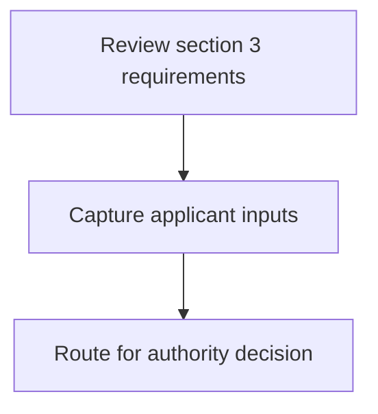
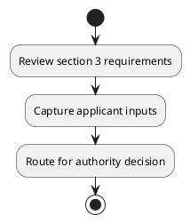

# Chapter 8 / Section 3: Representative of Agricultural and Processed Food Products Export

**Chapter Title:** Quality Complaints and Trade Disputes

**Pages:** 3

**Purpose:** Defines the operational requirements for Representative of Agricultural and Processed Food Products Export.

**Purpose Thanglish:** Indha Representative of Agricultural and Processed Food Products Export section-la, Defines the operational requirements for Representative of Agricultural and Processed Food Products export.

**Summary:** 3. Representative of Agricultural and Processed Food Products Export
Development Authority (APEDA): Member

**Business Meaning:** 3.

**Business Explanation:** 3. Representative of Agricultural and Processed Food Products Export
Development Authority (APEDA): Member

**Business Explanation Thanglish:** Indha Representative of Agricultural and Processed Food Products Export section-la, 3. Representative of Agricultural and Processed Food Products export
Development authority (APEDA): Member

## Business Logic
- None identified

## Business Rules
- rule_id=CH8-SEC3-R001, rule_description=3. Representative of Agricultural and Processed Food Products Export
Development Authority (APEDA): Member, trigger=Representative of Agricultural and Processed Food Products Export, condition=Not explicitly covered in uploaded documents., validation=Not explicitly covered in uploaded documents., action=Manual review required., exception=No explicit exception found in uploaded documents., output=DEKAI should produce a compliance decision for 3 - Representative of Agricultural and Processed Food Products Export.

## Conditions
- None identified

## Condition Logic
- None identified

## Validations
- None identified

## Exceptions
- None identified

## Dependencies
- None identified

## Authorities
- Development Authority

## Required Documents
- None identified

## Timelines
- None identified

## Actions
- None identified

## Workflow
- Review section 3 requirements
- Capture applicant inputs
- Route for authority decision

## Workflow ASCII
```text
Representative of Agricultural and Processed Food Products Export
Review section 3 requirements
   |
   v
Capture applicant inputs
   |
   v
Route for authority decision
```

## Decision Tree
- IF section 3 applies THEN proceed with standard DGFT workflow

## Decision Tree ASCII
```text
Representative of Agricultural and Processed Food Products Export Decision
IF section 3 applies THEN proceed with standard DGFT workflow
```

## Examples
- User asks to process Representative of Agricultural and Processed Food Products Export; the platform checks conditions, validations, and documents before action.

**Real-world Example:** Example: an importer or exporter invokes Representative of Agricultural and Processed Food Products Export, submits the prescribed DGFT records, and DEKAI uses the extracted rules to follow the representative of agricultural and processed food products export process.

**Real-world Example Thanglish:** Indha Representative of Agricultural and Processed Food Products Export section-la, Example: an importer or exporter invokes Representative of Agricultural and Processed Food Products export, submits the prescribed DGFT records, and DEKAI uses the extracted rules to follow the representative of agricultural and processed food products export process.

## AI Rules
- None identified

## Database Fields
- name=section_code, type=string, required=True, source=parsed_section_heading
- name=section_title, type=string, required=True, source=parsed_section_heading
- name=and_flag, type=boolean, required=False, source=keyword:and
- name=food_flag, type=boolean, required=False, source=keyword:Food
- name=apeda_flag, type=boolean, required=False, source=keyword:APEDA
- name=export_flag, type=boolean, required=False, source=keyword:Export
- name=member_flag, type=boolean, required=False, source=keyword:Member
- name=products_flag, type=boolean, required=False, source=keyword:Products
- name=processed_flag, type=boolean, required=False, source=keyword:Processed
- name=authority_flag, type=boolean, required=False, source=keyword:Authority

## API Requirements
- method=GET, path=/api/dgft/sections/3, purpose=Retrieve knowledge payload for section 3, query_params=['include=workflow,decision_tree,validations'], response_fields=['section', 'title', 'summary', 'conditions', 'validations', 'exceptions', 'workflow', 'decision_tree']
- method=POST, path=/api/dgft/Representative-of-Agricultural-and-Processed-Food-Products-Export/validate, purpose=Validate inputs and documents for Representative of Agricultural and Processed Food Products Export, request_fields=['section_code', 'section_title'], response_fields=['status', 'errors', 'warnings', 'next_actions']

## UI Screens
- screen_id=Representative_of_Agricultural_and_Processed_Food_Products_Export_overview, name=Representative of Agricultural and Processed Food Products Export Overview, purpose=Show section summary, authority, timeline, and eligibility cues., widgets=['summary_card', 'conditions_table', 'authority_badges', 'timeline_panel']
- screen_id=Representative_of_Agricultural_and_Processed_Food_Products_Export_submission, name=Representative of Agricultural and Processed Food Products Export Submission, purpose=Capture applicant data and supporting documents., widgets=['dynamic_form', 'document_uploader', 'validation_panel', 'next_action_footer'], fields=['section_code', 'section_title', 'and_flag', 'food_flag', 'apeda_flag', 'export_flag', 'member_flag', 'products_flag']

## Error Messages
- Validation failed because the section requirements were not fully met.

## FAQ
- question_en=What is the purpose of section 3?, answer_en=3. Representative of Agricultural and Processed Food Products Export
Development Authority (APEDA): Member, question_thanglish=Indha Representative of Agricultural and Processed Food Products Export section-la, What is the purpose of section 3?, answer_thanglish=Indha Representative of Agricultural and Processed Food Products Export section-la, 3. Representative of Agricultural and Processed Food Products export
Development authority (APEDA): Member
- question_en=What documents are required under Representative of Agricultural and Processed Food Products Export?, answer_en=Not explicitly covered in uploaded documents., question_thanglish=Indha Representative of Agricultural and Processed Food Products Export section-la, What documents are required under Representative of Agricultural and Processed Food Products export?, answer_thanglish=Indha Representative of Agricultural and Processed Food Products Export section-la, Not explicitly covered in uploaded documents.
- question_en=Which authority handles Representative of Agricultural and Processed Food Products Export?, answer_en=Development Authority, question_thanglish=Indha Representative of Agricultural and Processed Food Products Export section-la, Which authority handles Representative of Agricultural and Processed Food Products export?, answer_thanglish=Indha Representative of Agricultural and Processed Food Products Export section-la, Development authority

## Questions Users May Ask
- What does Representative of Agricultural and Processed Food Products Export require?
- Which documents are needed for Representative of Agricultural and Processed Food Products Export?
- How does DEKAI validate Representative of Agricultural and Processed Food Products Export requests?

## Expected AI Answers
- Representative of Agricultural and Processed Food Products Export requires the platform to interpret the section text, apply the extracted business rules, and present the correct next action.
- Required documents are inferred from the section text: no explicit documents were detected.
- DEKAI validates Representative of Agricultural and Processed Food Products Export by checking conditions, required documents, authority references, and exception clauses before recommending an outcome.

## AI Q&A Examples
- question_en=User asks: How do I comply with Representative of Agricultural and Processed Food Products Export?, answer_en=AI answers: DEKAI should evaluate section 3, apply the extracted rules, and guide the user through Review section 3 requirements., question_thanglish=Indha Representative of Agricultural and Processed Food Products Export section-la, User asks: How do I comply with Representative of Agricultural and Processed Food Products export?, answer_thanglish=Indha Representative of Agricultural and Processed Food Products Export section-la, AI answers: DEKAI should evaluate section 3, apply the extracted rules, and guide the user through Review section 3 requirements.
- question_en=User asks: Which validations apply to Representative of Agricultural and Processed Food Products Export?, answer_en=AI answers: Applicable validations are not explicitly covered in the uploaded documents., question_thanglish=Indha Representative of Agricultural and Processed Food Products Export section-la, User asks: Which validations apply to Representative of Agricultural and Processed Food Products export?, answer_thanglish=Indha Representative of Agricultural and Processed Food Products Export section-la, AI answers: Applicable validations are not explicitly covered in the uploaded documents.

## DEKAI AI Implementation Notes
- Capture chapter 8, section 3, title, and page references as immutable knowledge metadata.
- Bind validations for Representative of Agricultural and Processed Food Products Export into a rule engine keyed by the rule IDs extracted for this section.
- Route escalations or approvals to: Development Authority.

## DEKAI AI Implementation Notes Thanglish
- Indha Representative of Agricultural and Processed Food Products Export section-la, Capture chapter 8, section 3, title, and page references as immutable knowledge metadata.
- Indha Representative of Agricultural and Processed Food Products Export section-la, Bind validations for Representative of Agricultural and Processed Food Products export into a rule engine keyed by the rule IDs extracted for this section.
- Indha Representative of Agricultural and Processed Food Products Export section-la, Route escalations or approvals to: Development authority.

## AI Metadata
- Keywords: and, Food, APEDA, Export, Member, Products, Processed, Authority, Development, Agricultural, Representative
- Search Keywords: and, Food, APEDA, Export, Member, Products, Processed, Authority, Development, Agricultural, Representative
- Intent: Provide knowledge guidance for Representative of Agricultural and Processed Food Products Export.
- Tags: 3, Representative of Agricultural and Processed Food Products Export, dgft
- Related Sections: 
- Related Chapters: 
- Related Rules: 

## Mermaid


## PlantUML

