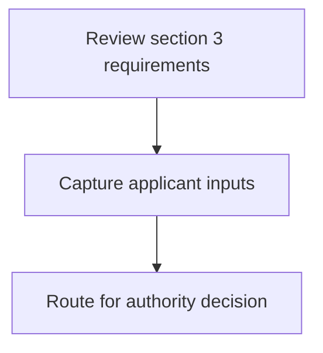
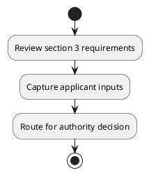

# Chapter  / Section 3: Road

**Chapter Title:** TradeNetDeclaration.IPTDEC Ver2.1 (2)

**Pages:** 11

**Purpose:** Defines the operational requirements for Road.

**Purpose Thanglish:** Indha Road section-la, Defines the operational requirements for Road.

**Summary:** 3: Road
4: Air

**Business Meaning:** 3: Road
4: Air

**Business Explanation:** 3: Road
4: Air

**Business Explanation Thanglish:** Indha Road section-la, 3: Road
4: Air

## Business Logic
- None identified

## Business Rules
- rule_id=CH-SEC3-R001, rule_description=3: Road
4: Air, trigger=Road, condition=Not explicitly covered in uploaded documents., validation=Not explicitly covered in uploaded documents., action=Manual review required., exception=No explicit exception found in uploaded documents., output=DEKAI should produce a compliance decision for 3 - Road.

## Conditions
- None identified

## Condition Logic
- None identified

## Validations
- None identified

## Exceptions
- None identified

## Dependencies
- 4

## Authorities
- None identified

## Required Documents
- None identified

## Timelines
- None identified

## Actions
- None identified

## Workflow
- Review section 3 requirements
- Capture applicant inputs
- Route for authority decision

## Workflow ASCII
```text
Road
Review section 3 requirements
   |
   v
Capture applicant inputs
   |
   v
Route for authority decision
```

## Decision Tree
- IF section 3 applies THEN proceed with standard DGFT workflow

## Decision Tree ASCII
```text
Road Decision
IF section 3 applies THEN proceed with standard DGFT workflow
```

## Examples
- User asks to process Road; the platform checks conditions, validations, and documents before action.

**Real-world Example:** Example: an importer or exporter invokes Road, submits the prescribed DGFT records, and DEKAI uses the extracted rules to follow the road process.

**Real-world Example Thanglish:** Indha Road section-la, Example: an importer or exporter invokes Road, submits the prescribed DGFT records, and DEKAI uses the extracted rules to follow the road process.

## AI Rules
- None identified

## Database Fields
- name=section_code, type=string, required=True, source=parsed_section_heading
- name=section_title, type=string, required=True, source=parsed_section_heading
- name=air_flag, type=boolean, required=False, source=keyword:Air
- name=road_flag, type=boolean, required=False, source=keyword:Road

## API Requirements
- method=GET, path=/api/dgft/sections/3, purpose=Retrieve knowledge payload for section 3, query_params=['include=workflow,decision_tree,validations'], response_fields=['section', 'title', 'summary', 'conditions', 'validations', 'exceptions', 'workflow', 'decision_tree']
- method=POST, path=/api/dgft/Road/validate, purpose=Validate inputs and documents for Road, request_fields=['section_code', 'section_title'], response_fields=['status', 'errors', 'warnings', 'next_actions']

## UI Screens
- screen_id=Road_overview, name=Road Overview, purpose=Show section summary, authority, timeline, and eligibility cues., widgets=['summary_card', 'conditions_table', 'authority_badges', 'timeline_panel']
- screen_id=Road_submission, name=Road Submission, purpose=Capture applicant data and supporting documents., widgets=['dynamic_form', 'document_uploader', 'validation_panel', 'next_action_footer'], fields=['section_code', 'section_title', 'air_flag', 'road_flag']

## Error Messages
- Validation failed because the section requirements were not fully met.

## FAQ
- question_en=What is the purpose of section 3?, answer_en=3: Road
4: Air, question_thanglish=Indha Road section-la, What is the purpose of section 3?, answer_thanglish=Indha Road section-la, 3: Road
4: Air
- question_en=What documents are required under Road?, answer_en=Not explicitly covered in uploaded documents., question_thanglish=Indha Road section-la, What documents are required under Road?, answer_thanglish=Indha Road section-la, Not explicitly covered in uploaded documents.
- question_en=Which authority handles Road?, answer_en=Not explicitly covered in uploaded documents., question_thanglish=Indha Road section-la, Which authority handles Road?, answer_thanglish=Indha Road section-la, Not explicitly covered in uploaded documents.

## Questions Users May Ask
- What does Road require?
- Which documents are needed for Road?
- How does DEKAI validate Road requests?

## Expected AI Answers
- Road requires the platform to interpret the section text, apply the extracted business rules, and present the correct next action.
- Required documents are inferred from the section text: no explicit documents were detected.
- DEKAI validates Road by checking conditions, required documents, authority references, and exception clauses before recommending an outcome.

## AI Q&A Examples
- question_en=User asks: How do I comply with Road?, answer_en=AI answers: DEKAI should evaluate section 3, apply the extracted rules, and guide the user through Review section 3 requirements., question_thanglish=Indha Road section-la, User asks: How do I comply with Road?, answer_thanglish=Indha Road section-la, AI answers: DEKAI should evaluate section 3, apply the extracted rules, and guide the user through Review section 3 requirements.
- question_en=User asks: Which validations apply to Road?, answer_en=AI answers: Applicable validations are not explicitly covered in the uploaded documents., question_thanglish=Indha Road section-la, User asks: Which validations apply to Road?, answer_thanglish=Indha Road section-la, AI answers: Applicable validations are not explicitly covered in the uploaded documents.

## DEKAI AI Implementation Notes
- Capture chapter , section 3, title, and page references as immutable knowledge metadata.
- Bind validations for Road into a rule engine keyed by the rule IDs extracted for this section.
- Show contextual links to related sections: 4.

## DEKAI AI Implementation Notes Thanglish
- Indha Road section-la, Capture chapter , section 3, title, and page references as immutable knowledge metadata.
- Indha Road section-la, Bind validations for Road into a rule engine keyed by the rule IDs extracted for this section.
- Indha Road section-la, Show contextual links to related sections: 4.

## AI Metadata
- Keywords: Air, Road
- Search Keywords: Air, Road
- Intent: Provide knowledge guidance for Road.
- Tags: 3, Road, dgft
- Related Sections: 4
- Related Chapters: 
- Related Rules: 

## Mermaid


## PlantUML

