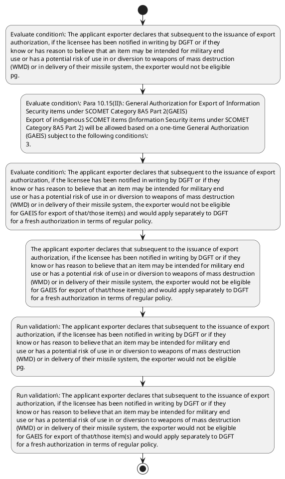

# Chapter 10 / Section 3: The applicant exporter declares that subsequent to the issuance of export

**Chapter Title:** SCOMET: Special Chemicals, Organisms, Materials, Equipment and Technologies

**Pages:** 32, 33

**Purpose:** The applicant exporter declares that subsequent to the issuance of export
authorization, if the licensee has been notified in writing by DGFT or if they
know or has reason to believe that an item may be intended for military end
use or has a potential risk of use in or diversion to weapons of mass destruction
(WMD) or in delivery of their missile system, the exporter would not be eligible
pg.

**Purpose Thanglish:** Indha The applicant exporter declares that subsequent to the issuance of export section-la, The applicant exporter declares that subsequent to the issuance of export
authorization, if the licensee has been notified in writing by DGFT or if they
know or has reason to believe that an item may be intended for military end
use or has a potential risk of use in or diversion to weapons of mass destruction
(WMD) or in delivery of their missile system, the exporter would not be eligible
pg.

**Summary:** 3. The applicant exporter declares that subsequent to the issuance of export
authorization, if the licensee has been notified in writing by DGFT or if they
know or has reason to believe that an item may be intended for military end
use or has a potential risk of use in or diversion to weapons of mass destruction
(WMD) or in delivery of their missile system, the exporter would not be eligible
pg. 1100
pg.

**Business Meaning:** The applicant exporter declares that subsequent to the issuance of export governs how DGFT business controls should be applied, validated, and enforced.

**Business Explanation:** The applicant exporter declares that subsequent to the issuance of export explains the operating rule set that DEKAI should enforce. Key control points include The applicant exporter declares that subsequent to the issuance of export
authorization, if the licensee has been notified in writing by DGFT or if they
know or has reason to believe that an item may be intended for military end
use or has a potential risk of use in or diversion to weapons of mass destruction
(WMD) or in delivery of their missile system, the exporter would not be eligible
pg. The section also drives actions such as The applicant exporter declares that subsequent to the issuance of export
authorization, if the licensee has been notified in writing by DGFT or if they
know or has reason to believe that an item may be intended for military end
use or has a potential risk of use in or diversion to weapons of mass destruction
(WMD) or in delivery of their missile system, the exporter would not be eligible
for GAEIS for export of that/those item(s) and would apply separately to DGFT
for a fresh authorization in terms of regular policy..

**Business Explanation Thanglish:** Indha The applicant exporter declares that subsequent to the issuance of export section-la, The applicant exporter declares that subsequent to the issuance of export explains the operating rule set that DEKAI should enforce. Key control points include The applicant exporter declares that subsequent to the issuance of export
authorization, if the licensee has been notified in writing by DGFT or if they
know or has reason to believe that an item may be intended for military end
use or has a potential risk of use in or diversion to weapons of mass destruction
(WMD) or in delivery of their missile system, the exporter would not be eligible
pg. The section also drives actions such as The applicant exporter declares that subsequent to the issuance of export
authorization, if the licensee has been notified in writing by DGFT or if they
know or has reason to believe that an item may be intended for military end
use or has a potential risk of use in or diversion to weapons of mass destruction
(WMD) or in delivery of their missile system, the exporter would not be eligible
for GAEIS for export of that/those item(s) and would apply separately to DGFT
for a fresh authorization in terms of regular policy..

## Business Logic
- The applicant exporter declares that subsequent to the issuance of export
authorization, if the licensee has been notified in writing by DGFT or if they
know or has reason to believe that an item may be intended for military end
use or has a potential risk of use in or diversion to weapons of mass destruction
(WMD) or in delivery of their missile system, the exporter would not be eligible
pg.
- Para 10.15(II): General Authorization for Export of Information
Security items under SCOMET Category 8A5 Part 2(GAEIS)
Export of indigenous SCOMET items (Information Security items under SCOMET
Category 8A5 Part 2) will be allowed based on a one-time General Authorization
(GAEIS) subject to the following conditions:
3.
- The applicant exporter declares that subsequent to the issuance of export
authorization, if the licensee has been notified in writing by DGFT or if they
know or has reason to believe that an item may be intended for military end
use or has a potential risk of use in or diversion to weapons of mass destruction
(WMD) or in delivery of their missile system, the exporter would not be eligible
for GAEIS for export of that/those item(s) and would apply separately to DGFT
for a fresh authorization in terms of regular policy.

## Business Rules
- rule_id=CH10-SEC3-R001, rule_description=The applicant exporter declares that subsequent to the issuance of export
authorization, if the licensee has been notified in writing by DGFT or if they
know or has reason to believe that an item may be intended for military end
use or has a potential risk of use in or diversion to weapons of mass destruction
(WMD) or in delivery of their missile system, the exporter would not be eligible
pg., trigger=The applicant exporter declares that subsequent to the issuance of export, condition=The applicant exporter declares that subsequent to the issuance of export
authorization, if the licensee has been notified in writing by DGFT or if they
know or has reason to believe that an item may be intended for military end
use or has a potential risk of use in or diversion to weapons of mass destruction
(WMD) or in delivery of their missile system, the exporter would not be eligible
pg., validation=The applicant exporter declares that subsequent to the issuance of export
authorization, if the licensee has been notified in writing by DGFT or if they
know or has reason to believe that an item may be intended for military end
use or has a potential risk of use in or diversion to weapons of mass destruction
(WMD) or in delivery of their missile system, the exporter would not be eligible
pg., action=The applicant exporter declares that subsequent to the issuance of export
authorization, if the licensee has been notified in writing by DGFT or if they
know or has reason to believe that an item may be intended for military end
use or has a potential risk of use in or diversion to weapons of mass destruction
(WMD) or in delivery of their missile system, the exporter would not be eligible
for GAEIS for export of that/those item(s) and would apply separately to DGFT
for a fresh authorization in terms of regular policy., exception=No explicit exception found in uploaded documents., output=DEKAI should produce a compliance decision for 3 - The applicant exporter declares that subsequent to the issuance of export.
- rule_id=CH10-SEC3-R002, rule_description=Para 10.15(II): General Authorization for Export of Information
Security items under SCOMET Category 8A5 Part 2(GAEIS)
Export of indigenous SCOMET items (Information Security items under SCOMET
Category 8A5 Part 2) will be allowed based on a one-time General Authorization
(GAEIS) subject to the following conditions:
3., trigger=The applicant exporter declares that subsequent to the issuance of export, condition=Para 10.15(II): General Authorization for Export of Information
Security items under SCOMET Category 8A5 Part 2(GAEIS)
Export of indigenous SCOMET items (Information Security items under SCOMET
Category 8A5 Part 2) will be allowed based on a one-time General Authorization
(GAEIS) subject to the following conditions:
3., validation=The applicant exporter declares that subsequent to the issuance of export
authorization, if the licensee has been notified in writing by DGFT or if they
know or has reason to believe that an item may be intended for military end
use or has a potential risk of use in or diversion to weapons of mass destruction
(WMD) or in delivery of their missile system, the exporter would not be eligible
for GAEIS for export of that/those item(s) and would apply separately to DGFT
for a fresh authorization in terms of regular policy., action=The applicant exporter declares that subsequent to the issuance of export
authorization, if the licensee has been notified in writing by DGFT or if they
know or has reason to believe that an item may be intended for military end
use or has a potential risk of use in or diversion to weapons of mass destruction
(WMD) or in delivery of their missile system, the exporter would not be eligible
for GAEIS for export of that/those item(s) and would apply separately to DGFT
for a fresh authorization in terms of regular policy., exception=No explicit exception found in uploaded documents., output=DEKAI should produce a compliance decision for 3 - The applicant exporter declares that subsequent to the issuance of export.
- rule_id=CH10-SEC3-R003, rule_description=The applicant exporter declares that subsequent to the issuance of export
authorization, if the licensee has been notified in writing by DGFT or if they
know or has reason to believe that an item may be intended for military end
use or has a potential risk of use in or diversion to weapons of mass destruction
(WMD) or in delivery of their missile system, the exporter would not be eligible
for GAEIS for export of that/those item(s) and would apply separately to DGFT
for a fresh authorization in terms of regular policy., trigger=The applicant exporter declares that subsequent to the issuance of export, condition=The applicant exporter declares that subsequent to the issuance of export
authorization, if the licensee has been notified in writing by DGFT or if they
know or has reason to believe that an item may be intended for military end
use or has a potential risk of use in or diversion to weapons of mass destruction
(WMD) or in delivery of their missile system, the exporter would not be eligible
for GAEIS for export of that/those item(s) and would apply separately to DGFT
for a fresh authorization in terms of regular policy., validation=The applicant exporter declares that subsequent to the issuance of export
authorization, if the licensee has been notified in writing by DGFT or if they
know or has reason to believe that an item may be intended for military end
use or has a potential risk of use in or diversion to weapons of mass destruction
(WMD) or in delivery of their missile system, the exporter would not be eligible
for GAEIS for export of that/those item(s) and would apply separately to DGFT
for a fresh authorization in terms of regular policy., action=The applicant exporter declares that subsequent to the issuance of export
authorization, if the licensee has been notified in writing by DGFT or if they
know or has reason to believe that an item may be intended for military end
use or has a potential risk of use in or diversion to weapons of mass destruction
(WMD) or in delivery of their missile system, the exporter would not be eligible
for GAEIS for export of that/those item(s) and would apply separately to DGFT
for a fresh authorization in terms of regular policy., exception=No explicit exception found in uploaded documents., output=DEKAI should produce a compliance decision for 3 - The applicant exporter declares that subsequent to the issuance of export.

## Conditions
- The applicant exporter declares that subsequent to the issuance of export
authorization, if the licensee has been notified in writing by DGFT or if they
know or has reason to believe that an item may be intended for military end
use or has a potential risk of use in or diversion to weapons of mass destruction
(WMD) or in delivery of their missile system, the exporter would not be eligible
pg.
- Para 10.15(II): General Authorization for Export of Information
Security items under SCOMET Category 8A5 Part 2(GAEIS)
Export of indigenous SCOMET items (Information Security items under SCOMET
Category 8A5 Part 2) will be allowed based on a one-time General Authorization
(GAEIS) subject to the following conditions:
3.
- The applicant exporter declares that subsequent to the issuance of export
authorization, if the licensee has been notified in writing by DGFT or if they
know or has reason to believe that an item may be intended for military end
use or has a potential risk of use in or diversion to weapons of mass destruction
(WMD) or in delivery of their missile system, the exporter would not be eligible
for GAEIS for export of that/those item(s) and would apply separately to DGFT
for a fresh authorization in terms of regular policy.

## Condition Logic
- id=10.3.1, if=The applicant exporter declares that subsequent to the issuance of export
authorization, if the licensee has been notified in writing by DGFT or if they
know or has reason to believe that an item may be intended for military end
use or has a potential risk of use in or diversion to weapons of mass destruction
(WMD) or in delivery of their missile system, the exporter would not be eligible
pg., then=The applicant exporter declares that subsequent to the issuance of export
authorization, if the licensee has been notified in writing by DGFT or if they
know or has reason to believe that an item may be intended for military end
use or has a potential risk of use in or diversion to weapons of mass destruction
(WMD) or in delivery of their missile system, the exporter would not be eligible
for GAEIS for export of that/those item(s) and would apply separately to DGFT
for a fresh authorization in terms of regular policy., source=The applicant exporter declares that subsequent to the issuance of export
authorization, if the licensee has been notified in writing by DGFT or if they
know or has reason to believe that an item may be intended for military end
use or has a potential risk of use in or diversion to weapons of mass destruction
(WMD) or in delivery of their missile system, the exporter would not be eligible
pg.
- id=10.3.2, if=Para 10.15(II): General Authorization for Export of Information
Security items under SCOMET Category 8A5 Part 2(GAEIS)
Export of indigenous SCOMET items (Information Security items under SCOMET
Category 8A5 Part 2) will be allowed based on a one-time General Authorization
(GAEIS) subject to the following conditions:
3., then=The applicant exporter declares that subsequent to the issuance of export
authorization, if the licensee has been notified in writing by DGFT or if they
know or has reason to believe that an item may be intended for military end
use or has a potential risk of use in or diversion to weapons of mass destruction
(WMD) or in delivery of their missile system, the exporter would not be eligible
for GAEIS for export of that/those item(s) and would apply separately to DGFT
for a fresh authorization in terms of regular policy., source=Para 10.15(II): General Authorization for Export of Information
Security items under SCOMET Category 8A5 Part 2(GAEIS)
Export of indigenous SCOMET items (Information Security items under SCOMET
Category 8A5 Part 2) will be allowed based on a one-time General Authorization
(GAEIS) subject to the following conditions:
3.
- id=10.3.3, if=The applicant exporter declares that subsequent to the issuance of export
authorization, if the licensee has been notified in writing by DGFT or if they
know or has reason to believe that an item may be intended for military end
use or has a potential risk of use in or diversion to weapons of mass destruction
(WMD) or in delivery of their missile system, the exporter would not be eligible
for GAEIS for export of that/those item(s) and would apply separately to DGFT
for a fresh authorization in terms of regular policy., then=The applicant exporter declares that subsequent to the issuance of export
authorization, if the licensee has been notified in writing by DGFT or if they
know or has reason to believe that an item may be intended for military end
use or has a potential risk of use in or diversion to weapons of mass destruction
(WMD) or in delivery of their missile system, the exporter would not be eligible
for GAEIS for export of that/those item(s) and would apply separately to DGFT
for a fresh authorization in terms of regular policy., source=The applicant exporter declares that subsequent to the issuance of export
authorization, if the licensee has been notified in writing by DGFT or if they
know or has reason to believe that an item may be intended for military end
use or has a potential risk of use in or diversion to weapons of mass destruction
(WMD) or in delivery of their missile system, the exporter would not be eligible
for GAEIS for export of that/those item(s) and would apply separately to DGFT
for a fresh authorization in terms of regular policy.

## Validations
- The applicant exporter declares that subsequent to the issuance of export
authorization, if the licensee has been notified in writing by DGFT or if they
know or has reason to believe that an item may be intended for military end
use or has a potential risk of use in or diversion to weapons of mass destruction
(WMD) or in delivery of their missile system, the exporter would not be eligible
pg.
- The applicant exporter declares that subsequent to the issuance of export
authorization, if the licensee has been notified in writing by DGFT or if they
know or has reason to believe that an item may be intended for military end
use or has a potential risk of use in or diversion to weapons of mass destruction
(WMD) or in delivery of their missile system, the exporter would not be eligible
for GAEIS for export of that/those item(s) and would apply separately to DGFT
for a fresh authorization in terms of regular policy.

## Exceptions
- None identified

## Dependencies
- 10.15
- 1
- 2
- 5

## Authorities
- DGFT
- GAEIS for export of that/those item(s) and would apply separately to DGFT

## Required Documents
- The applicant exporter declares that subsequent to the issuance of export
authorization, if the licensee has been notified in writing by DGFT or if they
know or has reason to believe that an item may be intended for military end
use or has a potential risk of use in or diversion to weapons of mass destruction
(WMD) or in delivery of their missile system, the exporter would not be eligible
pg.
- The applicant exporter declares that subsequent to the issuance of export
authorization, if the licensee has been notified in writing by DGFT or if they
know or has reason to believe that an item may be intended for military end
use or has a potential risk of use in or diversion to weapons of mass destruction
(WMD) or in delivery of their missile system, the exporter would not be eligible
for GAEIS for export of that/those item(s) and would apply separately to DGFT
for a fresh authorization in terms of regular policy.

## Timelines
- None identified

## Actions
- The applicant exporter declares that subsequent to the issuance of export
authorization, if the licensee has been notified in writing by DGFT or if they
know or has reason to believe that an item may be intended for military end
use or has a potential risk of use in or diversion to weapons of mass destruction
(WMD) or in delivery of their missile system, the exporter would not be eligible
for GAEIS for export of that/those item(s) and would apply separately to DGFT
for a fresh authorization in terms of regular policy.

## Workflow
- Evaluate condition: The applicant exporter declares that subsequent to the issuance of export
authorization, if the licensee has been notified in writing by DGFT or if they
know or has reason to believe that an item may be intended for military end
use or has a potential risk of use in or diversion to weapons of mass destruction
(WMD) or in delivery of their missile system, the exporter would not be eligible
pg.
- Evaluate condition: Para 10.15(II): General Authorization for Export of Information
Security items under SCOMET Category 8A5 Part 2(GAEIS)
Export of indigenous SCOMET items (Information Security items under SCOMET
Category 8A5 Part 2) will be allowed based on a one-time General Authorization
(GAEIS) subject to the following conditions:
3.
- Evaluate condition: The applicant exporter declares that subsequent to the issuance of export
authorization, if the licensee has been notified in writing by DGFT or if they
know or has reason to believe that an item may be intended for military end
use or has a potential risk of use in or diversion to weapons of mass destruction
(WMD) or in delivery of their missile system, the exporter would not be eligible
for GAEIS for export of that/those item(s) and would apply separately to DGFT
for a fresh authorization in terms of regular policy.
- The applicant exporter declares that subsequent to the issuance of export
authorization, if the licensee has been notified in writing by DGFT or if they
know or has reason to believe that an item may be intended for military end
use or has a potential risk of use in or diversion to weapons of mass destruction
(WMD) or in delivery of their missile system, the exporter would not be eligible
for GAEIS for export of that/those item(s) and would apply separately to DGFT
for a fresh authorization in terms of regular policy.
- Run validation: The applicant exporter declares that subsequent to the issuance of export
authorization, if the licensee has been notified in writing by DGFT or if they
know or has reason to believe that an item may be intended for military end
use or has a potential risk of use in or diversion to weapons of mass destruction
(WMD) or in delivery of their missile system, the exporter would not be eligible
pg.
- Run validation: The applicant exporter declares that subsequent to the issuance of export
authorization, if the licensee has been notified in writing by DGFT or if they
know or has reason to believe that an item may be intended for military end
use or has a potential risk of use in or diversion to weapons of mass destruction
(WMD) or in delivery of their missile system, the exporter would not be eligible
for GAEIS for export of that/those item(s) and would apply separately to DGFT
for a fresh authorization in terms of regular policy.

## Workflow ASCII
```text
The applicant exporter declares that subsequent to the issuance of export
Evaluate condition: The applicant exporter declares that subsequent to the issuance of export
authorization, if the licensee has been notified in writing by DGFT or if they
know or has reason to believe that an item may be intended for military end
use or has a potential risk of use in or diversion to weapons of mass destruction
(WMD) or in delivery of their missile system, the exporter would not be eligible
pg.
   |
   v
Evaluate condition: Para 10.15(II): General Authorization for Export of Information
Security items under SCOMET Category 8A5 Part 2(GAEIS)
Export of indigenous SCOMET items (Information Security items under SCOMET
Category 8A5 Part 2) will be allowed based on a one-time General Authorization
(GAEIS) subject to the following conditions:
3.
   |
   v
Evaluate condition: The applicant exporter declares that subsequent to the issuance of export
authorization, if the licensee has been notified in writing by DGFT or if they
know or has reason to believe that an item may be intended for military end
use or has a potential risk of use in or diversion to weapons of mass destruction
(WMD) or in delivery of their missile system, the exporter would not be eligible
for GAEIS for export of that/those item(s) and would apply separately to DGFT
for a fresh authorization in terms of regular policy.
   |
   v
The applicant exporter declares that subsequent to the issuance of export
authorization, if the licensee has been notified in writing by DGFT or if they
know or has reason to believe that an item may be intended for military end
use or has a potential risk of use in or diversion to weapons of mass destruction
(WMD) or in delivery of their missile system, the exporter would not be eligible
for GAEIS for export of that/those item(s) and would apply separately to DGFT
for a fresh authorization in terms of regular policy.
   |
   v
Run validation: The applicant exporter declares that subsequent to the issuance of export
authorization, if the licensee has been notified in writing by DGFT or if they
know or has reason to believe that an item may be intended for military end
use or has a potential risk of use in or diversion to weapons of mass destruction
(WMD) or in delivery of their missile system, the exporter would not be eligible
pg.
   |
   v
Run validation: The applicant exporter declares that subsequent to the issuance of export
authorization, if the licensee has been notified in writing by DGFT or if they
know or has reason to believe that an item may be intended for military end
use or has a potential risk of use in or diversion to weapons of mass destruction
(WMD) or in delivery of their missile system, the exporter would not be eligible
for GAEIS for export of that/those item(s) and would apply separately to DGFT
for a fresh authorization in terms of regular policy.
```

## Decision Tree
- IF The applicant exporter declares that subsequent to the issuance of export
authorization, if the licensee has been notified in writing by DGFT or if they
know or has reason to believe that an item may be intended for military end
use or has a potential risk of use in or diversion to weapons of mass destruction
(WMD) or in delivery of their missile system, the exporter would not be eligible
pg. THEN The applicant exporter declares that subsequent to the issuance of export
authorization, if the licensee has been notified in writing by DGFT or if they
know or has reason to believe that an item may be intended for military end
use or has a potential risk of use in or diversion to weapons of mass destruction
(WMD) or in delivery of their missile system, the exporter would not be eligible
for GAEIS for export of that/those item(s) and would apply separately to DGFT
for a fresh authorization in terms of regular policy.
- IF Para 10.15(II): General Authorization for Export of Information
Security items under SCOMET Category 8A5 Part 2(GAEIS)
Export of indigenous SCOMET items (Information Security items under SCOMET
Category 8A5 Part 2) will be allowed based on a one-time General Authorization
(GAEIS) subject to the following conditions:
3. THEN The applicant exporter declares that subsequent to the issuance of export
authorization, if the licensee has been notified in writing by DGFT or if they
know or has reason to believe that an item may be intended for military end
use or has a potential risk of use in or diversion to weapons of mass destruction
(WMD) or in delivery of their missile system, the exporter would not be eligible
for GAEIS for export of that/those item(s) and would apply separately to DGFT
for a fresh authorization in terms of regular policy.
- IF The applicant exporter declares that subsequent to the issuance of export
authorization, if the licensee has been notified in writing by DGFT or if they
know or has reason to believe that an item may be intended for military end
use or has a potential risk of use in or diversion to weapons of mass destruction
(WMD) or in delivery of their missile system, the exporter would not be eligible
for GAEIS for export of that/those item(s) and would apply separately to DGFT
for a fresh authorization in terms of regular policy. THEN The applicant exporter declares that subsequent to the issuance of export
authorization, if the licensee has been notified in writing by DGFT or if they
know or has reason to believe that an item may be intended for military end
use or has a potential risk of use in or diversion to weapons of mass destruction
(WMD) or in delivery of their missile system, the exporter would not be eligible
for GAEIS for export of that/those item(s) and would apply separately to DGFT
for a fresh authorization in terms of regular policy.

## Decision Tree ASCII
```text
The applicant exporter declares that subsequent to the issuance of export Decision
IF The applicant exporter declares that subsequent to the issuance of export
authorization, if the licensee has been notified in writing by DGFT or if they
know or has reason to believe that an item may be intended for military end
use or has a potential risk of use in or diversion to weapons of mass destruction
(WMD) or in delivery of their missile system, the exporter would not be eligible
pg. THEN The applicant exporter declares that subsequent to the issuance of export
authorization, if the licensee has been notified in writing by DGFT or if they
know or has reason to believe that an item may be intended for military end
use or has a potential risk of use in or diversion to weapons of mass destruction
(WMD) or in delivery of their missile system, the exporter would not be eligible
for GAEIS for export of that/those item(s) and would apply separately to DGFT
for a fresh authorization in terms of regular policy.
   |
   v
IF Para 10.15(II): General Authorization for Export of Information
Security items under SCOMET Category 8A5 Part 2(GAEIS)
Export of indigenous SCOMET items (Information Security items under SCOMET
Category 8A5 Part 2) will be allowed based on a one-time General Authorization
(GAEIS) subject to the following conditions:
3. THEN The applicant exporter declares that subsequent to the issuance of export
authorization, if the licensee has been notified in writing by DGFT or if they
know or has reason to believe that an item may be intended for military end
use or has a potential risk of use in or diversion to weapons of mass destruction
(WMD) or in delivery of their missile system, the exporter would not be eligible
for GAEIS for export of that/those item(s) and would apply separately to DGFT
for a fresh authorization in terms of regular policy.
   |
   v
IF The applicant exporter declares that subsequent to the issuance of export
authorization, if the licensee has been notified in writing by DGFT or if they
know or has reason to believe that an item may be intended for military end
use or has a potential risk of use in or diversion to weapons of mass destruction
(WMD) or in delivery of their missile system, the exporter would not be eligible
for GAEIS for export of that/those item(s) and would apply separately to DGFT
for a fresh authorization in terms of regular policy. THEN The applicant exporter declares that subsequent to the issuance of export
authorization, if the licensee has been notified in writing by DGFT or if they
know or has reason to believe that an item may be intended for military end
use or has a potential risk of use in or diversion to weapons of mass destruction
(WMD) or in delivery of their missile system, the exporter would not be eligible
for GAEIS for export of that/those item(s) and would apply separately to DGFT
for a fresh authorization in terms of regular policy.
```

## Examples
- User asks to process The applicant exporter declares that subsequent to the issuance of export; the platform checks conditions, validations, and documents before action.

**Real-world Example:** Example: an importer or exporter invokes The applicant exporter declares that subsequent to the issuance of export, submits The applicant exporter declares that subsequent to the issuance of export
authorization, if the licensee has been notified in writing by DGFT or if they
know or has reason to believe that an item may be intended for military end
use or has a potential risk of use in or diversion to weapons of mass destruction
(WMD) or in delivery of their missile system, the exporter would not be eligible
pg., The applicant exporter declares that subsequent to the issuance of export
authorization, if the licensee has been notified in writing by DGFT or if they
know or has reason to believe that an item may be intended for military end
use or has a potential risk of use in or diversion to weapons of mass destruction
(WMD) or in delivery of their missile system, the exporter would not be eligible
for GAEIS for export of that/those item(s) and would apply separately to DGFT
for a fresh authorization in terms of regular policy., and DEKAI uses the extracted rules to the applicant exporter declares that subsequent to the issuance of export
authorization, if the licensee has been notified in writing by dgft or if they
know or has reason to believe that an item may be intended for military end
use or has a potential risk of use in or diversion to weapons of mass destruction
(wmd) or in delivery of their missile system, the exporter would not be eligible
for gaeis for export of that/those item(s) and would apply separately to dgft
for a fresh authorization in terms of regular policy..

**Real-world Example Thanglish:** Indha The applicant exporter declares that subsequent to the issuance of export section-la, Example: an importer or exporter invokes The applicant exporter declares that subsequent to the issuance of export, submits The applicant exporter declares that subsequent to the issuance of export
authorization, if the licensee has been notified in writing by DGFT or if they
know or has reason to believe that an item may be intended for military end
use or has a potential risk of use in or diversion to weapons of mass destruction
(WMD) or in delivery of their missile system, the exporter would not be eligible
pg., The applicant exporter declares that subsequent to the issuance of export
authorization, if the licensee has been notified in writing by DGFT or if they
know or has reason to believe that an item may be intended for military end
use or has a potential risk of use in or diversion to weapons of mass destruction
(WMD) or in delivery of their missile system, the exporter would not be eligible
for GAEIS for export of that/those item(s) and would apply separately to DGFT
for a fresh authorization in terms of regular policy., and DEKAI uses the extracted rules to the applicant exporter declares that subsequent to the issuance of export
authorization, if the licensee has been notified in writing by dgft or if they
know or has reason to believe that an item may be intended for military end
use or has a potential risk of use in or diversion to weapons of mass destruction
(wmd) or in delivery of their missile system, the exporter would not be eligible
for gaeis for export of that/those item(s) and would apply separately to dgft
for a fresh authorization in terms of regular policy..

## AI Rules
- IF detected context matches section rule THEN enforce: The applicant exporter declares that subsequent to the issuance of export
authorization, if the licensee has been notified in writing by DGFT or if they
know or has reason to believe that an item may be intended for military end
use or has a potential risk of use in or diversion to weapons of mass destruction
(WMD) or in delivery of their missile system, the exporter would not be eligible
pg.
- IF detected context matches section rule THEN enforce: Para 10.15(II): General Authorization for Export of Information
Security items under SCOMET Category 8A5 Part 2(GAEIS)
Export of indigenous SCOMET items (Information Security items under SCOMET
Category 8A5 Part 2) will be allowed based on a one-time General Authorization
(GAEIS) subject to the following conditions:
3.
- IF detected context matches section rule THEN enforce: The applicant exporter declares that subsequent to the issuance of export
authorization, if the licensee has been notified in writing by DGFT or if they
know or has reason to believe that an item may be intended for military end
use or has a potential risk of use in or diversion to weapons of mass destruction
(WMD) or in delivery of their missile system, the exporter would not be eligible
for GAEIS for export of that/those item(s) and would apply separately to DGFT
for a fresh authorization in terms of regular policy.
- IF validations pass THEN recommend action: The applicant exporter declares that subsequent to the issuance of export
authorization, if the licensee has been notified in writing by DGFT or if they
know or has reason to believe that an item may be intended for military end
use or has a potential risk of use in or diversion to weapons of mass destruction
(WMD) or in delivery of their missile system, the exporter would not be eligible
for GAEIS for export of that/those item(s) and would apply separately to DGFT
for a fresh authorization in terms of regular policy.

## Database Fields
- name=section_code, type=string, required=True, source=parsed_section_heading
- name=section_title, type=string, required=True, source=parsed_section_heading
- name=the_flag, type=boolean, required=False, source=keyword:The
- name=has_flag, type=boolean, required=False, source=keyword:has
- name=may_flag, type=boolean, required=False, source=keyword:may
- name=for_flag, type=boolean, required=False, source=keyword:for
- name=end_flag, type=boolean, required=False, source=keyword:end
- name=use_flag, type=boolean, required=False, source=keyword:use
- name=wmd_flag, type=boolean, required=False, source=keyword:WMD
- name=not_flag, type=boolean, required=False, source=keyword:not
- name=document_1_submitted, type=boolean, required=True, source=The applicant exporter declares that subsequent to the issuance of export
authorization, if the licensee has been notified in writing by DGFT or if they
know or has reason to believe that an item may be intended for military end
use or has a potential risk of use in or diversion to weapons of mass destruction
(WMD) or in delivery of their missile system, the exporter would not be eligible
pg.
- name=document_2_submitted, type=boolean, required=True, source=The applicant exporter declares that subsequent to the issuance of export
authorization, if the licensee has been notified in writing by DGFT or if they
know or has reason to believe that an item may be intended for military end
use or has a potential risk of use in or diversion to weapons of mass destruction
(WMD) or in delivery of their missile system, the exporter would not be eligible
for GAEIS for export of that/those item(s) and would apply separately to DGFT
for a fresh authorization in terms of regular policy.

## API Requirements
- method=GET, path=/api/dgft/sections/3, purpose=Retrieve knowledge payload for section 3, query_params=['include=workflow,decision_tree,validations'], response_fields=['section', 'title', 'summary', 'conditions', 'validations', 'exceptions', 'workflow', 'decision_tree']
- method=POST, path=/api/dgft/The-applicant-exporter-declares-that-subsequent-to-the-issuance-of-export/validate, purpose=Validate inputs and documents for The applicant exporter declares that subsequent to the issuance of export, request_fields=['section_code', 'section_title', 'document_1_submitted', 'document_2_submitted'], response_fields=['status', 'errors', 'warnings', 'next_actions']
- method=POST, path=/api/dgft/The-applicant-exporter-declares-that-subsequent-to-the-issuance-of-export/execute, purpose=Trigger business action for The applicant exporter declares that subsequent to the issuance of export
authorization, if the licensee has been notified in writing by DGFT or if they
know or has reason to believe that an item may be intended for military end
use or has a potential risk of use in or diversion to weapons of mass destruction
(WMD) or in delivery of their missile system, the exporter would not be eligible
for GAEIS for export of that/those item(s) and would apply separately to DGFT
for a fresh authorization in terms of regular policy., request_fields=['section_code', 'section_title', 'document_1_submitted', 'document_2_submitted'], response_fields=['reference_id', 'status', 'authority', 'timeline']

## UI Screens
- screen_id=The_applicant_exporter_declares_that_subsequent_to_the_issuance_of_export_overview, name=The applicant exporter declares that subsequent to the issuance of export Overview, purpose=Show section summary, authority, timeline, and eligibility cues., widgets=['summary_card', 'conditions_table', 'authority_badges', 'timeline_panel']
- screen_id=The_applicant_exporter_declares_that_subsequent_to_the_issuance_of_export_submission, name=The applicant exporter declares that subsequent to the issuance of export Submission, purpose=Capture applicant data and supporting documents., widgets=['dynamic_form', 'document_uploader', 'validation_panel', 'next_action_footer'], fields=['section_code', 'section_title', 'the_flag', 'has_flag', 'may_flag', 'for_flag', 'end_flag', 'use_flag']

## Error Messages
- Validation failed because the section requirements were not fully met.

## FAQ
- question_en=What is the purpose of section 3?, answer_en=The applicant exporter declares that subsequent to the issuance of export explains the operating rule set that DEKAI should enforce. Key control points include The applicant exporter declares that subsequent to the issuance of export
authorization, if the licensee has been notified in writing by DGFT or if they
know or has reason to believe that an item may be intended for military end
use or has a potential risk of use in or diversion to weapons of mass destruction
(WMD) or in delivery of their missile system, the exporter would not be eligible
pg. The section also drives actions such as The applicant exporter declares that subsequent to the issuance of export
authorization, if the licensee has been notified in writing by DGFT or if they
know or has reason to believe that an item may be intended for military end
use or has a potential risk of use in or diversion to weapons of mass destruction
(WMD) or in delivery of their missile system, the exporter would not be eligible
for GAEIS for export of that/those item(s) and would apply separately to DGFT
for a fresh authorization in terms of regular policy.., question_thanglish=Indha The applicant exporter declares that subsequent to the issuance of export section-la, What is the purpose of section 3?, answer_thanglish=Indha The applicant exporter declares that subsequent to the issuance of export section-la, The applicant exporter declares that subsequent to the issuance of export explains the operating rule set that DEKAI should enforce. Key control points include The applicant exporter declares that subsequent to the issuance of export
authorization, if the licensee has been notified in writing by DGFT or if they
know or has reason to believe that an item may be intended for military end
use or has a potential risk of use in or diversion to weapons of mass destruction
(WMD) or in delivery of their missile system, the exporter would not be eligible
pg. The section also drives actions such as The applicant exporter declares that subsequent to the issuance of export
authorization, if the licensee has been notified in writing by DGFT or if they
know or has reason to believe that an item may be intended for military end
use or has a potential risk of use in or diversion to weapons of mass destruction
(WMD) or in delivery of their missile system, the exporter would not be eligible
for GAEIS for export of that/those item(s) and would apply separately to DGFT
for a fresh authorization in terms of regular policy..
- question_en=What documents are required under The applicant exporter declares that subsequent to the issuance of export?, answer_en=The applicant exporter declares that subsequent to the issuance of export
authorization, if the licensee has been notified in writing by DGFT or if they
know or has reason to believe that an item may be intended for military end
use or has a potential risk of use in or diversion to weapons of mass destruction
(WMD) or in delivery of their missile system, the exporter would not be eligible
pg., The applicant exporter declares that subsequent to the issuance of export
authorization, if the licensee has been notified in writing by DGFT or if they
know or has reason to believe that an item may be intended for military end
use or has a potential risk of use in or diversion to weapons of mass destruction
(WMD) or in delivery of their missile system, the exporter would not be eligible
for GAEIS for export of that/those item(s) and would apply separately to DGFT
for a fresh authorization in terms of regular policy., question_thanglish=Indha The applicant exporter declares that subsequent to the issuance of export section-la, What documents are required under The applicant exporter declares that subsequent to the issuance of export?, answer_thanglish=Indha The applicant exporter declares that subsequent to the issuance of export section-la, The applicant exporter declares that subsequent to the issuance of export
authorization, if the licensee has been notified in writing by DGFT or if they
know or has reason to believe that an item may be intended for military end
use or has a potential risk of use in or diversion to weapons of mass destruction
(WMD) or in delivery of their missile system, the exporter would not be eligible
pg., The applicant exporter declares that subsequent to the issuance of export
authorization, if the licensee has been notified in writing by DGFT or if they
know or has reason to believe that an item may be intended for military end
use or has a potential risk of use in or diversion to weapons of mass destruction
(WMD) or in delivery of their missile system, the exporter would not be eligible
for GAEIS for export of that/those item(s) and would apply separately to DGFT
for a fresh authorization in terms of regular policy.
- question_en=Which authority handles The applicant exporter declares that subsequent to the issuance of export?, answer_en=DGFT, GAEIS for export of that/those item(s) and would apply separately to DGFT, question_thanglish=Indha The applicant exporter declares that subsequent to the issuance of export section-la, Which authority handles The applicant exporter declares that subsequent to the issuance of export?, answer_thanglish=Indha The applicant exporter declares that subsequent to the issuance of export section-la, DGFT, GAEIS for export of that/those item(s) and would apply separately to DGFT

## Questions Users May Ask
- What does The applicant exporter declares that subsequent to the issuance of export require?
- Which documents are needed for The applicant exporter declares that subsequent to the issuance of export?
- How does DEKAI validate The applicant exporter declares that subsequent to the issuance of export requests?
- What action should be taken for The applicant exporter declares that subsequent to the issuance of export?

## Expected AI Answers
- The applicant exporter declares that subsequent to the issuance of export requires the platform to interpret the section text, apply the extracted business rules, and present the correct next action.
- Required documents are inferred from the section text: The applicant exporter declares that subsequent to the issuance of export
authorization, if the licensee has been notified in writing by DGFT or if they
know or has reason to believe that an item may be intended for military end
use or has a potential risk of use in or diversion to weapons of mass destruction
(WMD) or in delivery of their missile system, the exporter would not be eligible
pg., The applicant exporter declares that subsequent to the issuance of export
authorization, if the licensee has been notified in writing by DGFT or if they
know or has reason to believe that an item may be intended for military end
use or has a potential risk of use in or diversion to weapons of mass destruction
(WMD) or in delivery of their missile system, the exporter would not be eligible
for GAEIS for export of that/those item(s) and would apply separately to DGFT
for a fresh authorization in terms of regular policy.
- DEKAI validates The applicant exporter declares that subsequent to the issuance of export by checking conditions, required documents, authority references, and exception clauses before recommending an outcome.
- The primary extracted action is: The applicant exporter declares that subsequent to the issuance of export
authorization, if the licensee has been notified in writing by DGFT or if they
know or has reason to believe that an item may be intended for military end
use or has a potential risk of use in or diversion to weapons of mass destruction
(WMD) or in delivery of their missile system, the exporter would not be eligible
for GAEIS for export of that/those item(s) and would apply separately to DGFT
for a fresh authorization in terms of regular policy.

## AI Q&A Examples
- question_en=User asks: How do I comply with The applicant exporter declares that subsequent to the issuance of export?, answer_en=AI answers: DEKAI should evaluate section 3, apply the extracted rules, and guide the user through Evaluate condition: The applicant exporter declares that subsequent to the issuance of export
authorization, if the licensee has been notified in writing by DGFT or if they
know or has reason to believe that an item may be intended for military end
use or has a potential risk of use in or diversion to weapons of mass destruction
(WMD) or in delivery of their missile system, the exporter would not be eligible
pg.., question_thanglish=Indha The applicant exporter declares that subsequent to the issuance of export section-la, User asks: How do I comply with The applicant exporter declares that subsequent to the issuance of export?, answer_thanglish=Indha The applicant exporter declares that subsequent to the issuance of export section-la, AI answers: DEKAI should evaluate section 3, apply the extracted rules, and guide the user through Evaluate condition: The applicant exporter declares that subsequent to the issuance of export
authorization, if the licensee has been notified in writing by DGFT or if they
know or has reason to believe that an item may be intended for military end
use or has a potential risk of use in or diversion to weapons of mass destruction
(WMD) or in delivery of their missile system, the exporter would not be eligible
pg..
- question_en=User asks: Which validations apply to The applicant exporter declares that subsequent to the issuance of export?, answer_en=AI answers: Applicable validations are The applicant exporter declares that subsequent to the issuance of export
authorization, if the licensee has been notified in writing by DGFT or if they
know or has reason to believe that an item may be intended for military end
use or has a potential risk of use in or diversion to weapons of mass destruction
(WMD) or in delivery of their missile system, the exporter would not be eligible
pg., The applicant exporter declares that subsequent to the issuance of export
authorization, if the licensee has been notified in writing by DGFT or if they
know or has reason to believe that an item may be intended for military end
use or has a potential risk of use in or diversion to weapons of mass destruction
(WMD) or in delivery of their missile system, the exporter would not be eligible
for GAEIS for export of that/those item(s) and would apply separately to DGFT
for a fresh authorization in terms of regular policy., question_thanglish=Indha The applicant exporter declares that subsequent to the issuance of export section-la, User asks: Which validations apply to The applicant exporter declares that subsequent to the issuance of export?, answer_thanglish=Indha The applicant exporter declares that subsequent to the issuance of export section-la, AI answers: Applicable validations are The applicant exporter declares that subsequent to the issuance of export
authorization, if the licensee has been notified in writing by DGFT or if they
know or has reason to believe that an item may be intended for military end
use or has a potential risk of use in or diversion to weapons of mass destruction
(WMD) or in delivery of their missile system, the exporter would not be eligible
pg., The applicant exporter declares that subsequent to the issuance of export
authorization, if the licensee has been notified in writing by DGFT or if they
know or has reason to believe that an item may be intended for military end
use or has a potential risk of use in or diversion to weapons of mass destruction
(WMD) or in delivery of their missile system, the exporter would not be eligible
for GAEIS for export of that/those item(s) and would apply separately to DGFT
for a fresh authorization in terms of regular policy.

## DEKAI AI Implementation Notes
- Capture chapter 10, section 3, title, and page references as immutable knowledge metadata.
- Bind validations for The applicant exporter declares that subsequent to the issuance of export into a rule engine keyed by the rule IDs extracted for this section.
- Expose document upload controls for: The applicant exporter declares that subsequent to the issuance of export
authorization, if the licensee has been notified in writing by DGFT or if they
know or has reason to believe that an item may be intended for military end
use or has a potential risk of use in or diversion to weapons of mass destruction
(WMD) or in delivery of their missile system, the exporter would not be eligible
pg., The applicant exporter declares that subsequent to the issuance of export
authorization, if the licensee has been notified in writing by DGFT or if they
know or has reason to believe that an item may be intended for military end
use or has a potential risk of use in or diversion to weapons of mass destruction
(WMD) or in delivery of their missile system, the exporter would not be eligible
for GAEIS for export of that/those item(s) and would apply separately to DGFT
for a fresh authorization in terms of regular policy..
- Route escalations or approvals to: DGFT, GAEIS for export of that/those item(s) and would apply separately to DGFT.
- Show contextual links to related sections: 1, 2, 5, 10.15.

## DEKAI AI Implementation Notes Thanglish
- Indha The applicant exporter declares that subsequent to the issuance of export section-la, Capture chapter 10, section 3, title, and page references as immutable knowledge metadata.
- Indha The applicant exporter declares that subsequent to the issuance of export section-la, Bind validations for The applicant exporter declares that subsequent to the issuance of export into a rule engine keyed by the rule IDs extracted for this section.
- Indha The applicant exporter declares that subsequent to the issuance of export section-la, Expose document upload controls for: The applicant exporter declares that subsequent to the issuance of export
authorization, if the licensee has been notified in writing by DGFT or if they
know or has reason to believe that an item may be intended for military end
use or has a potential risk of use in or diversion to weapons of mass destruction
(WMD) or in delivery of their missile system, the exporter would not be eligible
pg., The applicant exporter declares that subsequent to the issuance of export
authorization, if the licensee has been notified in writing by DGFT or if they
know or has reason to believe that an item may be intended for military end
use or has a potential risk of use in or diversion to weapons of mass destruction
(WMD) or in delivery of their missile system, the exporter would not be eligible
for GAEIS for export of that/those item(s) and would apply separately to DGFT
for a fresh authorization in terms of regular policy..
- Indha The applicant exporter declares that subsequent to the issuance of export section-la, Route escalations or approvals to: DGFT, GAEIS for export of that/those item(s) and would apply separately to DGFT.
- Indha The applicant exporter declares that subsequent to the issuance of export section-la, Show contextual links to related sections: 1, 2, 5, 10.15.

## AI Metadata
- Keywords: The, has, may, for, end, use, WMD, not, and, that, been, DGFT, they, know, item, risk, mass, Para, Part, will
- Search Keywords: The, has, may, for, end, use, WMD, not, and, that, been, DGFT, they, know, item, risk, mass, Para, Part, will
- Intent: Support The applicant exporter declares that subsequent to the issuance of export processing and compliance validation.
- Tags: 3, The applicant exporter declares that subsequent to the issuance of export, business-rule, document-driven, dgft
- Related Sections: 1, 2, 5, 10.15
- Related Chapters: 
- Related Rules: The applicant exporter declares that subsequent to the issuance of export
authorization, if the licensee has been notified in writing by DGFT or if they
know or has reason to believe that an item may be intended for military end
use or has a potential risk of use in or diversion to weapons of mass destruction
(WMD) or in delivery of their missile system, the exporter would not be eligible
pg., Para 10.15(II): General Authorization for Export of Information
Security items under SCOMET Category 8A5 Part 2(GAEIS)
Export of indigenous SCOMET items (Information Security items under SCOMET
Category 8A5 Part 2) will be allowed based on a one-time General Authorization
(GAEIS) subject to the following conditions:
3., The applicant exporter declares that subsequent to the issuance of export
authorization, if the licensee has been notified in writing by DGFT or if they
know or has reason to believe that an item may be intended for military end
use or has a potential risk of use in or diversion to weapons of mass destruction
(WMD) or in delivery of their missile system, the exporter would not be eligible
for GAEIS for export of that/those item(s) and would apply separately to DGFT
for a fresh authorization in terms of regular policy.

## Mermaid

```mermaid
flowchart TD
    S1["Evaluate condition: The applicant exporter declares that subsequent to the issuance of export
authorization, if the licensee has been notified in writing by DGFT or if they
know or has reason to believe that an item may be intended for military end
use or has a potential risk of use in or diversion to weapons of mass destruction
(WMD) or in delivery of their missile system, the exporter would not be eligible
pg."]
    S2["Evaluate condition: Para 10.15(II): General Authorization for Export of Information
Security items under SCOMET Category 8A5 Part 2(GAEIS)
Export of indigenous SCOMET items (Information Security items under SCOMET
Category 8A5 Part 2) will be allowed based on a one-time General Authorization
(GAEIS) subject to the following conditions:
3."]
    S1 --> S2
    S3["Evaluate condition: The applicant exporter declares that subsequent to the issuance of export
authorization, if the licensee has been notified in writing by DGFT or if they
know or has reason to believe that an item may be intended for military end
use or has a potential risk of use in or diversion to weapons of mass destruction
(WMD) or in delivery of their missile system, the exporter would not be eligible
for GAEIS for export of that/those item(s) and would apply separately to DGFT
for a fresh authorization in terms of regular policy."]
    S2 --> S3
    S4["The applicant exporter declares that subsequent to the issuance of export
authorization, if the licensee has been notified in writing by DGFT or if they
know or has reason to believe that an item may be intended for military end
use or has a potential risk of use in or diversion to weapons of mass destruction
(WMD) or in delivery of their missile system, the exporter would not be eligible
for GAEIS for export of that/those item(s) and would apply separately to DGFT
for a fresh authorization in terms of regular policy."]
    S3 --> S4
    S5["Run validation: The applicant exporter declares that subsequent to the issuance of export
authorization, if the licensee has been notified in writing by DGFT or if they
know or has reason to believe that an item may be intended for military end
use or has a potential risk of use in or diversion to weapons of mass destruction
(WMD) or in delivery of their missile system, the exporter would not be eligible
pg."]
    S4 --> S5
    S6["Run validation: The applicant exporter declares that subsequent to the issuance of export
authorization, if the licensee has been notified in writing by DGFT or if they
know or has reason to believe that an item may be intended for military end
use or has a potential risk of use in or diversion to weapons of mass destruction
(WMD) or in delivery of their missile system, the exporter would not be eligible
for GAEIS for export of that/those item(s) and would apply separately to DGFT
for a fresh authorization in terms of regular policy."]
    S5 --> S6
```


## PlantUML

