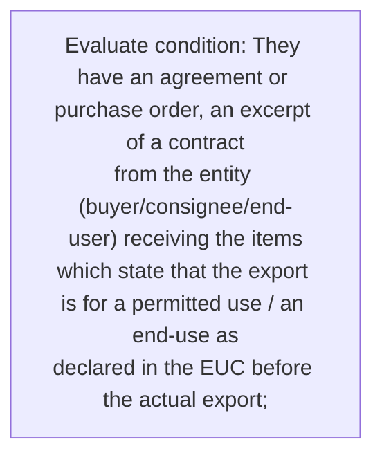
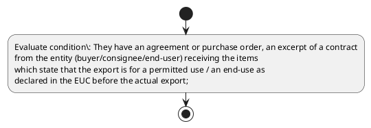

# Chapter 10 / Section 3: They have an agreement or purchase order, an excerpt of a contract

**Chapter Title:** SCOMET: Special Chemicals, Organisms, Materials, Equipment and Technologies

**Pages:** 30

**Purpose:** They have an agreement or purchase order, an excerpt of a contract
from the entity (buyer/consignee/end-user) receiving the items
which state that the export is for a permitted use / an end-use as
declared in the EUC before the actual export;

**Purpose Thanglish:** Indha They have an agreement or purchase order, an excerpt of a contract section-la, They have an agreement or purchase order, an excerpt of a contract
from the entity (buyer/consignee/end-user) receiving the items
which state that the export is for a permitted use / an end-use as
declared in the EUC before the actual export;

**Summary:** 3. They have an agreement or purchase order, an excerpt of a contract
from the entity (buyer/consignee/end-user) receiving the items
which state that the export is for a permitted use / an end-use as
declared in the EUC before the actual export;

**Business Meaning:** 3.

**Business Explanation:** 3. They have an agreement or purchase order, an excerpt of a contract
from the entity (buyer/consignee/end-user) receiving the items
which state that the export is for a permitted use / an end-use as
declared in the EUC before the actual export;

**Business Explanation Thanglish:** Indha They have an agreement or purchase order, an excerpt of a contract section-la, 3. They have an agreement or purchase order, an excerpt of a contract
from the entity (buyer/consignee/end-user) receiving the items
which state that the export is for a permitted use / an end-use as
declared in the EUC before the actual export;

## Business Logic
- None identified

## Business Rules
- rule_id=CH10-SEC3-R001, rule_description=3. They have an agreement or purchase order, an excerpt of a contract
from the entity (buyer/consignee/end-user) receiving the items
which state that the export is for a permitted use / an end-use as
declared in the EUC before the actual export;, trigger=They have an agreement or purchase order, an excerpt of a contract, condition=They have an agreement or purchase order, an excerpt of a contract
from the entity (buyer/consignee/end-user) receiving the items
which state that the export is for a permitted use / an end-use as
declared in the EUC before the actual export;, validation=Not explicitly covered in uploaded documents., action=Manual review required., exception=No explicit exception found in uploaded documents., output=DEKAI should produce a compliance decision for 3 - They have an agreement or purchase order, an excerpt of a contract.

## Conditions
- They have an agreement or purchase order, an excerpt of a contract
from the entity (buyer/consignee/end-user) receiving the items
which state that the export is for a permitted use / an end-use as
declared in the EUC before the actual export;

## Condition Logic
- id=10.3.1, if=They have an agreement or purchase order, an excerpt of a contract
from the entity (buyer/consignee/end-user) receiving the items
which state that the export is for a permitted use / an end-use as
declared in the EUC before the actual export;, then=Route for review, source=They have an agreement or purchase order, an excerpt of a contract
from the entity (buyer/consignee/end-user) receiving the items
which state that the export is for a permitted use / an end-use as
declared in the EUC before the actual export;

## Validations
- None identified

## Exceptions
- None identified

## Dependencies
- None identified

## Authorities
- None identified

## Required Documents
- None identified

## Timelines
- They have an agreement or purchase order, an excerpt of a contract
from the entity (buyer/consignee/end-user) receiving the items
which state that the export is for a permitted use / an end-use as
declared in the EUC before the actual export;

## Actions
- None identified

## Workflow
- Evaluate condition: They have an agreement or purchase order, an excerpt of a contract
from the entity (buyer/consignee/end-user) receiving the items
which state that the export is for a permitted use / an end-use as
declared in the EUC before the actual export;

## Workflow ASCII
```text
They have an agreement or purchase order, an excerpt of a contract
Evaluate condition: They have an agreement or purchase order, an excerpt of a contract
from the entity (buyer/consignee/end-user) receiving the items
which state that the export is for a permitted use / an end-use as
declared in the EUC before the actual export;
```

## Decision Tree
- IF section 3 applies THEN proceed with standard DGFT workflow

## Decision Tree ASCII
```text
They have an agreement or purchase order, an excerpt of a contract Decision
IF section 3 applies THEN proceed with standard DGFT workflow
```

## Examples
- User asks to process They have an agreement or purchase order, an excerpt of a contract; the platform checks conditions, validations, and documents before action.

**Real-world Example:** Example: an importer or exporter invokes They have an agreement or purchase order, an excerpt of a contract, submits the prescribed DGFT records, and DEKAI uses the extracted rules to follow the they have an agreement or purchase order, an excerpt of a contract process.

**Real-world Example Thanglish:** Indha They have an agreement or purchase order, an excerpt of a contract section-la, Example: an importer or exporter invokes They have an agreement or purchase order, an excerpt of a contract, submits the prescribed DGFT records, and DEKAI uses the extracted rules to follow the they have an agreement or purchase order, an excerpt of a contract process.

## AI Rules
- None identified

## Database Fields
- name=section_code, type=string, required=True, source=parsed_section_heading
- name=section_title, type=string, required=True, source=parsed_section_heading
- name=the_flag, type=boolean, required=False, source=keyword:the
- name=for_flag, type=boolean, required=False, source=keyword:for
- name=use_flag, type=boolean, required=False, source=keyword:use
- name=euc_flag, type=boolean, required=False, source=keyword:EUC
- name=they_flag, type=boolean, required=False, source=keyword:They
- name=have_flag, type=boolean, required=False, source=keyword:have
- name=from_flag, type=boolean, required=False, source=keyword:from
- name=that_flag, type=boolean, required=False, source=keyword:that

## API Requirements
- method=GET, path=/api/dgft/sections/3, purpose=Retrieve knowledge payload for section 3, query_params=['include=workflow,decision_tree,validations'], response_fields=['section', 'title', 'summary', 'conditions', 'validations', 'exceptions', 'workflow', 'decision_tree']
- method=POST, path=/api/dgft/They-have-an-agreement-or-purchase-order-an-excerpt-of-a-contract/validate, purpose=Validate inputs and documents for They have an agreement or purchase order, an excerpt of a contract, request_fields=['section_code', 'section_title'], response_fields=['status', 'errors', 'warnings', 'next_actions']

## UI Screens
- screen_id=They_have_an_agreement_or_purchase_order_an_excerpt_of_a_contract_overview, name=They have an agreement or purchase order, an excerpt of a contract Overview, purpose=Show section summary, authority, timeline, and eligibility cues., widgets=['summary_card', 'conditions_table', 'authority_badges', 'timeline_panel']
- screen_id=They_have_an_agreement_or_purchase_order_an_excerpt_of_a_contract_submission, name=They have an agreement or purchase order, an excerpt of a contract Submission, purpose=Capture applicant data and supporting documents., widgets=['dynamic_form', 'document_uploader', 'validation_panel', 'next_action_footer'], fields=['section_code', 'section_title', 'the_flag', 'for_flag', 'use_flag', 'euc_flag', 'they_flag', 'have_flag']

## Error Messages
- Validation failed because the section requirements were not fully met.

## FAQ
- question_en=What is the purpose of section 3?, answer_en=3. They have an agreement or purchase order, an excerpt of a contract
from the entity (buyer/consignee/end-user) receiving the items
which state that the export is for a permitted use / an end-use as
declared in the EUC before the actual export;, question_thanglish=Indha They have an agreement or purchase order, an excerpt of a contract section-la, What is the purpose of section 3?, answer_thanglish=Indha They have an agreement or purchase order, an excerpt of a contract section-la, 3. They have an agreement or purchase order, an excerpt of a contract
from the entity (buyer/consignee/end-user) receiving the items
which state that the export is for a permitted use / an end-use as
declared in the EUC before the actual export;
- question_en=What documents are required under They have an agreement or purchase order, an excerpt of a contract?, answer_en=Not explicitly covered in uploaded documents., question_thanglish=Indha They have an agreement or purchase order, an excerpt of a contract section-la, What documents are required under They have an agreement or purchase order, an excerpt of a contract?, answer_thanglish=Indha They have an agreement or purchase order, an excerpt of a contract section-la, Not explicitly covered in uploaded documents.
- question_en=Which authority handles They have an agreement or purchase order, an excerpt of a contract?, answer_en=Not explicitly covered in uploaded documents., question_thanglish=Indha They have an agreement or purchase order, an excerpt of a contract section-la, Which authority handles They have an agreement or purchase order, an excerpt of a contract?, answer_thanglish=Indha They have an agreement or purchase order, an excerpt of a contract section-la, Not explicitly covered in uploaded documents.

## Questions Users May Ask
- What does They have an agreement or purchase order, an excerpt of a contract require?
- Which documents are needed for They have an agreement or purchase order, an excerpt of a contract?
- How does DEKAI validate They have an agreement or purchase order, an excerpt of a contract requests?

## Expected AI Answers
- They have an agreement or purchase order, an excerpt of a contract requires the platform to interpret the section text, apply the extracted business rules, and present the correct next action.
- Required documents are inferred from the section text: no explicit documents were detected.
- DEKAI validates They have an agreement or purchase order, an excerpt of a contract by checking conditions, required documents, authority references, and exception clauses before recommending an outcome.

## AI Q&A Examples
- question_en=User asks: How do I comply with They have an agreement or purchase order, an excerpt of a contract?, answer_en=AI answers: DEKAI should evaluate section 3, apply the extracted rules, and guide the user through Evaluate condition: They have an agreement or purchase order, an excerpt of a contract
from the entity (buyer/consignee/end-user) receiving the items
which state that the export is for a permitted use / an end-use as
declared in the EUC before the actual export;., question_thanglish=Indha They have an agreement or purchase order, an excerpt of a contract section-la, User asks: How do I comply with They have an agreement or purchase order, an excerpt of a contract?, answer_thanglish=Indha They have an agreement or purchase order, an excerpt of a contract section-la, AI answers: DEKAI should evaluate section 3, apply the extracted rules, and guide the user through Evaluate condition: They have an agreement or purchase order, an excerpt of a contract
from the entity (buyer/consignee/end-user) receiving the items
which state that the export is for a permitted use / an end-use as
declared in the EUC before the actual export;.
- question_en=User asks: Which validations apply to They have an agreement or purchase order, an excerpt of a contract?, answer_en=AI answers: Applicable validations are not explicitly covered in the uploaded documents., question_thanglish=Indha They have an agreement or purchase order, an excerpt of a contract section-la, User asks: Which validations apply to They have an agreement or purchase order, an excerpt of a contract?, answer_thanglish=Indha They have an agreement or purchase order, an excerpt of a contract section-la, AI answers: Applicable validations are not explicitly covered in the uploaded documents.

## DEKAI AI Implementation Notes
- Capture chapter 10, section 3, title, and page references as immutable knowledge metadata.
- Bind validations for They have an agreement or purchase order, an excerpt of a contract into a rule engine keyed by the rule IDs extracted for this section.

## DEKAI AI Implementation Notes Thanglish
- Indha They have an agreement or purchase order, an excerpt of a contract section-la, Capture chapter 10, section 3, title, and page references as immutable knowledge metadata.
- Indha They have an agreement or purchase order, an excerpt of a contract section-la, Bind validations for They have an agreement or purchase order, an excerpt of a contract into a rule engine keyed by the rule IDs extracted for this section.

## AI Metadata
- Keywords: the, for, use, EUC, They, have, from, that, order, items, which, state, entity, export, before, actual, excerpt, end-use, purchase, contract
- Search Keywords: the, for, use, EUC, They, have, from, that, order, items, which, state, entity, export, before, actual, excerpt, end-use, purchase, contract
- Intent: Provide knowledge guidance for They have an agreement or purchase order, an excerpt of a contract.
- Tags: 3, They have an agreement or purchase order, an excerpt of a contract, dgft
- Related Sections: 
- Related Chapters: 
- Related Rules: 

## Mermaid


## PlantUML

