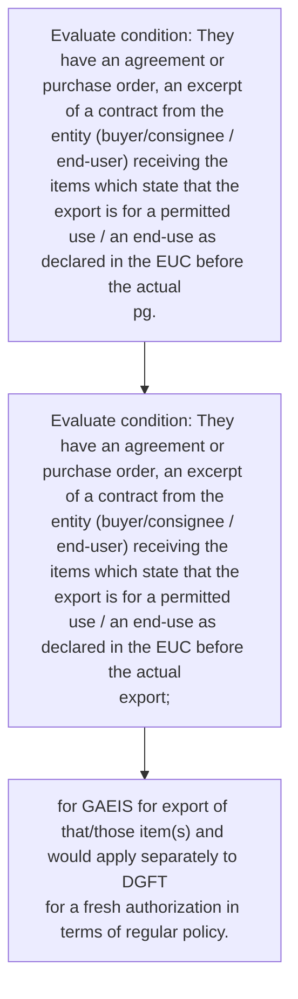
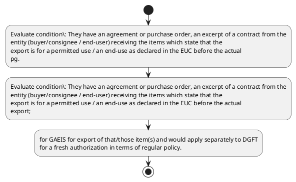

# Chapter 10 / Section 3: They have an agreement or purchase order, an excerpt of a contract from the

**Chapter Title:** SCOMET: Special Chemicals, Organisms, Materials, Equipment and Technologies

**Pages:** 33, 34

**Purpose:** They have an agreement or purchase order, an excerpt of a contract from the
entity (buyer/consignee / end-user) receiving the items which state that the
export is for a permitted use / an end-use as declared in the EUC before the actual
pg.

**Purpose Thanglish:** Indha They have an agreement or purchase order, an excerpt of a contract from the section-la, They have an agreement or purchase order, an excerpt of a contract from the
entity (buyer/consignee / end-user) receiving the items which state that the
export is for a permitted use / an end-use as declared in the EUC before the actual
pg.

**Summary:** 3. They have an agreement or purchase order, an excerpt of a contract from the
entity (buyer/consignee / end-user) receiving the items which state that the
export is for a permitted use / an end-use as declared in the EUC before the actual
pg. 1101
pg.

**Business Meaning:** 3.

**Business Explanation:** 3. They have an agreement or purchase order, an excerpt of a contract from the
entity (buyer/consignee / end-user) receiving the items which state that the
export is for a permitted use / an end-use as declared in the EUC before the actual
pg. 1101
pg.

**Business Explanation Thanglish:** Indha They have an agreement or purchase order, an excerpt of a contract from the section-la, 3. They have an agreement or purchase order, an excerpt of a contract from the
entity (buyer/consignee / end-user) receiving the items which state that the
export is for a permitted use / an end-use as declared in the EUC before the actual
pg. 1101
pg.

## Business Logic
- None identified

## Business Rules
- rule_id=CH10-SEC3-R001, rule_description=IF validations pass THEN recommend action: for GAEIS for export of that/those item(s) and would apply separately to DGFT
for a fresh authorization in terms of regular policy., trigger=They have an agreement or purchase order, an excerpt of a contract from the, condition=They have an agreement or purchase order, an excerpt of a contract from the
entity (buyer/consignee / end-user) receiving the items which state that the
export is for a permitted use / an end-use as declared in the EUC before the actual
pg., validation=Not explicitly covered in uploaded documents., action=for GAEIS for export of that/those item(s) and would apply separately to DGFT
for a fresh authorization in terms of regular policy., exception=No explicit exception found in uploaded documents., output=DEKAI should produce a compliance decision for 3 - They have an agreement or purchase order, an excerpt of a contract from the.

## Conditions
- They have an agreement or purchase order, an excerpt of a contract from the
entity (buyer/consignee / end-user) receiving the items which state that the
export is for a permitted use / an end-use as declared in the EUC before the actual
pg.
- They have an agreement or purchase order, an excerpt of a contract from the
entity (buyer/consignee / end-user) receiving the items which state that the
export is for a permitted use / an end-use as declared in the EUC before the actual
export;

## Condition Logic
- id=10.3.1, if=They have an agreement or purchase order, an excerpt of a contract from the
entity (buyer/consignee / end-user) receiving the items which state that the
export is for a permitted use / an end-use as declared in the EUC before the actual
pg., then=for GAEIS for export of that/those item(s) and would apply separately to DGFT
for a fresh authorization in terms of regular policy., source=They have an agreement or purchase order, an excerpt of a contract from the
entity (buyer/consignee / end-user) receiving the items which state that the
export is for a permitted use / an end-use as declared in the EUC before the actual
pg.
- id=10.3.2, if=They have an agreement or purchase order, an excerpt of a contract from the
entity (buyer/consignee / end-user) receiving the items which state that the
export is for a permitted use / an end-use as declared in the EUC before the actual
export;, then=for GAEIS for export of that/those item(s) and would apply separately to DGFT
for a fresh authorization in terms of regular policy., source=They have an agreement or purchase order, an excerpt of a contract from the
entity (buyer/consignee / end-user) receiving the items which state that the
export is for a permitted use / an end-use as declared in the EUC before the actual
export;

## Validations
- None identified

## Exceptions
- None identified

## Dependencies
- 1

## Authorities
- DGFT
- GAEIS for export of that/those item(s) and would apply separately to DGFT

## Required Documents
- None identified

## Timelines
- They have an agreement or purchase order, an excerpt of a contract from the
entity (buyer/consignee / end-user) receiving the items which state that the
export is for a permitted use / an end-use as declared in the EUC before the actual
pg.
- They have an agreement or purchase order, an excerpt of a contract from the
entity (buyer/consignee / end-user) receiving the items which state that the
export is for a permitted use / an end-use as declared in the EUC before the actual
export;

## Actions
- for GAEIS for export of that/those item(s) and would apply separately to DGFT
for a fresh authorization in terms of regular policy.

## Workflow
- Evaluate condition: They have an agreement or purchase order, an excerpt of a contract from the
entity (buyer/consignee / end-user) receiving the items which state that the
export is for a permitted use / an end-use as declared in the EUC before the actual
pg.
- Evaluate condition: They have an agreement or purchase order, an excerpt of a contract from the
entity (buyer/consignee / end-user) receiving the items which state that the
export is for a permitted use / an end-use as declared in the EUC before the actual
export;
- for GAEIS for export of that/those item(s) and would apply separately to DGFT
for a fresh authorization in terms of regular policy.

## Workflow ASCII
```text
They have an agreement or purchase order, an excerpt of a contract from the
Evaluate condition: They have an agreement or purchase order, an excerpt of a contract from the
entity (buyer/consignee / end-user) receiving the items which state that the
export is for a permitted use / an end-use as declared in the EUC before the actual
pg.
   |
   v
Evaluate condition: They have an agreement or purchase order, an excerpt of a contract from the
entity (buyer/consignee / end-user) receiving the items which state that the
export is for a permitted use / an end-use as declared in the EUC before the actual
export;
   |
   v
for GAEIS for export of that/those item(s) and would apply separately to DGFT
for a fresh authorization in terms of regular policy.
```

## Decision Tree
- IF They have an agreement or purchase order, an excerpt of a contract from the
entity (buyer/consignee / end-user) receiving the items which state that the
export is for a permitted use / an end-use as declared in the EUC before the actual
pg. THEN for GAEIS for export of that/those item(s) and would apply separately to DGFT
for a fresh authorization in terms of regular policy.
- IF They have an agreement or purchase order, an excerpt of a contract from the
entity (buyer/consignee / end-user) receiving the items which state that the
export is for a permitted use / an end-use as declared in the EUC before the actual
export; THEN for GAEIS for export of that/those item(s) and would apply separately to DGFT
for a fresh authorization in terms of regular policy.

## Decision Tree ASCII
```text
They have an agreement or purchase order, an excerpt of a contract from the Decision
IF They have an agreement or purchase order, an excerpt of a contract from the
entity (buyer/consignee / end-user) receiving the items which state that the
export is for a permitted use / an end-use as declared in the EUC before the actual
pg. THEN for GAEIS for export of that/those item(s) and would apply separately to DGFT
for a fresh authorization in terms of regular policy.
   |
   v
IF They have an agreement or purchase order, an excerpt of a contract from the
entity (buyer/consignee / end-user) receiving the items which state that the
export is for a permitted use / an end-use as declared in the EUC before the actual
export; THEN for GAEIS for export of that/those item(s) and would apply separately to DGFT
for a fresh authorization in terms of regular policy.
```

## Examples
- User asks to process They have an agreement or purchase order, an excerpt of a contract from the; the platform checks conditions, validations, and documents before action.

**Real-world Example:** Example: an importer or exporter invokes They have an agreement or purchase order, an excerpt of a contract from the, submits the prescribed DGFT records, and DEKAI uses the extracted rules to for gaeis for export of that/those item(s) and would apply separately to dgft
for a fresh authorization in terms of regular policy..

**Real-world Example Thanglish:** Indha They have an agreement or purchase order, an excerpt of a contract from the section-la, Example: an importer or exporter invokes They have an agreement or purchase order, an excerpt of a contract from the, submits the prescribed DGFT records, and DEKAI uses the extracted rules to for gaeis for export of that/those item(s) and would apply separately to dgft
for a fresh authorization in terms of regular policy..

## AI Rules
- IF validations pass THEN recommend action: for GAEIS for export of that/those item(s) and would apply separately to DGFT
for a fresh authorization in terms of regular policy.

## Database Fields
- name=section_code, type=string, required=True, source=parsed_section_heading
- name=section_title, type=string, required=True, source=parsed_section_heading
- name=the_flag, type=boolean, required=False, source=keyword:the
- name=for_flag, type=boolean, required=False, source=keyword:for
- name=use_flag, type=boolean, required=False, source=keyword:use
- name=euc_flag, type=boolean, required=False, source=keyword:EUC
- name=and_flag, type=boolean, required=False, source=keyword:and
- name=they_flag, type=boolean, required=False, source=keyword:They
- name=have_flag, type=boolean, required=False, source=keyword:have
- name=from_flag, type=boolean, required=False, source=keyword:from

## API Requirements
- method=GET, path=/api/dgft/sections/3, purpose=Retrieve knowledge payload for section 3, query_params=['include=workflow,decision_tree,validations'], response_fields=['section', 'title', 'summary', 'conditions', 'validations', 'exceptions', 'workflow', 'decision_tree']
- method=POST, path=/api/dgft/They-have-an-agreement-or-purchase-order-an-excerpt-of-a-contract-from-the/validate, purpose=Validate inputs and documents for They have an agreement or purchase order, an excerpt of a contract from the, request_fields=['section_code', 'section_title'], response_fields=['status', 'errors', 'warnings', 'next_actions']
- method=POST, path=/api/dgft/They-have-an-agreement-or-purchase-order-an-excerpt-of-a-contract-from-the/execute, purpose=Trigger business action for for GAEIS for export of that/those item(s) and would apply separately to DGFT
for a fresh authorization in terms of regular policy., request_fields=['section_code', 'section_title'], response_fields=['reference_id', 'status', 'authority', 'timeline']

## UI Screens
- screen_id=They_have_an_agreement_or_purchase_order_an_excerpt_of_a_contract_from_the_overview, name=They have an agreement or purchase order, an excerpt of a contract from the Overview, purpose=Show section summary, authority, timeline, and eligibility cues., widgets=['summary_card', 'conditions_table', 'authority_badges', 'timeline_panel']
- screen_id=They_have_an_agreement_or_purchase_order_an_excerpt_of_a_contract_from_the_submission, name=They have an agreement or purchase order, an excerpt of a contract from the Submission, purpose=Capture applicant data and supporting documents., widgets=['dynamic_form', 'document_uploader', 'validation_panel', 'next_action_footer'], fields=['section_code', 'section_title', 'the_flag', 'for_flag', 'use_flag', 'euc_flag', 'and_flag', 'they_flag']

## Error Messages
- Validation failed because the section requirements were not fully met.

## FAQ
- question_en=What is the purpose of section 3?, answer_en=3. They have an agreement or purchase order, an excerpt of a contract from the
entity (buyer/consignee / end-user) receiving the items which state that the
export is for a permitted use / an end-use as declared in the EUC before the actual
pg. 1101
pg., question_thanglish=Indha They have an agreement or purchase order, an excerpt of a contract from the section-la, What is the purpose of section 3?, answer_thanglish=Indha They have an agreement or purchase order, an excerpt of a contract from the section-la, 3. They have an agreement or purchase order, an excerpt of a contract from the
entity (buyer/consignee / end-user) receiving the items which state that the
export is for a permitted use / an end-use as declared in the EUC before the actual
pg. 1101
pg.
- question_en=What documents are required under They have an agreement or purchase order, an excerpt of a contract from the?, answer_en=Not explicitly covered in uploaded documents., question_thanglish=Indha They have an agreement or purchase order, an excerpt of a contract from the section-la, What documents are required under They have an agreement or purchase order, an excerpt of a contract from the?, answer_thanglish=Indha They have an agreement or purchase order, an excerpt of a contract from the section-la, Not explicitly covered in uploaded documents.
- question_en=Which authority handles They have an agreement or purchase order, an excerpt of a contract from the?, answer_en=DGFT, GAEIS for export of that/those item(s) and would apply separately to DGFT, question_thanglish=Indha They have an agreement or purchase order, an excerpt of a contract from the section-la, Which authority handles They have an agreement or purchase order, an excerpt of a contract from the?, answer_thanglish=Indha They have an agreement or purchase order, an excerpt of a contract from the section-la, DGFT, GAEIS for export of that/those item(s) and would apply separately to DGFT

## Questions Users May Ask
- What does They have an agreement or purchase order, an excerpt of a contract from the require?
- Which documents are needed for They have an agreement or purchase order, an excerpt of a contract from the?
- How does DEKAI validate They have an agreement or purchase order, an excerpt of a contract from the requests?
- What action should be taken for They have an agreement or purchase order, an excerpt of a contract from the?

## Expected AI Answers
- They have an agreement or purchase order, an excerpt of a contract from the requires the platform to interpret the section text, apply the extracted business rules, and present the correct next action.
- Required documents are inferred from the section text: no explicit documents were detected.
- DEKAI validates They have an agreement or purchase order, an excerpt of a contract from the by checking conditions, required documents, authority references, and exception clauses before recommending an outcome.
- The primary extracted action is: for GAEIS for export of that/those item(s) and would apply separately to DGFT
for a fresh authorization in terms of regular policy.

## AI Q&A Examples
- question_en=User asks: How do I comply with They have an agreement or purchase order, an excerpt of a contract from the?, answer_en=AI answers: DEKAI should evaluate section 3, apply the extracted rules, and guide the user through Evaluate condition: They have an agreement or purchase order, an excerpt of a contract from the
entity (buyer/consignee / end-user) receiving the items which state that the
export is for a permitted use / an end-use as declared in the EUC before the actual
pg.., question_thanglish=Indha They have an agreement or purchase order, an excerpt of a contract from the section-la, User asks: How do I comply with They have an agreement or purchase order, an excerpt of a contract from the?, answer_thanglish=Indha They have an agreement or purchase order, an excerpt of a contract from the section-la, AI answers: DEKAI should evaluate section 3, apply the extracted rules, and guide the user through Evaluate condition: They have an agreement or purchase order, an excerpt of a contract from the
entity (buyer/consignee / end-user) receiving the items which state that the
export is for a permitted use / an end-use as declared in the EUC before the actual
pg..
- question_en=User asks: Which validations apply to They have an agreement or purchase order, an excerpt of a contract from the?, answer_en=AI answers: Applicable validations are not explicitly covered in the uploaded documents., question_thanglish=Indha They have an agreement or purchase order, an excerpt of a contract from the section-la, User asks: Which validations apply to They have an agreement or purchase order, an excerpt of a contract from the?, answer_thanglish=Indha They have an agreement or purchase order, an excerpt of a contract from the section-la, AI answers: Applicable validations are not explicitly covered in the uploaded documents.

## DEKAI AI Implementation Notes
- Capture chapter 10, section 3, title, and page references as immutable knowledge metadata.
- Bind validations for They have an agreement or purchase order, an excerpt of a contract from the into a rule engine keyed by the rule IDs extracted for this section.
- Route escalations or approvals to: DGFT, GAEIS for export of that/those item(s) and would apply separately to DGFT.
- Show contextual links to related sections: 1.

## DEKAI AI Implementation Notes Thanglish
- Indha They have an agreement or purchase order, an excerpt of a contract from the section-la, Capture chapter 10, section 3, title, and page references as immutable knowledge metadata.
- Indha They have an agreement or purchase order, an excerpt of a contract from the section-la, Bind validations for They have an agreement or purchase order, an excerpt of a contract from the into a rule engine keyed by the rule IDs extracted for this section.
- Indha They have an agreement or purchase order, an excerpt of a contract from the section-la, Route escalations or approvals to: DGFT, GAEIS for export of that/those item(s) and would apply separately to DGFT.
- Indha They have an agreement or purchase order, an excerpt of a contract from the section-la, Show contextual links to related sections: 1.

## AI Metadata
- Keywords: the, for, use, EUC, and, They, have, from, that, item, DGFT, order, items, which, state, GAEIS, would, apply, fresh, terms
- Search Keywords: the, for, use, EUC, and, They, have, from, that, item, DGFT, order, items, which, state, GAEIS, would, apply, fresh, terms
- Intent: Support They have an agreement or purchase order, an excerpt of a contract from the processing and compliance validation.
- Tags: 3, They have an agreement or purchase order, an excerpt of a contract from the, dgft
- Related Sections: 1
- Related Chapters: 
- Related Rules: 

## Mermaid


## PlantUML

