# Chapter 4 / Section 4.02: General Provision

**Chapter Title:** Duty Exemption / Remission Schemes

**Pages:** 2

**Purpose:** 4.02 General Provision
(i) Application for grant of Advance Authorisation / Special Advance
Authorisation for export of Articles of Apparel and Clothing Accessories /
Advance Authorisation for Annual Requirement / Duty Free Import
Authorisation (DFIA) shall be filed online (digitally signed) by IEC holder to
the concerned jurisdictional Regional Authority as per Appendix 1A.

**Purpose Thanglish:** Indha General Provision section-la, 4.02 General Provision
(i) application for grant of Advance Authorisation / Special Advance
Authorisation for export of Articles of Apparel and Clothing Accessories /
Advance Authorisation for Annual Requirement / Duty Free import
Authorisation (DFIA) kandippa be filed online (digitally signed) by IEC holder to
the concerned jurisdictional Regional authority as per Appendix 1A.

**Summary:** 4.02 General Provision
(i) Application for grant of Advance Authorisation / Special Advance
Authorisation for export of Articles of Apparel and Clothing Accessories /
Advance Authorisation for Annual Requirement / Duty Free Import
Authorisation (DFIA) shall be filed online (digitally signed) by IEC holder to
the concerned jurisdictional Regional Authority as per Appendix 1A. Applicant
could be either Registered office or Head office or a branch office or a
manufacturing unit of the IEC holder. (ii) Applicant shall upload documents as prescribed in ANF 4A, if any, at the time
of online filing of application.

**Business Meaning:** General Provision governs how DGFT business controls should be applied, validated, and enforced.

**Business Explanation:** General Provision explains the operating rule set that DEKAI should enforce. Key control points include 4.02 General Provision
(i) Application for grant of Advance Authorisation / Special Advance
Authorisation for export of Articles of Apparel and Clothing Accessories /
Advance Authorisation for Annual Requirement / Duty Free Import
Authorisation (DFIA) shall be filed online (digitally signed) by IEC holder to
the concerned jurisdictional Regional Authority as per Appendix 1A. The section also drives actions such as Applicant
could be either Registered office or Head office or a branch office or a
manufacturing unit of the IEC holder..

**Business Explanation Thanglish:** Indha General Provision section-la, General Provision explains the operating rule set that DEKAI should enforce. Key control points include 4.02 General Provision
(i) application for grant of Advance Authorisation / Special Advance
Authorisation for export of Articles of Apparel and Clothing Accessories /
Advance Authorisation for Annual Requirement / Duty Free import
Authorisation (DFIA) kandippa be filed online (digitally signed) by IEC holder to
the concerned jurisdictional Regional authority as per Appendix 1A. The section also drives actions such as Applicant
could be either Registered office or Head office or a branch office or a
manufacturing unit of the IEC holder..

## Business Logic
- 4.02 General Provision
(i) Application for grant of Advance Authorisation / Special Advance
Authorisation for export of Articles of Apparel and Clothing Accessories /
Advance Authorisation for Annual Requirement / Duty Free Import
Authorisation (DFIA) shall be filed online (digitally signed) by IEC holder to
the concerned jurisdictional Regional Authority as per Appendix 1A.
- (ii) Applicant shall upload documents as prescribed in ANF 4A, if any, at the time
of online filing of application.
- No physical copy of application is required to be
submitted to Regional Authority.
- 4.02 General Provision
(i)
Application for grant of Advance Authorisation / Special Advance
Authorisation for export of Articles of Apparel and Clothing Accessories /
Advance Authorisation for Annual Requirement / Duty Free Import
Authorisation (DFIA) shall be filed online (digitally signed) by IEC holder to
the concerned jurisdictional Regional Authority as per Appendix 1A.
- (ii)
Applicant shall upload documents as prescribed in ANF 4A, if any, at the time
of online filing of application.

## Business Rules
- rule_id=CH4-SEC4_02-R001, rule_description=4.02 General Provision
(i) Application for grant of Advance Authorisation / Special Advance
Authorisation for export of Articles of Apparel and Clothing Accessories /
Advance Authorisation for Annual Requirement / Duty Free Import
Authorisation (DFIA) shall be filed online (digitally signed) by IEC holder to
the concerned jurisdictional Regional Authority as per Appendix 1A., trigger=General Provision, condition=any, validation=4.02 General Provision
(i) Application for grant of Advance Authorisation / Special Advance
Authorisation for export of Articles of Apparel and Clothing Accessories /
Advance Authorisation for Annual Requirement / Duty Free Import
Authorisation (DFIA) shall be filed online (digitally signed) by IEC holder to
the concerned jurisdictional Regional Authority as per Appendix 1A., action=Applicant
could be either Registered office or Head office or a branch office or a
manufacturing unit of the IEC holder., exception=No explicit exception found in uploaded documents., output=DEKAI should produce a compliance decision for 4.02 - General Provision.
- rule_id=CH4-SEC4_02-R002, rule_description=(ii) Applicant shall upload documents as prescribed in ANF 4A, if any, at the time
of online filing of application., trigger=General Provision, condition=any, validation=(ii) Applicant shall upload documents as prescribed in ANF 4A, if any, at the time
of online filing of application., action=(ii) Applicant shall upload documents as prescribed in ANF 4A, if any, at the time
of online filing of application., exception=No explicit exception found in uploaded documents., output=DEKAI should produce a compliance decision for 4.02 - General Provision.
- rule_id=CH4-SEC4_02-R003, rule_description=No physical copy of application is required to be
submitted to Regional Authority., trigger=General Provision, condition=any, validation=No physical copy of application is required to be
submitted to Regional Authority., action=No physical copy of application is required to be
submitted to Regional Authority., exception=No explicit exception found in uploaded documents., output=DEKAI should produce a compliance decision for 4.02 - General Provision.
- rule_id=CH4-SEC4_02-R004, rule_description=4.02 General Provision
(i)
Application for grant of Advance Authorisation / Special Advance
Authorisation for export of Articles of Apparel and Clothing Accessories /
Advance Authorisation for Annual Requirement / Duty Free Import
Authorisation (DFIA) shall be filed online (digitally signed) by IEC holder to
the concerned jurisdictional Regional Authority as per Appendix 1A., trigger=General Provision, condition=any, validation=4.02 General Provision
(i)
Application for grant of Advance Authorisation / Special Advance
Authorisation for export of Articles of Apparel and Clothing Accessories /
Advance Authorisation for Annual Requirement / Duty Free Import
Authorisation (DFIA) shall be filed online (digitally signed) by IEC holder to
the concerned jurisdictional Regional Authority as per Appendix 1A., action=(ii)
Applicant shall upload documents as prescribed in ANF 4A, if any, at the time
of online filing of application., exception=No explicit exception found in uploaded documents., output=DEKAI should produce a compliance decision for 4.02 - General Provision.
- rule_id=CH4-SEC4_02-R005, rule_description=(ii)
Applicant shall upload documents as prescribed in ANF 4A, if any, at the time
of online filing of application., trigger=General Provision, condition=any, validation=(ii)
Applicant shall upload documents as prescribed in ANF 4A, if any, at the time
of online filing of application., action=(ii)
Applicant shall upload documents as prescribed in ANF 4A, if any, at the time
of online filing of application., exception=No explicit exception found in uploaded documents., output=DEKAI should produce a compliance decision for 4.02 - General Provision.

## Conditions
- (ii) Applicant shall upload documents as prescribed in ANF 4A, if any, at the time
of online filing of application.
- (ii)
Applicant shall upload documents as prescribed in ANF 4A, if any, at the time
of online filing of application.

## Condition Logic
- id=4.4.02.1, if=any, then=Applicant
could be either Registered office or Head office or a branch office or a
manufacturing unit of the IEC holder., source=(ii) Applicant shall upload documents as prescribed in ANF 4A, if any, at the time
of online filing of application.
- id=4.4.02.2, if=any, then=Applicant
could be either Registered office or Head office or a branch office or a
manufacturing unit of the IEC holder., source=(ii)
Applicant shall upload documents as prescribed in ANF 4A, if any, at the time
of online filing of application.

## Validations
- 4.02 General Provision
(i) Application for grant of Advance Authorisation / Special Advance
Authorisation for export of Articles of Apparel and Clothing Accessories /
Advance Authorisation for Annual Requirement / Duty Free Import
Authorisation (DFIA) shall be filed online (digitally signed) by IEC holder to
the concerned jurisdictional Regional Authority as per Appendix 1A.
- (ii) Applicant shall upload documents as prescribed in ANF 4A, if any, at the time
of online filing of application.
- No physical copy of application is required to be
submitted to Regional Authority.
- 4.02 General Provision
(i)
Application for grant of Advance Authorisation / Special Advance
Authorisation for export of Articles of Apparel and Clothing Accessories /
Advance Authorisation for Annual Requirement / Duty Free Import
Authorisation (DFIA) shall be filed online (digitally signed) by IEC holder to
the concerned jurisdictional Regional Authority as per Appendix 1A.
- (ii)
Applicant shall upload documents as prescribed in ANF 4A, if any, at the time
of online filing of application.

## Exceptions
- None identified

## Dependencies
- None identified

## Authorities
- Regional Authority

## Required Documents
- 4.02 General Provision
(i) Application for grant of Advance Authorisation / Special Advance
Authorisation for export of Articles of Apparel and Clothing Accessories /
Advance Authorisation for Annual Requirement / Duty Free Import
Authorisation (DFIA) shall be filed online (digitally signed) by IEC holder to
the concerned jurisdictional Regional Authority as per Appendix 1A.
- (ii) Applicant shall upload documents as prescribed in ANF 4A, if any, at the time
of online filing of application.
- No physical copy of application is required to be
submitted to Regional Authority.
- 4.02 General Provision
(i)
Application for grant of Advance Authorisation / Special Advance
Authorisation for export of Articles of Apparel and Clothing Accessories /
Advance Authorisation for Annual Requirement / Duty Free Import
Authorisation (DFIA) shall be filed online (digitally signed) by IEC holder to
the concerned jurisdictional Regional Authority as per Appendix 1A.
- (ii)
Applicant shall upload documents as prescribed in ANF 4A, if any, at the time
of online filing of application.

## Timelines
- None identified

## Actions
- Applicant
could be either Registered office or Head office or a branch office or a
manufacturing unit of the IEC holder.
- (ii) Applicant shall upload documents as prescribed in ANF 4A, if any, at the time
of online filing of application.
- No physical copy of application is required to be
submitted to Regional Authority.
- (ii)
Applicant shall upload documents as prescribed in ANF 4A, if any, at the time
of online filing of application.

## Workflow
- Evaluate condition: (ii) Applicant shall upload documents as prescribed in ANF 4A, if any, at the time
of online filing of application.
- Evaluate condition: (ii)
Applicant shall upload documents as prescribed in ANF 4A, if any, at the time
of online filing of application.
- Applicant
could be either Registered office or Head office or a branch office or a
manufacturing unit of the IEC holder.
- (ii) Applicant shall upload documents as prescribed in ANF 4A, if any, at the time
of online filing of application.
- No physical copy of application is required to be
submitted to Regional Authority.
- (ii)
Applicant shall upload documents as prescribed in ANF 4A, if any, at the time
of online filing of application.
- Run validation: 4.02 General Provision
(i) Application for grant of Advance Authorisation / Special Advance
Authorisation for export of Articles of Apparel and Clothing Accessories /
Advance Authorisation for Annual Requirement / Duty Free Import
Authorisation (DFIA) shall be filed online (digitally signed) by IEC holder to
the concerned jurisdictional Regional Authority as per Appendix 1A.
- Run validation: (ii) Applicant shall upload documents as prescribed in ANF 4A, if any, at the time
of online filing of application.
- Run validation: No physical copy of application is required to be
submitted to Regional Authority.

## Workflow ASCII
```text
General Provision
Evaluate condition: (ii) Applicant shall upload documents as prescribed in ANF 4A, if any, at the time
of online filing of application.
   |
   v
Evaluate condition: (ii)
Applicant shall upload documents as prescribed in ANF 4A, if any, at the time
of online filing of application.
   |
   v
Applicant
could be either Registered office or Head office or a branch office or a
manufacturing unit of the IEC holder.
   |
   v
(ii) Applicant shall upload documents as prescribed in ANF 4A, if any, at the time
of online filing of application.
   |
   v
No physical copy of application is required to be
submitted to Regional Authority.
   |
   v
(ii)
Applicant shall upload documents as prescribed in ANF 4A, if any, at the time
of online filing of application.
   |
   v
Run validation: 4.02 General Provision
(i) Application for grant of Advance Authorisation / Special Advance
Authorisation for export of Articles of Apparel and Clothing Accessories /
Advance Authorisation for Annual Requirement / Duty Free Import
Authorisation (DFIA) shall be filed online (digitally signed) by IEC holder to
the concerned jurisdictional Regional Authority as per Appendix 1A.
   |
   v
Run validation: (ii) Applicant shall upload documents as prescribed in ANF 4A, if any, at the time
of online filing of application.
   |
   v
Run validation: No physical copy of application is required to be
submitted to Regional Authority.
```

## Decision Tree
- IF (ii) Applicant shall upload documents as prescribed in ANF 4A, if any, at the time
of online filing of application. THEN Applicant
could be either Registered office or Head office or a branch office or a
manufacturing unit of the IEC holder.
- IF (ii)
Applicant shall upload documents as prescribed in ANF 4A, if any, at the time
of online filing of application. THEN Applicant
could be either Registered office or Head office or a branch office or a
manufacturing unit of the IEC holder.

## Decision Tree ASCII
```text
General Provision Decision
IF (ii) Applicant shall upload documents as prescribed in ANF 4A, if any, at the time
of online filing of application. THEN Applicant
could be either Registered office or Head office or a branch office or a
manufacturing unit of the IEC holder.
   |
   v
IF (ii)
Applicant shall upload documents as prescribed in ANF 4A, if any, at the time
of online filing of application. THEN Applicant
could be either Registered office or Head office or a branch office or a
manufacturing unit of the IEC holder.
```

## Examples
- User asks to process General Provision; the platform checks conditions, validations, and documents before action.

**Real-world Example:** Example: an importer or exporter invokes General Provision, submits 4.02 General Provision
(i) Application for grant of Advance Authorisation / Special Advance
Authorisation for export of Articles of Apparel and Clothing Accessories /
Advance Authorisation for Annual Requirement / Duty Free Import
Authorisation (DFIA) shall be filed online (digitally signed) by IEC holder to
the concerned jurisdictional Regional Authority as per Appendix 1A., (ii) Applicant shall upload documents as prescribed in ANF 4A, if any, at the time
of online filing of application., No physical copy of application is required to be
submitted to Regional Authority., and DEKAI uses the extracted rules to applicant
could be either registered office or head office or a branch office or a
manufacturing unit of the iec holder..

**Real-world Example Thanglish:** Indha General Provision section-la, Example: an importer or exporter invokes General Provision, submits 4.02 General Provision
(i) application for grant of Advance Authorisation / Special Advance
Authorisation for export of Articles of Apparel and Clothing Accessories /
Advance Authorisation for Annual Requirement / Duty Free import
Authorisation (DFIA) kandippa be filed online (digitally signed) by IEC holder to
the concerned jurisdictional Regional authority as per Appendix 1A., (ii) Applicant kandippa upload documents as prescribed in ANF 4A, if any, at the time
of online filing of application., No physical copy of application is required to be
submitted to Regional authority., and DEKAI uses the extracted rules to applicant
could be either registered office or head office or a branch office or a
manufacturing unit of the iec holder..

## AI Rules
- IF detected context matches section rule THEN enforce: 4.02 General Provision
(i) Application for grant of Advance Authorisation / Special Advance
Authorisation for export of Articles of Apparel and Clothing Accessories /
Advance Authorisation for Annual Requirement / Duty Free Import
Authorisation (DFIA) shall be filed online (digitally signed) by IEC holder to
the concerned jurisdictional Regional Authority as per Appendix 1A.
- IF detected context matches section rule THEN enforce: (ii) Applicant shall upload documents as prescribed in ANF 4A, if any, at the time
of online filing of application.
- IF detected context matches section rule THEN enforce: No physical copy of application is required to be
submitted to Regional Authority.
- IF detected context matches section rule THEN enforce: 4.02 General Provision
(i)
Application for grant of Advance Authorisation / Special Advance
Authorisation for export of Articles of Apparel and Clothing Accessories /
Advance Authorisation for Annual Requirement / Duty Free Import
Authorisation (DFIA) shall be filed online (digitally signed) by IEC holder to
the concerned jurisdictional Regional Authority as per Appendix 1A.
- IF detected context matches section rule THEN enforce: (ii)
Applicant shall upload documents as prescribed in ANF 4A, if any, at the time
of online filing of application.
- IF validations pass THEN recommend action: Applicant
could be either Registered office or Head office or a branch office or a
manufacturing unit of the IEC holder.

## Database Fields
- name=section_code, type=string, required=True, source=parsed_section_heading
- name=section_title, type=string, required=True, source=parsed_section_heading
- name=for_flag, type=boolean, required=False, source=keyword:for
- name=and_flag, type=boolean, required=False, source=keyword:and
- name=iec_flag, type=boolean, required=False, source=keyword:IEC
- name=the_flag, type=boolean, required=False, source=keyword:the
- name=per_flag, type=boolean, required=False, source=keyword:per
- name=anf_flag, type=boolean, required=False, source=keyword:ANF
- name=any_flag, type=boolean, required=False, source=keyword:any
- name=duty_flag, type=boolean, required=False, source=keyword:Duty
- name=document_1_submitted, type=boolean, required=True, source=4.02 General Provision
(i) Application for grant of Advance Authorisation / Special Advance
Authorisation for export of Articles of Apparel and Clothing Accessories /
Advance Authorisation for Annual Requirement / Duty Free Import
Authorisation (DFIA) shall be filed online (digitally signed) by IEC holder to
the concerned jurisdictional Regional Authority as per Appendix 1A.
- name=document_2_submitted, type=boolean, required=True, source=(ii) Applicant shall upload documents as prescribed in ANF 4A, if any, at the time
of online filing of application.
- name=document_3_submitted, type=boolean, required=True, source=No physical copy of application is required to be
submitted to Regional Authority.
- name=document_4_submitted, type=boolean, required=True, source=4.02 General Provision
(i)
Application for grant of Advance Authorisation / Special Advance
Authorisation for export of Articles of Apparel and Clothing Accessories /
Advance Authorisation for Annual Requirement / Duty Free Import
Authorisation (DFIA) shall be filed online (digitally signed) by IEC holder to
the concerned jurisdictional Regional Authority as per Appendix 1A.
- name=document_5_submitted, type=boolean, required=True, source=(ii)
Applicant shall upload documents as prescribed in ANF 4A, if any, at the time
of online filing of application.

## API Requirements
- method=GET, path=/api/dgft/sections/4.02, purpose=Retrieve knowledge payload for section 4.02, query_params=['include=workflow,decision_tree,validations'], response_fields=['section', 'title', 'summary', 'conditions', 'validations', 'exceptions', 'workflow', 'decision_tree']
- method=POST, path=/api/dgft/General-Provision/validate, purpose=Validate inputs and documents for General Provision, request_fields=['section_code', 'section_title', 'document_1_submitted', 'document_2_submitted', 'document_3_submitted', 'document_4_submitted', 'document_5_submitted'], response_fields=['status', 'errors', 'warnings', 'next_actions']
- method=POST, path=/api/dgft/General-Provision/execute, purpose=Trigger business action for Applicant
could be either Registered office or Head office or a branch office or a
manufacturing unit of the IEC holder., request_fields=['section_code', 'section_title', 'document_1_submitted', 'document_2_submitted', 'document_3_submitted', 'document_4_submitted', 'document_5_submitted'], response_fields=['reference_id', 'status', 'authority', 'timeline']

## UI Screens
- screen_id=General_Provision_overview, name=General Provision Overview, purpose=Show section summary, authority, timeline, and eligibility cues., widgets=['summary_card', 'conditions_table', 'authority_badges', 'timeline_panel']
- screen_id=General_Provision_submission, name=General Provision Submission, purpose=Capture applicant data and supporting documents., widgets=['dynamic_form', 'document_uploader', 'validation_panel', 'next_action_footer'], fields=['section_code', 'section_title', 'for_flag', 'and_flag', 'iec_flag', 'the_flag', 'per_flag', 'anf_flag']

## Error Messages
- Validation failed because the section requirements were not fully met.

## FAQ
- question_en=What is the purpose of section 4.02?, answer_en=General Provision explains the operating rule set that DEKAI should enforce. Key control points include 4.02 General Provision
(i) Application for grant of Advance Authorisation / Special Advance
Authorisation for export of Articles of Apparel and Clothing Accessories /
Advance Authorisation for Annual Requirement / Duty Free Import
Authorisation (DFIA) shall be filed online (digitally signed) by IEC holder to
the concerned jurisdictional Regional Authority as per Appendix 1A. The section also drives actions such as Applicant
could be either Registered office or Head office or a branch office or a
manufacturing unit of the IEC holder.., question_thanglish=Indha General Provision section-la, What is the purpose of section 4.02?, answer_thanglish=Indha General Provision section-la, General Provision explains the operating rule set that DEKAI should enforce. Key control points include 4.02 General Provision
(i) application for grant of Advance Authorisation / Special Advance
Authorisation for export of Articles of Apparel and Clothing Accessories /
Advance Authorisation for Annual Requirement / Duty Free import
Authorisation (DFIA) kandippa be filed online (digitally signed) by IEC holder to
the concerned jurisdictional Regional authority as per Appendix 1A. The section also drives actions such as Applicant
could be either Registered office or Head office or a branch office or a
manufacturing unit of the IEC holder..
- question_en=What documents are required under General Provision?, answer_en=4.02 General Provision
(i) Application for grant of Advance Authorisation / Special Advance
Authorisation for export of Articles of Apparel and Clothing Accessories /
Advance Authorisation for Annual Requirement / Duty Free Import
Authorisation (DFIA) shall be filed online (digitally signed) by IEC holder to
the concerned jurisdictional Regional Authority as per Appendix 1A., (ii) Applicant shall upload documents as prescribed in ANF 4A, if any, at the time
of online filing of application., No physical copy of application is required to be
submitted to Regional Authority., 4.02 General Provision
(i)
Application for grant of Advance Authorisation / Special Advance
Authorisation for export of Articles of Apparel and Clothing Accessories /
Advance Authorisation for Annual Requirement / Duty Free Import
Authorisation (DFIA) shall be filed online (digitally signed) by IEC holder to
the concerned jurisdictional Regional Authority as per Appendix 1A., (ii)
Applicant shall upload documents as prescribed in ANF 4A, if any, at the time
of online filing of application., question_thanglish=Indha General Provision section-la, What documents are required under General Provision?, answer_thanglish=Indha General Provision section-la, 4.02 General Provision
(i) application for grant of Advance Authorisation / Special Advance
Authorisation for export of Articles of Apparel and Clothing Accessories /
Advance Authorisation for Annual Requirement / Duty Free import
Authorisation (DFIA) kandippa be filed online (digitally signed) by IEC holder to
the concerned jurisdictional Regional authority as per Appendix 1A., (ii) Applicant kandippa upload documents as prescribed in ANF 4A, if any, at the time
of online filing of application., No physical copy of application is required to be
submitted to Regional authority., 4.02 General Provision
(i)
application for grant of Advance Authorisation / Special Advance
Authorisation for export of Articles of Apparel and Clothing Accessories /
Advance Authorisation for Annual Requirement / Duty Free import
Authorisation (DFIA) kandippa be filed online (digitally signed) by IEC holder to
the concerned jurisdictional Regional authority as per Appendix 1A., (ii)
Applicant kandippa upload documents as prescribed in ANF 4A, if any, at the time
of online filing of application.
- question_en=Which authority handles General Provision?, answer_en=Regional Authority, question_thanglish=Indha General Provision section-la, Which authority handles General Provision?, answer_thanglish=Indha General Provision section-la, Regional authority

## Questions Users May Ask
- What does General Provision require?
- Which documents are needed for General Provision?
- How does DEKAI validate General Provision requests?
- What action should be taken for General Provision?

## Expected AI Answers
- General Provision requires the platform to interpret the section text, apply the extracted business rules, and present the correct next action.
- Required documents are inferred from the section text: 4.02 General Provision
(i) Application for grant of Advance Authorisation / Special Advance
Authorisation for export of Articles of Apparel and Clothing Accessories /
Advance Authorisation for Annual Requirement / Duty Free Import
Authorisation (DFIA) shall be filed online (digitally signed) by IEC holder to
the concerned jurisdictional Regional Authority as per Appendix 1A., (ii) Applicant shall upload documents as prescribed in ANF 4A, if any, at the time
of online filing of application., No physical copy of application is required to be
submitted to Regional Authority., 4.02 General Provision
(i)
Application for grant of Advance Authorisation / Special Advance
Authorisation for export of Articles of Apparel and Clothing Accessories /
Advance Authorisation for Annual Requirement / Duty Free Import
Authorisation (DFIA) shall be filed online (digitally signed) by IEC holder to
the concerned jurisdictional Regional Authority as per Appendix 1A., (ii)
Applicant shall upload documents as prescribed in ANF 4A, if any, at the time
of online filing of application.
- DEKAI validates General Provision by checking conditions, required documents, authority references, and exception clauses before recommending an outcome.
- The primary extracted action is: Applicant
could be either Registered office or Head office or a branch office or a
manufacturing unit of the IEC holder.

## AI Q&A Examples
- question_en=User asks: How do I comply with General Provision?, answer_en=AI answers: DEKAI should evaluate section 4.02, apply the extracted rules, and guide the user through Evaluate condition: (ii) Applicant shall upload documents as prescribed in ANF 4A, if any, at the time
of online filing of application.., question_thanglish=Indha General Provision section-la, User asks: How do I comply with General Provision?, answer_thanglish=Indha General Provision section-la, AI answers: DEKAI should evaluate section 4.02, apply the extracted rules, and guide the user through Evaluate condition: (ii) Applicant kandippa upload documents as prescribed in ANF 4A, if any, at the time
of online filing of application..
- question_en=User asks: Which validations apply to General Provision?, answer_en=AI answers: Applicable validations are 4.02 General Provision
(i) Application for grant of Advance Authorisation / Special Advance
Authorisation for export of Articles of Apparel and Clothing Accessories /
Advance Authorisation for Annual Requirement / Duty Free Import
Authorisation (DFIA) shall be filed online (digitally signed) by IEC holder to
the concerned jurisdictional Regional Authority as per Appendix 1A., (ii) Applicant shall upload documents as prescribed in ANF 4A, if any, at the time
of online filing of application., No physical copy of application is required to be
submitted to Regional Authority., question_thanglish=Indha General Provision section-la, User asks: Which validations apply to General Provision?, answer_thanglish=Indha General Provision section-la, AI answers: Applicable validations are 4.02 General Provision
(i) application for grant of Advance Authorisation / Special Advance
Authorisation for export of Articles of Apparel and Clothing Accessories /
Advance Authorisation for Annual Requirement / Duty Free import
Authorisation (DFIA) kandippa be filed online (digitally signed) by IEC holder to
the concerned jurisdictional Regional authority as per Appendix 1A., (ii) Applicant kandippa upload documents as prescribed in ANF 4A, if any, at the time
of online filing of application., No physical copy of application is required to be
submitted to Regional authority.

## DEKAI AI Implementation Notes
- Capture chapter 4, section 4.02, title, and page references as immutable knowledge metadata.
- Bind validations for General Provision into a rule engine keyed by the rule IDs extracted for this section.
- Expose document upload controls for: 4.02 General Provision
(i) Application for grant of Advance Authorisation / Special Advance
Authorisation for export of Articles of Apparel and Clothing Accessories /
Advance Authorisation for Annual Requirement / Duty Free Import
Authorisation (DFIA) shall be filed online (digitally signed) by IEC holder to
the concerned jurisdictional Regional Authority as per Appendix 1A., (ii) Applicant shall upload documents as prescribed in ANF 4A, if any, at the time
of online filing of application., No physical copy of application is required to be
submitted to Regional Authority., 4.02 General Provision
(i)
Application for grant of Advance Authorisation / Special Advance
Authorisation for export of Articles of Apparel and Clothing Accessories /
Advance Authorisation for Annual Requirement / Duty Free Import
Authorisation (DFIA) shall be filed online (digitally signed) by IEC holder to
the concerned jurisdictional Regional Authority as per Appendix 1A., (ii)
Applicant shall upload documents as prescribed in ANF 4A, if any, at the time
of online filing of application..
- Route escalations or approvals to: Regional Authority.

## DEKAI AI Implementation Notes Thanglish
- Indha General Provision section-la, Capture chapter 4, section 4.02, title, and page references as immutable knowledge metadata.
- Indha General Provision section-la, Bind validations for General Provision into a rule engine keyed by the rule IDs extracted for this section.
- Indha General Provision section-la, Expose document upload controls for: 4.02 General Provision
(i) application for grant of Advance Authorisation / Special Advance
Authorisation for export of Articles of Apparel and Clothing Accessories /
Advance Authorisation for Annual Requirement / Duty Free import
Authorisation (DFIA) kandippa be filed online (digitally signed) by IEC holder to
the concerned jurisdictional Regional authority as per Appendix 1A., (ii) Applicant kandippa upload documents as prescribed in ANF 4A, if any, at the time
of online filing of application., No physical copy of application is required to be
submitted to Regional authority., 4.02 General Provision
(i)
application for grant of Advance Authorisation / Special Advance
Authorisation for export of Articles of Apparel and Clothing Accessories /
Advance Authorisation for Annual Requirement / Duty Free import
Authorisation (DFIA) kandippa be filed online (digitally signed) by IEC holder to
the concerned jurisdictional Regional authority as per Appendix 1A., (ii)
Applicant kandippa upload documents as prescribed in ANF 4A, if any, at the time
of online filing of application..
- Indha General Provision section-la, Route escalations or approvals to: Regional authority.

## AI Metadata
- Keywords: for, and, IEC, the, per, ANF, any, Duty, Free, DFIA, Head, unit, time, copy, grant, shall, filed, could, export, Annual
- Search Keywords: for, and, IEC, the, per, ANF, any, Duty, Free, DFIA, Head, unit, time, copy, grant, shall, filed, could, export, Annual
- Intent: Support General Provision processing and compliance validation.
- Tags: 4.02, General Provision, business-rule, document-driven, dgft
- Related Sections: 
- Related Chapters: 
- Related Rules: 4.02 General Provision
(i) Application for grant of Advance Authorisation / Special Advance
Authorisation for export of Articles of Apparel and Clothing Accessories /
Advance Authorisation for Annual Requirement / Duty Free Import
Authorisation (DFIA) shall be filed online (digitally signed) by IEC holder to
the concerned jurisdictional Regional Authority as per Appendix 1A., (ii) Applicant shall upload documents as prescribed in ANF 4A, if any, at the time
of online filing of application., No physical copy of application is required to be
submitted to Regional Authority., 4.02 General Provision
(i)
Application for grant of Advance Authorisation / Special Advance
Authorisation for export of Articles of Apparel and Clothing Accessories /
Advance Authorisation for Annual Requirement / Duty Free Import
Authorisation (DFIA) shall be filed online (digitally signed) by IEC holder to
the concerned jurisdictional Regional Authority as per Appendix 1A., (ii)
Applicant shall upload documents as prescribed in ANF 4A, if any, at the time
of online filing of application.

## Mermaid

```mermaid
flowchart TD
    S1["Evaluate condition: (ii) Applicant shall upload documents as prescribed in ANF 4A, if any, at the time
of online filing of application."]
    S2["Evaluate condition: (ii)
Applicant shall upload documents as prescribed in ANF 4A, if any, at the time
of online filing of application."]
    S1 --> S2
    S3["Applicant
could be either Registered office or Head office or a branch office or a
manufacturing unit of the IEC holder."]
    S2 --> S3
    S4["(ii) Applicant shall upload documents as prescribed in ANF 4A, if any, at the time
of online filing of application."]
    S3 --> S4
    S5["No physical copy of application is required to be
submitted to Regional Authority."]
    S4 --> S5
    S6["(ii)
Applicant shall upload documents as prescribed in ANF 4A, if any, at the time
of online filing of application."]
    S5 --> S6
    S7["Run validation: 4.02 General Provision
(i) Application for grant of Advance Authorisation / Special Advance
Authorisation for export of Articles of Apparel and Clothing Accessories /
Advance Authorisation for Annual Requirement / Duty Free Import
Authorisation (DFIA) shall be filed online (digitally signed) by IEC holder to
the concerned jurisdictional Regional Authority as per Appendix 1A."]
    S6 --> S7
    S8["Run validation: (ii) Applicant shall upload documents as prescribed in ANF 4A, if any, at the time
of online filing of application."]
    S7 --> S8
    S9["Run validation: No physical copy of application is required to be
submitted to Regional Authority."]
    S8 --> S9
```


## PlantUML
```plantuml
@startuml
start
:Evaluate condition\: (ii) Applicant shall upload documents as prescribed in ANF 4A, if any, at the time
of online filing of application.;
:Evaluate condition\: (ii)
Applicant shall upload documents as prescribed in ANF 4A, if any, at the time
of online filing of application.;
:Applicant
could be either Registered office or Head office or a branch office or a
manufacturing unit of the IEC holder.;
:(ii) Applicant shall upload documents as prescribed in ANF 4A, if any, at the time
of online filing of application.;
:No physical copy of application is required to be
submitted to Regional Authority.;
:(ii)
Applicant shall upload documents as prescribed in ANF 4A, if any, at the time
of online filing of application.;
:Run validation\: 4.02 General Provision
(i) Application for grant of Advance Authorisation / Special Advance
Authorisation for export of Articles of Apparel and Clothing Accessories /
Advance Authorisation for Annual Requirement / Duty Free Import
Authorisation (DFIA) shall be filed online (digitally signed) by IEC holder to
the concerned jurisdictional Regional Authority as per Appendix 1A.;
:Run validation\: (ii) Applicant shall upload documents as prescribed in ANF 4A, if any, at the time
of online filing of application.;
:Run validation\: No physical copy of application is required to be
submitted to Regional Authority.;
stop
@enduml
```
