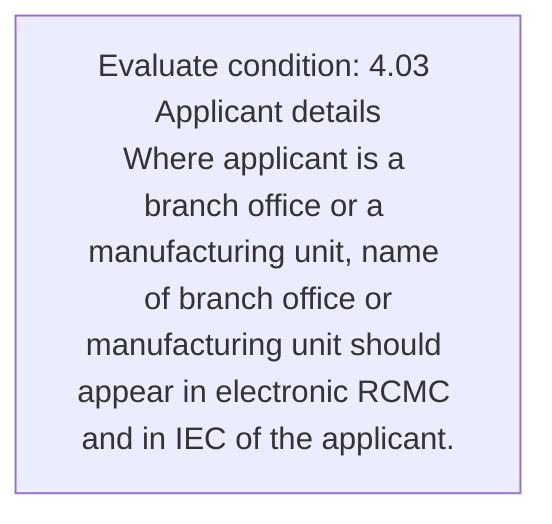
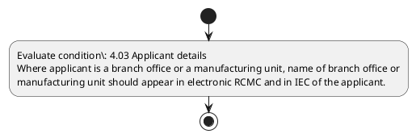

# Chapter 4 / Section 4.03: Applicant details

**Chapter Title:** Duty Exemption / Remission Schemes

**Pages:** 2

**Purpose:** Defines the operational requirements for Applicant details.

**Purpose Thanglish:** Indha Applicant details section-la, Defines the operational requirements for Applicant details.

**Summary:** 4.03 Applicant details
Where applicant is a branch office or a manufacturing unit, name of branch office or
manufacturing unit should appear in electronic RCMC and in IEC of the applicant.

**Business Meaning:** Applicant details governs how DGFT business controls should be applied, validated, and enforced.

**Business Explanation:** Applicant details explains the operating rule set that DEKAI should enforce. Key control points include 4.03 Applicant details
Where applicant is a branch office or a manufacturing unit, name of branch office or
manufacturing unit should appear in electronic RCMC and in IEC of the applicant.

**Business Explanation Thanglish:** Indha Applicant details section-la, Applicant details explains the operating rule set that DEKAI should enforce. Key control points include 4.03 Applicant details
Where applicant is a branch office or a manufacturing unit, name of branch office or
manufacturing unit should appear in electronic RCMC and in IEC of the applicant.

## Business Logic
- 4.03 Applicant details
Where applicant is a branch office or a manufacturing unit, name of branch office or
manufacturing unit should appear in electronic RCMC and in IEC of the applicant.

## Business Rules
- rule_id=CH4-SEC4_03-R001, rule_description=4.03 Applicant details
Where applicant is a branch office or a manufacturing unit, name of branch office or
manufacturing unit should appear in electronic RCMC and in IEC of the applicant., trigger=Applicant details, condition=4.03 Applicant details
Where applicant is a branch office or a manufacturing unit, name of branch office or
manufacturing unit should appear in electronic RCMC and in IEC of the applicant., validation=Not explicitly covered in uploaded documents., action=Manual review required., exception=No explicit exception found in uploaded documents., output=DEKAI should produce a compliance decision for 4.03 - Applicant details.

## Conditions
- 4.03 Applicant details
Where applicant is a branch office or a manufacturing unit, name of branch office or
manufacturing unit should appear in electronic RCMC and in IEC of the applicant.

## Condition Logic
- id=4.4.03.1, if=4.03 Applicant details
Where applicant is a branch office or a manufacturing unit, name of branch office or
manufacturing unit should appear in electronic RCMC and in IEC of the applicant., then=Route for review, source=4.03 Applicant details
Where applicant is a branch office or a manufacturing unit, name of branch office or
manufacturing unit should appear in electronic RCMC and in IEC of the applicant.

## Validations
- None identified

## Exceptions
- None identified

## Dependencies
- None identified

## Authorities
- None identified

## Required Documents
- None identified

## Timelines
- None identified

## Actions
- None identified

## Workflow
- Evaluate condition: 4.03 Applicant details
Where applicant is a branch office or a manufacturing unit, name of branch office or
manufacturing unit should appear in electronic RCMC and in IEC of the applicant.

## Workflow ASCII
```text
Applicant details
Evaluate condition: 4.03 Applicant details
Where applicant is a branch office or a manufacturing unit, name of branch office or
manufacturing unit should appear in electronic RCMC and in IEC of the applicant.
```

## Decision Tree
- IF section 4.03 applies THEN proceed with standard DGFT workflow

## Decision Tree ASCII
```text
Applicant details Decision
IF section 4.03 applies THEN proceed with standard DGFT workflow
```

## Examples
- User asks to process Applicant details; the platform checks conditions, validations, and documents before action.

**Real-world Example:** Example: an importer or exporter invokes Applicant details, submits the prescribed DGFT records, and DEKAI uses the extracted rules to follow the applicant details process.

**Real-world Example Thanglish:** Indha Applicant details section-la, Example: an importer or exporter invokes Applicant details, submits the prescribed DGFT records, and DEKAI uses the extracted rules to follow the applicant details process.

## AI Rules
- IF detected context matches section rule THEN enforce: 4.03 Applicant details
Where applicant is a branch office or a manufacturing unit, name of branch office or
manufacturing unit should appear in electronic RCMC and in IEC of the applicant.

## Database Fields
- name=section_code, type=string, required=True, source=parsed_section_heading
- name=section_title, type=string, required=True, source=parsed_section_heading
- name=and_flag, type=boolean, required=False, source=keyword:and
- name=iec_flag, type=boolean, required=False, source=keyword:IEC
- name=the_flag, type=boolean, required=False, source=keyword:the
- name=unit_flag, type=boolean, required=False, source=keyword:unit
- name=name_flag, type=boolean, required=False, source=keyword:name
- name=rcmc_flag, type=boolean, required=False, source=keyword:RCMC
- name=where_flag, type=boolean, required=False, source=keyword:Where
- name=branch_flag, type=boolean, required=False, source=keyword:branch

## API Requirements
- method=GET, path=/api/dgft/sections/4.03, purpose=Retrieve knowledge payload for section 4.03, query_params=['include=workflow,decision_tree,validations'], response_fields=['section', 'title', 'summary', 'conditions', 'validations', 'exceptions', 'workflow', 'decision_tree']
- method=POST, path=/api/dgft/Applicant-details/validate, purpose=Validate inputs and documents for Applicant details, request_fields=['section_code', 'section_title'], response_fields=['status', 'errors', 'warnings', 'next_actions']

## UI Screens
- screen_id=Applicant_details_overview, name=Applicant details Overview, purpose=Show section summary, authority, timeline, and eligibility cues., widgets=['summary_card', 'conditions_table', 'authority_badges', 'timeline_panel']
- screen_id=Applicant_details_submission, name=Applicant details Submission, purpose=Capture applicant data and supporting documents., widgets=['dynamic_form', 'document_uploader', 'validation_panel', 'next_action_footer'], fields=['section_code', 'section_title', 'and_flag', 'iec_flag', 'the_flag', 'unit_flag', 'name_flag', 'rcmc_flag']

## Error Messages
- Validation failed because the section requirements were not fully met.

## FAQ
- question_en=What is the purpose of section 4.03?, answer_en=Applicant details explains the operating rule set that DEKAI should enforce. Key control points include 4.03 Applicant details
Where applicant is a branch office or a manufacturing unit, name of branch office or
manufacturing unit should appear in electronic RCMC and in IEC of the applicant., question_thanglish=Indha Applicant details section-la, What is the purpose of section 4.03?, answer_thanglish=Indha Applicant details section-la, Applicant details explains the operating rule set that DEKAI should enforce. Key control points include 4.03 Applicant details
Where applicant is a branch office or a manufacturing unit, name of branch office or
manufacturing unit should appear in electronic RCMC and in IEC of the applicant.
- question_en=What documents are required under Applicant details?, answer_en=Not explicitly covered in uploaded documents., question_thanglish=Indha Applicant details section-la, What documents are required under Applicant details?, answer_thanglish=Indha Applicant details section-la, Not explicitly covered in uploaded documents.
- question_en=Which authority handles Applicant details?, answer_en=Not explicitly covered in uploaded documents., question_thanglish=Indha Applicant details section-la, Which authority handles Applicant details?, answer_thanglish=Indha Applicant details section-la, Not explicitly covered in uploaded documents.

## Questions Users May Ask
- What does Applicant details require?
- Which documents are needed for Applicant details?
- How does DEKAI validate Applicant details requests?

## Expected AI Answers
- Applicant details requires the platform to interpret the section text, apply the extracted business rules, and present the correct next action.
- Required documents are inferred from the section text: no explicit documents were detected.
- DEKAI validates Applicant details by checking conditions, required documents, authority references, and exception clauses before recommending an outcome.

## AI Q&A Examples
- question_en=User asks: How do I comply with Applicant details?, answer_en=AI answers: DEKAI should evaluate section 4.03, apply the extracted rules, and guide the user through Evaluate condition: 4.03 Applicant details
Where applicant is a branch office or a manufacturing unit, name of branch office or
manufacturing unit should appear in electronic RCMC and in IEC of the applicant.., question_thanglish=Indha Applicant details section-la, User asks: How do I comply with Applicant details?, answer_thanglish=Indha Applicant details section-la, AI answers: DEKAI should evaluate section 4.03, apply the extracted rules, and guide the user through Evaluate condition: 4.03 Applicant details
Where applicant is a branch office or a manufacturing unit, name of branch office or
manufacturing unit should appear in electronic RCMC and in IEC of the applicant..
- question_en=User asks: Which validations apply to Applicant details?, answer_en=AI answers: Applicable validations are not explicitly covered in the uploaded documents., question_thanglish=Indha Applicant details section-la, User asks: Which validations apply to Applicant details?, answer_thanglish=Indha Applicant details section-la, AI answers: Applicable validations are not explicitly covered in the uploaded documents.

## DEKAI AI Implementation Notes
- Capture chapter 4, section 4.03, title, and page references as immutable knowledge metadata.
- Bind validations for Applicant details into a rule engine keyed by the rule IDs extracted for this section.

## DEKAI AI Implementation Notes Thanglish
- Indha Applicant details section-la, Capture chapter 4, section 4.03, title, and page references as immutable knowledge metadata.
- Indha Applicant details section-la, Bind validations for Applicant details into a rule engine keyed by the rule IDs extracted for this section.

## AI Metadata
- Keywords: and, IEC, the, unit, name, RCMC, Where, branch, office, should, appear, details, Applicant, electronic, manufacturing
- Search Keywords: and, IEC, the, unit, name, RCMC, Where, branch, office, should, appear, details, Applicant, electronic, manufacturing
- Intent: Provide knowledge guidance for Applicant details.
- Tags: 4.03, Applicant details, business-rule, dgft
- Related Sections: 
- Related Chapters: 
- Related Rules: 4.03 Applicant details
Where applicant is a branch office or a manufacturing unit, name of branch office or
manufacturing unit should appear in electronic RCMC and in IEC of the applicant.

## Mermaid


## PlantUML

