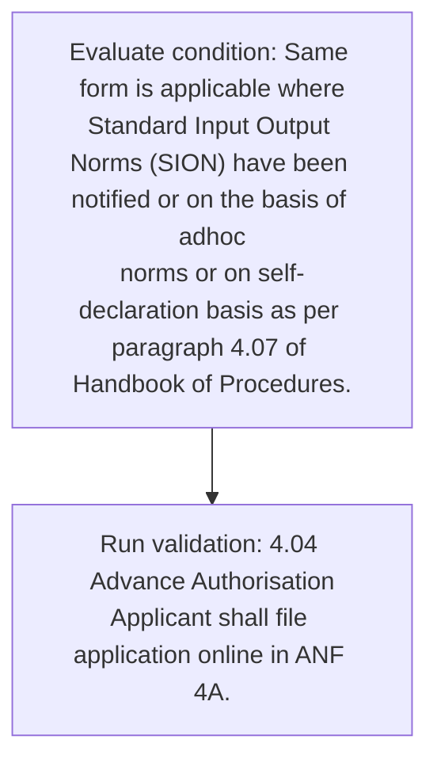
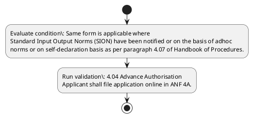

# Chapter 4 / Section 4.04: Advance Authorisation

**Chapter Title:** Duty Exemption / Remission Schemes

**Pages:** 2

**Purpose:** 4.04 Advance Authorisation
Applicant shall file application online in ANF 4A.

**Purpose Thanglish:** Indha Advance Authorisation section-la, 4.04 Advance Authorisation
Applicant kandippa file application online in ANF 4A.

**Summary:** 4.04 Advance Authorisation
Applicant shall file application online in ANF 4A. Same form is applicable where
Standard Input Output Norms (SION) have been notified or on the basis of adhoc
norms or on self-declaration basis as per paragraph 4.07 of Handbook of Procedures.

**Business Meaning:** Advance Authorisation governs how DGFT business controls should be applied, validated, and enforced.

**Business Explanation:** Advance Authorisation explains the operating rule set that DEKAI should enforce. Key control points include 4.04 Advance Authorisation
Applicant shall file application online in ANF 4A.

**Business Explanation Thanglish:** Indha Advance Authorisation section-la, Advance Authorisation explains the operating rule set that DEKAI should enforce. Key control points include 4.04 Advance Authorisation
Applicant kandippa file application online in ANF 4A.

## Business Logic
- 4.04 Advance Authorisation
Applicant shall file application online in ANF 4A.

## Business Rules
- rule_id=CH4-SEC4_04-R001, rule_description=4.04 Advance Authorisation
Applicant shall file application online in ANF 4A., trigger=Advance Authorisation, condition=Same form is applicable where
Standard Input Output Norms (SION) have been notified or on the basis of adhoc
norms or on self-declaration basis as per paragraph 4.07 of Handbook of Procedures., validation=4.04 Advance Authorisation
Applicant shall file application online in ANF 4A., action=Manual review required., exception=No explicit exception found in uploaded documents., output=DEKAI should produce a compliance decision for 4.04 - Advance Authorisation.

## Conditions
- Same form is applicable where
Standard Input Output Norms (SION) have been notified or on the basis of adhoc
norms or on self-declaration basis as per paragraph 4.07 of Handbook of Procedures.

## Condition Logic
- id=4.4.04.1, if=Same form is applicable where
Standard Input Output Norms (SION) have been notified or on the basis of adhoc
norms or on self-declaration basis as per paragraph 4.07 of Handbook of Procedures., then=Route for review, source=Same form is applicable where
Standard Input Output Norms (SION) have been notified or on the basis of adhoc
norms or on self-declaration basis as per paragraph 4.07 of Handbook of Procedures.

## Validations
- 4.04 Advance Authorisation
Applicant shall file application online in ANF 4A.

## Exceptions
- None identified

## Dependencies
- 4.07
- 4

## Authorities
- None identified

## Required Documents
- 4.04 Advance Authorisation
Applicant shall file application online in ANF 4A.
- Same form is applicable where
Standard Input Output Norms (SION) have been notified or on the basis of adhoc
norms or on self-declaration basis as per paragraph 4.07 of Handbook of Procedures.

## Timelines
- None identified

## Actions
- None identified

## Workflow
- Evaluate condition: Same form is applicable where
Standard Input Output Norms (SION) have been notified or on the basis of adhoc
norms or on self-declaration basis as per paragraph 4.07 of Handbook of Procedures.
- Run validation: 4.04 Advance Authorisation
Applicant shall file application online in ANF 4A.

## Workflow ASCII
```text
Advance Authorisation
Evaluate condition: Same form is applicable where
Standard Input Output Norms (SION) have been notified or on the basis of adhoc
norms or on self-declaration basis as per paragraph 4.07 of Handbook of Procedures.
   |
   v
Run validation: 4.04 Advance Authorisation
Applicant shall file application online in ANF 4A.
```

## Decision Tree
- IF section 4.04 applies THEN proceed with standard DGFT workflow

## Decision Tree ASCII
```text
Advance Authorisation Decision
IF section 4.04 applies THEN proceed with standard DGFT workflow
```

## Examples
- User asks to process Advance Authorisation; the platform checks conditions, validations, and documents before action.

**Real-world Example:** Example: an importer or exporter invokes Advance Authorisation, submits 4.04 Advance Authorisation
Applicant shall file application online in ANF 4A., Same form is applicable where
Standard Input Output Norms (SION) have been notified or on the basis of adhoc
norms or on self-declaration basis as per paragraph 4.07 of Handbook of Procedures., and DEKAI uses the extracted rules to follow the advance authorisation process.

**Real-world Example Thanglish:** Indha Advance Authorisation section-la, Example: an importer or exporter invokes Advance Authorisation, submits 4.04 Advance Authorisation
Applicant kandippa file application online in ANF 4A., Same form is applicable where
Standard Input Output Norms (SION) have been notified or on the basis of adhoc
norms or on self-declaration basis as per paragraph 4.07 of Handbook of Procedures., and DEKAI uses the extracted rules to follow the advance authorisation process.

## AI Rules
- IF detected context matches section rule THEN enforce: 4.04 Advance Authorisation
Applicant shall file application online in ANF 4A.

## Database Fields
- name=section_code, type=string, required=True, source=parsed_section_heading
- name=section_title, type=string, required=True, source=parsed_section_heading
- name=anf_flag, type=boolean, required=False, source=keyword:ANF
- name=the_flag, type=boolean, required=False, source=keyword:the
- name=per_flag, type=boolean, required=False, source=keyword:per
- name=file_flag, type=boolean, required=False, source=keyword:file
- name=same_flag, type=boolean, required=False, source=keyword:Same
- name=form_flag, type=boolean, required=False, source=keyword:form
- name=sion_flag, type=boolean, required=False, source=keyword:SION
- name=have_flag, type=boolean, required=False, source=keyword:have
- name=document_1_submitted, type=boolean, required=True, source=4.04 Advance Authorisation
Applicant shall file application online in ANF 4A.
- name=document_2_submitted, type=boolean, required=True, source=Same form is applicable where
Standard Input Output Norms (SION) have been notified or on the basis of adhoc
norms or on self-declaration basis as per paragraph 4.07 of Handbook of Procedures.

## API Requirements
- method=GET, path=/api/dgft/sections/4.04, purpose=Retrieve knowledge payload for section 4.04, query_params=['include=workflow,decision_tree,validations'], response_fields=['section', 'title', 'summary', 'conditions', 'validations', 'exceptions', 'workflow', 'decision_tree']
- method=POST, path=/api/dgft/Advance-Authorisation/validate, purpose=Validate inputs and documents for Advance Authorisation, request_fields=['section_code', 'section_title', 'document_1_submitted', 'document_2_submitted'], response_fields=['status', 'errors', 'warnings', 'next_actions']

## UI Screens
- screen_id=Advance_Authorisation_overview, name=Advance Authorisation Overview, purpose=Show section summary, authority, timeline, and eligibility cues., widgets=['summary_card', 'conditions_table', 'authority_badges', 'timeline_panel']
- screen_id=Advance_Authorisation_submission, name=Advance Authorisation Submission, purpose=Capture applicant data and supporting documents., widgets=['dynamic_form', 'document_uploader', 'validation_panel', 'next_action_footer'], fields=['section_code', 'section_title', 'anf_flag', 'the_flag', 'per_flag', 'file_flag', 'same_flag', 'form_flag']

## Error Messages
- Validation failed because the section requirements were not fully met.

## FAQ
- question_en=What is the purpose of section 4.04?, answer_en=Advance Authorisation explains the operating rule set that DEKAI should enforce. Key control points include 4.04 Advance Authorisation
Applicant shall file application online in ANF 4A., question_thanglish=Indha Advance Authorisation section-la, What is the purpose of section 4.04?, answer_thanglish=Indha Advance Authorisation section-la, Advance Authorisation explains the operating rule set that DEKAI should enforce. Key control points include 4.04 Advance Authorisation
Applicant kandippa file application online in ANF 4A.
- question_en=What documents are required under Advance Authorisation?, answer_en=4.04 Advance Authorisation
Applicant shall file application online in ANF 4A., Same form is applicable where
Standard Input Output Norms (SION) have been notified or on the basis of adhoc
norms or on self-declaration basis as per paragraph 4.07 of Handbook of Procedures., question_thanglish=Indha Advance Authorisation section-la, What documents are required under Advance Authorisation?, answer_thanglish=Indha Advance Authorisation section-la, 4.04 Advance Authorisation
Applicant kandippa file application online in ANF 4A., Same form is applicable where
Standard Input Output Norms (SION) have been notified or on the basis of adhoc
norms or on self-declaration basis as per paragraph 4.07 of Handbook of Procedures.
- question_en=Which authority handles Advance Authorisation?, answer_en=Not explicitly covered in uploaded documents., question_thanglish=Indha Advance Authorisation section-la, Which authority handles Advance Authorisation?, answer_thanglish=Indha Advance Authorisation section-la, Not explicitly covered in uploaded documents.

## Questions Users May Ask
- What does Advance Authorisation require?
- Which documents are needed for Advance Authorisation?
- How does DEKAI validate Advance Authorisation requests?

## Expected AI Answers
- Advance Authorisation requires the platform to interpret the section text, apply the extracted business rules, and present the correct next action.
- Required documents are inferred from the section text: 4.04 Advance Authorisation
Applicant shall file application online in ANF 4A., Same form is applicable where
Standard Input Output Norms (SION) have been notified or on the basis of adhoc
norms or on self-declaration basis as per paragraph 4.07 of Handbook of Procedures.
- DEKAI validates Advance Authorisation by checking conditions, required documents, authority references, and exception clauses before recommending an outcome.

## AI Q&A Examples
- question_en=User asks: How do I comply with Advance Authorisation?, answer_en=AI answers: DEKAI should evaluate section 4.04, apply the extracted rules, and guide the user through Evaluate condition: Same form is applicable where
Standard Input Output Norms (SION) have been notified or on the basis of adhoc
norms or on self-declaration basis as per paragraph 4.07 of Handbook of Procedures.., question_thanglish=Indha Advance Authorisation section-la, User asks: How do I comply with Advance Authorisation?, answer_thanglish=Indha Advance Authorisation section-la, AI answers: DEKAI should evaluate section 4.04, apply the extracted rules, and guide the user through Evaluate condition: Same form is applicable where
Standard Input Output Norms (SION) have been notified or on the basis of adhoc
norms or on self-declaration basis as per paragraph 4.07 of Handbook of Procedures..
- question_en=User asks: Which validations apply to Advance Authorisation?, answer_en=AI answers: Applicable validations are 4.04 Advance Authorisation
Applicant shall file application online in ANF 4A., question_thanglish=Indha Advance Authorisation section-la, User asks: Which validations apply to Advance Authorisation?, answer_thanglish=Indha Advance Authorisation section-la, AI answers: Applicable validations are 4.04 Advance Authorisation
Applicant kandippa file application online in ANF 4A.

## DEKAI AI Implementation Notes
- Capture chapter 4, section 4.04, title, and page references as immutable knowledge metadata.
- Bind validations for Advance Authorisation into a rule engine keyed by the rule IDs extracted for this section.
- Expose document upload controls for: 4.04 Advance Authorisation
Applicant shall file application online in ANF 4A., Same form is applicable where
Standard Input Output Norms (SION) have been notified or on the basis of adhoc
norms or on self-declaration basis as per paragraph 4.07 of Handbook of Procedures..
- Show contextual links to related sections: 4.07, 4.

## DEKAI AI Implementation Notes Thanglish
- Indha Advance Authorisation section-la, Capture chapter 4, section 4.04, title, and page references as immutable knowledge metadata.
- Indha Advance Authorisation section-la, Bind validations for Advance Authorisation into a rule engine keyed by the rule IDs extracted for this section.
- Indha Advance Authorisation section-la, Expose document upload controls for: 4.04 Advance Authorisation
Applicant kandippa file application online in ANF 4A., Same form is applicable where
Standard Input Output Norms (SION) have been notified or on the basis of adhoc
norms or on self-declaration basis as per paragraph 4.07 of Handbook of Procedures..
- Indha Advance Authorisation section-la, Show contextual links to related sections: 4.07, 4.

## AI Metadata
- Keywords: ANF, the, per, file, Same, form, SION, have, been, shall, where, Input, Norms, basis, adhoc, online, Output, Advance, Standard, notified
- Search Keywords: ANF, the, per, file, Same, form, SION, have, been, shall, where, Input, Norms, basis, adhoc, online, Output, Advance, Standard, notified
- Intent: Provide knowledge guidance for Advance Authorisation.
- Tags: 4.04, Advance Authorisation, business-rule, document-driven, dgft
- Related Sections: 4.07, 4
- Related Chapters: 
- Related Rules: 4.04 Advance Authorisation
Applicant shall file application online in ANF 4A.

## Mermaid


## PlantUML

