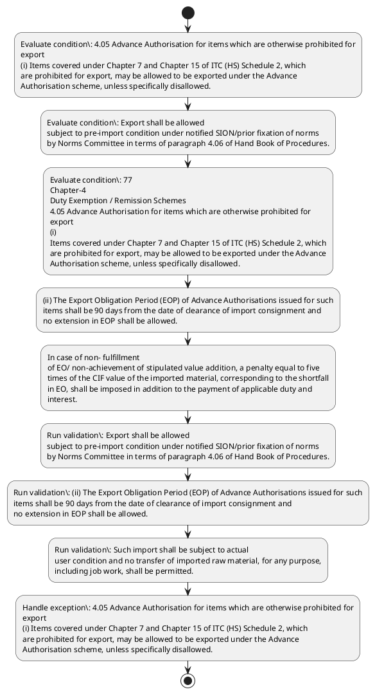

# Chapter 4 / Section 4.05: Advance Authorisation for items which are otherwise prohibited for

**Chapter Title:** Duty Exemption / Remission Schemes

**Pages:** 2, 3

**Purpose:** 4.05 Advance Authorisation for items which are otherwise prohibited for
export
(i) Items covered under Chapter 7 and Chapter 15 of ITC (HS) Schedule 2, which
are prohibited for export, may be allowed to be exported under the Advance
Authorisation scheme, unless specifically disallowed.

**Purpose Thanglish:** Indha Advance Authorisation for items which are otherwise prohibited for section-la, 4.05 Advance Authorisation for items which are otherwise prohibited for
export
(i) Items covered under Chapter 7 and Chapter 15 of ITC (HS) Schedule 2, which
are prohibited for export, may be allowed to be exported under the Advance
Authorisation scheme, unless specifically disallowed.

**Summary:** 4.05 Advance Authorisation for items which are otherwise prohibited for
export
(i) Items covered under Chapter 7 and Chapter 15 of ITC (HS) Schedule 2, which
are prohibited for export, may be allowed to be exported under the Advance
Authorisation scheme, unless specifically disallowed. Export shall be allowed
subject to pre-import condition under notified SION/prior fixation of norms
by Norms Committee in terms of paragraph 4.06 of Hand Book of Procedures. pg.

**Business Meaning:** Advance Authorisation for items which are otherwise prohibited for governs how DGFT business controls should be applied, validated, and enforced.

**Business Explanation:** Advance Authorisation for items which are otherwise prohibited for explains the operating rule set that DEKAI should enforce. Key control points include Export shall be allowed
subject to pre-import condition under notified SION/prior fixation of norms
by Norms Committee in terms of paragraph 4.06 of Hand Book of Procedures. The section also drives actions such as (ii) The Export Obligation Period (EOP) of Advance Authorisations issued for such
items shall be 90 days from the date of clearance of import consignment and
no extension in EOP shall be allowed..

**Business Explanation Thanglish:** Indha Advance Authorisation for items which are otherwise prohibited for section-la, Advance Authorisation for items which are otherwise prohibited for explains the operating rule set that DEKAI should enforce. Key control points include export kandippa be allowed
subject to pre-import condition under notified SION/prior fixation of norms
by Norms Committee in terms of paragraph 4.06 of Hand Book of Procedures. The section also drives actions such as (ii) The export Obligation Period (EOP) of Advance Authorisations issued for such
items kandippa be 90 days from the date of clearance of import consignment and
no extension in EOP kandippa be allowed..

## Business Logic
- Export shall be allowed
subject to pre-import condition under notified SION/prior fixation of norms
by Norms Committee in terms of paragraph 4.06 of Hand Book of Procedures.
- (ii) The Export Obligation Period (EOP) of Advance Authorisations issued for such
items shall be 90 days from the date of clearance of import consignment and
no extension in EOP shall be allowed.
- Such import shall be subject to actual
user condition and no transfer of imported raw material, for any purpose,
including job work, shall be permitted.
- In case of non-fulfilment of EO/ non-
achievement of stipulated value addition, a penalty equal to five times of the
CIF value of the imported material, corresponding to the shortfall in EO, shall
be imposed in addition to the applicable duty and interest.
- Provisions of
Paragraph 4.49 of Handbook of Procedures shall not be applicable in this
case.
- (iii) “Wheat Flour (Atta)” is permitted to be exported under the Advance
Authorisation Scheme, subject to pre-import condition of wheat under the
notified SION only.
- The Export Obligation Period (EOP) of Advance
Authorisation for wheat shall be 180 days from the date of clearance of each
import consignment and no extension in EOP shall be allowed.
- Such import
shall be subject to actual user condition and no transfer of imported wheat for
any purpose, including job work, shall be permitted.
- In case of non- fulfillment
of EO/ non-achievement of stipulated value addition, a penalty equal to five
times of the CIF value of the imported material, corresponding to the shortfall
in EO, shall be imposed in addition to the payment of applicable duty and
interest.
- Provisions of Paragraph 4.49 of Handbook of Procedures shall not be
applicable in this case.

## Business Rules
- rule_id=CH4-SEC4_05-R001, rule_description=Export shall be allowed
subject to pre-import condition under notified SION/prior fixation of norms
by Norms Committee in terms of paragraph 4.06 of Hand Book of Procedures., trigger=Advance Authorisation for items which are otherwise prohibited for, condition=4.05 Advance Authorisation for items which are otherwise prohibited for
export
(i) Items covered under Chapter 7 and Chapter 15 of ITC (HS) Schedule 2, which
are prohibited for export, may be allowed to be exported under the Advance
Authorisation scheme, unless specifically disallowed., validation=Export shall be allowed
subject to pre-import condition under notified SION/prior fixation of norms
by Norms Committee in terms of paragraph 4.06 of Hand Book of Procedures., action=(ii) The Export Obligation Period (EOP) of Advance Authorisations issued for such
items shall be 90 days from the date of clearance of import consignment and
no extension in EOP shall be allowed., exception=4.05 Advance Authorisation for items which are otherwise prohibited for
export
(i) Items covered under Chapter 7 and Chapter 15 of ITC (HS) Schedule 2, which
are prohibited for export, may be allowed to be exported under the Advance
Authorisation scheme, unless specifically disallowed., output=DEKAI should produce a compliance decision for 4.05 - Advance Authorisation for items which are otherwise prohibited for.
- rule_id=CH4-SEC4_05-R002, rule_description=(ii) The Export Obligation Period (EOP) of Advance Authorisations issued for such
items shall be 90 days from the date of clearance of import consignment and
no extension in EOP shall be allowed., trigger=Advance Authorisation for items which are otherwise prohibited for, condition=Export shall be allowed
subject to pre-import condition under notified SION/prior fixation of norms
by Norms Committee in terms of paragraph 4.06 of Hand Book of Procedures., validation=(ii) The Export Obligation Period (EOP) of Advance Authorisations issued for such
items shall be 90 days from the date of clearance of import consignment and
no extension in EOP shall be allowed., action=In case of non- fulfillment
of EO/ non-achievement of stipulated value addition, a penalty equal to five
times of the CIF value of the imported material, corresponding to the shortfall
in EO, shall be imposed in addition to the payment of applicable duty and
interest., exception=77
Chapter-4
Duty Exemption / Remission Schemes
4.05 Advance Authorisation for items which are otherwise prohibited for
export
(i)
Items covered under Chapter 7 and Chapter 15 of ITC (HS) Schedule 2, which
are prohibited for export, may be allowed to be exported under the Advance
Authorisation scheme, unless specifically disallowed., output=DEKAI should produce a compliance decision for 4.05 - Advance Authorisation for items which are otherwise prohibited for.
- rule_id=CH4-SEC4_05-R003, rule_description=Such import shall be subject to actual
user condition and no transfer of imported raw material, for any purpose,
including job work, shall be permitted., trigger=Advance Authorisation for items which are otherwise prohibited for, condition=77
Chapter-4
Duty Exemption / Remission Schemes
4.05 Advance Authorisation for items which are otherwise prohibited for
export
(i)
Items covered under Chapter 7 and Chapter 15 of ITC (HS) Schedule 2, which
are prohibited for export, may be allowed to be exported under the Advance
Authorisation scheme, unless specifically disallowed., validation=Such import shall be subject to actual
user condition and no transfer of imported raw material, for any purpose,
including job work, shall be permitted., action=In case of non- fulfillment
of EO/ non-achievement of stipulated value addition, a penalty equal to five
times of the CIF value of the imported material, corresponding to the shortfall
in EO, shall be imposed in addition to the payment of applicable duty and
interest., exception=77
Chapter-4
Duty Exemption / Remission Schemes
4.05 Advance Authorisation for items which are otherwise prohibited for
export
(i)
Items covered under Chapter 7 and Chapter 15 of ITC (HS) Schedule 2, which
are prohibited for export, may be allowed to be exported under the Advance
Authorisation scheme, unless specifically disallowed., output=DEKAI should produce a compliance decision for 4.05 - Advance Authorisation for items which are otherwise prohibited for.
- rule_id=CH4-SEC4_05-R004, rule_description=In case of non-fulfilment of EO/ non-
achievement of stipulated value addition, a penalty equal to five times of the
CIF value of the imported material, corresponding to the shortfall in EO, shall
be imposed in addition to the applicable duty and interest., trigger=Advance Authorisation for items which are otherwise prohibited for, condition=Such import shall be subject to actual
user condition and no transfer of imported raw material, for any purpose,
including job work, shall be permitted., validation=In case of non-fulfilment of EO/ non-
achievement of stipulated value addition, a penalty equal to five times of the
CIF value of the imported material, corresponding to the shortfall in EO, shall
be imposed in addition to the applicable duty and interest., action=In case of non- fulfillment
of EO/ non-achievement of stipulated value addition, a penalty equal to five
times of the CIF value of the imported material, corresponding to the shortfall
in EO, shall be imposed in addition to the payment of applicable duty and
interest., exception=77
Chapter-4
Duty Exemption / Remission Schemes
4.05 Advance Authorisation for items which are otherwise prohibited for
export
(i)
Items covered under Chapter 7 and Chapter 15 of ITC (HS) Schedule 2, which
are prohibited for export, may be allowed to be exported under the Advance
Authorisation scheme, unless specifically disallowed., output=DEKAI should produce a compliance decision for 4.05 - Advance Authorisation for items which are otherwise prohibited for.
- rule_id=CH4-SEC4_05-R005, rule_description=Provisions of
Paragraph 4.49 of Handbook of Procedures shall not be applicable in this
case., trigger=Advance Authorisation for items which are otherwise prohibited for, condition=In case of non-fulfilment of EO/ non-
achievement of stipulated value addition, a penalty equal to five times of the
CIF value of the imported material, corresponding to the shortfall in EO, shall
be imposed in addition to the applicable duty and interest., validation=Provisions of
Paragraph 4.49 of Handbook of Procedures shall not be applicable in this
case., action=In case of non- fulfillment
of EO/ non-achievement of stipulated value addition, a penalty equal to five
times of the CIF value of the imported material, corresponding to the shortfall
in EO, shall be imposed in addition to the payment of applicable duty and
interest., exception=77
Chapter-4
Duty Exemption / Remission Schemes
4.05 Advance Authorisation for items which are otherwise prohibited for
export
(i)
Items covered under Chapter 7 and Chapter 15 of ITC (HS) Schedule 2, which
are prohibited for export, may be allowed to be exported under the Advance
Authorisation scheme, unless specifically disallowed., output=DEKAI should produce a compliance decision for 4.05 - Advance Authorisation for items which are otherwise prohibited for.
- rule_id=CH4-SEC4_05-R006, rule_description=(iii) “Wheat Flour (Atta)” is permitted to be exported under the Advance
Authorisation Scheme, subject to pre-import condition of wheat under the
notified SION only., trigger=Advance Authorisation for items which are otherwise prohibited for, condition=(iii) “Wheat Flour (Atta)” is permitted to be exported under the Advance
Authorisation Scheme, subject to pre-import condition of wheat under the
notified SION only., validation=The Export Obligation Period (EOP) of Advance
Authorisation for wheat shall be 180 days from the date of clearance of each
import consignment and no extension in EOP shall be allowed., action=In case of non- fulfillment
of EO/ non-achievement of stipulated value addition, a penalty equal to five
times of the CIF value of the imported material, corresponding to the shortfall
in EO, shall be imposed in addition to the payment of applicable duty and
interest., exception=77
Chapter-4
Duty Exemption / Remission Schemes
4.05 Advance Authorisation for items which are otherwise prohibited for
export
(i)
Items covered under Chapter 7 and Chapter 15 of ITC (HS) Schedule 2, which
are prohibited for export, may be allowed to be exported under the Advance
Authorisation scheme, unless specifically disallowed., output=DEKAI should produce a compliance decision for 4.05 - Advance Authorisation for items which are otherwise prohibited for.
- rule_id=CH4-SEC4_05-R007, rule_description=The Export Obligation Period (EOP) of Advance
Authorisation for wheat shall be 180 days from the date of clearance of each
import consignment and no extension in EOP shall be allowed., trigger=Advance Authorisation for items which are otherwise prohibited for, condition=Such import
shall be subject to actual user condition and no transfer of imported wheat for
any purpose, including job work, shall be permitted., validation=Such import
shall be subject to actual user condition and no transfer of imported wheat for
any purpose, including job work, shall be permitted., action=In case of non- fulfillment
of EO/ non-achievement of stipulated value addition, a penalty equal to five
times of the CIF value of the imported material, corresponding to the shortfall
in EO, shall be imposed in addition to the payment of applicable duty and
interest., exception=77
Chapter-4
Duty Exemption / Remission Schemes
4.05 Advance Authorisation for items which are otherwise prohibited for
export
(i)
Items covered under Chapter 7 and Chapter 15 of ITC (HS) Schedule 2, which
are prohibited for export, may be allowed to be exported under the Advance
Authorisation scheme, unless specifically disallowed., output=DEKAI should produce a compliance decision for 4.05 - Advance Authorisation for items which are otherwise prohibited for.
- rule_id=CH4-SEC4_05-R008, rule_description=Such import
shall be subject to actual user condition and no transfer of imported wheat for
any purpose, including job work, shall be permitted., trigger=Advance Authorisation for items which are otherwise prohibited for, condition=In case of non- fulfillment
of EO/ non-achievement of stipulated value addition, a penalty equal to five
times of the CIF value of the imported material, corresponding to the shortfall
in EO, shall be imposed in addition to the payment of applicable duty and
interest., validation=In case of non- fulfillment
of EO/ non-achievement of stipulated value addition, a penalty equal to five
times of the CIF value of the imported material, corresponding to the shortfall
in EO, shall be imposed in addition to the payment of applicable duty and
interest., action=In case of non- fulfillment
of EO/ non-achievement of stipulated value addition, a penalty equal to five
times of the CIF value of the imported material, corresponding to the shortfall
in EO, shall be imposed in addition to the payment of applicable duty and
interest., exception=77
Chapter-4
Duty Exemption / Remission Schemes
4.05 Advance Authorisation for items which are otherwise prohibited for
export
(i)
Items covered under Chapter 7 and Chapter 15 of ITC (HS) Schedule 2, which
are prohibited for export, may be allowed to be exported under the Advance
Authorisation scheme, unless specifically disallowed., output=DEKAI should produce a compliance decision for 4.05 - Advance Authorisation for items which are otherwise prohibited for.
- rule_id=CH4-SEC4_05-R009, rule_description=In case of non- fulfillment
of EO/ non-achievement of stipulated value addition, a penalty equal to five
times of the CIF value of the imported material, corresponding to the shortfall
in EO, shall be imposed in addition to the payment of applicable duty and
interest., trigger=Advance Authorisation for items which are otherwise prohibited for, condition=In case of non- fulfillment
of EO/ non-achievement of stipulated value addition, a penalty equal to five
times of the CIF value of the imported material, corresponding to the shortfall
in EO, shall be imposed in addition to the payment of applicable duty and
interest., validation=Provisions of Paragraph 4.49 of Handbook of Procedures shall not be
applicable in this case., action=In case of non- fulfillment
of EO/ non-achievement of stipulated value addition, a penalty equal to five
times of the CIF value of the imported material, corresponding to the shortfall
in EO, shall be imposed in addition to the payment of applicable duty and
interest., exception=77
Chapter-4
Duty Exemption / Remission Schemes
4.05 Advance Authorisation for items which are otherwise prohibited for
export
(i)
Items covered under Chapter 7 and Chapter 15 of ITC (HS) Schedule 2, which
are prohibited for export, may be allowed to be exported under the Advance
Authorisation scheme, unless specifically disallowed., output=DEKAI should produce a compliance decision for 4.05 - Advance Authorisation for items which are otherwise prohibited for.
- rule_id=CH4-SEC4_05-R010, rule_description=Provisions of Paragraph 4.49 of Handbook of Procedures shall not be
applicable in this case., trigger=Advance Authorisation for items which are otherwise prohibited for, condition=In case of non- fulfillment
of EO/ non-achievement of stipulated value addition, a penalty equal to five
times of the CIF value of the imported material, corresponding to the shortfall
in EO, shall be imposed in addition to the payment of applicable duty and
interest., validation=Provisions of Paragraph 4.49 of Handbook of Procedures shall not be
applicable in this case., action=In case of non- fulfillment
of EO/ non-achievement of stipulated value addition, a penalty equal to five
times of the CIF value of the imported material, corresponding to the shortfall
in EO, shall be imposed in addition to the payment of applicable duty and
interest., exception=77
Chapter-4
Duty Exemption / Remission Schemes
4.05 Advance Authorisation for items which are otherwise prohibited for
export
(i)
Items covered under Chapter 7 and Chapter 15 of ITC (HS) Schedule 2, which
are prohibited for export, may be allowed to be exported under the Advance
Authorisation scheme, unless specifically disallowed., output=DEKAI should produce a compliance decision for 4.05 - Advance Authorisation for items which are otherwise prohibited for.

## Conditions
- 4.05 Advance Authorisation for items which are otherwise prohibited for
export
(i) Items covered under Chapter 7 and Chapter 15 of ITC (HS) Schedule 2, which
are prohibited for export, may be allowed to be exported under the Advance
Authorisation scheme, unless specifically disallowed.
- Export shall be allowed
subject to pre-import condition under notified SION/prior fixation of norms
by Norms Committee in terms of paragraph 4.06 of Hand Book of Procedures.
- 77
Chapter-4
Duty Exemption / Remission Schemes
4.05 Advance Authorisation for items which are otherwise prohibited for
export
(i)
Items covered under Chapter 7 and Chapter 15 of ITC (HS) Schedule 2, which
are prohibited for export, may be allowed to be exported under the Advance
Authorisation scheme, unless specifically disallowed.
- Such import shall be subject to actual
user condition and no transfer of imported raw material, for any purpose,
including job work, shall be permitted.
- In case of non-fulfilment of EO/ non-
achievement of stipulated value addition, a penalty equal to five times of the
CIF value of the imported material, corresponding to the shortfall in EO, shall
be imposed in addition to the applicable duty and interest.
- (iii) “Wheat Flour (Atta)” is permitted to be exported under the Advance
Authorisation Scheme, subject to pre-import condition of wheat under the
notified SION only.
- Such import
shall be subject to actual user condition and no transfer of imported wheat for
any purpose, including job work, shall be permitted.
- In case of non- fulfillment
of EO/ non-achievement of stipulated value addition, a penalty equal to five
times of the CIF value of the imported material, corresponding to the shortfall
in EO, shall be imposed in addition to the payment of applicable duty and
interest.

## Condition Logic
- id=4.4.05.1, if=4.05 Advance Authorisation for items which are otherwise prohibited for
export
(i) Items covered under Chapter 7 and Chapter 15 of ITC (HS) Schedule 2, which
are prohibited for export, may be allowed to be exported under the Advance
Authorisation scheme, unless specifically disallowed., then=(ii) The Export Obligation Period (EOP) of Advance Authorisations issued for such
items shall be 90 days from the date of clearance of import consignment and
no extension in EOP shall be allowed., source=4.05 Advance Authorisation for items which are otherwise prohibited for
export
(i) Items covered under Chapter 7 and Chapter 15 of ITC (HS) Schedule 2, which
are prohibited for export, may be allowed to be exported under the Advance
Authorisation scheme, unless specifically disallowed.
- id=4.4.05.2, if=Export shall be allowed
subject to pre-import condition under notified SION/prior fixation of norms
by Norms Committee in terms of paragraph 4.06 of Hand Book of Procedures., then=(ii) The Export Obligation Period (EOP) of Advance Authorisations issued for such
items shall be 90 days from the date of clearance of import consignment and
no extension in EOP shall be allowed., source=Export shall be allowed
subject to pre-import condition under notified SION/prior fixation of norms
by Norms Committee in terms of paragraph 4.06 of Hand Book of Procedures.
- id=4.4.05.3, if=77
Chapter-4
Duty Exemption / Remission Schemes
4.05 Advance Authorisation for items which are otherwise prohibited for
export
(i)
Items covered under Chapter 7 and Chapter 15 of ITC (HS) Schedule 2, which
are prohibited for export, may be allowed to be exported under the Advance
Authorisation scheme, unless specifically disallowed., then=(ii) The Export Obligation Period (EOP) of Advance Authorisations issued for such
items shall be 90 days from the date of clearance of import consignment and
no extension in EOP shall be allowed., source=77
Chapter-4
Duty Exemption / Remission Schemes
4.05 Advance Authorisation for items which are otherwise prohibited for
export
(i)
Items covered under Chapter 7 and Chapter 15 of ITC (HS) Schedule 2, which
are prohibited for export, may be allowed to be exported under the Advance
Authorisation scheme, unless specifically disallowed.
- id=4.4.05.4, if=Such import shall be subject to actual
user condition and no transfer of imported raw material, for any purpose,
including job work, shall be permitted., then=(ii) The Export Obligation Period (EOP) of Advance Authorisations issued for such
items shall be 90 days from the date of clearance of import consignment and
no extension in EOP shall be allowed., source=Such import shall be subject to actual
user condition and no transfer of imported raw material, for any purpose,
including job work, shall be permitted.
- id=4.4.05.5, if=In case of non-fulfilment of EO/ non-
achievement of stipulated value addition, a penalty equal to five times of the
CIF value of the imported material, corresponding to the shortfall in EO, shall
be imposed in addition to the applicable duty and interest., then=(ii) The Export Obligation Period (EOP) of Advance Authorisations issued for such
items shall be 90 days from the date of clearance of import consignment and
no extension in EOP shall be allowed., source=In case of non-fulfilment of EO/ non-
achievement of stipulated value addition, a penalty equal to five times of the
CIF value of the imported material, corresponding to the shortfall in EO, shall
be imposed in addition to the applicable duty and interest.
- id=4.4.05.6, if=(iii) “Wheat Flour (Atta)” is permitted to be exported under the Advance
Authorisation Scheme, subject to pre-import condition of wheat under the
notified SION only., then=(ii) The Export Obligation Period (EOP) of Advance Authorisations issued for such
items shall be 90 days from the date of clearance of import consignment and
no extension in EOP shall be allowed., source=(iii) “Wheat Flour (Atta)” is permitted to be exported under the Advance
Authorisation Scheme, subject to pre-import condition of wheat under the
notified SION only.
- id=4.4.05.7, if=Such import
shall be subject to actual user condition and no transfer of imported wheat for
any purpose, including job work, shall be permitted., then=(ii) The Export Obligation Period (EOP) of Advance Authorisations issued for such
items shall be 90 days from the date of clearance of import consignment and
no extension in EOP shall be allowed., source=Such import
shall be subject to actual user condition and no transfer of imported wheat for
any purpose, including job work, shall be permitted.
- id=4.4.05.8, if=In case of non- fulfillment
of EO/ non-achievement of stipulated value addition, a penalty equal to five
times of the CIF value of the imported material, corresponding to the shortfall
in EO, shall be imposed in addition to the payment of applicable duty and
interest., then=(ii) The Export Obligation Period (EOP) of Advance Authorisations issued for such
items shall be 90 days from the date of clearance of import consignment and
no extension in EOP shall be allowed., source=In case of non- fulfillment
of EO/ non-achievement of stipulated value addition, a penalty equal to five
times of the CIF value of the imported material, corresponding to the shortfall
in EO, shall be imposed in addition to the payment of applicable duty and
interest.

## Validations
- Export shall be allowed
subject to pre-import condition under notified SION/prior fixation of norms
by Norms Committee in terms of paragraph 4.06 of Hand Book of Procedures.
- (ii) The Export Obligation Period (EOP) of Advance Authorisations issued for such
items shall be 90 days from the date of clearance of import consignment and
no extension in EOP shall be allowed.
- Such import shall be subject to actual
user condition and no transfer of imported raw material, for any purpose,
including job work, shall be permitted.
- In case of non-fulfilment of EO/ non-
achievement of stipulated value addition, a penalty equal to five times of the
CIF value of the imported material, corresponding to the shortfall in EO, shall
be imposed in addition to the applicable duty and interest.
- Provisions of
Paragraph 4.49 of Handbook of Procedures shall not be applicable in this
case.
- The Export Obligation Period (EOP) of Advance
Authorisation for wheat shall be 180 days from the date of clearance of each
import consignment and no extension in EOP shall be allowed.
- Such import
shall be subject to actual user condition and no transfer of imported wheat for
any purpose, including job work, shall be permitted.
- In case of non- fulfillment
of EO/ non-achievement of stipulated value addition, a penalty equal to five
times of the CIF value of the imported material, corresponding to the shortfall
in EO, shall be imposed in addition to the payment of applicable duty and
interest.
- Provisions of Paragraph 4.49 of Handbook of Procedures shall not be
applicable in this case.

## Exceptions
- 4.05 Advance Authorisation for items which are otherwise prohibited for
export
(i) Items covered under Chapter 7 and Chapter 15 of ITC (HS) Schedule 2, which
are prohibited for export, may be allowed to be exported under the Advance
Authorisation scheme, unless specifically disallowed.
- 77
Chapter-4
Duty Exemption / Remission Schemes
4.05 Advance Authorisation for items which are otherwise prohibited for
export
(i)
Items covered under Chapter 7 and Chapter 15 of ITC (HS) Schedule 2, which
are prohibited for export, may be allowed to be exported under the Advance
Authorisation scheme, unless specifically disallowed.

## Dependencies
- 7
- 15
- 4.06
- 4.49
- 1
- 2
- 4
- 5
- 6

## Authorities
- Norms Committee

## Required Documents
- None identified

## Timelines
- (ii) The Export Obligation Period (EOP) of Advance Authorisations issued for such
items shall be 90 days from the date of clearance of import consignment and
no extension in EOP shall be allowed.
- The Export Obligation Period (EOP) of Advance
Authorisation for wheat shall be 180 days from the date of clearance of each
import consignment and no extension in EOP shall be allowed.

## Actions
- (ii) The Export Obligation Period (EOP) of Advance Authorisations issued for such
items shall be 90 days from the date of clearance of import consignment and
no extension in EOP shall be allowed.
- In case of non- fulfillment
of EO/ non-achievement of stipulated value addition, a penalty equal to five
times of the CIF value of the imported material, corresponding to the shortfall
in EO, shall be imposed in addition to the payment of applicable duty and
interest.

## Workflow
- Evaluate condition: 4.05 Advance Authorisation for items which are otherwise prohibited for
export
(i) Items covered under Chapter 7 and Chapter 15 of ITC (HS) Schedule 2, which
are prohibited for export, may be allowed to be exported under the Advance
Authorisation scheme, unless specifically disallowed.
- Evaluate condition: Export shall be allowed
subject to pre-import condition under notified SION/prior fixation of norms
by Norms Committee in terms of paragraph 4.06 of Hand Book of Procedures.
- Evaluate condition: 77
Chapter-4
Duty Exemption / Remission Schemes
4.05 Advance Authorisation for items which are otherwise prohibited for
export
(i)
Items covered under Chapter 7 and Chapter 15 of ITC (HS) Schedule 2, which
are prohibited for export, may be allowed to be exported under the Advance
Authorisation scheme, unless specifically disallowed.
- (ii) The Export Obligation Period (EOP) of Advance Authorisations issued for such
items shall be 90 days from the date of clearance of import consignment and
no extension in EOP shall be allowed.
- In case of non- fulfillment
of EO/ non-achievement of stipulated value addition, a penalty equal to five
times of the CIF value of the imported material, corresponding to the shortfall
in EO, shall be imposed in addition to the payment of applicable duty and
interest.
- Run validation: Export shall be allowed
subject to pre-import condition under notified SION/prior fixation of norms
by Norms Committee in terms of paragraph 4.06 of Hand Book of Procedures.
- Run validation: (ii) The Export Obligation Period (EOP) of Advance Authorisations issued for such
items shall be 90 days from the date of clearance of import consignment and
no extension in EOP shall be allowed.
- Run validation: Such import shall be subject to actual
user condition and no transfer of imported raw material, for any purpose,
including job work, shall be permitted.
- Handle exception: 4.05 Advance Authorisation for items which are otherwise prohibited for
export
(i) Items covered under Chapter 7 and Chapter 15 of ITC (HS) Schedule 2, which
are prohibited for export, may be allowed to be exported under the Advance
Authorisation scheme, unless specifically disallowed.

## Workflow ASCII
```text
Advance Authorisation for items which are otherwise prohibited for
Evaluate condition: 4.05 Advance Authorisation for items which are otherwise prohibited for
export
(i) Items covered under Chapter 7 and Chapter 15 of ITC (HS) Schedule 2, which
are prohibited for export, may be allowed to be exported under the Advance
Authorisation scheme, unless specifically disallowed.
   |
   v
Evaluate condition: Export shall be allowed
subject to pre-import condition under notified SION/prior fixation of norms
by Norms Committee in terms of paragraph 4.06 of Hand Book of Procedures.
   |
   v
Evaluate condition: 77
Chapter-4
Duty Exemption / Remission Schemes
4.05 Advance Authorisation for items which are otherwise prohibited for
export
(i)
Items covered under Chapter 7 and Chapter 15 of ITC (HS) Schedule 2, which
are prohibited for export, may be allowed to be exported under the Advance
Authorisation scheme, unless specifically disallowed.
   |
   v
(ii) The Export Obligation Period (EOP) of Advance Authorisations issued for such
items shall be 90 days from the date of clearance of import consignment and
no extension in EOP shall be allowed.
   |
   v
In case of non- fulfillment
of EO/ non-achievement of stipulated value addition, a penalty equal to five
times of the CIF value of the imported material, corresponding to the shortfall
in EO, shall be imposed in addition to the payment of applicable duty and
interest.
   |
   v
Run validation: Export shall be allowed
subject to pre-import condition under notified SION/prior fixation of norms
by Norms Committee in terms of paragraph 4.06 of Hand Book of Procedures.
   |
   v
Run validation: (ii) The Export Obligation Period (EOP) of Advance Authorisations issued for such
items shall be 90 days from the date of clearance of import consignment and
no extension in EOP shall be allowed.
   |
   v
Run validation: Such import shall be subject to actual
user condition and no transfer of imported raw material, for any purpose,
including job work, shall be permitted.
   |
   v
Handle exception: 4.05 Advance Authorisation for items which are otherwise prohibited for
export
(i) Items covered under Chapter 7 and Chapter 15 of ITC (HS) Schedule 2, which
are prohibited for export, may be allowed to be exported under the Advance
Authorisation scheme, unless specifically disallowed.
```

## Decision Tree
- IF 4.05 Advance Authorisation for items which are otherwise prohibited for
export
(i) Items covered under Chapter 7 and Chapter 15 of ITC (HS) Schedule 2, which
are prohibited for export, may be allowed to be exported under the Advance
Authorisation scheme, unless specifically disallowed. THEN (ii) The Export Obligation Period (EOP) of Advance Authorisations issued for such
items shall be 90 days from the date of clearance of import consignment and
no extension in EOP shall be allowed.
- IF Export shall be allowed
subject to pre-import condition under notified SION/prior fixation of norms
by Norms Committee in terms of paragraph 4.06 of Hand Book of Procedures. THEN (ii) The Export Obligation Period (EOP) of Advance Authorisations issued for such
items shall be 90 days from the date of clearance of import consignment and
no extension in EOP shall be allowed.
- IF 77
Chapter-4
Duty Exemption / Remission Schemes
4.05 Advance Authorisation for items which are otherwise prohibited for
export
(i)
Items covered under Chapter 7 and Chapter 15 of ITC (HS) Schedule 2, which
are prohibited for export, may be allowed to be exported under the Advance
Authorisation scheme, unless specifically disallowed. THEN (ii) The Export Obligation Period (EOP) of Advance Authorisations issued for such
items shall be 90 days from the date of clearance of import consignment and
no extension in EOP shall be allowed.
- IF Such import shall be subject to actual
user condition and no transfer of imported raw material, for any purpose,
including job work, shall be permitted. THEN (ii) The Export Obligation Period (EOP) of Advance Authorisations issued for such
items shall be 90 days from the date of clearance of import consignment and
no extension in EOP shall be allowed.
- IF In case of non-fulfilment of EO/ non-
achievement of stipulated value addition, a penalty equal to five times of the
CIF value of the imported material, corresponding to the shortfall in EO, shall
be imposed in addition to the applicable duty and interest. THEN (ii) The Export Obligation Period (EOP) of Advance Authorisations issued for such
items shall be 90 days from the date of clearance of import consignment and
no extension in EOP shall be allowed.
- IF exception applies (4.05 Advance Authorisation for items which are otherwise prohibited for
export
(i) Items covered under Chapter 7 and Chapter 15 of ITC (HS) Schedule 2, which
are prohibited for export, may be allowed to be exported under the Advance
Authorisation scheme, unless specifically disallowed.) THEN route to manual review
- IF exception applies (77
Chapter-4
Duty Exemption / Remission Schemes
4.05 Advance Authorisation for items which are otherwise prohibited for
export
(i)
Items covered under Chapter 7 and Chapter 15 of ITC (HS) Schedule 2, which
are prohibited for export, may be allowed to be exported under the Advance
Authorisation scheme, unless specifically disallowed.) THEN route to manual review

## Decision Tree ASCII
```text
Advance Authorisation for items which are otherwise prohibited for Decision
IF 4.05 Advance Authorisation for items which are otherwise prohibited for
export
(i) Items covered under Chapter 7 and Chapter 15 of ITC (HS) Schedule 2, which
are prohibited for export, may be allowed to be exported under the Advance
Authorisation scheme, unless specifically disallowed. THEN (ii) The Export Obligation Period (EOP) of Advance Authorisations issued for such
items shall be 90 days from the date of clearance of import consignment and
no extension in EOP shall be allowed.
   |
   v
IF Export shall be allowed
subject to pre-import condition under notified SION/prior fixation of norms
by Norms Committee in terms of paragraph 4.06 of Hand Book of Procedures. THEN (ii) The Export Obligation Period (EOP) of Advance Authorisations issued for such
items shall be 90 days from the date of clearance of import consignment and
no extension in EOP shall be allowed.
   |
   v
IF 77
Chapter-4
Duty Exemption / Remission Schemes
4.05 Advance Authorisation for items which are otherwise prohibited for
export
(i)
Items covered under Chapter 7 and Chapter 15 of ITC (HS) Schedule 2, which
are prohibited for export, may be allowed to be exported under the Advance
Authorisation scheme, unless specifically disallowed. THEN (ii) The Export Obligation Period (EOP) of Advance Authorisations issued for such
items shall be 90 days from the date of clearance of import consignment and
no extension in EOP shall be allowed.
   |
   v
IF Such import shall be subject to actual
user condition and no transfer of imported raw material, for any purpose,
including job work, shall be permitted. THEN (ii) The Export Obligation Period (EOP) of Advance Authorisations issued for such
items shall be 90 days from the date of clearance of import consignment and
no extension in EOP shall be allowed.
   |
   v
IF In case of non-fulfilment of EO/ non-
achievement of stipulated value addition, a penalty equal to five times of the
CIF value of the imported material, corresponding to the shortfall in EO, shall
be imposed in addition to the applicable duty and interest. THEN (ii) The Export Obligation Period (EOP) of Advance Authorisations issued for such
items shall be 90 days from the date of clearance of import consignment and
no extension in EOP shall be allowed.
   |
   v
IF exception applies (4.05 Advance Authorisation for items which are otherwise prohibited for
export
(i) Items covered under Chapter 7 and Chapter 15 of ITC (HS) Schedule 2, which
are prohibited for export, may be allowed to be exported under the Advance
Authorisation scheme, unless specifically disallowed.) THEN route to manual review
   |
   v
IF exception applies (77
Chapter-4
Duty Exemption / Remission Schemes
4.05 Advance Authorisation for items which are otherwise prohibited for
export
(i)
Items covered under Chapter 7 and Chapter 15 of ITC (HS) Schedule 2, which
are prohibited for export, may be allowed to be exported under the Advance
Authorisation scheme, unless specifically disallowed.) THEN route to manual review
```

## Examples
- User asks to process Advance Authorisation for items which are otherwise prohibited for; the platform checks conditions, validations, and documents before action.

**Real-world Example:** Example: an importer or exporter invokes Advance Authorisation for items which are otherwise prohibited for, submits the prescribed DGFT records, and DEKAI uses the extracted rules to (ii) the export obligation period (eop) of advance authorisations issued for such
items shall be 90 days from the date of clearance of import consignment and
no extension in eop shall be allowed..

**Real-world Example Thanglish:** Indha Advance Authorisation for items which are otherwise prohibited for section-la, Example: an importer or exporter invokes Advance Authorisation for items which are otherwise prohibited for, submits the prescribed DGFT records, and DEKAI uses the extracted rules to (ii) the export obligation period (eop) of advance authorisations issued for such
items kandippa be 90 days from the date of clearance of import consignment and
no extension in eop kandippa be allowed..

## AI Rules
- IF detected context matches section rule THEN enforce: Export shall be allowed
subject to pre-import condition under notified SION/prior fixation of norms
by Norms Committee in terms of paragraph 4.06 of Hand Book of Procedures.
- IF detected context matches section rule THEN enforce: (ii) The Export Obligation Period (EOP) of Advance Authorisations issued for such
items shall be 90 days from the date of clearance of import consignment and
no extension in EOP shall be allowed.
- IF detected context matches section rule THEN enforce: Such import shall be subject to actual
user condition and no transfer of imported raw material, for any purpose,
including job work, shall be permitted.
- IF detected context matches section rule THEN enforce: In case of non-fulfilment of EO/ non-
achievement of stipulated value addition, a penalty equal to five times of the
CIF value of the imported material, corresponding to the shortfall in EO, shall
be imposed in addition to the applicable duty and interest.
- IF detected context matches section rule THEN enforce: Provisions of
Paragraph 4.49 of Handbook of Procedures shall not be applicable in this
case.
- IF detected context matches section rule THEN enforce: (iii) “Wheat Flour (Atta)” is permitted to be exported under the Advance
Authorisation Scheme, subject to pre-import condition of wheat under the
notified SION only.
- IF validations pass THEN recommend action: (ii) The Export Obligation Period (EOP) of Advance Authorisations issued for such
items shall be 90 days from the date of clearance of import consignment and
no extension in EOP shall be allowed.

## Database Fields
- name=section_code, type=string, required=True, source=parsed_section_heading
- name=section_title, type=string, required=True, source=parsed_section_heading
- name=for_flag, type=boolean, required=False, source=keyword:for
- name=are_flag, type=boolean, required=False, source=keyword:are
- name=and_flag, type=boolean, required=False, source=keyword:and
- name=itc_flag, type=boolean, required=False, source=keyword:ITC
- name=may_flag, type=boolean, required=False, source=keyword:may
- name=the_flag, type=boolean, required=False, source=keyword:the
- name=edi_flag, type=boolean, required=False, source=keyword:EDI
- name=eop_flag, type=boolean, required=False, source=keyword:EOP

## API Requirements
- method=GET, path=/api/dgft/sections/4.05, purpose=Retrieve knowledge payload for section 4.05, query_params=['include=workflow,decision_tree,validations'], response_fields=['section', 'title', 'summary', 'conditions', 'validations', 'exceptions', 'workflow', 'decision_tree']
- method=POST, path=/api/dgft/Advance-Authorisation-for-items-which-are-otherwise-prohibited-for/validate, purpose=Validate inputs and documents for Advance Authorisation for items which are otherwise prohibited for, request_fields=['section_code', 'section_title'], response_fields=['status', 'errors', 'warnings', 'next_actions']
- method=POST, path=/api/dgft/Advance-Authorisation-for-items-which-are-otherwise-prohibited-for/execute, purpose=Trigger business action for (ii) The Export Obligation Period (EOP) of Advance Authorisations issued for such
items shall be 90 days from the date of clearance of import consignment and
no extension in EOP shall be allowed., request_fields=['section_code', 'section_title'], response_fields=['reference_id', 'status', 'authority', 'timeline']

## UI Screens
- screen_id=Advance_Authorisation_for_items_which_are_otherwise_prohibited_for_overview, name=Advance Authorisation for items which are otherwise prohibited for Overview, purpose=Show section summary, authority, timeline, and eligibility cues., widgets=['summary_card', 'conditions_table', 'authority_badges', 'timeline_panel']
- screen_id=Advance_Authorisation_for_items_which_are_otherwise_prohibited_for_submission, name=Advance Authorisation for items which are otherwise prohibited for Submission, purpose=Capture applicant data and supporting documents., widgets=['dynamic_form', 'document_uploader', 'validation_panel', 'next_action_footer'], fields=['section_code', 'section_title', 'for_flag', 'are_flag', 'and_flag', 'itc_flag', 'may_flag', 'the_flag']
- screen_id=Advance_Authorisation_for_items_which_are_otherwise_prohibited_for_exceptions, name=Advance Authorisation for items which are otherwise prohibited for Exception Review, purpose=Explain exception handling and manual review triggers., widgets=['exception_banner', 'decision_tree', 'case_notes']

## Error Messages
- Third party exports are
also not allowed in this case.

## FAQ
- question_en=What is the purpose of section 4.05?, answer_en=Advance Authorisation for items which are otherwise prohibited for explains the operating rule set that DEKAI should enforce. Key control points include Export shall be allowed
subject to pre-import condition under notified SION/prior fixation of norms
by Norms Committee in terms of paragraph 4.06 of Hand Book of Procedures. The section also drives actions such as (ii) The Export Obligation Period (EOP) of Advance Authorisations issued for such
items shall be 90 days from the date of clearance of import consignment and
no extension in EOP shall be allowed.., question_thanglish=Indha Advance Authorisation for items which are otherwise prohibited for section-la, What is the purpose of section 4.05?, answer_thanglish=Indha Advance Authorisation for items which are otherwise prohibited for section-la, Advance Authorisation for items which are otherwise prohibited for explains the operating rule set that DEKAI should enforce. Key control points include export kandippa be allowed
subject to pre-import condition under notified SION/prior fixation of norms
by Norms Committee in terms of paragraph 4.06 of Hand Book of Procedures. The section also drives actions such as (ii) The export Obligation Period (EOP) of Advance Authorisations issued for such
items kandippa be 90 days from the date of clearance of import consignment and
no extension in EOP kandippa be allowed..
- question_en=What documents are required under Advance Authorisation for items which are otherwise prohibited for?, answer_en=Not explicitly covered in uploaded documents., question_thanglish=Indha Advance Authorisation for items which are otherwise prohibited for section-la, What documents are required under Advance Authorisation for items which are otherwise prohibited for?, answer_thanglish=Indha Advance Authorisation for items which are otherwise prohibited for section-la, Not explicitly covered in uploaded documents.
- question_en=Which authority handles Advance Authorisation for items which are otherwise prohibited for?, answer_en=Norms Committee, question_thanglish=Indha Advance Authorisation for items which are otherwise prohibited for section-la, Which authority handles Advance Authorisation for items which are otherwise prohibited for?, answer_thanglish=Indha Advance Authorisation for items which are otherwise prohibited for section-la, Norms Committee

## Questions Users May Ask
- What does Advance Authorisation for items which are otherwise prohibited for require?
- Which documents are needed for Advance Authorisation for items which are otherwise prohibited for?
- How does DEKAI validate Advance Authorisation for items which are otherwise prohibited for requests?
- What action should be taken for Advance Authorisation for items which are otherwise prohibited for?

## Expected AI Answers
- Advance Authorisation for items which are otherwise prohibited for requires the platform to interpret the section text, apply the extracted business rules, and present the correct next action.
- Required documents are inferred from the section text: no explicit documents were detected.
- DEKAI validates Advance Authorisation for items which are otherwise prohibited for by checking conditions, required documents, authority references, and exception clauses before recommending an outcome.
- The primary extracted action is: (ii) The Export Obligation Period (EOP) of Advance Authorisations issued for such
items shall be 90 days from the date of clearance of import consignment and
no extension in EOP shall be allowed.

## AI Q&A Examples
- question_en=User asks: How do I comply with Advance Authorisation for items which are otherwise prohibited for?, answer_en=AI answers: DEKAI should evaluate section 4.05, apply the extracted rules, and guide the user through Evaluate condition: 4.05 Advance Authorisation for items which are otherwise prohibited for
export
(i) Items covered under Chapter 7 and Chapter 15 of ITC (HS) Schedule 2, which
are prohibited for export, may be allowed to be exported under the Advance
Authorisation scheme, unless specifically disallowed.., question_thanglish=Indha Advance Authorisation for items which are otherwise prohibited for section-la, User asks: How do I comply with Advance Authorisation for items which are otherwise prohibited for?, answer_thanglish=Indha Advance Authorisation for items which are otherwise prohibited for section-la, AI answers: DEKAI should evaluate section 4.05, apply the extracted rules, and guide the user through Evaluate condition: 4.05 Advance Authorisation for items which are otherwise prohibited for
export
(i) Items covered under Chapter 7 and Chapter 15 of ITC (HS) Schedule 2, which
are prohibited for export, may be allowed to be exported under the Advance
Authorisation scheme, unless specifically disallowed..
- question_en=User asks: Which validations apply to Advance Authorisation for items which are otherwise prohibited for?, answer_en=AI answers: Applicable validations are Export shall be allowed
subject to pre-import condition under notified SION/prior fixation of norms
by Norms Committee in terms of paragraph 4.06 of Hand Book of Procedures., (ii) The Export Obligation Period (EOP) of Advance Authorisations issued for such
items shall be 90 days from the date of clearance of import consignment and
no extension in EOP shall be allowed., Such import shall be subject to actual
user condition and no transfer of imported raw material, for any purpose,
including job work, shall be permitted., question_thanglish=Indha Advance Authorisation for items which are otherwise prohibited for section-la, User asks: Which validations apply to Advance Authorisation for items which are otherwise prohibited for?, answer_thanglish=Indha Advance Authorisation for items which are otherwise prohibited for section-la, AI answers: Applicable validations are export kandippa be allowed
subject to pre-import condition under notified SION/prior fixation of norms
by Norms Committee in terms of paragraph 4.06 of Hand Book of Procedures., (ii) The export Obligation Period (EOP) of Advance Authorisations issued for such
items kandippa be 90 days from the date of clearance of import consignment and
no extension in EOP kandippa be allowed., Such import kandippa be subject to actual
user condition and no transfer of imported raw material, for any purpose,
including job work, kandippa be permitted.

## DEKAI AI Implementation Notes
- Capture chapter 4, section 4.05, title, and page references as immutable knowledge metadata.
- Bind validations for Advance Authorisation for items which are otherwise prohibited for into a rule engine keyed by the rule IDs extracted for this section.
- Route escalations or approvals to: Norms Committee.
- Trigger manual review when exception clauses are detected.
- Show contextual links to related sections: 4.06, 4.49, 1, 2, 4, 5, 6.

## DEKAI AI Implementation Notes Thanglish
- Indha Advance Authorisation for items which are otherwise prohibited for section-la, Capture chapter 4, section 4.05, title, and page references as immutable knowledge metadata.
- Indha Advance Authorisation for items which are otherwise prohibited for section-la, Bind validations for Advance Authorisation for items which are otherwise prohibited for into a rule engine keyed by the rule IDs extracted for this section.
- Indha Advance Authorisation for items which are otherwise prohibited for section-la, Route escalations or approvals to: Norms Committee.
- Indha Advance Authorisation for items which are otherwise prohibited for section-la, Trigger manual review when exception clauses are detected.
- Indha Advance Authorisation for items which are otherwise prohibited for section-la, Show contextual links to related sections: 4.06, 4.49, 1, 2, 4, 5, 6.

## AI Metadata
- Keywords: for, are, and, ITC, may, the, EDI, EOP, raw, any, job, non, CIF, not, iii, Hand, Book, Duty, only, such
- Search Keywords: for, are, and, ITC, may, the, EDI, EOP, raw, any, job, non, CIF, not, iii, Hand, Book, Duty, only, such
- Intent: Support Advance Authorisation for items which are otherwise prohibited for processing and compliance validation.
- Tags: 4.05, Advance Authorisation for items which are otherwise prohibited for, business-rule, dgft
- Related Sections: 4.06, 4.49, 1, 2, 4, 5, 6
- Related Chapters: 
- Related Rules: Export shall be allowed
subject to pre-import condition under notified SION/prior fixation of norms
by Norms Committee in terms of paragraph 4.06 of Hand Book of Procedures., (ii) The Export Obligation Period (EOP) of Advance Authorisations issued for such
items shall be 90 days from the date of clearance of import consignment and
no extension in EOP shall be allowed., Such import shall be subject to actual
user condition and no transfer of imported raw material, for any purpose,
including job work, shall be permitted., In case of non-fulfilment of EO/ non-
achievement of stipulated value addition, a penalty equal to five times of the
CIF value of the imported material, corresponding to the shortfall in EO, shall
be imposed in addition to the applicable duty and interest., Provisions of
Paragraph 4.49 of Handbook of Procedures shall not be applicable in this
case.

## Mermaid

```mermaid
flowchart TD
    S1["Evaluate condition: 4.05 Advance Authorisation for items which are otherwise prohibited for
export
(i) Items covered under Chapter 7 and Chapter 15 of ITC (HS) Schedule 2, which
are prohibited for export, may be allowed to be exported under the Advance
Authorisation scheme, unless specifically disallowed."]
    S2["Evaluate condition: Export shall be allowed
subject to pre-import condition under notified SION/prior fixation of norms
by Norms Committee in terms of paragraph 4.06 of Hand Book of Procedures."]
    S1 --> S2
    S3["Evaluate condition: 77
Chapter-4
Duty Exemption / Remission Schemes
4.05 Advance Authorisation for items which are otherwise prohibited for
export
(i)
Items covered under Chapter 7 and Chapter 15 of ITC (HS) Schedule 2, which
are prohibited for export, may be allowed to be exported under the Advance
Authorisation scheme, unless specifically disallowed."]
    S2 --> S3
    S4["(ii) The Export Obligation Period (EOP) of Advance Authorisations issued for such
items shall be 90 days from the date of clearance of import consignment and
no extension in EOP shall be allowed."]
    S3 --> S4
    S5["In case of non- fulfillment
of EO/ non-achievement of stipulated value addition, a penalty equal to five
times of the CIF value of the imported material, corresponding to the shortfall
in EO, shall be imposed in addition to the payment of applicable duty and
interest."]
    S4 --> S5
    S6["Run validation: Export shall be allowed
subject to pre-import condition under notified SION/prior fixation of norms
by Norms Committee in terms of paragraph 4.06 of Hand Book of Procedures."]
    S5 --> S6
    S7["Run validation: (ii) The Export Obligation Period (EOP) of Advance Authorisations issued for such
items shall be 90 days from the date of clearance of import consignment and
no extension in EOP shall be allowed."]
    S6 --> S7
    S8["Run validation: Such import shall be subject to actual
user condition and no transfer of imported raw material, for any purpose,
including job work, shall be permitted."]
    S7 --> S8
    S9["Handle exception: 4.05 Advance Authorisation for items which are otherwise prohibited for
export
(i) Items covered under Chapter 7 and Chapter 15 of ITC (HS) Schedule 2, which
are prohibited for export, may be allowed to be exported under the Advance
Authorisation scheme, unless specifically disallowed."]
    S8 --> S9
```


## PlantUML

