# Chapter 4 / Section 4.06: Fixation of Norms

**Chapter Title:** Duty Exemption / Remission Schemes

**Pages:** 3, 4, 5

**Purpose:** 4.06 Fixation of Norms
(i) In case where norms have not been notified or where applicant wants to get the
ad-hoc norms fixed before making an application for Advance Authorisation,
application in ANF 4B, along with prescribed documents, shall be uploaded online to
concerned Norms Committee (NC) in DGFT headquarters for fixation of SION/Adhoc
norm.

**Purpose Thanglish:** Indha Fixation of Norms section-la, 4.06 Fixation of Norms
(i) In case where norms have not been notified or where applicant wants to get the
ad-hoc norms fixed before making an application for Advance Authorisation,
application in ANF 4B, along with prescribed documents, kandippa be uploaded online to
concerned Norms Committee (NC) in DGFT headquarters for fixation of SION/Adhoc
norm.

**Summary:** 4.06 Fixation of Norms
(i) In case where norms have not been notified or where applicant wants to get the
ad-hoc norms fixed before making an application for Advance Authorisation,
application in ANF 4B, along with prescribed documents, shall be uploaded online to
concerned Norms Committee (NC) in DGFT headquarters for fixation of SION/Adhoc
norm. Details of Norms Committees along with products groups dealt by each Norms
Committee and respective email addresses for correspondence relating to norms
fixation is as follows:
pg. 78
pg.

**Business Meaning:** Fixation of Norms governs how DGFT business controls should be applied, validated, and enforced.

**Business Explanation:** Fixation of Norms explains the operating rule set that DEKAI should enforce. Key control points include 4.06 Fixation of Norms
(i) In case where norms have not been notified or where applicant wants to get the
ad-hoc norms fixed before making an application for Advance Authorisation,
application in ANF 4B, along with prescribed documents, shall be uploaded online to
concerned Norms Committee (NC) in DGFT headquarters for fixation of SION/Adhoc
norm. The section also drives actions such as 4.06 Fixation of Norms
(i) In case where norms have not been notified or where applicant wants to get the
ad-hoc norms fixed before making an application for Advance Authorisation,
application in ANF 4B, along with prescribed documents, shall be uploaded online to
concerned Norms Committee (NC) in DGFT headquarters for fixation of SION/Adhoc
norm..

**Business Explanation Thanglish:** Indha Fixation of Norms section-la, Fixation of Norms explains the operating rule set that DEKAI should enforce. Key control points include 4.06 Fixation of Norms
(i) In case where norms have not been notified or where applicant wants to get the
ad-hoc norms fixed before making an application for Advance Authorisation,
application in ANF 4B, along with prescribed documents, kandippa be uploaded online to
concerned Norms Committee (NC) in DGFT headquarters for fixation of SION/Adhoc
norm. The section also drives actions such as 4.06 Fixation of Norms
(i) In case where norms have not been notified or where applicant wants to get the
ad-hoc norms fixed before making an application for Advance Authorisation,
application in ANF 4B, along with prescribed documents, kandippa be uploaded online to
concerned Norms Committee (NC) in DGFT headquarters for fixation of SION/Adhoc
norm..

## Business Logic
- 4.06 Fixation of Norms
(i) In case where norms have not been notified or where applicant wants to get the
ad-hoc norms fixed before making an application for Advance Authorisation,
application in ANF 4B, along with prescribed documents, shall be uploaded online to
concerned Norms Committee (NC) in DGFT headquarters for fixation of SION/Adhoc
norm.
- (ii)
The Export Obligation Period (EOP) of Advance Authorisations issued for such
items shall be 90 days from the date of clearance of import consignment and
no extension in EOP shall be allowed.
- Such import shall be subject to actual
user condition and no transfer of imported raw material, for any purpose,
including job work, shall be permitted.
- In case of non-fulfilment of EO/ non-
achievement of stipulated value addition, a penalty equal to five times of the
CIF value of the imported material, corresponding to the shortfall in EO, shall
be imposed in addition to the applicable duty and interest.
- Provisions of
Paragraph 4.49 of Handbook of Procedures shall not be applicable in this
case.
- (iii)
“Wheat Flour (Atta)” is permitted to be exported under the Advance
Authorisation Scheme, subject to pre-import condition of wheat under the
notified SION only.
- The Export Obligation Period (EOP) of Advance
Authorisation for wheat shall be 180 days from the date of clearance of each
import consignment and no extension in EOP shall be allowed.
- Such import
shall be subject to actual user condition and no transfer of imported wheat for
any purpose, including job work, shall be permitted.
- In case of non- fulfillment
of EO/ non-achievement of stipulated value addition, a penalty equal to five
times of the CIF value of the imported material, corresponding to the shortfall
in EO, shall be imposed in addition to the payment of applicable duty and
interest.
- Provisions of Paragraph 4.49 of Handbook of Procedures shall not be
applicable in this case.
- Details of Norms Committees along with products groups dealt by each Norms
Committee and respective email addresses for correspondence relating to norms
fixation is as follows:
Norms For Fixation / Email addresses for
Committees (NC) Revision / communication
in DGFT Amendment of with respective
headquarters norms of Export Norms Committee
Products under
following ITC HS
Chapters
NC-1 81 to 84, 86 to 93 nc1.dgft@nic.in
NC-2 72 to 76, 78 to 80, 85 nc2.dgft@nic.in
NC-3 29, 30 nc3.dgft@nic.in
NC-4 27, 28, 31 to 38, 44 to nc4.dgft@nic.in
49, 68 to 71
NC-5 41 to 43, 50 to 67 nc5.dgft@nic.in
NC-6 1 to 26, 94 to 98 nc6.dgft@nic.in
NC-7 39, 40 nc7.dgft@nic.in
(ii) The decisions of Norms Committees shall be available on the website of DGFT
(http://dgft.gov.in) periodically and the applicants shall update themselves the
status of norms fixation in respect of Authorisation obtained by them.
- (iii) Exporters / EPC shall provide data to the Norms Committee concerned for the
fixation of SION/Adhoc Norms for an export product.
- Norms Committee shall
endeavour to fix SION or adhoc norms on receipt of complete data.
- Any adhoc norm
fixed under this para, on the basis of an application made by an exporter shall be valid
for one authorisation for which such application is made and no repeat
authorisations shall be issued.
- (iv) Norms Committees shall also function as recommendatory authority for
notification of SION and DGFT may notify such norms from time to time.
- Otherwise, applicants shall not be allowed to take benefit of Advance
Authorisation scheme for taking repeat Advance Authorisations on self-declared
basis.
- 79
Norms
Committees
in DGFT
headquarters
(NC)
For Fixation /
Revision /
Amendment of
norms of Export
Products under
following ITC HS
Chapters
Email addresses for
communication
with
respective
Norms Committee
NC-1
81 to 84, 86 to 93
nc1.dgft@nic.in
NC-2
72 to 76, 78 to 80, 85
nc2.dgft@nic.in
NC-3
29, 30
nc3.dgft@nic.in
NC-4
27, 28, 31 to 38, 44 to
49, 68 to 71
nc4.dgft@nic.in
NC-5
41 to 43, 50 to 67
nc5.dgft@nic.in
NC-6
1 to 26, 94 to 98
nc6.dgft@nic.in
NC-7
39, 40
nc7.dgft@nic.in
(ii) The decisions of Norms Committees shall be available on the website of DGFT
(http://dgft.gov.in) periodically and the applicants shall update themselves the
status of norms fixation in respect of Authorisation obtained by them.

## Business Rules
- rule_id=CH4-SEC4_06-R001, rule_description=4.06 Fixation of Norms
(i) In case where norms have not been notified or where applicant wants to get the
ad-hoc norms fixed before making an application for Advance Authorisation,
application in ANF 4B, along with prescribed documents, shall be uploaded online to
concerned Norms Committee (NC) in DGFT headquarters for fixation of SION/Adhoc
norm., trigger=Fixation of Norms, condition=4.06 Fixation of Norms
(i) In case where norms have not been notified or where applicant wants to get the
ad-hoc norms fixed before making an application for Advance Authorisation,
application in ANF 4B, along with prescribed documents, shall be uploaded online to
concerned Norms Committee (NC) in DGFT headquarters for fixation of SION/Adhoc
norm., validation=4.06 Fixation of Norms
(i) In case where norms have not been notified or where applicant wants to get the
ad-hoc norms fixed before making an application for Advance Authorisation,
application in ANF 4B, along with prescribed documents, shall be uploaded online to
concerned Norms Committee (NC) in DGFT headquarters for fixation of SION/Adhoc
norm., action=4.06 Fixation of Norms
(i) In case where norms have not been notified or where applicant wants to get the
ad-hoc norms fixed before making an application for Advance Authorisation,
application in ANF 4B, along with prescribed documents, shall be uploaded online to
concerned Norms Committee (NC) in DGFT headquarters for fixation of SION/Adhoc
norm., exception=However, Norms Committee can specify extended
validity period, not more than two years from the date of fixation of such adhoc
norms, for grant of further authorisations under such norm., output=DEKAI should produce a compliance decision for 4.06 - Fixation of Norms.
- rule_id=CH4-SEC4_06-R002, rule_description=(ii)
The Export Obligation Period (EOP) of Advance Authorisations issued for such
items shall be 90 days from the date of clearance of import consignment and
no extension in EOP shall be allowed., trigger=Fixation of Norms, condition=Such import shall be subject to actual
user condition and no transfer of imported raw material, for any purpose,
including job work, shall be permitted., validation=(ii)
The Export Obligation Period (EOP) of Advance Authorisations issued for such
items shall be 90 days from the date of clearance of import consignment and
no extension in EOP shall be allowed., action=(ii)
The Export Obligation Period (EOP) of Advance Authorisations issued for such
items shall be 90 days from the date of clearance of import consignment and
no extension in EOP shall be allowed., exception=However, Norms Committee can specify extended
validity period, not more than two years from the date of fixation of such adhoc
norms, for grant of further authorisations under such norm., output=DEKAI should produce a compliance decision for 4.06 - Fixation of Norms.
- rule_id=CH4-SEC4_06-R003, rule_description=Such import shall be subject to actual
user condition and no transfer of imported raw material, for any purpose,
including job work, shall be permitted., trigger=Fixation of Norms, condition=In case of non-fulfilment of EO/ non-
achievement of stipulated value addition, a penalty equal to five times of the
CIF value of the imported material, corresponding to the shortfall in EO, shall
be imposed in addition to the applicable duty and interest., validation=Such import shall be subject to actual
user condition and no transfer of imported raw material, for any purpose,
including job work, shall be permitted., action=In case of non- fulfillment
of EO/ non-achievement of stipulated value addition, a penalty equal to five
times of the CIF value of the imported material, corresponding to the shortfall
in EO, shall be imposed in addition to the payment of applicable duty and
interest., exception=However, Norms Committee can specify extended
validity period, not more than two years from the date of fixation of such adhoc
norms, for grant of further authorisations under such norm., output=DEKAI should produce a compliance decision for 4.06 - Fixation of Norms.
- rule_id=CH4-SEC4_06-R004, rule_description=In case of non-fulfilment of EO/ non-
achievement of stipulated value addition, a penalty equal to five times of the
CIF value of the imported material, corresponding to the shortfall in EO, shall
be imposed in addition to the applicable duty and interest., trigger=Fixation of Norms, condition=(iii)
“Wheat Flour (Atta)” is permitted to be exported under the Advance
Authorisation Scheme, subject to pre-import condition of wheat under the
notified SION only., validation=In case of non-fulfilment of EO/ non-
achievement of stipulated value addition, a penalty equal to five times of the
CIF value of the imported material, corresponding to the shortfall in EO, shall
be imposed in addition to the applicable duty and interest., action=Details of Norms Committees along with products groups dealt by each Norms
Committee and respective email addresses for correspondence relating to norms
fixation is as follows:
Norms For Fixation / Email addresses for
Committees (NC) Revision / communication
in DGFT Amendment of with respective
headquarters norms of Export Norms Committee
Products under
following ITC HS
Chapters
NC-1 81 to 84, 86 to 93 nc1.dgft@nic.in
NC-2 72 to 76, 78 to 80, 85 nc2.dgft@nic.in
NC-3 29, 30 nc3.dgft@nic.in
NC-4 27, 28, 31 to 38, 44 to nc4.dgft@nic.in
49, 68 to 71
NC-5 41 to 43, 50 to 67 nc5.dgft@nic.in
NC-6 1 to 26, 94 to 98 nc6.dgft@nic.in
NC-7 39, 40 nc7.dgft@nic.in
(ii) The decisions of Norms Committees shall be available on the website of DGFT
(http://dgft.gov.in) periodically and the applicants shall update themselves the
status of norms fixation in respect of Authorisation obtained by them., exception=However, Norms Committee can specify extended
validity period, not more than two years from the date of fixation of such adhoc
norms, for grant of further authorisations under such norm., output=DEKAI should produce a compliance decision for 4.06 - Fixation of Norms.
- rule_id=CH4-SEC4_06-R005, rule_description=Provisions of
Paragraph 4.49 of Handbook of Procedures shall not be applicable in this
case., trigger=Fixation of Norms, condition=Such import
shall be subject to actual user condition and no transfer of imported wheat for
any purpose, including job work, shall be permitted., validation=Provisions of
Paragraph 4.49 of Handbook of Procedures shall not be applicable in this
case., action=Any adhoc norm
fixed under this para, on the basis of an application made by an exporter shall be valid
for one authorisation for which such application is made and no repeat
authorisations shall be issued., exception=However, Norms Committee can specify extended
validity period, not more than two years from the date of fixation of such adhoc
norms, for grant of further authorisations under such norm., output=DEKAI should produce a compliance decision for 4.06 - Fixation of Norms.
- rule_id=CH4-SEC4_06-R006, rule_description=(iii)
“Wheat Flour (Atta)” is permitted to be exported under the Advance
Authorisation Scheme, subject to pre-import condition of wheat under the
notified SION only., trigger=Fixation of Norms, condition=In case of non- fulfillment
of EO/ non-achievement of stipulated value addition, a penalty equal to five
times of the CIF value of the imported material, corresponding to the shortfall
in EO, shall be imposed in addition to the payment of applicable duty and
interest., validation=The Export Obligation Period (EOP) of Advance
Authorisation for wheat shall be 180 days from the date of clearance of each
import consignment and no extension in EOP shall be allowed., action=79
Norms | | For Fixation / | Email addresses for
Committees | (NC) | Revision / | communication
in DGFT | | Amendment of | with respective
headquarters | | norms of Export | Norms Committee
| | Products under |
| | following ITC HS |
| | Chapters |
NC-1 | | 81 to 84, 86 to 93 | nc1.dgft@nic.in
NC-2 | | 72 to 76, 78 to 80, 85 | nc2.dgft@nic.in
NC-3 | | 29, 30 | nc3.dgft@nic.in
NC-4 | | 27, 28, 31 to 38, 44 to | nc4.dgft@nic.in
| | 49, 68 to 71 |
NC-5 | | 41 to 43, 50 to 67 | nc5.dgft@nic.in
NC-6 | | 1 to 26, 94 to 98 | nc6.dgft@nic.in
NC-7 | | 39, 40 | nc7.dgft@nic.in
pg., exception=However, Norms Committee can specify extended
validity period, not more than two years from the date of fixation of such adhoc
norms, for grant of further authorisations under such norm., output=DEKAI should produce a compliance decision for 4.06 - Fixation of Norms.
- rule_id=CH4-SEC4_06-R007, rule_description=The Export Obligation Period (EOP) of Advance
Authorisation for wheat shall be 180 days from the date of clearance of each
import consignment and no extension in EOP shall be allowed., trigger=Fixation of Norms, condition=However, Norms Committee can specify extended
validity period, not more than two years from the date of fixation of such adhoc
norms, for grant of further authorisations under such norm., validation=Such import
shall be subject to actual user condition and no transfer of imported wheat for
any purpose, including job work, shall be permitted., action=79
Norms
Committees
in DGFT
headquarters
(NC)
For Fixation /
Revision /
Amendment of
norms of Export
Products under
following ITC HS
Chapters
Email addresses for
communication
with
respective
Norms Committee
NC-1
81 to 84, 86 to 93
nc1.dgft@nic.in
NC-2
72 to 76, 78 to 80, 85
nc2.dgft@nic.in
NC-3
29, 30
nc3.dgft@nic.in
NC-4
27, 28, 31 to 38, 44 to
49, 68 to 71
nc4.dgft@nic.in
NC-5
41 to 43, 50 to 67
nc5.dgft@nic.in
NC-6
1 to 26, 94 to 98
nc6.dgft@nic.in
NC-7
39, 40
nc7.dgft@nic.in
(ii) The decisions of Norms Committees shall be available on the website of DGFT
(http://dgft.gov.in) periodically and the applicants shall update themselves the
status of norms fixation in respect of Authorisation obtained by them., exception=However, Norms Committee can specify extended
validity period, not more than two years from the date of fixation of such adhoc
norms, for grant of further authorisations under such norm., output=DEKAI should produce a compliance decision for 4.06 - Fixation of Norms.
- rule_id=CH4-SEC4_06-R008, rule_description=Such import
shall be subject to actual user condition and no transfer of imported wheat for
any purpose, including job work, shall be permitted., trigger=Fixation of Norms, condition=(iv) Norms Committees shall also function as recommendatory authority for
notification of SION and DGFT may notify such norms from time to time., validation=In case of non- fulfillment
of EO/ non-achievement of stipulated value addition, a penalty equal to five
times of the CIF value of the imported material, corresponding to the shortfall
in EO, shall be imposed in addition to the payment of applicable duty and
interest., action=79
Norms
Committees
in DGFT
headquarters
(NC)
For Fixation /
Revision /
Amendment of
norms of Export
Products under
following ITC HS
Chapters
Email addresses for
communication
with
respective
Norms Committee
NC-1
81 to 84, 86 to 93
nc1.dgft@nic.in
NC-2
72 to 76, 78 to 80, 85
nc2.dgft@nic.in
NC-3
29, 30
nc3.dgft@nic.in
NC-4
27, 28, 31 to 38, 44 to
49, 68 to 71
nc4.dgft@nic.in
NC-5
41 to 43, 50 to 67
nc5.dgft@nic.in
NC-6
1 to 26, 94 to 98
nc6.dgft@nic.in
NC-7
39, 40
nc7.dgft@nic.in
(ii) The decisions of Norms Committees shall be available on the website of DGFT
(http://dgft.gov.in) periodically and the applicants shall update themselves the
status of norms fixation in respect of Authorisation obtained by them., exception=However, Norms Committee can specify extended
validity period, not more than two years from the date of fixation of such adhoc
norms, for grant of further authorisations under such norm., output=DEKAI should produce a compliance decision for 4.06 - Fixation of Norms.
- rule_id=CH4-SEC4_06-R009, rule_description=In case of non- fulfillment
of EO/ non-achievement of stipulated value addition, a penalty equal to five
times of the CIF value of the imported material, corresponding to the shortfall
in EO, shall be imposed in addition to the payment of applicable duty and
interest., trigger=Fixation of Norms, condition=(vi) Experts may be invited from Scientific and Technological institutions as
members of Norms Committee for fixation of Norms., validation=Provisions of Paragraph 4.49 of Handbook of Procedures shall not be
applicable in this case., action=79
Norms
Committees
in DGFT
headquarters
(NC)
For Fixation /
Revision /
Amendment of
norms of Export
Products under
following ITC HS
Chapters
Email addresses for
communication
with
respective
Norms Committee
NC-1
81 to 84, 86 to 93
nc1.dgft@nic.in
NC-2
72 to 76, 78 to 80, 85
nc2.dgft@nic.in
NC-3
29, 30
nc3.dgft@nic.in
NC-4
27, 28, 31 to 38, 44 to
49, 68 to 71
nc4.dgft@nic.in
NC-5
41 to 43, 50 to 67
nc5.dgft@nic.in
NC-6
1 to 26, 94 to 98
nc6.dgft@nic.in
NC-7
39, 40
nc7.dgft@nic.in
(ii) The decisions of Norms Committees shall be available on the website of DGFT
(http://dgft.gov.in) periodically and the applicants shall update themselves the
status of norms fixation in respect of Authorisation obtained by them., exception=However, Norms Committee can specify extended
validity period, not more than two years from the date of fixation of such adhoc
norms, for grant of further authorisations under such norm., output=DEKAI should produce a compliance decision for 4.06 - Fixation of Norms.
- rule_id=CH4-SEC4_06-R010, rule_description=Provisions of Paragraph 4.49 of Handbook of Procedures shall not be
applicable in this case., trigger=Fixation of Norms, condition=(vii) In cases where ad-hoc norms have already been arrived at by Norms Committee,
the Norms Committee may recommend Notification of SION on a case to case basis.v, validation=Details of Norms Committees along with products groups dealt by each Norms
Committee and respective email addresses for correspondence relating to norms
fixation is as follows:
Norms For Fixation / Email addresses for
Committees (NC) Revision / communication
in DGFT Amendment of with respective
headquarters norms of Export Norms Committee
Products under
following ITC HS
Chapters
NC-1 81 to 84, 86 to 93 nc1.dgft@nic.in
NC-2 72 to 76, 78 to 80, 85 nc2.dgft@nic.in
NC-3 29, 30 nc3.dgft@nic.in
NC-4 27, 28, 31 to 38, 44 to nc4.dgft@nic.in
49, 68 to 71
NC-5 41 to 43, 50 to 67 nc5.dgft@nic.in
NC-6 1 to 26, 94 to 98 nc6.dgft@nic.in
NC-7 39, 40 nc7.dgft@nic.in
(ii) The decisions of Norms Committees shall be available on the website of DGFT
(http://dgft.gov.in) periodically and the applicants shall update themselves the
status of norms fixation in respect of Authorisation obtained by them., action=79
Norms
Committees
in DGFT
headquarters
(NC)
For Fixation /
Revision /
Amendment of
norms of Export
Products under
following ITC HS
Chapters
Email addresses for
communication
with
respective
Norms Committee
NC-1
81 to 84, 86 to 93
nc1.dgft@nic.in
NC-2
72 to 76, 78 to 80, 85
nc2.dgft@nic.in
NC-3
29, 30
nc3.dgft@nic.in
NC-4
27, 28, 31 to 38, 44 to
49, 68 to 71
nc4.dgft@nic.in
NC-5
41 to 43, 50 to 67
nc5.dgft@nic.in
NC-6
1 to 26, 94 to 98
nc6.dgft@nic.in
NC-7
39, 40
nc7.dgft@nic.in
(ii) The decisions of Norms Committees shall be available on the website of DGFT
(http://dgft.gov.in) periodically and the applicants shall update themselves the
status of norms fixation in respect of Authorisation obtained by them., exception=However, Norms Committee can specify extended
validity period, not more than two years from the date of fixation of such adhoc
norms, for grant of further authorisations under such norm., output=DEKAI should produce a compliance decision for 4.06 - Fixation of Norms.
- rule_id=CH4-SEC4_06-R011, rule_description=Details of Norms Committees along with products groups dealt by each Norms
Committee and respective email addresses for correspondence relating to norms
fixation is as follows:
Norms For Fixation / Email addresses for
Committees (NC) Revision / communication
in DGFT Amendment of with respective
headquarters norms of Export Norms Committee
Products under
following ITC HS
Chapters
NC-1 81 to 84, 86 to 93 nc1.dgft@nic.in
NC-2 72 to 76, 78 to 80, 85 nc2.dgft@nic.in
NC-3 29, 30 nc3.dgft@nic.in
NC-4 27, 28, 31 to 38, 44 to nc4.dgft@nic.in
49, 68 to 71
NC-5 41 to 43, 50 to 67 nc5.dgft@nic.in
NC-6 1 to 26, 94 to 98 nc6.dgft@nic.in
NC-7 39, 40 nc7.dgft@nic.in
(ii) The decisions of Norms Committees shall be available on the website of DGFT
(http://dgft.gov.in) periodically and the applicants shall update themselves the
status of norms fixation in respect of Authorisation obtained by them., trigger=Fixation of Norms, condition=(vii) In cases where ad-hoc norms have already been arrived at by Norms Committee,
the Norms Committee may recommend Notification of SION on a case to case basis.v, validation=(iii) Exporters / EPC shall provide data to the Norms Committee concerned for the
fixation of SION/Adhoc Norms for an export product., action=79
Norms
Committees
in DGFT
headquarters
(NC)
For Fixation /
Revision /
Amendment of
norms of Export
Products under
following ITC HS
Chapters
Email addresses for
communication
with
respective
Norms Committee
NC-1
81 to 84, 86 to 93
nc1.dgft@nic.in
NC-2
72 to 76, 78 to 80, 85
nc2.dgft@nic.in
NC-3
29, 30
nc3.dgft@nic.in
NC-4
27, 28, 31 to 38, 44 to
49, 68 to 71
nc4.dgft@nic.in
NC-5
41 to 43, 50 to 67
nc5.dgft@nic.in
NC-6
1 to 26, 94 to 98
nc6.dgft@nic.in
NC-7
39, 40
nc7.dgft@nic.in
(ii) The decisions of Norms Committees shall be available on the website of DGFT
(http://dgft.gov.in) periodically and the applicants shall update themselves the
status of norms fixation in respect of Authorisation obtained by them., exception=However, Norms Committee can specify extended
validity period, not more than two years from the date of fixation of such adhoc
norms, for grant of further authorisations under such norm., output=DEKAI should produce a compliance decision for 4.06 - Fixation of Norms.
- rule_id=CH4-SEC4_06-R012, rule_description=(iii) Exporters / EPC shall provide data to the Norms Committee concerned for the
fixation of SION/Adhoc Norms for an export product., trigger=Fixation of Norms, condition=(vii) In cases where ad-hoc norms have already been arrived at by Norms Committee,
the Norms Committee may recommend Notification of SION on a case to case basis.v, validation=Norms Committee shall
endeavour to fix SION or adhoc norms on receipt of complete data., action=79
Norms
Committees
in DGFT
headquarters
(NC)
For Fixation /
Revision /
Amendment of
norms of Export
Products under
following ITC HS
Chapters
Email addresses for
communication
with
respective
Norms Committee
NC-1
81 to 84, 86 to 93
nc1.dgft@nic.in
NC-2
72 to 76, 78 to 80, 85
nc2.dgft@nic.in
NC-3
29, 30
nc3.dgft@nic.in
NC-4
27, 28, 31 to 38, 44 to
49, 68 to 71
nc4.dgft@nic.in
NC-5
41 to 43, 50 to 67
nc5.dgft@nic.in
NC-6
1 to 26, 94 to 98
nc6.dgft@nic.in
NC-7
39, 40
nc7.dgft@nic.in
(ii) The decisions of Norms Committees shall be available on the website of DGFT
(http://dgft.gov.in) periodically and the applicants shall update themselves the
status of norms fixation in respect of Authorisation obtained by them., exception=However, Norms Committee can specify extended
validity period, not more than two years from the date of fixation of such adhoc
norms, for grant of further authorisations under such norm., output=DEKAI should produce a compliance decision for 4.06 - Fixation of Norms.
- rule_id=CH4-SEC4_06-R013, rule_description=Norms Committee shall
endeavour to fix SION or adhoc norms on receipt of complete data., trigger=Fixation of Norms, condition=(vii) In cases where ad-hoc norms have already been arrived at by Norms Committee,
the Norms Committee may recommend Notification of SION on a case to case basis.v, validation=Any adhoc norm
fixed under this para, on the basis of an application made by an exporter shall be valid
for one authorisation for which such application is made and no repeat
authorisations shall be issued., action=79
Norms
Committees
in DGFT
headquarters
(NC)
For Fixation /
Revision /
Amendment of
norms of Export
Products under
following ITC HS
Chapters
Email addresses for
communication
with
respective
Norms Committee
NC-1
81 to 84, 86 to 93
nc1.dgft@nic.in
NC-2
72 to 76, 78 to 80, 85
nc2.dgft@nic.in
NC-3
29, 30
nc3.dgft@nic.in
NC-4
27, 28, 31 to 38, 44 to
49, 68 to 71
nc4.dgft@nic.in
NC-5
41 to 43, 50 to 67
nc5.dgft@nic.in
NC-6
1 to 26, 94 to 98
nc6.dgft@nic.in
NC-7
39, 40
nc7.dgft@nic.in
(ii) The decisions of Norms Committees shall be available on the website of DGFT
(http://dgft.gov.in) periodically and the applicants shall update themselves the
status of norms fixation in respect of Authorisation obtained by them., exception=However, Norms Committee can specify extended
validity period, not more than two years from the date of fixation of such adhoc
norms, for grant of further authorisations under such norm., output=DEKAI should produce a compliance decision for 4.06 - Fixation of Norms.
- rule_id=CH4-SEC4_06-R014, rule_description=Any adhoc norm
fixed under this para, on the basis of an application made by an exporter shall be valid
for one authorisation for which such application is made and no repeat
authorisations shall be issued., trigger=Fixation of Norms, condition=(vii) In cases where ad-hoc norms have already been arrived at by Norms Committee,
the Norms Committee may recommend Notification of SION on a case to case basis.v, validation=(iv) Norms Committees shall also function as recommendatory authority for
notification of SION and DGFT may notify such norms from time to time., action=79
Norms
Committees
in DGFT
headquarters
(NC)
For Fixation /
Revision /
Amendment of
norms of Export
Products under
following ITC HS
Chapters
Email addresses for
communication
with
respective
Norms Committee
NC-1
81 to 84, 86 to 93
nc1.dgft@nic.in
NC-2
72 to 76, 78 to 80, 85
nc2.dgft@nic.in
NC-3
29, 30
nc3.dgft@nic.in
NC-4
27, 28, 31 to 38, 44 to
49, 68 to 71
nc4.dgft@nic.in
NC-5
41 to 43, 50 to 67
nc5.dgft@nic.in
NC-6
1 to 26, 94 to 98
nc6.dgft@nic.in
NC-7
39, 40
nc7.dgft@nic.in
(ii) The decisions of Norms Committees shall be available on the website of DGFT
(http://dgft.gov.in) periodically and the applicants shall update themselves the
status of norms fixation in respect of Authorisation obtained by them., exception=However, Norms Committee can specify extended
validity period, not more than two years from the date of fixation of such adhoc
norms, for grant of further authorisations under such norm., output=DEKAI should produce a compliance decision for 4.06 - Fixation of Norms.
- rule_id=CH4-SEC4_06-R015, rule_description=(iv) Norms Committees shall also function as recommendatory authority for
notification of SION and DGFT may notify such norms from time to time., trigger=Fixation of Norms, condition=(vii) In cases where ad-hoc norms have already been arrived at by Norms Committee,
the Norms Committee may recommend Notification of SION on a case to case basis.v, validation=for the past three years, as may be required by DGFT for
fixation of SION., action=79
Norms
Committees
in DGFT
headquarters
(NC)
For Fixation /
Revision /
Amendment of
norms of Export
Products under
following ITC HS
Chapters
Email addresses for
communication
with
respective
Norms Committee
NC-1
81 to 84, 86 to 93
nc1.dgft@nic.in
NC-2
72 to 76, 78 to 80, 85
nc2.dgft@nic.in
NC-3
29, 30
nc3.dgft@nic.in
NC-4
27, 28, 31 to 38, 44 to
49, 68 to 71
nc4.dgft@nic.in
NC-5
41 to 43, 50 to 67
nc5.dgft@nic.in
NC-6
1 to 26, 94 to 98
nc6.dgft@nic.in
NC-7
39, 40
nc7.dgft@nic.in
(ii) The decisions of Norms Committees shall be available on the website of DGFT
(http://dgft.gov.in) periodically and the applicants shall update themselves the
status of norms fixation in respect of Authorisation obtained by them., exception=However, Norms Committee can specify extended
validity period, not more than two years from the date of fixation of such adhoc
norms, for grant of further authorisations under such norm., output=DEKAI should produce a compliance decision for 4.06 - Fixation of Norms.
- rule_id=CH4-SEC4_06-R016, rule_description=Otherwise, applicants shall not be allowed to take benefit of Advance
Authorisation scheme for taking repeat Advance Authorisations on self-declared
basis., trigger=Fixation of Norms, condition=(vii) In cases where ad-hoc norms have already been arrived at by Norms Committee,
the Norms Committee may recommend Notification of SION on a case to case basis.v, validation=Otherwise, applicants shall not be allowed to take benefit of Advance
Authorisation scheme for taking repeat Advance Authorisations on self-declared
basis., action=79
Norms
Committees
in DGFT
headquarters
(NC)
For Fixation /
Revision /
Amendment of
norms of Export
Products under
following ITC HS
Chapters
Email addresses for
communication
with
respective
Norms Committee
NC-1
81 to 84, 86 to 93
nc1.dgft@nic.in
NC-2
72 to 76, 78 to 80, 85
nc2.dgft@nic.in
NC-3
29, 30
nc3.dgft@nic.in
NC-4
27, 28, 31 to 38, 44 to
49, 68 to 71
nc4.dgft@nic.in
NC-5
41 to 43, 50 to 67
nc5.dgft@nic.in
NC-6
1 to 26, 94 to 98
nc6.dgft@nic.in
NC-7
39, 40
nc7.dgft@nic.in
(ii) The decisions of Norms Committees shall be available on the website of DGFT
(http://dgft.gov.in) periodically and the applicants shall update themselves the
status of norms fixation in respect of Authorisation obtained by them., exception=However, Norms Committee can specify extended
validity period, not more than two years from the date of fixation of such adhoc
norms, for grant of further authorisations under such norm., output=DEKAI should produce a compliance decision for 4.06 - Fixation of Norms.
- rule_id=CH4-SEC4_06-R017, rule_description=79
Norms
Committees
in DGFT
headquarters
(NC)
For Fixation /
Revision /
Amendment of
norms of Export
Products under
following ITC HS
Chapters
Email addresses for
communication
with
respective
Norms Committee
NC-1
81 to 84, 86 to 93
nc1.dgft@nic.in
NC-2
72 to 76, 78 to 80, 85
nc2.dgft@nic.in
NC-3
29, 30
nc3.dgft@nic.in
NC-4
27, 28, 31 to 38, 44 to
49, 68 to 71
nc4.dgft@nic.in
NC-5
41 to 43, 50 to 67
nc5.dgft@nic.in
NC-6
1 to 26, 94 to 98
nc6.dgft@nic.in
NC-7
39, 40
nc7.dgft@nic.in
(ii) The decisions of Norms Committees shall be available on the website of DGFT
(http://dgft.gov.in) periodically and the applicants shall update themselves the
status of norms fixation in respect of Authorisation obtained by them., trigger=Fixation of Norms, condition=(vii) In cases where ad-hoc norms have already been arrived at by Norms Committee,
the Norms Committee may recommend Notification of SION on a case to case basis.v, validation=79
Norms
Committees
in DGFT
headquarters
(NC)
For Fixation /
Revision /
Amendment of
norms of Export
Products under
following ITC HS
Chapters
Email addresses for
communication
with
respective
Norms Committee
NC-1
81 to 84, 86 to 93
nc1.dgft@nic.in
NC-2
72 to 76, 78 to 80, 85
nc2.dgft@nic.in
NC-3
29, 30
nc3.dgft@nic.in
NC-4
27, 28, 31 to 38, 44 to
49, 68 to 71
nc4.dgft@nic.in
NC-5
41 to 43, 50 to 67
nc5.dgft@nic.in
NC-6
1 to 26, 94 to 98
nc6.dgft@nic.in
NC-7
39, 40
nc7.dgft@nic.in
(ii) The decisions of Norms Committees shall be available on the website of DGFT
(http://dgft.gov.in) periodically and the applicants shall update themselves the
status of norms fixation in respect of Authorisation obtained by them., action=79
Norms
Committees
in DGFT
headquarters
(NC)
For Fixation /
Revision /
Amendment of
norms of Export
Products under
following ITC HS
Chapters
Email addresses for
communication
with
respective
Norms Committee
NC-1
81 to 84, 86 to 93
nc1.dgft@nic.in
NC-2
72 to 76, 78 to 80, 85
nc2.dgft@nic.in
NC-3
29, 30
nc3.dgft@nic.in
NC-4
27, 28, 31 to 38, 44 to
49, 68 to 71
nc4.dgft@nic.in
NC-5
41 to 43, 50 to 67
nc5.dgft@nic.in
NC-6
1 to 26, 94 to 98
nc6.dgft@nic.in
NC-7
39, 40
nc7.dgft@nic.in
(ii) The decisions of Norms Committees shall be available on the website of DGFT
(http://dgft.gov.in) periodically and the applicants shall update themselves the
status of norms fixation in respect of Authorisation obtained by them., exception=However, Norms Committee can specify extended
validity period, not more than two years from the date of fixation of such adhoc
norms, for grant of further authorisations under such norm., output=DEKAI should produce a compliance decision for 4.06 - Fixation of Norms.

## Conditions
- 4.06 Fixation of Norms
(i) In case where norms have not been notified or where applicant wants to get the
ad-hoc norms fixed before making an application for Advance Authorisation,
application in ANF 4B, along with prescribed documents, shall be uploaded online to
concerned Norms Committee (NC) in DGFT headquarters for fixation of SION/Adhoc
norm.
- Such import shall be subject to actual
user condition and no transfer of imported raw material, for any purpose,
including job work, shall be permitted.
- In case of non-fulfilment of EO/ non-
achievement of stipulated value addition, a penalty equal to five times of the
CIF value of the imported material, corresponding to the shortfall in EO, shall
be imposed in addition to the applicable duty and interest.
- (iii)
“Wheat Flour (Atta)” is permitted to be exported under the Advance
Authorisation Scheme, subject to pre-import condition of wheat under the
notified SION only.
- Such import
shall be subject to actual user condition and no transfer of imported wheat for
any purpose, including job work, shall be permitted.
- In case of non- fulfillment
of EO/ non-achievement of stipulated value addition, a penalty equal to five
times of the CIF value of the imported material, corresponding to the shortfall
in EO, shall be imposed in addition to the payment of applicable duty and
interest.
- However, Norms Committee can specify extended
validity period, not more than two years from the date of fixation of such adhoc
norms, for grant of further authorisations under such norm.
- (iv) Norms Committees shall also function as recommendatory authority for
notification of SION and DGFT may notify such norms from time to time.
- (vi) Experts may be invited from Scientific and Technological institutions as
members of Norms Committee for fixation of Norms.
- (vii) In cases where ad-hoc norms have already been arrived at by Norms Committee,
the Norms Committee may recommend Notification of SION on a case to case basis.v

## Condition Logic
- id=4.4.06.1, if=4.06 Fixation of Norms
(i) In case where norms have not been notified or where applicant wants to get the
ad-hoc norms fixed before making an application for Advance Authorisation,
application in ANF 4B, along with prescribed documents, shall be uploaded online to
concerned Norms Committee (NC) in DGFT headquarters for fixation of SION/Adhoc
norm., then=4.06 Fixation of Norms
(i) In case where norms have not been notified or where applicant wants to get the
ad-hoc norms fixed before making an application for Advance Authorisation,
application in ANF 4B, along with prescribed documents, shall be uploaded online to
concerned Norms Committee (NC) in DGFT headquarters for fixation of SION/Adhoc
norm., source=4.06 Fixation of Norms
(i) In case where norms have not been notified or where applicant wants to get the
ad-hoc norms fixed before making an application for Advance Authorisation,
application in ANF 4B, along with prescribed documents, shall be uploaded online to
concerned Norms Committee (NC) in DGFT headquarters for fixation of SION/Adhoc
norm.
- id=4.4.06.2, if=Such import shall be subject to actual
user condition and no transfer of imported raw material, for any purpose,
including job work, shall be permitted., then=4.06 Fixation of Norms
(i) In case where norms have not been notified or where applicant wants to get the
ad-hoc norms fixed before making an application for Advance Authorisation,
application in ANF 4B, along with prescribed documents, shall be uploaded online to
concerned Norms Committee (NC) in DGFT headquarters for fixation of SION/Adhoc
norm., source=Such import shall be subject to actual
user condition and no transfer of imported raw material, for any purpose,
including job work, shall be permitted.
- id=4.4.06.3, if=In case of non-fulfilment of EO/ non-
achievement of stipulated value addition, a penalty equal to five times of the
CIF value of the imported material, corresponding to the shortfall in EO, shall
be imposed in addition to the applicable duty and interest., then=4.06 Fixation of Norms
(i) In case where norms have not been notified or where applicant wants to get the
ad-hoc norms fixed before making an application for Advance Authorisation,
application in ANF 4B, along with prescribed documents, shall be uploaded online to
concerned Norms Committee (NC) in DGFT headquarters for fixation of SION/Adhoc
norm., source=In case of non-fulfilment of EO/ non-
achievement of stipulated value addition, a penalty equal to five times of the
CIF value of the imported material, corresponding to the shortfall in EO, shall
be imposed in addition to the applicable duty and interest.
- id=4.4.06.4, if=(iii)
“Wheat Flour (Atta)” is permitted to be exported under the Advance
Authorisation Scheme, subject to pre-import condition of wheat under the
notified SION only., then=4.06 Fixation of Norms
(i) In case where norms have not been notified or where applicant wants to get the
ad-hoc norms fixed before making an application for Advance Authorisation,
application in ANF 4B, along with prescribed documents, shall be uploaded online to
concerned Norms Committee (NC) in DGFT headquarters for fixation of SION/Adhoc
norm., source=(iii)
“Wheat Flour (Atta)” is permitted to be exported under the Advance
Authorisation Scheme, subject to pre-import condition of wheat under the
notified SION only.
- id=4.4.06.5, if=Such import
shall be subject to actual user condition and no transfer of imported wheat for
any purpose, including job work, shall be permitted., then=4.06 Fixation of Norms
(i) In case where norms have not been notified or where applicant wants to get the
ad-hoc norms fixed before making an application for Advance Authorisation,
application in ANF 4B, along with prescribed documents, shall be uploaded online to
concerned Norms Committee (NC) in DGFT headquarters for fixation of SION/Adhoc
norm., source=Such import
shall be subject to actual user condition and no transfer of imported wheat for
any purpose, including job work, shall be permitted.
- id=4.4.06.6, if=In case of non- fulfillment
of EO/ non-achievement of stipulated value addition, a penalty equal to five
times of the CIF value of the imported material, corresponding to the shortfall
in EO, shall be imposed in addition to the payment of applicable duty and
interest., then=4.06 Fixation of Norms
(i) In case where norms have not been notified or where applicant wants to get the
ad-hoc norms fixed before making an application for Advance Authorisation,
application in ANF 4B, along with prescribed documents, shall be uploaded online to
concerned Norms Committee (NC) in DGFT headquarters for fixation of SION/Adhoc
norm., source=In case of non- fulfillment
of EO/ non-achievement of stipulated value addition, a penalty equal to five
times of the CIF value of the imported material, corresponding to the shortfall
in EO, shall be imposed in addition to the payment of applicable duty and
interest.
- id=4.4.06.7, if=However, Norms Committee can specify extended
validity period, not more than two years from the date of fixation of such adhoc
norms, for grant of further authorisations under such norm., then=4.06 Fixation of Norms
(i) In case where norms have not been notified or where applicant wants to get the
ad-hoc norms fixed before making an application for Advance Authorisation,
application in ANF 4B, along with prescribed documents, shall be uploaded online to
concerned Norms Committee (NC) in DGFT headquarters for fixation of SION/Adhoc
norm., source=However, Norms Committee can specify extended
validity period, not more than two years from the date of fixation of such adhoc
norms, for grant of further authorisations under such norm.
- id=4.4.06.8, if=(iv) Norms Committees shall also function as recommendatory authority for
notification of SION and DGFT may notify such norms from time to time., then=4.06 Fixation of Norms
(i) In case where norms have not been notified or where applicant wants to get the
ad-hoc norms fixed before making an application for Advance Authorisation,
application in ANF 4B, along with prescribed documents, shall be uploaded online to
concerned Norms Committee (NC) in DGFT headquarters for fixation of SION/Adhoc
norm., source=(iv) Norms Committees shall also function as recommendatory authority for
notification of SION and DGFT may notify such norms from time to time.
- id=4.4.06.9, if=(vi) Experts may be invited from Scientific and Technological institutions as
members of Norms Committee for fixation of Norms., then=4.06 Fixation of Norms
(i) In case where norms have not been notified or where applicant wants to get the
ad-hoc norms fixed before making an application for Advance Authorisation,
application in ANF 4B, along with prescribed documents, shall be uploaded online to
concerned Norms Committee (NC) in DGFT headquarters for fixation of SION/Adhoc
norm., source=(vi) Experts may be invited from Scientific and Technological institutions as
members of Norms Committee for fixation of Norms.
- id=4.4.06.10, if=(vii) In cases where ad-hoc norms have already been arrived at by Norms Committee,
the Norms Committee may recommend Notification of SION on a case to case basis.v, then=4.06 Fixation of Norms
(i) In case where norms have not been notified or where applicant wants to get the
ad-hoc norms fixed before making an application for Advance Authorisation,
application in ANF 4B, along with prescribed documents, shall be uploaded online to
concerned Norms Committee (NC) in DGFT headquarters for fixation of SION/Adhoc
norm., source=(vii) In cases where ad-hoc norms have already been arrived at by Norms Committee,
the Norms Committee may recommend Notification of SION on a case to case basis.v

## Validations
- 4.06 Fixation of Norms
(i) In case where norms have not been notified or where applicant wants to get the
ad-hoc norms fixed before making an application for Advance Authorisation,
application in ANF 4B, along with prescribed documents, shall be uploaded online to
concerned Norms Committee (NC) in DGFT headquarters for fixation of SION/Adhoc
norm.
- (ii)
The Export Obligation Period (EOP) of Advance Authorisations issued for such
items shall be 90 days from the date of clearance of import consignment and
no extension in EOP shall be allowed.
- Such import shall be subject to actual
user condition and no transfer of imported raw material, for any purpose,
including job work, shall be permitted.
- In case of non-fulfilment of EO/ non-
achievement of stipulated value addition, a penalty equal to five times of the
CIF value of the imported material, corresponding to the shortfall in EO, shall
be imposed in addition to the applicable duty and interest.
- Provisions of
Paragraph 4.49 of Handbook of Procedures shall not be applicable in this
case.
- The Export Obligation Period (EOP) of Advance
Authorisation for wheat shall be 180 days from the date of clearance of each
import consignment and no extension in EOP shall be allowed.
- Such import
shall be subject to actual user condition and no transfer of imported wheat for
any purpose, including job work, shall be permitted.
- In case of non- fulfillment
of EO/ non-achievement of stipulated value addition, a penalty equal to five
times of the CIF value of the imported material, corresponding to the shortfall
in EO, shall be imposed in addition to the payment of applicable duty and
interest.
- Provisions of Paragraph 4.49 of Handbook of Procedures shall not be
applicable in this case.
- Details of Norms Committees along with products groups dealt by each Norms
Committee and respective email addresses for correspondence relating to norms
fixation is as follows:
Norms For Fixation / Email addresses for
Committees (NC) Revision / communication
in DGFT Amendment of with respective
headquarters norms of Export Norms Committee
Products under
following ITC HS
Chapters
NC-1 81 to 84, 86 to 93 nc1.dgft@nic.in
NC-2 72 to 76, 78 to 80, 85 nc2.dgft@nic.in
NC-3 29, 30 nc3.dgft@nic.in
NC-4 27, 28, 31 to 38, 44 to nc4.dgft@nic.in
49, 68 to 71
NC-5 41 to 43, 50 to 67 nc5.dgft@nic.in
NC-6 1 to 26, 94 to 98 nc6.dgft@nic.in
NC-7 39, 40 nc7.dgft@nic.in
(ii) The decisions of Norms Committees shall be available on the website of DGFT
(http://dgft.gov.in) periodically and the applicants shall update themselves the
status of norms fixation in respect of Authorisation obtained by them.
- (iii) Exporters / EPC shall provide data to the Norms Committee concerned for the
fixation of SION/Adhoc Norms for an export product.
- Norms Committee shall
endeavour to fix SION or adhoc norms on receipt of complete data.
- Any adhoc norm
fixed under this para, on the basis of an application made by an exporter shall be valid
for one authorisation for which such application is made and no repeat
authorisations shall be issued.
- (iv) Norms Committees shall also function as recommendatory authority for
notification of SION and DGFT may notify such norms from time to time.
- for the past three years, as may be required by DGFT for
fixation of SION.
- Otherwise, applicants shall not be allowed to take benefit of Advance
Authorisation scheme for taking repeat Advance Authorisations on self-declared
basis.
- 79
Norms
Committees
in DGFT
headquarters
(NC)
For Fixation /
Revision /
Amendment of
norms of Export
Products under
following ITC HS
Chapters
Email addresses for
communication
with
respective
Norms Committee
NC-1
81 to 84, 86 to 93
nc1.dgft@nic.in
NC-2
72 to 76, 78 to 80, 85
nc2.dgft@nic.in
NC-3
29, 30
nc3.dgft@nic.in
NC-4
27, 28, 31 to 38, 44 to
49, 68 to 71
nc4.dgft@nic.in
NC-5
41 to 43, 50 to 67
nc5.dgft@nic.in
NC-6
1 to 26, 94 to 98
nc6.dgft@nic.in
NC-7
39, 40
nc7.dgft@nic.in
(ii) The decisions of Norms Committees shall be available on the website of DGFT
(http://dgft.gov.in) periodically and the applicants shall update themselves the
status of norms fixation in respect of Authorisation obtained by them.

## Exceptions
- However, Norms Committee can specify extended
validity period, not more than two years from the date of fixation of such adhoc
norms, for grant of further authorisations under such norm.

## Dependencies
- 4.49
- 1
- 2
- 3
- 4
- 5
- 6

## Authorities
- DGFT
- Norms Committee (NC) in DGFT
- Export Norms Committee
- The decisions of Norms Committees shall be available on the website of DGFT
- Exporters / EPC shall provide data to the Norms Committee
- Norms Committee
- SION and DGFT
- CBIC
- In cases where ad-hoc norms have already been arrived at by Norms Committee

## Required Documents
- 4.06 Fixation of Norms
(i) In case where norms have not been notified or where applicant wants to get the
ad-hoc norms fixed before making an application for Advance Authorisation,
application in ANF 4B, along with prescribed documents, shall be uploaded online to
concerned Norms Committee (NC) in DGFT headquarters for fixation of SION/Adhoc
norm.
- Any adhoc norm
fixed under this para, on the basis of an application made by an exporter shall be valid
for one authorisation for which such application is made and no repeat
authorisations shall be issued.

## Timelines
- 4.06 Fixation of Norms
(i) In case where norms have not been notified or where applicant wants to get the
ad-hoc norms fixed before making an application for Advance Authorisation,
application in ANF 4B, along with prescribed documents, shall be uploaded online to
concerned Norms Committee (NC) in DGFT headquarters for fixation of SION/Adhoc
norm.
- (ii)
The Export Obligation Period (EOP) of Advance Authorisations issued for such
items shall be 90 days from the date of clearance of import consignment and
no extension in EOP shall be allowed.
- The Export Obligation Period (EOP) of Advance
Authorisation for wheat shall be 180 days from the date of clearance of each
import consignment and no extension in EOP shall be allowed.
- However, Norms Committee can specify extended
validity period, not more than two years from the date of fixation of such adhoc
norms, for grant of further authorisations under such norm.
- for the past three years, as may be required by DGFT for
fixation of SION.

## Actions
- 4.06 Fixation of Norms
(i) In case where norms have not been notified or where applicant wants to get the
ad-hoc norms fixed before making an application for Advance Authorisation,
application in ANF 4B, along with prescribed documents, shall be uploaded online to
concerned Norms Committee (NC) in DGFT headquarters for fixation of SION/Adhoc
norm.
- (ii)
The Export Obligation Period (EOP) of Advance Authorisations issued for such
items shall be 90 days from the date of clearance of import consignment and
no extension in EOP shall be allowed.
- In case of non- fulfillment
of EO/ non-achievement of stipulated value addition, a penalty equal to five
times of the CIF value of the imported material, corresponding to the shortfall
in EO, shall be imposed in addition to the payment of applicable duty and
interest.
- Details of Norms Committees along with products groups dealt by each Norms
Committee and respective email addresses for correspondence relating to norms
fixation is as follows:
Norms For Fixation / Email addresses for
Committees (NC) Revision / communication
in DGFT Amendment of with respective
headquarters norms of Export Norms Committee
Products under
following ITC HS
Chapters
NC-1 81 to 84, 86 to 93 nc1.dgft@nic.in
NC-2 72 to 76, 78 to 80, 85 nc2.dgft@nic.in
NC-3 29, 30 nc3.dgft@nic.in
NC-4 27, 28, 31 to 38, 44 to nc4.dgft@nic.in
49, 68 to 71
NC-5 41 to 43, 50 to 67 nc5.dgft@nic.in
NC-6 1 to 26, 94 to 98 nc6.dgft@nic.in
NC-7 39, 40 nc7.dgft@nic.in
(ii) The decisions of Norms Committees shall be available on the website of DGFT
(http://dgft.gov.in) periodically and the applicants shall update themselves the
status of norms fixation in respect of Authorisation obtained by them.
- Any adhoc norm
fixed under this para, on the basis of an application made by an exporter shall be valid
for one authorisation for which such application is made and no repeat
authorisations shall be issued.
- 79
Norms | | For Fixation / | Email addresses for
Committees | (NC) | Revision / | communication
in DGFT | | Amendment of | with respective
headquarters | | norms of Export | Norms Committee
| | Products under |
| | following ITC HS |
| | Chapters |
NC-1 | | 81 to 84, 86 to 93 | nc1.dgft@nic.in
NC-2 | | 72 to 76, 78 to 80, 85 | nc2.dgft@nic.in
NC-3 | | 29, 30 | nc3.dgft@nic.in
NC-4 | | 27, 28, 31 to 38, 44 to | nc4.dgft@nic.in
| | 49, 68 to 71 |
NC-5 | | 41 to 43, 50 to 67 | nc5.dgft@nic.in
NC-6 | | 1 to 26, 94 to 98 | nc6.dgft@nic.in
NC-7 | | 39, 40 | nc7.dgft@nic.in
pg.
- 79
Norms
Committees
in DGFT
headquarters
(NC)
For Fixation /
Revision /
Amendment of
norms of Export
Products under
following ITC HS
Chapters
Email addresses for
communication
with
respective
Norms Committee
NC-1
81 to 84, 86 to 93
nc1.dgft@nic.in
NC-2
72 to 76, 78 to 80, 85
nc2.dgft@nic.in
NC-3
29, 30
nc3.dgft@nic.in
NC-4
27, 28, 31 to 38, 44 to
49, 68 to 71
nc4.dgft@nic.in
NC-5
41 to 43, 50 to 67
nc5.dgft@nic.in
NC-6
1 to 26, 94 to 98
nc6.dgft@nic.in
NC-7
39, 40
nc7.dgft@nic.in
(ii) The decisions of Norms Committees shall be available on the website of DGFT
(http://dgft.gov.in) periodically and the applicants shall update themselves the
status of norms fixation in respect of Authorisation obtained by them.

## Workflow
- Evaluate condition: 4.06 Fixation of Norms
(i) In case where norms have not been notified or where applicant wants to get the
ad-hoc norms fixed before making an application for Advance Authorisation,
application in ANF 4B, along with prescribed documents, shall be uploaded online to
concerned Norms Committee (NC) in DGFT headquarters for fixation of SION/Adhoc
norm.
- Evaluate condition: Such import shall be subject to actual
user condition and no transfer of imported raw material, for any purpose,
including job work, shall be permitted.
- Evaluate condition: In case of non-fulfilment of EO/ non-
achievement of stipulated value addition, a penalty equal to five times of the
CIF value of the imported material, corresponding to the shortfall in EO, shall
be imposed in addition to the applicable duty and interest.
- 4.06 Fixation of Norms
(i) In case where norms have not been notified or where applicant wants to get the
ad-hoc norms fixed before making an application for Advance Authorisation,
application in ANF 4B, along with prescribed documents, shall be uploaded online to
concerned Norms Committee (NC) in DGFT headquarters for fixation of SION/Adhoc
norm.
- (ii)
The Export Obligation Period (EOP) of Advance Authorisations issued for such
items shall be 90 days from the date of clearance of import consignment and
no extension in EOP shall be allowed.
- In case of non- fulfillment
of EO/ non-achievement of stipulated value addition, a penalty equal to five
times of the CIF value of the imported material, corresponding to the shortfall
in EO, shall be imposed in addition to the payment of applicable duty and
interest.
- Details of Norms Committees along with products groups dealt by each Norms
Committee and respective email addresses for correspondence relating to norms
fixation is as follows:
Norms For Fixation / Email addresses for
Committees (NC) Revision / communication
in DGFT Amendment of with respective
headquarters norms of Export Norms Committee
Products under
following ITC HS
Chapters
NC-1 81 to 84, 86 to 93 nc1.dgft@nic.in
NC-2 72 to 76, 78 to 80, 85 nc2.dgft@nic.in
NC-3 29, 30 nc3.dgft@nic.in
NC-4 27, 28, 31 to 38, 44 to nc4.dgft@nic.in
49, 68 to 71
NC-5 41 to 43, 50 to 67 nc5.dgft@nic.in
NC-6 1 to 26, 94 to 98 nc6.dgft@nic.in
NC-7 39, 40 nc7.dgft@nic.in
(ii) The decisions of Norms Committees shall be available on the website of DGFT
(http://dgft.gov.in) periodically and the applicants shall update themselves the
status of norms fixation in respect of Authorisation obtained by them.
- Any adhoc norm
fixed under this para, on the basis of an application made by an exporter shall be valid
for one authorisation for which such application is made and no repeat
authorisations shall be issued.
- 79
Norms | | For Fixation / | Email addresses for
Committees | (NC) | Revision / | communication
in DGFT | | Amendment of | with respective
headquarters | | norms of Export | Norms Committee
| | Products under |
| | following ITC HS |
| | Chapters |
NC-1 | | 81 to 84, 86 to 93 | nc1.dgft@nic.in
NC-2 | | 72 to 76, 78 to 80, 85 | nc2.dgft@nic.in
NC-3 | | 29, 30 | nc3.dgft@nic.in
NC-4 | | 27, 28, 31 to 38, 44 to | nc4.dgft@nic.in
| | 49, 68 to 71 |
NC-5 | | 41 to 43, 50 to 67 | nc5.dgft@nic.in
NC-6 | | 1 to 26, 94 to 98 | nc6.dgft@nic.in
NC-7 | | 39, 40 | nc7.dgft@nic.in
pg.
- Run validation: 4.06 Fixation of Norms
(i) In case where norms have not been notified or where applicant wants to get the
ad-hoc norms fixed before making an application for Advance Authorisation,
application in ANF 4B, along with prescribed documents, shall be uploaded online to
concerned Norms Committee (NC) in DGFT headquarters for fixation of SION/Adhoc
norm.
- Run validation: (ii)
The Export Obligation Period (EOP) of Advance Authorisations issued for such
items shall be 90 days from the date of clearance of import consignment and
no extension in EOP shall be allowed.
- Run validation: Such import shall be subject to actual
user condition and no transfer of imported raw material, for any purpose,
including job work, shall be permitted.
- Handle exception: However, Norms Committee can specify extended
validity period, not more than two years from the date of fixation of such adhoc
norms, for grant of further authorisations under such norm.

## Workflow ASCII
```text
Fixation of Norms
Evaluate condition: 4.06 Fixation of Norms
(i) In case where norms have not been notified or where applicant wants to get the
ad-hoc norms fixed before making an application for Advance Authorisation,
application in ANF 4B, along with prescribed documents, shall be uploaded online to
concerned Norms Committee (NC) in DGFT headquarters for fixation of SION/Adhoc
norm.
   |
   v
Evaluate condition: Such import shall be subject to actual
user condition and no transfer of imported raw material, for any purpose,
including job work, shall be permitted.
   |
   v
Evaluate condition: In case of non-fulfilment of EO/ non-
achievement of stipulated value addition, a penalty equal to five times of the
CIF value of the imported material, corresponding to the shortfall in EO, shall
be imposed in addition to the applicable duty and interest.
   |
   v
4.06 Fixation of Norms
(i) In case where norms have not been notified or where applicant wants to get the
ad-hoc norms fixed before making an application for Advance Authorisation,
application in ANF 4B, along with prescribed documents, shall be uploaded online to
concerned Norms Committee (NC) in DGFT headquarters for fixation of SION/Adhoc
norm.
   |
   v
(ii)
The Export Obligation Period (EOP) of Advance Authorisations issued for such
items shall be 90 days from the date of clearance of import consignment and
no extension in EOP shall be allowed.
   |
   v
In case of non- fulfillment
of EO/ non-achievement of stipulated value addition, a penalty equal to five
times of the CIF value of the imported material, corresponding to the shortfall
in EO, shall be imposed in addition to the payment of applicable duty and
interest.
   |
   v
Details of Norms Committees along with products groups dealt by each Norms
Committee and respective email addresses for correspondence relating to norms
fixation is as follows:
Norms For Fixation / Email addresses for
Committees (NC) Revision / communication
in DGFT Amendment of with respective
headquarters norms of Export Norms Committee
Products under
following ITC HS
Chapters
NC-1 81 to 84, 86 to 93 nc1.dgft@nic.in
NC-2 72 to 76, 78 to 80, 85 nc2.dgft@nic.in
NC-3 29, 30 nc3.dgft@nic.in
NC-4 27, 28, 31 to 38, 44 to nc4.dgft@nic.in
49, 68 to 71
NC-5 41 to 43, 50 to 67 nc5.dgft@nic.in
NC-6 1 to 26, 94 to 98 nc6.dgft@nic.in
NC-7 39, 40 nc7.dgft@nic.in
(ii) The decisions of Norms Committees shall be available on the website of DGFT
(http://dgft.gov.in) periodically and the applicants shall update themselves the
status of norms fixation in respect of Authorisation obtained by them.
   |
   v
Any adhoc norm
fixed under this para, on the basis of an application made by an exporter shall be valid
for one authorisation for which such application is made and no repeat
authorisations shall be issued.
   |
   v
79
Norms | | For Fixation / | Email addresses for
Committees | (NC) | Revision / | communication
in DGFT | | Amendment of | with respective
headquarters | | norms of Export | Norms Committee
| | Products under |
| | following ITC HS |
| | Chapters |
NC-1 | | 81 to 84, 86 to 93 | nc1.dgft@nic.in
NC-2 | | 72 to 76, 78 to 80, 85 | nc2.dgft@nic.in
NC-3 | | 29, 30 | nc3.dgft@nic.in
NC-4 | | 27, 28, 31 to 38, 44 to | nc4.dgft@nic.in
| | 49, 68 to 71 |
NC-5 | | 41 to 43, 50 to 67 | nc5.dgft@nic.in
NC-6 | | 1 to 26, 94 to 98 | nc6.dgft@nic.in
NC-7 | | 39, 40 | nc7.dgft@nic.in
pg.
   |
   v
Run validation: 4.06 Fixation of Norms
(i) In case where norms have not been notified or where applicant wants to get the
ad-hoc norms fixed before making an application for Advance Authorisation,
application in ANF 4B, along with prescribed documents, shall be uploaded online to
concerned Norms Committee (NC) in DGFT headquarters for fixation of SION/Adhoc
norm.
   |
   v
Run validation: (ii)
The Export Obligation Period (EOP) of Advance Authorisations issued for such
items shall be 90 days from the date of clearance of import consignment and
no extension in EOP shall be allowed.
   |
   v
Run validation: Such import shall be subject to actual
user condition and no transfer of imported raw material, for any purpose,
including job work, shall be permitted.
   |
   v
Handle exception: However, Norms Committee can specify extended
validity period, not more than two years from the date of fixation of such adhoc
norms, for grant of further authorisations under such norm.
```

## Decision Tree
- IF 4.06 Fixation of Norms
(i) In case where norms have not been notified or where applicant wants to get the
ad-hoc norms fixed before making an application for Advance Authorisation,
application in ANF 4B, along with prescribed documents, shall be uploaded online to
concerned Norms Committee (NC) in DGFT headquarters for fixation of SION/Adhoc
norm. THEN 4.06 Fixation of Norms
(i) In case where norms have not been notified or where applicant wants to get the
ad-hoc norms fixed before making an application for Advance Authorisation,
application in ANF 4B, along with prescribed documents, shall be uploaded online to
concerned Norms Committee (NC) in DGFT headquarters for fixation of SION/Adhoc
norm.
- IF Such import shall be subject to actual
user condition and no transfer of imported raw material, for any purpose,
including job work, shall be permitted. THEN 4.06 Fixation of Norms
(i) In case where norms have not been notified or where applicant wants to get the
ad-hoc norms fixed before making an application for Advance Authorisation,
application in ANF 4B, along with prescribed documents, shall be uploaded online to
concerned Norms Committee (NC) in DGFT headquarters for fixation of SION/Adhoc
norm.
- IF In case of non-fulfilment of EO/ non-
achievement of stipulated value addition, a penalty equal to five times of the
CIF value of the imported material, corresponding to the shortfall in EO, shall
be imposed in addition to the applicable duty and interest. THEN 4.06 Fixation of Norms
(i) In case where norms have not been notified or where applicant wants to get the
ad-hoc norms fixed before making an application for Advance Authorisation,
application in ANF 4B, along with prescribed documents, shall be uploaded online to
concerned Norms Committee (NC) in DGFT headquarters for fixation of SION/Adhoc
norm.
- IF (iii)
“Wheat Flour (Atta)” is permitted to be exported under the Advance
Authorisation Scheme, subject to pre-import condition of wheat under the
notified SION only. THEN 4.06 Fixation of Norms
(i) In case where norms have not been notified or where applicant wants to get the
ad-hoc norms fixed before making an application for Advance Authorisation,
application in ANF 4B, along with prescribed documents, shall be uploaded online to
concerned Norms Committee (NC) in DGFT headquarters for fixation of SION/Adhoc
norm.
- IF Such import
shall be subject to actual user condition and no transfer of imported wheat for
any purpose, including job work, shall be permitted. THEN 4.06 Fixation of Norms
(i) In case where norms have not been notified or where applicant wants to get the
ad-hoc norms fixed before making an application for Advance Authorisation,
application in ANF 4B, along with prescribed documents, shall be uploaded online to
concerned Norms Committee (NC) in DGFT headquarters for fixation of SION/Adhoc
norm.
- IF exception applies (However, Norms Committee can specify extended
validity period, not more than two years from the date of fixation of such adhoc
norms, for grant of further authorisations under such norm.) THEN route to manual review

## Decision Tree ASCII
```text
Fixation of Norms Decision
IF 4.06 Fixation of Norms
(i) In case where norms have not been notified or where applicant wants to get the
ad-hoc norms fixed before making an application for Advance Authorisation,
application in ANF 4B, along with prescribed documents, shall be uploaded online to
concerned Norms Committee (NC) in DGFT headquarters for fixation of SION/Adhoc
norm. THEN 4.06 Fixation of Norms
(i) In case where norms have not been notified or where applicant wants to get the
ad-hoc norms fixed before making an application for Advance Authorisation,
application in ANF 4B, along with prescribed documents, shall be uploaded online to
concerned Norms Committee (NC) in DGFT headquarters for fixation of SION/Adhoc
norm.
   |
   v
IF Such import shall be subject to actual
user condition and no transfer of imported raw material, for any purpose,
including job work, shall be permitted. THEN 4.06 Fixation of Norms
(i) In case where norms have not been notified or where applicant wants to get the
ad-hoc norms fixed before making an application for Advance Authorisation,
application in ANF 4B, along with prescribed documents, shall be uploaded online to
concerned Norms Committee (NC) in DGFT headquarters for fixation of SION/Adhoc
norm.
   |
   v
IF In case of non-fulfilment of EO/ non-
achievement of stipulated value addition, a penalty equal to five times of the
CIF value of the imported material, corresponding to the shortfall in EO, shall
be imposed in addition to the applicable duty and interest. THEN 4.06 Fixation of Norms
(i) In case where norms have not been notified or where applicant wants to get the
ad-hoc norms fixed before making an application for Advance Authorisation,
application in ANF 4B, along with prescribed documents, shall be uploaded online to
concerned Norms Committee (NC) in DGFT headquarters for fixation of SION/Adhoc
norm.
   |
   v
IF (iii)
“Wheat Flour (Atta)” is permitted to be exported under the Advance
Authorisation Scheme, subject to pre-import condition of wheat under the
notified SION only. THEN 4.06 Fixation of Norms
(i) In case where norms have not been notified or where applicant wants to get the
ad-hoc norms fixed before making an application for Advance Authorisation,
application in ANF 4B, along with prescribed documents, shall be uploaded online to
concerned Norms Committee (NC) in DGFT headquarters for fixation of SION/Adhoc
norm.
   |
   v
IF Such import
shall be subject to actual user condition and no transfer of imported wheat for
any purpose, including job work, shall be permitted. THEN 4.06 Fixation of Norms
(i) In case where norms have not been notified or where applicant wants to get the
ad-hoc norms fixed before making an application for Advance Authorisation,
application in ANF 4B, along with prescribed documents, shall be uploaded online to
concerned Norms Committee (NC) in DGFT headquarters for fixation of SION/Adhoc
norm.
   |
   v
IF exception applies (However, Norms Committee can specify extended
validity period, not more than two years from the date of fixation of such adhoc
norms, for grant of further authorisations under such norm.) THEN route to manual review
```

## Examples
- User asks to process Fixation of Norms; the platform checks conditions, validations, and documents before action.

**Real-world Example:** Example: an importer or exporter invokes Fixation of Norms, submits 4.06 Fixation of Norms
(i) In case where norms have not been notified or where applicant wants to get the
ad-hoc norms fixed before making an application for Advance Authorisation,
application in ANF 4B, along with prescribed documents, shall be uploaded online to
concerned Norms Committee (NC) in DGFT headquarters for fixation of SION/Adhoc
norm., Any adhoc norm
fixed under this para, on the basis of an application made by an exporter shall be valid
for one authorisation for which such application is made and no repeat
authorisations shall be issued., and DEKAI uses the extracted rules to 4.06 fixation of norms
(i) in case where norms have not been notified or where applicant wants to get the
ad-hoc norms fixed before making an application for advance authorisation,
application in anf 4b, along with prescribed documents, shall be uploaded online to
concerned norms committee (nc) in dgft headquarters for fixation of sion/adhoc
norm..

**Real-world Example Thanglish:** Indha Fixation of Norms section-la, Example: an importer or exporter invokes Fixation of Norms, submits 4.06 Fixation of Norms
(i) In case where norms have not been notified or where applicant wants to get the
ad-hoc norms fixed before making an application for Advance Authorisation,
application in ANF 4B, along with prescribed documents, kandippa be uploaded online to
concerned Norms Committee (NC) in DGFT headquarters for fixation of SION/Adhoc
norm., Any adhoc norm
fixed under this para, on the basis of an application made by an exporter kandippa be valid
for one authorisation for which such application is made and no repeat
authorisations kandippa be issued., and DEKAI uses the extracted rules to 4.06 fixation of norms
(i) in case where norms have not been notified or where applicant wants to get the
ad-hoc norms fixed before making an application for advance authorisation,
application in anf 4b, along with prescribed documents, kandippa be uploaded online to
concerned norms committee (nc) in dgft headquarters for fixation of sion/adhoc
norm..

## AI Rules
- IF detected context matches section rule THEN enforce: 4.06 Fixation of Norms
(i) In case where norms have not been notified or where applicant wants to get the
ad-hoc norms fixed before making an application for Advance Authorisation,
application in ANF 4B, along with prescribed documents, shall be uploaded online to
concerned Norms Committee (NC) in DGFT headquarters for fixation of SION/Adhoc
norm.
- IF detected context matches section rule THEN enforce: (ii)
The Export Obligation Period (EOP) of Advance Authorisations issued for such
items shall be 90 days from the date of clearance of import consignment and
no extension in EOP shall be allowed.
- IF detected context matches section rule THEN enforce: Such import shall be subject to actual
user condition and no transfer of imported raw material, for any purpose,
including job work, shall be permitted.
- IF detected context matches section rule THEN enforce: In case of non-fulfilment of EO/ non-
achievement of stipulated value addition, a penalty equal to five times of the
CIF value of the imported material, corresponding to the shortfall in EO, shall
be imposed in addition to the applicable duty and interest.
- IF detected context matches section rule THEN enforce: Provisions of
Paragraph 4.49 of Handbook of Procedures shall not be applicable in this
case.
- IF detected context matches section rule THEN enforce: (iii)
“Wheat Flour (Atta)” is permitted to be exported under the Advance
Authorisation Scheme, subject to pre-import condition of wheat under the
notified SION only.
- IF validations pass THEN recommend action: 4.06 Fixation of Norms
(i) In case where norms have not been notified or where applicant wants to get the
ad-hoc norms fixed before making an application for Advance Authorisation,
application in ANF 4B, along with prescribed documents, shall be uploaded online to
concerned Norms Committee (NC) in DGFT headquarters for fixation of SION/Adhoc
norm.

## Database Fields
- name=section_code, type=string, required=True, source=parsed_section_heading
- name=section_title, type=string, required=True, source=parsed_section_heading
- name=not_flag, type=boolean, required=False, source=keyword:not
- name=get_flag, type=boolean, required=False, source=keyword:get
- name=the_flag, type=boolean, required=False, source=keyword:the
- name=for_flag, type=boolean, required=False, source=keyword:for
- name=anf_flag, type=boolean, required=False, source=keyword:ANF
- name=and_flag, type=boolean, required=False, source=keyword:and
- name=edi_flag, type=boolean, required=False, source=keyword:EDI
- name=eop_flag, type=boolean, required=False, source=keyword:EOP
- name=document_1_submitted, type=boolean, required=True, source=4.06 Fixation of Norms
(i) In case where norms have not been notified or where applicant wants to get the
ad-hoc norms fixed before making an application for Advance Authorisation,
application in ANF 4B, along with prescribed documents, shall be uploaded online to
concerned Norms Committee (NC) in DGFT headquarters for fixation of SION/Adhoc
norm.
- name=document_2_submitted, type=boolean, required=True, source=Any adhoc norm
fixed under this para, on the basis of an application made by an exporter shall be valid
for one authorisation for which such application is made and no repeat
authorisations shall be issued.

## API Requirements
- method=GET, path=/api/dgft/sections/4.06, purpose=Retrieve knowledge payload for section 4.06, query_params=['include=workflow,decision_tree,validations'], response_fields=['section', 'title', 'summary', 'conditions', 'validations', 'exceptions', 'workflow', 'decision_tree']
- method=POST, path=/api/dgft/Fixation-of-Norms/validate, purpose=Validate inputs and documents for Fixation of Norms, request_fields=['section_code', 'section_title', 'document_1_submitted', 'document_2_submitted'], response_fields=['status', 'errors', 'warnings', 'next_actions']
- method=POST, path=/api/dgft/Fixation-of-Norms/execute, purpose=Trigger business action for 4.06 Fixation of Norms
(i) In case where norms have not been notified or where applicant wants to get the
ad-hoc norms fixed before making an application for Advance Authorisation,
application in ANF 4B, along with prescribed documents, shall be uploaded online to
concerned Norms Committee (NC) in DGFT headquarters for fixation of SION/Adhoc
norm., request_fields=['section_code', 'section_title', 'document_1_submitted', 'document_2_submitted'], response_fields=['reference_id', 'status', 'authority', 'timeline']

## UI Screens
- screen_id=Fixation_of_Norms_overview, name=Fixation of Norms Overview, purpose=Show section summary, authority, timeline, and eligibility cues., widgets=['summary_card', 'conditions_table', 'authority_badges', 'timeline_panel']
- screen_id=Fixation_of_Norms_submission, name=Fixation of Norms Submission, purpose=Capture applicant data and supporting documents., widgets=['dynamic_form', 'document_uploader', 'validation_panel', 'next_action_footer'], fields=['section_code', 'section_title', 'not_flag', 'get_flag', 'the_flag', 'for_flag', 'anf_flag', 'and_flag']
- screen_id=Fixation_of_Norms_exceptions, name=Fixation of Norms Exception Review, purpose=Explain exception handling and manual review triggers., widgets=['exception_banner', 'decision_tree', 'case_notes']

## Error Messages
- Third party exports are
also not allowed in this case.

## FAQ
- question_en=What is the purpose of section 4.06?, answer_en=Fixation of Norms explains the operating rule set that DEKAI should enforce. Key control points include 4.06 Fixation of Norms
(i) In case where norms have not been notified or where applicant wants to get the
ad-hoc norms fixed before making an application for Advance Authorisation,
application in ANF 4B, along with prescribed documents, shall be uploaded online to
concerned Norms Committee (NC) in DGFT headquarters for fixation of SION/Adhoc
norm. The section also drives actions such as 4.06 Fixation of Norms
(i) In case where norms have not been notified or where applicant wants to get the
ad-hoc norms fixed before making an application for Advance Authorisation,
application in ANF 4B, along with prescribed documents, shall be uploaded online to
concerned Norms Committee (NC) in DGFT headquarters for fixation of SION/Adhoc
norm.., question_thanglish=Indha Fixation of Norms section-la, What is the purpose of section 4.06?, answer_thanglish=Indha Fixation of Norms section-la, Fixation of Norms explains the operating rule set that DEKAI should enforce. Key control points include 4.06 Fixation of Norms
(i) In case where norms have not been notified or where applicant wants to get the
ad-hoc norms fixed before making an application for Advance Authorisation,
application in ANF 4B, along with prescribed documents, kandippa be uploaded online to
concerned Norms Committee (NC) in DGFT headquarters for fixation of SION/Adhoc
norm. The section also drives actions such as 4.06 Fixation of Norms
(i) In case where norms have not been notified or where applicant wants to get the
ad-hoc norms fixed before making an application for Advance Authorisation,
application in ANF 4B, along with prescribed documents, kandippa be uploaded online to
concerned Norms Committee (NC) in DGFT headquarters for fixation of SION/Adhoc
norm..
- question_en=What documents are required under Fixation of Norms?, answer_en=4.06 Fixation of Norms
(i) In case where norms have not been notified or where applicant wants to get the
ad-hoc norms fixed before making an application for Advance Authorisation,
application in ANF 4B, along with prescribed documents, shall be uploaded online to
concerned Norms Committee (NC) in DGFT headquarters for fixation of SION/Adhoc
norm., Any adhoc norm
fixed under this para, on the basis of an application made by an exporter shall be valid
for one authorisation for which such application is made and no repeat
authorisations shall be issued., question_thanglish=Indha Fixation of Norms section-la, What documents are required under Fixation of Norms?, answer_thanglish=Indha Fixation of Norms section-la, 4.06 Fixation of Norms
(i) In case where norms have not been notified or where applicant wants to get the
ad-hoc norms fixed before making an application for Advance Authorisation,
application in ANF 4B, along with prescribed documents, kandippa be uploaded online to
concerned Norms Committee (NC) in DGFT headquarters for fixation of SION/Adhoc
norm., Any adhoc norm
fixed under this para, on the basis of an application made by an exporter kandippa be valid
for one authorisation for which such application is made and no repeat
authorisations kandippa be issued.
- question_en=Which authority handles Fixation of Norms?, answer_en=DGFT, Norms Committee (NC) in DGFT, Export Norms Committee, The decisions of Norms Committees shall be available on the website of DGFT, Exporters / EPC shall provide data to the Norms Committee, Norms Committee, SION and DGFT, CBIC, In cases where ad-hoc norms have already been arrived at by Norms Committee, question_thanglish=Indha Fixation of Norms section-la, Which authority handles Fixation of Norms?, answer_thanglish=Indha Fixation of Norms section-la, DGFT, Norms Committee (NC) in DGFT, export Norms Committee, The decisions of Norms Committees kandippa be available on the website of DGFT, Exporters / EPC kandippa provide data to the Norms Committee, Norms Committee, SION and DGFT, CBIC, In cases where ad-hoc norms have already been arrived at by Norms Committee

## Questions Users May Ask
- What does Fixation of Norms require?
- Which documents are needed for Fixation of Norms?
- How does DEKAI validate Fixation of Norms requests?
- What action should be taken for Fixation of Norms?

## Expected AI Answers
- Fixation of Norms requires the platform to interpret the section text, apply the extracted business rules, and present the correct next action.
- Required documents are inferred from the section text: 4.06 Fixation of Norms
(i) In case where norms have not been notified or where applicant wants to get the
ad-hoc norms fixed before making an application for Advance Authorisation,
application in ANF 4B, along with prescribed documents, shall be uploaded online to
concerned Norms Committee (NC) in DGFT headquarters for fixation of SION/Adhoc
norm., Any adhoc norm
fixed under this para, on the basis of an application made by an exporter shall be valid
for one authorisation for which such application is made and no repeat
authorisations shall be issued.
- DEKAI validates Fixation of Norms by checking conditions, required documents, authority references, and exception clauses before recommending an outcome.
- The primary extracted action is: 4.06 Fixation of Norms
(i) In case where norms have not been notified or where applicant wants to get the
ad-hoc norms fixed before making an application for Advance Authorisation,
application in ANF 4B, along with prescribed documents, shall be uploaded online to
concerned Norms Committee (NC) in DGFT headquarters for fixation of SION/Adhoc
norm.

## AI Q&A Examples
- question_en=User asks: How do I comply with Fixation of Norms?, answer_en=AI answers: DEKAI should evaluate section 4.06, apply the extracted rules, and guide the user through Evaluate condition: 4.06 Fixation of Norms
(i) In case where norms have not been notified or where applicant wants to get the
ad-hoc norms fixed before making an application for Advance Authorisation,
application in ANF 4B, along with prescribed documents, shall be uploaded online to
concerned Norms Committee (NC) in DGFT headquarters for fixation of SION/Adhoc
norm.., question_thanglish=Indha Fixation of Norms section-la, User asks: How do I comply with Fixation of Norms?, answer_thanglish=Indha Fixation of Norms section-la, AI answers: DEKAI should evaluate section 4.06, apply the extracted rules, and guide the user through Evaluate condition: 4.06 Fixation of Norms
(i) In case where norms have not been notified or where applicant wants to get the
ad-hoc norms fixed before making an application for Advance Authorisation,
application in ANF 4B, along with prescribed documents, kandippa be uploaded online to
concerned Norms Committee (NC) in DGFT headquarters for fixation of SION/Adhoc
norm..
- question_en=User asks: Which validations apply to Fixation of Norms?, answer_en=AI answers: Applicable validations are 4.06 Fixation of Norms
(i) In case where norms have not been notified or where applicant wants to get the
ad-hoc norms fixed before making an application for Advance Authorisation,
application in ANF 4B, along with prescribed documents, shall be uploaded online to
concerned Norms Committee (NC) in DGFT headquarters for fixation of SION/Adhoc
norm., (ii)
The Export Obligation Period (EOP) of Advance Authorisations issued for such
items shall be 90 days from the date of clearance of import consignment and
no extension in EOP shall be allowed., Such import shall be subject to actual
user condition and no transfer of imported raw material, for any purpose,
including job work, shall be permitted., question_thanglish=Indha Fixation of Norms section-la, User asks: Which validations apply to Fixation of Norms?, answer_thanglish=Indha Fixation of Norms section-la, AI answers: Applicable validations are 4.06 Fixation of Norms
(i) In case where norms have not been notified or where applicant wants to get the
ad-hoc norms fixed before making an application for Advance Authorisation,
application in ANF 4B, along with prescribed documents, kandippa be uploaded online to
concerned Norms Committee (NC) in DGFT headquarters for fixation of SION/Adhoc
norm., (ii)
The export Obligation Period (EOP) of Advance Authorisations issued for such
items kandippa be 90 days from the date of clearance of import consignment and
no extension in EOP kandippa be allowed., Such import kandippa be subject to actual
user condition and no transfer of imported raw material, for any purpose,
including job work, kandippa be permitted.

## DEKAI AI Implementation Notes
- Capture chapter 4, section 4.06, title, and page references as immutable knowledge metadata.
- Bind validations for Fixation of Norms into a rule engine keyed by the rule IDs extracted for this section.
- Expose document upload controls for: 4.06 Fixation of Norms
(i) In case where norms have not been notified or where applicant wants to get the
ad-hoc norms fixed before making an application for Advance Authorisation,
application in ANF 4B, along with prescribed documents, shall be uploaded online to
concerned Norms Committee (NC) in DGFT headquarters for fixation of SION/Adhoc
norm., Any adhoc norm
fixed under this para, on the basis of an application made by an exporter shall be valid
for one authorisation for which such application is made and no repeat
authorisations shall be issued..
- Route escalations or approvals to: DGFT, Norms Committee (NC) in DGFT, Export Norms Committee, The decisions of Norms Committees shall be available on the website of DGFT.
- Trigger manual review when exception clauses are detected.
- Show contextual links to related sections: 4.49, 1, 2, 3, 4, 5, 6.

## DEKAI AI Implementation Notes Thanglish
- Indha Fixation of Norms section-la, Capture chapter 4, section 4.06, title, and page references as immutable knowledge metadata.
- Indha Fixation of Norms section-la, Bind validations for Fixation of Norms into a rule engine keyed by the rule IDs extracted for this section.
- Indha Fixation of Norms section-la, Expose document upload controls for: 4.06 Fixation of Norms
(i) In case where norms have not been notified or where applicant wants to get the
ad-hoc norms fixed before making an application for Advance Authorisation,
application in ANF 4B, along with prescribed documents, kandippa be uploaded online to
concerned Norms Committee (NC) in DGFT headquarters for fixation of SION/Adhoc
norm., Any adhoc norm
fixed under this para, on the basis of an application made by an exporter kandippa be valid
for one authorisation for which such application is made and no repeat
authorisations kandippa be issued..
- Indha Fixation of Norms section-la, Route escalations or approvals to: DGFT, Norms Committee (NC) in DGFT, export Norms Committee, The decisions of Norms Committees kandippa be available on the website of DGFT.
- Indha Fixation of Norms section-la, Trigger manual review when exception clauses are detected.
- Indha Fixation of Norms section-la, Show contextual links to related sections: 4.49, 1, 2, 3, 4, 5, 6.

## AI Metadata
- Keywords: not, get, the, for, ANF, and, EDI, EOP, raw, any, job, non, CIF, iii, are, ITC, NC-, nic, gov, EPC
- Search Keywords: not, get, the, for, ANF, and, EDI, EOP, raw, any, job, non, CIF, iii, are, ITC, NC-, nic, gov, EPC
- Intent: Support Fixation of Norms processing and compliance validation.
- Tags: 4.06, Fixation of Norms, business-rule, document-driven, dgft
- Related Sections: 4.49, 1, 2, 3, 4, 5, 6
- Related Chapters: 
- Related Rules: 4.06 Fixation of Norms
(i) In case where norms have not been notified or where applicant wants to get the
ad-hoc norms fixed before making an application for Advance Authorisation,
application in ANF 4B, along with prescribed documents, shall be uploaded online to
concerned Norms Committee (NC) in DGFT headquarters for fixation of SION/Adhoc
norm., (ii)
The Export Obligation Period (EOP) of Advance Authorisations issued for such
items shall be 90 days from the date of clearance of import consignment and
no extension in EOP shall be allowed., Such import shall be subject to actual
user condition and no transfer of imported raw material, for any purpose,
including job work, shall be permitted., In case of non-fulfilment of EO/ non-
achievement of stipulated value addition, a penalty equal to five times of the
CIF value of the imported material, corresponding to the shortfall in EO, shall
be imposed in addition to the applicable duty and interest., Provisions of
Paragraph 4.49 of Handbook of Procedures shall not be applicable in this
case.

## Mermaid

```mermaid
flowchart TD
    S1["Evaluate condition: 4.06 Fixation of Norms
(i) In case where norms have not been notified or where applicant wants to get the
ad-hoc norms fixed before making an application for Advance Authorisation,
application in ANF 4B, along with prescribed documents, shall be uploaded online to
concerned Norms Committee (NC) in DGFT headquarters for fixation of SION/Adhoc
norm."]
    S2["Evaluate condition: Such import shall be subject to actual
user condition and no transfer of imported raw material, for any purpose,
including job work, shall be permitted."]
    S1 --> S2
    S3["Evaluate condition: In case of non-fulfilment of EO/ non-
achievement of stipulated value addition, a penalty equal to five times of the
CIF value of the imported material, corresponding to the shortfall in EO, shall
be imposed in addition to the applicable duty and interest."]
    S2 --> S3
    S4["4.06 Fixation of Norms
(i) In case where norms have not been notified or where applicant wants to get the
ad-hoc norms fixed before making an application for Advance Authorisation,
application in ANF 4B, along with prescribed documents, shall be uploaded online to
concerned Norms Committee (NC) in DGFT headquarters for fixation of SION/Adhoc
norm."]
    S3 --> S4
    S5["(ii)
The Export Obligation Period (EOP) of Advance Authorisations issued for such
items shall be 90 days from the date of clearance of import consignment and
no extension in EOP shall be allowed."]
    S4 --> S5
    S6["In case of non- fulfillment
of EO/ non-achievement of stipulated value addition, a penalty equal to five
times of the CIF value of the imported material, corresponding to the shortfall
in EO, shall be imposed in addition to the payment of applicable duty and
interest."]
    S5 --> S6
    S7["Details of Norms Committees along with products groups dealt by each Norms
Committee and respective email addresses for correspondence relating to norms
fixation is as follows:
Norms For Fixation / Email addresses for
Committees (NC) Revision / communication
in DGFT Amendment of with respective
headquarters norms of Export Norms Committee
Products under
following ITC HS
Chapters
NC-1 81 to 84, 86 to 93 nc1.dgft@nic.in
NC-2 72 to 76, 78 to 80, 85 nc2.dgft@nic.in
NC-3 29, 30 nc3.dgft@nic.in
NC-4 27, 28, 31 to 38, 44 to nc4.dgft@nic.in
49, 68 to 71
NC-5 41 to 43, 50 to 67 nc5.dgft@nic.in
NC-6 1 to 26, 94 to 98 nc6.dgft@nic.in
NC-7 39, 40 nc7.dgft@nic.in
(ii) The decisions of Norms Committees shall be available on the website of DGFT
(http://dgft.gov.in) periodically and the applicants shall update themselves the
status of norms fixation in respect of Authorisation obtained by them."]
    S6 --> S7
    S8["Any adhoc norm
fixed under this para, on the basis of an application made by an exporter shall be valid
for one authorisation for which such application is made and no repeat
authorisations shall be issued."]
    S7 --> S8
    S9["79
Norms | | For Fixation / | Email addresses for
Committees | (NC) | Revision / | communication
in DGFT | | Amendment of | with respective
headquarters | | norms of Export | Norms Committee
| | Products under |
| | following ITC HS |
| | Chapters |
NC-1 | | 81 to 84, 86 to 93 | nc1.dgft@nic.in
NC-2 | | 72 to 76, 78 to 80, 85 | nc2.dgft@nic.in
NC-3 | | 29, 30 | nc3.dgft@nic.in
NC-4 | | 27, 28, 31 to 38, 44 to | nc4.dgft@nic.in
| | 49, 68 to 71 |
NC-5 | | 41 to 43, 50 to 67 | nc5.dgft@nic.in
NC-6 | | 1 to 26, 94 to 98 | nc6.dgft@nic.in
NC-7 | | 39, 40 | nc7.dgft@nic.in
pg."]
    S8 --> S9
    S10["Run validation: 4.06 Fixation of Norms
(i) In case where norms have not been notified or where applicant wants to get the
ad-hoc norms fixed before making an application for Advance Authorisation,
application in ANF 4B, along with prescribed documents, shall be uploaded online to
concerned Norms Committee (NC) in DGFT headquarters for fixation of SION/Adhoc
norm."]
    S9 --> S10
    S11["Run validation: (ii)
The Export Obligation Period (EOP) of Advance Authorisations issued for such
items shall be 90 days from the date of clearance of import consignment and
no extension in EOP shall be allowed."]
    S10 --> S11
    S12["Run validation: Such import shall be subject to actual
user condition and no transfer of imported raw material, for any purpose,
including job work, shall be permitted."]
    S11 --> S12
    S13["Handle exception: However, Norms Committee can specify extended
validity period, not more than two years from the date of fixation of such adhoc
norms, for grant of further authorisations under such norm."]
    S12 --> S13
```


## PlantUML

```plantuml
@startuml
start
:Evaluate condition\: 4.06 Fixation of Norms
(i) In case where norms have not been notified or where applicant wants to get the
ad-hoc norms fixed before making an application for Advance Authorisation,
application in ANF 4B, along with prescribed documents, shall be uploaded online to
concerned Norms Committee (NC) in DGFT headquarters for fixation of SION/Adhoc
norm.;
:Evaluate condition\: Such import shall be subject to actual
user condition and no transfer of imported raw material, for any purpose,
including job work, shall be permitted.;
:Evaluate condition\: In case of non-fulfilment of EO/ non-
achievement of stipulated value addition, a penalty equal to five times of the
CIF value of the imported material, corresponding to the shortfall in EO, shall
be imposed in addition to the applicable duty and interest.;
:4.06 Fixation of Norms
(i) In case where norms have not been notified or where applicant wants to get the
ad-hoc norms fixed before making an application for Advance Authorisation,
application in ANF 4B, along with prescribed documents, shall be uploaded online to
concerned Norms Committee (NC) in DGFT headquarters for fixation of SION/Adhoc
norm.;
:(ii)
The Export Obligation Period (EOP) of Advance Authorisations issued for such
items shall be 90 days from the date of clearance of import consignment and
no extension in EOP shall be allowed.;
:In case of non- fulfillment
of EO/ non-achievement of stipulated value addition, a penalty equal to five
times of the CIF value of the imported material, corresponding to the shortfall
in EO, shall be imposed in addition to the payment of applicable duty and
interest.;
:Details of Norms Committees along with products groups dealt by each Norms
Committee and respective email addresses for correspondence relating to norms
fixation is as follows\:
Norms For Fixation / Email addresses for
Committees (NC) Revision / communication
in DGFT Amendment of with respective
headquarters norms of Export Norms Committee
Products under
following ITC HS
Chapters
NC-1 81 to 84, 86 to 93 nc1.dgft@nic.in
NC-2 72 to 76, 78 to 80, 85 nc2.dgft@nic.in
NC-3 29, 30 nc3.dgft@nic.in
NC-4 27, 28, 31 to 38, 44 to nc4.dgft@nic.in
49, 68 to 71
NC-5 41 to 43, 50 to 67 nc5.dgft@nic.in
NC-6 1 to 26, 94 to 98 nc6.dgft@nic.in
NC-7 39, 40 nc7.dgft@nic.in
(ii) The decisions of Norms Committees shall be available on the website of DGFT
(http\://dgft.gov.in) periodically and the applicants shall update themselves the
status of norms fixation in respect of Authorisation obtained by them.;
:Any adhoc norm
fixed under this para, on the basis of an application made by an exporter shall be valid
for one authorisation for which such application is made and no repeat
authorisations shall be issued.;
:79
Norms | | For Fixation / | Email addresses for
Committees | (NC) | Revision / | communication
in DGFT | | Amendment of | with respective
headquarters | | norms of Export | Norms Committee
| | Products under |
| | following ITC HS |
| | Chapters |
NC-1 | | 81 to 84, 86 to 93 | nc1.dgft@nic.in
NC-2 | | 72 to 76, 78 to 80, 85 | nc2.dgft@nic.in
NC-3 | | 29, 30 | nc3.dgft@nic.in
NC-4 | | 27, 28, 31 to 38, 44 to | nc4.dgft@nic.in
| | 49, 68 to 71 |
NC-5 | | 41 to 43, 50 to 67 | nc5.dgft@nic.in
NC-6 | | 1 to 26, 94 to 98 | nc6.dgft@nic.in
NC-7 | | 39, 40 | nc7.dgft@nic.in
pg.;
:Run validation\: 4.06 Fixation of Norms
(i) In case where norms have not been notified or where applicant wants to get the
ad-hoc norms fixed before making an application for Advance Authorisation,
application in ANF 4B, along with prescribed documents, shall be uploaded online to
concerned Norms Committee (NC) in DGFT headquarters for fixation of SION/Adhoc
norm.;
:Run validation\: (ii)
The Export Obligation Period (EOP) of Advance Authorisations issued for such
items shall be 90 days from the date of clearance of import consignment and
no extension in EOP shall be allowed.;
:Run validation\: Such import shall be subject to actual
user condition and no transfer of imported raw material, for any purpose,
including job work, shall be permitted.;
:Handle exception\: However, Norms Committee can specify extended
validity period, not more than two years from the date of fixation of such adhoc
norms, for grant of further authorisations under such norm.;
stop
@enduml
```

