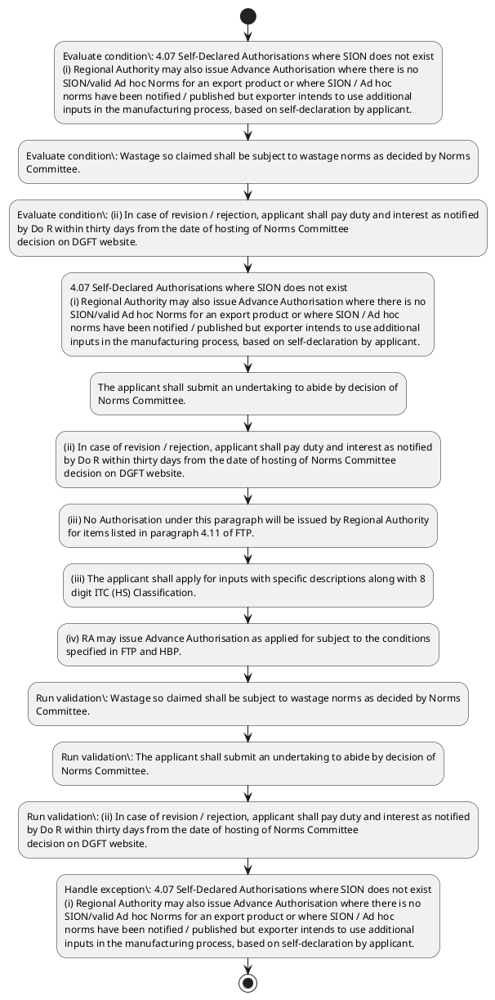

# Chapter 4 / Section 4.07: Self-Declared Authorisations where SION does not exist

**Chapter Title:** Duty Exemption / Remission Schemes

**Pages:** 5, 6

**Purpose:** 4.07 Self-Declared Authorisations where SION does not exist
(i) Regional Authority may also issue Advance Authorisation where there is no
SION/valid Ad hoc Norms for an export product or where SION / Ad hoc
norms have been notified / published but exporter intends to use additional
inputs in the manufacturing process, based on self-declaration by applicant.

**Purpose Thanglish:** Indha Self-Declared Authorisations where SION does not exist section-la, 4.07 Self-Declared Authorisations where SION does not exist
(i) Regional authority may also issue Advance Authorisation where there is no
SION/valid Ad hoc Norms for an export product or where SION / Ad hoc
norms have been notified / published but exporter intends to use additional
inputs in the manufacturing process, based on self-declaration by applicant.

**Summary:** 4.07 Self-Declared Authorisations where SION does not exist
(i) Regional Authority may also issue Advance Authorisation where there is no
SION/valid Ad hoc Norms for an export product or where SION / Ad hoc
norms have been notified / published but exporter intends to use additional
inputs in the manufacturing process, based on self-declaration by applicant. Wastage so claimed shall be subject to wastage norms as decided by Norms
Committee. The applicant shall submit an undertaking to abide by decision of
Norms Committee.

**Business Meaning:** Self-Declared Authorisations where SION does not exist governs how DGFT business controls should be applied, validated, and enforced.

**Business Explanation:** Self-Declared Authorisations where SION does not exist explains the operating rule set that DEKAI should enforce. Key control points include Wastage so claimed shall be subject to wastage norms as decided by Norms
Committee. The section also drives actions such as 4.07 Self-Declared Authorisations where SION does not exist
(i) Regional Authority may also issue Advance Authorisation where there is no
SION/valid Ad hoc Norms for an export product or where SION / Ad hoc
norms have been notified / published but exporter intends to use additional
inputs in the manufacturing process, based on self-declaration by applicant..

**Business Explanation Thanglish:** Indha Self-Declared Authorisations where SION does not exist section-la, Self-Declared Authorisations where SION does not exist explains the operating rule set that DEKAI should enforce. Key control points include Wastage so claimed kandippa be subject to wastage norms as decided by Norms
Committee. The section also drives actions such as 4.07 Self-Declared Authorisations where SION does not exist
(i) Regional authority may also issue Advance Authorisation where there is no
SION/valid Ad hoc Norms for an export product or where SION / Ad hoc
norms have been notified / published but exporter intends to use additional
inputs in the manufacturing process, based on self-declaration by applicant..

## Business Logic
- Wastage so claimed shall be subject to wastage norms as decided by Norms
Committee.
- The applicant shall submit an undertaking to abide by decision of
Norms Committee.
- (ii) In case of revision / rejection, applicant shall pay duty and interest as notified
by Do R within thirty days from the date of hosting of Norms Committee
decision on DGFT website.
- Applications shall be filed online along with complete details as per
Appendix-4E along with a certificate from Chartered Engineer in Appendix-
4K.
- For issuance of such a certificate, the Chartered Engineer shall act only
in the domain of his/ her competence.
- (ii) General Notes given in the book titled Standard Input Output Norms
including policy for packing material and fuel shall also be applicable to this
scheme in so far as they are not inconsistent with this scheme.
- (iii) The applicant shall apply for inputs with specific descriptions along with 8
digit ITC (HS) Classification.
- Wherever the export product and/or inputs are
given in brand names, the correct chemical /technical name shall also be
given in the application.
- (iv) RA may issue Advance Authorisation as applied for subject to the conditions
specified in FTP and HBP.
- Input Output Norms as applied and wastage
claimed by the applicant shall be treated as final.
- (ii)
In case of revision / rejection, applicant shall pay duty and interest as notified
by Do R within thirty days from the date of hosting of Norms Committee
decision on DGFT website.
- (ii)
General Notes given in the book titled Standard Input Output Norms
including policy for packing material and fuel shall also be applicable to this
scheme in so far as they are not inconsistent with this scheme.
- (iii)
The applicant shall apply for inputs with specific descriptions along with 8
digit ITC (HS) Classification.
- (iv)
RA may issue Advance Authorisation as applied for subject to the conditions
specified in FTP and HBP.
- (v) Applicant or his supporting manufacturer/co-licensee shall maintain a
proper account of consumption and utilization of duty free
imported/domestically procured inputs against each authorisation, as
prescribed in Appendix-4H.
- Application for EODC shall be submitted in
prescribed format along with Appendix-4H to the Regional Authority
concerned.
- Regional Authority shall compare the details of Appendix-4H,
with that of the inputs allowed in the Authorisation.
- Such records shall be
preserved by the authorisation holder/manufacturer for a period of three
years from the date of Export Obligation Discharge Certificate.
- (vi) Production and consumption records of the export item under this scheme
shall be audited by concerned Norms Committee.
- Exporters shall be required to
provide necessary facility to verify Books of Accounts or other documents
and assistance as may be required for timely completion of the audit.
- Concerned Norms Committee shall constitute the audit teams and specify the
manner of audit from time to time through administrative orders.
- (vii) Non submission of prescribed documents/information to the Audit team by
the applicant shall make him liable for penal action under the provisions of
FT(D&R) Act, 1992, as amended and Rules and order made there under.
- In
case items imported/procured duty-free are found to be in excess or not
consumed fully, the applicant shall suo moto pay immediately duty with
applicable interest to the Customs Authority.
- However, if Audit team found
that duty-free items were imported in excess and not consumed fully in the
resultant products and duty and interest have not been paid suo moto, the
applicant shall be placed under Denied Entity List (DEL) under Rule 7 of
FT(Regulation) Rules, 1993, as amended, in addition to other penal action
under FT(DR) Act/Customs Act.
- The Chartered Engineer shall also be liable
for penal action for abetment under the provisions of Section 11(2) of the
FT(DR)Act.
- (viii) All the provisions of Advance Authorisation scheme shall also be applicable
to this scheme in so far they are not inconsistent with the specific provisions
of this scheme.

## Business Rules
- rule_id=CH4-SEC4_07-R001, rule_description=Wastage so claimed shall be subject to wastage norms as decided by Norms
Committee., trigger=Self-Declared Authorisations where SION does not exist, condition=4.07 Self-Declared Authorisations where SION does not exist
(i) Regional Authority may also issue Advance Authorisation where there is no
SION/valid Ad hoc Norms for an export product or where SION / Ad hoc
norms have been notified / published but exporter intends to use additional
inputs in the manufacturing process, based on self-declaration by applicant., validation=Wastage so claimed shall be subject to wastage norms as decided by Norms
Committee., action=4.07 Self-Declared Authorisations where SION does not exist
(i) Regional Authority may also issue Advance Authorisation where there is no
SION/valid Ad hoc Norms for an export product or where SION / Ad hoc
norms have been notified / published but exporter intends to use additional
inputs in the manufacturing process, based on self-declaration by applicant., exception=4.07 Self-Declared Authorisations where SION does not exist
(i) Regional Authority may also issue Advance Authorisation where there is no
SION/valid Ad hoc Norms for an export product or where SION / Ad hoc
norms have been notified / published but exporter intends to use additional
inputs in the manufacturing process, based on self-declaration by applicant., output=DEKAI should produce a compliance decision for 4.07 - Self-Declared Authorisations where SION does not exist.
- rule_id=CH4-SEC4_07-R002, rule_description=The applicant shall submit an undertaking to abide by decision of
Norms Committee., trigger=Self-Declared Authorisations where SION does not exist, condition=Wastage so claimed shall be subject to wastage norms as decided by Norms
Committee., validation=The applicant shall submit an undertaking to abide by decision of
Norms Committee., action=The applicant shall submit an undertaking to abide by decision of
Norms Committee., exception=(vii) In cases where ad-hoc norms have already been arrived at by Norms Committee,
the Norms Committee may recommend Notification of SION on a case to case basis.v
4.07 Self-Declared Authorisations where SION does not exist
(i)
Regional Authority may also issue Advance Authorisation where there is no
SION/valid Ad hoc Norms for an export product or where SION / Ad hoc
norms have been notified / published but exporter intends to use additional
inputs in the manufacturing process, based on self-declaration by applicant., output=DEKAI should produce a compliance decision for 4.07 - Self-Declared Authorisations where SION does not exist.
- rule_id=CH4-SEC4_07-R003, rule_description=(ii) In case of revision / rejection, applicant shall pay duty and interest as notified
by Do R within thirty days from the date of hosting of Norms Committee
decision on DGFT website., trigger=Self-Declared Authorisations where SION does not exist, condition=(ii) In case of revision / rejection, applicant shall pay duty and interest as notified
by Do R within thirty days from the date of hosting of Norms Committee
decision on DGFT website., validation=(ii) In case of revision / rejection, applicant shall pay duty and interest as notified
by Do R within thirty days from the date of hosting of Norms Committee
decision on DGFT website., action=(ii) In case of revision / rejection, applicant shall pay duty and interest as notified
by Do R within thirty days from the date of hosting of Norms Committee
decision on DGFT website., exception=However, if Audit team found
that duty-free items were imported in excess and not consumed fully in the
resultant products and duty and interest have not been paid suo moto, the
applicant shall be placed under Denied Entity List (DEL) under Rule 7 of
FT(Regulation) Rules, 1993, as amended, in addition to other penal action
under FT(DR) Act/Customs Act., output=DEKAI should produce a compliance decision for 4.07 - Self-Declared Authorisations where SION does not exist.
- rule_id=CH4-SEC4_07-R004, rule_description=Applications shall be filed online along with complete details as per
Appendix-4E along with a certificate from Chartered Engineer in Appendix-
4K., trigger=Self-Declared Authorisations where SION does not exist, condition=4.07 A Self –Ratification Scheme
(i) Policy related to Self-Ratification Scheme is provided at Para 4.06 of FTP., validation=Applications shall be filed online along with complete details as per
Appendix-4E along with a certificate from Chartered Engineer in Appendix-
4K., action=(iii) No Authorisation under this paragraph will be issued by Regional Authority
for items listed in paragraph 4.11 of FTP., exception=However, if Audit team found
that duty-free items were imported in excess and not consumed fully in the
resultant products and duty and interest have not been paid suo moto, the
applicant shall be placed under Denied Entity List (DEL) under Rule 7 of
FT(Regulation) Rules, 1993, as amended, in addition to other penal action
under FT(DR) Act/Customs Act., output=DEKAI should produce a compliance decision for 4.07 - Self-Declared Authorisations where SION does not exist.
- rule_id=CH4-SEC4_07-R005, rule_description=For issuance of such a certificate, the Chartered Engineer shall act only
in the domain of his/ her competence., trigger=Self-Declared Authorisations where SION does not exist, condition=Applications shall be filed online along with complete details as per
Appendix-4E along with a certificate from Chartered Engineer in Appendix-
4K., validation=For issuance of such a certificate, the Chartered Engineer shall act only
in the domain of his/ her competence., action=(iii) The applicant shall apply for inputs with specific descriptions along with 8
digit ITC (HS) Classification., exception=However, if Audit team found
that duty-free items were imported in excess and not consumed fully in the
resultant products and duty and interest have not been paid suo moto, the
applicant shall be placed under Denied Entity List (DEL) under Rule 7 of
FT(Regulation) Rules, 1993, as amended, in addition to other penal action
under FT(DR) Act/Customs Act., output=DEKAI should produce a compliance decision for 4.07 - Self-Declared Authorisations where SION does not exist.
- rule_id=CH4-SEC4_07-R006, rule_description=(ii) General Notes given in the book titled Standard Input Output Norms
including policy for packing material and fuel shall also be applicable to this
scheme in so far as they are not inconsistent with this scheme., trigger=Self-Declared Authorisations where SION does not exist, condition=For issuance of such a certificate, the Chartered Engineer shall act only
in the domain of his/ her competence., validation=(ii) General Notes given in the book titled Standard Input Output Norms
including policy for packing material and fuel shall also be applicable to this
scheme in so far as they are not inconsistent with this scheme., action=(iv) RA may issue Advance Authorisation as applied for subject to the conditions
specified in FTP and HBP., exception=However, if Audit team found
that duty-free items were imported in excess and not consumed fully in the
resultant products and duty and interest have not been paid suo moto, the
applicant shall be placed under Denied Entity List (DEL) under Rule 7 of
FT(Regulation) Rules, 1993, as amended, in addition to other penal action
under FT(DR) Act/Customs Act., output=DEKAI should produce a compliance decision for 4.07 - Self-Declared Authorisations where SION does not exist.
- rule_id=CH4-SEC4_07-R007, rule_description=(iii) The applicant shall apply for inputs with specific descriptions along with 8
digit ITC (HS) Classification., trigger=Self-Declared Authorisations where SION does not exist, condition=(iii) The applicant shall apply for inputs with specific descriptions along with 8
digit ITC (HS) Classification., validation=(iii) The applicant shall apply for inputs with specific descriptions along with 8
digit ITC (HS) Classification., action=(vii) In cases where ad-hoc norms have already been arrived at by Norms Committee,
the Norms Committee may recommend Notification of SION on a case to case basis.v
4.07 Self-Declared Authorisations where SION does not exist
(i)
Regional Authority may also issue Advance Authorisation where there is no
SION/valid Ad hoc Norms for an export product or where SION / Ad hoc
norms have been notified / published but exporter intends to use additional
inputs in the manufacturing process, based on self-declaration by applicant., exception=However, if Audit team found
that duty-free items were imported in excess and not consumed fully in the
resultant products and duty and interest have not been paid suo moto, the
applicant shall be placed under Denied Entity List (DEL) under Rule 7 of
FT(Regulation) Rules, 1993, as amended, in addition to other penal action
under FT(DR) Act/Customs Act., output=DEKAI should produce a compliance decision for 4.07 - Self-Declared Authorisations where SION does not exist.
- rule_id=CH4-SEC4_07-R008, rule_description=Wherever the export product and/or inputs are
given in brand names, the correct chemical /technical name shall also be
given in the application., trigger=Self-Declared Authorisations where SION does not exist, condition=Wherever the export product and/or inputs are
given in brand names, the correct chemical /technical name shall also be
given in the application., validation=Wherever the export product and/or inputs are
given in brand names, the correct chemical /technical name shall also be
given in the application., action=(ii)
In case of revision / rejection, applicant shall pay duty and interest as notified
by Do R within thirty days from the date of hosting of Norms Committee
decision on DGFT website., exception=However, if Audit team found
that duty-free items were imported in excess and not consumed fully in the
resultant products and duty and interest have not been paid suo moto, the
applicant shall be placed under Denied Entity List (DEL) under Rule 7 of
FT(Regulation) Rules, 1993, as amended, in addition to other penal action
under FT(DR) Act/Customs Act., output=DEKAI should produce a compliance decision for 4.07 - Self-Declared Authorisations where SION does not exist.
- rule_id=CH4-SEC4_07-R009, rule_description=(iv) RA may issue Advance Authorisation as applied for subject to the conditions
specified in FTP and HBP., trigger=Self-Declared Authorisations where SION does not exist, condition=(iv) RA may issue Advance Authorisation as applied for subject to the conditions
specified in FTP and HBP., validation=Input Output Norms as applied and wastage
claimed by the applicant shall be treated as final., action=(iii)
No Authorisation under this paragraph will be issued by Regional Authority
for items listed in paragraph 4.11 of FTP., exception=However, if Audit team found
that duty-free items were imported in excess and not consumed fully in the
resultant products and duty and interest have not been paid suo moto, the
applicant shall be placed under Denied Entity List (DEL) under Rule 7 of
FT(Regulation) Rules, 1993, as amended, in addition to other penal action
under FT(DR) Act/Customs Act., output=DEKAI should produce a compliance decision for 4.07 - Self-Declared Authorisations where SION does not exist.
- rule_id=CH4-SEC4_07-R010, rule_description=Input Output Norms as applied and wastage
claimed by the applicant shall be treated as final., trigger=Self-Declared Authorisations where SION does not exist, condition=Ratification of the same by
NC is not required., validation=Ratification of the same by
NC is not required., action=(iii)
The applicant shall apply for inputs with specific descriptions along with 8
digit ITC (HS) Classification., exception=However, if Audit team found
that duty-free items were imported in excess and not consumed fully in the
resultant products and duty and interest have not been paid suo moto, the
applicant shall be placed under Denied Entity List (DEL) under Rule 7 of
FT(Regulation) Rules, 1993, as amended, in addition to other penal action
under FT(DR) Act/Customs Act., output=DEKAI should produce a compliance decision for 4.07 - Self-Declared Authorisations where SION does not exist.
- rule_id=CH4-SEC4_07-R011, rule_description=(ii)
In case of revision / rejection, applicant shall pay duty and interest as notified
by Do R within thirty days from the date of hosting of Norms Committee
decision on DGFT website., trigger=Self-Declared Authorisations where SION does not exist, condition=80
(vi) Experts may be invited from Scientific and Technological institutions as
members of Norms Committee for fixation of Norms., validation=(ii)
In case of revision / rejection, applicant shall pay duty and interest as notified
by Do R within thirty days from the date of hosting of Norms Committee
decision on DGFT website., action=(iv)
RA may issue Advance Authorisation as applied for subject to the conditions
specified in FTP and HBP., exception=However, if Audit team found
that duty-free items were imported in excess and not consumed fully in the
resultant products and duty and interest have not been paid suo moto, the
applicant shall be placed under Denied Entity List (DEL) under Rule 7 of
FT(Regulation) Rules, 1993, as amended, in addition to other penal action
under FT(DR) Act/Customs Act., output=DEKAI should produce a compliance decision for 4.07 - Self-Declared Authorisations where SION does not exist.
- rule_id=CH4-SEC4_07-R012, rule_description=(ii)
General Notes given in the book titled Standard Input Output Norms
including policy for packing material and fuel shall also be applicable to this
scheme in so far as they are not inconsistent with this scheme., trigger=Self-Declared Authorisations where SION does not exist, condition=(vii) In cases where ad-hoc norms have already been arrived at by Norms Committee,
the Norms Committee may recommend Notification of SION on a case to case basis.v
4.07 Self-Declared Authorisations where SION does not exist
(i)
Regional Authority may also issue Advance Authorisation where there is no
SION/valid Ad hoc Norms for an export product or where SION / Ad hoc
norms have been notified / published but exporter intends to use additional
inputs in the manufacturing process, based on self-declaration by applicant., validation=(ii)
General Notes given in the book titled Standard Input Output Norms
including policy for packing material and fuel shall also be applicable to this
scheme in so far as they are not inconsistent with this scheme., action=(v) Applicant or his supporting manufacturer/co-licensee shall maintain a
proper account of consumption and utilization of duty free
imported/domestically procured inputs against each authorisation, as
prescribed in Appendix-4H., exception=However, if Audit team found
that duty-free items were imported in excess and not consumed fully in the
resultant products and duty and interest have not been paid suo moto, the
applicant shall be placed under Denied Entity List (DEL) under Rule 7 of
FT(Regulation) Rules, 1993, as amended, in addition to other penal action
under FT(DR) Act/Customs Act., output=DEKAI should produce a compliance decision for 4.07 - Self-Declared Authorisations where SION does not exist.
- rule_id=CH4-SEC4_07-R013, rule_description=(iii)
The applicant shall apply for inputs with specific descriptions along with 8
digit ITC (HS) Classification., trigger=Self-Declared Authorisations where SION does not exist, condition=(ii)
In case of revision / rejection, applicant shall pay duty and interest as notified
by Do R within thirty days from the date of hosting of Norms Committee
decision on DGFT website., validation=(iii)
The applicant shall apply for inputs with specific descriptions along with 8
digit ITC (HS) Classification., action=Application for EODC shall be submitted in
prescribed format along with Appendix-4H to the Regional Authority
concerned., exception=However, if Audit team found
that duty-free items were imported in excess and not consumed fully in the
resultant products and duty and interest have not been paid suo moto, the
applicant shall be placed under Denied Entity List (DEL) under Rule 7 of
FT(Regulation) Rules, 1993, as amended, in addition to other penal action
under FT(DR) Act/Customs Act., output=DEKAI should produce a compliance decision for 4.07 - Self-Declared Authorisations where SION does not exist.
- rule_id=CH4-SEC4_07-R014, rule_description=(iv)
RA may issue Advance Authorisation as applied for subject to the conditions
specified in FTP and HBP., trigger=Self-Declared Authorisations where SION does not exist, condition=4.07 A
Self –Ratification Scheme
(i)
Policy related to Self-Ratification Scheme is provided at Para 4.06 of FTP., validation=(v) Applicant or his supporting manufacturer/co-licensee shall maintain a
proper account of consumption and utilization of duty free
imported/domestically procured inputs against each authorisation, as
prescribed in Appendix-4H., action=Such audit may be
conducted within three years from the date of issue of Authorisation based
on Risk Based Management System (RBMS)., exception=However, if Audit team found
that duty-free items were imported in excess and not consumed fully in the
resultant products and duty and interest have not been paid suo moto, the
applicant shall be placed under Denied Entity List (DEL) under Rule 7 of
FT(Regulation) Rules, 1993, as amended, in addition to other penal action
under FT(DR) Act/Customs Act., output=DEKAI should produce a compliance decision for 4.07 - Self-Declared Authorisations where SION does not exist.
- rule_id=CH4-SEC4_07-R015, rule_description=(v) Applicant or his supporting manufacturer/co-licensee shall maintain a
proper account of consumption and utilization of duty free
imported/domestically procured inputs against each authorisation, as
prescribed in Appendix-4H., trigger=Self-Declared Authorisations where SION does not exist, condition=(iii)
The applicant shall apply for inputs with specific descriptions along with 8
digit ITC (HS) Classification., validation=Application for EODC shall be submitted in
prescribed format along with Appendix-4H to the Regional Authority
concerned., action=Exporters shall be required to
provide necessary facility to verify Books of Accounts or other documents
and assistance as may be required for timely completion of the audit., exception=However, if Audit team found
that duty-free items were imported in excess and not consumed fully in the
resultant products and duty and interest have not been paid suo moto, the
applicant shall be placed under Denied Entity List (DEL) under Rule 7 of
FT(Regulation) Rules, 1993, as amended, in addition to other penal action
under FT(DR) Act/Customs Act., output=DEKAI should produce a compliance decision for 4.07 - Self-Declared Authorisations where SION does not exist.
- rule_id=CH4-SEC4_07-R016, rule_description=Application for EODC shall be submitted in
prescribed format along with Appendix-4H to the Regional Authority
concerned., trigger=Self-Declared Authorisations where SION does not exist, condition=(iv)
RA may issue Advance Authorisation as applied for subject to the conditions
specified in FTP and HBP., validation=Regional Authority shall compare the details of Appendix-4H,
with that of the inputs allowed in the Authorisation., action=(vii) Non submission of prescribed documents/information to the Audit team by
the applicant shall make him liable for penal action under the provisions of
FT(D&R) Act, 1992, as amended and Rules and order made there under., exception=However, if Audit team found
that duty-free items were imported in excess and not consumed fully in the
resultant products and duty and interest have not been paid suo moto, the
applicant shall be placed under Denied Entity List (DEL) under Rule 7 of
FT(Regulation) Rules, 1993, as amended, in addition to other penal action
under FT(DR) Act/Customs Act., output=DEKAI should produce a compliance decision for 4.07 - Self-Declared Authorisations where SION does not exist.
- rule_id=CH4-SEC4_07-R017, rule_description=Regional Authority shall compare the details of Appendix-4H,
with that of the inputs allowed in the Authorisation., trigger=Self-Declared Authorisations where SION does not exist, condition=Such records shall be
preserved by the authorisation holder/manufacturer for a period of three
years from the date of Export Obligation Discharge Certificate., validation=Such records shall be
preserved by the authorisation holder/manufacturer for a period of three
years from the date of Export Obligation Discharge Certificate., action=In
case items imported/procured duty-free are found to be in excess or not
consumed fully, the applicant shall suo moto pay immediately duty with
applicable interest to the Customs Authority., exception=However, if Audit team found
that duty-free items were imported in excess and not consumed fully in the
resultant products and duty and interest have not been paid suo moto, the
applicant shall be placed under Denied Entity List (DEL) under Rule 7 of
FT(Regulation) Rules, 1993, as amended, in addition to other penal action
under FT(DR) Act/Customs Act., output=DEKAI should produce a compliance decision for 4.07 - Self-Declared Authorisations where SION does not exist.
- rule_id=CH4-SEC4_07-R018, rule_description=Such records shall be
preserved by the authorisation holder/manufacturer for a period of three
years from the date of Export Obligation Discharge Certificate., trigger=Self-Declared Authorisations where SION does not exist, condition=Exporters shall be required to
provide necessary facility to verify Books of Accounts or other documents
and assistance as may be required for timely completion of the audit., validation=(vi) Production and consumption records of the export item under this scheme
shall be audited by concerned Norms Committee., action=However, if Audit team found
that duty-free items were imported in excess and not consumed fully in the
resultant products and duty and interest have not been paid suo moto, the
applicant shall be placed under Denied Entity List (DEL) under Rule 7 of
FT(Regulation) Rules, 1993, as amended, in addition to other penal action
under FT(DR) Act/Customs Act., exception=However, if Audit team found
that duty-free items were imported in excess and not consumed fully in the
resultant products and duty and interest have not been paid suo moto, the
applicant shall be placed under Denied Entity List (DEL) under Rule 7 of
FT(Regulation) Rules, 1993, as amended, in addition to other penal action
under FT(DR) Act/Customs Act., output=DEKAI should produce a compliance decision for 4.07 - Self-Declared Authorisations where SION does not exist.
- rule_id=CH4-SEC4_07-R019, rule_description=(vi) Production and consumption records of the export item under this scheme
shall be audited by concerned Norms Committee., trigger=Self-Declared Authorisations where SION does not exist, condition=Concerned Norms Committee shall constitute the audit teams and specify the
manner of audit from time to time through administrative orders., validation=Exporters shall be required to
provide necessary facility to verify Books of Accounts or other documents
and assistance as may be required for timely completion of the audit., action=However, if Audit team found
that duty-free items were imported in excess and not consumed fully in the
resultant products and duty and interest have not been paid suo moto, the
applicant shall be placed under Denied Entity List (DEL) under Rule 7 of
FT(Regulation) Rules, 1993, as amended, in addition to other penal action
under FT(DR) Act/Customs Act., exception=However, if Audit team found
that duty-free items were imported in excess and not consumed fully in the
resultant products and duty and interest have not been paid suo moto, the
applicant shall be placed under Denied Entity List (DEL) under Rule 7 of
FT(Regulation) Rules, 1993, as amended, in addition to other penal action
under FT(DR) Act/Customs Act., output=DEKAI should produce a compliance decision for 4.07 - Self-Declared Authorisations where SION does not exist.
- rule_id=CH4-SEC4_07-R020, rule_description=Exporters shall be required to
provide necessary facility to verify Books of Accounts or other documents
and assistance as may be required for timely completion of the audit., trigger=Self-Declared Authorisations where SION does not exist, condition=However, if Audit team found
that duty-free items were imported in excess and not consumed fully in the
resultant products and duty and interest have not been paid suo moto, the
applicant shall be placed under Denied Entity List (DEL) under Rule 7 of
FT(Regulation) Rules, 1993, as amended, in addition to other penal action
under FT(DR) Act/Customs Act., validation=Concerned Norms Committee shall constitute the audit teams and specify the
manner of audit from time to time through administrative orders., action=However, if Audit team found
that duty-free items were imported in excess and not consumed fully in the
resultant products and duty and interest have not been paid suo moto, the
applicant shall be placed under Denied Entity List (DEL) under Rule 7 of
FT(Regulation) Rules, 1993, as amended, in addition to other penal action
under FT(DR) Act/Customs Act., exception=However, if Audit team found
that duty-free items were imported in excess and not consumed fully in the
resultant products and duty and interest have not been paid suo moto, the
applicant shall be placed under Denied Entity List (DEL) under Rule 7 of
FT(Regulation) Rules, 1993, as amended, in addition to other penal action
under FT(DR) Act/Customs Act., output=DEKAI should produce a compliance decision for 4.07 - Self-Declared Authorisations where SION does not exist.
- rule_id=CH4-SEC4_07-R021, rule_description=Concerned Norms Committee shall constitute the audit teams and specify the
manner of audit from time to time through administrative orders., trigger=Self-Declared Authorisations where SION does not exist, condition=(viii) All the provisions of Advance Authorisation scheme shall also be applicable
to this scheme in so far they are not inconsistent with the specific provisions
of this scheme., validation=(vii) Non submission of prescribed documents/information to the Audit team by
the applicant shall make him liable for penal action under the provisions of
FT(D&R) Act, 1992, as amended and Rules and order made there under., action=However, if Audit team found
that duty-free items were imported in excess and not consumed fully in the
resultant products and duty and interest have not been paid suo moto, the
applicant shall be placed under Denied Entity List (DEL) under Rule 7 of
FT(Regulation) Rules, 1993, as amended, in addition to other penal action
under FT(DR) Act/Customs Act., exception=However, if Audit team found
that duty-free items were imported in excess and not consumed fully in the
resultant products and duty and interest have not been paid suo moto, the
applicant shall be placed under Denied Entity List (DEL) under Rule 7 of
FT(Regulation) Rules, 1993, as amended, in addition to other penal action
under FT(DR) Act/Customs Act., output=DEKAI should produce a compliance decision for 4.07 - Self-Declared Authorisations where SION does not exist.
- rule_id=CH4-SEC4_07-R022, rule_description=(vii) Non submission of prescribed documents/information to the Audit team by
the applicant shall make him liable for penal action under the provisions of
FT(D&R) Act, 1992, as amended and Rules and order made there under., trigger=Self-Declared Authorisations where SION does not exist, condition=(viii) All the provisions of Advance Authorisation scheme shall also be applicable
to this scheme in so far they are not inconsistent with the specific provisions
of this scheme., validation=In
case items imported/procured duty-free are found to be in excess or not
consumed fully, the applicant shall suo moto pay immediately duty with
applicable interest to the Customs Authority., action=However, if Audit team found
that duty-free items were imported in excess and not consumed fully in the
resultant products and duty and interest have not been paid suo moto, the
applicant shall be placed under Denied Entity List (DEL) under Rule 7 of
FT(Regulation) Rules, 1993, as amended, in addition to other penal action
under FT(DR) Act/Customs Act., exception=However, if Audit team found
that duty-free items were imported in excess and not consumed fully in the
resultant products and duty and interest have not been paid suo moto, the
applicant shall be placed under Denied Entity List (DEL) under Rule 7 of
FT(Regulation) Rules, 1993, as amended, in addition to other penal action
under FT(DR) Act/Customs Act., output=DEKAI should produce a compliance decision for 4.07 - Self-Declared Authorisations where SION does not exist.
- rule_id=CH4-SEC4_07-R023, rule_description=In
case items imported/procured duty-free are found to be in excess or not
consumed fully, the applicant shall suo moto pay immediately duty with
applicable interest to the Customs Authority., trigger=Self-Declared Authorisations where SION does not exist, condition=(viii) All the provisions of Advance Authorisation scheme shall also be applicable
to this scheme in so far they are not inconsistent with the specific provisions
of this scheme., validation=However, if Audit team found
that duty-free items were imported in excess and not consumed fully in the
resultant products and duty and interest have not been paid suo moto, the
applicant shall be placed under Denied Entity List (DEL) under Rule 7 of
FT(Regulation) Rules, 1993, as amended, in addition to other penal action
under FT(DR) Act/Customs Act., action=However, if Audit team found
that duty-free items were imported in excess and not consumed fully in the
resultant products and duty and interest have not been paid suo moto, the
applicant shall be placed under Denied Entity List (DEL) under Rule 7 of
FT(Regulation) Rules, 1993, as amended, in addition to other penal action
under FT(DR) Act/Customs Act., exception=However, if Audit team found
that duty-free items were imported in excess and not consumed fully in the
resultant products and duty and interest have not been paid suo moto, the
applicant shall be placed under Denied Entity List (DEL) under Rule 7 of
FT(Regulation) Rules, 1993, as amended, in addition to other penal action
under FT(DR) Act/Customs Act., output=DEKAI should produce a compliance decision for 4.07 - Self-Declared Authorisations where SION does not exist.
- rule_id=CH4-SEC4_07-R024, rule_description=However, if Audit team found
that duty-free items were imported in excess and not consumed fully in the
resultant products and duty and interest have not been paid suo moto, the
applicant shall be placed under Denied Entity List (DEL) under Rule 7 of
FT(Regulation) Rules, 1993, as amended, in addition to other penal action
under FT(DR) Act/Customs Act., trigger=Self-Declared Authorisations where SION does not exist, condition=(viii) All the provisions of Advance Authorisation scheme shall also be applicable
to this scheme in so far they are not inconsistent with the specific provisions
of this scheme., validation=The Chartered Engineer shall also be liable
for penal action for abetment under the provisions of Section 11(2) of the
FT(DR)Act., action=However, if Audit team found
that duty-free items were imported in excess and not consumed fully in the
resultant products and duty and interest have not been paid suo moto, the
applicant shall be placed under Denied Entity List (DEL) under Rule 7 of
FT(Regulation) Rules, 1993, as amended, in addition to other penal action
under FT(DR) Act/Customs Act., exception=However, if Audit team found
that duty-free items were imported in excess and not consumed fully in the
resultant products and duty and interest have not been paid suo moto, the
applicant shall be placed under Denied Entity List (DEL) under Rule 7 of
FT(Regulation) Rules, 1993, as amended, in addition to other penal action
under FT(DR) Act/Customs Act., output=DEKAI should produce a compliance decision for 4.07 - Self-Declared Authorisations where SION does not exist.
- rule_id=CH4-SEC4_07-R025, rule_description=The Chartered Engineer shall also be liable
for penal action for abetment under the provisions of Section 11(2) of the
FT(DR)Act., trigger=Self-Declared Authorisations where SION does not exist, condition=(viii) All the provisions of Advance Authorisation scheme shall also be applicable
to this scheme in so far they are not inconsistent with the specific provisions
of this scheme., validation=(viii) All the provisions of Advance Authorisation scheme shall also be applicable
to this scheme in so far they are not inconsistent with the specific provisions
of this scheme., action=However, if Audit team found
that duty-free items were imported in excess and not consumed fully in the
resultant products and duty and interest have not been paid suo moto, the
applicant shall be placed under Denied Entity List (DEL) under Rule 7 of
FT(Regulation) Rules, 1993, as amended, in addition to other penal action
under FT(DR) Act/Customs Act., exception=However, if Audit team found
that duty-free items were imported in excess and not consumed fully in the
resultant products and duty and interest have not been paid suo moto, the
applicant shall be placed under Denied Entity List (DEL) under Rule 7 of
FT(Regulation) Rules, 1993, as amended, in addition to other penal action
under FT(DR) Act/Customs Act., output=DEKAI should produce a compliance decision for 4.07 - Self-Declared Authorisations where SION does not exist.
- rule_id=CH4-SEC4_07-R026, rule_description=(viii) All the provisions of Advance Authorisation scheme shall also be applicable
to this scheme in so far they are not inconsistent with the specific provisions
of this scheme., trigger=Self-Declared Authorisations where SION does not exist, condition=(viii) All the provisions of Advance Authorisation scheme shall also be applicable
to this scheme in so far they are not inconsistent with the specific provisions
of this scheme., validation=(viii) All the provisions of Advance Authorisation scheme shall also be applicable
to this scheme in so far they are not inconsistent with the specific provisions
of this scheme., action=However, if Audit team found
that duty-free items were imported in excess and not consumed fully in the
resultant products and duty and interest have not been paid suo moto, the
applicant shall be placed under Denied Entity List (DEL) under Rule 7 of
FT(Regulation) Rules, 1993, as amended, in addition to other penal action
under FT(DR) Act/Customs Act., exception=However, if Audit team found
that duty-free items were imported in excess and not consumed fully in the
resultant products and duty and interest have not been paid suo moto, the
applicant shall be placed under Denied Entity List (DEL) under Rule 7 of
FT(Regulation) Rules, 1993, as amended, in addition to other penal action
under FT(DR) Act/Customs Act., output=DEKAI should produce a compliance decision for 4.07 - Self-Declared Authorisations where SION does not exist.

## Conditions
- 4.07 Self-Declared Authorisations where SION does not exist
(i) Regional Authority may also issue Advance Authorisation where there is no
SION/valid Ad hoc Norms for an export product or where SION / Ad hoc
norms have been notified / published but exporter intends to use additional
inputs in the manufacturing process, based on self-declaration by applicant.
- Wastage so claimed shall be subject to wastage norms as decided by Norms
Committee.
- (ii) In case of revision / rejection, applicant shall pay duty and interest as notified
by Do R within thirty days from the date of hosting of Norms Committee
decision on DGFT website.
- 4.07 A Self –Ratification Scheme
(i) Policy related to Self-Ratification Scheme is provided at Para 4.06 of FTP.
- Applications shall be filed online along with complete details as per
Appendix-4E along with a certificate from Chartered Engineer in Appendix-
4K.
- For issuance of such a certificate, the Chartered Engineer shall act only
in the domain of his/ her competence.
- (iii) The applicant shall apply for inputs with specific descriptions along with 8
digit ITC (HS) Classification.
- Wherever the export product and/or inputs are
given in brand names, the correct chemical /technical name shall also be
given in the application.
- (iv) RA may issue Advance Authorisation as applied for subject to the conditions
specified in FTP and HBP.
- Ratification of the same by
NC is not required.
- 80
(vi) Experts may be invited from Scientific and Technological institutions as
members of Norms Committee for fixation of Norms.
- (vii) In cases where ad-hoc norms have already been arrived at by Norms Committee,
the Norms Committee may recommend Notification of SION on a case to case basis.v
4.07 Self-Declared Authorisations where SION does not exist
(i)
Regional Authority may also issue Advance Authorisation where there is no
SION/valid Ad hoc Norms for an export product or where SION / Ad hoc
norms have been notified / published but exporter intends to use additional
inputs in the manufacturing process, based on self-declaration by applicant.
- (ii)
In case of revision / rejection, applicant shall pay duty and interest as notified
by Do R within thirty days from the date of hosting of Norms Committee
decision on DGFT website.
- 4.07 A
Self –Ratification Scheme
(i)
Policy related to Self-Ratification Scheme is provided at Para 4.06 of FTP.
- (iii)
The applicant shall apply for inputs with specific descriptions along with 8
digit ITC (HS) Classification.
- (iv)
RA may issue Advance Authorisation as applied for subject to the conditions
specified in FTP and HBP.
- Such records shall be
preserved by the authorisation holder/manufacturer for a period of three
years from the date of Export Obligation Discharge Certificate.
- Exporters shall be required to
provide necessary facility to verify Books of Accounts or other documents
and assistance as may be required for timely completion of the audit.
- Concerned Norms Committee shall constitute the audit teams and specify the
manner of audit from time to time through administrative orders.
- However, if Audit team found
that duty-free items were imported in excess and not consumed fully in the
resultant products and duty and interest have not been paid suo moto, the
applicant shall be placed under Denied Entity List (DEL) under Rule 7 of
FT(Regulation) Rules, 1993, as amended, in addition to other penal action
under FT(DR) Act/Customs Act.
- (viii) All the provisions of Advance Authorisation scheme shall also be applicable
to this scheme in so far they are not inconsistent with the specific provisions
of this scheme.

## Condition Logic
- id=4.4.07.1, if=4.07 Self-Declared Authorisations where SION does not exist
(i) Regional Authority may also issue Advance Authorisation where there is no
SION/valid Ad hoc Norms for an export product or where SION / Ad hoc
norms have been notified / published but exporter intends to use additional
inputs in the manufacturing process, based on self-declaration by applicant., then=4.07 Self-Declared Authorisations where SION does not exist
(i) Regional Authority may also issue Advance Authorisation where there is no
SION/valid Ad hoc Norms for an export product or where SION / Ad hoc
norms have been notified / published but exporter intends to use additional
inputs in the manufacturing process, based on self-declaration by applicant., source=4.07 Self-Declared Authorisations where SION does not exist
(i) Regional Authority may also issue Advance Authorisation where there is no
SION/valid Ad hoc Norms for an export product or where SION / Ad hoc
norms have been notified / published but exporter intends to use additional
inputs in the manufacturing process, based on self-declaration by applicant.
- id=4.4.07.2, if=Wastage so claimed shall be subject to wastage norms as decided by Norms
Committee., then=4.07 Self-Declared Authorisations where SION does not exist
(i) Regional Authority may also issue Advance Authorisation where there is no
SION/valid Ad hoc Norms for an export product or where SION / Ad hoc
norms have been notified / published but exporter intends to use additional
inputs in the manufacturing process, based on self-declaration by applicant., source=Wastage so claimed shall be subject to wastage norms as decided by Norms
Committee.
- id=4.4.07.3, if=(ii) In case of revision / rejection, applicant shall pay duty and interest as notified
by Do R within thirty days from the date of hosting of Norms Committee
decision on DGFT website., then=4.07 Self-Declared Authorisations where SION does not exist
(i) Regional Authority may also issue Advance Authorisation where there is no
SION/valid Ad hoc Norms for an export product or where SION / Ad hoc
norms have been notified / published but exporter intends to use additional
inputs in the manufacturing process, based on self-declaration by applicant., source=(ii) In case of revision / rejection, applicant shall pay duty and interest as notified
by Do R within thirty days from the date of hosting of Norms Committee
decision on DGFT website.
- id=4.4.07.4, if=4.07 A Self –Ratification Scheme
(i) Policy related to Self-Ratification Scheme is provided at Para 4.06 of FTP., then=4.07 Self-Declared Authorisations where SION does not exist
(i) Regional Authority may also issue Advance Authorisation where there is no
SION/valid Ad hoc Norms for an export product or where SION / Ad hoc
norms have been notified / published but exporter intends to use additional
inputs in the manufacturing process, based on self-declaration by applicant., source=4.07 A Self –Ratification Scheme
(i) Policy related to Self-Ratification Scheme is provided at Para 4.06 of FTP.
- id=4.4.07.5, if=Applications shall be filed online along with complete details as per
Appendix-4E along with a certificate from Chartered Engineer in Appendix-
4K., then=4.07 Self-Declared Authorisations where SION does not exist
(i) Regional Authority may also issue Advance Authorisation where there is no
SION/valid Ad hoc Norms for an export product or where SION / Ad hoc
norms have been notified / published but exporter intends to use additional
inputs in the manufacturing process, based on self-declaration by applicant., source=Applications shall be filed online along with complete details as per
Appendix-4E along with a certificate from Chartered Engineer in Appendix-
4K.
- id=4.4.07.6, if=For issuance of such a certificate, the Chartered Engineer shall act only
in the domain of his/ her competence., then=4.07 Self-Declared Authorisations where SION does not exist
(i) Regional Authority may also issue Advance Authorisation where there is no
SION/valid Ad hoc Norms for an export product or where SION / Ad hoc
norms have been notified / published but exporter intends to use additional
inputs in the manufacturing process, based on self-declaration by applicant., source=For issuance of such a certificate, the Chartered Engineer shall act only
in the domain of his/ her competence.
- id=4.4.07.7, if=(iii) The applicant shall apply for inputs with specific descriptions along with 8
digit ITC (HS) Classification., then=4.07 Self-Declared Authorisations where SION does not exist
(i) Regional Authority may also issue Advance Authorisation where there is no
SION/valid Ad hoc Norms for an export product or where SION / Ad hoc
norms have been notified / published but exporter intends to use additional
inputs in the manufacturing process, based on self-declaration by applicant., source=(iii) The applicant shall apply for inputs with specific descriptions along with 8
digit ITC (HS) Classification.
- id=4.4.07.8, if=Wherever the export product and/or inputs are
given in brand names, the correct chemical /technical name shall also be
given in the application., then=4.07 Self-Declared Authorisations where SION does not exist
(i) Regional Authority may also issue Advance Authorisation where there is no
SION/valid Ad hoc Norms for an export product or where SION / Ad hoc
norms have been notified / published but exporter intends to use additional
inputs in the manufacturing process, based on self-declaration by applicant., source=Wherever the export product and/or inputs are
given in brand names, the correct chemical /technical name shall also be
given in the application.
- id=4.4.07.9, if=(iv) RA may issue Advance Authorisation as applied for subject to the conditions
specified in FTP and HBP., then=4.07 Self-Declared Authorisations where SION does not exist
(i) Regional Authority may also issue Advance Authorisation where there is no
SION/valid Ad hoc Norms for an export product or where SION / Ad hoc
norms have been notified / published but exporter intends to use additional
inputs in the manufacturing process, based on self-declaration by applicant., source=(iv) RA may issue Advance Authorisation as applied for subject to the conditions
specified in FTP and HBP.
- id=4.4.07.10, if=Ratification of the same by
NC is not required., then=4.07 Self-Declared Authorisations where SION does not exist
(i) Regional Authority may also issue Advance Authorisation where there is no
SION/valid Ad hoc Norms for an export product or where SION / Ad hoc
norms have been notified / published but exporter intends to use additional
inputs in the manufacturing process, based on self-declaration by applicant., source=Ratification of the same by
NC is not required.
- id=4.4.07.11, if=80
(vi) Experts may be invited from Scientific and Technological institutions as
members of Norms Committee for fixation of Norms., then=4.07 Self-Declared Authorisations where SION does not exist
(i) Regional Authority may also issue Advance Authorisation where there is no
SION/valid Ad hoc Norms for an export product or where SION / Ad hoc
norms have been notified / published but exporter intends to use additional
inputs in the manufacturing process, based on self-declaration by applicant., source=80
(vi) Experts may be invited from Scientific and Technological institutions as
members of Norms Committee for fixation of Norms.
- id=4.4.07.12, if=(vii) In cases where ad-hoc norms have already been arrived at by Norms Committee,
the Norms Committee may recommend Notification of SION on a case to case basis.v
4.07 Self-Declared Authorisations where SION does not exist
(i)
Regional Authority may also issue Advance Authorisation where there is no
SION/valid Ad hoc Norms for an export product or where SION / Ad hoc
norms have been notified / published but exporter intends to use additional
inputs in the manufacturing process, based on self-declaration by applicant., then=4.07 Self-Declared Authorisations where SION does not exist
(i) Regional Authority may also issue Advance Authorisation where there is no
SION/valid Ad hoc Norms for an export product or where SION / Ad hoc
norms have been notified / published but exporter intends to use additional
inputs in the manufacturing process, based on self-declaration by applicant., source=(vii) In cases where ad-hoc norms have already been arrived at by Norms Committee,
the Norms Committee may recommend Notification of SION on a case to case basis.v
4.07 Self-Declared Authorisations where SION does not exist
(i)
Regional Authority may also issue Advance Authorisation where there is no
SION/valid Ad hoc Norms for an export product or where SION / Ad hoc
norms have been notified / published but exporter intends to use additional
inputs in the manufacturing process, based on self-declaration by applicant.
- id=4.4.07.13, if=(ii)
In case of revision / rejection, applicant shall pay duty and interest as notified
by Do R within thirty days from the date of hosting of Norms Committee
decision on DGFT website., then=4.07 Self-Declared Authorisations where SION does not exist
(i) Regional Authority may also issue Advance Authorisation where there is no
SION/valid Ad hoc Norms for an export product or where SION / Ad hoc
norms have been notified / published but exporter intends to use additional
inputs in the manufacturing process, based on self-declaration by applicant., source=(ii)
In case of revision / rejection, applicant shall pay duty and interest as notified
by Do R within thirty days from the date of hosting of Norms Committee
decision on DGFT website.
- id=4.4.07.14, if=4.07 A
Self –Ratification Scheme
(i)
Policy related to Self-Ratification Scheme is provided at Para 4.06 of FTP., then=4.07 Self-Declared Authorisations where SION does not exist
(i) Regional Authority may also issue Advance Authorisation where there is no
SION/valid Ad hoc Norms for an export product or where SION / Ad hoc
norms have been notified / published but exporter intends to use additional
inputs in the manufacturing process, based on self-declaration by applicant., source=4.07 A
Self –Ratification Scheme
(i)
Policy related to Self-Ratification Scheme is provided at Para 4.06 of FTP.
- id=4.4.07.15, if=(iii)
The applicant shall apply for inputs with specific descriptions along with 8
digit ITC (HS) Classification., then=4.07 Self-Declared Authorisations where SION does not exist
(i) Regional Authority may also issue Advance Authorisation where there is no
SION/valid Ad hoc Norms for an export product or where SION / Ad hoc
norms have been notified / published but exporter intends to use additional
inputs in the manufacturing process, based on self-declaration by applicant., source=(iii)
The applicant shall apply for inputs with specific descriptions along with 8
digit ITC (HS) Classification.
- id=4.4.07.16, if=(iv)
RA may issue Advance Authorisation as applied for subject to the conditions
specified in FTP and HBP., then=4.07 Self-Declared Authorisations where SION does not exist
(i) Regional Authority may also issue Advance Authorisation where there is no
SION/valid Ad hoc Norms for an export product or where SION / Ad hoc
norms have been notified / published but exporter intends to use additional
inputs in the manufacturing process, based on self-declaration by applicant., source=(iv)
RA may issue Advance Authorisation as applied for subject to the conditions
specified in FTP and HBP.
- id=4.4.07.17, if=Such records shall be
preserved by the authorisation holder/manufacturer for a period of three
years from the date of Export Obligation Discharge Certificate., then=4.07 Self-Declared Authorisations where SION does not exist
(i) Regional Authority may also issue Advance Authorisation where there is no
SION/valid Ad hoc Norms for an export product or where SION / Ad hoc
norms have been notified / published but exporter intends to use additional
inputs in the manufacturing process, based on self-declaration by applicant., source=Such records shall be
preserved by the authorisation holder/manufacturer for a period of three
years from the date of Export Obligation Discharge Certificate.
- id=4.4.07.18, if=Exporters shall be required to
provide necessary facility to verify Books of Accounts or other documents
and assistance as may be required for timely completion of the audit., then=4.07 Self-Declared Authorisations where SION does not exist
(i) Regional Authority may also issue Advance Authorisation where there is no
SION/valid Ad hoc Norms for an export product or where SION / Ad hoc
norms have been notified / published but exporter intends to use additional
inputs in the manufacturing process, based on self-declaration by applicant., source=Exporters shall be required to
provide necessary facility to verify Books of Accounts or other documents
and assistance as may be required for timely completion of the audit.
- id=4.4.07.19, if=Concerned Norms Committee shall constitute the audit teams and specify the
manner of audit from time to time through administrative orders., then=4.07 Self-Declared Authorisations where SION does not exist
(i) Regional Authority may also issue Advance Authorisation where there is no
SION/valid Ad hoc Norms for an export product or where SION / Ad hoc
norms have been notified / published but exporter intends to use additional
inputs in the manufacturing process, based on self-declaration by applicant., source=Concerned Norms Committee shall constitute the audit teams and specify the
manner of audit from time to time through administrative orders.
- id=4.4.07.20, if=However, if Audit team found
that duty-free items were imported in excess and not consumed fully in the
resultant products and duty and interest have not been paid suo moto, the
applicant shall be placed under Denied Entity List (DEL) under Rule 7 of
FT(Regulation) Rules, 1993, as amended, in addition to other penal action
under FT(DR) Act/Customs Act., then=4.07 Self-Declared Authorisations where SION does not exist
(i) Regional Authority may also issue Advance Authorisation where there is no
SION/valid Ad hoc Norms for an export product or where SION / Ad hoc
norms have been notified / published but exporter intends to use additional
inputs in the manufacturing process, based on self-declaration by applicant., source=However, if Audit team found
that duty-free items were imported in excess and not consumed fully in the
resultant products and duty and interest have not been paid suo moto, the
applicant shall be placed under Denied Entity List (DEL) under Rule 7 of
FT(Regulation) Rules, 1993, as amended, in addition to other penal action
under FT(DR) Act/Customs Act.
- id=4.4.07.21, if=(viii) All the provisions of Advance Authorisation scheme shall also be applicable
to this scheme in so far they are not inconsistent with the specific provisions
of this scheme., then=4.07 Self-Declared Authorisations where SION does not exist
(i) Regional Authority may also issue Advance Authorisation where there is no
SION/valid Ad hoc Norms for an export product or where SION / Ad hoc
norms have been notified / published but exporter intends to use additional
inputs in the manufacturing process, based on self-declaration by applicant., source=(viii) All the provisions of Advance Authorisation scheme shall also be applicable
to this scheme in so far they are not inconsistent with the specific provisions
of this scheme.

## Validations
- Wastage so claimed shall be subject to wastage norms as decided by Norms
Committee.
- The applicant shall submit an undertaking to abide by decision of
Norms Committee.
- (ii) In case of revision / rejection, applicant shall pay duty and interest as notified
by Do R within thirty days from the date of hosting of Norms Committee
decision on DGFT website.
- Applications shall be filed online along with complete details as per
Appendix-4E along with a certificate from Chartered Engineer in Appendix-
4K.
- For issuance of such a certificate, the Chartered Engineer shall act only
in the domain of his/ her competence.
- (ii) General Notes given in the book titled Standard Input Output Norms
including policy for packing material and fuel shall also be applicable to this
scheme in so far as they are not inconsistent with this scheme.
- (iii) The applicant shall apply for inputs with specific descriptions along with 8
digit ITC (HS) Classification.
- Wherever the export product and/or inputs are
given in brand names, the correct chemical /technical name shall also be
given in the application.
- Input Output Norms as applied and wastage
claimed by the applicant shall be treated as final.
- Ratification of the same by
NC is not required.
- (ii)
In case of revision / rejection, applicant shall pay duty and interest as notified
by Do R within thirty days from the date of hosting of Norms Committee
decision on DGFT website.
- (ii)
General Notes given in the book titled Standard Input Output Norms
including policy for packing material and fuel shall also be applicable to this
scheme in so far as they are not inconsistent with this scheme.
- (iii)
The applicant shall apply for inputs with specific descriptions along with 8
digit ITC (HS) Classification.
- (v) Applicant or his supporting manufacturer/co-licensee shall maintain a
proper account of consumption and utilization of duty free
imported/domestically procured inputs against each authorisation, as
prescribed in Appendix-4H.
- Application for EODC shall be submitted in
prescribed format along with Appendix-4H to the Regional Authority
concerned.
- Regional Authority shall compare the details of Appendix-4H,
with that of the inputs allowed in the Authorisation.
- Such records shall be
preserved by the authorisation holder/manufacturer for a period of three
years from the date of Export Obligation Discharge Certificate.
- (vi) Production and consumption records of the export item under this scheme
shall be audited by concerned Norms Committee.
- Exporters shall be required to
provide necessary facility to verify Books of Accounts or other documents
and assistance as may be required for timely completion of the audit.
- Concerned Norms Committee shall constitute the audit teams and specify the
manner of audit from time to time through administrative orders.
- (vii) Non submission of prescribed documents/information to the Audit team by
the applicant shall make him liable for penal action under the provisions of
FT(D&R) Act, 1992, as amended and Rules and order made there under.
- In
case items imported/procured duty-free are found to be in excess or not
consumed fully, the applicant shall suo moto pay immediately duty with
applicable interest to the Customs Authority.
- However, if Audit team found
that duty-free items were imported in excess and not consumed fully in the
resultant products and duty and interest have not been paid suo moto, the
applicant shall be placed under Denied Entity List (DEL) under Rule 7 of
FT(Regulation) Rules, 1993, as amended, in addition to other penal action
under FT(DR) Act/Customs Act.
- The Chartered Engineer shall also be liable
for penal action for abetment under the provisions of Section 11(2) of the
FT(DR)Act.
- (viii) All the provisions of Advance Authorisation scheme shall also be applicable
to this scheme in so far they are not inconsistent with the specific provisions
of this scheme.

## Exceptions
- 4.07 Self-Declared Authorisations where SION does not exist
(i) Regional Authority may also issue Advance Authorisation where there is no
SION/valid Ad hoc Norms for an export product or where SION / Ad hoc
norms have been notified / published but exporter intends to use additional
inputs in the manufacturing process, based on self-declaration by applicant.
- (vii) In cases where ad-hoc norms have already been arrived at by Norms Committee,
the Norms Committee may recommend Notification of SION on a case to case basis.v
4.07 Self-Declared Authorisations where SION does not exist
(i)
Regional Authority may also issue Advance Authorisation where there is no
SION/valid Ad hoc Norms for an export product or where SION / Ad hoc
norms have been notified / published but exporter intends to use additional
inputs in the manufacturing process, based on self-declaration by applicant.
- However, if Audit team found
that duty-free items were imported in excess and not consumed fully in the
resultant products and duty and interest have not been paid suo moto, the
applicant shall be placed under Denied Entity List (DEL) under Rule 7 of
FT(Regulation) Rules, 1993, as amended, in addition to other penal action
under FT(DR) Act/Customs Act.

## Dependencies
- 4.03
- 4.11
- 4.06
- 11
- 1
- 2
- 3
- 4
- 6

## Authorities
- Regional Authority
- Norms Committee
- DGFT
- Do R within thirty days from the date of hosting of Norms Committee
- No Authorisation under this paragraph will be issued by Regional Authority
- RA
- In cases where ad-hoc norms have already been arrived at by Norms Committee
- Concerned Norms Committee
- Customs
- Customs Authority
- FT(DR) Act/Customs

## Required Documents
- 4.07 Self-Declared Authorisations where SION does not exist
(i) Regional Authority may also issue Advance Authorisation where there is no
SION/valid Ad hoc Norms for an export product or where SION / Ad hoc
norms have been notified / published but exporter intends to use additional
inputs in the manufacturing process, based on self-declaration by applicant.
- The applicant shall submit an undertaking to abide by decision of
Norms Committee.
- Applications shall be filed online along with complete details as per
Appendix-4E along with a certificate from Chartered Engineer in Appendix-
4K.
- For issuance of such a certificate, the Chartered Engineer shall act only
in the domain of his/ her competence.
- Wherever the export product and/or inputs are
given in brand names, the correct chemical /technical name shall also be
given in the application.
- (vii) In cases where ad-hoc norms have already been arrived at by Norms Committee,
the Norms Committee may recommend Notification of SION on a case to case basis.v
4.07 Self-Declared Authorisations where SION does not exist
(i)
Regional Authority may also issue Advance Authorisation where there is no
SION/valid Ad hoc Norms for an export product or where SION / Ad hoc
norms have been notified / published but exporter intends to use additional
inputs in the manufacturing process, based on self-declaration by applicant.
- (v) Applicant or his supporting manufacturer/co-licensee shall maintain a
proper account of consumption and utilization of duty free
imported/domestically procured inputs against each authorisation, as
prescribed in Appendix-4H.
- Application for EODC shall be submitted in
prescribed format along with Appendix-4H to the Regional Authority
concerned.
- Export Obligation Discharge Certificate
- Exporters shall be required to
provide necessary facility to verify Books of Accounts or other documents
and assistance as may be required for timely completion of the audit.
- (vii) Non submission of prescribed documents/information to the Audit team by
the applicant shall make him liable for penal action under the provisions of
FT(D&R) Act, 1992, as amended and Rules and order made there under.

## Timelines
- (ii) In case of revision / rejection, applicant shall pay duty and interest as notified
by Do R within thirty days from the date of hosting of Norms Committee
decision on DGFT website.
- (ii)
In case of revision / rejection, applicant shall pay duty and interest as notified
by Do R within thirty days from the date of hosting of Norms Committee
decision on DGFT website.
- Such records shall be
preserved by the authorisation holder/manufacturer for a period of three
years from the date of Export Obligation Discharge Certificate.
- Such audit may be
conducted within three years from the date of issue of Authorisation based
on Risk Based Management System (RBMS).
- In
case items imported/procured duty-free are found to be in excess or not
consumed fully, the applicant shall suo moto pay immediately duty with
applicable interest to the Customs Authority.

## Actions
- 4.07 Self-Declared Authorisations where SION does not exist
(i) Regional Authority may also issue Advance Authorisation where there is no
SION/valid Ad hoc Norms for an export product or where SION / Ad hoc
norms have been notified / published but exporter intends to use additional
inputs in the manufacturing process, based on self-declaration by applicant.
- The applicant shall submit an undertaking to abide by decision of
Norms Committee.
- (ii) In case of revision / rejection, applicant shall pay duty and interest as notified
by Do R within thirty days from the date of hosting of Norms Committee
decision on DGFT website.
- (iii) No Authorisation under this paragraph will be issued by Regional Authority
for items listed in paragraph 4.11 of FTP.
- (iii) The applicant shall apply for inputs with specific descriptions along with 8
digit ITC (HS) Classification.
- (iv) RA may issue Advance Authorisation as applied for subject to the conditions
specified in FTP and HBP.
- (vii) In cases where ad-hoc norms have already been arrived at by Norms Committee,
the Norms Committee may recommend Notification of SION on a case to case basis.v
4.07 Self-Declared Authorisations where SION does not exist
(i)
Regional Authority may also issue Advance Authorisation where there is no
SION/valid Ad hoc Norms for an export product or where SION / Ad hoc
norms have been notified / published but exporter intends to use additional
inputs in the manufacturing process, based on self-declaration by applicant.
- (ii)
In case of revision / rejection, applicant shall pay duty and interest as notified
by Do R within thirty days from the date of hosting of Norms Committee
decision on DGFT website.
- (iii)
No Authorisation under this paragraph will be issued by Regional Authority
for items listed in paragraph 4.11 of FTP.
- (iii)
The applicant shall apply for inputs with specific descriptions along with 8
digit ITC (HS) Classification.
- (iv)
RA may issue Advance Authorisation as applied for subject to the conditions
specified in FTP and HBP.
- (v) Applicant or his supporting manufacturer/co-licensee shall maintain a
proper account of consumption and utilization of duty free
imported/domestically procured inputs against each authorisation, as
prescribed in Appendix-4H.
- Application for EODC shall be submitted in
prescribed format along with Appendix-4H to the Regional Authority
concerned.
- Such audit may be
conducted within three years from the date of issue of Authorisation based
on Risk Based Management System (RBMS).
- Exporters shall be required to
provide necessary facility to verify Books of Accounts or other documents
and assistance as may be required for timely completion of the audit.
- (vii) Non submission of prescribed documents/information to the Audit team by
the applicant shall make him liable for penal action under the provisions of
FT(D&R) Act, 1992, as amended and Rules and order made there under.
- In
case items imported/procured duty-free are found to be in excess or not
consumed fully, the applicant shall suo moto pay immediately duty with
applicable interest to the Customs Authority.
- However, if Audit team found
that duty-free items were imported in excess and not consumed fully in the
resultant products and duty and interest have not been paid suo moto, the
applicant shall be placed under Denied Entity List (DEL) under Rule 7 of
FT(Regulation) Rules, 1993, as amended, in addition to other penal action
under FT(DR) Act/Customs Act.

## Workflow
- Evaluate condition: 4.07 Self-Declared Authorisations where SION does not exist
(i) Regional Authority may also issue Advance Authorisation where there is no
SION/valid Ad hoc Norms for an export product or where SION / Ad hoc
norms have been notified / published but exporter intends to use additional
inputs in the manufacturing process, based on self-declaration by applicant.
- Evaluate condition: Wastage so claimed shall be subject to wastage norms as decided by Norms
Committee.
- Evaluate condition: (ii) In case of revision / rejection, applicant shall pay duty and interest as notified
by Do R within thirty days from the date of hosting of Norms Committee
decision on DGFT website.
- 4.07 Self-Declared Authorisations where SION does not exist
(i) Regional Authority may also issue Advance Authorisation where there is no
SION/valid Ad hoc Norms for an export product or where SION / Ad hoc
norms have been notified / published but exporter intends to use additional
inputs in the manufacturing process, based on self-declaration by applicant.
- The applicant shall submit an undertaking to abide by decision of
Norms Committee.
- (ii) In case of revision / rejection, applicant shall pay duty and interest as notified
by Do R within thirty days from the date of hosting of Norms Committee
decision on DGFT website.
- (iii) No Authorisation under this paragraph will be issued by Regional Authority
for items listed in paragraph 4.11 of FTP.
- (iii) The applicant shall apply for inputs with specific descriptions along with 8
digit ITC (HS) Classification.
- (iv) RA may issue Advance Authorisation as applied for subject to the conditions
specified in FTP and HBP.
- Run validation: Wastage so claimed shall be subject to wastage norms as decided by Norms
Committee.
- Run validation: The applicant shall submit an undertaking to abide by decision of
Norms Committee.
- Run validation: (ii) In case of revision / rejection, applicant shall pay duty and interest as notified
by Do R within thirty days from the date of hosting of Norms Committee
decision on DGFT website.
- Handle exception: 4.07 Self-Declared Authorisations where SION does not exist
(i) Regional Authority may also issue Advance Authorisation where there is no
SION/valid Ad hoc Norms for an export product or where SION / Ad hoc
norms have been notified / published but exporter intends to use additional
inputs in the manufacturing process, based on self-declaration by applicant.

## Workflow ASCII
```text
Self-Declared Authorisations where SION does not exist
Evaluate condition: 4.07 Self-Declared Authorisations where SION does not exist
(i) Regional Authority may also issue Advance Authorisation where there is no
SION/valid Ad hoc Norms for an export product or where SION / Ad hoc
norms have been notified / published but exporter intends to use additional
inputs in the manufacturing process, based on self-declaration by applicant.
   |
   v
Evaluate condition: Wastage so claimed shall be subject to wastage norms as decided by Norms
Committee.
   |
   v
Evaluate condition: (ii) In case of revision / rejection, applicant shall pay duty and interest as notified
by Do R within thirty days from the date of hosting of Norms Committee
decision on DGFT website.
   |
   v
4.07 Self-Declared Authorisations where SION does not exist
(i) Regional Authority may also issue Advance Authorisation where there is no
SION/valid Ad hoc Norms for an export product or where SION / Ad hoc
norms have been notified / published but exporter intends to use additional
inputs in the manufacturing process, based on self-declaration by applicant.
   |
   v
The applicant shall submit an undertaking to abide by decision of
Norms Committee.
   |
   v
(ii) In case of revision / rejection, applicant shall pay duty and interest as notified
by Do R within thirty days from the date of hosting of Norms Committee
decision on DGFT website.
   |
   v
(iii) No Authorisation under this paragraph will be issued by Regional Authority
for items listed in paragraph 4.11 of FTP.
   |
   v
(iii) The applicant shall apply for inputs with specific descriptions along with 8
digit ITC (HS) Classification.
   |
   v
(iv) RA may issue Advance Authorisation as applied for subject to the conditions
specified in FTP and HBP.
   |
   v
Run validation: Wastage so claimed shall be subject to wastage norms as decided by Norms
Committee.
   |
   v
Run validation: The applicant shall submit an undertaking to abide by decision of
Norms Committee.
   |
   v
Run validation: (ii) In case of revision / rejection, applicant shall pay duty and interest as notified
by Do R within thirty days from the date of hosting of Norms Committee
decision on DGFT website.
   |
   v
Handle exception: 4.07 Self-Declared Authorisations where SION does not exist
(i) Regional Authority may also issue Advance Authorisation where there is no
SION/valid Ad hoc Norms for an export product or where SION / Ad hoc
norms have been notified / published but exporter intends to use additional
inputs in the manufacturing process, based on self-declaration by applicant.
```

## Decision Tree
- IF 4.07 Self-Declared Authorisations where SION does not exist
(i) Regional Authority may also issue Advance Authorisation where there is no
SION/valid Ad hoc Norms for an export product or where SION / Ad hoc
norms have been notified / published but exporter intends to use additional
inputs in the manufacturing process, based on self-declaration by applicant. THEN 4.07 Self-Declared Authorisations where SION does not exist
(i) Regional Authority may also issue Advance Authorisation where there is no
SION/valid Ad hoc Norms for an export product or where SION / Ad hoc
norms have been notified / published but exporter intends to use additional
inputs in the manufacturing process, based on self-declaration by applicant.
- IF Wastage so claimed shall be subject to wastage norms as decided by Norms
Committee. THEN 4.07 Self-Declared Authorisations where SION does not exist
(i) Regional Authority may also issue Advance Authorisation where there is no
SION/valid Ad hoc Norms for an export product or where SION / Ad hoc
norms have been notified / published but exporter intends to use additional
inputs in the manufacturing process, based on self-declaration by applicant.
- IF (ii) In case of revision / rejection, applicant shall pay duty and interest as notified
by Do R within thirty days from the date of hosting of Norms Committee
decision on DGFT website. THEN 4.07 Self-Declared Authorisations where SION does not exist
(i) Regional Authority may also issue Advance Authorisation where there is no
SION/valid Ad hoc Norms for an export product or where SION / Ad hoc
norms have been notified / published but exporter intends to use additional
inputs in the manufacturing process, based on self-declaration by applicant.
- IF 4.07 A Self –Ratification Scheme
(i) Policy related to Self-Ratification Scheme is provided at Para 4.06 of FTP. THEN 4.07 Self-Declared Authorisations where SION does not exist
(i) Regional Authority may also issue Advance Authorisation where there is no
SION/valid Ad hoc Norms for an export product or where SION / Ad hoc
norms have been notified / published but exporter intends to use additional
inputs in the manufacturing process, based on self-declaration by applicant.
- IF Applications shall be filed online along with complete details as per
Appendix-4E along with a certificate from Chartered Engineer in Appendix-
4K. THEN 4.07 Self-Declared Authorisations where SION does not exist
(i) Regional Authority may also issue Advance Authorisation where there is no
SION/valid Ad hoc Norms for an export product or where SION / Ad hoc
norms have been notified / published but exporter intends to use additional
inputs in the manufacturing process, based on self-declaration by applicant.
- IF exception applies (4.07 Self-Declared Authorisations where SION does not exist
(i) Regional Authority may also issue Advance Authorisation where there is no
SION/valid Ad hoc Norms for an export product or where SION / Ad hoc
norms have been notified / published but exporter intends to use additional
inputs in the manufacturing process, based on self-declaration by applicant.) THEN route to manual review
- IF exception applies ((vii) In cases where ad-hoc norms have already been arrived at by Norms Committee,
the Norms Committee may recommend Notification of SION on a case to case basis.v
4.07 Self-Declared Authorisations where SION does not exist
(i)
Regional Authority may also issue Advance Authorisation where there is no
SION/valid Ad hoc Norms for an export product or where SION / Ad hoc
norms have been notified / published but exporter intends to use additional
inputs in the manufacturing process, based on self-declaration by applicant.) THEN route to manual review
- IF exception applies (However, if Audit team found
that duty-free items were imported in excess and not consumed fully in the
resultant products and duty and interest have not been paid suo moto, the
applicant shall be placed under Denied Entity List (DEL) under Rule 7 of
FT(Regulation) Rules, 1993, as amended, in addition to other penal action
under FT(DR) Act/Customs Act.) THEN route to manual review

## Decision Tree ASCII
```text
Self-Declared Authorisations where SION does not exist Decision
IF 4.07 Self-Declared Authorisations where SION does not exist
(i) Regional Authority may also issue Advance Authorisation where there is no
SION/valid Ad hoc Norms for an export product or where SION / Ad hoc
norms have been notified / published but exporter intends to use additional
inputs in the manufacturing process, based on self-declaration by applicant. THEN 4.07 Self-Declared Authorisations where SION does not exist
(i) Regional Authority may also issue Advance Authorisation where there is no
SION/valid Ad hoc Norms for an export product or where SION / Ad hoc
norms have been notified / published but exporter intends to use additional
inputs in the manufacturing process, based on self-declaration by applicant.
   |
   v
IF Wastage so claimed shall be subject to wastage norms as decided by Norms
Committee. THEN 4.07 Self-Declared Authorisations where SION does not exist
(i) Regional Authority may also issue Advance Authorisation where there is no
SION/valid Ad hoc Norms for an export product or where SION / Ad hoc
norms have been notified / published but exporter intends to use additional
inputs in the manufacturing process, based on self-declaration by applicant.
   |
   v
IF (ii) In case of revision / rejection, applicant shall pay duty and interest as notified
by Do R within thirty days from the date of hosting of Norms Committee
decision on DGFT website. THEN 4.07 Self-Declared Authorisations where SION does not exist
(i) Regional Authority may also issue Advance Authorisation where there is no
SION/valid Ad hoc Norms for an export product or where SION / Ad hoc
norms have been notified / published but exporter intends to use additional
inputs in the manufacturing process, based on self-declaration by applicant.
   |
   v
IF 4.07 A Self –Ratification Scheme
(i) Policy related to Self-Ratification Scheme is provided at Para 4.06 of FTP. THEN 4.07 Self-Declared Authorisations where SION does not exist
(i) Regional Authority may also issue Advance Authorisation where there is no
SION/valid Ad hoc Norms for an export product or where SION / Ad hoc
norms have been notified / published but exporter intends to use additional
inputs in the manufacturing process, based on self-declaration by applicant.
   |
   v
IF Applications shall be filed online along with complete details as per
Appendix-4E along with a certificate from Chartered Engineer in Appendix-
4K. THEN 4.07 Self-Declared Authorisations where SION does not exist
(i) Regional Authority may also issue Advance Authorisation where there is no
SION/valid Ad hoc Norms for an export product or where SION / Ad hoc
norms have been notified / published but exporter intends to use additional
inputs in the manufacturing process, based on self-declaration by applicant.
   |
   v
IF exception applies (4.07 Self-Declared Authorisations where SION does not exist
(i) Regional Authority may also issue Advance Authorisation where there is no
SION/valid Ad hoc Norms for an export product or where SION / Ad hoc
norms have been notified / published but exporter intends to use additional
inputs in the manufacturing process, based on self-declaration by applicant.) THEN route to manual review
   |
   v
IF exception applies ((vii) In cases where ad-hoc norms have already been arrived at by Norms Committee,
the Norms Committee may recommend Notification of SION on a case to case basis.v
4.07 Self-Declared Authorisations where SION does not exist
(i)
Regional Authority may also issue Advance Authorisation where there is no
SION/valid Ad hoc Norms for an export product or where SION / Ad hoc
norms have been notified / published but exporter intends to use additional
inputs in the manufacturing process, based on self-declaration by applicant.) THEN route to manual review
   |
   v
IF exception applies (However, if Audit team found
that duty-free items were imported in excess and not consumed fully in the
resultant products and duty and interest have not been paid suo moto, the
applicant shall be placed under Denied Entity List (DEL) under Rule 7 of
FT(Regulation) Rules, 1993, as amended, in addition to other penal action
under FT(DR) Act/Customs Act.) THEN route to manual review
```

## Examples
- User asks to process Self-Declared Authorisations where SION does not exist; the platform checks conditions, validations, and documents before action.

**Real-world Example:** Example: an importer or exporter invokes Self-Declared Authorisations where SION does not exist, submits 4.07 Self-Declared Authorisations where SION does not exist
(i) Regional Authority may also issue Advance Authorisation where there is no
SION/valid Ad hoc Norms for an export product or where SION / Ad hoc
norms have been notified / published but exporter intends to use additional
inputs in the manufacturing process, based on self-declaration by applicant., The applicant shall submit an undertaking to abide by decision of
Norms Committee., Applications shall be filed online along with complete details as per
Appendix-4E along with a certificate from Chartered Engineer in Appendix-
4K., and DEKAI uses the extracted rules to 4.07 self-declared authorisations where sion does not exist
(i) regional authority may also issue advance authorisation where there is no
sion/valid ad hoc norms for an export product or where sion / ad hoc
norms have been notified / published but exporter intends to use additional
inputs in the manufacturing process, based on self-declaration by applicant..

**Real-world Example Thanglish:** Indha Self-Declared Authorisations where SION does not exist section-la, Example: an importer or exporter invokes Self-Declared Authorisations where SION does not exist, submits 4.07 Self-Declared Authorisations where SION does not exist
(i) Regional authority may also issue Advance Authorisation where there is no
SION/valid Ad hoc Norms for an export product or where SION / Ad hoc
norms have been notified / published but exporter intends to use additional
inputs in the manufacturing process, based on self-declaration by applicant., The applicant kandippa submit an undertaking to abide by decision of
Norms Committee., Applications kandippa be filed online along with complete details as per
Appendix-4E along with a certificate from Chartered Engineer in Appendix-
4K., and DEKAI uses the extracted rules to 4.07 self-declared authorisations where sion does not exist
(i) regional authority may also issue advance authorisation where there is no
sion/valid ad hoc norms for an export product or where sion / ad hoc
norms have been notified / published but exporter intends to use additional
inputs in the manufacturing process, based on self-declaration by applicant..

## AI Rules
- IF detected context matches section rule THEN enforce: Wastage so claimed shall be subject to wastage norms as decided by Norms
Committee.
- IF detected context matches section rule THEN enforce: The applicant shall submit an undertaking to abide by decision of
Norms Committee.
- IF detected context matches section rule THEN enforce: (ii) In case of revision / rejection, applicant shall pay duty and interest as notified
by Do R within thirty days from the date of hosting of Norms Committee
decision on DGFT website.
- IF detected context matches section rule THEN enforce: Applications shall be filed online along with complete details as per
Appendix-4E along with a certificate from Chartered Engineer in Appendix-
4K.
- IF detected context matches section rule THEN enforce: For issuance of such a certificate, the Chartered Engineer shall act only
in the domain of his/ her competence.
- IF detected context matches section rule THEN enforce: (ii) General Notes given in the book titled Standard Input Output Norms
including policy for packing material and fuel shall also be applicable to this
scheme in so far as they are not inconsistent with this scheme.
- IF validations pass THEN recommend action: 4.07 Self-Declared Authorisations where SION does not exist
(i) Regional Authority may also issue Advance Authorisation where there is no
SION/valid Ad hoc Norms for an export product or where SION / Ad hoc
norms have been notified / published but exporter intends to use additional
inputs in the manufacturing process, based on self-declaration by applicant.

## Database Fields
- name=section_code, type=string, required=True, source=parsed_section_heading
- name=section_title, type=string, required=True, source=parsed_section_heading
- name=not_flag, type=boolean, required=False, source=keyword:not
- name=may_flag, type=boolean, required=False, source=keyword:may
- name=hoc_flag, type=boolean, required=False, source=keyword:hoc
- name=for_flag, type=boolean, required=False, source=keyword:for
- name=but_flag, type=boolean, required=False, source=keyword:but
- name=use_flag, type=boolean, required=False, source=keyword:use
- name=the_flag, type=boolean, required=False, source=keyword:the
- name=are_flag, type=boolean, required=False, source=keyword:are
- name=document_1_submitted, type=boolean, required=True, source=4.07 Self-Declared Authorisations where SION does not exist
(i) Regional Authority may also issue Advance Authorisation where there is no
SION/valid Ad hoc Norms for an export product or where SION / Ad hoc
norms have been notified / published but exporter intends to use additional
inputs in the manufacturing process, based on self-declaration by applicant.
- name=document_2_submitted, type=boolean, required=True, source=The applicant shall submit an undertaking to abide by decision of
Norms Committee.
- name=document_3_submitted, type=boolean, required=True, source=Applications shall be filed online along with complete details as per
Appendix-4E along with a certificate from Chartered Engineer in Appendix-
4K.
- name=document_4_submitted, type=boolean, required=True, source=For issuance of such a certificate, the Chartered Engineer shall act only
in the domain of his/ her competence.
- name=document_5_submitted, type=boolean, required=True, source=Wherever the export product and/or inputs are
given in brand names, the correct chemical /technical name shall also be
given in the application.
- name=document_6_submitted, type=boolean, required=True, source=(vii) In cases where ad-hoc norms have already been arrived at by Norms Committee,
the Norms Committee may recommend Notification of SION on a case to case basis.v
4.07 Self-Declared Authorisations where SION does not exist
(i)
Regional Authority may also issue Advance Authorisation where there is no
SION/valid Ad hoc Norms for an export product or where SION / Ad hoc
norms have been notified / published but exporter intends to use additional
inputs in the manufacturing process, based on self-declaration by applicant.

## API Requirements
- method=GET, path=/api/dgft/sections/4.07, purpose=Retrieve knowledge payload for section 4.07, query_params=['include=workflow,decision_tree,validations'], response_fields=['section', 'title', 'summary', 'conditions', 'validations', 'exceptions', 'workflow', 'decision_tree']
- method=POST, path=/api/dgft/Self-Declared-Authorisations-where-SION-does-not-exist/validate, purpose=Validate inputs and documents for Self-Declared Authorisations where SION does not exist, request_fields=['section_code', 'section_title', 'document_1_submitted', 'document_2_submitted', 'document_3_submitted', 'document_4_submitted', 'document_5_submitted', 'document_6_submitted'], response_fields=['status', 'errors', 'warnings', 'next_actions']
- method=POST, path=/api/dgft/Self-Declared-Authorisations-where-SION-does-not-exist/execute, purpose=Trigger business action for 4.07 Self-Declared Authorisations where SION does not exist
(i) Regional Authority may also issue Advance Authorisation where there is no
SION/valid Ad hoc Norms for an export product or where SION / Ad hoc
norms have been notified / published but exporter intends to use additional
inputs in the manufacturing process, based on self-declaration by applicant., request_fields=['section_code', 'section_title', 'document_1_submitted', 'document_2_submitted', 'document_3_submitted', 'document_4_submitted', 'document_5_submitted', 'document_6_submitted'], response_fields=['reference_id', 'status', 'authority', 'timeline']

## UI Screens
- screen_id=Self_Declared_Authorisations_where_SION_does_not_exist_overview, name=Self-Declared Authorisations where SION does not exist Overview, purpose=Show section summary, authority, timeline, and eligibility cues., widgets=['summary_card', 'conditions_table', 'authority_badges', 'timeline_panel']
- screen_id=Self_Declared_Authorisations_where_SION_does_not_exist_submission, name=Self-Declared Authorisations where SION does not exist Submission, purpose=Capture applicant data and supporting documents., widgets=['dynamic_form', 'document_uploader', 'validation_panel', 'next_action_footer'], fields=['section_code', 'section_title', 'not_flag', 'may_flag', 'hoc_flag', 'for_flag', 'but_flag', 'use_flag']
- screen_id=Self_Declared_Authorisations_where_SION_does_not_exist_exceptions, name=Self-Declared Authorisations where SION does not exist Exception Review, purpose=Explain exception handling and manual review triggers., widgets=['exception_banner', 'decision_tree', 'case_notes']

## Error Messages
- Validation failed because the section requirements were not fully met.

## FAQ
- question_en=What is the purpose of section 4.07?, answer_en=Self-Declared Authorisations where SION does not exist explains the operating rule set that DEKAI should enforce. Key control points include Wastage so claimed shall be subject to wastage norms as decided by Norms
Committee. The section also drives actions such as 4.07 Self-Declared Authorisations where SION does not exist
(i) Regional Authority may also issue Advance Authorisation where there is no
SION/valid Ad hoc Norms for an export product or where SION / Ad hoc
norms have been notified / published but exporter intends to use additional
inputs in the manufacturing process, based on self-declaration by applicant.., question_thanglish=Indha Self-Declared Authorisations where SION does not exist section-la, What is the purpose of section 4.07?, answer_thanglish=Indha Self-Declared Authorisations where SION does not exist section-la, Self-Declared Authorisations where SION does not exist explains the operating rule set that DEKAI should enforce. Key control points include Wastage so claimed kandippa be subject to wastage norms as decided by Norms
Committee. The section also drives actions such as 4.07 Self-Declared Authorisations where SION does not exist
(i) Regional authority may also issue Advance Authorisation where there is no
SION/valid Ad hoc Norms for an export product or where SION / Ad hoc
norms have been notified / published but exporter intends to use additional
inputs in the manufacturing process, based on self-declaration by applicant..
- question_en=What documents are required under Self-Declared Authorisations where SION does not exist?, answer_en=4.07 Self-Declared Authorisations where SION does not exist
(i) Regional Authority may also issue Advance Authorisation where there is no
SION/valid Ad hoc Norms for an export product or where SION / Ad hoc
norms have been notified / published but exporter intends to use additional
inputs in the manufacturing process, based on self-declaration by applicant., The applicant shall submit an undertaking to abide by decision of
Norms Committee., Applications shall be filed online along with complete details as per
Appendix-4E along with a certificate from Chartered Engineer in Appendix-
4K., For issuance of such a certificate, the Chartered Engineer shall act only
in the domain of his/ her competence., Wherever the export product and/or inputs are
given in brand names, the correct chemical /technical name shall also be
given in the application., (vii) In cases where ad-hoc norms have already been arrived at by Norms Committee,
the Norms Committee may recommend Notification of SION on a case to case basis.v
4.07 Self-Declared Authorisations where SION does not exist
(i)
Regional Authority may also issue Advance Authorisation where there is no
SION/valid Ad hoc Norms for an export product or where SION / Ad hoc
norms have been notified / published but exporter intends to use additional
inputs in the manufacturing process, based on self-declaration by applicant., (v) Applicant or his supporting manufacturer/co-licensee shall maintain a
proper account of consumption and utilization of duty free
imported/domestically procured inputs against each authorisation, as
prescribed in Appendix-4H., Application for EODC shall be submitted in
prescribed format along with Appendix-4H to the Regional Authority
concerned., Export Obligation Discharge Certificate, Exporters shall be required to
provide necessary facility to verify Books of Accounts or other documents
and assistance as may be required for timely completion of the audit., (vii) Non submission of prescribed documents/information to the Audit team by
the applicant shall make him liable for penal action under the provisions of
FT(D&R) Act, 1992, as amended and Rules and order made there under., question_thanglish=Indha Self-Declared Authorisations where SION does not exist section-la, What documents are required under Self-Declared Authorisations where SION does not exist?, answer_thanglish=Indha Self-Declared Authorisations where SION does not exist section-la, 4.07 Self-Declared Authorisations where SION does not exist
(i) Regional authority may also issue Advance Authorisation where there is no
SION/valid Ad hoc Norms for an export product or where SION / Ad hoc
norms have been notified / published but exporter intends to use additional
inputs in the manufacturing process, based on self-declaration by applicant., The applicant kandippa submit an undertaking to abide by decision of
Norms Committee., Applications kandippa be filed online along with complete details as per
Appendix-4E along with a certificate from Chartered Engineer in Appendix-
4K., For issuance of such a certificate, the Chartered Engineer kandippa act only
in the domain of his/ her competence., Wherever the export product and/or inputs are
given in brand names, the correct chemical /technical name kandippa also be
given in the application., (vii) In cases where ad-hoc norms have already been arrived at by Norms Committee,
the Norms Committee may recommend Notification of SION on a case to case basis.v
4.07 Self-Declared Authorisations where SION does not exist
(i)
Regional authority may also issue Advance Authorisation where there is no
SION/valid Ad hoc Norms for an export product or where SION / Ad hoc
norms have been notified / published but exporter intends to use additional
inputs in the manufacturing process, based on self-declaration by applicant., (v) Applicant or his supporting manufacturer/co-licensee kandippa maintain a
proper account of consumption and utilization of duty free
imported/domestically procured inputs against each authorisation, as
prescribed in Appendix-4H., application for EODC kandippa be submitted in
prescribed format along with Appendix-4H to the Regional authority
concerned., export Obligation Discharge Certificate, Exporters kandippa be required to
provide necessary facility to verify Books of Accounts or other documents
and assistance as may be required for timely completion of the audit., (vii) Non submission of prescribed documents/information to the Audit team by
the applicant kandippa make him liable for penal action under the provisions of
FT(D&R) Act, 1992, as amended and Rules and order made there under.
- question_en=Which authority handles Self-Declared Authorisations where SION does not exist?, answer_en=Regional Authority, Norms Committee, DGFT, Do R within thirty days from the date of hosting of Norms Committee, No Authorisation under this paragraph will be issued by Regional Authority, RA, In cases where ad-hoc norms have already been arrived at by Norms Committee, Concerned Norms Committee, Customs, Customs Authority, FT(DR) Act/Customs, question_thanglish=Indha Self-Declared Authorisations where SION does not exist section-la, Which authority handles Self-Declared Authorisations where SION does not exist?, answer_thanglish=Indha Self-Declared Authorisations where SION does not exist section-la, Regional authority, Norms Committee, DGFT, Do R within thirty days from the date of hosting of Norms Committee, No Authorisation under this paragraph will be issued by Regional authority, RA, In cases where ad-hoc norms have already been arrived at by Norms Committee, Concerned Norms Committee, Customs, Customs authority, FT(DR) Act/Customs

## Questions Users May Ask
- What does Self-Declared Authorisations where SION does not exist require?
- Which documents are needed for Self-Declared Authorisations where SION does not exist?
- How does DEKAI validate Self-Declared Authorisations where SION does not exist requests?
- What action should be taken for Self-Declared Authorisations where SION does not exist?

## Expected AI Answers
- Self-Declared Authorisations where SION does not exist requires the platform to interpret the section text, apply the extracted business rules, and present the correct next action.
- Required documents are inferred from the section text: 4.07 Self-Declared Authorisations where SION does not exist
(i) Regional Authority may also issue Advance Authorisation where there is no
SION/valid Ad hoc Norms for an export product or where SION / Ad hoc
norms have been notified / published but exporter intends to use additional
inputs in the manufacturing process, based on self-declaration by applicant., The applicant shall submit an undertaking to abide by decision of
Norms Committee., Applications shall be filed online along with complete details as per
Appendix-4E along with a certificate from Chartered Engineer in Appendix-
4K., For issuance of such a certificate, the Chartered Engineer shall act only
in the domain of his/ her competence., Wherever the export product and/or inputs are
given in brand names, the correct chemical /technical name shall also be
given in the application.
- DEKAI validates Self-Declared Authorisations where SION does not exist by checking conditions, required documents, authority references, and exception clauses before recommending an outcome.
- The primary extracted action is: 4.07 Self-Declared Authorisations where SION does not exist
(i) Regional Authority may also issue Advance Authorisation where there is no
SION/valid Ad hoc Norms for an export product or where SION / Ad hoc
norms have been notified / published but exporter intends to use additional
inputs in the manufacturing process, based on self-declaration by applicant.

## AI Q&A Examples
- question_en=User asks: How do I comply with Self-Declared Authorisations where SION does not exist?, answer_en=AI answers: DEKAI should evaluate section 4.07, apply the extracted rules, and guide the user through Evaluate condition: 4.07 Self-Declared Authorisations where SION does not exist
(i) Regional Authority may also issue Advance Authorisation where there is no
SION/valid Ad hoc Norms for an export product or where SION / Ad hoc
norms have been notified / published but exporter intends to use additional
inputs in the manufacturing process, based on self-declaration by applicant.., question_thanglish=Indha Self-Declared Authorisations where SION does not exist section-la, User asks: How do I comply with Self-Declared Authorisations where SION does not exist?, answer_thanglish=Indha Self-Declared Authorisations where SION does not exist section-la, AI answers: DEKAI should evaluate section 4.07, apply the extracted rules, and guide the user through Evaluate condition: 4.07 Self-Declared Authorisations where SION does not exist
(i) Regional authority may also issue Advance Authorisation where there is no
SION/valid Ad hoc Norms for an export product or where SION / Ad hoc
norms have been notified / published but exporter intends to use additional
inputs in the manufacturing process, based on self-declaration by applicant..
- question_en=User asks: Which validations apply to Self-Declared Authorisations where SION does not exist?, answer_en=AI answers: Applicable validations are Wastage so claimed shall be subject to wastage norms as decided by Norms
Committee., The applicant shall submit an undertaking to abide by decision of
Norms Committee., (ii) In case of revision / rejection, applicant shall pay duty and interest as notified
by Do R within thirty days from the date of hosting of Norms Committee
decision on DGFT website., question_thanglish=Indha Self-Declared Authorisations where SION does not exist section-la, User asks: Which validations apply to Self-Declared Authorisations where SION does not exist?, answer_thanglish=Indha Self-Declared Authorisations where SION does not exist section-la, AI answers: Applicable validations are Wastage so claimed kandippa be subject to wastage norms as decided by Norms
Committee., The applicant kandippa submit an undertaking to abide by decision of
Norms Committee., (ii) In case of revision / rejection, applicant kandippa pay duty and interest as notified
by Do R within thirty days from the date of hosting of Norms Committee
decision on DGFT website.

## DEKAI AI Implementation Notes
- Capture chapter 4, section 4.07, title, and page references as immutable knowledge metadata.
- Bind validations for Self-Declared Authorisations where SION does not exist into a rule engine keyed by the rule IDs extracted for this section.
- Expose document upload controls for: 4.07 Self-Declared Authorisations where SION does not exist
(i) Regional Authority may also issue Advance Authorisation where there is no
SION/valid Ad hoc Norms for an export product or where SION / Ad hoc
norms have been notified / published but exporter intends to use additional
inputs in the manufacturing process, based on self-declaration by applicant., The applicant shall submit an undertaking to abide by decision of
Norms Committee., Applications shall be filed online along with complete details as per
Appendix-4E along with a certificate from Chartered Engineer in Appendix-
4K., For issuance of such a certificate, the Chartered Engineer shall act only
in the domain of his/ her competence., Wherever the export product and/or inputs are
given in brand names, the correct chemical /technical name shall also be
given in the application., (vii) In cases where ad-hoc norms have already been arrived at by Norms Committee,
the Norms Committee may recommend Notification of SION on a case to case basis.v
4.07 Self-Declared Authorisations where SION does not exist
(i)
Regional Authority may also issue Advance Authorisation where there is no
SION/valid Ad hoc Norms for an export product or where SION / Ad hoc
norms have been notified / published but exporter intends to use additional
inputs in the manufacturing process, based on self-declaration by applicant..
- Route escalations or approvals to: Regional Authority, Norms Committee, DGFT, Do R within thirty days from the date of hosting of Norms Committee.
- Trigger manual review when exception clauses are detected.
- Show contextual links to related sections: 4.03, 4.06, 4.11, 1, 2, 3, 4, 6.

## DEKAI AI Implementation Notes Thanglish
- Indha Self-Declared Authorisations where SION does not exist section-la, Capture chapter 4, section 4.07, title, and page references as immutable knowledge metadata.
- Indha Self-Declared Authorisations where SION does not exist section-la, Bind validations for Self-Declared Authorisations where SION does not exist into a rule engine keyed by the rule IDs extracted for this section.
- Indha Self-Declared Authorisations where SION does not exist section-la, Expose document upload controls for: 4.07 Self-Declared Authorisations where SION does not exist
(i) Regional authority may also issue Advance Authorisation where there is no
SION/valid Ad hoc Norms for an export product or where SION / Ad hoc
norms have been notified / published but exporter intends to use additional
inputs in the manufacturing process, based on self-declaration by applicant., The applicant kandippa submit an undertaking to abide by decision of
Norms Committee., Applications kandippa be filed online along with complete details as per
Appendix-4E along with a certificate from Chartered Engineer in Appendix-
4K., For issuance of such a certificate, the Chartered Engineer kandippa act only
in the domain of his/ her competence., Wherever the export product and/or inputs are
given in brand names, the correct chemical /technical name kandippa also be
given in the application., (vii) In cases where ad-hoc norms have already been arrived at by Norms Committee,
the Norms Committee may recommend Notification of SION on a case to case basis.v
4.07 Self-Declared Authorisations where SION does not exist
(i)
Regional authority may also issue Advance Authorisation where there is no
SION/valid Ad hoc Norms for an export product or where SION / Ad hoc
norms have been notified / published but exporter intends to use additional
inputs in the manufacturing process, based on self-declaration by applicant..
- Indha Self-Declared Authorisations where SION does not exist section-la, Route escalations or approvals to: Regional authority, Norms Committee, DGFT, Do R within thirty days from the date of hosting of Norms Committee.
- Indha Self-Declared Authorisations where SION does not exist section-la, Trigger manual review when exception clauses are detected.
- Indha Self-Declared Authorisations where SION does not exist section-la, Show contextual links to related sections: 4.03, 4.06, 4.11, 1, 2, 3, 4, 6.

## AI Metadata
- Keywords: not, may, hoc, for, but, use, the, are, and, FTP, pay, iii, per, act, his, her, far, ITC, HBP, vii
- Search Keywords: not, may, hoc, for, but, use, the, are, and, FTP, pay, iii, per, act, his, her, far, ITC, HBP, vii
- Intent: Support Self-Declared Authorisations where SION does not exist processing and compliance validation.
- Tags: 4.07, Self-Declared Authorisations where SION does not exist, business-rule, document-driven, dgft
- Related Sections: 4.03, 4.06, 4.11, 1, 2, 3, 4, 6
- Related Chapters: 
- Related Rules: Wastage so claimed shall be subject to wastage norms as decided by Norms
Committee., The applicant shall submit an undertaking to abide by decision of
Norms Committee., (ii) In case of revision / rejection, applicant shall pay duty and interest as notified
by Do R within thirty days from the date of hosting of Norms Committee
decision on DGFT website., Applications shall be filed online along with complete details as per
Appendix-4E along with a certificate from Chartered Engineer in Appendix-
4K., For issuance of such a certificate, the Chartered Engineer shall act only
in the domain of his/ her competence.

## Mermaid

```mermaid
flowchart TD
    S1["Evaluate condition: 4.07 Self-Declared Authorisations where SION does not exist
(i) Regional Authority may also issue Advance Authorisation where there is no
SION/valid Ad hoc Norms for an export product or where SION / Ad hoc
norms have been notified / published but exporter intends to use additional
inputs in the manufacturing process, based on self-declaration by applicant."]
    S2["Evaluate condition: Wastage so claimed shall be subject to wastage norms as decided by Norms
Committee."]
    S1 --> S2
    S3["Evaluate condition: (ii) In case of revision / rejection, applicant shall pay duty and interest as notified
by Do R within thirty days from the date of hosting of Norms Committee
decision on DGFT website."]
    S2 --> S3
    S4["4.07 Self-Declared Authorisations where SION does not exist
(i) Regional Authority may also issue Advance Authorisation where there is no
SION/valid Ad hoc Norms for an export product or where SION / Ad hoc
norms have been notified / published but exporter intends to use additional
inputs in the manufacturing process, based on self-declaration by applicant."]
    S3 --> S4
    S5["The applicant shall submit an undertaking to abide by decision of
Norms Committee."]
    S4 --> S5
    S6["(ii) In case of revision / rejection, applicant shall pay duty and interest as notified
by Do R within thirty days from the date of hosting of Norms Committee
decision on DGFT website."]
    S5 --> S6
    S7["(iii) No Authorisation under this paragraph will be issued by Regional Authority
for items listed in paragraph 4.11 of FTP."]
    S6 --> S7
    S8["(iii) The applicant shall apply for inputs with specific descriptions along with 8
digit ITC (HS) Classification."]
    S7 --> S8
    S9["(iv) RA may issue Advance Authorisation as applied for subject to the conditions
specified in FTP and HBP."]
    S8 --> S9
    S10["Run validation: Wastage so claimed shall be subject to wastage norms as decided by Norms
Committee."]
    S9 --> S10
    S11["Run validation: The applicant shall submit an undertaking to abide by decision of
Norms Committee."]
    S10 --> S11
    S12["Run validation: (ii) In case of revision / rejection, applicant shall pay duty and interest as notified
by Do R within thirty days from the date of hosting of Norms Committee
decision on DGFT website."]
    S11 --> S12
    S13["Handle exception: 4.07 Self-Declared Authorisations where SION does not exist
(i) Regional Authority may also issue Advance Authorisation where there is no
SION/valid Ad hoc Norms for an export product or where SION / Ad hoc
norms have been notified / published but exporter intends to use additional
inputs in the manufacturing process, based on self-declaration by applicant."]
    S12 --> S13
```


## PlantUML

