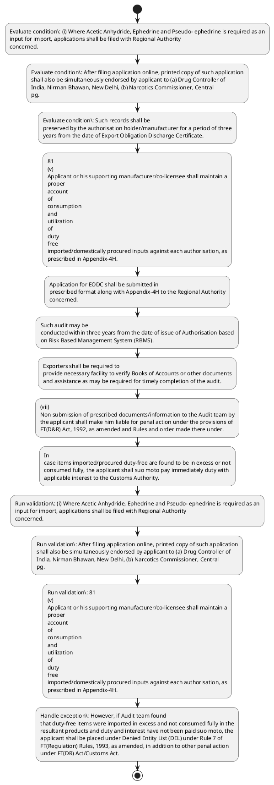

# Chapter 4 / Section 4.08: Cases involving Acetic Anhydride, Ephedrine and Pseudo- ephedrine

**Chapter Title:** Duty Exemption / Remission Schemes

**Pages:** 6, 7

**Purpose:** (i) Where Acetic Anhydride, Ephedrine and Pseudo- ephedrine is required as an
input for import, applications shall be filed with Regional Authority
concerned.

**Purpose Thanglish:** Indha Cases involving Acetic Anhydride, Ephedrine and Pseudo- ephedrine section-la, (i) Where Acetic Anhydride, Ephedrine and Pseudo- ephedrine is required as an
input for import, applications kandippa be filed with Regional authority
concerned.

**Summary:** 4.08 Cases involving Acetic Anhydride, Ephedrine and Pseudo- ephedrine
as inputs. (i) Where Acetic Anhydride, Ephedrine and Pseudo- ephedrine is required as an
input for import, applications shall be filed with Regional Authority
concerned. After filing application online, printed copy of such application
shall also be simultaneously endorsed by applicant to (a) Drug Controller of
India, Nirman Bhawan, New Delhi, (b) Narcotics Commissioner, Central
pg.

**Business Meaning:** Cases involving Acetic Anhydride, Ephedrine and Pseudo- ephedrine governs how DGFT business controls should be applied, validated, and enforced.

**Business Explanation:** Cases involving Acetic Anhydride, Ephedrine and Pseudo- ephedrine explains the operating rule set that DEKAI should enforce. Key control points include (i) Where Acetic Anhydride, Ephedrine and Pseudo- ephedrine is required as an
input for import, applications shall be filed with Regional Authority
concerned. The section also drives actions such as 81
(v)
Applicant or his supporting manufacturer/co-licensee shall maintain a
proper
account
of
consumption
and
utilization
of
duty
free
imported/domestically procured inputs against each authorisation, as
prescribed in Appendix-4H..

**Business Explanation Thanglish:** Indha Cases involving Acetic Anhydride, Ephedrine and Pseudo- ephedrine section-la, Cases involving Acetic Anhydride, Ephedrine and Pseudo- ephedrine explains the operating rule set that DEKAI should enforce. Key control points include (i) Where Acetic Anhydride, Ephedrine and Pseudo- ephedrine is required as an
input for import, applications kandippa be filed with Regional authority
concerned. The section also drives actions such as 81
(v)
Applicant or his supporting manufacturer/co-licensee kandippa maintain a
proper
account
of
consumption
and
utilization
of
duty
free
imported/domestically procured inputs against each authorisation, as
prescribed in Appendix-4H..

## Business Logic
- (i) Where Acetic Anhydride, Ephedrine and Pseudo- ephedrine is required as an
input for import, applications shall be filed with Regional Authority
concerned.
- After filing application online, printed copy of such application
shall also be simultaneously endorsed by applicant to (a) Drug Controller of
India, Nirman Bhawan, New Delhi, (b) Narcotics Commissioner, Central
pg.
- 81
(v)
Applicant or his supporting manufacturer/co-licensee shall maintain a
proper
account
of
consumption
and
utilization
of
duty
free
imported/domestically procured inputs against each authorisation, as
prescribed in Appendix-4H.
- Application for EODC shall be submitted in
prescribed format along with Appendix-4H to the Regional Authority
concerned.
- Regional Authority shall compare the details of Appendix-4H,
with that of the inputs allowed in the Authorisation.
- Such records shall be
preserved by the authorisation holder/manufacturer for a period of three
years from the date of Export Obligation Discharge Certificate.
- (vi)
Production and consumption records of the export item under this scheme
shall be audited by concerned Norms Committee.
- Exporters shall be required to
provide necessary facility to verify Books of Accounts or other documents
and assistance as may be required for timely completion of the audit.
- Concerned Norms Committee shall constitute the audit teams and specify the
manner of audit from time to time through administrative orders.
- (vii)
Non submission of prescribed documents/information to the Audit team by
the applicant shall make him liable for penal action under the provisions of
FT(D&R) Act, 1992, as amended and Rules and order made there under.
- In
case items imported/procured duty-free are found to be in excess or not
consumed fully, the applicant shall suo moto pay immediately duty with
applicable interest to the Customs Authority.
- However, if Audit team found
that duty-free items were imported in excess and not consumed fully in the
resultant products and duty and interest have not been paid suo moto, the
applicant shall be placed under Denied Entity List (DEL) under Rule 7 of
FT(Regulation) Rules, 1993, as amended, in addition to other penal action
under FT(DR) Act/Customs Act.
- The Chartered Engineer shall also be liable
for penal action for abetment under the provisions of Section 11(2) of the
FT(DR)Act.
- (viii)
All the provisions of Advance Authorisation scheme shall also be applicable
to this scheme in so far they are not inconsistent with the specific provisions
of this scheme.
- (i)
Where Acetic Anhydride, Ephedrine and Pseudo- ephedrine is required as an
input for import, applications shall be filed with Regional Authority
concerned.
- After filing application online, printed copy of such application
shall also be simultaneously endorsed by applicant to (a) Drug Controller of
India, Nirman Bhawan, New Delhi, (b) Narcotics Commissioner, Central
Bureau of Narcotics, Gwalior (c) respective Zonal Director of Narcotics
Control Bureau.
- The applicant should declare that they would maintain
prescribed records / documents and also submit prescribed returns to the
relevant authorities, within time as prescribed by law from time to time.
- (ii) Regional Authority shall endorse a copy of such Advance Authorisation to the
above three agencies.
- Regional Authority shall also endorse a condition that
before effecting imports, ‘No Objection Certificate’ shall be obtained from
Drug Controller and Narcotics Commissioner of India.

## Business Rules
- rule_id=CH4-SEC4_08-R001, rule_description=(i) Where Acetic Anhydride, Ephedrine and Pseudo- ephedrine is required as an
input for import, applications shall be filed with Regional Authority
concerned., trigger=Cases involving Acetic Anhydride, Ephedrine and Pseudo- ephedrine, condition=(i) Where Acetic Anhydride, Ephedrine and Pseudo- ephedrine is required as an
input for import, applications shall be filed with Regional Authority
concerned., validation=(i) Where Acetic Anhydride, Ephedrine and Pseudo- ephedrine is required as an
input for import, applications shall be filed with Regional Authority
concerned., action=81
(v)
Applicant or his supporting manufacturer/co-licensee shall maintain a
proper
account
of
consumption
and
utilization
of
duty
free
imported/domestically procured inputs against each authorisation, as
prescribed in Appendix-4H., exception=However, if Audit team found
that duty-free items were imported in excess and not consumed fully in the
resultant products and duty and interest have not been paid suo moto, the
applicant shall be placed under Denied Entity List (DEL) under Rule 7 of
FT(Regulation) Rules, 1993, as amended, in addition to other penal action
under FT(DR) Act/Customs Act., output=DEKAI should produce a compliance decision for 4.08 - Cases involving Acetic Anhydride, Ephedrine and Pseudo- ephedrine.
- rule_id=CH4-SEC4_08-R002, rule_description=After filing application online, printed copy of such application
shall also be simultaneously endorsed by applicant to (a) Drug Controller of
India, Nirman Bhawan, New Delhi, (b) Narcotics Commissioner, Central
pg., trigger=Cases involving Acetic Anhydride, Ephedrine and Pseudo- ephedrine, condition=After filing application online, printed copy of such application
shall also be simultaneously endorsed by applicant to (a) Drug Controller of
India, Nirman Bhawan, New Delhi, (b) Narcotics Commissioner, Central
pg., validation=After filing application online, printed copy of such application
shall also be simultaneously endorsed by applicant to (a) Drug Controller of
India, Nirman Bhawan, New Delhi, (b) Narcotics Commissioner, Central
pg., action=Application for EODC shall be submitted in
prescribed format along with Appendix-4H to the Regional Authority
concerned., exception=However, if Audit team found
that duty-free items were imported in excess and not consumed fully in the
resultant products and duty and interest have not been paid suo moto, the
applicant shall be placed under Denied Entity List (DEL) under Rule 7 of
FT(Regulation) Rules, 1993, as amended, in addition to other penal action
under FT(DR) Act/Customs Act., output=DEKAI should produce a compliance decision for 4.08 - Cases involving Acetic Anhydride, Ephedrine and Pseudo- ephedrine.
- rule_id=CH4-SEC4_08-R003, rule_description=81
(v)
Applicant or his supporting manufacturer/co-licensee shall maintain a
proper
account
of
consumption
and
utilization
of
duty
free
imported/domestically procured inputs against each authorisation, as
prescribed in Appendix-4H., trigger=Cases involving Acetic Anhydride, Ephedrine and Pseudo- ephedrine, condition=Such records shall be
preserved by the authorisation holder/manufacturer for a period of three
years from the date of Export Obligation Discharge Certificate., validation=81
(v)
Applicant or his supporting manufacturer/co-licensee shall maintain a
proper
account
of
consumption
and
utilization
of
duty
free
imported/domestically procured inputs against each authorisation, as
prescribed in Appendix-4H., action=Such audit may be
conducted within three years from the date of issue of Authorisation based
on Risk Based Management System (RBMS)., exception=However, if Audit team found
that duty-free items were imported in excess and not consumed fully in the
resultant products and duty and interest have not been paid suo moto, the
applicant shall be placed under Denied Entity List (DEL) under Rule 7 of
FT(Regulation) Rules, 1993, as amended, in addition to other penal action
under FT(DR) Act/Customs Act., output=DEKAI should produce a compliance decision for 4.08 - Cases involving Acetic Anhydride, Ephedrine and Pseudo- ephedrine.
- rule_id=CH4-SEC4_08-R004, rule_description=Application for EODC shall be submitted in
prescribed format along with Appendix-4H to the Regional Authority
concerned., trigger=Cases involving Acetic Anhydride, Ephedrine and Pseudo- ephedrine, condition=Exporters shall be required to
provide necessary facility to verify Books of Accounts or other documents
and assistance as may be required for timely completion of the audit., validation=Application for EODC shall be submitted in
prescribed format along with Appendix-4H to the Regional Authority
concerned., action=Exporters shall be required to
provide necessary facility to verify Books of Accounts or other documents
and assistance as may be required for timely completion of the audit., exception=However, if Audit team found
that duty-free items were imported in excess and not consumed fully in the
resultant products and duty and interest have not been paid suo moto, the
applicant shall be placed under Denied Entity List (DEL) under Rule 7 of
FT(Regulation) Rules, 1993, as amended, in addition to other penal action
under FT(DR) Act/Customs Act., output=DEKAI should produce a compliance decision for 4.08 - Cases involving Acetic Anhydride, Ephedrine and Pseudo- ephedrine.
- rule_id=CH4-SEC4_08-R005, rule_description=Regional Authority shall compare the details of Appendix-4H,
with that of the inputs allowed in the Authorisation., trigger=Cases involving Acetic Anhydride, Ephedrine and Pseudo- ephedrine, condition=Concerned Norms Committee shall constitute the audit teams and specify the
manner of audit from time to time through administrative orders., validation=Regional Authority shall compare the details of Appendix-4H,
with that of the inputs allowed in the Authorisation., action=(vii)
Non submission of prescribed documents/information to the Audit team by
the applicant shall make him liable for penal action under the provisions of
FT(D&R) Act, 1992, as amended and Rules and order made there under., exception=However, if Audit team found
that duty-free items were imported in excess and not consumed fully in the
resultant products and duty and interest have not been paid suo moto, the
applicant shall be placed under Denied Entity List (DEL) under Rule 7 of
FT(Regulation) Rules, 1993, as amended, in addition to other penal action
under FT(DR) Act/Customs Act., output=DEKAI should produce a compliance decision for 4.08 - Cases involving Acetic Anhydride, Ephedrine and Pseudo- ephedrine.
- rule_id=CH4-SEC4_08-R006, rule_description=Such records shall be
preserved by the authorisation holder/manufacturer for a period of three
years from the date of Export Obligation Discharge Certificate., trigger=Cases involving Acetic Anhydride, Ephedrine and Pseudo- ephedrine, condition=However, if Audit team found
that duty-free items were imported in excess and not consumed fully in the
resultant products and duty and interest have not been paid suo moto, the
applicant shall be placed under Denied Entity List (DEL) under Rule 7 of
FT(Regulation) Rules, 1993, as amended, in addition to other penal action
under FT(DR) Act/Customs Act., validation=Such records shall be
preserved by the authorisation holder/manufacturer for a period of three
years from the date of Export Obligation Discharge Certificate., action=In
case items imported/procured duty-free are found to be in excess or not
consumed fully, the applicant shall suo moto pay immediately duty with
applicable interest to the Customs Authority., exception=However, if Audit team found
that duty-free items were imported in excess and not consumed fully in the
resultant products and duty and interest have not been paid suo moto, the
applicant shall be placed under Denied Entity List (DEL) under Rule 7 of
FT(Regulation) Rules, 1993, as amended, in addition to other penal action
under FT(DR) Act/Customs Act., output=DEKAI should produce a compliance decision for 4.08 - Cases involving Acetic Anhydride, Ephedrine and Pseudo- ephedrine.
- rule_id=CH4-SEC4_08-R007, rule_description=(vi)
Production and consumption records of the export item under this scheme
shall be audited by concerned Norms Committee., trigger=Cases involving Acetic Anhydride, Ephedrine and Pseudo- ephedrine, condition=(viii)
All the provisions of Advance Authorisation scheme shall also be applicable
to this scheme in so far they are not inconsistent with the specific provisions
of this scheme., validation=(vi)
Production and consumption records of the export item under this scheme
shall be audited by concerned Norms Committee., action=However, if Audit team found
that duty-free items were imported in excess and not consumed fully in the
resultant products and duty and interest have not been paid suo moto, the
applicant shall be placed under Denied Entity List (DEL) under Rule 7 of
FT(Regulation) Rules, 1993, as amended, in addition to other penal action
under FT(DR) Act/Customs Act., exception=However, if Audit team found
that duty-free items were imported in excess and not consumed fully in the
resultant products and duty and interest have not been paid suo moto, the
applicant shall be placed under Denied Entity List (DEL) under Rule 7 of
FT(Regulation) Rules, 1993, as amended, in addition to other penal action
under FT(DR) Act/Customs Act., output=DEKAI should produce a compliance decision for 4.08 - Cases involving Acetic Anhydride, Ephedrine and Pseudo- ephedrine.
- rule_id=CH4-SEC4_08-R008, rule_description=Exporters shall be required to
provide necessary facility to verify Books of Accounts or other documents
and assistance as may be required for timely completion of the audit., trigger=Cases involving Acetic Anhydride, Ephedrine and Pseudo- ephedrine, condition=(i)
Where Acetic Anhydride, Ephedrine and Pseudo- ephedrine is required as an
input for import, applications shall be filed with Regional Authority
concerned., validation=Exporters shall be required to
provide necessary facility to verify Books of Accounts or other documents
and assistance as may be required for timely completion of the audit., action=The applicant should declare that they would maintain
prescribed records / documents and also submit prescribed returns to the
relevant authorities, within time as prescribed by law from time to time., exception=However, if Audit team found
that duty-free items were imported in excess and not consumed fully in the
resultant products and duty and interest have not been paid suo moto, the
applicant shall be placed under Denied Entity List (DEL) under Rule 7 of
FT(Regulation) Rules, 1993, as amended, in addition to other penal action
under FT(DR) Act/Customs Act., output=DEKAI should produce a compliance decision for 4.08 - Cases involving Acetic Anhydride, Ephedrine and Pseudo- ephedrine.
- rule_id=CH4-SEC4_08-R009, rule_description=Concerned Norms Committee shall constitute the audit teams and specify the
manner of audit from time to time through administrative orders., trigger=Cases involving Acetic Anhydride, Ephedrine and Pseudo- ephedrine, condition=After filing application online, printed copy of such application
shall also be simultaneously endorsed by applicant to (a) Drug Controller of
India, Nirman Bhawan, New Delhi, (b) Narcotics Commissioner, Central
Bureau of Narcotics, Gwalior (c) respective Zonal Director of Narcotics
Control Bureau., validation=Concerned Norms Committee shall constitute the audit teams and specify the
manner of audit from time to time through administrative orders., action=Regional Authority shall also endorse a condition that
before effecting imports, ‘No Objection Certificate’ shall be obtained from
Drug Controller and Narcotics Commissioner of India., exception=However, if Audit team found
that duty-free items were imported in excess and not consumed fully in the
resultant products and duty and interest have not been paid suo moto, the
applicant shall be placed under Denied Entity List (DEL) under Rule 7 of
FT(Regulation) Rules, 1993, as amended, in addition to other penal action
under FT(DR) Act/Customs Act., output=DEKAI should produce a compliance decision for 4.08 - Cases involving Acetic Anhydride, Ephedrine and Pseudo- ephedrine.
- rule_id=CH4-SEC4_08-R010, rule_description=(vii)
Non submission of prescribed documents/information to the Audit team by
the applicant shall make him liable for penal action under the provisions of
FT(D&R) Act, 1992, as amended and Rules and order made there under., trigger=Cases involving Acetic Anhydride, Ephedrine and Pseudo- ephedrine, condition=Regional Authority shall also endorse a condition that
before effecting imports, ‘No Objection Certificate’ shall be obtained from
Drug Controller and Narcotics Commissioner of India., validation=(vii)
Non submission of prescribed documents/information to the Audit team by
the applicant shall make him liable for penal action under the provisions of
FT(D&R) Act, 1992, as amended and Rules and order made there under., action=Regional Authority shall also endorse a condition that
before effecting imports, ‘No Objection Certificate’ shall be obtained from
Drug Controller and Narcotics Commissioner of India., exception=However, if Audit team found
that duty-free items were imported in excess and not consumed fully in the
resultant products and duty and interest have not been paid suo moto, the
applicant shall be placed under Denied Entity List (DEL) under Rule 7 of
FT(Regulation) Rules, 1993, as amended, in addition to other penal action
under FT(DR) Act/Customs Act., output=DEKAI should produce a compliance decision for 4.08 - Cases involving Acetic Anhydride, Ephedrine and Pseudo- ephedrine.
- rule_id=CH4-SEC4_08-R011, rule_description=In
case items imported/procured duty-free are found to be in excess or not
consumed fully, the applicant shall suo moto pay immediately duty with
applicable interest to the Customs Authority., trigger=Cases involving Acetic Anhydride, Ephedrine and Pseudo- ephedrine, condition=Regional Authority shall also endorse a condition that
before effecting imports, ‘No Objection Certificate’ shall be obtained from
Drug Controller and Narcotics Commissioner of India., validation=In
case items imported/procured duty-free are found to be in excess or not
consumed fully, the applicant shall suo moto pay immediately duty with
applicable interest to the Customs Authority., action=Regional Authority shall also endorse a condition that
before effecting imports, ‘No Objection Certificate’ shall be obtained from
Drug Controller and Narcotics Commissioner of India., exception=However, if Audit team found
that duty-free items were imported in excess and not consumed fully in the
resultant products and duty and interest have not been paid suo moto, the
applicant shall be placed under Denied Entity List (DEL) under Rule 7 of
FT(Regulation) Rules, 1993, as amended, in addition to other penal action
under FT(DR) Act/Customs Act., output=DEKAI should produce a compliance decision for 4.08 - Cases involving Acetic Anhydride, Ephedrine and Pseudo- ephedrine.
- rule_id=CH4-SEC4_08-R012, rule_description=However, if Audit team found
that duty-free items were imported in excess and not consumed fully in the
resultant products and duty and interest have not been paid suo moto, the
applicant shall be placed under Denied Entity List (DEL) under Rule 7 of
FT(Regulation) Rules, 1993, as amended, in addition to other penal action
under FT(DR) Act/Customs Act., trigger=Cases involving Acetic Anhydride, Ephedrine and Pseudo- ephedrine, condition=Regional Authority shall also endorse a condition that
before effecting imports, ‘No Objection Certificate’ shall be obtained from
Drug Controller and Narcotics Commissioner of India., validation=However, if Audit team found
that duty-free items were imported in excess and not consumed fully in the
resultant products and duty and interest have not been paid suo moto, the
applicant shall be placed under Denied Entity List (DEL) under Rule 7 of
FT(Regulation) Rules, 1993, as amended, in addition to other penal action
under FT(DR) Act/Customs Act., action=Regional Authority shall also endorse a condition that
before effecting imports, ‘No Objection Certificate’ shall be obtained from
Drug Controller and Narcotics Commissioner of India., exception=However, if Audit team found
that duty-free items were imported in excess and not consumed fully in the
resultant products and duty and interest have not been paid suo moto, the
applicant shall be placed under Denied Entity List (DEL) under Rule 7 of
FT(Regulation) Rules, 1993, as amended, in addition to other penal action
under FT(DR) Act/Customs Act., output=DEKAI should produce a compliance decision for 4.08 - Cases involving Acetic Anhydride, Ephedrine and Pseudo- ephedrine.
- rule_id=CH4-SEC4_08-R013, rule_description=The Chartered Engineer shall also be liable
for penal action for abetment under the provisions of Section 11(2) of the
FT(DR)Act., trigger=Cases involving Acetic Anhydride, Ephedrine and Pseudo- ephedrine, condition=Regional Authority shall also endorse a condition that
before effecting imports, ‘No Objection Certificate’ shall be obtained from
Drug Controller and Narcotics Commissioner of India., validation=The Chartered Engineer shall also be liable
for penal action for abetment under the provisions of Section 11(2) of the
FT(DR)Act., action=Regional Authority shall also endorse a condition that
before effecting imports, ‘No Objection Certificate’ shall be obtained from
Drug Controller and Narcotics Commissioner of India., exception=However, if Audit team found
that duty-free items were imported in excess and not consumed fully in the
resultant products and duty and interest have not been paid suo moto, the
applicant shall be placed under Denied Entity List (DEL) under Rule 7 of
FT(Regulation) Rules, 1993, as amended, in addition to other penal action
under FT(DR) Act/Customs Act., output=DEKAI should produce a compliance decision for 4.08 - Cases involving Acetic Anhydride, Ephedrine and Pseudo- ephedrine.
- rule_id=CH4-SEC4_08-R014, rule_description=(viii)
All the provisions of Advance Authorisation scheme shall also be applicable
to this scheme in so far they are not inconsistent with the specific provisions
of this scheme., trigger=Cases involving Acetic Anhydride, Ephedrine and Pseudo- ephedrine, condition=Regional Authority shall also endorse a condition that
before effecting imports, ‘No Objection Certificate’ shall be obtained from
Drug Controller and Narcotics Commissioner of India., validation=(viii)
All the provisions of Advance Authorisation scheme shall also be applicable
to this scheme in so far they are not inconsistent with the specific provisions
of this scheme., action=Regional Authority shall also endorse a condition that
before effecting imports, ‘No Objection Certificate’ shall be obtained from
Drug Controller and Narcotics Commissioner of India., exception=However, if Audit team found
that duty-free items were imported in excess and not consumed fully in the
resultant products and duty and interest have not been paid suo moto, the
applicant shall be placed under Denied Entity List (DEL) under Rule 7 of
FT(Regulation) Rules, 1993, as amended, in addition to other penal action
under FT(DR) Act/Customs Act., output=DEKAI should produce a compliance decision for 4.08 - Cases involving Acetic Anhydride, Ephedrine and Pseudo- ephedrine.
- rule_id=CH4-SEC4_08-R015, rule_description=(i)
Where Acetic Anhydride, Ephedrine and Pseudo- ephedrine is required as an
input for import, applications shall be filed with Regional Authority
concerned., trigger=Cases involving Acetic Anhydride, Ephedrine and Pseudo- ephedrine, condition=Regional Authority shall also endorse a condition that
before effecting imports, ‘No Objection Certificate’ shall be obtained from
Drug Controller and Narcotics Commissioner of India., validation=(i)
Where Acetic Anhydride, Ephedrine and Pseudo- ephedrine is required as an
input for import, applications shall be filed with Regional Authority
concerned., action=Regional Authority shall also endorse a condition that
before effecting imports, ‘No Objection Certificate’ shall be obtained from
Drug Controller and Narcotics Commissioner of India., exception=However, if Audit team found
that duty-free items were imported in excess and not consumed fully in the
resultant products and duty and interest have not been paid suo moto, the
applicant shall be placed under Denied Entity List (DEL) under Rule 7 of
FT(Regulation) Rules, 1993, as amended, in addition to other penal action
under FT(DR) Act/Customs Act., output=DEKAI should produce a compliance decision for 4.08 - Cases involving Acetic Anhydride, Ephedrine and Pseudo- ephedrine.
- rule_id=CH4-SEC4_08-R016, rule_description=After filing application online, printed copy of such application
shall also be simultaneously endorsed by applicant to (a) Drug Controller of
India, Nirman Bhawan, New Delhi, (b) Narcotics Commissioner, Central
Bureau of Narcotics, Gwalior (c) respective Zonal Director of Narcotics
Control Bureau., trigger=Cases involving Acetic Anhydride, Ephedrine and Pseudo- ephedrine, condition=Regional Authority shall also endorse a condition that
before effecting imports, ‘No Objection Certificate’ shall be obtained from
Drug Controller and Narcotics Commissioner of India., validation=After filing application online, printed copy of such application
shall also be simultaneously endorsed by applicant to (a) Drug Controller of
India, Nirman Bhawan, New Delhi, (b) Narcotics Commissioner, Central
Bureau of Narcotics, Gwalior (c) respective Zonal Director of Narcotics
Control Bureau., action=Regional Authority shall also endorse a condition that
before effecting imports, ‘No Objection Certificate’ shall be obtained from
Drug Controller and Narcotics Commissioner of India., exception=However, if Audit team found
that duty-free items were imported in excess and not consumed fully in the
resultant products and duty and interest have not been paid suo moto, the
applicant shall be placed under Denied Entity List (DEL) under Rule 7 of
FT(Regulation) Rules, 1993, as amended, in addition to other penal action
under FT(DR) Act/Customs Act., output=DEKAI should produce a compliance decision for 4.08 - Cases involving Acetic Anhydride, Ephedrine and Pseudo- ephedrine.
- rule_id=CH4-SEC4_08-R017, rule_description=The applicant should declare that they would maintain
prescribed records / documents and also submit prescribed returns to the
relevant authorities, within time as prescribed by law from time to time., trigger=Cases involving Acetic Anhydride, Ephedrine and Pseudo- ephedrine, condition=Regional Authority shall also endorse a condition that
before effecting imports, ‘No Objection Certificate’ shall be obtained from
Drug Controller and Narcotics Commissioner of India., validation=(ii) Regional Authority shall endorse a copy of such Advance Authorisation to the
above three agencies., action=Regional Authority shall also endorse a condition that
before effecting imports, ‘No Objection Certificate’ shall be obtained from
Drug Controller and Narcotics Commissioner of India., exception=However, if Audit team found
that duty-free items were imported in excess and not consumed fully in the
resultant products and duty and interest have not been paid suo moto, the
applicant shall be placed under Denied Entity List (DEL) under Rule 7 of
FT(Regulation) Rules, 1993, as amended, in addition to other penal action
under FT(DR) Act/Customs Act., output=DEKAI should produce a compliance decision for 4.08 - Cases involving Acetic Anhydride, Ephedrine and Pseudo- ephedrine.
- rule_id=CH4-SEC4_08-R018, rule_description=(ii) Regional Authority shall endorse a copy of such Advance Authorisation to the
above three agencies., trigger=Cases involving Acetic Anhydride, Ephedrine and Pseudo- ephedrine, condition=Regional Authority shall also endorse a condition that
before effecting imports, ‘No Objection Certificate’ shall be obtained from
Drug Controller and Narcotics Commissioner of India., validation=Regional Authority shall also endorse a condition that
before effecting imports, ‘No Objection Certificate’ shall be obtained from
Drug Controller and Narcotics Commissioner of India., action=Regional Authority shall also endorse a condition that
before effecting imports, ‘No Objection Certificate’ shall be obtained from
Drug Controller and Narcotics Commissioner of India., exception=However, if Audit team found
that duty-free items were imported in excess and not consumed fully in the
resultant products and duty and interest have not been paid suo moto, the
applicant shall be placed under Denied Entity List (DEL) under Rule 7 of
FT(Regulation) Rules, 1993, as amended, in addition to other penal action
under FT(DR) Act/Customs Act., output=DEKAI should produce a compliance decision for 4.08 - Cases involving Acetic Anhydride, Ephedrine and Pseudo- ephedrine.
- rule_id=CH4-SEC4_08-R019, rule_description=Regional Authority shall also endorse a condition that
before effecting imports, ‘No Objection Certificate’ shall be obtained from
Drug Controller and Narcotics Commissioner of India., trigger=Cases involving Acetic Anhydride, Ephedrine and Pseudo- ephedrine, condition=Regional Authority shall also endorse a condition that
before effecting imports, ‘No Objection Certificate’ shall be obtained from
Drug Controller and Narcotics Commissioner of India., validation=Regional Authority shall also endorse a condition that
before effecting imports, ‘No Objection Certificate’ shall be obtained from
Drug Controller and Narcotics Commissioner of India., action=Regional Authority shall also endorse a condition that
before effecting imports, ‘No Objection Certificate’ shall be obtained from
Drug Controller and Narcotics Commissioner of India., exception=However, if Audit team found
that duty-free items were imported in excess and not consumed fully in the
resultant products and duty and interest have not been paid suo moto, the
applicant shall be placed under Denied Entity List (DEL) under Rule 7 of
FT(Regulation) Rules, 1993, as amended, in addition to other penal action
under FT(DR) Act/Customs Act., output=DEKAI should produce a compliance decision for 4.08 - Cases involving Acetic Anhydride, Ephedrine and Pseudo- ephedrine.

## Conditions
- (i) Where Acetic Anhydride, Ephedrine and Pseudo- ephedrine is required as an
input for import, applications shall be filed with Regional Authority
concerned.
- After filing application online, printed copy of such application
shall also be simultaneously endorsed by applicant to (a) Drug Controller of
India, Nirman Bhawan, New Delhi, (b) Narcotics Commissioner, Central
pg.
- Such records shall be
preserved by the authorisation holder/manufacturer for a period of three
years from the date of Export Obligation Discharge Certificate.
- Exporters shall be required to
provide necessary facility to verify Books of Accounts or other documents
and assistance as may be required for timely completion of the audit.
- Concerned Norms Committee shall constitute the audit teams and specify the
manner of audit from time to time through administrative orders.
- However, if Audit team found
that duty-free items were imported in excess and not consumed fully in the
resultant products and duty and interest have not been paid suo moto, the
applicant shall be placed under Denied Entity List (DEL) under Rule 7 of
FT(Regulation) Rules, 1993, as amended, in addition to other penal action
under FT(DR) Act/Customs Act.
- (viii)
All the provisions of Advance Authorisation scheme shall also be applicable
to this scheme in so far they are not inconsistent with the specific provisions
of this scheme.
- (i)
Where Acetic Anhydride, Ephedrine and Pseudo- ephedrine is required as an
input for import, applications shall be filed with Regional Authority
concerned.
- After filing application online, printed copy of such application
shall also be simultaneously endorsed by applicant to (a) Drug Controller of
India, Nirman Bhawan, New Delhi, (b) Narcotics Commissioner, Central
Bureau of Narcotics, Gwalior (c) respective Zonal Director of Narcotics
Control Bureau.
- Regional Authority shall also endorse a condition that
before effecting imports, ‘No Objection Certificate’ shall be obtained from
Drug Controller and Narcotics Commissioner of India.

## Condition Logic
- id=4.4.08.1, if=(i) Where Acetic Anhydride, Ephedrine and Pseudo- ephedrine is required as an
input for import, applications shall be filed with Regional Authority
concerned., then=81
(v)
Applicant or his supporting manufacturer/co-licensee shall maintain a
proper
account
of
consumption
and
utilization
of
duty
free
imported/domestically procured inputs against each authorisation, as
prescribed in Appendix-4H., source=(i) Where Acetic Anhydride, Ephedrine and Pseudo- ephedrine is required as an
input for import, applications shall be filed with Regional Authority
concerned.
- id=4.4.08.2, if=After filing application online, printed copy of such application
shall also be simultaneously endorsed by applicant to (a) Drug Controller of
India, Nirman Bhawan, New Delhi, (b) Narcotics Commissioner, Central
pg., then=81
(v)
Applicant or his supporting manufacturer/co-licensee shall maintain a
proper
account
of
consumption
and
utilization
of
duty
free
imported/domestically procured inputs against each authorisation, as
prescribed in Appendix-4H., source=After filing application online, printed copy of such application
shall also be simultaneously endorsed by applicant to (a) Drug Controller of
India, Nirman Bhawan, New Delhi, (b) Narcotics Commissioner, Central
pg.
- id=4.4.08.3, if=Such records shall be
preserved by the authorisation holder/manufacturer for a period of three
years from the date of Export Obligation Discharge Certificate., then=81
(v)
Applicant or his supporting manufacturer/co-licensee shall maintain a
proper
account
of
consumption
and
utilization
of
duty
free
imported/domestically procured inputs against each authorisation, as
prescribed in Appendix-4H., source=Such records shall be
preserved by the authorisation holder/manufacturer for a period of three
years from the date of Export Obligation Discharge Certificate.
- id=4.4.08.4, if=Exporters shall be required to
provide necessary facility to verify Books of Accounts or other documents
and assistance as may be required for timely completion of the audit., then=81
(v)
Applicant or his supporting manufacturer/co-licensee shall maintain a
proper
account
of
consumption
and
utilization
of
duty
free
imported/domestically procured inputs against each authorisation, as
prescribed in Appendix-4H., source=Exporters shall be required to
provide necessary facility to verify Books of Accounts or other documents
and assistance as may be required for timely completion of the audit.
- id=4.4.08.5, if=Concerned Norms Committee shall constitute the audit teams and specify the
manner of audit from time to time through administrative orders., then=81
(v)
Applicant or his supporting manufacturer/co-licensee shall maintain a
proper
account
of
consumption
and
utilization
of
duty
free
imported/domestically procured inputs against each authorisation, as
prescribed in Appendix-4H., source=Concerned Norms Committee shall constitute the audit teams and specify the
manner of audit from time to time through administrative orders.
- id=4.4.08.6, if=However, if Audit team found
that duty-free items were imported in excess and not consumed fully in the
resultant products and duty and interest have not been paid suo moto, the
applicant shall be placed under Denied Entity List (DEL) under Rule 7 of
FT(Regulation) Rules, 1993, as amended, in addition to other penal action
under FT(DR) Act/Customs Act., then=81
(v)
Applicant or his supporting manufacturer/co-licensee shall maintain a
proper
account
of
consumption
and
utilization
of
duty
free
imported/domestically procured inputs against each authorisation, as
prescribed in Appendix-4H., source=However, if Audit team found
that duty-free items were imported in excess and not consumed fully in the
resultant products and duty and interest have not been paid suo moto, the
applicant shall be placed under Denied Entity List (DEL) under Rule 7 of
FT(Regulation) Rules, 1993, as amended, in addition to other penal action
under FT(DR) Act/Customs Act.
- id=4.4.08.7, if=(viii)
All the provisions of Advance Authorisation scheme shall also be applicable
to this scheme in so far they are not inconsistent with the specific provisions
of this scheme., then=81
(v)
Applicant or his supporting manufacturer/co-licensee shall maintain a
proper
account
of
consumption
and
utilization
of
duty
free
imported/domestically procured inputs against each authorisation, as
prescribed in Appendix-4H., source=(viii)
All the provisions of Advance Authorisation scheme shall also be applicable
to this scheme in so far they are not inconsistent with the specific provisions
of this scheme.
- id=4.4.08.8, if=(i)
Where Acetic Anhydride, Ephedrine and Pseudo- ephedrine is required as an
input for import, applications shall be filed with Regional Authority
concerned., then=81
(v)
Applicant or his supporting manufacturer/co-licensee shall maintain a
proper
account
of
consumption
and
utilization
of
duty
free
imported/domestically procured inputs against each authorisation, as
prescribed in Appendix-4H., source=(i)
Where Acetic Anhydride, Ephedrine and Pseudo- ephedrine is required as an
input for import, applications shall be filed with Regional Authority
concerned.
- id=4.4.08.9, if=After filing application online, printed copy of such application
shall also be simultaneously endorsed by applicant to (a) Drug Controller of
India, Nirman Bhawan, New Delhi, (b) Narcotics Commissioner, Central
Bureau of Narcotics, Gwalior (c) respective Zonal Director of Narcotics
Control Bureau., then=81
(v)
Applicant or his supporting manufacturer/co-licensee shall maintain a
proper
account
of
consumption
and
utilization
of
duty
free
imported/domestically procured inputs against each authorisation, as
prescribed in Appendix-4H., source=After filing application online, printed copy of such application
shall also be simultaneously endorsed by applicant to (a) Drug Controller of
India, Nirman Bhawan, New Delhi, (b) Narcotics Commissioner, Central
Bureau of Narcotics, Gwalior (c) respective Zonal Director of Narcotics
Control Bureau.
- id=4.4.08.10, if=Regional Authority shall also endorse a condition that
before effecting imports, ‘No Objection Certificate’ shall be obtained from
Drug Controller and Narcotics Commissioner of India., then=81
(v)
Applicant or his supporting manufacturer/co-licensee shall maintain a
proper
account
of
consumption
and
utilization
of
duty
free
imported/domestically procured inputs against each authorisation, as
prescribed in Appendix-4H., source=Regional Authority shall also endorse a condition that
before effecting imports, ‘No Objection Certificate’ shall be obtained from
Drug Controller and Narcotics Commissioner of India.

## Validations
- (i) Where Acetic Anhydride, Ephedrine and Pseudo- ephedrine is required as an
input for import, applications shall be filed with Regional Authority
concerned.
- After filing application online, printed copy of such application
shall also be simultaneously endorsed by applicant to (a) Drug Controller of
India, Nirman Bhawan, New Delhi, (b) Narcotics Commissioner, Central
pg.
- 81
(v)
Applicant or his supporting manufacturer/co-licensee shall maintain a
proper
account
of
consumption
and
utilization
of
duty
free
imported/domestically procured inputs against each authorisation, as
prescribed in Appendix-4H.
- Application for EODC shall be submitted in
prescribed format along with Appendix-4H to the Regional Authority
concerned.
- Regional Authority shall compare the details of Appendix-4H,
with that of the inputs allowed in the Authorisation.
- Such records shall be
preserved by the authorisation holder/manufacturer for a period of three
years from the date of Export Obligation Discharge Certificate.
- (vi)
Production and consumption records of the export item under this scheme
shall be audited by concerned Norms Committee.
- Exporters shall be required to
provide necessary facility to verify Books of Accounts or other documents
and assistance as may be required for timely completion of the audit.
- Concerned Norms Committee shall constitute the audit teams and specify the
manner of audit from time to time through administrative orders.
- (vii)
Non submission of prescribed documents/information to the Audit team by
the applicant shall make him liable for penal action under the provisions of
FT(D&R) Act, 1992, as amended and Rules and order made there under.
- In
case items imported/procured duty-free are found to be in excess or not
consumed fully, the applicant shall suo moto pay immediately duty with
applicable interest to the Customs Authority.
- However, if Audit team found
that duty-free items were imported in excess and not consumed fully in the
resultant products and duty and interest have not been paid suo moto, the
applicant shall be placed under Denied Entity List (DEL) under Rule 7 of
FT(Regulation) Rules, 1993, as amended, in addition to other penal action
under FT(DR) Act/Customs Act.
- The Chartered Engineer shall also be liable
for penal action for abetment under the provisions of Section 11(2) of the
FT(DR)Act.
- (viii)
All the provisions of Advance Authorisation scheme shall also be applicable
to this scheme in so far they are not inconsistent with the specific provisions
of this scheme.
- (i)
Where Acetic Anhydride, Ephedrine and Pseudo- ephedrine is required as an
input for import, applications shall be filed with Regional Authority
concerned.
- After filing application online, printed copy of such application
shall also be simultaneously endorsed by applicant to (a) Drug Controller of
India, Nirman Bhawan, New Delhi, (b) Narcotics Commissioner, Central
Bureau of Narcotics, Gwalior (c) respective Zonal Director of Narcotics
Control Bureau.
- (ii) Regional Authority shall endorse a copy of such Advance Authorisation to the
above three agencies.
- Regional Authority shall also endorse a condition that
before effecting imports, ‘No Objection Certificate’ shall be obtained from
Drug Controller and Narcotics Commissioner of India.

## Exceptions
- However, if Audit team found
that duty-free items were imported in excess and not consumed fully in the
resultant products and duty and interest have not been paid suo moto, the
applicant shall be placed under Denied Entity List (DEL) under Rule 7 of
FT(Regulation) Rules, 1993, as amended, in addition to other penal action
under FT(DR) Act/Customs Act.

## Dependencies
- 11
- 1
- 2
- 3
- 4

## Authorities
- Regional Authority
- Narcotics Commissioner
- Norms Committee
- Concerned Norms Committee
- Customs
- Customs Authority
- FT(DR) Act/Customs
- Drug Controller and Narcotics Commissioner

## Required Documents
- (i) Where Acetic Anhydride, Ephedrine and Pseudo- ephedrine is required as an
input for import, applications shall be filed with Regional Authority
concerned.
- After filing application online, printed copy of such application
shall also be simultaneously endorsed by applicant to (a) Drug Controller of
India, Nirman Bhawan, New Delhi, (b) Narcotics Commissioner, Central
pg.
- 81
(v)
Applicant or his supporting manufacturer/co-licensee shall maintain a
proper
account
of
consumption
and
utilization
of
duty
free
imported/domestically procured inputs against each authorisation, as
prescribed in Appendix-4H.
- Application for EODC shall be submitted in
prescribed format along with Appendix-4H to the Regional Authority
concerned.
- Export Obligation Discharge Certificate
- Exporters shall be required to
provide necessary facility to verify Books of Accounts or other documents
and assistance as may be required for timely completion of the audit.
- (vii)
Non submission of prescribed documents/information to the Audit team by
the applicant shall make him liable for penal action under the provisions of
FT(D&R) Act, 1992, as amended and Rules and order made there under.
- (i)
Where Acetic Anhydride, Ephedrine and Pseudo- ephedrine is required as an
input for import, applications shall be filed with Regional Authority
concerned.
- After filing application online, printed copy of such application
shall also be simultaneously endorsed by applicant to (a) Drug Controller of
India, Nirman Bhawan, New Delhi, (b) Narcotics Commissioner, Central
Bureau of Narcotics, Gwalior (c) respective Zonal Director of Narcotics
Control Bureau.
- The applicant should declare that they would maintain
prescribed records / documents and also submit prescribed returns to the
relevant authorities, within time as prescribed by law from time to time.
- (ii) Regional Authority shall endorse a copy of such Advance Authorisation to the
above three agencies.
- No Objection Certificate

## Timelines
- After filing application online, printed copy of such application
shall also be simultaneously endorsed by applicant to (a) Drug Controller of
India, Nirman Bhawan, New Delhi, (b) Narcotics Commissioner, Central
pg.
- Such records shall be
preserved by the authorisation holder/manufacturer for a period of three
years from the date of Export Obligation Discharge Certificate.
- Such audit may be
conducted within three years from the date of issue of Authorisation based
on Risk Based Management System (RBMS).
- In
case items imported/procured duty-free are found to be in excess or not
consumed fully, the applicant shall suo moto pay immediately duty with
applicable interest to the Customs Authority.
- After filing application online, printed copy of such application
shall also be simultaneously endorsed by applicant to (a) Drug Controller of
India, Nirman Bhawan, New Delhi, (b) Narcotics Commissioner, Central
Bureau of Narcotics, Gwalior (c) respective Zonal Director of Narcotics
Control Bureau.
- The applicant should declare that they would maintain
prescribed records / documents and also submit prescribed returns to the
relevant authorities, within time as prescribed by law from time to time.
- Regional Authority shall also endorse a condition that
before effecting imports, ‘No Objection Certificate’ shall be obtained from
Drug Controller and Narcotics Commissioner of India.

## Actions
- 81
(v)
Applicant or his supporting manufacturer/co-licensee shall maintain a
proper
account
of
consumption
and
utilization
of
duty
free
imported/domestically procured inputs against each authorisation, as
prescribed in Appendix-4H.
- Application for EODC shall be submitted in
prescribed format along with Appendix-4H to the Regional Authority
concerned.
- Such audit may be
conducted within three years from the date of issue of Authorisation based
on Risk Based Management System (RBMS).
- Exporters shall be required to
provide necessary facility to verify Books of Accounts or other documents
and assistance as may be required for timely completion of the audit.
- (vii)
Non submission of prescribed documents/information to the Audit team by
the applicant shall make him liable for penal action under the provisions of
FT(D&R) Act, 1992, as amended and Rules and order made there under.
- In
case items imported/procured duty-free are found to be in excess or not
consumed fully, the applicant shall suo moto pay immediately duty with
applicable interest to the Customs Authority.
- However, if Audit team found
that duty-free items were imported in excess and not consumed fully in the
resultant products and duty and interest have not been paid suo moto, the
applicant shall be placed under Denied Entity List (DEL) under Rule 7 of
FT(Regulation) Rules, 1993, as amended, in addition to other penal action
under FT(DR) Act/Customs Act.
- The applicant should declare that they would maintain
prescribed records / documents and also submit prescribed returns to the
relevant authorities, within time as prescribed by law from time to time.
- Regional Authority shall also endorse a condition that
before effecting imports, ‘No Objection Certificate’ shall be obtained from
Drug Controller and Narcotics Commissioner of India.

## Workflow
- Evaluate condition: (i) Where Acetic Anhydride, Ephedrine and Pseudo- ephedrine is required as an
input for import, applications shall be filed with Regional Authority
concerned.
- Evaluate condition: After filing application online, printed copy of such application
shall also be simultaneously endorsed by applicant to (a) Drug Controller of
India, Nirman Bhawan, New Delhi, (b) Narcotics Commissioner, Central
pg.
- Evaluate condition: Such records shall be
preserved by the authorisation holder/manufacturer for a period of three
years from the date of Export Obligation Discharge Certificate.
- 81
(v)
Applicant or his supporting manufacturer/co-licensee shall maintain a
proper
account
of
consumption
and
utilization
of
duty
free
imported/domestically procured inputs against each authorisation, as
prescribed in Appendix-4H.
- Application for EODC shall be submitted in
prescribed format along with Appendix-4H to the Regional Authority
concerned.
- Such audit may be
conducted within three years from the date of issue of Authorisation based
on Risk Based Management System (RBMS).
- Exporters shall be required to
provide necessary facility to verify Books of Accounts or other documents
and assistance as may be required for timely completion of the audit.
- (vii)
Non submission of prescribed documents/information to the Audit team by
the applicant shall make him liable for penal action under the provisions of
FT(D&R) Act, 1992, as amended and Rules and order made there under.
- In
case items imported/procured duty-free are found to be in excess or not
consumed fully, the applicant shall suo moto pay immediately duty with
applicable interest to the Customs Authority.
- Run validation: (i) Where Acetic Anhydride, Ephedrine and Pseudo- ephedrine is required as an
input for import, applications shall be filed with Regional Authority
concerned.
- Run validation: After filing application online, printed copy of such application
shall also be simultaneously endorsed by applicant to (a) Drug Controller of
India, Nirman Bhawan, New Delhi, (b) Narcotics Commissioner, Central
pg.
- Run validation: 81
(v)
Applicant or his supporting manufacturer/co-licensee shall maintain a
proper
account
of
consumption
and
utilization
of
duty
free
imported/domestically procured inputs against each authorisation, as
prescribed in Appendix-4H.
- Handle exception: However, if Audit team found
that duty-free items were imported in excess and not consumed fully in the
resultant products and duty and interest have not been paid suo moto, the
applicant shall be placed under Denied Entity List (DEL) under Rule 7 of
FT(Regulation) Rules, 1993, as amended, in addition to other penal action
under FT(DR) Act/Customs Act.

## Workflow ASCII
```text
Cases involving Acetic Anhydride, Ephedrine and Pseudo- ephedrine
Evaluate condition: (i) Where Acetic Anhydride, Ephedrine and Pseudo- ephedrine is required as an
input for import, applications shall be filed with Regional Authority
concerned.
   |
   v
Evaluate condition: After filing application online, printed copy of such application
shall also be simultaneously endorsed by applicant to (a) Drug Controller of
India, Nirman Bhawan, New Delhi, (b) Narcotics Commissioner, Central
pg.
   |
   v
Evaluate condition: Such records shall be
preserved by the authorisation holder/manufacturer for a period of three
years from the date of Export Obligation Discharge Certificate.
   |
   v
81
(v)
Applicant or his supporting manufacturer/co-licensee shall maintain a
proper
account
of
consumption
and
utilization
of
duty
free
imported/domestically procured inputs against each authorisation, as
prescribed in Appendix-4H.
   |
   v
Application for EODC shall be submitted in
prescribed format along with Appendix-4H to the Regional Authority
concerned.
   |
   v
Such audit may be
conducted within three years from the date of issue of Authorisation based
on Risk Based Management System (RBMS).
   |
   v
Exporters shall be required to
provide necessary facility to verify Books of Accounts or other documents
and assistance as may be required for timely completion of the audit.
   |
   v
(vii)
Non submission of prescribed documents/information to the Audit team by
the applicant shall make him liable for penal action under the provisions of
FT(D&R) Act, 1992, as amended and Rules and order made there under.
   |
   v
In
case items imported/procured duty-free are found to be in excess or not
consumed fully, the applicant shall suo moto pay immediately duty with
applicable interest to the Customs Authority.
   |
   v
Run validation: (i) Where Acetic Anhydride, Ephedrine and Pseudo- ephedrine is required as an
input for import, applications shall be filed with Regional Authority
concerned.
   |
   v
Run validation: After filing application online, printed copy of such application
shall also be simultaneously endorsed by applicant to (a) Drug Controller of
India, Nirman Bhawan, New Delhi, (b) Narcotics Commissioner, Central
pg.
   |
   v
Run validation: 81
(v)
Applicant or his supporting manufacturer/co-licensee shall maintain a
proper
account
of
consumption
and
utilization
of
duty
free
imported/domestically procured inputs against each authorisation, as
prescribed in Appendix-4H.
   |
   v
Handle exception: However, if Audit team found
that duty-free items were imported in excess and not consumed fully in the
resultant products and duty and interest have not been paid suo moto, the
applicant shall be placed under Denied Entity List (DEL) under Rule 7 of
FT(Regulation) Rules, 1993, as amended, in addition to other penal action
under FT(DR) Act/Customs Act.
```

## Decision Tree
- IF (i) Where Acetic Anhydride, Ephedrine and Pseudo- ephedrine is required as an
input for import, applications shall be filed with Regional Authority
concerned. THEN 81
(v)
Applicant or his supporting manufacturer/co-licensee shall maintain a
proper
account
of
consumption
and
utilization
of
duty
free
imported/domestically procured inputs against each authorisation, as
prescribed in Appendix-4H.
- IF After filing application online, printed copy of such application
shall also be simultaneously endorsed by applicant to (a) Drug Controller of
India, Nirman Bhawan, New Delhi, (b) Narcotics Commissioner, Central
pg. THEN 81
(v)
Applicant or his supporting manufacturer/co-licensee shall maintain a
proper
account
of
consumption
and
utilization
of
duty
free
imported/domestically procured inputs against each authorisation, as
prescribed in Appendix-4H.
- IF Such records shall be
preserved by the authorisation holder/manufacturer for a period of three
years from the date of Export Obligation Discharge Certificate. THEN 81
(v)
Applicant or his supporting manufacturer/co-licensee shall maintain a
proper
account
of
consumption
and
utilization
of
duty
free
imported/domestically procured inputs against each authorisation, as
prescribed in Appendix-4H.
- IF Exporters shall be required to
provide necessary facility to verify Books of Accounts or other documents
and assistance as may be required for timely completion of the audit. THEN 81
(v)
Applicant or his supporting manufacturer/co-licensee shall maintain a
proper
account
of
consumption
and
utilization
of
duty
free
imported/domestically procured inputs against each authorisation, as
prescribed in Appendix-4H.
- IF Concerned Norms Committee shall constitute the audit teams and specify the
manner of audit from time to time through administrative orders. THEN 81
(v)
Applicant or his supporting manufacturer/co-licensee shall maintain a
proper
account
of
consumption
and
utilization
of
duty
free
imported/domestically procured inputs against each authorisation, as
prescribed in Appendix-4H.
- IF exception applies (However, if Audit team found
that duty-free items were imported in excess and not consumed fully in the
resultant products and duty and interest have not been paid suo moto, the
applicant shall be placed under Denied Entity List (DEL) under Rule 7 of
FT(Regulation) Rules, 1993, as amended, in addition to other penal action
under FT(DR) Act/Customs Act.) THEN route to manual review

## Decision Tree ASCII
```text
Cases involving Acetic Anhydride, Ephedrine and Pseudo- ephedrine Decision
IF (i) Where Acetic Anhydride, Ephedrine and Pseudo- ephedrine is required as an
input for import, applications shall be filed with Regional Authority
concerned. THEN 81
(v)
Applicant or his supporting manufacturer/co-licensee shall maintain a
proper
account
of
consumption
and
utilization
of
duty
free
imported/domestically procured inputs against each authorisation, as
prescribed in Appendix-4H.
   |
   v
IF After filing application online, printed copy of such application
shall also be simultaneously endorsed by applicant to (a) Drug Controller of
India, Nirman Bhawan, New Delhi, (b) Narcotics Commissioner, Central
pg. THEN 81
(v)
Applicant or his supporting manufacturer/co-licensee shall maintain a
proper
account
of
consumption
and
utilization
of
duty
free
imported/domestically procured inputs against each authorisation, as
prescribed in Appendix-4H.
   |
   v
IF Such records shall be
preserved by the authorisation holder/manufacturer for a period of three
years from the date of Export Obligation Discharge Certificate. THEN 81
(v)
Applicant or his supporting manufacturer/co-licensee shall maintain a
proper
account
of
consumption
and
utilization
of
duty
free
imported/domestically procured inputs against each authorisation, as
prescribed in Appendix-4H.
   |
   v
IF Exporters shall be required to
provide necessary facility to verify Books of Accounts or other documents
and assistance as may be required for timely completion of the audit. THEN 81
(v)
Applicant or his supporting manufacturer/co-licensee shall maintain a
proper
account
of
consumption
and
utilization
of
duty
free
imported/domestically procured inputs against each authorisation, as
prescribed in Appendix-4H.
   |
   v
IF Concerned Norms Committee shall constitute the audit teams and specify the
manner of audit from time to time through administrative orders. THEN 81
(v)
Applicant or his supporting manufacturer/co-licensee shall maintain a
proper
account
of
consumption
and
utilization
of
duty
free
imported/domestically procured inputs against each authorisation, as
prescribed in Appendix-4H.
   |
   v
IF exception applies (However, if Audit team found
that duty-free items were imported in excess and not consumed fully in the
resultant products and duty and interest have not been paid suo moto, the
applicant shall be placed under Denied Entity List (DEL) under Rule 7 of
FT(Regulation) Rules, 1993, as amended, in addition to other penal action
under FT(DR) Act/Customs Act.) THEN route to manual review
```

## Examples
- User asks to process Cases involving Acetic Anhydride, Ephedrine and Pseudo- ephedrine; the platform checks conditions, validations, and documents before action.

**Real-world Example:** Example: an importer or exporter invokes Cases involving Acetic Anhydride, Ephedrine and Pseudo- ephedrine, submits (i) Where Acetic Anhydride, Ephedrine and Pseudo- ephedrine is required as an
input for import, applications shall be filed with Regional Authority
concerned., After filing application online, printed copy of such application
shall also be simultaneously endorsed by applicant to (a) Drug Controller of
India, Nirman Bhawan, New Delhi, (b) Narcotics Commissioner, Central
pg., 81
(v)
Applicant or his supporting manufacturer/co-licensee shall maintain a
proper
account
of
consumption
and
utilization
of
duty
free
imported/domestically procured inputs against each authorisation, as
prescribed in Appendix-4H., and DEKAI uses the extracted rules to 81
(v)
applicant or his supporting manufacturer/co-licensee shall maintain a
proper
account
of
consumption
and
utilization
of
duty
free
imported/domestically procured inputs against each authorisation, as
prescribed in appendix-4h..

**Real-world Example Thanglish:** Indha Cases involving Acetic Anhydride, Ephedrine and Pseudo- ephedrine section-la, Example: an importer or exporter invokes Cases involving Acetic Anhydride, Ephedrine and Pseudo- ephedrine, submits (i) Where Acetic Anhydride, Ephedrine and Pseudo- ephedrine is required as an
input for import, applications kandippa be filed with Regional authority
concerned., After filing application online, printed copy of such application
kandippa also be simultaneously endorsed by applicant to (a) Drug Controller of
India, Nirman Bhawan, New Delhi, (b) Narcotics Commissioner, Central
pg., 81
(v)
Applicant or his supporting manufacturer/co-licensee kandippa maintain a
proper
account
of
consumption
and
utilization
of
duty
free
imported/domestically procured inputs against each authorisation, as
prescribed in Appendix-4H., and DEKAI uses the extracted rules to 81
(v)
applicant or his supporting manufacturer/co-licensee kandippa maintain a
proper
account
of
consumption
and
utilization
of
duty
free
imported/domestically procured inputs against each authorisation, as
prescribed in appendix-4h..

## AI Rules
- IF detected context matches section rule THEN enforce: (i) Where Acetic Anhydride, Ephedrine and Pseudo- ephedrine is required as an
input for import, applications shall be filed with Regional Authority
concerned.
- IF detected context matches section rule THEN enforce: After filing application online, printed copy of such application
shall also be simultaneously endorsed by applicant to (a) Drug Controller of
India, Nirman Bhawan, New Delhi, (b) Narcotics Commissioner, Central
pg.
- IF detected context matches section rule THEN enforce: 81
(v)
Applicant or his supporting manufacturer/co-licensee shall maintain a
proper
account
of
consumption
and
utilization
of
duty
free
imported/domestically procured inputs against each authorisation, as
prescribed in Appendix-4H.
- IF detected context matches section rule THEN enforce: Application for EODC shall be submitted in
prescribed format along with Appendix-4H to the Regional Authority
concerned.
- IF detected context matches section rule THEN enforce: Regional Authority shall compare the details of Appendix-4H,
with that of the inputs allowed in the Authorisation.
- IF detected context matches section rule THEN enforce: Such records shall be
preserved by the authorisation holder/manufacturer for a period of three
years from the date of Export Obligation Discharge Certificate.
- IF validations pass THEN recommend action: 81
(v)
Applicant or his supporting manufacturer/co-licensee shall maintain a
proper
account
of
consumption
and
utilization
of
duty
free
imported/domestically procured inputs against each authorisation, as
prescribed in Appendix-4H.

## Database Fields
- name=section_code, type=string, required=True, source=parsed_section_heading
- name=section_title, type=string, required=True, source=parsed_section_heading
- name=and_flag, type=boolean, required=False, source=keyword:and
- name=for_flag, type=boolean, required=False, source=keyword:for
- name=new_flag, type=boolean, required=False, source=keyword:New
- name=his_flag, type=boolean, required=False, source=keyword:his
- name=the_flag, type=boolean, required=False, source=keyword:the
- name=may_flag, type=boolean, required=False, source=keyword:may
- name=vii_flag, type=boolean, required=False, source=keyword:vii
- name=non_flag, type=boolean, required=False, source=keyword:Non
- name=document_1_submitted, type=boolean, required=True, source=(i) Where Acetic Anhydride, Ephedrine and Pseudo- ephedrine is required as an
input for import, applications shall be filed with Regional Authority
concerned.
- name=document_2_submitted, type=boolean, required=True, source=After filing application online, printed copy of such application
shall also be simultaneously endorsed by applicant to (a) Drug Controller of
India, Nirman Bhawan, New Delhi, (b) Narcotics Commissioner, Central
pg.
- name=document_3_submitted, type=boolean, required=True, source=81
(v)
Applicant or his supporting manufacturer/co-licensee shall maintain a
proper
account
of
consumption
and
utilization
of
duty
free
imported/domestically procured inputs against each authorisation, as
prescribed in Appendix-4H.
- name=document_4_submitted, type=boolean, required=True, source=Application for EODC shall be submitted in
prescribed format along with Appendix-4H to the Regional Authority
concerned.
- name=document_5_submitted, type=boolean, required=True, source=Export Obligation Discharge Certificate
- name=document_6_submitted, type=boolean, required=True, source=Exporters shall be required to
provide necessary facility to verify Books of Accounts or other documents
and assistance as may be required for timely completion of the audit.

## API Requirements
- method=GET, path=/api/dgft/sections/4.08, purpose=Retrieve knowledge payload for section 4.08, query_params=['include=workflow,decision_tree,validations'], response_fields=['section', 'title', 'summary', 'conditions', 'validations', 'exceptions', 'workflow', 'decision_tree']
- method=POST, path=/api/dgft/Cases-involving-Acetic-Anhydride-Ephedrine-and-Pseudo-ephedrine/validate, purpose=Validate inputs and documents for Cases involving Acetic Anhydride, Ephedrine and Pseudo- ephedrine, request_fields=['section_code', 'section_title', 'document_1_submitted', 'document_2_submitted', 'document_3_submitted', 'document_4_submitted', 'document_5_submitted', 'document_6_submitted'], response_fields=['status', 'errors', 'warnings', 'next_actions']
- method=POST, path=/api/dgft/Cases-involving-Acetic-Anhydride-Ephedrine-and-Pseudo-ephedrine/execute, purpose=Trigger business action for 81
(v)
Applicant or his supporting manufacturer/co-licensee shall maintain a
proper
account
of
consumption
and
utilization
of
duty
free
imported/domestically procured inputs against each authorisation, as
prescribed in Appendix-4H., request_fields=['section_code', 'section_title', 'document_1_submitted', 'document_2_submitted', 'document_3_submitted', 'document_4_submitted', 'document_5_submitted', 'document_6_submitted'], response_fields=['reference_id', 'status', 'authority', 'timeline']

## UI Screens
- screen_id=Cases_involving_Acetic_Anhydride_Ephedrine_and_Pseudo_ephedrine_overview, name=Cases involving Acetic Anhydride, Ephedrine and Pseudo- ephedrine Overview, purpose=Show section summary, authority, timeline, and eligibility cues., widgets=['summary_card', 'conditions_table', 'authority_badges', 'timeline_panel']
- screen_id=Cases_involving_Acetic_Anhydride_Ephedrine_and_Pseudo_ephedrine_submission, name=Cases involving Acetic Anhydride, Ephedrine and Pseudo- ephedrine Submission, purpose=Capture applicant data and supporting documents., widgets=['dynamic_form', 'document_uploader', 'validation_panel', 'next_action_footer'], fields=['section_code', 'section_title', 'and_flag', 'for_flag', 'new_flag', 'his_flag', 'the_flag', 'may_flag']
- screen_id=Cases_involving_Acetic_Anhydride_Ephedrine_and_Pseudo_ephedrine_exceptions, name=Cases involving Acetic Anhydride, Ephedrine and Pseudo- ephedrine Exception Review, purpose=Explain exception handling and manual review triggers., widgets=['exception_banner', 'decision_tree', 'case_notes']

## Error Messages
- Validation failed because the section requirements were not fully met.

## FAQ
- question_en=What is the purpose of section 4.08?, answer_en=Cases involving Acetic Anhydride, Ephedrine and Pseudo- ephedrine explains the operating rule set that DEKAI should enforce. Key control points include (i) Where Acetic Anhydride, Ephedrine and Pseudo- ephedrine is required as an
input for import, applications shall be filed with Regional Authority
concerned. The section also drives actions such as 81
(v)
Applicant or his supporting manufacturer/co-licensee shall maintain a
proper
account
of
consumption
and
utilization
of
duty
free
imported/domestically procured inputs against each authorisation, as
prescribed in Appendix-4H.., question_thanglish=Indha Cases involving Acetic Anhydride, Ephedrine and Pseudo- ephedrine section-la, What is the purpose of section 4.08?, answer_thanglish=Indha Cases involving Acetic Anhydride, Ephedrine and Pseudo- ephedrine section-la, Cases involving Acetic Anhydride, Ephedrine and Pseudo- ephedrine explains the operating rule set that DEKAI should enforce. Key control points include (i) Where Acetic Anhydride, Ephedrine and Pseudo- ephedrine is required as an
input for import, applications kandippa be filed with Regional authority
concerned. The section also drives actions such as 81
(v)
Applicant or his supporting manufacturer/co-licensee kandippa maintain a
proper
account
of
consumption
and
utilization
of
duty
free
imported/domestically procured inputs against each authorisation, as
prescribed in Appendix-4H..
- question_en=What documents are required under Cases involving Acetic Anhydride, Ephedrine and Pseudo- ephedrine?, answer_en=(i) Where Acetic Anhydride, Ephedrine and Pseudo- ephedrine is required as an
input for import, applications shall be filed with Regional Authority
concerned., After filing application online, printed copy of such application
shall also be simultaneously endorsed by applicant to (a) Drug Controller of
India, Nirman Bhawan, New Delhi, (b) Narcotics Commissioner, Central
pg., 81
(v)
Applicant or his supporting manufacturer/co-licensee shall maintain a
proper
account
of
consumption
and
utilization
of
duty
free
imported/domestically procured inputs against each authorisation, as
prescribed in Appendix-4H., Application for EODC shall be submitted in
prescribed format along with Appendix-4H to the Regional Authority
concerned., Export Obligation Discharge Certificate, Exporters shall be required to
provide necessary facility to verify Books of Accounts or other documents
and assistance as may be required for timely completion of the audit., (vii)
Non submission of prescribed documents/information to the Audit team by
the applicant shall make him liable for penal action under the provisions of
FT(D&R) Act, 1992, as amended and Rules and order made there under., (i)
Where Acetic Anhydride, Ephedrine and Pseudo- ephedrine is required as an
input for import, applications shall be filed with Regional Authority
concerned., After filing application online, printed copy of such application
shall also be simultaneously endorsed by applicant to (a) Drug Controller of
India, Nirman Bhawan, New Delhi, (b) Narcotics Commissioner, Central
Bureau of Narcotics, Gwalior (c) respective Zonal Director of Narcotics
Control Bureau., The applicant should declare that they would maintain
prescribed records / documents and also submit prescribed returns to the
relevant authorities, within time as prescribed by law from time to time., (ii) Regional Authority shall endorse a copy of such Advance Authorisation to the
above three agencies., No Objection Certificate, question_thanglish=Indha Cases involving Acetic Anhydride, Ephedrine and Pseudo- ephedrine section-la, What documents are required under Cases involving Acetic Anhydride, Ephedrine and Pseudo- ephedrine?, answer_thanglish=Indha Cases involving Acetic Anhydride, Ephedrine and Pseudo- ephedrine section-la, (i) Where Acetic Anhydride, Ephedrine and Pseudo- ephedrine is required as an
input for import, applications kandippa be filed with Regional authority
concerned., After filing application online, printed copy of such application
kandippa also be simultaneously endorsed by applicant to (a) Drug Controller of
India, Nirman Bhawan, New Delhi, (b) Narcotics Commissioner, Central
pg., 81
(v)
Applicant or his supporting manufacturer/co-licensee kandippa maintain a
proper
account
of
consumption
and
utilization
of
duty
free
imported/domestically procured inputs against each authorisation, as
prescribed in Appendix-4H., application for EODC kandippa be submitted in
prescribed format along with Appendix-4H to the Regional authority
concerned., export Obligation Discharge Certificate, Exporters kandippa be required to
provide necessary facility to verify Books of Accounts or other documents
and assistance as may be required for timely completion of the audit., (vii)
Non submission of prescribed documents/information to the Audit team by
the applicant kandippa make him liable for penal action under the provisions of
FT(D&R) Act, 1992, as amended and Rules and order made there under., (i)
Where Acetic Anhydride, Ephedrine and Pseudo- ephedrine is required as an
input for import, applications kandippa be filed with Regional authority
concerned., After filing application online, printed copy of such application
kandippa also be simultaneously endorsed by applicant to (a) Drug Controller of
India, Nirman Bhawan, New Delhi, (b) Narcotics Commissioner, Central
Bureau of Narcotics, Gwalior (c) respective Zonal Director of Narcotics
Control Bureau., The applicant should declare that they would maintain
prescribed records / documents and also submit prescribed returns to the
relevant authorities, within time as prescribed by law from time to time., (ii) Regional authority kandippa endorse a copy of such Advance Authorisation to the
above three agencies., No Objection Certificate
- question_en=Which authority handles Cases involving Acetic Anhydride, Ephedrine and Pseudo- ephedrine?, answer_en=Regional Authority, Narcotics Commissioner, Norms Committee, Concerned Norms Committee, Customs, Customs Authority, FT(DR) Act/Customs, Drug Controller and Narcotics Commissioner, question_thanglish=Indha Cases involving Acetic Anhydride, Ephedrine and Pseudo- ephedrine section-la, Which authority handles Cases involving Acetic Anhydride, Ephedrine and Pseudo- ephedrine?, answer_thanglish=Indha Cases involving Acetic Anhydride, Ephedrine and Pseudo- ephedrine section-la, Regional authority, Narcotics Commissioner, Norms Committee, Concerned Norms Committee, Customs, Customs authority, FT(DR) Act/Customs, Drug Controller and Narcotics Commissioner

## Questions Users May Ask
- What does Cases involving Acetic Anhydride, Ephedrine and Pseudo- ephedrine require?
- Which documents are needed for Cases involving Acetic Anhydride, Ephedrine and Pseudo- ephedrine?
- How does DEKAI validate Cases involving Acetic Anhydride, Ephedrine and Pseudo- ephedrine requests?
- What action should be taken for Cases involving Acetic Anhydride, Ephedrine and Pseudo- ephedrine?

## Expected AI Answers
- Cases involving Acetic Anhydride, Ephedrine and Pseudo- ephedrine requires the platform to interpret the section text, apply the extracted business rules, and present the correct next action.
- Required documents are inferred from the section text: (i) Where Acetic Anhydride, Ephedrine and Pseudo- ephedrine is required as an
input for import, applications shall be filed with Regional Authority
concerned., After filing application online, printed copy of such application
shall also be simultaneously endorsed by applicant to (a) Drug Controller of
India, Nirman Bhawan, New Delhi, (b) Narcotics Commissioner, Central
pg., 81
(v)
Applicant or his supporting manufacturer/co-licensee shall maintain a
proper
account
of
consumption
and
utilization
of
duty
free
imported/domestically procured inputs against each authorisation, as
prescribed in Appendix-4H., Application for EODC shall be submitted in
prescribed format along with Appendix-4H to the Regional Authority
concerned., Export Obligation Discharge Certificate
- DEKAI validates Cases involving Acetic Anhydride, Ephedrine and Pseudo- ephedrine by checking conditions, required documents, authority references, and exception clauses before recommending an outcome.
- The primary extracted action is: 81
(v)
Applicant or his supporting manufacturer/co-licensee shall maintain a
proper
account
of
consumption
and
utilization
of
duty
free
imported/domestically procured inputs against each authorisation, as
prescribed in Appendix-4H.

## AI Q&A Examples
- question_en=User asks: How do I comply with Cases involving Acetic Anhydride, Ephedrine and Pseudo- ephedrine?, answer_en=AI answers: DEKAI should evaluate section 4.08, apply the extracted rules, and guide the user through Evaluate condition: (i) Where Acetic Anhydride, Ephedrine and Pseudo- ephedrine is required as an
input for import, applications shall be filed with Regional Authority
concerned.., question_thanglish=Indha Cases involving Acetic Anhydride, Ephedrine and Pseudo- ephedrine section-la, User asks: How do I comply with Cases involving Acetic Anhydride, Ephedrine and Pseudo- ephedrine?, answer_thanglish=Indha Cases involving Acetic Anhydride, Ephedrine and Pseudo- ephedrine section-la, AI answers: DEKAI should evaluate section 4.08, apply the extracted rules, and guide the user through Evaluate condition: (i) Where Acetic Anhydride, Ephedrine and Pseudo- ephedrine is required as an
input for import, applications kandippa be filed with Regional authority
concerned..
- question_en=User asks: Which validations apply to Cases involving Acetic Anhydride, Ephedrine and Pseudo- ephedrine?, answer_en=AI answers: Applicable validations are (i) Where Acetic Anhydride, Ephedrine and Pseudo- ephedrine is required as an
input for import, applications shall be filed with Regional Authority
concerned., After filing application online, printed copy of such application
shall also be simultaneously endorsed by applicant to (a) Drug Controller of
India, Nirman Bhawan, New Delhi, (b) Narcotics Commissioner, Central
pg., 81
(v)
Applicant or his supporting manufacturer/co-licensee shall maintain a
proper
account
of
consumption
and
utilization
of
duty
free
imported/domestically procured inputs against each authorisation, as
prescribed in Appendix-4H., question_thanglish=Indha Cases involving Acetic Anhydride, Ephedrine and Pseudo- ephedrine section-la, User asks: Which validations apply to Cases involving Acetic Anhydride, Ephedrine and Pseudo- ephedrine?, answer_thanglish=Indha Cases involving Acetic Anhydride, Ephedrine and Pseudo- ephedrine section-la, AI answers: Applicable validations are (i) Where Acetic Anhydride, Ephedrine and Pseudo- ephedrine is required as an
input for import, applications kandippa be filed with Regional authority
concerned., After filing application online, printed copy of such application
kandippa also be simultaneously endorsed by applicant to (a) Drug Controller of
India, Nirman Bhawan, New Delhi, (b) Narcotics Commissioner, Central
pg., 81
(v)
Applicant or his supporting manufacturer/co-licensee kandippa maintain a
proper
account
of
consumption
and
utilization
of
duty
free
imported/domestically procured inputs against each authorisation, as
prescribed in Appendix-4H.

## DEKAI AI Implementation Notes
- Capture chapter 4, section 4.08, title, and page references as immutable knowledge metadata.
- Bind validations for Cases involving Acetic Anhydride, Ephedrine and Pseudo- ephedrine into a rule engine keyed by the rule IDs extracted for this section.
- Expose document upload controls for: (i) Where Acetic Anhydride, Ephedrine and Pseudo- ephedrine is required as an
input for import, applications shall be filed with Regional Authority
concerned., After filing application online, printed copy of such application
shall also be simultaneously endorsed by applicant to (a) Drug Controller of
India, Nirman Bhawan, New Delhi, (b) Narcotics Commissioner, Central
pg., 81
(v)
Applicant or his supporting manufacturer/co-licensee shall maintain a
proper
account
of
consumption
and
utilization
of
duty
free
imported/domestically procured inputs against each authorisation, as
prescribed in Appendix-4H., Application for EODC shall be submitted in
prescribed format along with Appendix-4H to the Regional Authority
concerned., Export Obligation Discharge Certificate, Exporters shall be required to
provide necessary facility to verify Books of Accounts or other documents
and assistance as may be required for timely completion of the audit..
- Route escalations or approvals to: Regional Authority, Narcotics Commissioner, Norms Committee, Concerned Norms Committee.
- Trigger manual review when exception clauses are detected.
- Show contextual links to related sections: 1, 2, 3, 4.

## DEKAI AI Implementation Notes Thanglish
- Indha Cases involving Acetic Anhydride, Ephedrine and Pseudo- ephedrine section-la, Capture chapter 4, section 4.08, title, and page references as immutable knowledge metadata.
- Indha Cases involving Acetic Anhydride, Ephedrine and Pseudo- ephedrine section-la, Bind validations for Cases involving Acetic Anhydride, Ephedrine and Pseudo- ephedrine into a rule engine keyed by the rule IDs extracted for this section.
- Indha Cases involving Acetic Anhydride, Ephedrine and Pseudo- ephedrine section-la, Expose document upload controls for: (i) Where Acetic Anhydride, Ephedrine and Pseudo- ephedrine is required as an
input for import, applications kandippa be filed with Regional authority
concerned., After filing application online, printed copy of such application
kandippa also be simultaneously endorsed by applicant to (a) Drug Controller of
India, Nirman Bhawan, New Delhi, (b) Narcotics Commissioner, Central
pg., 81
(v)
Applicant or his supporting manufacturer/co-licensee kandippa maintain a
proper
account
of
consumption
and
utilization
of
duty
free
imported/domestically procured inputs against each authorisation, as
prescribed in Appendix-4H., application for EODC kandippa be submitted in
prescribed format along with Appendix-4H to the Regional authority
concerned., export Obligation Discharge Certificate, Exporters kandippa be required to
provide necessary facility to verify Books of Accounts or other documents
and assistance as may be required for timely completion of the audit..
- Indha Cases involving Acetic Anhydride, Ephedrine and Pseudo- ephedrine section-la, Route escalations or approvals to: Regional authority, Narcotics Commissioner, Norms Committee, Concerned Norms Committee.
- Indha Cases involving Acetic Anhydride, Ephedrine and Pseudo- ephedrine section-la, Trigger manual review when exception clauses are detected.
- Indha Cases involving Acetic Anhydride, Ephedrine and Pseudo- ephedrine section-la, Show contextual links to related sections: 1, 2, 3, 4.

## AI Metadata
- Keywords: and, for, New, his, the, may, vii, Non, him, D&R, Act, are, not, suo, pay, DEL, All, far, law, with
- Search Keywords: and, for, New, his, the, may, vii, Non, him, D&R, Act, are, not, suo, pay, DEL, All, far, law, with
- Intent: Support Cases involving Acetic Anhydride, Ephedrine and Pseudo- ephedrine processing and compliance validation.
- Tags: 4.08, Cases involving Acetic Anhydride, Ephedrine and Pseudo- ephedrine, business-rule, document-driven, dgft
- Related Sections: 1, 2, 3, 4
- Related Chapters: 
- Related Rules: (i) Where Acetic Anhydride, Ephedrine and Pseudo- ephedrine is required as an
input for import, applications shall be filed with Regional Authority
concerned., After filing application online, printed copy of such application
shall also be simultaneously endorsed by applicant to (a) Drug Controller of
India, Nirman Bhawan, New Delhi, (b) Narcotics Commissioner, Central
pg., 81
(v)
Applicant or his supporting manufacturer/co-licensee shall maintain a
proper
account
of
consumption
and
utilization
of
duty
free
imported/domestically procured inputs against each authorisation, as
prescribed in Appendix-4H., Application for EODC shall be submitted in
prescribed format along with Appendix-4H to the Regional Authority
concerned., Regional Authority shall compare the details of Appendix-4H,
with that of the inputs allowed in the Authorisation.

## Mermaid

```mermaid
flowchart TD
    S1["Evaluate condition: (i) Where Acetic Anhydride, Ephedrine and Pseudo- ephedrine is required as an
input for import, applications shall be filed with Regional Authority
concerned."]
    S2["Evaluate condition: After filing application online, printed copy of such application
shall also be simultaneously endorsed by applicant to (a) Drug Controller of
India, Nirman Bhawan, New Delhi, (b) Narcotics Commissioner, Central
pg."]
    S1 --> S2
    S3["Evaluate condition: Such records shall be
preserved by the authorisation holder/manufacturer for a period of three
years from the date of Export Obligation Discharge Certificate."]
    S2 --> S3
    S4["81
(v)
Applicant or his supporting manufacturer/co-licensee shall maintain a
proper
account
of
consumption
and
utilization
of
duty
free
imported/domestically procured inputs against each authorisation, as
prescribed in Appendix-4H."]
    S3 --> S4
    S5["Application for EODC shall be submitted in
prescribed format along with Appendix-4H to the Regional Authority
concerned."]
    S4 --> S5
    S6["Such audit may be
conducted within three years from the date of issue of Authorisation based
on Risk Based Management System (RBMS)."]
    S5 --> S6
    S7["Exporters shall be required to
provide necessary facility to verify Books of Accounts or other documents
and assistance as may be required for timely completion of the audit."]
    S6 --> S7
    S8["(vii)
Non submission of prescribed documents/information to the Audit team by
the applicant shall make him liable for penal action under the provisions of
FT(D&R) Act, 1992, as amended and Rules and order made there under."]
    S7 --> S8
    S9["In
case items imported/procured duty-free are found to be in excess or not
consumed fully, the applicant shall suo moto pay immediately duty with
applicable interest to the Customs Authority."]
    S8 --> S9
    S10["Run validation: (i) Where Acetic Anhydride, Ephedrine and Pseudo- ephedrine is required as an
input for import, applications shall be filed with Regional Authority
concerned."]
    S9 --> S10
    S11["Run validation: After filing application online, printed copy of such application
shall also be simultaneously endorsed by applicant to (a) Drug Controller of
India, Nirman Bhawan, New Delhi, (b) Narcotics Commissioner, Central
pg."]
    S10 --> S11
    S12["Run validation: 81
(v)
Applicant or his supporting manufacturer/co-licensee shall maintain a
proper
account
of
consumption
and
utilization
of
duty
free
imported/domestically procured inputs against each authorisation, as
prescribed in Appendix-4H."]
    S11 --> S12
    S13["Handle exception: However, if Audit team found
that duty-free items were imported in excess and not consumed fully in the
resultant products and duty and interest have not been paid suo moto, the
applicant shall be placed under Denied Entity List (DEL) under Rule 7 of
FT(Regulation) Rules, 1993, as amended, in addition to other penal action
under FT(DR) Act/Customs Act."]
    S12 --> S13
```


## PlantUML

