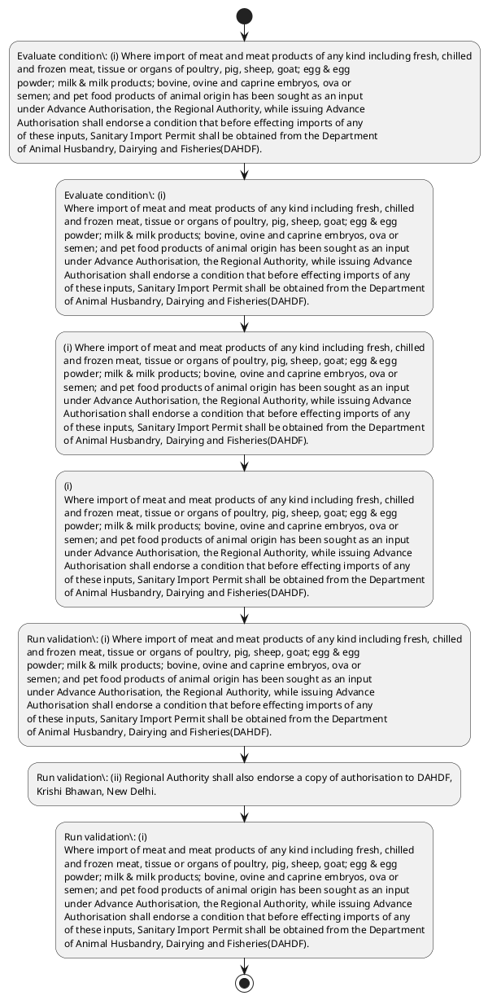

# Chapter 4 / Section 4.09: Cases requiring Sanitary Import Permit.

**Chapter Title:** Duty Exemption / Remission Schemes

**Pages:** 7

**Purpose:** (i) Where import of meat and meat products of any kind including fresh, chilled
and frozen meat, tissue or organs of poultry, pig, sheep, goat; egg & egg
powder; milk & milk products; bovine, ovine and caprine embryos, ova or
semen; and pet food products of animal origin has been sought as an input
under Advance Authorisation, the Regional Authority, while issuing Advance
Authorisation shall endorse a condition that before effecting imports of any
of these inputs, Sanitary Import Permit shall be obtained from the Department
of Animal Husbandry, Dairying and Fisheries(DAHDF).

**Purpose Thanglish:** Indha Cases requiring Sanitary Import Permit. section-la, (i) Where import of meat and meat products of any kind including fresh, chilled
and frozen meat, tissue or organs of poultry, pig, sheep, goat; egg & egg
powder; milk & milk products; bovine, ovine and caprine embryos, ova or
semen; and pet food products of animal origin has been sought as an input
under Advance Authorisation, the Regional authority, while issuing Advance
Authorisation kandippa endorse a condition that before effecting imports of any
of these inputs, Sanitary import Permit kandippa be obtained from the Department
of Animal Husbandry, Dairying and Fisheries(DAHDF).

**Summary:** 4.09 Cases requiring Sanitary Import Permit. (i) Where import of meat and meat products of any kind including fresh, chilled
and frozen meat, tissue or organs of poultry, pig, sheep, goat; egg & egg
powder; milk & milk products; bovine, ovine and caprine embryos, ova or
semen; and pet food products of animal origin has been sought as an input
under Advance Authorisation, the Regional Authority, while issuing Advance
Authorisation shall endorse a condition that before effecting imports of any
of these inputs, Sanitary Import Permit shall be obtained from the Department
of Animal Husbandry, Dairying and Fisheries(DAHDF). (ii) Regional Authority shall also endorse a copy of authorisation to DAHDF,
Krishi Bhawan, New Delhi.

**Business Meaning:** Cases requiring Sanitary Import Permit. governs how DGFT business controls should be applied, validated, and enforced.

**Business Explanation:** Cases requiring Sanitary Import Permit. explains the operating rule set that DEKAI should enforce. Key control points include (i) Where import of meat and meat products of any kind including fresh, chilled
and frozen meat, tissue or organs of poultry, pig, sheep, goat; egg & egg
powder; milk & milk products; bovine, ovine and caprine embryos, ova or
semen; and pet food products of animal origin has been sought as an input
under Advance Authorisation, the Regional Authority, while issuing Advance
Authorisation shall endorse a condition that before effecting imports of any
of these inputs, Sanitary Import Permit shall be obtained from the Department
of Animal Husbandry, Dairying and Fisheries(DAHDF). The section also drives actions such as (i) Where import of meat and meat products of any kind including fresh, chilled
and frozen meat, tissue or organs of poultry, pig, sheep, goat; egg & egg
powder; milk & milk products; bovine, ovine and caprine embryos, ova or
semen; and pet food products of animal origin has been sought as an input
under Advance Authorisation, the Regional Authority, while issuing Advance
Authorisation shall endorse a condition that before effecting imports of any
of these inputs, Sanitary Import Permit shall be obtained from the Department
of Animal Husbandry, Dairying and Fisheries(DAHDF)..

**Business Explanation Thanglish:** Indha Cases requiring Sanitary Import Permit. section-la, Cases requiring Sanitary import Permit. explains the operating rule set that DEKAI should enforce. Key control points include (i) Where import of meat and meat products of any kind including fresh, chilled
and frozen meat, tissue or organs of poultry, pig, sheep, goat; egg & egg
powder; milk & milk products; bovine, ovine and caprine embryos, ova or
semen; and pet food products of animal origin has been sought as an input
under Advance Authorisation, the Regional authority, while issuing Advance
Authorisation kandippa endorse a condition that before effecting imports of any
of these inputs, Sanitary import Permit kandippa be obtained from the Department
of Animal Husbandry, Dairying and Fisheries(DAHDF). The section also drives actions such as (i) Where import of meat and meat products of any kind including fresh, chilled
and frozen meat, tissue or organs of poultry, pig, sheep, goat; egg & egg
powder; milk & milk products; bovine, ovine and caprine embryos, ova or
semen; and pet food products of animal origin has been sought as an input
under Advance Authorisation, the Regional authority, while issuing Advance
Authorisation kandippa endorse a condition that before effecting imports of any
of these inputs, Sanitary import Permit kandippa be obtained from the Department
of Animal Husbandry, Dairying and Fisheries(DAHDF)..

## Business Logic
- (i) Where import of meat and meat products of any kind including fresh, chilled
and frozen meat, tissue or organs of poultry, pig, sheep, goat; egg & egg
powder; milk & milk products; bovine, ovine and caprine embryos, ova or
semen; and pet food products of animal origin has been sought as an input
under Advance Authorisation, the Regional Authority, while issuing Advance
Authorisation shall endorse a condition that before effecting imports of any
of these inputs, Sanitary Import Permit shall be obtained from the Department
of Animal Husbandry, Dairying and Fisheries(DAHDF).
- (ii) Regional Authority shall also endorse a copy of authorisation to DAHDF,
Krishi Bhawan, New Delhi.
- (i)
Where import of meat and meat products of any kind including fresh, chilled
and frozen meat, tissue or organs of poultry, pig, sheep, goat; egg & egg
powder; milk & milk products; bovine, ovine and caprine embryos, ova or
semen; and pet food products of animal origin has been sought as an input
under Advance Authorisation, the Regional Authority, while issuing Advance
Authorisation shall endorse a condition that before effecting imports of any
of these inputs, Sanitary Import Permit shall be obtained from the Department
of Animal Husbandry, Dairying and Fisheries(DAHDF).
- (ii)
Regional Authority shall also endorse a copy of authorisation to DAHDF,
Krishi Bhawan, New Delhi.

## Business Rules
- rule_id=CH4-SEC4_09-R001, rule_description=(i) Where import of meat and meat products of any kind including fresh, chilled
and frozen meat, tissue or organs of poultry, pig, sheep, goat; egg & egg
powder; milk & milk products; bovine, ovine and caprine embryos, ova or
semen; and pet food products of animal origin has been sought as an input
under Advance Authorisation, the Regional Authority, while issuing Advance
Authorisation shall endorse a condition that before effecting imports of any
of these inputs, Sanitary Import Permit shall be obtained from the Department
of Animal Husbandry, Dairying and Fisheries(DAHDF)., trigger=Cases requiring Sanitary Import Permit., condition=(i) Where import of meat and meat products of any kind including fresh, chilled
and frozen meat, tissue or organs of poultry, pig, sheep, goat; egg & egg
powder; milk & milk products; bovine, ovine and caprine embryos, ova or
semen; and pet food products of animal origin has been sought as an input
under Advance Authorisation, the Regional Authority, while issuing Advance
Authorisation shall endorse a condition that before effecting imports of any
of these inputs, Sanitary Import Permit shall be obtained from the Department
of Animal Husbandry, Dairying and Fisheries(DAHDF)., validation=(i) Where import of meat and meat products of any kind including fresh, chilled
and frozen meat, tissue or organs of poultry, pig, sheep, goat; egg & egg
powder; milk & milk products; bovine, ovine and caprine embryos, ova or
semen; and pet food products of animal origin has been sought as an input
under Advance Authorisation, the Regional Authority, while issuing Advance
Authorisation shall endorse a condition that before effecting imports of any
of these inputs, Sanitary Import Permit shall be obtained from the Department
of Animal Husbandry, Dairying and Fisheries(DAHDF)., action=(i) Where import of meat and meat products of any kind including fresh, chilled
and frozen meat, tissue or organs of poultry, pig, sheep, goat; egg & egg
powder; milk & milk products; bovine, ovine and caprine embryos, ova or
semen; and pet food products of animal origin has been sought as an input
under Advance Authorisation, the Regional Authority, while issuing Advance
Authorisation shall endorse a condition that before effecting imports of any
of these inputs, Sanitary Import Permit shall be obtained from the Department
of Animal Husbandry, Dairying and Fisheries(DAHDF)., exception=No explicit exception found in uploaded documents., output=DEKAI should produce a compliance decision for 4.09 - Cases requiring Sanitary Import Permit..
- rule_id=CH4-SEC4_09-R002, rule_description=(ii) Regional Authority shall also endorse a copy of authorisation to DAHDF,
Krishi Bhawan, New Delhi., trigger=Cases requiring Sanitary Import Permit., condition=(i)
Where import of meat and meat products of any kind including fresh, chilled
and frozen meat, tissue or organs of poultry, pig, sheep, goat; egg & egg
powder; milk & milk products; bovine, ovine and caprine embryos, ova or
semen; and pet food products of animal origin has been sought as an input
under Advance Authorisation, the Regional Authority, while issuing Advance
Authorisation shall endorse a condition that before effecting imports of any
of these inputs, Sanitary Import Permit shall be obtained from the Department
of Animal Husbandry, Dairying and Fisheries(DAHDF)., validation=(ii) Regional Authority shall also endorse a copy of authorisation to DAHDF,
Krishi Bhawan, New Delhi., action=(i)
Where import of meat and meat products of any kind including fresh, chilled
and frozen meat, tissue or organs of poultry, pig, sheep, goat; egg & egg
powder; milk & milk products; bovine, ovine and caprine embryos, ova or
semen; and pet food products of animal origin has been sought as an input
under Advance Authorisation, the Regional Authority, while issuing Advance
Authorisation shall endorse a condition that before effecting imports of any
of these inputs, Sanitary Import Permit shall be obtained from the Department
of Animal Husbandry, Dairying and Fisheries(DAHDF)., exception=No explicit exception found in uploaded documents., output=DEKAI should produce a compliance decision for 4.09 - Cases requiring Sanitary Import Permit..
- rule_id=CH4-SEC4_09-R003, rule_description=(i)
Where import of meat and meat products of any kind including fresh, chilled
and frozen meat, tissue or organs of poultry, pig, sheep, goat; egg & egg
powder; milk & milk products; bovine, ovine and caprine embryos, ova or
semen; and pet food products of animal origin has been sought as an input
under Advance Authorisation, the Regional Authority, while issuing Advance
Authorisation shall endorse a condition that before effecting imports of any
of these inputs, Sanitary Import Permit shall be obtained from the Department
of Animal Husbandry, Dairying and Fisheries(DAHDF)., trigger=Cases requiring Sanitary Import Permit., condition=(i)
Where import of meat and meat products of any kind including fresh, chilled
and frozen meat, tissue or organs of poultry, pig, sheep, goat; egg & egg
powder; milk & milk products; bovine, ovine and caprine embryos, ova or
semen; and pet food products of animal origin has been sought as an input
under Advance Authorisation, the Regional Authority, while issuing Advance
Authorisation shall endorse a condition that before effecting imports of any
of these inputs, Sanitary Import Permit shall be obtained from the Department
of Animal Husbandry, Dairying and Fisheries(DAHDF)., validation=(i)
Where import of meat and meat products of any kind including fresh, chilled
and frozen meat, tissue or organs of poultry, pig, sheep, goat; egg & egg
powder; milk & milk products; bovine, ovine and caprine embryos, ova or
semen; and pet food products of animal origin has been sought as an input
under Advance Authorisation, the Regional Authority, while issuing Advance
Authorisation shall endorse a condition that before effecting imports of any
of these inputs, Sanitary Import Permit shall be obtained from the Department
of Animal Husbandry, Dairying and Fisheries(DAHDF)., action=(i)
Where import of meat and meat products of any kind including fresh, chilled
and frozen meat, tissue or organs of poultry, pig, sheep, goat; egg & egg
powder; milk & milk products; bovine, ovine and caprine embryos, ova or
semen; and pet food products of animal origin has been sought as an input
under Advance Authorisation, the Regional Authority, while issuing Advance
Authorisation shall endorse a condition that before effecting imports of any
of these inputs, Sanitary Import Permit shall be obtained from the Department
of Animal Husbandry, Dairying and Fisheries(DAHDF)., exception=No explicit exception found in uploaded documents., output=DEKAI should produce a compliance decision for 4.09 - Cases requiring Sanitary Import Permit..
- rule_id=CH4-SEC4_09-R004, rule_description=(ii)
Regional Authority shall also endorse a copy of authorisation to DAHDF,
Krishi Bhawan, New Delhi., trigger=Cases requiring Sanitary Import Permit., condition=(i)
Where import of meat and meat products of any kind including fresh, chilled
and frozen meat, tissue or organs of poultry, pig, sheep, goat; egg & egg
powder; milk & milk products; bovine, ovine and caprine embryos, ova or
semen; and pet food products of animal origin has been sought as an input
under Advance Authorisation, the Regional Authority, while issuing Advance
Authorisation shall endorse a condition that before effecting imports of any
of these inputs, Sanitary Import Permit shall be obtained from the Department
of Animal Husbandry, Dairying and Fisheries(DAHDF)., validation=(ii)
Regional Authority shall also endorse a copy of authorisation to DAHDF,
Krishi Bhawan, New Delhi., action=(i)
Where import of meat and meat products of any kind including fresh, chilled
and frozen meat, tissue or organs of poultry, pig, sheep, goat; egg & egg
powder; milk & milk products; bovine, ovine and caprine embryos, ova or
semen; and pet food products of animal origin has been sought as an input
under Advance Authorisation, the Regional Authority, while issuing Advance
Authorisation shall endorse a condition that before effecting imports of any
of these inputs, Sanitary Import Permit shall be obtained from the Department
of Animal Husbandry, Dairying and Fisheries(DAHDF)., exception=No explicit exception found in uploaded documents., output=DEKAI should produce a compliance decision for 4.09 - Cases requiring Sanitary Import Permit..

## Conditions
- (i) Where import of meat and meat products of any kind including fresh, chilled
and frozen meat, tissue or organs of poultry, pig, sheep, goat; egg & egg
powder; milk & milk products; bovine, ovine and caprine embryos, ova or
semen; and pet food products of animal origin has been sought as an input
under Advance Authorisation, the Regional Authority, while issuing Advance
Authorisation shall endorse a condition that before effecting imports of any
of these inputs, Sanitary Import Permit shall be obtained from the Department
of Animal Husbandry, Dairying and Fisheries(DAHDF).
- (i)
Where import of meat and meat products of any kind including fresh, chilled
and frozen meat, tissue or organs of poultry, pig, sheep, goat; egg & egg
powder; milk & milk products; bovine, ovine and caprine embryos, ova or
semen; and pet food products of animal origin has been sought as an input
under Advance Authorisation, the Regional Authority, while issuing Advance
Authorisation shall endorse a condition that before effecting imports of any
of these inputs, Sanitary Import Permit shall be obtained from the Department
of Animal Husbandry, Dairying and Fisheries(DAHDF).

## Condition Logic
- id=4.4.09.1, if=(i) Where import of meat and meat products of any kind including fresh, chilled
and frozen meat, tissue or organs of poultry, pig, sheep, goat; egg & egg
powder; milk & milk products; bovine, ovine and caprine embryos, ova or
semen; and pet food products of animal origin has been sought as an input
under Advance Authorisation, the Regional Authority, while issuing Advance
Authorisation shall endorse a condition that before effecting imports of any
of these inputs, Sanitary Import Permit shall be obtained from the Department
of Animal Husbandry, Dairying and Fisheries(DAHDF)., then=(i) Where import of meat and meat products of any kind including fresh, chilled
and frozen meat, tissue or organs of poultry, pig, sheep, goat; egg & egg
powder; milk & milk products; bovine, ovine and caprine embryos, ova or
semen; and pet food products of animal origin has been sought as an input
under Advance Authorisation, the Regional Authority, while issuing Advance
Authorisation shall endorse a condition that before effecting imports of any
of these inputs, Sanitary Import Permit shall be obtained from the Department
of Animal Husbandry, Dairying and Fisheries(DAHDF)., source=(i) Where import of meat and meat products of any kind including fresh, chilled
and frozen meat, tissue or organs of poultry, pig, sheep, goat; egg & egg
powder; milk & milk products; bovine, ovine and caprine embryos, ova or
semen; and pet food products of animal origin has been sought as an input
under Advance Authorisation, the Regional Authority, while issuing Advance
Authorisation shall endorse a condition that before effecting imports of any
of these inputs, Sanitary Import Permit shall be obtained from the Department
of Animal Husbandry, Dairying and Fisheries(DAHDF).
- id=4.4.09.2, if=(i)
Where import of meat and meat products of any kind including fresh, chilled
and frozen meat, tissue or organs of poultry, pig, sheep, goat; egg & egg
powder; milk & milk products; bovine, ovine and caprine embryos, ova or
semen; and pet food products of animal origin has been sought as an input
under Advance Authorisation, the Regional Authority, while issuing Advance
Authorisation shall endorse a condition that before effecting imports of any
of these inputs, Sanitary Import Permit shall be obtained from the Department
of Animal Husbandry, Dairying and Fisheries(DAHDF)., then=(i) Where import of meat and meat products of any kind including fresh, chilled
and frozen meat, tissue or organs of poultry, pig, sheep, goat; egg & egg
powder; milk & milk products; bovine, ovine and caprine embryos, ova or
semen; and pet food products of animal origin has been sought as an input
under Advance Authorisation, the Regional Authority, while issuing Advance
Authorisation shall endorse a condition that before effecting imports of any
of these inputs, Sanitary Import Permit shall be obtained from the Department
of Animal Husbandry, Dairying and Fisheries(DAHDF)., source=(i)
Where import of meat and meat products of any kind including fresh, chilled
and frozen meat, tissue or organs of poultry, pig, sheep, goat; egg & egg
powder; milk & milk products; bovine, ovine and caprine embryos, ova or
semen; and pet food products of animal origin has been sought as an input
under Advance Authorisation, the Regional Authority, while issuing Advance
Authorisation shall endorse a condition that before effecting imports of any
of these inputs, Sanitary Import Permit shall be obtained from the Department
of Animal Husbandry, Dairying and Fisheries(DAHDF).

## Validations
- (i) Where import of meat and meat products of any kind including fresh, chilled
and frozen meat, tissue or organs of poultry, pig, sheep, goat; egg & egg
powder; milk & milk products; bovine, ovine and caprine embryos, ova or
semen; and pet food products of animal origin has been sought as an input
under Advance Authorisation, the Regional Authority, while issuing Advance
Authorisation shall endorse a condition that before effecting imports of any
of these inputs, Sanitary Import Permit shall be obtained from the Department
of Animal Husbandry, Dairying and Fisheries(DAHDF).
- (ii) Regional Authority shall also endorse a copy of authorisation to DAHDF,
Krishi Bhawan, New Delhi.
- (i)
Where import of meat and meat products of any kind including fresh, chilled
and frozen meat, tissue or organs of poultry, pig, sheep, goat; egg & egg
powder; milk & milk products; bovine, ovine and caprine embryos, ova or
semen; and pet food products of animal origin has been sought as an input
under Advance Authorisation, the Regional Authority, while issuing Advance
Authorisation shall endorse a condition that before effecting imports of any
of these inputs, Sanitary Import Permit shall be obtained from the Department
of Animal Husbandry, Dairying and Fisheries(DAHDF).
- (ii)
Regional Authority shall also endorse a copy of authorisation to DAHDF,
Krishi Bhawan, New Delhi.

## Exceptions
- None identified

## Dependencies
- 4

## Authorities
- Regional Authority

## Required Documents
- (ii) Regional Authority shall also endorse a copy of authorisation to DAHDF,
Krishi Bhawan, New Delhi.
- (ii)
Regional Authority shall also endorse a copy of authorisation to DAHDF,
Krishi Bhawan, New Delhi.

## Timelines
- (i) Where import of meat and meat products of any kind including fresh, chilled
and frozen meat, tissue or organs of poultry, pig, sheep, goat; egg & egg
powder; milk & milk products; bovine, ovine and caprine embryos, ova or
semen; and pet food products of animal origin has been sought as an input
under Advance Authorisation, the Regional Authority, while issuing Advance
Authorisation shall endorse a condition that before effecting imports of any
of these inputs, Sanitary Import Permit shall be obtained from the Department
of Animal Husbandry, Dairying and Fisheries(DAHDF).
- (i)
Where import of meat and meat products of any kind including fresh, chilled
and frozen meat, tissue or organs of poultry, pig, sheep, goat; egg & egg
powder; milk & milk products; bovine, ovine and caprine embryos, ova or
semen; and pet food products of animal origin has been sought as an input
under Advance Authorisation, the Regional Authority, while issuing Advance
Authorisation shall endorse a condition that before effecting imports of any
of these inputs, Sanitary Import Permit shall be obtained from the Department
of Animal Husbandry, Dairying and Fisheries(DAHDF).

## Actions
- (i) Where import of meat and meat products of any kind including fresh, chilled
and frozen meat, tissue or organs of poultry, pig, sheep, goat; egg & egg
powder; milk & milk products; bovine, ovine and caprine embryos, ova or
semen; and pet food products of animal origin has been sought as an input
under Advance Authorisation, the Regional Authority, while issuing Advance
Authorisation shall endorse a condition that before effecting imports of any
of these inputs, Sanitary Import Permit shall be obtained from the Department
of Animal Husbandry, Dairying and Fisheries(DAHDF).
- (i)
Where import of meat and meat products of any kind including fresh, chilled
and frozen meat, tissue or organs of poultry, pig, sheep, goat; egg & egg
powder; milk & milk products; bovine, ovine and caprine embryos, ova or
semen; and pet food products of animal origin has been sought as an input
under Advance Authorisation, the Regional Authority, while issuing Advance
Authorisation shall endorse a condition that before effecting imports of any
of these inputs, Sanitary Import Permit shall be obtained from the Department
of Animal Husbandry, Dairying and Fisheries(DAHDF).

## Workflow
- Evaluate condition: (i) Where import of meat and meat products of any kind including fresh, chilled
and frozen meat, tissue or organs of poultry, pig, sheep, goat; egg & egg
powder; milk & milk products; bovine, ovine and caprine embryos, ova or
semen; and pet food products of animal origin has been sought as an input
under Advance Authorisation, the Regional Authority, while issuing Advance
Authorisation shall endorse a condition that before effecting imports of any
of these inputs, Sanitary Import Permit shall be obtained from the Department
of Animal Husbandry, Dairying and Fisheries(DAHDF).
- Evaluate condition: (i)
Where import of meat and meat products of any kind including fresh, chilled
and frozen meat, tissue or organs of poultry, pig, sheep, goat; egg & egg
powder; milk & milk products; bovine, ovine and caprine embryos, ova or
semen; and pet food products of animal origin has been sought as an input
under Advance Authorisation, the Regional Authority, while issuing Advance
Authorisation shall endorse a condition that before effecting imports of any
of these inputs, Sanitary Import Permit shall be obtained from the Department
of Animal Husbandry, Dairying and Fisheries(DAHDF).
- (i) Where import of meat and meat products of any kind including fresh, chilled
and frozen meat, tissue or organs of poultry, pig, sheep, goat; egg & egg
powder; milk & milk products; bovine, ovine and caprine embryos, ova or
semen; and pet food products of animal origin has been sought as an input
under Advance Authorisation, the Regional Authority, while issuing Advance
Authorisation shall endorse a condition that before effecting imports of any
of these inputs, Sanitary Import Permit shall be obtained from the Department
of Animal Husbandry, Dairying and Fisheries(DAHDF).
- (i)
Where import of meat and meat products of any kind including fresh, chilled
and frozen meat, tissue or organs of poultry, pig, sheep, goat; egg & egg
powder; milk & milk products; bovine, ovine and caprine embryos, ova or
semen; and pet food products of animal origin has been sought as an input
under Advance Authorisation, the Regional Authority, while issuing Advance
Authorisation shall endorse a condition that before effecting imports of any
of these inputs, Sanitary Import Permit shall be obtained from the Department
of Animal Husbandry, Dairying and Fisheries(DAHDF).
- Run validation: (i) Where import of meat and meat products of any kind including fresh, chilled
and frozen meat, tissue or organs of poultry, pig, sheep, goat; egg & egg
powder; milk & milk products; bovine, ovine and caprine embryos, ova or
semen; and pet food products of animal origin has been sought as an input
under Advance Authorisation, the Regional Authority, while issuing Advance
Authorisation shall endorse a condition that before effecting imports of any
of these inputs, Sanitary Import Permit shall be obtained from the Department
of Animal Husbandry, Dairying and Fisheries(DAHDF).
- Run validation: (ii) Regional Authority shall also endorse a copy of authorisation to DAHDF,
Krishi Bhawan, New Delhi.
- Run validation: (i)
Where import of meat and meat products of any kind including fresh, chilled
and frozen meat, tissue or organs of poultry, pig, sheep, goat; egg & egg
powder; milk & milk products; bovine, ovine and caprine embryos, ova or
semen; and pet food products of animal origin has been sought as an input
under Advance Authorisation, the Regional Authority, while issuing Advance
Authorisation shall endorse a condition that before effecting imports of any
of these inputs, Sanitary Import Permit shall be obtained from the Department
of Animal Husbandry, Dairying and Fisheries(DAHDF).

## Workflow ASCII
```text
Cases requiring Sanitary Import Permit.
Evaluate condition: (i) Where import of meat and meat products of any kind including fresh, chilled
and frozen meat, tissue or organs of poultry, pig, sheep, goat; egg & egg
powder; milk & milk products; bovine, ovine and caprine embryos, ova or
semen; and pet food products of animal origin has been sought as an input
under Advance Authorisation, the Regional Authority, while issuing Advance
Authorisation shall endorse a condition that before effecting imports of any
of these inputs, Sanitary Import Permit shall be obtained from the Department
of Animal Husbandry, Dairying and Fisheries(DAHDF).
   |
   v
Evaluate condition: (i)
Where import of meat and meat products of any kind including fresh, chilled
and frozen meat, tissue or organs of poultry, pig, sheep, goat; egg & egg
powder; milk & milk products; bovine, ovine and caprine embryos, ova or
semen; and pet food products of animal origin has been sought as an input
under Advance Authorisation, the Regional Authority, while issuing Advance
Authorisation shall endorse a condition that before effecting imports of any
of these inputs, Sanitary Import Permit shall be obtained from the Department
of Animal Husbandry, Dairying and Fisheries(DAHDF).
   |
   v
(i) Where import of meat and meat products of any kind including fresh, chilled
and frozen meat, tissue or organs of poultry, pig, sheep, goat; egg & egg
powder; milk & milk products; bovine, ovine and caprine embryos, ova or
semen; and pet food products of animal origin has been sought as an input
under Advance Authorisation, the Regional Authority, while issuing Advance
Authorisation shall endorse a condition that before effecting imports of any
of these inputs, Sanitary Import Permit shall be obtained from the Department
of Animal Husbandry, Dairying and Fisheries(DAHDF).
   |
   v
(i)
Where import of meat and meat products of any kind including fresh, chilled
and frozen meat, tissue or organs of poultry, pig, sheep, goat; egg & egg
powder; milk & milk products; bovine, ovine and caprine embryos, ova or
semen; and pet food products of animal origin has been sought as an input
under Advance Authorisation, the Regional Authority, while issuing Advance
Authorisation shall endorse a condition that before effecting imports of any
of these inputs, Sanitary Import Permit shall be obtained from the Department
of Animal Husbandry, Dairying and Fisheries(DAHDF).
   |
   v
Run validation: (i) Where import of meat and meat products of any kind including fresh, chilled
and frozen meat, tissue or organs of poultry, pig, sheep, goat; egg & egg
powder; milk & milk products; bovine, ovine and caprine embryos, ova or
semen; and pet food products of animal origin has been sought as an input
under Advance Authorisation, the Regional Authority, while issuing Advance
Authorisation shall endorse a condition that before effecting imports of any
of these inputs, Sanitary Import Permit shall be obtained from the Department
of Animal Husbandry, Dairying and Fisheries(DAHDF).
   |
   v
Run validation: (ii) Regional Authority shall also endorse a copy of authorisation to DAHDF,
Krishi Bhawan, New Delhi.
   |
   v
Run validation: (i)
Where import of meat and meat products of any kind including fresh, chilled
and frozen meat, tissue or organs of poultry, pig, sheep, goat; egg & egg
powder; milk & milk products; bovine, ovine and caprine embryos, ova or
semen; and pet food products of animal origin has been sought as an input
under Advance Authorisation, the Regional Authority, while issuing Advance
Authorisation shall endorse a condition that before effecting imports of any
of these inputs, Sanitary Import Permit shall be obtained from the Department
of Animal Husbandry, Dairying and Fisheries(DAHDF).
```

## Decision Tree
- IF (i) Where import of meat and meat products of any kind including fresh, chilled
and frozen meat, tissue or organs of poultry, pig, sheep, goat; egg & egg
powder; milk & milk products; bovine, ovine and caprine embryos, ova or
semen; and pet food products of animal origin has been sought as an input
under Advance Authorisation, the Regional Authority, while issuing Advance
Authorisation shall endorse a condition that before effecting imports of any
of these inputs, Sanitary Import Permit shall be obtained from the Department
of Animal Husbandry, Dairying and Fisheries(DAHDF). THEN (i) Where import of meat and meat products of any kind including fresh, chilled
and frozen meat, tissue or organs of poultry, pig, sheep, goat; egg & egg
powder; milk & milk products; bovine, ovine and caprine embryos, ova or
semen; and pet food products of animal origin has been sought as an input
under Advance Authorisation, the Regional Authority, while issuing Advance
Authorisation shall endorse a condition that before effecting imports of any
of these inputs, Sanitary Import Permit shall be obtained from the Department
of Animal Husbandry, Dairying and Fisheries(DAHDF).
- IF (i)
Where import of meat and meat products of any kind including fresh, chilled
and frozen meat, tissue or organs of poultry, pig, sheep, goat; egg & egg
powder; milk & milk products; bovine, ovine and caprine embryos, ova or
semen; and pet food products of animal origin has been sought as an input
under Advance Authorisation, the Regional Authority, while issuing Advance
Authorisation shall endorse a condition that before effecting imports of any
of these inputs, Sanitary Import Permit shall be obtained from the Department
of Animal Husbandry, Dairying and Fisheries(DAHDF). THEN (i) Where import of meat and meat products of any kind including fresh, chilled
and frozen meat, tissue or organs of poultry, pig, sheep, goat; egg & egg
powder; milk & milk products; bovine, ovine and caprine embryos, ova or
semen; and pet food products of animal origin has been sought as an input
under Advance Authorisation, the Regional Authority, while issuing Advance
Authorisation shall endorse a condition that before effecting imports of any
of these inputs, Sanitary Import Permit shall be obtained from the Department
of Animal Husbandry, Dairying and Fisheries(DAHDF).

## Decision Tree ASCII
```text
Cases requiring Sanitary Import Permit. Decision
IF (i) Where import of meat and meat products of any kind including fresh, chilled
and frozen meat, tissue or organs of poultry, pig, sheep, goat; egg & egg
powder; milk & milk products; bovine, ovine and caprine embryos, ova or
semen; and pet food products of animal origin has been sought as an input
under Advance Authorisation, the Regional Authority, while issuing Advance
Authorisation shall endorse a condition that before effecting imports of any
of these inputs, Sanitary Import Permit shall be obtained from the Department
of Animal Husbandry, Dairying and Fisheries(DAHDF). THEN (i) Where import of meat and meat products of any kind including fresh, chilled
and frozen meat, tissue or organs of poultry, pig, sheep, goat; egg & egg
powder; milk & milk products; bovine, ovine and caprine embryos, ova or
semen; and pet food products of animal origin has been sought as an input
under Advance Authorisation, the Regional Authority, while issuing Advance
Authorisation shall endorse a condition that before effecting imports of any
of these inputs, Sanitary Import Permit shall be obtained from the Department
of Animal Husbandry, Dairying and Fisheries(DAHDF).
   |
   v
IF (i)
Where import of meat and meat products of any kind including fresh, chilled
and frozen meat, tissue or organs of poultry, pig, sheep, goat; egg & egg
powder; milk & milk products; bovine, ovine and caprine embryos, ova or
semen; and pet food products of animal origin has been sought as an input
under Advance Authorisation, the Regional Authority, while issuing Advance
Authorisation shall endorse a condition that before effecting imports of any
of these inputs, Sanitary Import Permit shall be obtained from the Department
of Animal Husbandry, Dairying and Fisheries(DAHDF). THEN (i) Where import of meat and meat products of any kind including fresh, chilled
and frozen meat, tissue or organs of poultry, pig, sheep, goat; egg & egg
powder; milk & milk products; bovine, ovine and caprine embryos, ova or
semen; and pet food products of animal origin has been sought as an input
under Advance Authorisation, the Regional Authority, while issuing Advance
Authorisation shall endorse a condition that before effecting imports of any
of these inputs, Sanitary Import Permit shall be obtained from the Department
of Animal Husbandry, Dairying and Fisheries(DAHDF).
```

## Examples
- User asks to process Cases requiring Sanitary Import Permit.; the platform checks conditions, validations, and documents before action.

**Real-world Example:** Example: an importer or exporter invokes Cases requiring Sanitary Import Permit., submits (ii) Regional Authority shall also endorse a copy of authorisation to DAHDF,
Krishi Bhawan, New Delhi., (ii)
Regional Authority shall also endorse a copy of authorisation to DAHDF,
Krishi Bhawan, New Delhi., and DEKAI uses the extracted rules to (i) where import of meat and meat products of any kind including fresh, chilled
and frozen meat, tissue or organs of poultry, pig, sheep, goat; egg & egg
powder; milk & milk products; bovine, ovine and caprine embryos, ova or
semen; and pet food products of animal origin has been sought as an input
under advance authorisation, the regional authority, while issuing advance
authorisation shall endorse a condition that before effecting imports of any
of these inputs, sanitary import permit shall be obtained from the department
of animal husbandry, dairying and fisheries(dahdf)..

**Real-world Example Thanglish:** Indha Cases requiring Sanitary Import Permit. section-la, Example: an importer or exporter invokes Cases requiring Sanitary import Permit., submits (ii) Regional authority kandippa also endorse a copy of authorisation to DAHDF,
Krishi Bhawan, New Delhi., (ii)
Regional authority kandippa also endorse a copy of authorisation to DAHDF,
Krishi Bhawan, New Delhi., and DEKAI uses the extracted rules to (i) where import of meat and meat products of any kind including fresh, chilled
and frozen meat, tissue or organs of poultry, pig, sheep, goat; egg & egg
powder; milk & milk products; bovine, ovine and caprine embryos, ova or
semen; and pet food products of animal origin has been sought as an input
under advance authorisation, the regional authority, while issuing advance
authorisation kandippa endorse a condition that before effecting imports of any
of these inputs, sanitary import permit kandippa be obtained from the department
of animal husbandry, dairying and fisheries(dahdf)..

## AI Rules
- IF detected context matches section rule THEN enforce: (i) Where import of meat and meat products of any kind including fresh, chilled
and frozen meat, tissue or organs of poultry, pig, sheep, goat; egg & egg
powder; milk & milk products; bovine, ovine and caprine embryos, ova or
semen; and pet food products of animal origin has been sought as an input
under Advance Authorisation, the Regional Authority, while issuing Advance
Authorisation shall endorse a condition that before effecting imports of any
of these inputs, Sanitary Import Permit shall be obtained from the Department
of Animal Husbandry, Dairying and Fisheries(DAHDF).
- IF detected context matches section rule THEN enforce: (ii) Regional Authority shall also endorse a copy of authorisation to DAHDF,
Krishi Bhawan, New Delhi.
- IF detected context matches section rule THEN enforce: (i)
Where import of meat and meat products of any kind including fresh, chilled
and frozen meat, tissue or organs of poultry, pig, sheep, goat; egg & egg
powder; milk & milk products; bovine, ovine and caprine embryos, ova or
semen; and pet food products of animal origin has been sought as an input
under Advance Authorisation, the Regional Authority, while issuing Advance
Authorisation shall endorse a condition that before effecting imports of any
of these inputs, Sanitary Import Permit shall be obtained from the Department
of Animal Husbandry, Dairying and Fisheries(DAHDF).
- IF detected context matches section rule THEN enforce: (ii)
Regional Authority shall also endorse a copy of authorisation to DAHDF,
Krishi Bhawan, New Delhi.
- IF validations pass THEN recommend action: (i) Where import of meat and meat products of any kind including fresh, chilled
and frozen meat, tissue or organs of poultry, pig, sheep, goat; egg & egg
powder; milk & milk products; bovine, ovine and caprine embryos, ova or
semen; and pet food products of animal origin has been sought as an input
under Advance Authorisation, the Regional Authority, while issuing Advance
Authorisation shall endorse a condition that before effecting imports of any
of these inputs, Sanitary Import Permit shall be obtained from the Department
of Animal Husbandry, Dairying and Fisheries(DAHDF).

## Database Fields
- name=section_code, type=string, required=True, source=parsed_section_heading
- name=section_title, type=string, required=True, source=parsed_section_heading
- name=and_flag, type=boolean, required=False, source=keyword:and
- name=any_flag, type=boolean, required=False, source=keyword:any
- name=pig_flag, type=boolean, required=False, source=keyword:pig
- name=egg_flag, type=boolean, required=False, source=keyword:egg
- name=ova_flag, type=boolean, required=False, source=keyword:ova
- name=pet_flag, type=boolean, required=False, source=keyword:pet
- name=has_flag, type=boolean, required=False, source=keyword:has
- name=the_flag, type=boolean, required=False, source=keyword:the
- name=document_1_submitted, type=boolean, required=True, source=(ii) Regional Authority shall also endorse a copy of authorisation to DAHDF,
Krishi Bhawan, New Delhi.
- name=document_2_submitted, type=boolean, required=True, source=(ii)
Regional Authority shall also endorse a copy of authorisation to DAHDF,
Krishi Bhawan, New Delhi.

## API Requirements
- method=GET, path=/api/dgft/sections/4.09, purpose=Retrieve knowledge payload for section 4.09, query_params=['include=workflow,decision_tree,validations'], response_fields=['section', 'title', 'summary', 'conditions', 'validations', 'exceptions', 'workflow', 'decision_tree']
- method=POST, path=/api/dgft/Cases-requiring-Sanitary-Import-Permit/validate, purpose=Validate inputs and documents for Cases requiring Sanitary Import Permit., request_fields=['section_code', 'section_title', 'document_1_submitted', 'document_2_submitted'], response_fields=['status', 'errors', 'warnings', 'next_actions']
- method=POST, path=/api/dgft/Cases-requiring-Sanitary-Import-Permit/execute, purpose=Trigger business action for (i) Where import of meat and meat products of any kind including fresh, chilled
and frozen meat, tissue or organs of poultry, pig, sheep, goat; egg & egg
powder; milk & milk products; bovine, ovine and caprine embryos, ova or
semen; and pet food products of animal origin has been sought as an input
under Advance Authorisation, the Regional Authority, while issuing Advance
Authorisation shall endorse a condition that before effecting imports of any
of these inputs, Sanitary Import Permit shall be obtained from the Department
of Animal Husbandry, Dairying and Fisheries(DAHDF)., request_fields=['section_code', 'section_title', 'document_1_submitted', 'document_2_submitted'], response_fields=['reference_id', 'status', 'authority', 'timeline']

## UI Screens
- screen_id=Cases_requiring_Sanitary_Import_Permit_overview, name=Cases requiring Sanitary Import Permit. Overview, purpose=Show section summary, authority, timeline, and eligibility cues., widgets=['summary_card', 'conditions_table', 'authority_badges', 'timeline_panel']
- screen_id=Cases_requiring_Sanitary_Import_Permit_submission, name=Cases requiring Sanitary Import Permit. Submission, purpose=Capture applicant data and supporting documents., widgets=['dynamic_form', 'document_uploader', 'validation_panel', 'next_action_footer'], fields=['section_code', 'section_title', 'and_flag', 'any_flag', 'pig_flag', 'egg_flag', 'ova_flag', 'pet_flag']

## Error Messages
- Validation failed because the section requirements were not fully met.

## FAQ
- question_en=What is the purpose of section 4.09?, answer_en=Cases requiring Sanitary Import Permit. explains the operating rule set that DEKAI should enforce. Key control points include (i) Where import of meat and meat products of any kind including fresh, chilled
and frozen meat, tissue or organs of poultry, pig, sheep, goat; egg & egg
powder; milk & milk products; bovine, ovine and caprine embryos, ova or
semen; and pet food products of animal origin has been sought as an input
under Advance Authorisation, the Regional Authority, while issuing Advance
Authorisation shall endorse a condition that before effecting imports of any
of these inputs, Sanitary Import Permit shall be obtained from the Department
of Animal Husbandry, Dairying and Fisheries(DAHDF). The section also drives actions such as (i) Where import of meat and meat products of any kind including fresh, chilled
and frozen meat, tissue or organs of poultry, pig, sheep, goat; egg & egg
powder; milk & milk products; bovine, ovine and caprine embryos, ova or
semen; and pet food products of animal origin has been sought as an input
under Advance Authorisation, the Regional Authority, while issuing Advance
Authorisation shall endorse a condition that before effecting imports of any
of these inputs, Sanitary Import Permit shall be obtained from the Department
of Animal Husbandry, Dairying and Fisheries(DAHDF).., question_thanglish=Indha Cases requiring Sanitary Import Permit. section-la, What is the purpose of section 4.09?, answer_thanglish=Indha Cases requiring Sanitary Import Permit. section-la, Cases requiring Sanitary import Permit. explains the operating rule set that DEKAI should enforce. Key control points include (i) Where import of meat and meat products of any kind including fresh, chilled
and frozen meat, tissue or organs of poultry, pig, sheep, goat; egg & egg
powder; milk & milk products; bovine, ovine and caprine embryos, ova or
semen; and pet food products of animal origin has been sought as an input
under Advance Authorisation, the Regional authority, while issuing Advance
Authorisation kandippa endorse a condition that before effecting imports of any
of these inputs, Sanitary import Permit kandippa be obtained from the Department
of Animal Husbandry, Dairying and Fisheries(DAHDF). The section also drives actions such as (i) Where import of meat and meat products of any kind including fresh, chilled
and frozen meat, tissue or organs of poultry, pig, sheep, goat; egg & egg
powder; milk & milk products; bovine, ovine and caprine embryos, ova or
semen; and pet food products of animal origin has been sought as an input
under Advance Authorisation, the Regional authority, while issuing Advance
Authorisation kandippa endorse a condition that before effecting imports of any
of these inputs, Sanitary import Permit kandippa be obtained from the Department
of Animal Husbandry, Dairying and Fisheries(DAHDF)..
- question_en=What documents are required under Cases requiring Sanitary Import Permit.?, answer_en=(ii) Regional Authority shall also endorse a copy of authorisation to DAHDF,
Krishi Bhawan, New Delhi., (ii)
Regional Authority shall also endorse a copy of authorisation to DAHDF,
Krishi Bhawan, New Delhi., question_thanglish=Indha Cases requiring Sanitary Import Permit. section-la, What documents are required under Cases requiring Sanitary import Permit.?, answer_thanglish=Indha Cases requiring Sanitary Import Permit. section-la, (ii) Regional authority kandippa also endorse a copy of authorisation to DAHDF,
Krishi Bhawan, New Delhi., (ii)
Regional authority kandippa also endorse a copy of authorisation to DAHDF,
Krishi Bhawan, New Delhi.
- question_en=Which authority handles Cases requiring Sanitary Import Permit.?, answer_en=Regional Authority, question_thanglish=Indha Cases requiring Sanitary Import Permit. section-la, Which authority handles Cases requiring Sanitary import Permit.?, answer_thanglish=Indha Cases requiring Sanitary Import Permit. section-la, Regional authority

## Questions Users May Ask
- What does Cases requiring Sanitary Import Permit. require?
- Which documents are needed for Cases requiring Sanitary Import Permit.?
- How does DEKAI validate Cases requiring Sanitary Import Permit. requests?
- What action should be taken for Cases requiring Sanitary Import Permit.?

## Expected AI Answers
- Cases requiring Sanitary Import Permit. requires the platform to interpret the section text, apply the extracted business rules, and present the correct next action.
- Required documents are inferred from the section text: (ii) Regional Authority shall also endorse a copy of authorisation to DAHDF,
Krishi Bhawan, New Delhi., (ii)
Regional Authority shall also endorse a copy of authorisation to DAHDF,
Krishi Bhawan, New Delhi.
- DEKAI validates Cases requiring Sanitary Import Permit. by checking conditions, required documents, authority references, and exception clauses before recommending an outcome.
- The primary extracted action is: (i) Where import of meat and meat products of any kind including fresh, chilled
and frozen meat, tissue or organs of poultry, pig, sheep, goat; egg & egg
powder; milk & milk products; bovine, ovine and caprine embryos, ova or
semen; and pet food products of animal origin has been sought as an input
under Advance Authorisation, the Regional Authority, while issuing Advance
Authorisation shall endorse a condition that before effecting imports of any
of these inputs, Sanitary Import Permit shall be obtained from the Department
of Animal Husbandry, Dairying and Fisheries(DAHDF).

## AI Q&A Examples
- question_en=User asks: How do I comply with Cases requiring Sanitary Import Permit.?, answer_en=AI answers: DEKAI should evaluate section 4.09, apply the extracted rules, and guide the user through Evaluate condition: (i) Where import of meat and meat products of any kind including fresh, chilled
and frozen meat, tissue or organs of poultry, pig, sheep, goat; egg & egg
powder; milk & milk products; bovine, ovine and caprine embryos, ova or
semen; and pet food products of animal origin has been sought as an input
under Advance Authorisation, the Regional Authority, while issuing Advance
Authorisation shall endorse a condition that before effecting imports of any
of these inputs, Sanitary Import Permit shall be obtained from the Department
of Animal Husbandry, Dairying and Fisheries(DAHDF).., question_thanglish=Indha Cases requiring Sanitary Import Permit. section-la, User asks: How do I comply with Cases requiring Sanitary import Permit.?, answer_thanglish=Indha Cases requiring Sanitary Import Permit. section-la, AI answers: DEKAI should evaluate section 4.09, apply the extracted rules, and guide the user through Evaluate condition: (i) Where import of meat and meat products of any kind including fresh, chilled
and frozen meat, tissue or organs of poultry, pig, sheep, goat; egg & egg
powder; milk & milk products; bovine, ovine and caprine embryos, ova or
semen; and pet food products of animal origin has been sought as an input
under Advance Authorisation, the Regional authority, while issuing Advance
Authorisation kandippa endorse a condition that before effecting imports of any
of these inputs, Sanitary import Permit kandippa be obtained from the Department
of Animal Husbandry, Dairying and Fisheries(DAHDF)..
- question_en=User asks: Which validations apply to Cases requiring Sanitary Import Permit.?, answer_en=AI answers: Applicable validations are (i) Where import of meat and meat products of any kind including fresh, chilled
and frozen meat, tissue or organs of poultry, pig, sheep, goat; egg & egg
powder; milk & milk products; bovine, ovine and caprine embryos, ova or
semen; and pet food products of animal origin has been sought as an input
under Advance Authorisation, the Regional Authority, while issuing Advance
Authorisation shall endorse a condition that before effecting imports of any
of these inputs, Sanitary Import Permit shall be obtained from the Department
of Animal Husbandry, Dairying and Fisheries(DAHDF)., (ii) Regional Authority shall also endorse a copy of authorisation to DAHDF,
Krishi Bhawan, New Delhi., (i)
Where import of meat and meat products of any kind including fresh, chilled
and frozen meat, tissue or organs of poultry, pig, sheep, goat; egg & egg
powder; milk & milk products; bovine, ovine and caprine embryos, ova or
semen; and pet food products of animal origin has been sought as an input
under Advance Authorisation, the Regional Authority, while issuing Advance
Authorisation shall endorse a condition that before effecting imports of any
of these inputs, Sanitary Import Permit shall be obtained from the Department
of Animal Husbandry, Dairying and Fisheries(DAHDF)., question_thanglish=Indha Cases requiring Sanitary Import Permit. section-la, User asks: Which validations apply to Cases requiring Sanitary import Permit.?, answer_thanglish=Indha Cases requiring Sanitary Import Permit. section-la, AI answers: Applicable validations are (i) Where import of meat and meat products of any kind including fresh, chilled
and frozen meat, tissue or organs of poultry, pig, sheep, goat; egg & egg
powder; milk & milk products; bovine, ovine and caprine embryos, ova or
semen; and pet food products of animal origin has been sought as an input
under Advance Authorisation, the Regional authority, while issuing Advance
Authorisation kandippa endorse a condition that before effecting imports of any
of these inputs, Sanitary import Permit kandippa be obtained from the Department
of Animal Husbandry, Dairying and Fisheries(DAHDF)., (ii) Regional authority kandippa also endorse a copy of authorisation to DAHDF,
Krishi Bhawan, New Delhi., (i)
Where import of meat and meat products of any kind including fresh, chilled
and frozen meat, tissue or organs of poultry, pig, sheep, goat; egg & egg
powder; milk & milk products; bovine, ovine and caprine embryos, ova or
semen; and pet food products of animal origin has been sought as an input
under Advance Authorisation, the Regional authority, while issuing Advance
Authorisation kandippa endorse a condition that before effecting imports of any
of these inputs, Sanitary import Permit kandippa be obtained from the Department
of Animal Husbandry, Dairying and Fisheries(DAHDF).

## DEKAI AI Implementation Notes
- Capture chapter 4, section 4.09, title, and page references as immutable knowledge metadata.
- Bind validations for Cases requiring Sanitary Import Permit. into a rule engine keyed by the rule IDs extracted for this section.
- Expose document upload controls for: (ii) Regional Authority shall also endorse a copy of authorisation to DAHDF,
Krishi Bhawan, New Delhi., (ii)
Regional Authority shall also endorse a copy of authorisation to DAHDF,
Krishi Bhawan, New Delhi..
- Route escalations or approvals to: Regional Authority.
- Show contextual links to related sections: 4.

## DEKAI AI Implementation Notes Thanglish
- Indha Cases requiring Sanitary Import Permit. section-la, Capture chapter 4, section 4.09, title, and page references as immutable knowledge metadata.
- Indha Cases requiring Sanitary Import Permit. section-la, Bind validations for Cases requiring Sanitary import Permit. into a rule engine keyed by the rule IDs extracted for this section.
- Indha Cases requiring Sanitary Import Permit. section-la, Expose document upload controls for: (ii) Regional authority kandippa also endorse a copy of authorisation to DAHDF,
Krishi Bhawan, New Delhi., (ii)
Regional authority kandippa also endorse a copy of authorisation to DAHDF,
Krishi Bhawan, New Delhi..
- Indha Cases requiring Sanitary Import Permit. section-la, Route escalations or approvals to: Regional authority.
- Indha Cases requiring Sanitary Import Permit. section-la, Show contextual links to related sections: 4.

## AI Metadata
- Keywords: and, any, pig, egg, ova, pet, has, the, New, meat, kind, goat, milk, food, been, that, from, also, copy, Cases
- Search Keywords: and, any, pig, egg, ova, pet, has, the, New, meat, kind, goat, milk, food, been, that, from, also, copy, Cases
- Intent: Support Cases requiring Sanitary Import Permit. processing and compliance validation.
- Tags: 4.09, Cases requiring Sanitary Import Permit., business-rule, document-driven, dgft
- Related Sections: 4
- Related Chapters: 
- Related Rules: (i) Where import of meat and meat products of any kind including fresh, chilled
and frozen meat, tissue or organs of poultry, pig, sheep, goat; egg & egg
powder; milk & milk products; bovine, ovine and caprine embryos, ova or
semen; and pet food products of animal origin has been sought as an input
under Advance Authorisation, the Regional Authority, while issuing Advance
Authorisation shall endorse a condition that before effecting imports of any
of these inputs, Sanitary Import Permit shall be obtained from the Department
of Animal Husbandry, Dairying and Fisheries(DAHDF)., (ii) Regional Authority shall also endorse a copy of authorisation to DAHDF,
Krishi Bhawan, New Delhi., (i)
Where import of meat and meat products of any kind including fresh, chilled
and frozen meat, tissue or organs of poultry, pig, sheep, goat; egg & egg
powder; milk & milk products; bovine, ovine and caprine embryos, ova or
semen; and pet food products of animal origin has been sought as an input
under Advance Authorisation, the Regional Authority, while issuing Advance
Authorisation shall endorse a condition that before effecting imports of any
of these inputs, Sanitary Import Permit shall be obtained from the Department
of Animal Husbandry, Dairying and Fisheries(DAHDF)., (ii)
Regional Authority shall also endorse a copy of authorisation to DAHDF,
Krishi Bhawan, New Delhi.

## Mermaid

```mermaid
flowchart TD
    S1["Evaluate condition: (i) Where import of meat and meat products of any kind including fresh, chilled
and frozen meat, tissue or organs of poultry, pig, sheep, goat; egg & egg
powder; milk & milk products; bovine, ovine and caprine embryos, ova or
semen; and pet food products of animal origin has been sought as an input
under Advance Authorisation, the Regional Authority, while issuing Advance
Authorisation shall endorse a condition that before effecting imports of any
of these inputs, Sanitary Import Permit shall be obtained from the Department
of Animal Husbandry, Dairying and Fisheries(DAHDF)."]
    S2["Evaluate condition: (i)
Where import of meat and meat products of any kind including fresh, chilled
and frozen meat, tissue or organs of poultry, pig, sheep, goat; egg & egg
powder; milk & milk products; bovine, ovine and caprine embryos, ova or
semen; and pet food products of animal origin has been sought as an input
under Advance Authorisation, the Regional Authority, while issuing Advance
Authorisation shall endorse a condition that before effecting imports of any
of these inputs, Sanitary Import Permit shall be obtained from the Department
of Animal Husbandry, Dairying and Fisheries(DAHDF)."]
    S1 --> S2
    S3["(i) Where import of meat and meat products of any kind including fresh, chilled
and frozen meat, tissue or organs of poultry, pig, sheep, goat; egg & egg
powder; milk & milk products; bovine, ovine and caprine embryos, ova or
semen; and pet food products of animal origin has been sought as an input
under Advance Authorisation, the Regional Authority, while issuing Advance
Authorisation shall endorse a condition that before effecting imports of any
of these inputs, Sanitary Import Permit shall be obtained from the Department
of Animal Husbandry, Dairying and Fisheries(DAHDF)."]
    S2 --> S3
    S4["(i)
Where import of meat and meat products of any kind including fresh, chilled
and frozen meat, tissue or organs of poultry, pig, sheep, goat; egg & egg
powder; milk & milk products; bovine, ovine and caprine embryos, ova or
semen; and pet food products of animal origin has been sought as an input
under Advance Authorisation, the Regional Authority, while issuing Advance
Authorisation shall endorse a condition that before effecting imports of any
of these inputs, Sanitary Import Permit shall be obtained from the Department
of Animal Husbandry, Dairying and Fisheries(DAHDF)."]
    S3 --> S4
    S5["Run validation: (i) Where import of meat and meat products of any kind including fresh, chilled
and frozen meat, tissue or organs of poultry, pig, sheep, goat; egg & egg
powder; milk & milk products; bovine, ovine and caprine embryos, ova or
semen; and pet food products of animal origin has been sought as an input
under Advance Authorisation, the Regional Authority, while issuing Advance
Authorisation shall endorse a condition that before effecting imports of any
of these inputs, Sanitary Import Permit shall be obtained from the Department
of Animal Husbandry, Dairying and Fisheries(DAHDF)."]
    S4 --> S5
    S6["Run validation: (ii) Regional Authority shall also endorse a copy of authorisation to DAHDF,
Krishi Bhawan, New Delhi."]
    S5 --> S6
    S7["Run validation: (i)
Where import of meat and meat products of any kind including fresh, chilled
and frozen meat, tissue or organs of poultry, pig, sheep, goat; egg & egg
powder; milk & milk products; bovine, ovine and caprine embryos, ova or
semen; and pet food products of animal origin has been sought as an input
under Advance Authorisation, the Regional Authority, while issuing Advance
Authorisation shall endorse a condition that before effecting imports of any
of these inputs, Sanitary Import Permit shall be obtained from the Department
of Animal Husbandry, Dairying and Fisheries(DAHDF)."]
    S6 --> S7
```


## PlantUML

