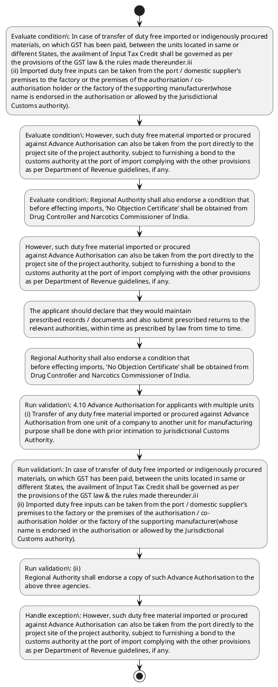

# Chapter 4 / Section 4.10: Advance Authorisation for applicants with multiple units

**Chapter Title:** Duty Exemption / Remission Schemes

**Pages:** 7

**Purpose:** 4.10 Advance Authorisation for applicants with multiple units
(i) Transfer of any duty free material imported or procured against Advance
Authorisation from one unit of a company to another unit for manufacturing
purpose shall be done with prior intimation to jurisdictional Customs
Authority.

**Purpose Thanglish:** Indha Advance Authorisation for applicants with multiple units section-la, 4.10 Advance Authorisation for applicants with multiple units
(i) Transfer of any duty free material imported or procured against Advance
Authorisation from one unit of a company to another unit for manufacturing
purpose kandippa be done with prior intimation to jurisdictional Customs
authority.

**Summary:** 4.10 Advance Authorisation for applicants with multiple units
(i) Transfer of any duty free material imported or procured against Advance
Authorisation from one unit of a company to another unit for manufacturing
purpose shall be done with prior intimation to jurisdictional Customs
Authority. In case of transfer of duty free imported or indigenously procured
materials, on which GST has been paid, between the units located in same or
different States, the availment of Input Tax Credit shall be governed as per
the provisions of the GST law & the rules made thereunder.iii
(ii) Imported duty free inputs can be taken from the port / domestic supplier’s
premises to the factory or the premises of the authorisation / co-
authorisation holder or the factory of the supporting manufacturer(whose
name is endorsed in the authorisation or allowed by the Jurisdictional
Customs authority). However, such duty free material imported or procured
against Advance Authorisation can also be taken from the port directly to the
project site of the project authority, subject to furnishing a bond to the
customs authority at the port of import complying with the other provisions
as per Department of Revenue guidelines, if any.

**Business Meaning:** Advance Authorisation for applicants with multiple units governs how DGFT business controls should be applied, validated, and enforced.

**Business Explanation:** Advance Authorisation for applicants with multiple units explains the operating rule set that DEKAI should enforce. Key control points include 4.10 Advance Authorisation for applicants with multiple units
(i) Transfer of any duty free material imported or procured against Advance
Authorisation from one unit of a company to another unit for manufacturing
purpose shall be done with prior intimation to jurisdictional Customs
Authority. The section also drives actions such as However, such duty free material imported or procured
against Advance Authorisation can also be taken from the port directly to the
project site of the project authority, subject to furnishing a bond to the
customs authority at the port of import complying with the other provisions
as per Department of Revenue guidelines, if any..

**Business Explanation Thanglish:** Indha Advance Authorisation for applicants with multiple units section-la, Advance Authorisation for applicants with multiple units explains the operating rule set that DEKAI should enforce. Key control points include 4.10 Advance Authorisation for applicants with multiple units
(i) Transfer of any duty free material imported or procured against Advance
Authorisation from one unit of a company to another unit for manufacturing
purpose kandippa be done with prior intimation to jurisdictional Customs
authority. The section also drives actions such as However, such duty free material imported or procured
against Advance Authorisation can also be taken from the port directly to the
project site of the project authority, subject to furnishing a bond to the
customs authority at the port of import complying with the other provisions
as per Department of Revenue guidelines, if any..

## Business Logic
- 4.10 Advance Authorisation for applicants with multiple units
(i) Transfer of any duty free material imported or procured against Advance
Authorisation from one unit of a company to another unit for manufacturing
purpose shall be done with prior intimation to jurisdictional Customs
Authority.
- In case of transfer of duty free imported or indigenously procured
materials, on which GST has been paid, between the units located in same or
different States, the availment of Input Tax Credit shall be governed as per
the provisions of the GST law & the rules made thereunder.iii
(ii) Imported duty free inputs can be taken from the port / domestic supplier’s
premises to the factory or the premises of the authorisation / co-
authorisation holder or the factory of the supporting manufacturer(whose
name is endorsed in the authorisation or allowed by the Jurisdictional
Customs authority).
- However, such duty free material imported or procured
against Advance Authorisation can also be taken from the port directly to the
project site of the project authority, subject to furnishing a bond to the
customs authority at the port of import complying with the other provisions
as per Department of Revenue guidelines, if any.
- The applicant should declare that they would maintain
prescribed records / documents and also submit prescribed returns to the
relevant authorities, within time as prescribed by law from time to time.
- (ii)
Regional Authority shall endorse a copy of such Advance Authorisation to the
above three agencies.
- Regional Authority shall also endorse a condition that
before effecting imports, ‘No Objection Certificate’ shall be obtained from
Drug Controller and Narcotics Commissioner of India.
- 4.10 Advance Authorisation for applicants with multiple units
(i)
Transfer of any duty free material imported or procured against Advance
Authorisation from one unit of a company to another unit for manufacturing
purpose shall be done with prior intimation to jurisdictional Customs
Authority.
- In case of transfer of duty free imported or indigenously procured
materials, on which GST has been paid, between the units located in same or
different States, the availment of Input Tax Credit shall be governed as per
the provisions of the GST law & the rules made thereunder.iii
(ii)
Imported duty free inputs can be taken from the port / domestic supplier’s
premises to the factory or the premises of the authorisation / co-
authorisation holder or the factory of the supporting manufacturer(whose
name is endorsed in the authorisation or allowed by the Jurisdictional
Customs authority).

## Business Rules
- rule_id=CH4-SEC4_10-R001, rule_description=4.10 Advance Authorisation for applicants with multiple units
(i) Transfer of any duty free material imported or procured against Advance
Authorisation from one unit of a company to another unit for manufacturing
purpose shall be done with prior intimation to jurisdictional Customs
Authority., trigger=Advance Authorisation for applicants with multiple units, condition=In case of transfer of duty free imported or indigenously procured
materials, on which GST has been paid, between the units located in same or
different States, the availment of Input Tax Credit shall be governed as per
the provisions of the GST law & the rules made thereunder.iii
(ii) Imported duty free inputs can be taken from the port / domestic supplier’s
premises to the factory or the premises of the authorisation / co-
authorisation holder or the factory of the supporting manufacturer(whose
name is endorsed in the authorisation or allowed by the Jurisdictional
Customs authority)., validation=4.10 Advance Authorisation for applicants with multiple units
(i) Transfer of any duty free material imported or procured against Advance
Authorisation from one unit of a company to another unit for manufacturing
purpose shall be done with prior intimation to jurisdictional Customs
Authority., action=However, such duty free material imported or procured
against Advance Authorisation can also be taken from the port directly to the
project site of the project authority, subject to furnishing a bond to the
customs authority at the port of import complying with the other provisions
as per Department of Revenue guidelines, if any., exception=However, such duty free material imported or procured
against Advance Authorisation can also be taken from the port directly to the
project site of the project authority, subject to furnishing a bond to the
customs authority at the port of import complying with the other provisions
as per Department of Revenue guidelines, if any., output=DEKAI should produce a compliance decision for 4.10 - Advance Authorisation for applicants with multiple units.
- rule_id=CH4-SEC4_10-R002, rule_description=In case of transfer of duty free imported or indigenously procured
materials, on which GST has been paid, between the units located in same or
different States, the availment of Input Tax Credit shall be governed as per
the provisions of the GST law & the rules made thereunder.iii
(ii) Imported duty free inputs can be taken from the port / domestic supplier’s
premises to the factory or the premises of the authorisation / co-
authorisation holder or the factory of the supporting manufacturer(whose
name is endorsed in the authorisation or allowed by the Jurisdictional
Customs authority)., trigger=Advance Authorisation for applicants with multiple units, condition=However, such duty free material imported or procured
against Advance Authorisation can also be taken from the port directly to the
project site of the project authority, subject to furnishing a bond to the
customs authority at the port of import complying with the other provisions
as per Department of Revenue guidelines, if any., validation=In case of transfer of duty free imported or indigenously procured
materials, on which GST has been paid, between the units located in same or
different States, the availment of Input Tax Credit shall be governed as per
the provisions of the GST law & the rules made thereunder.iii
(ii) Imported duty free inputs can be taken from the port / domestic supplier’s
premises to the factory or the premises of the authorisation / co-
authorisation holder or the factory of the supporting manufacturer(whose
name is endorsed in the authorisation or allowed by the Jurisdictional
Customs authority)., action=The applicant should declare that they would maintain
prescribed records / documents and also submit prescribed returns to the
relevant authorities, within time as prescribed by law from time to time., exception=However, such duty free material imported or procured
against Advance Authorisation can also be taken from the port directly to the
project site of the project authority, subject to furnishing a bond to the
customs authority at the port of import complying with the other provisions
as per Department of Revenue guidelines, if any., output=DEKAI should produce a compliance decision for 4.10 - Advance Authorisation for applicants with multiple units.
- rule_id=CH4-SEC4_10-R003, rule_description=However, such duty free material imported or procured
against Advance Authorisation can also be taken from the port directly to the
project site of the project authority, subject to furnishing a bond to the
customs authority at the port of import complying with the other provisions
as per Department of Revenue guidelines, if any., trigger=Advance Authorisation for applicants with multiple units, condition=Regional Authority shall also endorse a condition that
before effecting imports, ‘No Objection Certificate’ shall be obtained from
Drug Controller and Narcotics Commissioner of India., validation=(ii)
Regional Authority shall endorse a copy of such Advance Authorisation to the
above three agencies., action=Regional Authority shall also endorse a condition that
before effecting imports, ‘No Objection Certificate’ shall be obtained from
Drug Controller and Narcotics Commissioner of India., exception=However, such duty free material imported or procured
against Advance Authorisation can also be taken from the port directly to the
project site of the project authority, subject to furnishing a bond to the
customs authority at the port of import complying with the other provisions
as per Department of Revenue guidelines, if any., output=DEKAI should produce a compliance decision for 4.10 - Advance Authorisation for applicants with multiple units.
- rule_id=CH4-SEC4_10-R004, rule_description=The applicant should declare that they would maintain
prescribed records / documents and also submit prescribed returns to the
relevant authorities, within time as prescribed by law from time to time., trigger=Advance Authorisation for applicants with multiple units, condition=In case of transfer of duty free imported or indigenously procured
materials, on which GST has been paid, between the units located in same or
different States, the availment of Input Tax Credit shall be governed as per
the provisions of the GST law & the rules made thereunder.iii
(ii)
Imported duty free inputs can be taken from the port / domestic supplier’s
premises to the factory or the premises of the authorisation / co-
authorisation holder or the factory of the supporting manufacturer(whose
name is endorsed in the authorisation or allowed by the Jurisdictional
Customs authority)., validation=Regional Authority shall also endorse a condition that
before effecting imports, ‘No Objection Certificate’ shall be obtained from
Drug Controller and Narcotics Commissioner of India., action=Regional Authority shall also endorse a condition that
before effecting imports, ‘No Objection Certificate’ shall be obtained from
Drug Controller and Narcotics Commissioner of India., exception=However, such duty free material imported or procured
against Advance Authorisation can also be taken from the port directly to the
project site of the project authority, subject to furnishing a bond to the
customs authority at the port of import complying with the other provisions
as per Department of Revenue guidelines, if any., output=DEKAI should produce a compliance decision for 4.10 - Advance Authorisation for applicants with multiple units.
- rule_id=CH4-SEC4_10-R005, rule_description=(ii)
Regional Authority shall endorse a copy of such Advance Authorisation to the
above three agencies., trigger=Advance Authorisation for applicants with multiple units, condition=In case of transfer of duty free imported or indigenously procured
materials, on which GST has been paid, between the units located in same or
different States, the availment of Input Tax Credit shall be governed as per
the provisions of the GST law & the rules made thereunder.iii
(ii)
Imported duty free inputs can be taken from the port / domestic supplier’s
premises to the factory or the premises of the authorisation / co-
authorisation holder or the factory of the supporting manufacturer(whose
name is endorsed in the authorisation or allowed by the Jurisdictional
Customs authority)., validation=4.10 Advance Authorisation for applicants with multiple units
(i)
Transfer of any duty free material imported or procured against Advance
Authorisation from one unit of a company to another unit for manufacturing
purpose shall be done with prior intimation to jurisdictional Customs
Authority., action=Regional Authority shall also endorse a condition that
before effecting imports, ‘No Objection Certificate’ shall be obtained from
Drug Controller and Narcotics Commissioner of India., exception=However, such duty free material imported or procured
against Advance Authorisation can also be taken from the port directly to the
project site of the project authority, subject to furnishing a bond to the
customs authority at the port of import complying with the other provisions
as per Department of Revenue guidelines, if any., output=DEKAI should produce a compliance decision for 4.10 - Advance Authorisation for applicants with multiple units.
- rule_id=CH4-SEC4_10-R006, rule_description=Regional Authority shall also endorse a condition that
before effecting imports, ‘No Objection Certificate’ shall be obtained from
Drug Controller and Narcotics Commissioner of India., trigger=Advance Authorisation for applicants with multiple units, condition=In case of transfer of duty free imported or indigenously procured
materials, on which GST has been paid, between the units located in same or
different States, the availment of Input Tax Credit shall be governed as per
the provisions of the GST law & the rules made thereunder.iii
(ii)
Imported duty free inputs can be taken from the port / domestic supplier’s
premises to the factory or the premises of the authorisation / co-
authorisation holder or the factory of the supporting manufacturer(whose
name is endorsed in the authorisation or allowed by the Jurisdictional
Customs authority)., validation=In case of transfer of duty free imported or indigenously procured
materials, on which GST has been paid, between the units located in same or
different States, the availment of Input Tax Credit shall be governed as per
the provisions of the GST law & the rules made thereunder.iii
(ii)
Imported duty free inputs can be taken from the port / domestic supplier’s
premises to the factory or the premises of the authorisation / co-
authorisation holder or the factory of the supporting manufacturer(whose
name is endorsed in the authorisation or allowed by the Jurisdictional
Customs authority)., action=Regional Authority shall also endorse a condition that
before effecting imports, ‘No Objection Certificate’ shall be obtained from
Drug Controller and Narcotics Commissioner of India., exception=However, such duty free material imported or procured
against Advance Authorisation can also be taken from the port directly to the
project site of the project authority, subject to furnishing a bond to the
customs authority at the port of import complying with the other provisions
as per Department of Revenue guidelines, if any., output=DEKAI should produce a compliance decision for 4.10 - Advance Authorisation for applicants with multiple units.
- rule_id=CH4-SEC4_10-R007, rule_description=4.10 Advance Authorisation for applicants with multiple units
(i)
Transfer of any duty free material imported or procured against Advance
Authorisation from one unit of a company to another unit for manufacturing
purpose shall be done with prior intimation to jurisdictional Customs
Authority., trigger=Advance Authorisation for applicants with multiple units, condition=In case of transfer of duty free imported or indigenously procured
materials, on which GST has been paid, between the units located in same or
different States, the availment of Input Tax Credit shall be governed as per
the provisions of the GST law & the rules made thereunder.iii
(ii)
Imported duty free inputs can be taken from the port / domestic supplier’s
premises to the factory or the premises of the authorisation / co-
authorisation holder or the factory of the supporting manufacturer(whose
name is endorsed in the authorisation or allowed by the Jurisdictional
Customs authority)., validation=In case of transfer of duty free imported or indigenously procured
materials, on which GST has been paid, between the units located in same or
different States, the availment of Input Tax Credit shall be governed as per
the provisions of the GST law & the rules made thereunder.iii
(ii)
Imported duty free inputs can be taken from the port / domestic supplier’s
premises to the factory or the premises of the authorisation / co-
authorisation holder or the factory of the supporting manufacturer(whose
name is endorsed in the authorisation or allowed by the Jurisdictional
Customs authority)., action=Regional Authority shall also endorse a condition that
before effecting imports, ‘No Objection Certificate’ shall be obtained from
Drug Controller and Narcotics Commissioner of India., exception=However, such duty free material imported or procured
against Advance Authorisation can also be taken from the port directly to the
project site of the project authority, subject to furnishing a bond to the
customs authority at the port of import complying with the other provisions
as per Department of Revenue guidelines, if any., output=DEKAI should produce a compliance decision for 4.10 - Advance Authorisation for applicants with multiple units.
- rule_id=CH4-SEC4_10-R008, rule_description=In case of transfer of duty free imported or indigenously procured
materials, on which GST has been paid, between the units located in same or
different States, the availment of Input Tax Credit shall be governed as per
the provisions of the GST law & the rules made thereunder.iii
(ii)
Imported duty free inputs can be taken from the port / domestic supplier’s
premises to the factory or the premises of the authorisation / co-
authorisation holder or the factory of the supporting manufacturer(whose
name is endorsed in the authorisation or allowed by the Jurisdictional
Customs authority)., trigger=Advance Authorisation for applicants with multiple units, condition=In case of transfer of duty free imported or indigenously procured
materials, on which GST has been paid, between the units located in same or
different States, the availment of Input Tax Credit shall be governed as per
the provisions of the GST law & the rules made thereunder.iii
(ii)
Imported duty free inputs can be taken from the port / domestic supplier’s
premises to the factory or the premises of the authorisation / co-
authorisation holder or the factory of the supporting manufacturer(whose
name is endorsed in the authorisation or allowed by the Jurisdictional
Customs authority)., validation=In case of transfer of duty free imported or indigenously procured
materials, on which GST has been paid, between the units located in same or
different States, the availment of Input Tax Credit shall be governed as per
the provisions of the GST law & the rules made thereunder.iii
(ii)
Imported duty free inputs can be taken from the port / domestic supplier’s
premises to the factory or the premises of the authorisation / co-
authorisation holder or the factory of the supporting manufacturer(whose
name is endorsed in the authorisation or allowed by the Jurisdictional
Customs authority)., action=Regional Authority shall also endorse a condition that
before effecting imports, ‘No Objection Certificate’ shall be obtained from
Drug Controller and Narcotics Commissioner of India., exception=However, such duty free material imported or procured
against Advance Authorisation can also be taken from the port directly to the
project site of the project authority, subject to furnishing a bond to the
customs authority at the port of import complying with the other provisions
as per Department of Revenue guidelines, if any., output=DEKAI should produce a compliance decision for 4.10 - Advance Authorisation for applicants with multiple units.

## Conditions
- In case of transfer of duty free imported or indigenously procured
materials, on which GST has been paid, between the units located in same or
different States, the availment of Input Tax Credit shall be governed as per
the provisions of the GST law & the rules made thereunder.iii
(ii) Imported duty free inputs can be taken from the port / domestic supplier’s
premises to the factory or the premises of the authorisation / co-
authorisation holder or the factory of the supporting manufacturer(whose
name is endorsed in the authorisation or allowed by the Jurisdictional
Customs authority).
- However, such duty free material imported or procured
against Advance Authorisation can also be taken from the port directly to the
project site of the project authority, subject to furnishing a bond to the
customs authority at the port of import complying with the other provisions
as per Department of Revenue guidelines, if any.
- Regional Authority shall also endorse a condition that
before effecting imports, ‘No Objection Certificate’ shall be obtained from
Drug Controller and Narcotics Commissioner of India.
- In case of transfer of duty free imported or indigenously procured
materials, on which GST has been paid, between the units located in same or
different States, the availment of Input Tax Credit shall be governed as per
the provisions of the GST law & the rules made thereunder.iii
(ii)
Imported duty free inputs can be taken from the port / domestic supplier’s
premises to the factory or the premises of the authorisation / co-
authorisation holder or the factory of the supporting manufacturer(whose
name is endorsed in the authorisation or allowed by the Jurisdictional
Customs authority).

## Condition Logic
- id=4.4.10.1, if=In case of transfer of duty free imported or indigenously procured
materials, on which GST has been paid, between the units located in same or
different States, the availment of Input Tax Credit shall be governed as per
the provisions of the GST law & the rules made thereunder.iii
(ii) Imported duty free inputs can be taken from the port / domestic supplier’s
premises to the factory or the premises of the authorisation / co-
authorisation holder or the factory of the supporting manufacturer(whose
name is endorsed in the authorisation or allowed by the Jurisdictional
Customs authority)., then=However, such duty free material imported or procured
against Advance Authorisation can also be taken from the port directly to the
project site of the project authority, subject to furnishing a bond to the
customs authority at the port of import complying with the other provisions
as per Department of Revenue guidelines, if any., source=In case of transfer of duty free imported or indigenously procured
materials, on which GST has been paid, between the units located in same or
different States, the availment of Input Tax Credit shall be governed as per
the provisions of the GST law & the rules made thereunder.iii
(ii) Imported duty free inputs can be taken from the port / domestic supplier’s
premises to the factory or the premises of the authorisation / co-
authorisation holder or the factory of the supporting manufacturer(whose
name is endorsed in the authorisation or allowed by the Jurisdictional
Customs authority).
- id=4.4.10.2, if=However, such duty free material imported or procured
against Advance Authorisation can also be taken from the port directly to the
project site of the project authority, subject to furnishing a bond to the
customs authority at the port of import complying with the other provisions
as per Department of Revenue guidelines, if any., then=However, such duty free material imported or procured
against Advance Authorisation can also be taken from the port directly to the
project site of the project authority, subject to furnishing a bond to the
customs authority at the port of import complying with the other provisions
as per Department of Revenue guidelines, if any., source=However, such duty free material imported or procured
against Advance Authorisation can also be taken from the port directly to the
project site of the project authority, subject to furnishing a bond to the
customs authority at the port of import complying with the other provisions
as per Department of Revenue guidelines, if any.
- id=4.4.10.3, if=Regional Authority shall also endorse a condition that
before effecting imports, ‘No Objection Certificate’ shall be obtained from
Drug Controller and Narcotics Commissioner of India., then=However, such duty free material imported or procured
against Advance Authorisation can also be taken from the port directly to the
project site of the project authority, subject to furnishing a bond to the
customs authority at the port of import complying with the other provisions
as per Department of Revenue guidelines, if any., source=Regional Authority shall also endorse a condition that
before effecting imports, ‘No Objection Certificate’ shall be obtained from
Drug Controller and Narcotics Commissioner of India.
- id=4.4.10.4, if=In case of transfer of duty free imported or indigenously procured
materials, on which GST has been paid, between the units located in same or
different States, the availment of Input Tax Credit shall be governed as per
the provisions of the GST law & the rules made thereunder.iii
(ii)
Imported duty free inputs can be taken from the port / domestic supplier’s
premises to the factory or the premises of the authorisation / co-
authorisation holder or the factory of the supporting manufacturer(whose
name is endorsed in the authorisation or allowed by the Jurisdictional
Customs authority)., then=However, such duty free material imported or procured
against Advance Authorisation can also be taken from the port directly to the
project site of the project authority, subject to furnishing a bond to the
customs authority at the port of import complying with the other provisions
as per Department of Revenue guidelines, if any., source=In case of transfer of duty free imported or indigenously procured
materials, on which GST has been paid, between the units located in same or
different States, the availment of Input Tax Credit shall be governed as per
the provisions of the GST law & the rules made thereunder.iii
(ii)
Imported duty free inputs can be taken from the port / domestic supplier’s
premises to the factory or the premises of the authorisation / co-
authorisation holder or the factory of the supporting manufacturer(whose
name is endorsed in the authorisation or allowed by the Jurisdictional
Customs authority).

## Validations
- 4.10 Advance Authorisation for applicants with multiple units
(i) Transfer of any duty free material imported or procured against Advance
Authorisation from one unit of a company to another unit for manufacturing
purpose shall be done with prior intimation to jurisdictional Customs
Authority.
- In case of transfer of duty free imported or indigenously procured
materials, on which GST has been paid, between the units located in same or
different States, the availment of Input Tax Credit shall be governed as per
the provisions of the GST law & the rules made thereunder.iii
(ii) Imported duty free inputs can be taken from the port / domestic supplier’s
premises to the factory or the premises of the authorisation / co-
authorisation holder or the factory of the supporting manufacturer(whose
name is endorsed in the authorisation or allowed by the Jurisdictional
Customs authority).
- (ii)
Regional Authority shall endorse a copy of such Advance Authorisation to the
above three agencies.
- Regional Authority shall also endorse a condition that
before effecting imports, ‘No Objection Certificate’ shall be obtained from
Drug Controller and Narcotics Commissioner of India.
- 4.10 Advance Authorisation for applicants with multiple units
(i)
Transfer of any duty free material imported or procured against Advance
Authorisation from one unit of a company to another unit for manufacturing
purpose shall be done with prior intimation to jurisdictional Customs
Authority.
- In case of transfer of duty free imported or indigenously procured
materials, on which GST has been paid, between the units located in same or
different States, the availment of Input Tax Credit shall be governed as per
the provisions of the GST law & the rules made thereunder.iii
(ii)
Imported duty free inputs can be taken from the port / domestic supplier’s
premises to the factory or the premises of the authorisation / co-
authorisation holder or the factory of the supporting manufacturer(whose
name is endorsed in the authorisation or allowed by the Jurisdictional
Customs authority).

## Exceptions
- However, such duty free material imported or procured
against Advance Authorisation can also be taken from the port directly to the
project site of the project authority, subject to furnishing a bond to the
customs authority at the port of import complying with the other provisions
as per Department of Revenue guidelines, if any.

## Dependencies
- 1
- 2
- 4

## Authorities
- Customs
- Customs authority
- Regional Authority
- Drug Controller and Narcotics Commissioner

## Required Documents
- The applicant should declare that they would maintain
prescribed records / documents and also submit prescribed returns to the
relevant authorities, within time as prescribed by law from time to time.
- (ii)
Regional Authority shall endorse a copy of such Advance Authorisation to the
above three agencies.
- No Objection Certificate

## Timelines
- The applicant should declare that they would maintain
prescribed records / documents and also submit prescribed returns to the
relevant authorities, within time as prescribed by law from time to time.
- Regional Authority shall also endorse a condition that
before effecting imports, ‘No Objection Certificate’ shall be obtained from
Drug Controller and Narcotics Commissioner of India.

## Actions
- However, such duty free material imported or procured
against Advance Authorisation can also be taken from the port directly to the
project site of the project authority, subject to furnishing a bond to the
customs authority at the port of import complying with the other provisions
as per Department of Revenue guidelines, if any.
- The applicant should declare that they would maintain
prescribed records / documents and also submit prescribed returns to the
relevant authorities, within time as prescribed by law from time to time.
- Regional Authority shall also endorse a condition that
before effecting imports, ‘No Objection Certificate’ shall be obtained from
Drug Controller and Narcotics Commissioner of India.

## Workflow
- Evaluate condition: In case of transfer of duty free imported or indigenously procured
materials, on which GST has been paid, between the units located in same or
different States, the availment of Input Tax Credit shall be governed as per
the provisions of the GST law & the rules made thereunder.iii
(ii) Imported duty free inputs can be taken from the port / domestic supplier’s
premises to the factory or the premises of the authorisation / co-
authorisation holder or the factory of the supporting manufacturer(whose
name is endorsed in the authorisation or allowed by the Jurisdictional
Customs authority).
- Evaluate condition: However, such duty free material imported or procured
against Advance Authorisation can also be taken from the port directly to the
project site of the project authority, subject to furnishing a bond to the
customs authority at the port of import complying with the other provisions
as per Department of Revenue guidelines, if any.
- Evaluate condition: Regional Authority shall also endorse a condition that
before effecting imports, ‘No Objection Certificate’ shall be obtained from
Drug Controller and Narcotics Commissioner of India.
- However, such duty free material imported or procured
against Advance Authorisation can also be taken from the port directly to the
project site of the project authority, subject to furnishing a bond to the
customs authority at the port of import complying with the other provisions
as per Department of Revenue guidelines, if any.
- The applicant should declare that they would maintain
prescribed records / documents and also submit prescribed returns to the
relevant authorities, within time as prescribed by law from time to time.
- Regional Authority shall also endorse a condition that
before effecting imports, ‘No Objection Certificate’ shall be obtained from
Drug Controller and Narcotics Commissioner of India.
- Run validation: 4.10 Advance Authorisation for applicants with multiple units
(i) Transfer of any duty free material imported or procured against Advance
Authorisation from one unit of a company to another unit for manufacturing
purpose shall be done with prior intimation to jurisdictional Customs
Authority.
- Run validation: In case of transfer of duty free imported or indigenously procured
materials, on which GST has been paid, between the units located in same or
different States, the availment of Input Tax Credit shall be governed as per
the provisions of the GST law & the rules made thereunder.iii
(ii) Imported duty free inputs can be taken from the port / domestic supplier’s
premises to the factory or the premises of the authorisation / co-
authorisation holder or the factory of the supporting manufacturer(whose
name is endorsed in the authorisation or allowed by the Jurisdictional
Customs authority).
- Run validation: (ii)
Regional Authority shall endorse a copy of such Advance Authorisation to the
above three agencies.
- Handle exception: However, such duty free material imported or procured
against Advance Authorisation can also be taken from the port directly to the
project site of the project authority, subject to furnishing a bond to the
customs authority at the port of import complying with the other provisions
as per Department of Revenue guidelines, if any.

## Workflow ASCII
```text
Advance Authorisation for applicants with multiple units
Evaluate condition: In case of transfer of duty free imported or indigenously procured
materials, on which GST has been paid, between the units located in same or
different States, the availment of Input Tax Credit shall be governed as per
the provisions of the GST law & the rules made thereunder.iii
(ii) Imported duty free inputs can be taken from the port / domestic supplier’s
premises to the factory or the premises of the authorisation / co-
authorisation holder or the factory of the supporting manufacturer(whose
name is endorsed in the authorisation or allowed by the Jurisdictional
Customs authority).
   |
   v
Evaluate condition: However, such duty free material imported or procured
against Advance Authorisation can also be taken from the port directly to the
project site of the project authority, subject to furnishing a bond to the
customs authority at the port of import complying with the other provisions
as per Department of Revenue guidelines, if any.
   |
   v
Evaluate condition: Regional Authority shall also endorse a condition that
before effecting imports, ‘No Objection Certificate’ shall be obtained from
Drug Controller and Narcotics Commissioner of India.
   |
   v
However, such duty free material imported or procured
against Advance Authorisation can also be taken from the port directly to the
project site of the project authority, subject to furnishing a bond to the
customs authority at the port of import complying with the other provisions
as per Department of Revenue guidelines, if any.
   |
   v
The applicant should declare that they would maintain
prescribed records / documents and also submit prescribed returns to the
relevant authorities, within time as prescribed by law from time to time.
   |
   v
Regional Authority shall also endorse a condition that
before effecting imports, ‘No Objection Certificate’ shall be obtained from
Drug Controller and Narcotics Commissioner of India.
   |
   v
Run validation: 4.10 Advance Authorisation for applicants with multiple units
(i) Transfer of any duty free material imported or procured against Advance
Authorisation from one unit of a company to another unit for manufacturing
purpose shall be done with prior intimation to jurisdictional Customs
Authority.
   |
   v
Run validation: In case of transfer of duty free imported or indigenously procured
materials, on which GST has been paid, between the units located in same or
different States, the availment of Input Tax Credit shall be governed as per
the provisions of the GST law & the rules made thereunder.iii
(ii) Imported duty free inputs can be taken from the port / domestic supplier’s
premises to the factory or the premises of the authorisation / co-
authorisation holder or the factory of the supporting manufacturer(whose
name is endorsed in the authorisation or allowed by the Jurisdictional
Customs authority).
   |
   v
Run validation: (ii)
Regional Authority shall endorse a copy of such Advance Authorisation to the
above three agencies.
   |
   v
Handle exception: However, such duty free material imported or procured
against Advance Authorisation can also be taken from the port directly to the
project site of the project authority, subject to furnishing a bond to the
customs authority at the port of import complying with the other provisions
as per Department of Revenue guidelines, if any.
```

## Decision Tree
- IF In case of transfer of duty free imported or indigenously procured
materials, on which GST has been paid, between the units located in same or
different States, the availment of Input Tax Credit shall be governed as per
the provisions of the GST law & the rules made thereunder.iii
(ii) Imported duty free inputs can be taken from the port / domestic supplier’s
premises to the factory or the premises of the authorisation / co-
authorisation holder or the factory of the supporting manufacturer(whose
name is endorsed in the authorisation or allowed by the Jurisdictional
Customs authority). THEN However, such duty free material imported or procured
against Advance Authorisation can also be taken from the port directly to the
project site of the project authority, subject to furnishing a bond to the
customs authority at the port of import complying with the other provisions
as per Department of Revenue guidelines, if any.
- IF However, such duty free material imported or procured
against Advance Authorisation can also be taken from the port directly to the
project site of the project authority, subject to furnishing a bond to the
customs authority at the port of import complying with the other provisions
as per Department of Revenue guidelines, if any. THEN However, such duty free material imported or procured
against Advance Authorisation can also be taken from the port directly to the
project site of the project authority, subject to furnishing a bond to the
customs authority at the port of import complying with the other provisions
as per Department of Revenue guidelines, if any.
- IF Regional Authority shall also endorse a condition that
before effecting imports, ‘No Objection Certificate’ shall be obtained from
Drug Controller and Narcotics Commissioner of India. THEN However, such duty free material imported or procured
against Advance Authorisation can also be taken from the port directly to the
project site of the project authority, subject to furnishing a bond to the
customs authority at the port of import complying with the other provisions
as per Department of Revenue guidelines, if any.
- IF In case of transfer of duty free imported or indigenously procured
materials, on which GST has been paid, between the units located in same or
different States, the availment of Input Tax Credit shall be governed as per
the provisions of the GST law & the rules made thereunder.iii
(ii)
Imported duty free inputs can be taken from the port / domestic supplier’s
premises to the factory or the premises of the authorisation / co-
authorisation holder or the factory of the supporting manufacturer(whose
name is endorsed in the authorisation or allowed by the Jurisdictional
Customs authority). THEN However, such duty free material imported or procured
against Advance Authorisation can also be taken from the port directly to the
project site of the project authority, subject to furnishing a bond to the
customs authority at the port of import complying with the other provisions
as per Department of Revenue guidelines, if any.
- IF exception applies (However, such duty free material imported or procured
against Advance Authorisation can also be taken from the port directly to the
project site of the project authority, subject to furnishing a bond to the
customs authority at the port of import complying with the other provisions
as per Department of Revenue guidelines, if any.) THEN route to manual review

## Decision Tree ASCII
```text
Advance Authorisation for applicants with multiple units Decision
IF In case of transfer of duty free imported or indigenously procured
materials, on which GST has been paid, between the units located in same or
different States, the availment of Input Tax Credit shall be governed as per
the provisions of the GST law & the rules made thereunder.iii
(ii) Imported duty free inputs can be taken from the port / domestic supplier’s
premises to the factory or the premises of the authorisation / co-
authorisation holder or the factory of the supporting manufacturer(whose
name is endorsed in the authorisation or allowed by the Jurisdictional
Customs authority). THEN However, such duty free material imported or procured
against Advance Authorisation can also be taken from the port directly to the
project site of the project authority, subject to furnishing a bond to the
customs authority at the port of import complying with the other provisions
as per Department of Revenue guidelines, if any.
   |
   v
IF However, such duty free material imported or procured
against Advance Authorisation can also be taken from the port directly to the
project site of the project authority, subject to furnishing a bond to the
customs authority at the port of import complying with the other provisions
as per Department of Revenue guidelines, if any. THEN However, such duty free material imported or procured
against Advance Authorisation can also be taken from the port directly to the
project site of the project authority, subject to furnishing a bond to the
customs authority at the port of import complying with the other provisions
as per Department of Revenue guidelines, if any.
   |
   v
IF Regional Authority shall also endorse a condition that
before effecting imports, ‘No Objection Certificate’ shall be obtained from
Drug Controller and Narcotics Commissioner of India. THEN However, such duty free material imported or procured
against Advance Authorisation can also be taken from the port directly to the
project site of the project authority, subject to furnishing a bond to the
customs authority at the port of import complying with the other provisions
as per Department of Revenue guidelines, if any.
   |
   v
IF In case of transfer of duty free imported or indigenously procured
materials, on which GST has been paid, between the units located in same or
different States, the availment of Input Tax Credit shall be governed as per
the provisions of the GST law & the rules made thereunder.iii
(ii)
Imported duty free inputs can be taken from the port / domestic supplier’s
premises to the factory or the premises of the authorisation / co-
authorisation holder or the factory of the supporting manufacturer(whose
name is endorsed in the authorisation or allowed by the Jurisdictional
Customs authority). THEN However, such duty free material imported or procured
against Advance Authorisation can also be taken from the port directly to the
project site of the project authority, subject to furnishing a bond to the
customs authority at the port of import complying with the other provisions
as per Department of Revenue guidelines, if any.
   |
   v
IF exception applies (However, such duty free material imported or procured
against Advance Authorisation can also be taken from the port directly to the
project site of the project authority, subject to furnishing a bond to the
customs authority at the port of import complying with the other provisions
as per Department of Revenue guidelines, if any.) THEN route to manual review
```

## Examples
- User asks to process Advance Authorisation for applicants with multiple units; the platform checks conditions, validations, and documents before action.

**Real-world Example:** Example: an importer or exporter invokes Advance Authorisation for applicants with multiple units, submits The applicant should declare that they would maintain
prescribed records / documents and also submit prescribed returns to the
relevant authorities, within time as prescribed by law from time to time., (ii)
Regional Authority shall endorse a copy of such Advance Authorisation to the
above three agencies., No Objection Certificate, and DEKAI uses the extracted rules to however, such duty free material imported or procured
against advance authorisation can also be taken from the port directly to the
project site of the project authority, subject to furnishing a bond to the
customs authority at the port of import complying with the other provisions
as per department of revenue guidelines, if any..

**Real-world Example Thanglish:** Indha Advance Authorisation for applicants with multiple units section-la, Example: an importer or exporter invokes Advance Authorisation for applicants with multiple units, submits The applicant should declare that they would maintain
prescribed records / documents and also submit prescribed returns to the
relevant authorities, within time as prescribed by law from time to time., (ii)
Regional authority kandippa endorse a copy of such Advance Authorisation to the
above three agencies., No Objection Certificate, and DEKAI uses the extracted rules to however, such duty free material imported or procured
against advance authorisation can also be taken from the port directly to the
project site of the project authority, subject to furnishing a bond to the
customs authority at the port of import complying with the other provisions
as per department of revenue guidelines, if any..

## AI Rules
- IF detected context matches section rule THEN enforce: 4.10 Advance Authorisation for applicants with multiple units
(i) Transfer of any duty free material imported or procured against Advance
Authorisation from one unit of a company to another unit for manufacturing
purpose shall be done with prior intimation to jurisdictional Customs
Authority.
- IF detected context matches section rule THEN enforce: In case of transfer of duty free imported or indigenously procured
materials, on which GST has been paid, between the units located in same or
different States, the availment of Input Tax Credit shall be governed as per
the provisions of the GST law & the rules made thereunder.iii
(ii) Imported duty free inputs can be taken from the port / domestic supplier’s
premises to the factory or the premises of the authorisation / co-
authorisation holder or the factory of the supporting manufacturer(whose
name is endorsed in the authorisation or allowed by the Jurisdictional
Customs authority).
- IF detected context matches section rule THEN enforce: However, such duty free material imported or procured
against Advance Authorisation can also be taken from the port directly to the
project site of the project authority, subject to furnishing a bond to the
customs authority at the port of import complying with the other provisions
as per Department of Revenue guidelines, if any.
- IF detected context matches section rule THEN enforce: The applicant should declare that they would maintain
prescribed records / documents and also submit prescribed returns to the
relevant authorities, within time as prescribed by law from time to time.
- IF detected context matches section rule THEN enforce: (ii)
Regional Authority shall endorse a copy of such Advance Authorisation to the
above three agencies.
- IF detected context matches section rule THEN enforce: Regional Authority shall also endorse a condition that
before effecting imports, ‘No Objection Certificate’ shall be obtained from
Drug Controller and Narcotics Commissioner of India.
- IF validations pass THEN recommend action: However, such duty free material imported or procured
against Advance Authorisation can also be taken from the port directly to the
project site of the project authority, subject to furnishing a bond to the
customs authority at the port of import complying with the other provisions
as per Department of Revenue guidelines, if any.

## Database Fields
- name=section_code, type=string, required=True, source=parsed_section_heading
- name=section_title, type=string, required=True, source=parsed_section_heading
- name=for_flag, type=boolean, required=False, source=keyword:for
- name=any_flag, type=boolean, required=False, source=keyword:any
- name=one_flag, type=boolean, required=False, source=keyword:one
- name=gst_flag, type=boolean, required=False, source=keyword:GST
- name=has_flag, type=boolean, required=False, source=keyword:has
- name=the_flag, type=boolean, required=False, source=keyword:the
- name=tax_flag, type=boolean, required=False, source=keyword:Tax
- name=per_flag, type=boolean, required=False, source=keyword:per
- name=document_1_submitted, type=boolean, required=True, source=The applicant should declare that they would maintain
prescribed records / documents and also submit prescribed returns to the
relevant authorities, within time as prescribed by law from time to time.
- name=document_2_submitted, type=boolean, required=True, source=(ii)
Regional Authority shall endorse a copy of such Advance Authorisation to the
above three agencies.
- name=document_3_submitted, type=boolean, required=True, source=No Objection Certificate

## API Requirements
- method=GET, path=/api/dgft/sections/4.10, purpose=Retrieve knowledge payload for section 4.10, query_params=['include=workflow,decision_tree,validations'], response_fields=['section', 'title', 'summary', 'conditions', 'validations', 'exceptions', 'workflow', 'decision_tree']
- method=POST, path=/api/dgft/Advance-Authorisation-for-applicants-with-multiple-units/validate, purpose=Validate inputs and documents for Advance Authorisation for applicants with multiple units, request_fields=['section_code', 'section_title', 'document_1_submitted', 'document_2_submitted', 'document_3_submitted'], response_fields=['status', 'errors', 'warnings', 'next_actions']
- method=POST, path=/api/dgft/Advance-Authorisation-for-applicants-with-multiple-units/execute, purpose=Trigger business action for However, such duty free material imported or procured
against Advance Authorisation can also be taken from the port directly to the
project site of the project authority, subject to furnishing a bond to the
customs authority at the port of import complying with the other provisions
as per Department of Revenue guidelines, if any., request_fields=['section_code', 'section_title', 'document_1_submitted', 'document_2_submitted', 'document_3_submitted'], response_fields=['reference_id', 'status', 'authority', 'timeline']

## UI Screens
- screen_id=Advance_Authorisation_for_applicants_with_multiple_units_overview, name=Advance Authorisation for applicants with multiple units Overview, purpose=Show section summary, authority, timeline, and eligibility cues., widgets=['summary_card', 'conditions_table', 'authority_badges', 'timeline_panel']
- screen_id=Advance_Authorisation_for_applicants_with_multiple_units_submission, name=Advance Authorisation for applicants with multiple units Submission, purpose=Capture applicant data and supporting documents., widgets=['dynamic_form', 'document_uploader', 'validation_panel', 'next_action_footer'], fields=['section_code', 'section_title', 'for_flag', 'any_flag', 'one_flag', 'gst_flag', 'has_flag', 'the_flag']
- screen_id=Advance_Authorisation_for_applicants_with_multiple_units_exceptions, name=Advance Authorisation for applicants with multiple units Exception Review, purpose=Explain exception handling and manual review triggers., widgets=['exception_banner', 'decision_tree', 'case_notes']

## Error Messages
- Validation failed because the section requirements were not fully met.

## FAQ
- question_en=What is the purpose of section 4.10?, answer_en=Advance Authorisation for applicants with multiple units explains the operating rule set that DEKAI should enforce. Key control points include 4.10 Advance Authorisation for applicants with multiple units
(i) Transfer of any duty free material imported or procured against Advance
Authorisation from one unit of a company to another unit for manufacturing
purpose shall be done with prior intimation to jurisdictional Customs
Authority. The section also drives actions such as However, such duty free material imported or procured
against Advance Authorisation can also be taken from the port directly to the
project site of the project authority, subject to furnishing a bond to the
customs authority at the port of import complying with the other provisions
as per Department of Revenue guidelines, if any.., question_thanglish=Indha Advance Authorisation for applicants with multiple units section-la, What is the purpose of section 4.10?, answer_thanglish=Indha Advance Authorisation for applicants with multiple units section-la, Advance Authorisation for applicants with multiple units explains the operating rule set that DEKAI should enforce. Key control points include 4.10 Advance Authorisation for applicants with multiple units
(i) Transfer of any duty free material imported or procured against Advance
Authorisation from one unit of a company to another unit for manufacturing
purpose kandippa be done with prior intimation to jurisdictional Customs
authority. The section also drives actions such as However, such duty free material imported or procured
against Advance Authorisation can also be taken from the port directly to the
project site of the project authority, subject to furnishing a bond to the
customs authority at the port of import complying with the other provisions
as per Department of Revenue guidelines, if any..
- question_en=What documents are required under Advance Authorisation for applicants with multiple units?, answer_en=The applicant should declare that they would maintain
prescribed records / documents and also submit prescribed returns to the
relevant authorities, within time as prescribed by law from time to time., (ii)
Regional Authority shall endorse a copy of such Advance Authorisation to the
above three agencies., No Objection Certificate, question_thanglish=Indha Advance Authorisation for applicants with multiple units section-la, What documents are required under Advance Authorisation for applicants with multiple units?, answer_thanglish=Indha Advance Authorisation for applicants with multiple units section-la, The applicant should declare that they would maintain
prescribed records / documents and also submit prescribed returns to the
relevant authorities, within time as prescribed by law from time to time., (ii)
Regional authority kandippa endorse a copy of such Advance Authorisation to the
above three agencies., No Objection Certificate
- question_en=Which authority handles Advance Authorisation for applicants with multiple units?, answer_en=Customs, Customs authority, Regional Authority, Drug Controller and Narcotics Commissioner, question_thanglish=Indha Advance Authorisation for applicants with multiple units section-la, Which authority handles Advance Authorisation for applicants with multiple units?, answer_thanglish=Indha Advance Authorisation for applicants with multiple units section-la, Customs, Customs authority, Regional authority, Drug Controller and Narcotics Commissioner

## Questions Users May Ask
- What does Advance Authorisation for applicants with multiple units require?
- Which documents are needed for Advance Authorisation for applicants with multiple units?
- How does DEKAI validate Advance Authorisation for applicants with multiple units requests?
- What action should be taken for Advance Authorisation for applicants with multiple units?

## Expected AI Answers
- Advance Authorisation for applicants with multiple units requires the platform to interpret the section text, apply the extracted business rules, and present the correct next action.
- Required documents are inferred from the section text: The applicant should declare that they would maintain
prescribed records / documents and also submit prescribed returns to the
relevant authorities, within time as prescribed by law from time to time., (ii)
Regional Authority shall endorse a copy of such Advance Authorisation to the
above three agencies., No Objection Certificate
- DEKAI validates Advance Authorisation for applicants with multiple units by checking conditions, required documents, authority references, and exception clauses before recommending an outcome.
- The primary extracted action is: However, such duty free material imported or procured
against Advance Authorisation can also be taken from the port directly to the
project site of the project authority, subject to furnishing a bond to the
customs authority at the port of import complying with the other provisions
as per Department of Revenue guidelines, if any.

## AI Q&A Examples
- question_en=User asks: How do I comply with Advance Authorisation for applicants with multiple units?, answer_en=AI answers: DEKAI should evaluate section 4.10, apply the extracted rules, and guide the user through Evaluate condition: In case of transfer of duty free imported or indigenously procured
materials, on which GST has been paid, between the units located in same or
different States, the availment of Input Tax Credit shall be governed as per
the provisions of the GST law & the rules made thereunder.iii
(ii) Imported duty free inputs can be taken from the port / domestic supplier’s
premises to the factory or the premises of the authorisation / co-
authorisation holder or the factory of the supporting manufacturer(whose
name is endorsed in the authorisation or allowed by the Jurisdictional
Customs authority).., question_thanglish=Indha Advance Authorisation for applicants with multiple units section-la, User asks: How do I comply with Advance Authorisation for applicants with multiple units?, answer_thanglish=Indha Advance Authorisation for applicants with multiple units section-la, AI answers: DEKAI should evaluate section 4.10, apply the extracted rules, and guide the user through Evaluate condition: In case of transfer of duty free imported or indigenously procured
materials, on which GST has been paid, between the units located in same or
different States, the availment of Input Tax Credit kandippa be governed as per
the provisions of the GST law & the rules made thereunder.iii
(ii) Imported duty free inputs can be taken from the port / domestic supplier’s
premises to the factory or the premises of the authorisation / co-
authorisation holder or the factory of the supporting manufacturer(whose
name is endorsed in the authorisation or allowed by the Jurisdictional
Customs authority)..
- question_en=User asks: Which validations apply to Advance Authorisation for applicants with multiple units?, answer_en=AI answers: Applicable validations are 4.10 Advance Authorisation for applicants with multiple units
(i) Transfer of any duty free material imported or procured against Advance
Authorisation from one unit of a company to another unit for manufacturing
purpose shall be done with prior intimation to jurisdictional Customs
Authority., In case of transfer of duty free imported or indigenously procured
materials, on which GST has been paid, between the units located in same or
different States, the availment of Input Tax Credit shall be governed as per
the provisions of the GST law & the rules made thereunder.iii
(ii) Imported duty free inputs can be taken from the port / domestic supplier’s
premises to the factory or the premises of the authorisation / co-
authorisation holder or the factory of the supporting manufacturer(whose
name is endorsed in the authorisation or allowed by the Jurisdictional
Customs authority)., (ii)
Regional Authority shall endorse a copy of such Advance Authorisation to the
above three agencies., question_thanglish=Indha Advance Authorisation for applicants with multiple units section-la, User asks: Which validations apply to Advance Authorisation for applicants with multiple units?, answer_thanglish=Indha Advance Authorisation for applicants with multiple units section-la, AI answers: Applicable validations are 4.10 Advance Authorisation for applicants with multiple units
(i) Transfer of any duty free material imported or procured against Advance
Authorisation from one unit of a company to another unit for manufacturing
purpose kandippa be done with prior intimation to jurisdictional Customs
authority., In case of transfer of duty free imported or indigenously procured
materials, on which GST has been paid, between the units located in same or
different States, the availment of Input Tax Credit kandippa be governed as per
the provisions of the GST law & the rules made thereunder.iii
(ii) Imported duty free inputs can be taken from the port / domestic supplier’s
premises to the factory or the premises of the authorisation / co-
authorisation holder or the factory of the supporting manufacturer(whose
name is endorsed in the authorisation or allowed by the Jurisdictional
Customs authority)., (ii)
Regional authority kandippa endorse a copy of such Advance Authorisation to the
above three agencies.

## DEKAI AI Implementation Notes
- Capture chapter 4, section 4.10, title, and page references as immutable knowledge metadata.
- Bind validations for Advance Authorisation for applicants with multiple units into a rule engine keyed by the rule IDs extracted for this section.
- Expose document upload controls for: The applicant should declare that they would maintain
prescribed records / documents and also submit prescribed returns to the
relevant authorities, within time as prescribed by law from time to time., (ii)
Regional Authority shall endorse a copy of such Advance Authorisation to the
above three agencies., No Objection Certificate.
- Route escalations or approvals to: Customs, Customs authority, Regional Authority, Drug Controller and Narcotics Commissioner.
- Trigger manual review when exception clauses are detected.
- Show contextual links to related sections: 1, 2, 4.

## DEKAI AI Implementation Notes Thanglish
- Indha Advance Authorisation for applicants with multiple units section-la, Capture chapter 4, section 4.10, title, and page references as immutable knowledge metadata.
- Indha Advance Authorisation for applicants with multiple units section-la, Bind validations for Advance Authorisation for applicants with multiple units into a rule engine keyed by the rule IDs extracted for this section.
- Indha Advance Authorisation for applicants with multiple units section-la, Expose document upload controls for: The applicant should declare that they would maintain
prescribed records / documents and also submit prescribed returns to the
relevant authorities, within time as prescribed by law from time to time., (ii)
Regional authority kandippa endorse a copy of such Advance Authorisation to the
above three agencies., No Objection Certificate.
- Indha Advance Authorisation for applicants with multiple units section-la, Route escalations or approvals to: Customs, Customs authority, Regional authority, Drug Controller and Narcotics Commissioner.
- Indha Advance Authorisation for applicants with multiple units section-la, Trigger manual review when exception clauses are detected.
- Indha Advance Authorisation for applicants with multiple units section-la, Show contextual links to related sections: 1, 2, 4.

## AI Metadata
- Keywords: for, any, one, GST, has, the, Tax, per, law, iii, can, and, with, duty, free, from, unit, done, case, been
- Search Keywords: for, any, one, GST, has, the, Tax, per, law, iii, can, and, with, duty, free, from, unit, done, case, been
- Intent: Support Advance Authorisation for applicants with multiple units processing and compliance validation.
- Tags: 4.10, Advance Authorisation for applicants with multiple units, business-rule, document-driven, dgft
- Related Sections: 1, 2, 4
- Related Chapters: 
- Related Rules: 4.10 Advance Authorisation for applicants with multiple units
(i) Transfer of any duty free material imported or procured against Advance
Authorisation from one unit of a company to another unit for manufacturing
purpose shall be done with prior intimation to jurisdictional Customs
Authority., In case of transfer of duty free imported or indigenously procured
materials, on which GST has been paid, between the units located in same or
different States, the availment of Input Tax Credit shall be governed as per
the provisions of the GST law & the rules made thereunder.iii
(ii) Imported duty free inputs can be taken from the port / domestic supplier’s
premises to the factory or the premises of the authorisation / co-
authorisation holder or the factory of the supporting manufacturer(whose
name is endorsed in the authorisation or allowed by the Jurisdictional
Customs authority)., However, such duty free material imported or procured
against Advance Authorisation can also be taken from the port directly to the
project site of the project authority, subject to furnishing a bond to the
customs authority at the port of import complying with the other provisions
as per Department of Revenue guidelines, if any., The applicant should declare that they would maintain
prescribed records / documents and also submit prescribed returns to the
relevant authorities, within time as prescribed by law from time to time., (ii)
Regional Authority shall endorse a copy of such Advance Authorisation to the
above three agencies.

## Mermaid

```mermaid
flowchart TD
    S1["Evaluate condition: In case of transfer of duty free imported or indigenously procured
materials, on which GST has been paid, between the units located in same or
different States, the availment of Input Tax Credit shall be governed as per
the provisions of the GST law & the rules made thereunder.iii
(ii) Imported duty free inputs can be taken from the port / domestic supplier’s
premises to the factory or the premises of the authorisation / co-
authorisation holder or the factory of the supporting manufacturer(whose
name is endorsed in the authorisation or allowed by the Jurisdictional
Customs authority)."]
    S2["Evaluate condition: However, such duty free material imported or procured
against Advance Authorisation can also be taken from the port directly to the
project site of the project authority, subject to furnishing a bond to the
customs authority at the port of import complying with the other provisions
as per Department of Revenue guidelines, if any."]
    S1 --> S2
    S3["Evaluate condition: Regional Authority shall also endorse a condition that
before effecting imports, ‘No Objection Certificate’ shall be obtained from
Drug Controller and Narcotics Commissioner of India."]
    S2 --> S3
    S4["However, such duty free material imported or procured
against Advance Authorisation can also be taken from the port directly to the
project site of the project authority, subject to furnishing a bond to the
customs authority at the port of import complying with the other provisions
as per Department of Revenue guidelines, if any."]
    S3 --> S4
    S5["The applicant should declare that they would maintain
prescribed records / documents and also submit prescribed returns to the
relevant authorities, within time as prescribed by law from time to time."]
    S4 --> S5
    S6["Regional Authority shall also endorse a condition that
before effecting imports, ‘No Objection Certificate’ shall be obtained from
Drug Controller and Narcotics Commissioner of India."]
    S5 --> S6
    S7["Run validation: 4.10 Advance Authorisation for applicants with multiple units
(i) Transfer of any duty free material imported or procured against Advance
Authorisation from one unit of a company to another unit for manufacturing
purpose shall be done with prior intimation to jurisdictional Customs
Authority."]
    S6 --> S7
    S8["Run validation: In case of transfer of duty free imported or indigenously procured
materials, on which GST has been paid, between the units located in same or
different States, the availment of Input Tax Credit shall be governed as per
the provisions of the GST law & the rules made thereunder.iii
(ii) Imported duty free inputs can be taken from the port / domestic supplier’s
premises to the factory or the premises of the authorisation / co-
authorisation holder or the factory of the supporting manufacturer(whose
name is endorsed in the authorisation or allowed by the Jurisdictional
Customs authority)."]
    S7 --> S8
    S9["Run validation: (ii)
Regional Authority shall endorse a copy of such Advance Authorisation to the
above three agencies."]
    S8 --> S9
    S10["Handle exception: However, such duty free material imported or procured
against Advance Authorisation can also be taken from the port directly to the
project site of the project authority, subject to furnishing a bond to the
customs authority at the port of import complying with the other provisions
as per Department of Revenue guidelines, if any."]
    S9 --> S10
```


## PlantUML

