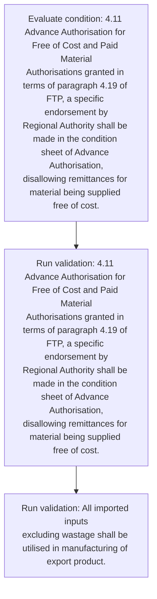
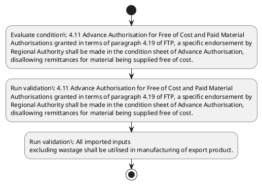

# Chapter 4 / Section 4.11: Advance Authorisation for Free of Cost and Paid Material

**Chapter Title:** Duty Exemption / Remission Schemes

**Pages:** 8

**Purpose:** 4.11 Advance Authorisation for Free of Cost and Paid Material
Authorisations granted in terms of paragraph 4.19 of FTP, a specific endorsement by
Regional Authority shall be made in the condition sheet of Advance Authorisation,
disallowing remittances for material being supplied free of cost.

**Purpose Thanglish:** Indha Advance Authorisation for Free of Cost and Paid Material section-la, 4.11 Advance Authorisation for Free of Cost and Paid Material
Authorisations granted in terms of paragraph 4.19 of FTP, a specific endorsement by
Regional authority kandippa be made in the condition sheet of Advance Authorisation,
disallowing remittances for material being supplied free of cost.

**Summary:** 4.11 Advance Authorisation for Free of Cost and Paid Material
Authorisations granted in terms of paragraph 4.19 of FTP, a specific endorsement by
Regional Authority shall be made in the condition sheet of Advance Authorisation,
disallowing remittances for material being supplied free of cost. All imported inputs
excluding wastage shall be utilised in manufacturing of export product.

**Business Meaning:** Advance Authorisation for Free of Cost and Paid Material governs how DGFT business controls should be applied, validated, and enforced.

**Business Explanation:** Advance Authorisation for Free of Cost and Paid Material explains the operating rule set that DEKAI should enforce. Key control points include 4.11 Advance Authorisation for Free of Cost and Paid Material
Authorisations granted in terms of paragraph 4.19 of FTP, a specific endorsement by
Regional Authority shall be made in the condition sheet of Advance Authorisation,
disallowing remittances for material being supplied free of cost.

**Business Explanation Thanglish:** Indha Advance Authorisation for Free of Cost and Paid Material section-la, Advance Authorisation for Free of Cost and Paid Material explains the operating rule set that DEKAI should enforce. Key control points include 4.11 Advance Authorisation for Free of Cost and Paid Material
Authorisations granted in terms of paragraph 4.19 of FTP, a specific endorsement by
Regional authority kandippa be made in the condition sheet of Advance Authorisation,
disallowing remittances for material being supplied free of cost.

## Business Logic
- 4.11 Advance Authorisation for Free of Cost and Paid Material
Authorisations granted in terms of paragraph 4.19 of FTP, a specific endorsement by
Regional Authority shall be made in the condition sheet of Advance Authorisation,
disallowing remittances for material being supplied free of cost.
- All imported inputs
excluding wastage shall be utilised in manufacturing of export product.

## Business Rules
- rule_id=CH4-SEC4_11-R001, rule_description=4.11 Advance Authorisation for Free of Cost and Paid Material
Authorisations granted in terms of paragraph 4.19 of FTP, a specific endorsement by
Regional Authority shall be made in the condition sheet of Advance Authorisation,
disallowing remittances for material being supplied free of cost., trigger=Advance Authorisation for Free of Cost and Paid Material, condition=4.11 Advance Authorisation for Free of Cost and Paid Material
Authorisations granted in terms of paragraph 4.19 of FTP, a specific endorsement by
Regional Authority shall be made in the condition sheet of Advance Authorisation,
disallowing remittances for material being supplied free of cost., validation=4.11 Advance Authorisation for Free of Cost and Paid Material
Authorisations granted in terms of paragraph 4.19 of FTP, a specific endorsement by
Regional Authority shall be made in the condition sheet of Advance Authorisation,
disallowing remittances for material being supplied free of cost., action=Manual review required., exception=No explicit exception found in uploaded documents., output=DEKAI should produce a compliance decision for 4.11 - Advance Authorisation for Free of Cost and Paid Material.
- rule_id=CH4-SEC4_11-R002, rule_description=All imported inputs
excluding wastage shall be utilised in manufacturing of export product., trigger=Advance Authorisation for Free of Cost and Paid Material, condition=4.11 Advance Authorisation for Free of Cost and Paid Material
Authorisations granted in terms of paragraph 4.19 of FTP, a specific endorsement by
Regional Authority shall be made in the condition sheet of Advance Authorisation,
disallowing remittances for material being supplied free of cost., validation=All imported inputs
excluding wastage shall be utilised in manufacturing of export product., action=Manual review required., exception=No explicit exception found in uploaded documents., output=DEKAI should produce a compliance decision for 4.11 - Advance Authorisation for Free of Cost and Paid Material.

## Conditions
- 4.11 Advance Authorisation for Free of Cost and Paid Material
Authorisations granted in terms of paragraph 4.19 of FTP, a specific endorsement by
Regional Authority shall be made in the condition sheet of Advance Authorisation,
disallowing remittances for material being supplied free of cost.

## Condition Logic
- id=4.4.11.1, if=4.11 Advance Authorisation for Free of Cost and Paid Material
Authorisations granted in terms of paragraph 4.19 of FTP, a specific endorsement by
Regional Authority shall be made in the condition sheet of Advance Authorisation,
disallowing remittances for material being supplied free of cost., then=Route for review, source=4.11 Advance Authorisation for Free of Cost and Paid Material
Authorisations granted in terms of paragraph 4.19 of FTP, a specific endorsement by
Regional Authority shall be made in the condition sheet of Advance Authorisation,
disallowing remittances for material being supplied free of cost.

## Validations
- 4.11 Advance Authorisation for Free of Cost and Paid Material
Authorisations granted in terms of paragraph 4.19 of FTP, a specific endorsement by
Regional Authority shall be made in the condition sheet of Advance Authorisation,
disallowing remittances for material being supplied free of cost.
- All imported inputs
excluding wastage shall be utilised in manufacturing of export product.

## Exceptions
- None identified

## Dependencies
- 4.19

## Authorities
- Regional Authority

## Required Documents
- None identified

## Timelines
- None identified

## Actions
- None identified

## Workflow
- Evaluate condition: 4.11 Advance Authorisation for Free of Cost and Paid Material
Authorisations granted in terms of paragraph 4.19 of FTP, a specific endorsement by
Regional Authority shall be made in the condition sheet of Advance Authorisation,
disallowing remittances for material being supplied free of cost.
- Run validation: 4.11 Advance Authorisation for Free of Cost and Paid Material
Authorisations granted in terms of paragraph 4.19 of FTP, a specific endorsement by
Regional Authority shall be made in the condition sheet of Advance Authorisation,
disallowing remittances for material being supplied free of cost.
- Run validation: All imported inputs
excluding wastage shall be utilised in manufacturing of export product.

## Workflow ASCII
```text
Advance Authorisation for Free of Cost and Paid Material
Evaluate condition: 4.11 Advance Authorisation for Free of Cost and Paid Material
Authorisations granted in terms of paragraph 4.19 of FTP, a specific endorsement by
Regional Authority shall be made in the condition sheet of Advance Authorisation,
disallowing remittances for material being supplied free of cost.
   |
   v
Run validation: 4.11 Advance Authorisation for Free of Cost and Paid Material
Authorisations granted in terms of paragraph 4.19 of FTP, a specific endorsement by
Regional Authority shall be made in the condition sheet of Advance Authorisation,
disallowing remittances for material being supplied free of cost.
   |
   v
Run validation: All imported inputs
excluding wastage shall be utilised in manufacturing of export product.
```

## Decision Tree
- IF section 4.11 applies THEN proceed with standard DGFT workflow

## Decision Tree ASCII
```text
Advance Authorisation for Free of Cost and Paid Material Decision
IF section 4.11 applies THEN proceed with standard DGFT workflow
```

## Examples
- User asks to process Advance Authorisation for Free of Cost and Paid Material; the platform checks conditions, validations, and documents before action.

**Real-world Example:** Example: an importer or exporter invokes Advance Authorisation for Free of Cost and Paid Material, submits the prescribed DGFT records, and DEKAI uses the extracted rules to follow the advance authorisation for free of cost and paid material process.

**Real-world Example Thanglish:** Indha Advance Authorisation for Free of Cost and Paid Material section-la, Example: an importer or exporter invokes Advance Authorisation for Free of Cost and Paid Material, submits the prescribed DGFT records, and DEKAI uses the extracted rules to follow the advance authorisation for free of cost and paid material process.

## AI Rules
- IF detected context matches section rule THEN enforce: 4.11 Advance Authorisation for Free of Cost and Paid Material
Authorisations granted in terms of paragraph 4.19 of FTP, a specific endorsement by
Regional Authority shall be made in the condition sheet of Advance Authorisation,
disallowing remittances for material being supplied free of cost.
- IF detected context matches section rule THEN enforce: All imported inputs
excluding wastage shall be utilised in manufacturing of export product.

## Database Fields
- name=section_code, type=string, required=True, source=parsed_section_heading
- name=section_title, type=string, required=True, source=parsed_section_heading
- name=for_flag, type=boolean, required=False, source=keyword:for
- name=and_flag, type=boolean, required=False, source=keyword:and
- name=ftp_flag, type=boolean, required=False, source=keyword:FTP
- name=the_flag, type=boolean, required=False, source=keyword:the
- name=all_flag, type=boolean, required=False, source=keyword:All
- name=free_flag, type=boolean, required=False, source=keyword:Free
- name=cost_flag, type=boolean, required=False, source=keyword:Cost
- name=paid_flag, type=boolean, required=False, source=keyword:Paid

## API Requirements
- method=GET, path=/api/dgft/sections/4.11, purpose=Retrieve knowledge payload for section 4.11, query_params=['include=workflow,decision_tree,validations'], response_fields=['section', 'title', 'summary', 'conditions', 'validations', 'exceptions', 'workflow', 'decision_tree']
- method=POST, path=/api/dgft/Advance-Authorisation-for-Free-of-Cost-and-Paid-Material/validate, purpose=Validate inputs and documents for Advance Authorisation for Free of Cost and Paid Material, request_fields=['section_code', 'section_title'], response_fields=['status', 'errors', 'warnings', 'next_actions']

## UI Screens
- screen_id=Advance_Authorisation_for_Free_of_Cost_and_Paid_Material_overview, name=Advance Authorisation for Free of Cost and Paid Material Overview, purpose=Show section summary, authority, timeline, and eligibility cues., widgets=['summary_card', 'conditions_table', 'authority_badges', 'timeline_panel']
- screen_id=Advance_Authorisation_for_Free_of_Cost_and_Paid_Material_submission, name=Advance Authorisation for Free of Cost and Paid Material Submission, purpose=Capture applicant data and supporting documents., widgets=['dynamic_form', 'document_uploader', 'validation_panel', 'next_action_footer'], fields=['section_code', 'section_title', 'for_flag', 'and_flag', 'ftp_flag', 'the_flag', 'all_flag', 'free_flag']

## Error Messages
- Validation failed because the section requirements were not fully met.

## FAQ
- question_en=What is the purpose of section 4.11?, answer_en=Advance Authorisation for Free of Cost and Paid Material explains the operating rule set that DEKAI should enforce. Key control points include 4.11 Advance Authorisation for Free of Cost and Paid Material
Authorisations granted in terms of paragraph 4.19 of FTP, a specific endorsement by
Regional Authority shall be made in the condition sheet of Advance Authorisation,
disallowing remittances for material being supplied free of cost., question_thanglish=Indha Advance Authorisation for Free of Cost and Paid Material section-la, What is the purpose of section 4.11?, answer_thanglish=Indha Advance Authorisation for Free of Cost and Paid Material section-la, Advance Authorisation for Free of Cost and Paid Material explains the operating rule set that DEKAI should enforce. Key control points include 4.11 Advance Authorisation for Free of Cost and Paid Material
Authorisations granted in terms of paragraph 4.19 of FTP, a specific endorsement by
Regional authority kandippa be made in the condition sheet of Advance Authorisation,
disallowing remittances for material being supplied free of cost.
- question_en=What documents are required under Advance Authorisation for Free of Cost and Paid Material?, answer_en=Not explicitly covered in uploaded documents., question_thanglish=Indha Advance Authorisation for Free of Cost and Paid Material section-la, What documents are required under Advance Authorisation for Free of Cost and Paid Material?, answer_thanglish=Indha Advance Authorisation for Free of Cost and Paid Material section-la, Not explicitly covered in uploaded documents.
- question_en=Which authority handles Advance Authorisation for Free of Cost and Paid Material?, answer_en=Regional Authority, question_thanglish=Indha Advance Authorisation for Free of Cost and Paid Material section-la, Which authority handles Advance Authorisation for Free of Cost and Paid Material?, answer_thanglish=Indha Advance Authorisation for Free of Cost and Paid Material section-la, Regional authority

## Questions Users May Ask
- What does Advance Authorisation for Free of Cost and Paid Material require?
- Which documents are needed for Advance Authorisation for Free of Cost and Paid Material?
- How does DEKAI validate Advance Authorisation for Free of Cost and Paid Material requests?

## Expected AI Answers
- Advance Authorisation for Free of Cost and Paid Material requires the platform to interpret the section text, apply the extracted business rules, and present the correct next action.
- Required documents are inferred from the section text: no explicit documents were detected.
- DEKAI validates Advance Authorisation for Free of Cost and Paid Material by checking conditions, required documents, authority references, and exception clauses before recommending an outcome.

## AI Q&A Examples
- question_en=User asks: How do I comply with Advance Authorisation for Free of Cost and Paid Material?, answer_en=AI answers: DEKAI should evaluate section 4.11, apply the extracted rules, and guide the user through Evaluate condition: 4.11 Advance Authorisation for Free of Cost and Paid Material
Authorisations granted in terms of paragraph 4.19 of FTP, a specific endorsement by
Regional Authority shall be made in the condition sheet of Advance Authorisation,
disallowing remittances for material being supplied free of cost.., question_thanglish=Indha Advance Authorisation for Free of Cost and Paid Material section-la, User asks: How do I comply with Advance Authorisation for Free of Cost and Paid Material?, answer_thanglish=Indha Advance Authorisation for Free of Cost and Paid Material section-la, AI answers: DEKAI should evaluate section 4.11, apply the extracted rules, and guide the user through Evaluate condition: 4.11 Advance Authorisation for Free of Cost and Paid Material
Authorisations granted in terms of paragraph 4.19 of FTP, a specific endorsement by
Regional authority kandippa be made in the condition sheet of Advance Authorisation,
disallowing remittances for material being supplied free of cost..
- question_en=User asks: Which validations apply to Advance Authorisation for Free of Cost and Paid Material?, answer_en=AI answers: Applicable validations are 4.11 Advance Authorisation for Free of Cost and Paid Material
Authorisations granted in terms of paragraph 4.19 of FTP, a specific endorsement by
Regional Authority shall be made in the condition sheet of Advance Authorisation,
disallowing remittances for material being supplied free of cost., All imported inputs
excluding wastage shall be utilised in manufacturing of export product., question_thanglish=Indha Advance Authorisation for Free of Cost and Paid Material section-la, User asks: Which validations apply to Advance Authorisation for Free of Cost and Paid Material?, answer_thanglish=Indha Advance Authorisation for Free of Cost and Paid Material section-la, AI answers: Applicable validations are 4.11 Advance Authorisation for Free of Cost and Paid Material
Authorisations granted in terms of paragraph 4.19 of FTP, a specific endorsement by
Regional authority kandippa be made in the condition sheet of Advance Authorisation,
disallowing remittances for material being supplied free of cost., All imported inputs
excluding wastage kandippa be utilised in manufacturing of export product.

## DEKAI AI Implementation Notes
- Capture chapter 4, section 4.11, title, and page references as immutable knowledge metadata.
- Bind validations for Advance Authorisation for Free of Cost and Paid Material into a rule engine keyed by the rule IDs extracted for this section.
- Route escalations or approvals to: Regional Authority.
- Show contextual links to related sections: 4.19.

## DEKAI AI Implementation Notes Thanglish
- Indha Advance Authorisation for Free of Cost and Paid Material section-la, Capture chapter 4, section 4.11, title, and page references as immutable knowledge metadata.
- Indha Advance Authorisation for Free of Cost and Paid Material section-la, Bind validations for Advance Authorisation for Free of Cost and Paid Material into a rule engine keyed by the rule IDs extracted for this section.
- Indha Advance Authorisation for Free of Cost and Paid Material section-la, Route escalations or approvals to: Regional authority.
- Indha Advance Authorisation for Free of Cost and Paid Material section-la, Show contextual links to related sections: 4.19.

## AI Metadata
- Keywords: for, and, FTP, the, All, Free, Cost, Paid, made, terms, shall, sheet, being, inputs, export, Advance, granted, wastage, product, Material
- Search Keywords: for, and, FTP, the, All, Free, Cost, Paid, made, terms, shall, sheet, being, inputs, export, Advance, granted, wastage, product, Material
- Intent: Provide knowledge guidance for Advance Authorisation for Free of Cost and Paid Material.
- Tags: 4.11, Advance Authorisation for Free of Cost and Paid Material, business-rule, dgft
- Related Sections: 4.19
- Related Chapters: 
- Related Rules: 4.11 Advance Authorisation for Free of Cost and Paid Material
Authorisations granted in terms of paragraph 4.19 of FTP, a specific endorsement by
Regional Authority shall be made in the condition sheet of Advance Authorisation,
disallowing remittances for material being supplied free of cost., All imported inputs
excluding wastage shall be utilised in manufacturing of export product.

## Mermaid


## PlantUML

