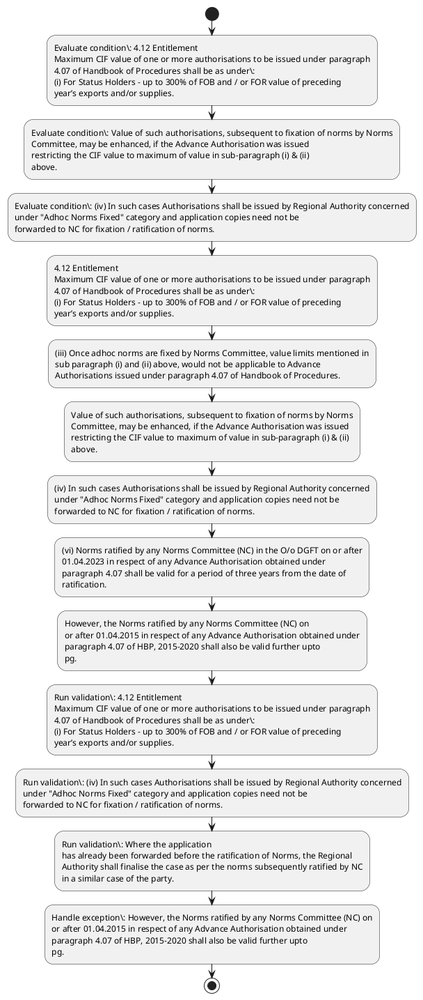

# Chapter 4 / Section 4.12: Entitlement

**Chapter Title:** Duty Exemption / Remission Schemes

**Pages:** 8, 9

**Purpose:** 4.12 Entitlement
Maximum CIF value of one or more authorisations to be issued under paragraph
4.07 of Handbook of Procedures shall be as under:
(i) For Status Holders – up to 300% of FOB and / or FOR value of preceding
year’s exports and/or supplies.

**Purpose Thanglish:** Indha Entitlement section-la, 4.12 Entitlement
Maximum CIF value of one or more authorisations to be issued under paragraph
4.07 of Handbook of Procedures kandippa be as under:
(i) For Status Holders – up to 300% of FOB and / or FOR value of preceding
year’s exports and/or supplies.

**Summary:** 4.12 Entitlement
Maximum CIF value of one or more authorisations to be issued under paragraph
4.07 of Handbook of Procedures shall be as under:
(i) For Status Holders – up to 300% of FOB and / or FOR value of preceding
year’s exports and/or supplies. (ii) Other than Status Holders – upto 300% of FOB or Rs. 10 crore and / or FOR
value of preceding year’s exports and/or supplies, whichever is higher.

**Business Meaning:** Entitlement governs how DGFT business controls should be applied, validated, and enforced.

**Business Explanation:** Entitlement explains the operating rule set that DEKAI should enforce. Key control points include 4.12 Entitlement
Maximum CIF value of one or more authorisations to be issued under paragraph
4.07 of Handbook of Procedures shall be as under:
(i) For Status Holders – up to 300% of FOB and / or FOR value of preceding
year’s exports and/or supplies. The section also drives actions such as 4.12 Entitlement
Maximum CIF value of one or more authorisations to be issued under paragraph
4.07 of Handbook of Procedures shall be as under:
(i) For Status Holders – up to 300% of FOB and / or FOR value of preceding
year’s exports and/or supplies..

**Business Explanation Thanglish:** Indha Entitlement section-la, Entitlement explains the operating rule set that DEKAI should enforce. Key control points include 4.12 Entitlement
Maximum CIF value of one or more authorisations to be issued under paragraph
4.07 of Handbook of Procedures kandippa be as under:
(i) For Status Holders – up to 300% of FOB and / or FOR value of preceding
year’s exports and/or supplies. The section also drives actions such as 4.12 Entitlement
Maximum CIF value of one or more authorisations to be issued under paragraph
4.07 of Handbook of Procedures kandippa be as under:
(i) For Status Holders – up to 300% of FOB and / or FOR value of preceding
year’s exports and/or supplies..

## Business Logic
- 4.12 Entitlement
Maximum CIF value of one or more authorisations to be issued under paragraph
4.07 of Handbook of Procedures shall be as under:
(i) For Status Holders – up to 300% of FOB and / or FOR value of preceding
year’s exports and/or supplies.
- (iv) In such cases Authorisations shall be issued by Regional Authority concerned
under "Adhoc Norms Fixed" category and application copies need not be
forwarded to NC for fixation / ratification of norms.
- Where the application
has already been forwarded before the ratification of Norms, the Regional
Authority shall finalise the case as per the norms subsequently ratified by NC
in a similar case of the party.
- (v) Authorisation holder in such cases shall be entitled for further authorisation
(s) as per norms ratified by Norms Committee without need for subsequent
ratification by Norms Committee.
- (vi) Norms ratified by any Norms Committee (NC) in the O/o DGFT on or after
01.04.2023 in respect of any Advance Authorisation obtained under
paragraph 4.07 shall be valid for a period of three years from the date of
ratification.
- However, the Norms ratified by any Norms Committee (NC) on
or after 01.04.2015 in respect of any Advance Authorisation obtained under
paragraph 4.07 of HBP, 2015-2020 shall also be valid further upto
pg.
- 83
4.12 Entitlement
Maximum CIF value of one or more authorisations to be issued under paragraph
4.07 of Handbook of Procedures shall be as under:
(i)
For Status Holders – up to 300% of FOB and / or FOR value of preceding
year’s exports and/or supplies.
- (iv)
In such cases Authorisations shall be issued by Regional Authority concerned
under "Adhoc Norms Fixed" category and application copies need not be
forwarded to NC for fixation / ratification of norms.
- (v)
Authorisation holder in such cases shall be entitled for further authorisation
(s) as per norms ratified by Norms Committee without need for subsequent
ratification by Norms Committee.
- (vi)
Norms ratified by any Norms Committee (NC) in the O/o DGFT on or after
01.04.2023 in respect of any Advance Authorisation obtained under
paragraph 4.07 shall be valid for a period of three years from the date of
ratification.
- However, the Norms ratified by any Norms Committee (NC) on
or after 01.04.2015 in respect of any Advance Authorisation obtained under
paragraph 4.07 of HBP, 2015-2020 shall also be valid further upto
31.03.2026.i Since all decisions of the Norms Committees are available in the
form of minutes on the DGFT website, all other applicants of Advance
Authorisation are also eligible to apply and get their authorisations based
on such ratified norms on repeat basis during validity of these norms.
- However, exporters shall indicate clearly details of such
components imported on “net-to-net basis with accountability clause” in the
export/supply documents namely Shipping Bills, Bill of Exports, Tax invoice
for export/supplies prescribed under the CGST/SGST/UT GST rules
evidencing that these imported inputs have been exported.

## Business Rules
- rule_id=CH4-SEC4_12-R001, rule_description=4.12 Entitlement
Maximum CIF value of one or more authorisations to be issued under paragraph
4.07 of Handbook of Procedures shall be as under:
(i) For Status Holders – up to 300% of FOB and / or FOR value of preceding
year’s exports and/or supplies., trigger=Entitlement, condition=4.12 Entitlement
Maximum CIF value of one or more authorisations to be issued under paragraph
4.07 of Handbook of Procedures shall be as under:
(i) For Status Holders – up to 300% of FOB and / or FOR value of preceding
year’s exports and/or supplies., validation=4.12 Entitlement
Maximum CIF value of one or more authorisations to be issued under paragraph
4.07 of Handbook of Procedures shall be as under:
(i) For Status Holders – up to 300% of FOB and / or FOR value of preceding
year’s exports and/or supplies., action=4.12 Entitlement
Maximum CIF value of one or more authorisations to be issued under paragraph
4.07 of Handbook of Procedures shall be as under:
(i) For Status Holders – up to 300% of FOB and / or FOR value of preceding
year’s exports and/or supplies., exception=However, the Norms ratified by any Norms Committee (NC) on
or after 01.04.2015 in respect of any Advance Authorisation obtained under
paragraph 4.07 of HBP, 2015-2020 shall also be valid further upto
pg., output=DEKAI should produce a compliance decision for 4.12 - Entitlement.
- rule_id=CH4-SEC4_12-R002, rule_description=(iv) In such cases Authorisations shall be issued by Regional Authority concerned
under "Adhoc Norms Fixed" category and application copies need not be
forwarded to NC for fixation / ratification of norms., trigger=Entitlement, condition=Value of such authorisations, subsequent to fixation of norms by Norms
Committee, may be enhanced, if the Advance Authorisation was issued
restricting the CIF value to maximum of value in sub-paragraph (i) & (ii)
above., validation=(iv) In such cases Authorisations shall be issued by Regional Authority concerned
under "Adhoc Norms Fixed" category and application copies need not be
forwarded to NC for fixation / ratification of norms., action=(iii) Once adhoc norms are fixed by Norms Committee, value limits mentioned in
sub paragraph (i) and (ii) above, would not be applicable to Advance
Authorisations issued under paragraph 4.07 of Handbook of Procedures., exception=However, the Norms ratified by any Norms Committee (NC) on
or after 01.04.2015 in respect of any Advance Authorisation obtained under
paragraph 4.07 of HBP, 2015-2020 shall also be valid further upto
31.03.2026.i Since all decisions of the Norms Committees are available in the
form of minutes on the DGFT website, all other applicants of Advance
Authorisation are also eligible to apply and get their authorisations based
on such ratified norms on repeat basis during validity of these norms., output=DEKAI should produce a compliance decision for 4.12 - Entitlement.
- rule_id=CH4-SEC4_12-R003, rule_description=Where the application
has already been forwarded before the ratification of Norms, the Regional
Authority shall finalise the case as per the norms subsequently ratified by NC
in a similar case of the party., trigger=Entitlement, condition=(iv) In such cases Authorisations shall be issued by Regional Authority concerned
under "Adhoc Norms Fixed" category and application copies need not be
forwarded to NC for fixation / ratification of norms., validation=Where the application
has already been forwarded before the ratification of Norms, the Regional
Authority shall finalise the case as per the norms subsequently ratified by NC
in a similar case of the party., action=Value of such authorisations, subsequent to fixation of norms by Norms
Committee, may be enhanced, if the Advance Authorisation was issued
restricting the CIF value to maximum of value in sub-paragraph (i) & (ii)
above., exception=However, exporters shall indicate clearly details of such
components imported on “net-to-net basis with accountability clause” in the
export/supply documents namely Shipping Bills, Bill of Exports, Tax invoice
for export/supplies prescribed under the CGST/SGST/UT GST rules
evidencing that these imported inputs have been exported., output=DEKAI should produce a compliance decision for 4.12 - Entitlement.
- rule_id=CH4-SEC4_12-R004, rule_description=(v) Authorisation holder in such cases shall be entitled for further authorisation
(s) as per norms ratified by Norms Committee without need for subsequent
ratification by Norms Committee., trigger=Entitlement, condition=Where the application
has already been forwarded before the ratification of Norms, the Regional
Authority shall finalise the case as per the norms subsequently ratified by NC
in a similar case of the party., validation=(v) Authorisation holder in such cases shall be entitled for further authorisation
(s) as per norms ratified by Norms Committee without need for subsequent
ratification by Norms Committee., action=(iv) In such cases Authorisations shall be issued by Regional Authority concerned
under "Adhoc Norms Fixed" category and application copies need not be
forwarded to NC for fixation / ratification of norms., exception=However, exporters shall indicate clearly details of such
components imported on “net-to-net basis with accountability clause” in the
export/supply documents namely Shipping Bills, Bill of Exports, Tax invoice
for export/supplies prescribed under the CGST/SGST/UT GST rules
evidencing that these imported inputs have been exported., output=DEKAI should produce a compliance decision for 4.12 - Entitlement.
- rule_id=CH4-SEC4_12-R005, rule_description=(vi) Norms ratified by any Norms Committee (NC) in the O/o DGFT on or after
01.04.2023 in respect of any Advance Authorisation obtained under
paragraph 4.07 shall be valid for a period of three years from the date of
ratification., trigger=Entitlement, condition=(v) Authorisation holder in such cases shall be entitled for further authorisation
(s) as per norms ratified by Norms Committee without need for subsequent
ratification by Norms Committee., validation=(vi) Norms ratified by any Norms Committee (NC) in the O/o DGFT on or after
01.04.2023 in respect of any Advance Authorisation obtained under
paragraph 4.07 shall be valid for a period of three years from the date of
ratification., action=(vi) Norms ratified by any Norms Committee (NC) in the O/o DGFT on or after
01.04.2023 in respect of any Advance Authorisation obtained under
paragraph 4.07 shall be valid for a period of three years from the date of
ratification., exception=However, exporters shall indicate clearly details of such
components imported on “net-to-net basis with accountability clause” in the
export/supply documents namely Shipping Bills, Bill of Exports, Tax invoice
for export/supplies prescribed under the CGST/SGST/UT GST rules
evidencing that these imported inputs have been exported., output=DEKAI should produce a compliance decision for 4.12 - Entitlement.
- rule_id=CH4-SEC4_12-R006, rule_description=However, the Norms ratified by any Norms Committee (NC) on
or after 01.04.2015 in respect of any Advance Authorisation obtained under
paragraph 4.07 of HBP, 2015-2020 shall also be valid further upto
pg., trigger=Entitlement, condition=(vi) Norms ratified by any Norms Committee (NC) in the O/o DGFT on or after
01.04.2023 in respect of any Advance Authorisation obtained under
paragraph 4.07 shall be valid for a period of three years from the date of
ratification., validation=However, the Norms ratified by any Norms Committee (NC) on
or after 01.04.2015 in respect of any Advance Authorisation obtained under
paragraph 4.07 of HBP, 2015-2020 shall also be valid further upto
pg., action=However, the Norms ratified by any Norms Committee (NC) on
or after 01.04.2015 in respect of any Advance Authorisation obtained under
paragraph 4.07 of HBP, 2015-2020 shall also be valid further upto
pg., exception=However, exporters shall indicate clearly details of such
components imported on “net-to-net basis with accountability clause” in the
export/supply documents namely Shipping Bills, Bill of Exports, Tax invoice
for export/supplies prescribed under the CGST/SGST/UT GST rules
evidencing that these imported inputs have been exported., output=DEKAI should produce a compliance decision for 4.12 - Entitlement.
- rule_id=CH4-SEC4_12-R007, rule_description=83
4.12 Entitlement
Maximum CIF value of one or more authorisations to be issued under paragraph
4.07 of Handbook of Procedures shall be as under:
(i)
For Status Holders – up to 300% of FOB and / or FOR value of preceding
year’s exports and/or supplies., trigger=Entitlement, condition=However, the Norms ratified by any Norms Committee (NC) on
or after 01.04.2015 in respect of any Advance Authorisation obtained under
paragraph 4.07 of HBP, 2015-2020 shall also be valid further upto
pg., validation=83
4.12 Entitlement
Maximum CIF value of one or more authorisations to be issued under paragraph
4.07 of Handbook of Procedures shall be as under:
(i)
For Status Holders – up to 300% of FOB and / or FOR value of preceding
year’s exports and/or supplies., action=83
4.12 Entitlement
Maximum CIF value of one or more authorisations to be issued under paragraph
4.07 of Handbook of Procedures shall be as under:
(i)
For Status Holders – up to 300% of FOB and / or FOR value of preceding
year’s exports and/or supplies., exception=However, exporters shall indicate clearly details of such
components imported on “net-to-net basis with accountability clause” in the
export/supply documents namely Shipping Bills, Bill of Exports, Tax invoice
for export/supplies prescribed under the CGST/SGST/UT GST rules
evidencing that these imported inputs have been exported., output=DEKAI should produce a compliance decision for 4.12 - Entitlement.
- rule_id=CH4-SEC4_12-R008, rule_description=(iv)
In such cases Authorisations shall be issued by Regional Authority concerned
under "Adhoc Norms Fixed" category and application copies need not be
forwarded to NC for fixation / ratification of norms., trigger=Entitlement, condition=83
4.12 Entitlement
Maximum CIF value of one or more authorisations to be issued under paragraph
4.07 of Handbook of Procedures shall be as under:
(i)
For Status Holders – up to 300% of FOB and / or FOR value of preceding
year’s exports and/or supplies., validation=(iv)
In such cases Authorisations shall be issued by Regional Authority concerned
under "Adhoc Norms Fixed" category and application copies need not be
forwarded to NC for fixation / ratification of norms., action=(iii)
Once adhoc norms are fixed by Norms Committee, value limits mentioned in
sub paragraph (i) and (ii) above, would not be applicable to Advance
Authorisations issued under paragraph 4.07 of Handbook of Procedures., exception=However, exporters shall indicate clearly details of such
components imported on “net-to-net basis with accountability clause” in the
export/supply documents namely Shipping Bills, Bill of Exports, Tax invoice
for export/supplies prescribed under the CGST/SGST/UT GST rules
evidencing that these imported inputs have been exported., output=DEKAI should produce a compliance decision for 4.12 - Entitlement.
- rule_id=CH4-SEC4_12-R009, rule_description=(v)
Authorisation holder in such cases shall be entitled for further authorisation
(s) as per norms ratified by Norms Committee without need for subsequent
ratification by Norms Committee., trigger=Entitlement, condition=(iv)
In such cases Authorisations shall be issued by Regional Authority concerned
under "Adhoc Norms Fixed" category and application copies need not be
forwarded to NC for fixation / ratification of norms., validation=(v)
Authorisation holder in such cases shall be entitled for further authorisation
(s) as per norms ratified by Norms Committee without need for subsequent
ratification by Norms Committee., action=(iv)
In such cases Authorisations shall be issued by Regional Authority concerned
under "Adhoc Norms Fixed" category and application copies need not be
forwarded to NC for fixation / ratification of norms., exception=However, exporters shall indicate clearly details of such
components imported on “net-to-net basis with accountability clause” in the
export/supply documents namely Shipping Bills, Bill of Exports, Tax invoice
for export/supplies prescribed under the CGST/SGST/UT GST rules
evidencing that these imported inputs have been exported., output=DEKAI should produce a compliance decision for 4.12 - Entitlement.
- rule_id=CH4-SEC4_12-R010, rule_description=(vi)
Norms ratified by any Norms Committee (NC) in the O/o DGFT on or after
01.04.2023 in respect of any Advance Authorisation obtained under
paragraph 4.07 shall be valid for a period of three years from the date of
ratification., trigger=Entitlement, condition=(v)
Authorisation holder in such cases shall be entitled for further authorisation
(s) as per norms ratified by Norms Committee without need for subsequent
ratification by Norms Committee., validation=(vi)
Norms ratified by any Norms Committee (NC) in the O/o DGFT on or after
01.04.2023 in respect of any Advance Authorisation obtained under
paragraph 4.07 shall be valid for a period of three years from the date of
ratification., action=(vi)
Norms ratified by any Norms Committee (NC) in the O/o DGFT on or after
01.04.2023 in respect of any Advance Authorisation obtained under
paragraph 4.07 shall be valid for a period of three years from the date of
ratification., exception=However, exporters shall indicate clearly details of such
components imported on “net-to-net basis with accountability clause” in the
export/supply documents namely Shipping Bills, Bill of Exports, Tax invoice
for export/supplies prescribed under the CGST/SGST/UT GST rules
evidencing that these imported inputs have been exported., output=DEKAI should produce a compliance decision for 4.12 - Entitlement.
- rule_id=CH4-SEC4_12-R011, rule_description=However, the Norms ratified by any Norms Committee (NC) on
or after 01.04.2015 in respect of any Advance Authorisation obtained under
paragraph 4.07 of HBP, 2015-2020 shall also be valid further upto
31.03.2026.i Since all decisions of the Norms Committees are available in the
form of minutes on the DGFT website, all other applicants of Advance
Authorisation are also eligible to apply and get their authorisations based
on such ratified norms on repeat basis during validity of these norms., trigger=Entitlement, condition=(vi)
Norms ratified by any Norms Committee (NC) in the O/o DGFT on or after
01.04.2023 in respect of any Advance Authorisation obtained under
paragraph 4.07 shall be valid for a period of three years from the date of
ratification., validation=However, the Norms ratified by any Norms Committee (NC) on
or after 01.04.2015 in respect of any Advance Authorisation obtained under
paragraph 4.07 of HBP, 2015-2020 shall also be valid further upto
31.03.2026.i Since all decisions of the Norms Committees are available in the
form of minutes on the DGFT website, all other applicants of Advance
Authorisation are also eligible to apply and get their authorisations based
on such ratified norms on repeat basis during validity of these norms., action=However, the Norms ratified by any Norms Committee (NC) on
or after 01.04.2015 in respect of any Advance Authorisation obtained under
paragraph 4.07 of HBP, 2015-2020 shall also be valid further upto
31.03.2026.i Since all decisions of the Norms Committees are available in the
form of minutes on the DGFT website, all other applicants of Advance
Authorisation are also eligible to apply and get their authorisations based
on such ratified norms on repeat basis during validity of these norms., exception=However, exporters shall indicate clearly details of such
components imported on “net-to-net basis with accountability clause” in the
export/supply documents namely Shipping Bills, Bill of Exports, Tax invoice
for export/supplies prescribed under the CGST/SGST/UT GST rules
evidencing that these imported inputs have been exported., output=DEKAI should produce a compliance decision for 4.12 - Entitlement.
- rule_id=CH4-SEC4_12-R012, rule_description=However, exporters shall indicate clearly details of such
components imported on “net-to-net basis with accountability clause” in the
export/supply documents namely Shipping Bills, Bill of Exports, Tax invoice
for export/supplies prescribed under the CGST/SGST/UT GST rules
evidencing that these imported inputs have been exported., trigger=Entitlement, condition=However, the Norms ratified by any Norms Committee (NC) on
or after 01.04.2015 in respect of any Advance Authorisation obtained under
paragraph 4.07 of HBP, 2015-2020 shall also be valid further upto
31.03.2026.i Since all decisions of the Norms Committees are available in the
form of minutes on the DGFT website, all other applicants of Advance
Authorisation are also eligible to apply and get their authorisations based
on such ratified norms on repeat basis during validity of these norms., validation=However, exporters shall indicate clearly details of such
components imported on “net-to-net basis with accountability clause” in the
export/supply documents namely Shipping Bills, Bill of Exports, Tax invoice
for export/supplies prescribed under the CGST/SGST/UT GST rules
evidencing that these imported inputs have been exported., action=However, the Norms ratified by any Norms Committee (NC) on
or after 01.04.2015 in respect of any Advance Authorisation obtained under
paragraph 4.07 of HBP, 2015-2020 shall also be valid further upto
31.03.2026.i Since all decisions of the Norms Committees are available in the
form of minutes on the DGFT website, all other applicants of Advance
Authorisation are also eligible to apply and get their authorisations based
on such ratified norms on repeat basis during validity of these norms., exception=However, exporters shall indicate clearly details of such
components imported on “net-to-net basis with accountability clause” in the
export/supply documents namely Shipping Bills, Bill of Exports, Tax invoice
for export/supplies prescribed under the CGST/SGST/UT GST rules
evidencing that these imported inputs have been exported., output=DEKAI should produce a compliance decision for 4.12 - Entitlement.

## Conditions
- 4.12 Entitlement
Maximum CIF value of one or more authorisations to be issued under paragraph
4.07 of Handbook of Procedures shall be as under:
(i) For Status Holders – up to 300% of FOB and / or FOR value of preceding
year’s exports and/or supplies.
- Value of such authorisations, subsequent to fixation of norms by Norms
Committee, may be enhanced, if the Advance Authorisation was issued
restricting the CIF value to maximum of value in sub-paragraph (i) & (ii)
above.
- (iv) In such cases Authorisations shall be issued by Regional Authority concerned
under "Adhoc Norms Fixed" category and application copies need not be
forwarded to NC for fixation / ratification of norms.
- Where the application
has already been forwarded before the ratification of Norms, the Regional
Authority shall finalise the case as per the norms subsequently ratified by NC
in a similar case of the party.
- (v) Authorisation holder in such cases shall be entitled for further authorisation
(s) as per norms ratified by Norms Committee without need for subsequent
ratification by Norms Committee.
- (vi) Norms ratified by any Norms Committee (NC) in the O/o DGFT on or after
01.04.2023 in respect of any Advance Authorisation obtained under
paragraph 4.07 shall be valid for a period of three years from the date of
ratification.
- However, the Norms ratified by any Norms Committee (NC) on
or after 01.04.2015 in respect of any Advance Authorisation obtained under
paragraph 4.07 of HBP, 2015-2020 shall also be valid further upto
pg.
- 83
4.12 Entitlement
Maximum CIF value of one or more authorisations to be issued under paragraph
4.07 of Handbook of Procedures shall be as under:
(i)
For Status Holders – up to 300% of FOB and / or FOR value of preceding
year’s exports and/or supplies.
- (iv)
In such cases Authorisations shall be issued by Regional Authority concerned
under "Adhoc Norms Fixed" category and application copies need not be
forwarded to NC for fixation / ratification of norms.
- (v)
Authorisation holder in such cases shall be entitled for further authorisation
(s) as per norms ratified by Norms Committee without need for subsequent
ratification by Norms Committee.
- (vi)
Norms ratified by any Norms Committee (NC) in the O/o DGFT on or after
01.04.2023 in respect of any Advance Authorisation obtained under
paragraph 4.07 shall be valid for a period of three years from the date of
ratification.
- However, the Norms ratified by any Norms Committee (NC) on
or after 01.04.2015 in respect of any Advance Authorisation obtained under
paragraph 4.07 of HBP, 2015-2020 shall also be valid further upto
31.03.2026.i Since all decisions of the Norms Committees are available in the
form of minutes on the DGFT website, all other applicants of Advance
Authorisation are also eligible to apply and get their authorisations based
on such ratified norms on repeat basis during validity of these norms.
- This
para is not applicable for authorisations applied for items listed under
Appendix 4P.i
(vii) Wherever an applicant has applied for components on “net-to-net basis with
accountability clause” and such cases fall under paragraph 6 of General Note
for all Export Products, the same need not be referred to Norms Committee
for fixation of norms.

## Condition Logic
- id=4.4.12.1, if=4.12 Entitlement
Maximum CIF value of one or more authorisations to be issued under paragraph
4.07 of Handbook of Procedures shall be as under:
(i) For Status Holders – up to 300% of FOB and / or FOR value of preceding
year’s exports and/or supplies., then=4.12 Entitlement
Maximum CIF value of one or more authorisations to be issued under paragraph
4.07 of Handbook of Procedures shall be as under:
(i) For Status Holders – up to 300% of FOB and / or FOR value of preceding
year’s exports and/or supplies., source=4.12 Entitlement
Maximum CIF value of one or more authorisations to be issued under paragraph
4.07 of Handbook of Procedures shall be as under:
(i) For Status Holders – up to 300% of FOB and / or FOR value of preceding
year’s exports and/or supplies.
- id=4.4.12.2, if=Value of such authorisations, subsequent to fixation of norms by Norms
Committee, may be enhanced, if the Advance Authorisation was issued
restricting the CIF value to maximum of value in sub-paragraph (i) & (ii)
above., then=4.12 Entitlement
Maximum CIF value of one or more authorisations to be issued under paragraph
4.07 of Handbook of Procedures shall be as under:
(i) For Status Holders – up to 300% of FOB and / or FOR value of preceding
year’s exports and/or supplies., source=Value of such authorisations, subsequent to fixation of norms by Norms
Committee, may be enhanced, if the Advance Authorisation was issued
restricting the CIF value to maximum of value in sub-paragraph (i) & (ii)
above.
- id=4.4.12.3, if=(iv) In such cases Authorisations shall be issued by Regional Authority concerned
under "Adhoc Norms Fixed" category and application copies need not be
forwarded to NC for fixation / ratification of norms., then=4.12 Entitlement
Maximum CIF value of one or more authorisations to be issued under paragraph
4.07 of Handbook of Procedures shall be as under:
(i) For Status Holders – up to 300% of FOB and / or FOR value of preceding
year’s exports and/or supplies., source=(iv) In such cases Authorisations shall be issued by Regional Authority concerned
under "Adhoc Norms Fixed" category and application copies need not be
forwarded to NC for fixation / ratification of norms.
- id=4.4.12.4, if=Where the application
has already been forwarded before the ratification of Norms, the Regional
Authority shall finalise the case as per the norms subsequently ratified by NC
in a similar case of the party., then=4.12 Entitlement
Maximum CIF value of one or more authorisations to be issued under paragraph
4.07 of Handbook of Procedures shall be as under:
(i) For Status Holders – up to 300% of FOB and / or FOR value of preceding
year’s exports and/or supplies., source=Where the application
has already been forwarded before the ratification of Norms, the Regional
Authority shall finalise the case as per the norms subsequently ratified by NC
in a similar case of the party.
- id=4.4.12.5, if=(v) Authorisation holder in such cases shall be entitled for further authorisation
(s) as per norms ratified by Norms Committee without need for subsequent
ratification by Norms Committee., then=4.12 Entitlement
Maximum CIF value of one or more authorisations to be issued under paragraph
4.07 of Handbook of Procedures shall be as under:
(i) For Status Holders – up to 300% of FOB and / or FOR value of preceding
year’s exports and/or supplies., source=(v) Authorisation holder in such cases shall be entitled for further authorisation
(s) as per norms ratified by Norms Committee without need for subsequent
ratification by Norms Committee.
- id=4.4.12.6, if=(vi) Norms ratified by any Norms Committee (NC) in the O/o DGFT on or after
01.04.2023 in respect of any Advance Authorisation obtained under
paragraph 4.07 shall be valid for a period of three years from the date of
ratification., then=4.12 Entitlement
Maximum CIF value of one or more authorisations to be issued under paragraph
4.07 of Handbook of Procedures shall be as under:
(i) For Status Holders – up to 300% of FOB and / or FOR value of preceding
year’s exports and/or supplies., source=(vi) Norms ratified by any Norms Committee (NC) in the O/o DGFT on or after
01.04.2023 in respect of any Advance Authorisation obtained under
paragraph 4.07 shall be valid for a period of three years from the date of
ratification.
- id=4.4.12.7, if=However, the Norms ratified by any Norms Committee (NC) on
or after 01.04.2015 in respect of any Advance Authorisation obtained under
paragraph 4.07 of HBP, 2015-2020 shall also be valid further upto
pg., then=4.12 Entitlement
Maximum CIF value of one or more authorisations to be issued under paragraph
4.07 of Handbook of Procedures shall be as under:
(i) For Status Holders – up to 300% of FOB and / or FOR value of preceding
year’s exports and/or supplies., source=However, the Norms ratified by any Norms Committee (NC) on
or after 01.04.2015 in respect of any Advance Authorisation obtained under
paragraph 4.07 of HBP, 2015-2020 shall also be valid further upto
pg.
- id=4.4.12.8, if=83
4.12 Entitlement
Maximum CIF value of one or more authorisations to be issued under paragraph
4.07 of Handbook of Procedures shall be as under:
(i)
For Status Holders – up to 300% of FOB and / or FOR value of preceding
year’s exports and/or supplies., then=4.12 Entitlement
Maximum CIF value of one or more authorisations to be issued under paragraph
4.07 of Handbook of Procedures shall be as under:
(i) For Status Holders – up to 300% of FOB and / or FOR value of preceding
year’s exports and/or supplies., source=83
4.12 Entitlement
Maximum CIF value of one or more authorisations to be issued under paragraph
4.07 of Handbook of Procedures shall be as under:
(i)
For Status Holders – up to 300% of FOB and / or FOR value of preceding
year’s exports and/or supplies.
- id=4.4.12.9, if=(iv)
In such cases Authorisations shall be issued by Regional Authority concerned
under "Adhoc Norms Fixed" category and application copies need not be
forwarded to NC for fixation / ratification of norms., then=4.12 Entitlement
Maximum CIF value of one or more authorisations to be issued under paragraph
4.07 of Handbook of Procedures shall be as under:
(i) For Status Holders – up to 300% of FOB and / or FOR value of preceding
year’s exports and/or supplies., source=(iv)
In such cases Authorisations shall be issued by Regional Authority concerned
under "Adhoc Norms Fixed" category and application copies need not be
forwarded to NC for fixation / ratification of norms.
- id=4.4.12.10, if=(v)
Authorisation holder in such cases shall be entitled for further authorisation
(s) as per norms ratified by Norms Committee without need for subsequent
ratification by Norms Committee., then=4.12 Entitlement
Maximum CIF value of one or more authorisations to be issued under paragraph
4.07 of Handbook of Procedures shall be as under:
(i) For Status Holders – up to 300% of FOB and / or FOR value of preceding
year’s exports and/or supplies., source=(v)
Authorisation holder in such cases shall be entitled for further authorisation
(s) as per norms ratified by Norms Committee without need for subsequent
ratification by Norms Committee.
- id=4.4.12.11, if=(vi)
Norms ratified by any Norms Committee (NC) in the O/o DGFT on or after
01.04.2023 in respect of any Advance Authorisation obtained under
paragraph 4.07 shall be valid for a period of three years from the date of
ratification., then=4.12 Entitlement
Maximum CIF value of one or more authorisations to be issued under paragraph
4.07 of Handbook of Procedures shall be as under:
(i) For Status Holders – up to 300% of FOB and / or FOR value of preceding
year’s exports and/or supplies., source=(vi)
Norms ratified by any Norms Committee (NC) in the O/o DGFT on or after
01.04.2023 in respect of any Advance Authorisation obtained under
paragraph 4.07 shall be valid for a period of three years from the date of
ratification.
- id=4.4.12.12, if=However, the Norms ratified by any Norms Committee (NC) on
or after 01.04.2015 in respect of any Advance Authorisation obtained under
paragraph 4.07 of HBP, 2015-2020 shall also be valid further upto
31.03.2026.i Since all decisions of the Norms Committees are available in the
form of minutes on the DGFT website, all other applicants of Advance
Authorisation are also eligible to apply and get their authorisations based
on such ratified norms on repeat basis during validity of these norms., then=4.12 Entitlement
Maximum CIF value of one or more authorisations to be issued under paragraph
4.07 of Handbook of Procedures shall be as under:
(i) For Status Holders – up to 300% of FOB and / or FOR value of preceding
year’s exports and/or supplies., source=However, the Norms ratified by any Norms Committee (NC) on
or after 01.04.2015 in respect of any Advance Authorisation obtained under
paragraph 4.07 of HBP, 2015-2020 shall also be valid further upto
31.03.2026.i Since all decisions of the Norms Committees are available in the
form of minutes on the DGFT website, all other applicants of Advance
Authorisation are also eligible to apply and get their authorisations based
on such ratified norms on repeat basis during validity of these norms.
- id=4.4.12.13, if=This
para is not applicable for authorisations applied for items listed under
Appendix 4P.i
(vii) Wherever an applicant has applied for components on “net-to-net basis with
accountability clause” and such cases fall under paragraph 6 of General Note
for all Export Products, the same need not be referred to Norms Committee
for fixation of norms., then=4.12 Entitlement
Maximum CIF value of one or more authorisations to be issued under paragraph
4.07 of Handbook of Procedures shall be as under:
(i) For Status Holders – up to 300% of FOB and / or FOR value of preceding
year’s exports and/or supplies., source=This
para is not applicable for authorisations applied for items listed under
Appendix 4P.i
(vii) Wherever an applicant has applied for components on “net-to-net basis with
accountability clause” and such cases fall under paragraph 6 of General Note
for all Export Products, the same need not be referred to Norms Committee
for fixation of norms.

## Validations
- 4.12 Entitlement
Maximum CIF value of one or more authorisations to be issued under paragraph
4.07 of Handbook of Procedures shall be as under:
(i) For Status Holders – up to 300% of FOB and / or FOR value of preceding
year’s exports and/or supplies.
- (iv) In such cases Authorisations shall be issued by Regional Authority concerned
under "Adhoc Norms Fixed" category and application copies need not be
forwarded to NC for fixation / ratification of norms.
- Where the application
has already been forwarded before the ratification of Norms, the Regional
Authority shall finalise the case as per the norms subsequently ratified by NC
in a similar case of the party.
- (v) Authorisation holder in such cases shall be entitled for further authorisation
(s) as per norms ratified by Norms Committee without need for subsequent
ratification by Norms Committee.
- (vi) Norms ratified by any Norms Committee (NC) in the O/o DGFT on or after
01.04.2023 in respect of any Advance Authorisation obtained under
paragraph 4.07 shall be valid for a period of three years from the date of
ratification.
- However, the Norms ratified by any Norms Committee (NC) on
or after 01.04.2015 in respect of any Advance Authorisation obtained under
paragraph 4.07 of HBP, 2015-2020 shall also be valid further upto
pg.
- 83
4.12 Entitlement
Maximum CIF value of one or more authorisations to be issued under paragraph
4.07 of Handbook of Procedures shall be as under:
(i)
For Status Holders – up to 300% of FOB and / or FOR value of preceding
year’s exports and/or supplies.
- (iv)
In such cases Authorisations shall be issued by Regional Authority concerned
under "Adhoc Norms Fixed" category and application copies need not be
forwarded to NC for fixation / ratification of norms.
- (v)
Authorisation holder in such cases shall be entitled for further authorisation
(s) as per norms ratified by Norms Committee without need for subsequent
ratification by Norms Committee.
- (vi)
Norms ratified by any Norms Committee (NC) in the O/o DGFT on or after
01.04.2023 in respect of any Advance Authorisation obtained under
paragraph 4.07 shall be valid for a period of three years from the date of
ratification.
- However, the Norms ratified by any Norms Committee (NC) on
or after 01.04.2015 in respect of any Advance Authorisation obtained under
paragraph 4.07 of HBP, 2015-2020 shall also be valid further upto
31.03.2026.i Since all decisions of the Norms Committees are available in the
form of minutes on the DGFT website, all other applicants of Advance
Authorisation are also eligible to apply and get their authorisations based
on such ratified norms on repeat basis during validity of these norms.
- However, exporters shall indicate clearly details of such
components imported on “net-to-net basis with accountability clause” in the
export/supply documents namely Shipping Bills, Bill of Exports, Tax invoice
for export/supplies prescribed under the CGST/SGST/UT GST rules
evidencing that these imported inputs have been exported.

## Exceptions
- However, the Norms ratified by any Norms Committee (NC) on
or after 01.04.2015 in respect of any Advance Authorisation obtained under
paragraph 4.07 of HBP, 2015-2020 shall also be valid further upto
pg.
- However, the Norms ratified by any Norms Committee (NC) on
or after 01.04.2015 in respect of any Advance Authorisation obtained under
paragraph 4.07 of HBP, 2015-2020 shall also be valid further upto
31.03.2026.i Since all decisions of the Norms Committees are available in the
form of minutes on the DGFT website, all other applicants of Advance
Authorisation are also eligible to apply and get their authorisations based
on such ratified norms on repeat basis during validity of these norms.
- However, exporters shall indicate clearly details of such
components imported on “net-to-net basis with accountability clause” in the
export/supply documents namely Shipping Bills, Bill of Exports, Tax invoice
for export/supplies prescribed under the CGST/SGST/UT GST rules
evidencing that these imported inputs have been exported.

## Dependencies
- 4.07
- 6
- 4.20

## Authorities
- Once adhoc norms are fixed by Norms Committee
- Regional Authority
- In such cases Authorisations shall be issued by Regional Authority
- Norms Committee
- DGFT
- Norms ratified by any Norms Committee (NC) in the O/o DGFT
- Norms ratified by any Norms Committee

## Required Documents
- (iv) In such cases Authorisations shall be issued by Regional Authority concerned
under "Adhoc Norms Fixed" category and application copies need not be
forwarded to NC for fixation / ratification of norms.
- Where the application
has already been forwarded before the ratification of Norms, the Regional
Authority shall finalise the case as per the norms subsequently ratified by NC
in a similar case of the party.
- In such cases the applicant would file
application under “Adhoc Norms Fixed” category to the Regional Authority
concerned.
- (iv)
In such cases Authorisations shall be issued by Regional Authority concerned
under "Adhoc Norms Fixed" category and application copies need not be
forwarded to NC for fixation / ratification of norms.
- However, exporters shall indicate clearly details of such
components imported on “net-to-net basis with accountability clause” in the
export/supply documents namely Shipping Bills, Bill of Exports, Tax invoice
for export/supplies prescribed under the CGST/SGST/UT GST rules
evidencing that these imported inputs have been exported.

## Timelines
- Where the application
has already been forwarded before the ratification of Norms, the Regional
Authority shall finalise the case as per the norms subsequently ratified by NC
in a similar case of the party.
- (vi) Norms ratified by any Norms Committee (NC) in the O/o DGFT on or after
01.04.2023 in respect of any Advance Authorisation obtained under
paragraph 4.07 shall be valid for a period of three years from the date of
ratification.
- However, the Norms ratified by any Norms Committee (NC) on
or after 01.04.2015 in respect of any Advance Authorisation obtained under
paragraph 4.07 of HBP, 2015-2020 shall also be valid further upto
pg.
- (vi)
Norms ratified by any Norms Committee (NC) in the O/o DGFT on or after
01.04.2023 in respect of any Advance Authorisation obtained under
paragraph 4.07 shall be valid for a period of three years from the date of
ratification.
- However, the Norms ratified by any Norms Committee (NC) on
or after 01.04.2015 in respect of any Advance Authorisation obtained under
paragraph 4.07 of HBP, 2015-2020 shall also be valid further upto
31.03.2026.i Since all decisions of the Norms Committees are available in the
form of minutes on the DGFT website, all other applicants of Advance
Authorisation are also eligible to apply and get their authorisations based
on such ratified norms on repeat basis during validity of these norms.

## Actions
- 4.12 Entitlement
Maximum CIF value of one or more authorisations to be issued under paragraph
4.07 of Handbook of Procedures shall be as under:
(i) For Status Holders – up to 300% of FOB and / or FOR value of preceding
year’s exports and/or supplies.
- (iii) Once adhoc norms are fixed by Norms Committee, value limits mentioned in
sub paragraph (i) and (ii) above, would not be applicable to Advance
Authorisations issued under paragraph 4.07 of Handbook of Procedures.
- Value of such authorisations, subsequent to fixation of norms by Norms
Committee, may be enhanced, if the Advance Authorisation was issued
restricting the CIF value to maximum of value in sub-paragraph (i) & (ii)
above.
- (iv) In such cases Authorisations shall be issued by Regional Authority concerned
under "Adhoc Norms Fixed" category and application copies need not be
forwarded to NC for fixation / ratification of norms.
- (vi) Norms ratified by any Norms Committee (NC) in the O/o DGFT on or after
01.04.2023 in respect of any Advance Authorisation obtained under
paragraph 4.07 shall be valid for a period of three years from the date of
ratification.
- However, the Norms ratified by any Norms Committee (NC) on
or after 01.04.2015 in respect of any Advance Authorisation obtained under
paragraph 4.07 of HBP, 2015-2020 shall also be valid further upto
pg.
- 83
4.12 Entitlement
Maximum CIF value of one or more authorisations to be issued under paragraph
4.07 of Handbook of Procedures shall be as under:
(i)
For Status Holders – up to 300% of FOB and / or FOR value of preceding
year’s exports and/or supplies.
- (iii)
Once adhoc norms are fixed by Norms Committee, value limits mentioned in
sub paragraph (i) and (ii) above, would not be applicable to Advance
Authorisations issued under paragraph 4.07 of Handbook of Procedures.
- (iv)
In such cases Authorisations shall be issued by Regional Authority concerned
under "Adhoc Norms Fixed" category and application copies need not be
forwarded to NC for fixation / ratification of norms.
- (vi)
Norms ratified by any Norms Committee (NC) in the O/o DGFT on or after
01.04.2023 in respect of any Advance Authorisation obtained under
paragraph 4.07 shall be valid for a period of three years from the date of
ratification.
- However, the Norms ratified by any Norms Committee (NC) on
or after 01.04.2015 in respect of any Advance Authorisation obtained under
paragraph 4.07 of HBP, 2015-2020 shall also be valid further upto
31.03.2026.i Since all decisions of the Norms Committees are available in the
form of minutes on the DGFT website, all other applicants of Advance
Authorisation are also eligible to apply and get their authorisations based
on such ratified norms on repeat basis during validity of these norms.

## Workflow
- Evaluate condition: 4.12 Entitlement
Maximum CIF value of one or more authorisations to be issued under paragraph
4.07 of Handbook of Procedures shall be as under:
(i) For Status Holders – up to 300% of FOB and / or FOR value of preceding
year’s exports and/or supplies.
- Evaluate condition: Value of such authorisations, subsequent to fixation of norms by Norms
Committee, may be enhanced, if the Advance Authorisation was issued
restricting the CIF value to maximum of value in sub-paragraph (i) & (ii)
above.
- Evaluate condition: (iv) In such cases Authorisations shall be issued by Regional Authority concerned
under "Adhoc Norms Fixed" category and application copies need not be
forwarded to NC for fixation / ratification of norms.
- 4.12 Entitlement
Maximum CIF value of one or more authorisations to be issued under paragraph
4.07 of Handbook of Procedures shall be as under:
(i) For Status Holders – up to 300% of FOB and / or FOR value of preceding
year’s exports and/or supplies.
- (iii) Once adhoc norms are fixed by Norms Committee, value limits mentioned in
sub paragraph (i) and (ii) above, would not be applicable to Advance
Authorisations issued under paragraph 4.07 of Handbook of Procedures.
- Value of such authorisations, subsequent to fixation of norms by Norms
Committee, may be enhanced, if the Advance Authorisation was issued
restricting the CIF value to maximum of value in sub-paragraph (i) & (ii)
above.
- (iv) In such cases Authorisations shall be issued by Regional Authority concerned
under "Adhoc Norms Fixed" category and application copies need not be
forwarded to NC for fixation / ratification of norms.
- (vi) Norms ratified by any Norms Committee (NC) in the O/o DGFT on or after
01.04.2023 in respect of any Advance Authorisation obtained under
paragraph 4.07 shall be valid for a period of three years from the date of
ratification.
- However, the Norms ratified by any Norms Committee (NC) on
or after 01.04.2015 in respect of any Advance Authorisation obtained under
paragraph 4.07 of HBP, 2015-2020 shall also be valid further upto
pg.
- Run validation: 4.12 Entitlement
Maximum CIF value of one or more authorisations to be issued under paragraph
4.07 of Handbook of Procedures shall be as under:
(i) For Status Holders – up to 300% of FOB and / or FOR value of preceding
year’s exports and/or supplies.
- Run validation: (iv) In such cases Authorisations shall be issued by Regional Authority concerned
under "Adhoc Norms Fixed" category and application copies need not be
forwarded to NC for fixation / ratification of norms.
- Run validation: Where the application
has already been forwarded before the ratification of Norms, the Regional
Authority shall finalise the case as per the norms subsequently ratified by NC
in a similar case of the party.
- Handle exception: However, the Norms ratified by any Norms Committee (NC) on
or after 01.04.2015 in respect of any Advance Authorisation obtained under
paragraph 4.07 of HBP, 2015-2020 shall also be valid further upto
pg.

## Workflow ASCII
```text
Entitlement
Evaluate condition: 4.12 Entitlement
Maximum CIF value of one or more authorisations to be issued under paragraph
4.07 of Handbook of Procedures shall be as under:
(i) For Status Holders – up to 300% of FOB and / or FOR value of preceding
year’s exports and/or supplies.
   |
   v
Evaluate condition: Value of such authorisations, subsequent to fixation of norms by Norms
Committee, may be enhanced, if the Advance Authorisation was issued
restricting the CIF value to maximum of value in sub-paragraph (i) & (ii)
above.
   |
   v
Evaluate condition: (iv) In such cases Authorisations shall be issued by Regional Authority concerned
under "Adhoc Norms Fixed" category and application copies need not be
forwarded to NC for fixation / ratification of norms.
   |
   v
4.12 Entitlement
Maximum CIF value of one or more authorisations to be issued under paragraph
4.07 of Handbook of Procedures shall be as under:
(i) For Status Holders – up to 300% of FOB and / or FOR value of preceding
year’s exports and/or supplies.
   |
   v
(iii) Once adhoc norms are fixed by Norms Committee, value limits mentioned in
sub paragraph (i) and (ii) above, would not be applicable to Advance
Authorisations issued under paragraph 4.07 of Handbook of Procedures.
   |
   v
Value of such authorisations, subsequent to fixation of norms by Norms
Committee, may be enhanced, if the Advance Authorisation was issued
restricting the CIF value to maximum of value in sub-paragraph (i) & (ii)
above.
   |
   v
(iv) In such cases Authorisations shall be issued by Regional Authority concerned
under "Adhoc Norms Fixed" category and application copies need not be
forwarded to NC for fixation / ratification of norms.
   |
   v
(vi) Norms ratified by any Norms Committee (NC) in the O/o DGFT on or after
01.04.2023 in respect of any Advance Authorisation obtained under
paragraph 4.07 shall be valid for a period of three years from the date of
ratification.
   |
   v
However, the Norms ratified by any Norms Committee (NC) on
or after 01.04.2015 in respect of any Advance Authorisation obtained under
paragraph 4.07 of HBP, 2015-2020 shall also be valid further upto
pg.
   |
   v
Run validation: 4.12 Entitlement
Maximum CIF value of one or more authorisations to be issued under paragraph
4.07 of Handbook of Procedures shall be as under:
(i) For Status Holders – up to 300% of FOB and / or FOR value of preceding
year’s exports and/or supplies.
   |
   v
Run validation: (iv) In such cases Authorisations shall be issued by Regional Authority concerned
under "Adhoc Norms Fixed" category and application copies need not be
forwarded to NC for fixation / ratification of norms.
   |
   v
Run validation: Where the application
has already been forwarded before the ratification of Norms, the Regional
Authority shall finalise the case as per the norms subsequently ratified by NC
in a similar case of the party.
   |
   v
Handle exception: However, the Norms ratified by any Norms Committee (NC) on
or after 01.04.2015 in respect of any Advance Authorisation obtained under
paragraph 4.07 of HBP, 2015-2020 shall also be valid further upto
pg.
```

## Decision Tree
- IF 4.12 Entitlement
Maximum CIF value of one or more authorisations to be issued under paragraph
4.07 of Handbook of Procedures shall be as under:
(i) For Status Holders – up to 300% of FOB and / or FOR value of preceding
year’s exports and/or supplies. THEN 4.12 Entitlement
Maximum CIF value of one or more authorisations to be issued under paragraph
4.07 of Handbook of Procedures shall be as under:
(i) For Status Holders – up to 300% of FOB and / or FOR value of preceding
year’s exports and/or supplies.
- IF Value of such authorisations, subsequent to fixation of norms by Norms
Committee, may be enhanced, if the Advance Authorisation was issued
restricting the CIF value to maximum of value in sub-paragraph (i) & (ii)
above. THEN 4.12 Entitlement
Maximum CIF value of one or more authorisations to be issued under paragraph
4.07 of Handbook of Procedures shall be as under:
(i) For Status Holders – up to 300% of FOB and / or FOR value of preceding
year’s exports and/or supplies.
- IF (iv) In such cases Authorisations shall be issued by Regional Authority concerned
under "Adhoc Norms Fixed" category and application copies need not be
forwarded to NC for fixation / ratification of norms. THEN 4.12 Entitlement
Maximum CIF value of one or more authorisations to be issued under paragraph
4.07 of Handbook of Procedures shall be as under:
(i) For Status Holders – up to 300% of FOB and / or FOR value of preceding
year’s exports and/or supplies.
- IF Where the application
has already been forwarded before the ratification of Norms, the Regional
Authority shall finalise the case as per the norms subsequently ratified by NC
in a similar case of the party. THEN 4.12 Entitlement
Maximum CIF value of one or more authorisations to be issued under paragraph
4.07 of Handbook of Procedures shall be as under:
(i) For Status Holders – up to 300% of FOB and / or FOR value of preceding
year’s exports and/or supplies.
- IF (v) Authorisation holder in such cases shall be entitled for further authorisation
(s) as per norms ratified by Norms Committee without need for subsequent
ratification by Norms Committee. THEN 4.12 Entitlement
Maximum CIF value of one or more authorisations to be issued under paragraph
4.07 of Handbook of Procedures shall be as under:
(i) For Status Holders – up to 300% of FOB and / or FOR value of preceding
year’s exports and/or supplies.
- IF exception applies (However, the Norms ratified by any Norms Committee (NC) on
or after 01.04.2015 in respect of any Advance Authorisation obtained under
paragraph 4.07 of HBP, 2015-2020 shall also be valid further upto
pg.) THEN route to manual review
- IF exception applies (However, the Norms ratified by any Norms Committee (NC) on
or after 01.04.2015 in respect of any Advance Authorisation obtained under
paragraph 4.07 of HBP, 2015-2020 shall also be valid further upto
31.03.2026.i Since all decisions of the Norms Committees are available in the
form of minutes on the DGFT website, all other applicants of Advance
Authorisation are also eligible to apply and get their authorisations based
on such ratified norms on repeat basis during validity of these norms.) THEN route to manual review
- IF exception applies (However, exporters shall indicate clearly details of such
components imported on “net-to-net basis with accountability clause” in the
export/supply documents namely Shipping Bills, Bill of Exports, Tax invoice
for export/supplies prescribed under the CGST/SGST/UT GST rules
evidencing that these imported inputs have been exported.) THEN route to manual review

## Decision Tree ASCII
```text
Entitlement Decision
IF 4.12 Entitlement
Maximum CIF value of one or more authorisations to be issued under paragraph
4.07 of Handbook of Procedures shall be as under:
(i) For Status Holders – up to 300% of FOB and / or FOR value of preceding
year’s exports and/or supplies. THEN 4.12 Entitlement
Maximum CIF value of one or more authorisations to be issued under paragraph
4.07 of Handbook of Procedures shall be as under:
(i) For Status Holders – up to 300% of FOB and / or FOR value of preceding
year’s exports and/or supplies.
   |
   v
IF Value of such authorisations, subsequent to fixation of norms by Norms
Committee, may be enhanced, if the Advance Authorisation was issued
restricting the CIF value to maximum of value in sub-paragraph (i) & (ii)
above. THEN 4.12 Entitlement
Maximum CIF value of one or more authorisations to be issued under paragraph
4.07 of Handbook of Procedures shall be as under:
(i) For Status Holders – up to 300% of FOB and / or FOR value of preceding
year’s exports and/or supplies.
   |
   v
IF (iv) In such cases Authorisations shall be issued by Regional Authority concerned
under "Adhoc Norms Fixed" category and application copies need not be
forwarded to NC for fixation / ratification of norms. THEN 4.12 Entitlement
Maximum CIF value of one or more authorisations to be issued under paragraph
4.07 of Handbook of Procedures shall be as under:
(i) For Status Holders – up to 300% of FOB and / or FOR value of preceding
year’s exports and/or supplies.
   |
   v
IF Where the application
has already been forwarded before the ratification of Norms, the Regional
Authority shall finalise the case as per the norms subsequently ratified by NC
in a similar case of the party. THEN 4.12 Entitlement
Maximum CIF value of one or more authorisations to be issued under paragraph
4.07 of Handbook of Procedures shall be as under:
(i) For Status Holders – up to 300% of FOB and / or FOR value of preceding
year’s exports and/or supplies.
   |
   v
IF (v) Authorisation holder in such cases shall be entitled for further authorisation
(s) as per norms ratified by Norms Committee without need for subsequent
ratification by Norms Committee. THEN 4.12 Entitlement
Maximum CIF value of one or more authorisations to be issued under paragraph
4.07 of Handbook of Procedures shall be as under:
(i) For Status Holders – up to 300% of FOB and / or FOR value of preceding
year’s exports and/or supplies.
   |
   v
IF exception applies (However, the Norms ratified by any Norms Committee (NC) on
or after 01.04.2015 in respect of any Advance Authorisation obtained under
paragraph 4.07 of HBP, 2015-2020 shall also be valid further upto
pg.) THEN route to manual review
   |
   v
IF exception applies (However, the Norms ratified by any Norms Committee (NC) on
or after 01.04.2015 in respect of any Advance Authorisation obtained under
paragraph 4.07 of HBP, 2015-2020 shall also be valid further upto
31.03.2026.i Since all decisions of the Norms Committees are available in the
form of minutes on the DGFT website, all other applicants of Advance
Authorisation are also eligible to apply and get their authorisations based
on such ratified norms on repeat basis during validity of these norms.) THEN route to manual review
   |
   v
IF exception applies (However, exporters shall indicate clearly details of such
components imported on “net-to-net basis with accountability clause” in the
export/supply documents namely Shipping Bills, Bill of Exports, Tax invoice
for export/supplies prescribed under the CGST/SGST/UT GST rules
evidencing that these imported inputs have been exported.) THEN route to manual review
```

## Examples
- User asks to process Entitlement; the platform checks conditions, validations, and documents before action.

**Real-world Example:** Example: an importer or exporter invokes Entitlement, submits (iv) In such cases Authorisations shall be issued by Regional Authority concerned
under "Adhoc Norms Fixed" category and application copies need not be
forwarded to NC for fixation / ratification of norms., Where the application
has already been forwarded before the ratification of Norms, the Regional
Authority shall finalise the case as per the norms subsequently ratified by NC
in a similar case of the party., In such cases the applicant would file
application under “Adhoc Norms Fixed” category to the Regional Authority
concerned., and DEKAI uses the extracted rules to 4.12 entitlement
maximum cif value of one or more authorisations to be issued under paragraph
4.07 of handbook of procedures shall be as under:
(i) for status holders – up to 300% of fob and / or for value of preceding
year’s exports and/or supplies..

**Real-world Example Thanglish:** Indha Entitlement section-la, Example: an importer or exporter invokes Entitlement, submits (iv) In such cases Authorisations kandippa be issued by Regional authority concerned
under "Adhoc Norms Fixed" category and application copies need not be
forwarded to NC for fixation / ratification of norms., Where the application
has already been forwarded before the ratification of Norms, the Regional
authority kandippa finalise the case as per the norms subsequently ratified by NC
in a similar case of the party., In such cases the applicant would file
application under “Adhoc Norms Fixed” category to the Regional authority
concerned., and DEKAI uses the extracted rules to 4.12 entitlement
maximum cif value of one or more authorisations to be issued under paragraph
4.07 of handbook of procedures kandippa be as under:
(i) for status holders – up to 300% of fob and / or for value of preceding
year’s exports and/or supplies..

## AI Rules
- IF detected context matches section rule THEN enforce: 4.12 Entitlement
Maximum CIF value of one or more authorisations to be issued under paragraph
4.07 of Handbook of Procedures shall be as under:
(i) For Status Holders – up to 300% of FOB and / or FOR value of preceding
year’s exports and/or supplies.
- IF detected context matches section rule THEN enforce: (iv) In such cases Authorisations shall be issued by Regional Authority concerned
under "Adhoc Norms Fixed" category and application copies need not be
forwarded to NC for fixation / ratification of norms.
- IF detected context matches section rule THEN enforce: Where the application
has already been forwarded before the ratification of Norms, the Regional
Authority shall finalise the case as per the norms subsequently ratified by NC
in a similar case of the party.
- IF detected context matches section rule THEN enforce: (v) Authorisation holder in such cases shall be entitled for further authorisation
(s) as per norms ratified by Norms Committee without need for subsequent
ratification by Norms Committee.
- IF detected context matches section rule THEN enforce: (vi) Norms ratified by any Norms Committee (NC) in the O/o DGFT on or after
01.04.2023 in respect of any Advance Authorisation obtained under
paragraph 4.07 shall be valid for a period of three years from the date of
ratification.
- IF detected context matches section rule THEN enforce: However, the Norms ratified by any Norms Committee (NC) on
or after 01.04.2015 in respect of any Advance Authorisation obtained under
paragraph 4.07 of HBP, 2015-2020 shall also be valid further upto
pg.
- IF validations pass THEN recommend action: 4.12 Entitlement
Maximum CIF value of one or more authorisations to be issued under paragraph
4.07 of Handbook of Procedures shall be as under:
(i) For Status Holders – up to 300% of FOB and / or FOR value of preceding
year’s exports and/or supplies.

## Database Fields
- name=section_code, type=string, required=True, source=parsed_section_heading
- name=section_title, type=string, required=True, source=parsed_section_heading
- name=cif_flag, type=boolean, required=False, source=keyword:CIF
- name=one_flag, type=boolean, required=False, source=keyword:one
- name=for_flag, type=boolean, required=False, source=keyword:For
- name=fob_flag, type=boolean, required=False, source=keyword:FOB
- name=and_flag, type=boolean, required=False, source=keyword:and
- name=iii_flag, type=boolean, required=False, source=keyword:iii
- name=are_flag, type=boolean, required=False, source=keyword:are
- name=sub_flag, type=boolean, required=False, source=keyword:sub
- name=document_1_submitted, type=boolean, required=True, source=(iv) In such cases Authorisations shall be issued by Regional Authority concerned
under "Adhoc Norms Fixed" category and application copies need not be
forwarded to NC for fixation / ratification of norms.
- name=document_2_submitted, type=boolean, required=True, source=Where the application
has already been forwarded before the ratification of Norms, the Regional
Authority shall finalise the case as per the norms subsequently ratified by NC
in a similar case of the party.
- name=document_3_submitted, type=boolean, required=True, source=In such cases the applicant would file
application under “Adhoc Norms Fixed” category to the Regional Authority
concerned.
- name=document_4_submitted, type=boolean, required=True, source=(iv)
In such cases Authorisations shall be issued by Regional Authority concerned
under "Adhoc Norms Fixed" category and application copies need not be
forwarded to NC for fixation / ratification of norms.
- name=document_5_submitted, type=boolean, required=True, source=However, exporters shall indicate clearly details of such
components imported on “net-to-net basis with accountability clause” in the
export/supply documents namely Shipping Bills, Bill of Exports, Tax invoice
for export/supplies prescribed under the CGST/SGST/UT GST rules
evidencing that these imported inputs have been exported.

## API Requirements
- method=GET, path=/api/dgft/sections/4.12, purpose=Retrieve knowledge payload for section 4.12, query_params=['include=workflow,decision_tree,validations'], response_fields=['section', 'title', 'summary', 'conditions', 'validations', 'exceptions', 'workflow', 'decision_tree']
- method=POST, path=/api/dgft/Entitlement/validate, purpose=Validate inputs and documents for Entitlement, request_fields=['section_code', 'section_title', 'document_1_submitted', 'document_2_submitted', 'document_3_submitted', 'document_4_submitted', 'document_5_submitted'], response_fields=['status', 'errors', 'warnings', 'next_actions']
- method=POST, path=/api/dgft/Entitlement/execute, purpose=Trigger business action for 4.12 Entitlement
Maximum CIF value of one or more authorisations to be issued under paragraph
4.07 of Handbook of Procedures shall be as under:
(i) For Status Holders – up to 300% of FOB and / or FOR value of preceding
year’s exports and/or supplies., request_fields=['section_code', 'section_title', 'document_1_submitted', 'document_2_submitted', 'document_3_submitted', 'document_4_submitted', 'document_5_submitted'], response_fields=['reference_id', 'status', 'authority', 'timeline']

## UI Screens
- screen_id=Entitlement_overview, name=Entitlement Overview, purpose=Show section summary, authority, timeline, and eligibility cues., widgets=['summary_card', 'conditions_table', 'authority_badges', 'timeline_panel']
- screen_id=Entitlement_submission, name=Entitlement Submission, purpose=Capture applicant data and supporting documents., widgets=['dynamic_form', 'document_uploader', 'validation_panel', 'next_action_footer'], fields=['section_code', 'section_title', 'cif_flag', 'one_flag', 'for_flag', 'fob_flag', 'and_flag', 'iii_flag']
- screen_id=Entitlement_exceptions, name=Entitlement Exception Review, purpose=Explain exception handling and manual review triggers., widgets=['exception_banner', 'decision_tree', 'case_notes']

## Error Messages
- Validation failed because the section requirements were not fully met.

## FAQ
- question_en=What is the purpose of section 4.12?, answer_en=Entitlement explains the operating rule set that DEKAI should enforce. Key control points include 4.12 Entitlement
Maximum CIF value of one or more authorisations to be issued under paragraph
4.07 of Handbook of Procedures shall be as under:
(i) For Status Holders – up to 300% of FOB and / or FOR value of preceding
year’s exports and/or supplies. The section also drives actions such as 4.12 Entitlement
Maximum CIF value of one or more authorisations to be issued under paragraph
4.07 of Handbook of Procedures shall be as under:
(i) For Status Holders – up to 300% of FOB and / or FOR value of preceding
year’s exports and/or supplies.., question_thanglish=Indha Entitlement section-la, What is the purpose of section 4.12?, answer_thanglish=Indha Entitlement section-la, Entitlement explains the operating rule set that DEKAI should enforce. Key control points include 4.12 Entitlement
Maximum CIF value of one or more authorisations to be issued under paragraph
4.07 of Handbook of Procedures kandippa be as under:
(i) For Status Holders – up to 300% of FOB and / or FOR value of preceding
year’s exports and/or supplies. The section also drives actions such as 4.12 Entitlement
Maximum CIF value of one or more authorisations to be issued under paragraph
4.07 of Handbook of Procedures kandippa be as under:
(i) For Status Holders – up to 300% of FOB and / or FOR value of preceding
year’s exports and/or supplies..
- question_en=What documents are required under Entitlement?, answer_en=(iv) In such cases Authorisations shall be issued by Regional Authority concerned
under "Adhoc Norms Fixed" category and application copies need not be
forwarded to NC for fixation / ratification of norms., Where the application
has already been forwarded before the ratification of Norms, the Regional
Authority shall finalise the case as per the norms subsequently ratified by NC
in a similar case of the party., In such cases the applicant would file
application under “Adhoc Norms Fixed” category to the Regional Authority
concerned., (iv)
In such cases Authorisations shall be issued by Regional Authority concerned
under "Adhoc Norms Fixed" category and application copies need not be
forwarded to NC for fixation / ratification of norms., However, exporters shall indicate clearly details of such
components imported on “net-to-net basis with accountability clause” in the
export/supply documents namely Shipping Bills, Bill of Exports, Tax invoice
for export/supplies prescribed under the CGST/SGST/UT GST rules
evidencing that these imported inputs have been exported., question_thanglish=Indha Entitlement section-la, What documents are required under Entitlement?, answer_thanglish=Indha Entitlement section-la, (iv) In such cases Authorisations kandippa be issued by Regional authority concerned
under "Adhoc Norms Fixed" category and application copies need not be
forwarded to NC for fixation / ratification of norms., Where the application
has already been forwarded before the ratification of Norms, the Regional
authority kandippa finalise the case as per the norms subsequently ratified by NC
in a similar case of the party., In such cases the applicant would file
application under “Adhoc Norms Fixed” category to the Regional authority
concerned., (iv)
In such cases Authorisations kandippa be issued by Regional authority concerned
under "Adhoc Norms Fixed" category and application copies need not be
forwarded to NC for fixation / ratification of norms., However, exporters kandippa indicate clearly details of such
components imported on “net-to-net basis with accountability clause” in the
export/supply documents namely Shipping Bills, Bill of Exports, Tax invoice
for export/supplies prescribed under the CGST/SGST/UT GST rules
evidencing that these imported inputs have been exported.
- question_en=Which authority handles Entitlement?, answer_en=Once adhoc norms are fixed by Norms Committee, Regional Authority, In such cases Authorisations shall be issued by Regional Authority, Norms Committee, DGFT, Norms ratified by any Norms Committee (NC) in the O/o DGFT, Norms ratified by any Norms Committee, question_thanglish=Indha Entitlement section-la, Which authority handles Entitlement?, answer_thanglish=Indha Entitlement section-la, Once adhoc norms are fixed by Norms Committee, Regional authority, In such cases Authorisations kandippa be issued by Regional authority, Norms Committee, DGFT, Norms ratified by any Norms Committee (NC) in the O/o DGFT, Norms ratified by any Norms Committee

## Questions Users May Ask
- What does Entitlement require?
- Which documents are needed for Entitlement?
- How does DEKAI validate Entitlement requests?
- What action should be taken for Entitlement?

## Expected AI Answers
- Entitlement requires the platform to interpret the section text, apply the extracted business rules, and present the correct next action.
- Required documents are inferred from the section text: (iv) In such cases Authorisations shall be issued by Regional Authority concerned
under "Adhoc Norms Fixed" category and application copies need not be
forwarded to NC for fixation / ratification of norms., Where the application
has already been forwarded before the ratification of Norms, the Regional
Authority shall finalise the case as per the norms subsequently ratified by NC
in a similar case of the party., In such cases the applicant would file
application under “Adhoc Norms Fixed” category to the Regional Authority
concerned., (iv)
In such cases Authorisations shall be issued by Regional Authority concerned
under "Adhoc Norms Fixed" category and application copies need not be
forwarded to NC for fixation / ratification of norms., However, exporters shall indicate clearly details of such
components imported on “net-to-net basis with accountability clause” in the
export/supply documents namely Shipping Bills, Bill of Exports, Tax invoice
for export/supplies prescribed under the CGST/SGST/UT GST rules
evidencing that these imported inputs have been exported.
- DEKAI validates Entitlement by checking conditions, required documents, authority references, and exception clauses before recommending an outcome.
- The primary extracted action is: 4.12 Entitlement
Maximum CIF value of one or more authorisations to be issued under paragraph
4.07 of Handbook of Procedures shall be as under:
(i) For Status Holders – up to 300% of FOB and / or FOR value of preceding
year’s exports and/or supplies.

## AI Q&A Examples
- question_en=User asks: How do I comply with Entitlement?, answer_en=AI answers: DEKAI should evaluate section 4.12, apply the extracted rules, and guide the user through Evaluate condition: 4.12 Entitlement
Maximum CIF value of one or more authorisations to be issued under paragraph
4.07 of Handbook of Procedures shall be as under:
(i) For Status Holders – up to 300% of FOB and / or FOR value of preceding
year’s exports and/or supplies.., question_thanglish=Indha Entitlement section-la, User asks: How do I comply with Entitlement?, answer_thanglish=Indha Entitlement section-la, AI answers: DEKAI should evaluate section 4.12, apply the extracted rules, and guide the user through Evaluate condition: 4.12 Entitlement
Maximum CIF value of one or more authorisations to be issued under paragraph
4.07 of Handbook of Procedures kandippa be as under:
(i) For Status Holders – up to 300% of FOB and / or FOR value of preceding
year’s exports and/or supplies..
- question_en=User asks: Which validations apply to Entitlement?, answer_en=AI answers: Applicable validations are 4.12 Entitlement
Maximum CIF value of one or more authorisations to be issued under paragraph
4.07 of Handbook of Procedures shall be as under:
(i) For Status Holders – up to 300% of FOB and / or FOR value of preceding
year’s exports and/or supplies., (iv) In such cases Authorisations shall be issued by Regional Authority concerned
under "Adhoc Norms Fixed" category and application copies need not be
forwarded to NC for fixation / ratification of norms., Where the application
has already been forwarded before the ratification of Norms, the Regional
Authority shall finalise the case as per the norms subsequently ratified by NC
in a similar case of the party., question_thanglish=Indha Entitlement section-la, User asks: Which validations apply to Entitlement?, answer_thanglish=Indha Entitlement section-la, AI answers: Applicable validations are 4.12 Entitlement
Maximum CIF value of one or more authorisations to be issued under paragraph
4.07 of Handbook of Procedures kandippa be as under:
(i) For Status Holders – up to 300% of FOB and / or FOR value of preceding
year’s exports and/or supplies., (iv) In such cases Authorisations kandippa be issued by Regional authority concerned
under "Adhoc Norms Fixed" category and application copies need not be
forwarded to NC for fixation / ratification of norms., Where the application
has already been forwarded before the ratification of Norms, the Regional
authority kandippa finalise the case as per the norms subsequently ratified by NC
in a similar case of the party.

## DEKAI AI Implementation Notes
- Capture chapter 4, section 4.12, title, and page references as immutable knowledge metadata.
- Bind validations for Entitlement into a rule engine keyed by the rule IDs extracted for this section.
- Expose document upload controls for: (iv) In such cases Authorisations shall be issued by Regional Authority concerned
under "Adhoc Norms Fixed" category and application copies need not be
forwarded to NC for fixation / ratification of norms., Where the application
has already been forwarded before the ratification of Norms, the Regional
Authority shall finalise the case as per the norms subsequently ratified by NC
in a similar case of the party., In such cases the applicant would file
application under “Adhoc Norms Fixed” category to the Regional Authority
concerned., (iv)
In such cases Authorisations shall be issued by Regional Authority concerned
under "Adhoc Norms Fixed" category and application copies need not be
forwarded to NC for fixation / ratification of norms., However, exporters shall indicate clearly details of such
components imported on “net-to-net basis with accountability clause” in the
export/supply documents namely Shipping Bills, Bill of Exports, Tax invoice
for export/supplies prescribed under the CGST/SGST/UT GST rules
evidencing that these imported inputs have been exported..
- Route escalations or approvals to: Once adhoc norms are fixed by Norms Committee, Regional Authority, In such cases Authorisations shall be issued by Regional Authority, Norms Committee.
- Trigger manual review when exception clauses are detected.
- Show contextual links to related sections: 4.07, 4.20.

## DEKAI AI Implementation Notes Thanglish
- Indha Entitlement section-la, Capture chapter 4, section 4.12, title, and page references as immutable knowledge metadata.
- Indha Entitlement section-la, Bind validations for Entitlement into a rule engine keyed by the rule IDs extracted for this section.
- Indha Entitlement section-la, Expose document upload controls for: (iv) In such cases Authorisations kandippa be issued by Regional authority concerned
under "Adhoc Norms Fixed" category and application copies need not be
forwarded to NC for fixation / ratification of norms., Where the application
has already been forwarded before the ratification of Norms, the Regional
authority kandippa finalise the case as per the norms subsequently ratified by NC
in a similar case of the party., In such cases the applicant would file
application under “Adhoc Norms Fixed” category to the Regional authority
concerned., (iv)
In such cases Authorisations kandippa be issued by Regional authority concerned
under "Adhoc Norms Fixed" category and application copies need not be
forwarded to NC for fixation / ratification of norms., However, exporters kandippa indicate clearly details of such
components imported on “net-to-net basis with accountability clause” in the
export/supply documents namely Shipping Bills, Bill of Exports, Tax invoice
for export/supplies prescribed under the CGST/SGST/UT GST rules
evidencing that these imported inputs have been exported..
- Indha Entitlement section-la, Route escalations or approvals to: Once adhoc norms are fixed by Norms Committee, Regional authority, In such cases Authorisations kandippa be issued by Regional authority, Norms Committee.
- Indha Entitlement section-la, Trigger manual review when exception clauses are detected.
- Indha Entitlement section-la, Show contextual links to related sections: 4.07, 4.20.

## AI Metadata
- Keywords: CIF, one, For, FOB, and, iii, are, sub, not, may, the, was, has, per, any, O/o, HBP, all, get, vii
- Search Keywords: CIF, one, For, FOB, and, iii, are, sub, not, may, the, was, has, per, any, O/o, HBP, all, get, vii
- Intent: Support Entitlement processing and compliance validation.
- Tags: 4.12, Entitlement, business-rule, document-driven, dgft
- Related Sections: 4.07, 4.20
- Related Chapters: 
- Related Rules: 4.12 Entitlement
Maximum CIF value of one or more authorisations to be issued under paragraph
4.07 of Handbook of Procedures shall be as under:
(i) For Status Holders – up to 300% of FOB and / or FOR value of preceding
year’s exports and/or supplies., (iv) In such cases Authorisations shall be issued by Regional Authority concerned
under "Adhoc Norms Fixed" category and application copies need not be
forwarded to NC for fixation / ratification of norms., Where the application
has already been forwarded before the ratification of Norms, the Regional
Authority shall finalise the case as per the norms subsequently ratified by NC
in a similar case of the party., (v) Authorisation holder in such cases shall be entitled for further authorisation
(s) as per norms ratified by Norms Committee without need for subsequent
ratification by Norms Committee., (vi) Norms ratified by any Norms Committee (NC) in the O/o DGFT on or after
01.04.2023 in respect of any Advance Authorisation obtained under
paragraph 4.07 shall be valid for a period of three years from the date of
ratification.

## Mermaid

```mermaid
flowchart TD
    S1["Evaluate condition: 4.12 Entitlement
Maximum CIF value of one or more authorisations to be issued under paragraph
4.07 of Handbook of Procedures shall be as under:
(i) For Status Holders – up to 300% of FOB and / or FOR value of preceding
year’s exports and/or supplies."]
    S2["Evaluate condition: Value of such authorisations, subsequent to fixation of norms by Norms
Committee, may be enhanced, if the Advance Authorisation was issued
restricting the CIF value to maximum of value in sub-paragraph (i) & (ii)
above."]
    S1 --> S2
    S3["Evaluate condition: (iv) In such cases Authorisations shall be issued by Regional Authority concerned
under 'Adhoc Norms Fixed' category and application copies need not be
forwarded to NC for fixation / ratification of norms."]
    S2 --> S3
    S4["4.12 Entitlement
Maximum CIF value of one or more authorisations to be issued under paragraph
4.07 of Handbook of Procedures shall be as under:
(i) For Status Holders – up to 300% of FOB and / or FOR value of preceding
year’s exports and/or supplies."]
    S3 --> S4
    S5["(iii) Once adhoc norms are fixed by Norms Committee, value limits mentioned in
sub paragraph (i) and (ii) above, would not be applicable to Advance
Authorisations issued under paragraph 4.07 of Handbook of Procedures."]
    S4 --> S5
    S6["Value of such authorisations, subsequent to fixation of norms by Norms
Committee, may be enhanced, if the Advance Authorisation was issued
restricting the CIF value to maximum of value in sub-paragraph (i) & (ii)
above."]
    S5 --> S6
    S7["(iv) In such cases Authorisations shall be issued by Regional Authority concerned
under 'Adhoc Norms Fixed' category and application copies need not be
forwarded to NC for fixation / ratification of norms."]
    S6 --> S7
    S8["(vi) Norms ratified by any Norms Committee (NC) in the O/o DGFT on or after
01.04.2023 in respect of any Advance Authorisation obtained under
paragraph 4.07 shall be valid for a period of three years from the date of
ratification."]
    S7 --> S8
    S9["However, the Norms ratified by any Norms Committee (NC) on
or after 01.04.2015 in respect of any Advance Authorisation obtained under
paragraph 4.07 of HBP, 2015-2020 shall also be valid further upto
pg."]
    S8 --> S9
    S10["Run validation: 4.12 Entitlement
Maximum CIF value of one or more authorisations to be issued under paragraph
4.07 of Handbook of Procedures shall be as under:
(i) For Status Holders – up to 300% of FOB and / or FOR value of preceding
year’s exports and/or supplies."]
    S9 --> S10
    S11["Run validation: (iv) In such cases Authorisations shall be issued by Regional Authority concerned
under 'Adhoc Norms Fixed' category and application copies need not be
forwarded to NC for fixation / ratification of norms."]
    S10 --> S11
    S12["Run validation: Where the application
has already been forwarded before the ratification of Norms, the Regional
Authority shall finalise the case as per the norms subsequently ratified by NC
in a similar case of the party."]
    S11 --> S12
    S13["Handle exception: However, the Norms ratified by any Norms Committee (NC) on
or after 01.04.2015 in respect of any Advance Authorisation obtained under
paragraph 4.07 of HBP, 2015-2020 shall also be valid further upto
pg."]
    S12 --> S13
```


## PlantUML

