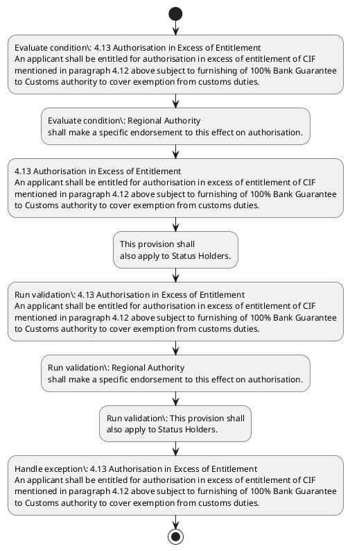

# Chapter 4 / Section 4.13: Authorisation in Excess of Entitlement

**Chapter Title:** Duty Exemption / Remission Schemes

**Pages:** 9

**Purpose:** 4.13 Authorisation in Excess of Entitlement
An applicant shall be entitled for authorisation in excess of entitlement of CIF
mentioned in paragraph 4.12 above subject to furnishing of 100% Bank Guarantee
to Customs authority to cover exemption from customs duties.

**Purpose Thanglish:** Indha Authorisation in Excess of Entitlement section-la, 4.13 Authorisation in Excess of Entitlement
An applicant kandippa be entitled for authorisation in excess of entitlement of CIF
mentioned in paragraph 4.12 above subject to furnishing of 100% Bank Guarantee
to Customs authority to cover exemption from customs duties.

**Summary:** 4.13 Authorisation in Excess of Entitlement
An applicant shall be entitled for authorisation in excess of entitlement of CIF
mentioned in paragraph 4.12 above subject to furnishing of 100% Bank Guarantee
to Customs authority to cover exemption from customs duties. Regional Authority
shall make a specific endorsement to this effect on authorisation. This provision shall
also apply to Status Holders.

**Business Meaning:** Authorisation in Excess of Entitlement governs how DGFT business controls should be applied, validated, and enforced.

**Business Explanation:** Authorisation in Excess of Entitlement explains the operating rule set that DEKAI should enforce. Key control points include 4.13 Authorisation in Excess of Entitlement
An applicant shall be entitled for authorisation in excess of entitlement of CIF
mentioned in paragraph 4.12 above subject to furnishing of 100% Bank Guarantee
to Customs authority to cover exemption from customs duties. The section also drives actions such as 4.13 Authorisation in Excess of Entitlement
An applicant shall be entitled for authorisation in excess of entitlement of CIF
mentioned in paragraph 4.12 above subject to furnishing of 100% Bank Guarantee
to Customs authority to cover exemption from customs duties..

**Business Explanation Thanglish:** Indha Authorisation in Excess of Entitlement section-la, Authorisation in Excess of Entitlement explains the operating rule set that DEKAI should enforce. Key control points include 4.13 Authorisation in Excess of Entitlement
An applicant kandippa be entitled for authorisation in excess of entitlement of CIF
mentioned in paragraph 4.12 above subject to furnishing of 100% Bank Guarantee
to Customs authority to cover exemption from customs duties. The section also drives actions such as 4.13 Authorisation in Excess of Entitlement
An applicant kandippa be entitled for authorisation in excess of entitlement of CIF
mentioned in paragraph 4.12 above subject to furnishing of 100% Bank Guarantee
to Customs authority to cover exemption from customs duties..

## Business Logic
- 4.13 Authorisation in Excess of Entitlement
An applicant shall be entitled for authorisation in excess of entitlement of CIF
mentioned in paragraph 4.12 above subject to furnishing of 100% Bank Guarantee
to Customs authority to cover exemption from customs duties.
- Regional Authority
shall make a specific endorsement to this effect on authorisation.
- This provision shall
also apply to Status Holders.

## Business Rules
- rule_id=CH4-SEC4_13-R001, rule_description=4.13 Authorisation in Excess of Entitlement
An applicant shall be entitled for authorisation in excess of entitlement of CIF
mentioned in paragraph 4.12 above subject to furnishing of 100% Bank Guarantee
to Customs authority to cover exemption from customs duties., trigger=Authorisation in Excess of Entitlement, condition=4.13 Authorisation in Excess of Entitlement
An applicant shall be entitled for authorisation in excess of entitlement of CIF
mentioned in paragraph 4.12 above subject to furnishing of 100% Bank Guarantee
to Customs authority to cover exemption from customs duties., validation=4.13 Authorisation in Excess of Entitlement
An applicant shall be entitled for authorisation in excess of entitlement of CIF
mentioned in paragraph 4.12 above subject to furnishing of 100% Bank Guarantee
to Customs authority to cover exemption from customs duties., action=4.13 Authorisation in Excess of Entitlement
An applicant shall be entitled for authorisation in excess of entitlement of CIF
mentioned in paragraph 4.12 above subject to furnishing of 100% Bank Guarantee
to Customs authority to cover exemption from customs duties., exception=4.13 Authorisation in Excess of Entitlement
An applicant shall be entitled for authorisation in excess of entitlement of CIF
mentioned in paragraph 4.12 above subject to furnishing of 100% Bank Guarantee
to Customs authority to cover exemption from customs duties., output=DEKAI should produce a compliance decision for 4.13 - Authorisation in Excess of Entitlement.
- rule_id=CH4-SEC4_13-R002, rule_description=Regional Authority
shall make a specific endorsement to this effect on authorisation., trigger=Authorisation in Excess of Entitlement, condition=Regional Authority
shall make a specific endorsement to this effect on authorisation., validation=Regional Authority
shall make a specific endorsement to this effect on authorisation., action=This provision shall
also apply to Status Holders., exception=4.13 Authorisation in Excess of Entitlement
An applicant shall be entitled for authorisation in excess of entitlement of CIF
mentioned in paragraph 4.12 above subject to furnishing of 100% Bank Guarantee
to Customs authority to cover exemption from customs duties., output=DEKAI should produce a compliance decision for 4.13 - Authorisation in Excess of Entitlement.
- rule_id=CH4-SEC4_13-R003, rule_description=This provision shall
also apply to Status Holders., trigger=Authorisation in Excess of Entitlement, condition=Regional Authority
shall make a specific endorsement to this effect on authorisation., validation=This provision shall
also apply to Status Holders., action=This provision shall
also apply to Status Holders., exception=4.13 Authorisation in Excess of Entitlement
An applicant shall be entitled for authorisation in excess of entitlement of CIF
mentioned in paragraph 4.12 above subject to furnishing of 100% Bank Guarantee
to Customs authority to cover exemption from customs duties., output=DEKAI should produce a compliance decision for 4.13 - Authorisation in Excess of Entitlement.

## Conditions
- 4.13 Authorisation in Excess of Entitlement
An applicant shall be entitled for authorisation in excess of entitlement of CIF
mentioned in paragraph 4.12 above subject to furnishing of 100% Bank Guarantee
to Customs authority to cover exemption from customs duties.
- Regional Authority
shall make a specific endorsement to this effect on authorisation.

## Condition Logic
- id=4.4.13.1, if=4.13 Authorisation in Excess of Entitlement
An applicant shall be entitled for authorisation in excess of entitlement of CIF
mentioned in paragraph 4.12 above subject to furnishing of 100% Bank Guarantee
to Customs authority to cover exemption from customs duties., then=4.13 Authorisation in Excess of Entitlement
An applicant shall be entitled for authorisation in excess of entitlement of CIF
mentioned in paragraph 4.12 above subject to furnishing of 100% Bank Guarantee
to Customs authority to cover exemption from customs duties., source=4.13 Authorisation in Excess of Entitlement
An applicant shall be entitled for authorisation in excess of entitlement of CIF
mentioned in paragraph 4.12 above subject to furnishing of 100% Bank Guarantee
to Customs authority to cover exemption from customs duties.
- id=4.4.13.2, if=Regional Authority
shall make a specific endorsement to this effect on authorisation., then=4.13 Authorisation in Excess of Entitlement
An applicant shall be entitled for authorisation in excess of entitlement of CIF
mentioned in paragraph 4.12 above subject to furnishing of 100% Bank Guarantee
to Customs authority to cover exemption from customs duties., source=Regional Authority
shall make a specific endorsement to this effect on authorisation.

## Validations
- 4.13 Authorisation in Excess of Entitlement
An applicant shall be entitled for authorisation in excess of entitlement of CIF
mentioned in paragraph 4.12 above subject to furnishing of 100% Bank Guarantee
to Customs authority to cover exemption from customs duties.
- Regional Authority
shall make a specific endorsement to this effect on authorisation.
- This provision shall
also apply to Status Holders.

## Exceptions
- 4.13 Authorisation in Excess of Entitlement
An applicant shall be entitled for authorisation in excess of entitlement of CIF
mentioned in paragraph 4.12 above subject to furnishing of 100% Bank Guarantee
to Customs authority to cover exemption from customs duties.

## Dependencies
- 4.12

## Authorities
- Customs
- Customs authority
- Regional Authority

## Required Documents
- None identified

## Timelines
- None identified

## Actions
- 4.13 Authorisation in Excess of Entitlement
An applicant shall be entitled for authorisation in excess of entitlement of CIF
mentioned in paragraph 4.12 above subject to furnishing of 100% Bank Guarantee
to Customs authority to cover exemption from customs duties.
- This provision shall
also apply to Status Holders.

## Workflow
- Evaluate condition: 4.13 Authorisation in Excess of Entitlement
An applicant shall be entitled for authorisation in excess of entitlement of CIF
mentioned in paragraph 4.12 above subject to furnishing of 100% Bank Guarantee
to Customs authority to cover exemption from customs duties.
- Evaluate condition: Regional Authority
shall make a specific endorsement to this effect on authorisation.
- 4.13 Authorisation in Excess of Entitlement
An applicant shall be entitled for authorisation in excess of entitlement of CIF
mentioned in paragraph 4.12 above subject to furnishing of 100% Bank Guarantee
to Customs authority to cover exemption from customs duties.
- This provision shall
also apply to Status Holders.
- Run validation: 4.13 Authorisation in Excess of Entitlement
An applicant shall be entitled for authorisation in excess of entitlement of CIF
mentioned in paragraph 4.12 above subject to furnishing of 100% Bank Guarantee
to Customs authority to cover exemption from customs duties.
- Run validation: Regional Authority
shall make a specific endorsement to this effect on authorisation.
- Run validation: This provision shall
also apply to Status Holders.
- Handle exception: 4.13 Authorisation in Excess of Entitlement
An applicant shall be entitled for authorisation in excess of entitlement of CIF
mentioned in paragraph 4.12 above subject to furnishing of 100% Bank Guarantee
to Customs authority to cover exemption from customs duties.

## Workflow ASCII
```text
Authorisation in Excess of Entitlement
Evaluate condition: 4.13 Authorisation in Excess of Entitlement
An applicant shall be entitled for authorisation in excess of entitlement of CIF
mentioned in paragraph 4.12 above subject to furnishing of 100% Bank Guarantee
to Customs authority to cover exemption from customs duties.
   |
   v
Evaluate condition: Regional Authority
shall make a specific endorsement to this effect on authorisation.
   |
   v
4.13 Authorisation in Excess of Entitlement
An applicant shall be entitled for authorisation in excess of entitlement of CIF
mentioned in paragraph 4.12 above subject to furnishing of 100% Bank Guarantee
to Customs authority to cover exemption from customs duties.
   |
   v
This provision shall
also apply to Status Holders.
   |
   v
Run validation: 4.13 Authorisation in Excess of Entitlement
An applicant shall be entitled for authorisation in excess of entitlement of CIF
mentioned in paragraph 4.12 above subject to furnishing of 100% Bank Guarantee
to Customs authority to cover exemption from customs duties.
   |
   v
Run validation: Regional Authority
shall make a specific endorsement to this effect on authorisation.
   |
   v
Run validation: This provision shall
also apply to Status Holders.
   |
   v
Handle exception: 4.13 Authorisation in Excess of Entitlement
An applicant shall be entitled for authorisation in excess of entitlement of CIF
mentioned in paragraph 4.12 above subject to furnishing of 100% Bank Guarantee
to Customs authority to cover exemption from customs duties.
```

## Decision Tree
- IF 4.13 Authorisation in Excess of Entitlement
An applicant shall be entitled for authorisation in excess of entitlement of CIF
mentioned in paragraph 4.12 above subject to furnishing of 100% Bank Guarantee
to Customs authority to cover exemption from customs duties. THEN 4.13 Authorisation in Excess of Entitlement
An applicant shall be entitled for authorisation in excess of entitlement of CIF
mentioned in paragraph 4.12 above subject to furnishing of 100% Bank Guarantee
to Customs authority to cover exemption from customs duties.
- IF Regional Authority
shall make a specific endorsement to this effect on authorisation. THEN 4.13 Authorisation in Excess of Entitlement
An applicant shall be entitled for authorisation in excess of entitlement of CIF
mentioned in paragraph 4.12 above subject to furnishing of 100% Bank Guarantee
to Customs authority to cover exemption from customs duties.
- IF exception applies (4.13 Authorisation in Excess of Entitlement
An applicant shall be entitled for authorisation in excess of entitlement of CIF
mentioned in paragraph 4.12 above subject to furnishing of 100% Bank Guarantee
to Customs authority to cover exemption from customs duties.) THEN route to manual review

## Decision Tree ASCII
```text
Authorisation in Excess of Entitlement Decision
IF 4.13 Authorisation in Excess of Entitlement
An applicant shall be entitled for authorisation in excess of entitlement of CIF
mentioned in paragraph 4.12 above subject to furnishing of 100% Bank Guarantee
to Customs authority to cover exemption from customs duties. THEN 4.13 Authorisation in Excess of Entitlement
An applicant shall be entitled for authorisation in excess of entitlement of CIF
mentioned in paragraph 4.12 above subject to furnishing of 100% Bank Guarantee
to Customs authority to cover exemption from customs duties.
   |
   v
IF Regional Authority
shall make a specific endorsement to this effect on authorisation. THEN 4.13 Authorisation in Excess of Entitlement
An applicant shall be entitled for authorisation in excess of entitlement of CIF
mentioned in paragraph 4.12 above subject to furnishing of 100% Bank Guarantee
to Customs authority to cover exemption from customs duties.
   |
   v
IF exception applies (4.13 Authorisation in Excess of Entitlement
An applicant shall be entitled for authorisation in excess of entitlement of CIF
mentioned in paragraph 4.12 above subject to furnishing of 100% Bank Guarantee
to Customs authority to cover exemption from customs duties.) THEN route to manual review
```

## Examples
- User asks to process Authorisation in Excess of Entitlement; the platform checks conditions, validations, and documents before action.

**Real-world Example:** Example: an importer or exporter invokes Authorisation in Excess of Entitlement, submits the prescribed DGFT records, and DEKAI uses the extracted rules to 4.13 authorisation in excess of entitlement
an applicant shall be entitled for authorisation in excess of entitlement of cif
mentioned in paragraph 4.12 above subject to furnishing of 100% bank guarantee
to customs authority to cover exemption from customs duties..

**Real-world Example Thanglish:** Indha Authorisation in Excess of Entitlement section-la, Example: an importer or exporter invokes Authorisation in Excess of Entitlement, submits the prescribed DGFT records, and DEKAI uses the extracted rules to 4.13 authorisation in excess of entitlement
an applicant kandippa be entitled for authorisation in excess of entitlement of cif
mentioned in paragraph 4.12 above subject to furnishing of 100% bank guarantee
to customs authority to cover exemption from customs duties..

## AI Rules
- IF detected context matches section rule THEN enforce: 4.13 Authorisation in Excess of Entitlement
An applicant shall be entitled for authorisation in excess of entitlement of CIF
mentioned in paragraph 4.12 above subject to furnishing of 100% Bank Guarantee
to Customs authority to cover exemption from customs duties.
- IF detected context matches section rule THEN enforce: Regional Authority
shall make a specific endorsement to this effect on authorisation.
- IF detected context matches section rule THEN enforce: This provision shall
also apply to Status Holders.
- IF validations pass THEN recommend action: 4.13 Authorisation in Excess of Entitlement
An applicant shall be entitled for authorisation in excess of entitlement of CIF
mentioned in paragraph 4.12 above subject to furnishing of 100% Bank Guarantee
to Customs authority to cover exemption from customs duties.

## Database Fields
- name=section_code, type=string, required=True, source=parsed_section_heading
- name=section_title, type=string, required=True, source=parsed_section_heading
- name=for_flag, type=boolean, required=False, source=keyword:for
- name=cif_flag, type=boolean, required=False, source=keyword:CIF
- name=bank_flag, type=boolean, required=False, source=keyword:Bank
- name=from_flag, type=boolean, required=False, source=keyword:from
- name=make_flag, type=boolean, required=False, source=keyword:make
- name=this_flag, type=boolean, required=False, source=keyword:this
- name=also_flag, type=boolean, required=False, source=keyword:also
- name=shall_flag, type=boolean, required=False, source=keyword:shall

## API Requirements
- method=GET, path=/api/dgft/sections/4.13, purpose=Retrieve knowledge payload for section 4.13, query_params=['include=workflow,decision_tree,validations'], response_fields=['section', 'title', 'summary', 'conditions', 'validations', 'exceptions', 'workflow', 'decision_tree']
- method=POST, path=/api/dgft/Authorisation-in-Excess-of-Entitlement/validate, purpose=Validate inputs and documents for Authorisation in Excess of Entitlement, request_fields=['section_code', 'section_title'], response_fields=['status', 'errors', 'warnings', 'next_actions']
- method=POST, path=/api/dgft/Authorisation-in-Excess-of-Entitlement/execute, purpose=Trigger business action for 4.13 Authorisation in Excess of Entitlement
An applicant shall be entitled for authorisation in excess of entitlement of CIF
mentioned in paragraph 4.12 above subject to furnishing of 100% Bank Guarantee
to Customs authority to cover exemption from customs duties., request_fields=['section_code', 'section_title'], response_fields=['reference_id', 'status', 'authority', 'timeline']

## UI Screens
- screen_id=Authorisation_in_Excess_of_Entitlement_overview, name=Authorisation in Excess of Entitlement Overview, purpose=Show section summary, authority, timeline, and eligibility cues., widgets=['summary_card', 'conditions_table', 'authority_badges', 'timeline_panel']
- screen_id=Authorisation_in_Excess_of_Entitlement_submission, name=Authorisation in Excess of Entitlement Submission, purpose=Capture applicant data and supporting documents., widgets=['dynamic_form', 'document_uploader', 'validation_panel', 'next_action_footer'], fields=['section_code', 'section_title', 'for_flag', 'cif_flag', 'bank_flag', 'from_flag', 'make_flag', 'this_flag']
- screen_id=Authorisation_in_Excess_of_Entitlement_exceptions, name=Authorisation in Excess of Entitlement Exception Review, purpose=Explain exception handling and manual review triggers., widgets=['exception_banner', 'decision_tree', 'case_notes']

## Error Messages
- Validation failed because the section requirements were not fully met.

## FAQ
- question_en=What is the purpose of section 4.13?, answer_en=Authorisation in Excess of Entitlement explains the operating rule set that DEKAI should enforce. Key control points include 4.13 Authorisation in Excess of Entitlement
An applicant shall be entitled for authorisation in excess of entitlement of CIF
mentioned in paragraph 4.12 above subject to furnishing of 100% Bank Guarantee
to Customs authority to cover exemption from customs duties. The section also drives actions such as 4.13 Authorisation in Excess of Entitlement
An applicant shall be entitled for authorisation in excess of entitlement of CIF
mentioned in paragraph 4.12 above subject to furnishing of 100% Bank Guarantee
to Customs authority to cover exemption from customs duties.., question_thanglish=Indha Authorisation in Excess of Entitlement section-la, What is the purpose of section 4.13?, answer_thanglish=Indha Authorisation in Excess of Entitlement section-la, Authorisation in Excess of Entitlement explains the operating rule set that DEKAI should enforce. Key control points include 4.13 Authorisation in Excess of Entitlement
An applicant kandippa be entitled for authorisation in excess of entitlement of CIF
mentioned in paragraph 4.12 above subject to furnishing of 100% Bank Guarantee
to Customs authority to cover exemption from customs duties. The section also drives actions such as 4.13 Authorisation in Excess of Entitlement
An applicant kandippa be entitled for authorisation in excess of entitlement of CIF
mentioned in paragraph 4.12 above subject to furnishing of 100% Bank Guarantee
to Customs authority to cover exemption from customs duties..
- question_en=What documents are required under Authorisation in Excess of Entitlement?, answer_en=Not explicitly covered in uploaded documents., question_thanglish=Indha Authorisation in Excess of Entitlement section-la, What documents are required under Authorisation in Excess of Entitlement?, answer_thanglish=Indha Authorisation in Excess of Entitlement section-la, Not explicitly covered in uploaded documents.
- question_en=Which authority handles Authorisation in Excess of Entitlement?, answer_en=Customs, Customs authority, Regional Authority, question_thanglish=Indha Authorisation in Excess of Entitlement section-la, Which authority handles Authorisation in Excess of Entitlement?, answer_thanglish=Indha Authorisation in Excess of Entitlement section-la, Customs, Customs authority, Regional authority

## Questions Users May Ask
- What does Authorisation in Excess of Entitlement require?
- Which documents are needed for Authorisation in Excess of Entitlement?
- How does DEKAI validate Authorisation in Excess of Entitlement requests?
- What action should be taken for Authorisation in Excess of Entitlement?

## Expected AI Answers
- Authorisation in Excess of Entitlement requires the platform to interpret the section text, apply the extracted business rules, and present the correct next action.
- Required documents are inferred from the section text: no explicit documents were detected.
- DEKAI validates Authorisation in Excess of Entitlement by checking conditions, required documents, authority references, and exception clauses before recommending an outcome.
- The primary extracted action is: 4.13 Authorisation in Excess of Entitlement
An applicant shall be entitled for authorisation in excess of entitlement of CIF
mentioned in paragraph 4.12 above subject to furnishing of 100% Bank Guarantee
to Customs authority to cover exemption from customs duties.

## AI Q&A Examples
- question_en=User asks: How do I comply with Authorisation in Excess of Entitlement?, answer_en=AI answers: DEKAI should evaluate section 4.13, apply the extracted rules, and guide the user through Evaluate condition: 4.13 Authorisation in Excess of Entitlement
An applicant shall be entitled for authorisation in excess of entitlement of CIF
mentioned in paragraph 4.12 above subject to furnishing of 100% Bank Guarantee
to Customs authority to cover exemption from customs duties.., question_thanglish=Indha Authorisation in Excess of Entitlement section-la, User asks: How do I comply with Authorisation in Excess of Entitlement?, answer_thanglish=Indha Authorisation in Excess of Entitlement section-la, AI answers: DEKAI should evaluate section 4.13, apply the extracted rules, and guide the user through Evaluate condition: 4.13 Authorisation in Excess of Entitlement
An applicant kandippa be entitled for authorisation in excess of entitlement of CIF
mentioned in paragraph 4.12 above subject to furnishing of 100% Bank Guarantee
to Customs authority to cover exemption from customs duties..
- question_en=User asks: Which validations apply to Authorisation in Excess of Entitlement?, answer_en=AI answers: Applicable validations are 4.13 Authorisation in Excess of Entitlement
An applicant shall be entitled for authorisation in excess of entitlement of CIF
mentioned in paragraph 4.12 above subject to furnishing of 100% Bank Guarantee
to Customs authority to cover exemption from customs duties., Regional Authority
shall make a specific endorsement to this effect on authorisation., This provision shall
also apply to Status Holders., question_thanglish=Indha Authorisation in Excess of Entitlement section-la, User asks: Which validations apply to Authorisation in Excess of Entitlement?, answer_thanglish=Indha Authorisation in Excess of Entitlement section-la, AI answers: Applicable validations are 4.13 Authorisation in Excess of Entitlement
An applicant kandippa be entitled for authorisation in excess of entitlement of CIF
mentioned in paragraph 4.12 above subject to furnishing of 100% Bank Guarantee
to Customs authority to cover exemption from customs duties., Regional authority
kandippa make a specific endorsement to this effect on authorisation., This provision kandippa
also apply to Status Holders.

## DEKAI AI Implementation Notes
- Capture chapter 4, section 4.13, title, and page references as immutable knowledge metadata.
- Bind validations for Authorisation in Excess of Entitlement into a rule engine keyed by the rule IDs extracted for this section.
- Route escalations or approvals to: Customs, Customs authority, Regional Authority.
- Trigger manual review when exception clauses are detected.
- Show contextual links to related sections: 4.12.

## DEKAI AI Implementation Notes Thanglish
- Indha Authorisation in Excess of Entitlement section-la, Capture chapter 4, section 4.13, title, and page references as immutable knowledge metadata.
- Indha Authorisation in Excess of Entitlement section-la, Bind validations for Authorisation in Excess of Entitlement into a rule engine keyed by the rule IDs extracted for this section.
- Indha Authorisation in Excess of Entitlement section-la, Route escalations or approvals to: Customs, Customs authority, Regional authority.
- Indha Authorisation in Excess of Entitlement section-la, Trigger manual review when exception clauses are detected.
- Indha Authorisation in Excess of Entitlement section-la, Show contextual links to related sections: 4.12.

## AI Metadata
- Keywords: for, CIF, Bank, from, make, this, also, shall, above, cover, apply, Excess, duties, effect, Status, subject, Customs, Holders, entitled, Regional
- Search Keywords: for, CIF, Bank, from, make, this, also, shall, above, cover, apply, Excess, duties, effect, Status, subject, Customs, Holders, entitled, Regional
- Intent: Support Authorisation in Excess of Entitlement processing and compliance validation.
- Tags: 4.13, Authorisation in Excess of Entitlement, business-rule, dgft
- Related Sections: 4.12
- Related Chapters: 
- Related Rules: 4.13 Authorisation in Excess of Entitlement
An applicant shall be entitled for authorisation in excess of entitlement of CIF
mentioned in paragraph 4.12 above subject to furnishing of 100% Bank Guarantee
to Customs authority to cover exemption from customs duties., Regional Authority
shall make a specific endorsement to this effect on authorisation., This provision shall
also apply to Status Holders.

## Mermaid

```mermaid
flowchart TD
    S1["Evaluate condition: 4.13 Authorisation in Excess of Entitlement
An applicant shall be entitled for authorisation in excess of entitlement of CIF
mentioned in paragraph 4.12 above subject to furnishing of 100% Bank Guarantee
to Customs authority to cover exemption from customs duties."]
    S2["Evaluate condition: Regional Authority
shall make a specific endorsement to this effect on authorisation."]
    S1 --> S2
    S3["4.13 Authorisation in Excess of Entitlement
An applicant shall be entitled for authorisation in excess of entitlement of CIF
mentioned in paragraph 4.12 above subject to furnishing of 100% Bank Guarantee
to Customs authority to cover exemption from customs duties."]
    S2 --> S3
    S4["This provision shall
also apply to Status Holders."]
    S3 --> S4
    S5["Run validation: 4.13 Authorisation in Excess of Entitlement
An applicant shall be entitled for authorisation in excess of entitlement of CIF
mentioned in paragraph 4.12 above subject to furnishing of 100% Bank Guarantee
to Customs authority to cover exemption from customs duties."]
    S4 --> S5
    S6["Run validation: Regional Authority
shall make a specific endorsement to this effect on authorisation."]
    S5 --> S6
    S7["Run validation: This provision shall
also apply to Status Holders."]
    S6 --> S7
    S8["Handle exception: 4.13 Authorisation in Excess of Entitlement
An applicant shall be entitled for authorisation in excess of entitlement of CIF
mentioned in paragraph 4.12 above subject to furnishing of 100% Bank Guarantee
to Customs authority to cover exemption from customs duties."]
    S7 --> S8
```


## PlantUML

