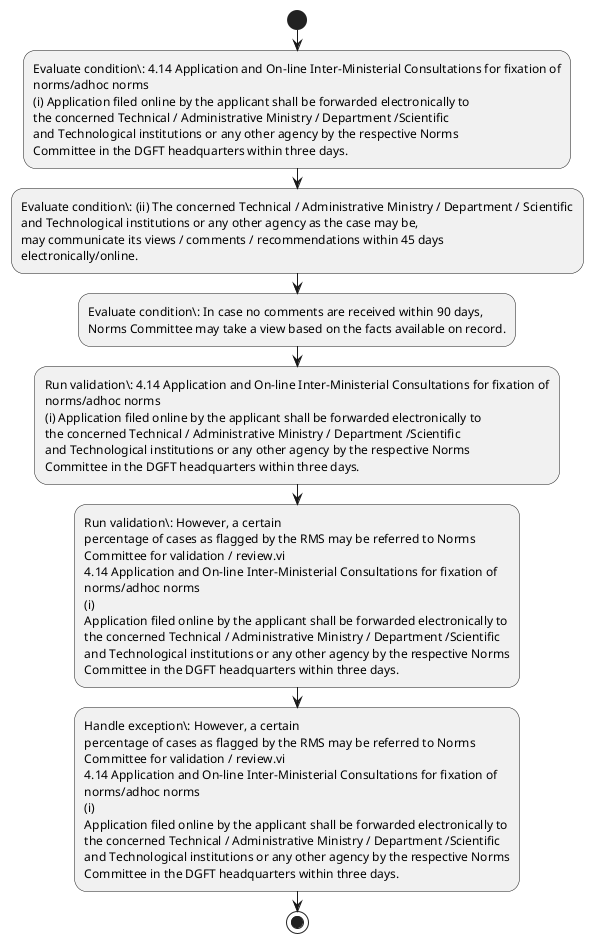

# Chapter 4 / Section 4.14: Application and On-line Inter-Ministerial Consultations for fixation of

**Chapter Title:** Duty Exemption / Remission Schemes

**Pages:** 9

**Purpose:** 4.14 Application and On-line Inter-Ministerial Consultations for fixation of
norms/adhoc norms
(i) Application filed online by the applicant shall be forwarded electronically to
the concerned Technical / Administrative Ministry / Department /Scientific
and Technological institutions or any other agency by the respective Norms
Committee in the DGFT headquarters within three days.

**Purpose Thanglish:** Indha Application and On-line Inter-Ministerial Consultations for fixation of section-la, 4.14 application and On-line Inter-Ministerial Consultations for fixation of
norms/adhoc norms
(i) application filed online by the applicant kandippa be forwarded electronically to
the concerned Technical / Administrative Ministry / Department /Scientific
and Technological institutions or any other agency by the respective Norms
Committee in the DGFT headquarters within three days.

**Summary:** 4.14 Application and On-line Inter-Ministerial Consultations for fixation of
norms/adhoc norms
(i) Application filed online by the applicant shall be forwarded electronically to
the concerned Technical / Administrative Ministry / Department /Scientific
and Technological institutions or any other agency by the respective Norms
Committee in the DGFT headquarters within three days. (ii) The concerned Technical / Administrative Ministry / Department / Scientific
and Technological institutions or any other agency as the case may be,
may communicate its views / comments / recommendations within 45 days
electronically/online. In case no comments are received within 90 days,
Norms Committee may take a view based on the facts available on record.

**Business Meaning:** Application and On-line Inter-Ministerial Consultations for fixation of governs how DGFT business controls should be applied, validated, and enforced.

**Business Explanation:** Application and On-line Inter-Ministerial Consultations for fixation of explains the operating rule set that DEKAI should enforce. Key control points include 4.14 Application and On-line Inter-Ministerial Consultations for fixation of
norms/adhoc norms
(i) Application filed online by the applicant shall be forwarded electronically to
the concerned Technical / Administrative Ministry / Department /Scientific
and Technological institutions or any other agency by the respective Norms
Committee in the DGFT headquarters within three days.

**Business Explanation Thanglish:** Indha Application and On-line Inter-Ministerial Consultations for fixation of section-la, application and On-line Inter-Ministerial Consultations for fixation of explains the operating rule set that DEKAI should enforce. Key control points include 4.14 application and On-line Inter-Ministerial Consultations for fixation of
norms/adhoc norms
(i) application filed online by the applicant kandippa be forwarded electronically to
the concerned Technical / Administrative Ministry / Department /Scientific
and Technological institutions or any other agency by the respective Norms
Committee in the DGFT headquarters within three days.

## Business Logic
- 4.14 Application and On-line Inter-Ministerial Consultations for fixation of
norms/adhoc norms
(i) Application filed online by the applicant shall be forwarded electronically to
the concerned Technical / Administrative Ministry / Department /Scientific
and Technological institutions or any other agency by the respective Norms
Committee in the DGFT headquarters within three days.
- However, a certain
percentage of cases as flagged by the RMS may be referred to Norms
Committee for validation / review.vi
4.14 Application and On-line Inter-Ministerial Consultations for fixation of
norms/adhoc norms
(i)
Application filed online by the applicant shall be forwarded electronically to
the concerned Technical / Administrative Ministry / Department /Scientific
and Technological institutions or any other agency by the respective Norms
Committee in the DGFT headquarters within three days.

## Business Rules
- rule_id=CH4-SEC4_14-R001, rule_description=4.14 Application and On-line Inter-Ministerial Consultations for fixation of
norms/adhoc norms
(i) Application filed online by the applicant shall be forwarded electronically to
the concerned Technical / Administrative Ministry / Department /Scientific
and Technological institutions or any other agency by the respective Norms
Committee in the DGFT headquarters within three days., trigger=Application and On-line Inter-Ministerial Consultations for fixation of, condition=4.14 Application and On-line Inter-Ministerial Consultations for fixation of
norms/adhoc norms
(i) Application filed online by the applicant shall be forwarded electronically to
the concerned Technical / Administrative Ministry / Department /Scientific
and Technological institutions or any other agency by the respective Norms
Committee in the DGFT headquarters within three days., validation=4.14 Application and On-line Inter-Ministerial Consultations for fixation of
norms/adhoc norms
(i) Application filed online by the applicant shall be forwarded electronically to
the concerned Technical / Administrative Ministry / Department /Scientific
and Technological institutions or any other agency by the respective Norms
Committee in the DGFT headquarters within three days., action=Manual review required., exception=However, a certain
percentage of cases as flagged by the RMS may be referred to Norms
Committee for validation / review.vi
4.14 Application and On-line Inter-Ministerial Consultations for fixation of
norms/adhoc norms
(i)
Application filed online by the applicant shall be forwarded electronically to
the concerned Technical / Administrative Ministry / Department /Scientific
and Technological institutions or any other agency by the respective Norms
Committee in the DGFT headquarters within three days., output=DEKAI should produce a compliance decision for 4.14 - Application and On-line Inter-Ministerial Consultations for fixation of.
- rule_id=CH4-SEC4_14-R002, rule_description=However, a certain
percentage of cases as flagged by the RMS may be referred to Norms
Committee for validation / review.vi
4.14 Application and On-line Inter-Ministerial Consultations for fixation of
norms/adhoc norms
(i)
Application filed online by the applicant shall be forwarded electronically to
the concerned Technical / Administrative Ministry / Department /Scientific
and Technological institutions or any other agency by the respective Norms
Committee in the DGFT headquarters within three days., trigger=Application and On-line Inter-Ministerial Consultations for fixation of, condition=(ii) The concerned Technical / Administrative Ministry / Department / Scientific
and Technological institutions or any other agency as the case may be,
may communicate its views / comments / recommendations within 45 days
electronically/online., validation=However, a certain
percentage of cases as flagged by the RMS may be referred to Norms
Committee for validation / review.vi
4.14 Application and On-line Inter-Ministerial Consultations for fixation of
norms/adhoc norms
(i)
Application filed online by the applicant shall be forwarded electronically to
the concerned Technical / Administrative Ministry / Department /Scientific
and Technological institutions or any other agency by the respective Norms
Committee in the DGFT headquarters within three days., action=Manual review required., exception=However, a certain
percentage of cases as flagged by the RMS may be referred to Norms
Committee for validation / review.vi, output=DEKAI should produce a compliance decision for 4.14 - Application and On-line Inter-Ministerial Consultations for fixation of.

## Conditions
- 4.14 Application and On-line Inter-Ministerial Consultations for fixation of
norms/adhoc norms
(i) Application filed online by the applicant shall be forwarded electronically to
the concerned Technical / Administrative Ministry / Department /Scientific
and Technological institutions or any other agency by the respective Norms
Committee in the DGFT headquarters within three days.
- (ii) The concerned Technical / Administrative Ministry / Department / Scientific
and Technological institutions or any other agency as the case may be,
may communicate its views / comments / recommendations within 45 days
electronically/online.
- In case no comments are received within 90 days,
Norms Committee may take a view based on the facts available on record.
- However, a certain
percentage of cases as flagged by the RMS may be referred to Norms
Committee for validation / review.vi
4.14 Application and On-line Inter-Ministerial Consultations for fixation of
norms/adhoc norms
(i)
Application filed online by the applicant shall be forwarded electronically to
the concerned Technical / Administrative Ministry / Department /Scientific
and Technological institutions or any other agency by the respective Norms
Committee in the DGFT headquarters within three days.
- (ii)
The concerned Technical / Administrative Ministry / Department / Scientific
and Technological institutions or any other agency as the case may be,
may communicate its views / comments / recommendations within 45 days
electronically/online.

## Condition Logic
- id=4.4.14.1, if=4.14 Application and On-line Inter-Ministerial Consultations for fixation of
norms/adhoc norms
(i) Application filed online by the applicant shall be forwarded electronically to
the concerned Technical / Administrative Ministry / Department /Scientific
and Technological institutions or any other agency by the respective Norms
Committee in the DGFT headquarters within three days., then=Route for review, source=4.14 Application and On-line Inter-Ministerial Consultations for fixation of
norms/adhoc norms
(i) Application filed online by the applicant shall be forwarded electronically to
the concerned Technical / Administrative Ministry / Department /Scientific
and Technological institutions or any other agency by the respective Norms
Committee in the DGFT headquarters within three days.
- id=4.4.14.2, if=(ii) The concerned Technical / Administrative Ministry / Department / Scientific
and Technological institutions or any other agency as the case may be,
may communicate its views / comments / recommendations within 45 days
electronically/online., then=Route for review, source=(ii) The concerned Technical / Administrative Ministry / Department / Scientific
and Technological institutions or any other agency as the case may be,
may communicate its views / comments / recommendations within 45 days
electronically/online.
- id=4.4.14.3, if=In case no comments are received within 90 days,
Norms Committee may take a view based on the facts available on record., then=Route for review, source=In case no comments are received within 90 days,
Norms Committee may take a view based on the facts available on record.
- id=4.4.14.4, if=However, a certain
percentage of cases as flagged by the RMS may be referred to Norms
Committee for validation / review.vi
4.14 Application and On-line Inter-Ministerial Consultations for fixation of
norms/adhoc norms
(i)
Application filed online by the applicant shall be forwarded electronically to
the concerned Technical / Administrative Ministry / Department /Scientific
and Technological institutions or any other agency by the respective Norms
Committee in the DGFT headquarters within three days., then=Route for review, source=However, a certain
percentage of cases as flagged by the RMS may be referred to Norms
Committee for validation / review.vi
4.14 Application and On-line Inter-Ministerial Consultations for fixation of
norms/adhoc norms
(i)
Application filed online by the applicant shall be forwarded electronically to
the concerned Technical / Administrative Ministry / Department /Scientific
and Technological institutions or any other agency by the respective Norms
Committee in the DGFT headquarters within three days.
- id=4.4.14.5, if=(ii)
The concerned Technical / Administrative Ministry / Department / Scientific
and Technological institutions or any other agency as the case may be,
may communicate its views / comments / recommendations within 45 days
electronically/online., then=Route for review, source=(ii)
The concerned Technical / Administrative Ministry / Department / Scientific
and Technological institutions or any other agency as the case may be,
may communicate its views / comments / recommendations within 45 days
electronically/online.

## Validations
- 4.14 Application and On-line Inter-Ministerial Consultations for fixation of
norms/adhoc norms
(i) Application filed online by the applicant shall be forwarded electronically to
the concerned Technical / Administrative Ministry / Department /Scientific
and Technological institutions or any other agency by the respective Norms
Committee in the DGFT headquarters within three days.
- However, a certain
percentage of cases as flagged by the RMS may be referred to Norms
Committee for validation / review.vi
4.14 Application and On-line Inter-Ministerial Consultations for fixation of
norms/adhoc norms
(i)
Application filed online by the applicant shall be forwarded electronically to
the concerned Technical / Administrative Ministry / Department /Scientific
and Technological institutions or any other agency by the respective Norms
Committee in the DGFT headquarters within three days.

## Exceptions
- However, a certain
percentage of cases as flagged by the RMS may be referred to Norms
Committee for validation / review.vi
4.14 Application and On-line Inter-Ministerial Consultations for fixation of
norms/adhoc norms
(i)
Application filed online by the applicant shall be forwarded electronically to
the concerned Technical / Administrative Ministry / Department /Scientific
and Technological institutions or any other agency by the respective Norms
Committee in the DGFT headquarters within three days.
- However, a certain
percentage of cases as flagged by the RMS may be referred to Norms
Committee for validation / review.vi

## Dependencies
- None identified

## Authorities
- DGFT
- Technical / Administrative Ministry
- Committee in the DGFT
- The concerned Technical / Administrative Ministry
- Norms Committee

## Required Documents
- 4.14 Application and On-line Inter-Ministerial Consultations for fixation of
norms/adhoc norms
(i) Application filed online by the applicant shall be forwarded electronically to
the concerned Technical / Administrative Ministry / Department /Scientific
and Technological institutions or any other agency by the respective Norms
Committee in the DGFT headquarters within three days.
- However, a certain
percentage of cases as flagged by the RMS may be referred to Norms
Committee for validation / review.vi
4.14 Application and On-line Inter-Ministerial Consultations for fixation of
norms/adhoc norms
(i)
Application filed online by the applicant shall be forwarded electronically to
the concerned Technical / Administrative Ministry / Department /Scientific
and Technological institutions or any other agency by the respective Norms
Committee in the DGFT headquarters within three days.

## Timelines
- 4.14 Application and On-line Inter-Ministerial Consultations for fixation of
norms/adhoc norms
(i) Application filed online by the applicant shall be forwarded electronically to
the concerned Technical / Administrative Ministry / Department /Scientific
and Technological institutions or any other agency by the respective Norms
Committee in the DGFT headquarters within three days.
- (ii) The concerned Technical / Administrative Ministry / Department / Scientific
and Technological institutions or any other agency as the case may be,
may communicate its views / comments / recommendations within 45 days
electronically/online.
- In case no comments are received within 90 days,
Norms Committee may take a view based on the facts available on record.
- However, a certain
percentage of cases as flagged by the RMS may be referred to Norms
Committee for validation / review.vi
4.14 Application and On-line Inter-Ministerial Consultations for fixation of
norms/adhoc norms
(i)
Application filed online by the applicant shall be forwarded electronically to
the concerned Technical / Administrative Ministry / Department /Scientific
and Technological institutions or any other agency by the respective Norms
Committee in the DGFT headquarters within three days.
- (ii)
The concerned Technical / Administrative Ministry / Department / Scientific
and Technological institutions or any other agency as the case may be,
may communicate its views / comments / recommendations within 45 days
electronically/online.

## Actions
- None identified

## Workflow
- Evaluate condition: 4.14 Application and On-line Inter-Ministerial Consultations for fixation of
norms/adhoc norms
(i) Application filed online by the applicant shall be forwarded electronically to
the concerned Technical / Administrative Ministry / Department /Scientific
and Technological institutions or any other agency by the respective Norms
Committee in the DGFT headquarters within three days.
- Evaluate condition: (ii) The concerned Technical / Administrative Ministry / Department / Scientific
and Technological institutions or any other agency as the case may be,
may communicate its views / comments / recommendations within 45 days
electronically/online.
- Evaluate condition: In case no comments are received within 90 days,
Norms Committee may take a view based on the facts available on record.
- Run validation: 4.14 Application and On-line Inter-Ministerial Consultations for fixation of
norms/adhoc norms
(i) Application filed online by the applicant shall be forwarded electronically to
the concerned Technical / Administrative Ministry / Department /Scientific
and Technological institutions or any other agency by the respective Norms
Committee in the DGFT headquarters within three days.
- Run validation: However, a certain
percentage of cases as flagged by the RMS may be referred to Norms
Committee for validation / review.vi
4.14 Application and On-line Inter-Ministerial Consultations for fixation of
norms/adhoc norms
(i)
Application filed online by the applicant shall be forwarded electronically to
the concerned Technical / Administrative Ministry / Department /Scientific
and Technological institutions or any other agency by the respective Norms
Committee in the DGFT headquarters within three days.
- Handle exception: However, a certain
percentage of cases as flagged by the RMS may be referred to Norms
Committee for validation / review.vi
4.14 Application and On-line Inter-Ministerial Consultations for fixation of
norms/adhoc norms
(i)
Application filed online by the applicant shall be forwarded electronically to
the concerned Technical / Administrative Ministry / Department /Scientific
and Technological institutions or any other agency by the respective Norms
Committee in the DGFT headquarters within three days.

## Workflow ASCII
```text
Application and On-line Inter-Ministerial Consultations for fixation of
Evaluate condition: 4.14 Application and On-line Inter-Ministerial Consultations for fixation of
norms/adhoc norms
(i) Application filed online by the applicant shall be forwarded electronically to
the concerned Technical / Administrative Ministry / Department /Scientific
and Technological institutions or any other agency by the respective Norms
Committee in the DGFT headquarters within three days.
   |
   v
Evaluate condition: (ii) The concerned Technical / Administrative Ministry / Department / Scientific
and Technological institutions or any other agency as the case may be,
may communicate its views / comments / recommendations within 45 days
electronically/online.
   |
   v
Evaluate condition: In case no comments are received within 90 days,
Norms Committee may take a view based on the facts available on record.
   |
   v
Run validation: 4.14 Application and On-line Inter-Ministerial Consultations for fixation of
norms/adhoc norms
(i) Application filed online by the applicant shall be forwarded electronically to
the concerned Technical / Administrative Ministry / Department /Scientific
and Technological institutions or any other agency by the respective Norms
Committee in the DGFT headquarters within three days.
   |
   v
Run validation: However, a certain
percentage of cases as flagged by the RMS may be referred to Norms
Committee for validation / review.vi
4.14 Application and On-line Inter-Ministerial Consultations for fixation of
norms/adhoc norms
(i)
Application filed online by the applicant shall be forwarded electronically to
the concerned Technical / Administrative Ministry / Department /Scientific
and Technological institutions or any other agency by the respective Norms
Committee in the DGFT headquarters within three days.
   |
   v
Handle exception: However, a certain
percentage of cases as flagged by the RMS may be referred to Norms
Committee for validation / review.vi
4.14 Application and On-line Inter-Ministerial Consultations for fixation of
norms/adhoc norms
(i)
Application filed online by the applicant shall be forwarded electronically to
the concerned Technical / Administrative Ministry / Department /Scientific
and Technological institutions or any other agency by the respective Norms
Committee in the DGFT headquarters within three days.
```

## Decision Tree
- IF exception applies (However, a certain
percentage of cases as flagged by the RMS may be referred to Norms
Committee for validation / review.vi
4.14 Application and On-line Inter-Ministerial Consultations for fixation of
norms/adhoc norms
(i)
Application filed online by the applicant shall be forwarded electronically to
the concerned Technical / Administrative Ministry / Department /Scientific
and Technological institutions or any other agency by the respective Norms
Committee in the DGFT headquarters within three days.) THEN route to manual review
- IF exception applies (However, a certain
percentage of cases as flagged by the RMS may be referred to Norms
Committee for validation / review.vi) THEN route to manual review

## Decision Tree ASCII
```text
Application and On-line Inter-Ministerial Consultations for fixation of Decision
IF exception applies (However, a certain
percentage of cases as flagged by the RMS may be referred to Norms
Committee for validation / review.vi
4.14 Application and On-line Inter-Ministerial Consultations for fixation of
norms/adhoc norms
(i)
Application filed online by the applicant shall be forwarded electronically to
the concerned Technical / Administrative Ministry / Department /Scientific
and Technological institutions or any other agency by the respective Norms
Committee in the DGFT headquarters within three days.) THEN route to manual review
   |
   v
IF exception applies (However, a certain
percentage of cases as flagged by the RMS may be referred to Norms
Committee for validation / review.vi) THEN route to manual review
```

## Examples
- User asks to process Application and On-line Inter-Ministerial Consultations for fixation of; the platform checks conditions, validations, and documents before action.

**Real-world Example:** Example: an importer or exporter invokes Application and On-line Inter-Ministerial Consultations for fixation of, submits 4.14 Application and On-line Inter-Ministerial Consultations for fixation of
norms/adhoc norms
(i) Application filed online by the applicant shall be forwarded electronically to
the concerned Technical / Administrative Ministry / Department /Scientific
and Technological institutions or any other agency by the respective Norms
Committee in the DGFT headquarters within three days., However, a certain
percentage of cases as flagged by the RMS may be referred to Norms
Committee for validation / review.vi
4.14 Application and On-line Inter-Ministerial Consultations for fixation of
norms/adhoc norms
(i)
Application filed online by the applicant shall be forwarded electronically to
the concerned Technical / Administrative Ministry / Department /Scientific
and Technological institutions or any other agency by the respective Norms
Committee in the DGFT headquarters within three days., and DEKAI uses the extracted rules to follow the application and on-line inter-ministerial consultations for fixation of process.

**Real-world Example Thanglish:** Indha Application and On-line Inter-Ministerial Consultations for fixation of section-la, Example: an importer or exporter invokes application and On-line Inter-Ministerial Consultations for fixation of, submits 4.14 application and On-line Inter-Ministerial Consultations for fixation of
norms/adhoc norms
(i) application filed online by the applicant kandippa be forwarded electronically to
the concerned Technical / Administrative Ministry / Department /Scientific
and Technological institutions or any other agency by the respective Norms
Committee in the DGFT headquarters within three days., However, a certain
percentage of cases as flagged by the RMS may be referred to Norms
Committee for validation / review.vi
4.14 application and On-line Inter-Ministerial Consultations for fixation of
norms/adhoc norms
(i)
application filed online by the applicant kandippa be forwarded electronically to
the concerned Technical / Administrative Ministry / Department /Scientific
and Technological institutions or any other agency by the respective Norms
Committee in the DGFT headquarters within three days., and DEKAI uses the extracted rules to follow the application and on-line inter-ministerial consultations for fixation of process.

## AI Rules
- IF detected context matches section rule THEN enforce: 4.14 Application and On-line Inter-Ministerial Consultations for fixation of
norms/adhoc norms
(i) Application filed online by the applicant shall be forwarded electronically to
the concerned Technical / Administrative Ministry / Department /Scientific
and Technological institutions or any other agency by the respective Norms
Committee in the DGFT headquarters within three days.
- IF detected context matches section rule THEN enforce: However, a certain
percentage of cases as flagged by the RMS may be referred to Norms
Committee for validation / review.vi
4.14 Application and On-line Inter-Ministerial Consultations for fixation of
norms/adhoc norms
(i)
Application filed online by the applicant shall be forwarded electronically to
the concerned Technical / Administrative Ministry / Department /Scientific
and Technological institutions or any other agency by the respective Norms
Committee in the DGFT headquarters within three days.

## Database Fields
- name=section_code, type=string, required=True, source=parsed_section_heading
- name=section_title, type=string, required=True, source=parsed_section_heading
- name=and_flag, type=boolean, required=False, source=keyword:and
- name=for_flag, type=boolean, required=False, source=keyword:for
- name=the_flag, type=boolean, required=False, source=keyword:the
- name=any_flag, type=boolean, required=False, source=keyword:any
- name=may_flag, type=boolean, required=False, source=keyword:may
- name=its_flag, type=boolean, required=False, source=keyword:its
- name=are_flag, type=boolean, required=False, source=keyword:are
- name=iii_flag, type=boolean, required=False, source=keyword:iii
- name=document_1_submitted, type=boolean, required=True, source=4.14 Application and On-line Inter-Ministerial Consultations for fixation of
norms/adhoc norms
(i) Application filed online by the applicant shall be forwarded electronically to
the concerned Technical / Administrative Ministry / Department /Scientific
and Technological institutions or any other agency by the respective Norms
Committee in the DGFT headquarters within three days.
- name=document_2_submitted, type=boolean, required=True, source=However, a certain
percentage of cases as flagged by the RMS may be referred to Norms
Committee for validation / review.vi
4.14 Application and On-line Inter-Ministerial Consultations for fixation of
norms/adhoc norms
(i)
Application filed online by the applicant shall be forwarded electronically to
the concerned Technical / Administrative Ministry / Department /Scientific
and Technological institutions or any other agency by the respective Norms
Committee in the DGFT headquarters within three days.

## API Requirements
- method=GET, path=/api/dgft/sections/4.14, purpose=Retrieve knowledge payload for section 4.14, query_params=['include=workflow,decision_tree,validations'], response_fields=['section', 'title', 'summary', 'conditions', 'validations', 'exceptions', 'workflow', 'decision_tree']
- method=POST, path=/api/dgft/Application-and-On-line-Inter-Ministerial-Consultations-for-fixation-of/validate, purpose=Validate inputs and documents for Application and On-line Inter-Ministerial Consultations for fixation of, request_fields=['section_code', 'section_title', 'document_1_submitted', 'document_2_submitted'], response_fields=['status', 'errors', 'warnings', 'next_actions']

## UI Screens
- screen_id=Application_and_On_line_Inter_Ministerial_Consultations_for_fixation_of_overview, name=Application and On-line Inter-Ministerial Consultations for fixation of Overview, purpose=Show section summary, authority, timeline, and eligibility cues., widgets=['summary_card', 'conditions_table', 'authority_badges', 'timeline_panel']
- screen_id=Application_and_On_line_Inter_Ministerial_Consultations_for_fixation_of_submission, name=Application and On-line Inter-Ministerial Consultations for fixation of Submission, purpose=Capture applicant data and supporting documents., widgets=['dynamic_form', 'document_uploader', 'validation_panel', 'next_action_footer'], fields=['section_code', 'section_title', 'and_flag', 'for_flag', 'the_flag', 'any_flag', 'may_flag', 'its_flag']
- screen_id=Application_and_On_line_Inter_Ministerial_Consultations_for_fixation_of_exceptions, name=Application and On-line Inter-Ministerial Consultations for fixation of Exception Review, purpose=Explain exception handling and manual review triggers., widgets=['exception_banner', 'decision_tree', 'case_notes']

## Error Messages
- Validation failed because the section requirements were not fully met.

## FAQ
- question_en=What is the purpose of section 4.14?, answer_en=Application and On-line Inter-Ministerial Consultations for fixation of explains the operating rule set that DEKAI should enforce. Key control points include 4.14 Application and On-line Inter-Ministerial Consultations for fixation of
norms/adhoc norms
(i) Application filed online by the applicant shall be forwarded electronically to
the concerned Technical / Administrative Ministry / Department /Scientific
and Technological institutions or any other agency by the respective Norms
Committee in the DGFT headquarters within three days., question_thanglish=Indha Application and On-line Inter-Ministerial Consultations for fixation of section-la, What is the purpose of section 4.14?, answer_thanglish=Indha Application and On-line Inter-Ministerial Consultations for fixation of section-la, application and On-line Inter-Ministerial Consultations for fixation of explains the operating rule set that DEKAI should enforce. Key control points include 4.14 application and On-line Inter-Ministerial Consultations for fixation of
norms/adhoc norms
(i) application filed online by the applicant kandippa be forwarded electronically to
the concerned Technical / Administrative Ministry / Department /Scientific
and Technological institutions or any other agency by the respective Norms
Committee in the DGFT headquarters within three days.
- question_en=What documents are required under Application and On-line Inter-Ministerial Consultations for fixation of?, answer_en=4.14 Application and On-line Inter-Ministerial Consultations for fixation of
norms/adhoc norms
(i) Application filed online by the applicant shall be forwarded electronically to
the concerned Technical / Administrative Ministry / Department /Scientific
and Technological institutions or any other agency by the respective Norms
Committee in the DGFT headquarters within three days., However, a certain
percentage of cases as flagged by the RMS may be referred to Norms
Committee for validation / review.vi
4.14 Application and On-line Inter-Ministerial Consultations for fixation of
norms/adhoc norms
(i)
Application filed online by the applicant shall be forwarded electronically to
the concerned Technical / Administrative Ministry / Department /Scientific
and Technological institutions or any other agency by the respective Norms
Committee in the DGFT headquarters within three days., question_thanglish=Indha Application and On-line Inter-Ministerial Consultations for fixation of section-la, What documents are required under application and On-line Inter-Ministerial Consultations for fixation of?, answer_thanglish=Indha Application and On-line Inter-Ministerial Consultations for fixation of section-la, 4.14 application and On-line Inter-Ministerial Consultations for fixation of
norms/adhoc norms
(i) application filed online by the applicant kandippa be forwarded electronically to
the concerned Technical / Administrative Ministry / Department /Scientific
and Technological institutions or any other agency by the respective Norms
Committee in the DGFT headquarters within three days., However, a certain
percentage of cases as flagged by the RMS may be referred to Norms
Committee for validation / review.vi
4.14 application and On-line Inter-Ministerial Consultations for fixation of
norms/adhoc norms
(i)
application filed online by the applicant kandippa be forwarded electronically to
the concerned Technical / Administrative Ministry / Department /Scientific
and Technological institutions or any other agency by the respective Norms
Committee in the DGFT headquarters within three days.
- question_en=Which authority handles Application and On-line Inter-Ministerial Consultations for fixation of?, answer_en=DGFT, Technical / Administrative Ministry, Committee in the DGFT, The concerned Technical / Administrative Ministry, Norms Committee, question_thanglish=Indha Application and On-line Inter-Ministerial Consultations for fixation of section-la, Which authority handles application and On-line Inter-Ministerial Consultations for fixation of?, answer_thanglish=Indha Application and On-line Inter-Ministerial Consultations for fixation of section-la, DGFT, Technical / Administrative Ministry, Committee in the DGFT, The concerned Technical / Administrative Ministry, Norms Committee

## Questions Users May Ask
- What does Application and On-line Inter-Ministerial Consultations for fixation of require?
- Which documents are needed for Application and On-line Inter-Ministerial Consultations for fixation of?
- How does DEKAI validate Application and On-line Inter-Ministerial Consultations for fixation of requests?

## Expected AI Answers
- Application and On-line Inter-Ministerial Consultations for fixation of requires the platform to interpret the section text, apply the extracted business rules, and present the correct next action.
- Required documents are inferred from the section text: 4.14 Application and On-line Inter-Ministerial Consultations for fixation of
norms/adhoc norms
(i) Application filed online by the applicant shall be forwarded electronically to
the concerned Technical / Administrative Ministry / Department /Scientific
and Technological institutions or any other agency by the respective Norms
Committee in the DGFT headquarters within three days., However, a certain
percentage of cases as flagged by the RMS may be referred to Norms
Committee for validation / review.vi
4.14 Application and On-line Inter-Ministerial Consultations for fixation of
norms/adhoc norms
(i)
Application filed online by the applicant shall be forwarded electronically to
the concerned Technical / Administrative Ministry / Department /Scientific
and Technological institutions or any other agency by the respective Norms
Committee in the DGFT headquarters within three days.
- DEKAI validates Application and On-line Inter-Ministerial Consultations for fixation of by checking conditions, required documents, authority references, and exception clauses before recommending an outcome.

## AI Q&A Examples
- question_en=User asks: How do I comply with Application and On-line Inter-Ministerial Consultations for fixation of?, answer_en=AI answers: DEKAI should evaluate section 4.14, apply the extracted rules, and guide the user through Evaluate condition: 4.14 Application and On-line Inter-Ministerial Consultations for fixation of
norms/adhoc norms
(i) Application filed online by the applicant shall be forwarded electronically to
the concerned Technical / Administrative Ministry / Department /Scientific
and Technological institutions or any other agency by the respective Norms
Committee in the DGFT headquarters within three days.., question_thanglish=Indha Application and On-line Inter-Ministerial Consultations for fixation of section-la, User asks: How do I comply with application and On-line Inter-Ministerial Consultations for fixation of?, answer_thanglish=Indha Application and On-line Inter-Ministerial Consultations for fixation of section-la, AI answers: DEKAI should evaluate section 4.14, apply the extracted rules, and guide the user through Evaluate condition: 4.14 application and On-line Inter-Ministerial Consultations for fixation of
norms/adhoc norms
(i) application filed online by the applicant kandippa be forwarded electronically to
the concerned Technical / Administrative Ministry / Department /Scientific
and Technological institutions or any other agency by the respective Norms
Committee in the DGFT headquarters within three days..
- question_en=User asks: Which validations apply to Application and On-line Inter-Ministerial Consultations for fixation of?, answer_en=AI answers: Applicable validations are 4.14 Application and On-line Inter-Ministerial Consultations for fixation of
norms/adhoc norms
(i) Application filed online by the applicant shall be forwarded electronically to
the concerned Technical / Administrative Ministry / Department /Scientific
and Technological institutions or any other agency by the respective Norms
Committee in the DGFT headquarters within three days., However, a certain
percentage of cases as flagged by the RMS may be referred to Norms
Committee for validation / review.vi
4.14 Application and On-line Inter-Ministerial Consultations for fixation of
norms/adhoc norms
(i)
Application filed online by the applicant shall be forwarded electronically to
the concerned Technical / Administrative Ministry / Department /Scientific
and Technological institutions or any other agency by the respective Norms
Committee in the DGFT headquarters within three days., question_thanglish=Indha Application and On-line Inter-Ministerial Consultations for fixation of section-la, User asks: Which validations apply to application and On-line Inter-Ministerial Consultations for fixation of?, answer_thanglish=Indha Application and On-line Inter-Ministerial Consultations for fixation of section-la, AI answers: Applicable validations are 4.14 application and On-line Inter-Ministerial Consultations for fixation of
norms/adhoc norms
(i) application filed online by the applicant kandippa be forwarded electronically to
the concerned Technical / Administrative Ministry / Department /Scientific
and Technological institutions or any other agency by the respective Norms
Committee in the DGFT headquarters within three days., However, a certain
percentage of cases as flagged by the RMS may be referred to Norms
Committee for validation / review.vi
4.14 application and On-line Inter-Ministerial Consultations for fixation of
norms/adhoc norms
(i)
application filed online by the applicant kandippa be forwarded electronically to
the concerned Technical / Administrative Ministry / Department /Scientific
and Technological institutions or any other agency by the respective Norms
Committee in the DGFT headquarters within three days.

## DEKAI AI Implementation Notes
- Capture chapter 4, section 4.14, title, and page references as immutable knowledge metadata.
- Bind validations for Application and On-line Inter-Ministerial Consultations for fixation of into a rule engine keyed by the rule IDs extracted for this section.
- Expose document upload controls for: 4.14 Application and On-line Inter-Ministerial Consultations for fixation of
norms/adhoc norms
(i) Application filed online by the applicant shall be forwarded electronically to
the concerned Technical / Administrative Ministry / Department /Scientific
and Technological institutions or any other agency by the respective Norms
Committee in the DGFT headquarters within three days., However, a certain
percentage of cases as flagged by the RMS may be referred to Norms
Committee for validation / review.vi
4.14 Application and On-line Inter-Ministerial Consultations for fixation of
norms/adhoc norms
(i)
Application filed online by the applicant shall be forwarded electronically to
the concerned Technical / Administrative Ministry / Department /Scientific
and Technological institutions or any other agency by the respective Norms
Committee in the DGFT headquarters within three days..
- Route escalations or approvals to: DGFT, Technical / Administrative Ministry, Committee in the DGFT, The concerned Technical / Administrative Ministry.
- Trigger manual review when exception clauses are detected.

## DEKAI AI Implementation Notes Thanglish
- Indha Application and On-line Inter-Ministerial Consultations for fixation of section-la, Capture chapter 4, section 4.14, title, and page references as immutable knowledge metadata.
- Indha Application and On-line Inter-Ministerial Consultations for fixation of section-la, Bind validations for application and On-line Inter-Ministerial Consultations for fixation of into a rule engine keyed by the rule IDs extracted for this section.
- Indha Application and On-line Inter-Ministerial Consultations for fixation of section-la, Expose document upload controls for: 4.14 application and On-line Inter-Ministerial Consultations for fixation of
norms/adhoc norms
(i) application filed online by the applicant kandippa be forwarded electronically to
the concerned Technical / Administrative Ministry / Department /Scientific
and Technological institutions or any other agency by the respective Norms
Committee in the DGFT headquarters within three days., However, a certain
percentage of cases as flagged by the RMS may be referred to Norms
Committee for validation / review.vi
4.14 application and On-line Inter-Ministerial Consultations for fixation of
norms/adhoc norms
(i)
application filed online by the applicant kandippa be forwarded electronically to
the concerned Technical / Administrative Ministry / Department /Scientific
and Technological institutions or any other agency by the respective Norms
Committee in the DGFT headquarters within three days..
- Indha Application and On-line Inter-Ministerial Consultations for fixation of section-la, Route escalations or approvals to: DGFT, Technical / Administrative Ministry, Committee in the DGFT, The concerned Technical / Administrative Ministry.
- Indha Application and On-line Inter-Ministerial Consultations for fixation of section-la, Trigger manual review when exception clauses are detected.

## AI Metadata
- Keywords: and, for, the, any, may, its, are, iii, RMS, DGFT, days, case, take, view, also, rule, norms, filed, shall, other
- Search Keywords: and, for, the, any, may, its, are, iii, RMS, DGFT, days, case, take, view, also, rule, norms, filed, shall, other
- Intent: Provide knowledge guidance for Application and On-line Inter-Ministerial Consultations for fixation of.
- Tags: 4.14, Application and On-line Inter-Ministerial Consultations for fixation of, business-rule, document-driven, dgft
- Related Sections: 
- Related Chapters: 
- Related Rules: 4.14 Application and On-line Inter-Ministerial Consultations for fixation of
norms/adhoc norms
(i) Application filed online by the applicant shall be forwarded electronically to
the concerned Technical / Administrative Ministry / Department /Scientific
and Technological institutions or any other agency by the respective Norms
Committee in the DGFT headquarters within three days., However, a certain
percentage of cases as flagged by the RMS may be referred to Norms
Committee for validation / review.vi
4.14 Application and On-line Inter-Ministerial Consultations for fixation of
norms/adhoc norms
(i)
Application filed online by the applicant shall be forwarded electronically to
the concerned Technical / Administrative Ministry / Department /Scientific
and Technological institutions or any other agency by the respective Norms
Committee in the DGFT headquarters within three days.

## Mermaid

```mermaid
flowchart TD
    S1["Evaluate condition: 4.14 Application and On-line Inter-Ministerial Consultations for fixation of
norms/adhoc norms
(i) Application filed online by the applicant shall be forwarded electronically to
the concerned Technical / Administrative Ministry / Department /Scientific
and Technological institutions or any other agency by the respective Norms
Committee in the DGFT headquarters within three days."]
    S2["Evaluate condition: (ii) The concerned Technical / Administrative Ministry / Department / Scientific
and Technological institutions or any other agency as the case may be,
may communicate its views / comments / recommendations within 45 days
electronically/online."]
    S1 --> S2
    S3["Evaluate condition: In case no comments are received within 90 days,
Norms Committee may take a view based on the facts available on record."]
    S2 --> S3
    S4["Run validation: 4.14 Application and On-line Inter-Ministerial Consultations for fixation of
norms/adhoc norms
(i) Application filed online by the applicant shall be forwarded electronically to
the concerned Technical / Administrative Ministry / Department /Scientific
and Technological institutions or any other agency by the respective Norms
Committee in the DGFT headquarters within three days."]
    S3 --> S4
    S5["Run validation: However, a certain
percentage of cases as flagged by the RMS may be referred to Norms
Committee for validation / review.vi
4.14 Application and On-line Inter-Ministerial Consultations for fixation of
norms/adhoc norms
(i)
Application filed online by the applicant shall be forwarded electronically to
the concerned Technical / Administrative Ministry / Department /Scientific
and Technological institutions or any other agency by the respective Norms
Committee in the DGFT headquarters within three days."]
    S4 --> S5
    S6["Handle exception: However, a certain
percentage of cases as flagged by the RMS may be referred to Norms
Committee for validation / review.vi
4.14 Application and On-line Inter-Ministerial Consultations for fixation of
norms/adhoc norms
(i)
Application filed online by the applicant shall be forwarded electronically to
the concerned Technical / Administrative Ministry / Department /Scientific
and Technological institutions or any other agency by the respective Norms
Committee in the DGFT headquarters within three days."]
    S5 --> S6
```


## PlantUML

