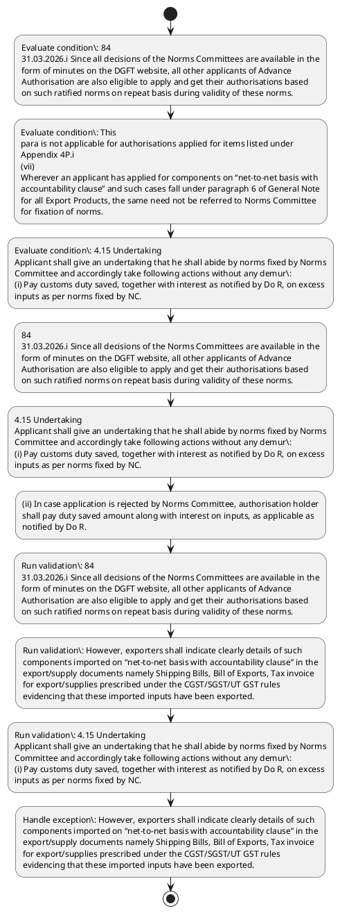

# Chapter 4 / Section 4.15: Undertaking

**Chapter Title:** Duty Exemption / Remission Schemes

**Pages:** 9, 10

**Purpose:** 84
31.03.2026.i Since all decisions of the Norms Committees are available in the
form of minutes on the DGFT website, all other applicants of Advance
Authorisation are also eligible to apply and get their authorisations based
on such ratified norms on repeat basis during validity of these norms.

**Purpose Thanglish:** Indha Undertaking section-la, 84
31.03.2026.i Since all decisions of the Norms Committees are available in the
form of minutes on the DGFT website, all other applicants of Advance
Authorisation are also eligible to apply and get their authorisations based
on such ratified norms on repeat basis during validity of these norms.

**Summary:** 4.15 Undertaking
pg. 84
pg. 84
31.03.2026.i Since all decisions of the Norms Committees are available in the
form of minutes on the DGFT website, all other applicants of Advance
Authorisation are also eligible to apply and get their authorisations based
on such ratified norms on repeat basis during validity of these norms.

**Business Meaning:** Undertaking governs how DGFT business controls should be applied, validated, and enforced.

**Business Explanation:** Undertaking explains the operating rule set that DEKAI should enforce. Key control points include 84
31.03.2026.i Since all decisions of the Norms Committees are available in the
form of minutes on the DGFT website, all other applicants of Advance
Authorisation are also eligible to apply and get their authorisations based
on such ratified norms on repeat basis during validity of these norms. The section also drives actions such as 84
31.03.2026.i Since all decisions of the Norms Committees are available in the
form of minutes on the DGFT website, all other applicants of Advance
Authorisation are also eligible to apply and get their authorisations based
on such ratified norms on repeat basis during validity of these norms..

**Business Explanation Thanglish:** Indha Undertaking section-la, Undertaking explains the operating rule set that DEKAI should enforce. Key control points include 84
31.03.2026.i Since all decisions of the Norms Committees are available in the
form of minutes on the DGFT website, all other applicants of Advance
Authorisation are also eligible to apply and get their authorisations based
on such ratified norms on repeat basis during validity of these norms. The section also drives actions such as 84
31.03.2026.i Since all decisions of the Norms Committees are available in the
form of minutes on the DGFT website, all other applicants of Advance
Authorisation are also eligible to apply and get their authorisations based
on such ratified norms on repeat basis during validity of these norms..

## Business Logic
- 84
31.03.2026.i Since all decisions of the Norms Committees are available in the
form of minutes on the DGFT website, all other applicants of Advance
Authorisation are also eligible to apply and get their authorisations based
on such ratified norms on repeat basis during validity of these norms.
- However, exporters shall indicate clearly details of such
components imported on “net-to-net basis with accountability clause” in the
export/supply documents namely Shipping Bills, Bill of Exports, Tax invoice
for export/supplies prescribed under the CGST/SGST/UT GST rules
evidencing that these imported inputs have been exported.
- 4.15 Undertaking
Applicant shall give an undertaking that he shall abide by norms fixed by Norms
Committee and accordingly take following actions without any demur:
(i) Pay customs duty saved, together with interest as notified by Do R, on excess
inputs as per norms fixed by NC.
- (ii) In case application is rejected by Norms Committee, authorisation holder
shall pay duty saved amount along with interest on inputs, as applicable as
notified by Do R.
- In cases of domestically procured inputs, the amount to be
paid shall be based on exemptions/refund availed on customs
duty/taxes/cess by the domestic supplier.
- (iii) Applicant shall deposit amount as per paragraph 4.49(a)(ii) of HBP in case
the inputs were not freely importable.

## Business Rules
- rule_id=CH4-SEC4_15-R001, rule_description=84
31.03.2026.i Since all decisions of the Norms Committees are available in the
form of minutes on the DGFT website, all other applicants of Advance
Authorisation are also eligible to apply and get their authorisations based
on such ratified norms on repeat basis during validity of these norms., trigger=Undertaking, condition=84
31.03.2026.i Since all decisions of the Norms Committees are available in the
form of minutes on the DGFT website, all other applicants of Advance
Authorisation are also eligible to apply and get their authorisations based
on such ratified norms on repeat basis during validity of these norms., validation=84
31.03.2026.i Since all decisions of the Norms Committees are available in the
form of minutes on the DGFT website, all other applicants of Advance
Authorisation are also eligible to apply and get their authorisations based
on such ratified norms on repeat basis during validity of these norms., action=84
31.03.2026.i Since all decisions of the Norms Committees are available in the
form of minutes on the DGFT website, all other applicants of Advance
Authorisation are also eligible to apply and get their authorisations based
on such ratified norms on repeat basis during validity of these norms., exception=However, exporters shall indicate clearly details of such
components imported on “net-to-net basis with accountability clause” in the
export/supply documents namely Shipping Bills, Bill of Exports, Tax invoice
for export/supplies prescribed under the CGST/SGST/UT GST rules
evidencing that these imported inputs have been exported., output=DEKAI should produce a compliance decision for 4.15 - Undertaking.
- rule_id=CH4-SEC4_15-R002, rule_description=However, exporters shall indicate clearly details of such
components imported on “net-to-net basis with accountability clause” in the
export/supply documents namely Shipping Bills, Bill of Exports, Tax invoice
for export/supplies prescribed under the CGST/SGST/UT GST rules
evidencing that these imported inputs have been exported., trigger=Undertaking, condition=This
para is not applicable for authorisations applied for items listed under
Appendix 4P.i
(vii)
Wherever an applicant has applied for components on “net-to-net basis with
accountability clause” and such cases fall under paragraph 6 of General Note
for all Export Products, the same need not be referred to Norms Committee
for fixation of norms., validation=However, exporters shall indicate clearly details of such
components imported on “net-to-net basis with accountability clause” in the
export/supply documents namely Shipping Bills, Bill of Exports, Tax invoice
for export/supplies prescribed under the CGST/SGST/UT GST rules
evidencing that these imported inputs have been exported., action=4.15 Undertaking
Applicant shall give an undertaking that he shall abide by norms fixed by Norms
Committee and accordingly take following actions without any demur:
(i) Pay customs duty saved, together with interest as notified by Do R, on excess
inputs as per norms fixed by NC., exception=However, in case Norms Committee allows
lower norms for one, more, or all inputs, authorisation holder will have
option to undertake additional EO in proportion to excess inputs., output=DEKAI should produce a compliance decision for 4.15 - Undertaking.
- rule_id=CH4-SEC4_15-R003, rule_description=4.15 Undertaking
Applicant shall give an undertaking that he shall abide by norms fixed by Norms
Committee and accordingly take following actions without any demur:
(i) Pay customs duty saved, together with interest as notified by Do R, on excess
inputs as per norms fixed by NC., trigger=Undertaking, condition=4.15 Undertaking
Applicant shall give an undertaking that he shall abide by norms fixed by Norms
Committee and accordingly take following actions without any demur:
(i) Pay customs duty saved, together with interest as notified by Do R, on excess
inputs as per norms fixed by NC., validation=4.15 Undertaking
Applicant shall give an undertaking that he shall abide by norms fixed by Norms
Committee and accordingly take following actions without any demur:
(i) Pay customs duty saved, together with interest as notified by Do R, on excess
inputs as per norms fixed by NC., action=(ii) In case application is rejected by Norms Committee, authorisation holder
shall pay duty saved amount along with interest on inputs, as applicable as
notified by Do R., exception=In cases of domestically procured inputs, the amount to be
paid shall be based on exemptions/refund availed on customs
duty/taxes/cess by the domestic supplier., output=DEKAI should produce a compliance decision for 4.15 - Undertaking.
- rule_id=CH4-SEC4_15-R004, rule_description=(ii) In case application is rejected by Norms Committee, authorisation holder
shall pay duty saved amount along with interest on inputs, as applicable as
notified by Do R., trigger=Undertaking, condition=However, in case Norms Committee allows
lower norms for one, more, or all inputs, authorisation holder will have
option to undertake additional EO in proportion to excess inputs., validation=(ii) In case application is rejected by Norms Committee, authorisation holder
shall pay duty saved amount along with interest on inputs, as applicable as
notified by Do R., action=(ii) In case application is rejected by Norms Committee, authorisation holder
shall pay duty saved amount along with interest on inputs, as applicable as
notified by Do R., exception=In cases of domestically procured inputs, the amount to be
paid shall be based on exemptions/refund availed on customs
duty/taxes/cess by the domestic supplier., output=DEKAI should produce a compliance decision for 4.15 - Undertaking.
- rule_id=CH4-SEC4_15-R005, rule_description=In cases of domestically procured inputs, the amount to be
paid shall be based on exemptions/refund availed on customs
duty/taxes/cess by the domestic supplier., trigger=Undertaking, condition=(ii) In case application is rejected by Norms Committee, authorisation holder
shall pay duty saved amount along with interest on inputs, as applicable as
notified by Do R., validation=In cases of domestically procured inputs, the amount to be
paid shall be based on exemptions/refund availed on customs
duty/taxes/cess by the domestic supplier., action=(ii) In case application is rejected by Norms Committee, authorisation holder
shall pay duty saved amount along with interest on inputs, as applicable as
notified by Do R., exception=In cases of domestically procured inputs, the amount to be
paid shall be based on exemptions/refund availed on customs
duty/taxes/cess by the domestic supplier., output=DEKAI should produce a compliance decision for 4.15 - Undertaking.
- rule_id=CH4-SEC4_15-R006, rule_description=(iii) Applicant shall deposit amount as per paragraph 4.49(a)(ii) of HBP in case
the inputs were not freely importable., trigger=Undertaking, condition=In cases of domestically procured inputs, the amount to be
paid shall be based on exemptions/refund availed on customs
duty/taxes/cess by the domestic supplier., validation=(iii) Applicant shall deposit amount as per paragraph 4.49(a)(ii) of HBP in case
the inputs were not freely importable., action=(ii) In case application is rejected by Norms Committee, authorisation holder
shall pay duty saved amount along with interest on inputs, as applicable as
notified by Do R., exception=In cases of domestically procured inputs, the amount to be
paid shall be based on exemptions/refund availed on customs
duty/taxes/cess by the domestic supplier., output=DEKAI should produce a compliance decision for 4.15 - Undertaking.

## Conditions
- 84
31.03.2026.i Since all decisions of the Norms Committees are available in the
form of minutes on the DGFT website, all other applicants of Advance
Authorisation are also eligible to apply and get their authorisations based
on such ratified norms on repeat basis during validity of these norms.
- This
para is not applicable for authorisations applied for items listed under
Appendix 4P.i
(vii)
Wherever an applicant has applied for components on “net-to-net basis with
accountability clause” and such cases fall under paragraph 6 of General Note
for all Export Products, the same need not be referred to Norms Committee
for fixation of norms.
- 4.15 Undertaking
Applicant shall give an undertaking that he shall abide by norms fixed by Norms
Committee and accordingly take following actions without any demur:
(i) Pay customs duty saved, together with interest as notified by Do R, on excess
inputs as per norms fixed by NC.
- However, in case Norms Committee allows
lower norms for one, more, or all inputs, authorisation holder will have
option to undertake additional EO in proportion to excess inputs.
- (ii) In case application is rejected by Norms Committee, authorisation holder
shall pay duty saved amount along with interest on inputs, as applicable as
notified by Do R.
- In cases of domestically procured inputs, the amount to be
paid shall be based on exemptions/refund availed on customs
duty/taxes/cess by the domestic supplier.
- (iii) Applicant shall deposit amount as per paragraph 4.49(a)(ii) of HBP in case
the inputs were not freely importable.

## Condition Logic
- id=4.4.15.1, if=84
31.03.2026.i Since all decisions of the Norms Committees are available in the
form of minutes on the DGFT website, all other applicants of Advance
Authorisation are also eligible to apply and get their authorisations based
on such ratified norms on repeat basis during validity of these norms., then=84
31.03.2026.i Since all decisions of the Norms Committees are available in the
form of minutes on the DGFT website, all other applicants of Advance
Authorisation are also eligible to apply and get their authorisations based
on such ratified norms on repeat basis during validity of these norms., source=84
31.03.2026.i Since all decisions of the Norms Committees are available in the
form of minutes on the DGFT website, all other applicants of Advance
Authorisation are also eligible to apply and get their authorisations based
on such ratified norms on repeat basis during validity of these norms.
- id=4.4.15.2, if=This
para is not applicable for authorisations applied for items listed under
Appendix 4P.i
(vii)
Wherever an applicant has applied for components on “net-to-net basis with
accountability clause” and such cases fall under paragraph 6 of General Note
for all Export Products, the same need not be referred to Norms Committee
for fixation of norms., then=84
31.03.2026.i Since all decisions of the Norms Committees are available in the
form of minutes on the DGFT website, all other applicants of Advance
Authorisation are also eligible to apply and get their authorisations based
on such ratified norms on repeat basis during validity of these norms., source=This
para is not applicable for authorisations applied for items listed under
Appendix 4P.i
(vii)
Wherever an applicant has applied for components on “net-to-net basis with
accountability clause” and such cases fall under paragraph 6 of General Note
for all Export Products, the same need not be referred to Norms Committee
for fixation of norms.
- id=4.4.15.3, if=4.15 Undertaking
Applicant shall give an undertaking that he shall abide by norms fixed by Norms
Committee and accordingly take following actions without any demur:
(i) Pay customs duty saved, together with interest as notified by Do R, on excess
inputs as per norms fixed by NC., then=84
31.03.2026.i Since all decisions of the Norms Committees are available in the
form of minutes on the DGFT website, all other applicants of Advance
Authorisation are also eligible to apply and get their authorisations based
on such ratified norms on repeat basis during validity of these norms., source=4.15 Undertaking
Applicant shall give an undertaking that he shall abide by norms fixed by Norms
Committee and accordingly take following actions without any demur:
(i) Pay customs duty saved, together with interest as notified by Do R, on excess
inputs as per norms fixed by NC.
- id=4.4.15.4, if=However, in case Norms Committee allows
lower norms for one, more, or all inputs, authorisation holder will have
option to undertake additional EO in proportion to excess inputs., then=84
31.03.2026.i Since all decisions of the Norms Committees are available in the
form of minutes on the DGFT website, all other applicants of Advance
Authorisation are also eligible to apply and get their authorisations based
on such ratified norms on repeat basis during validity of these norms., source=However, in case Norms Committee allows
lower norms for one, more, or all inputs, authorisation holder will have
option to undertake additional EO in proportion to excess inputs.
- id=4.4.15.5, if=(ii) In case application is rejected by Norms Committee, authorisation holder
shall pay duty saved amount along with interest on inputs, as applicable as
notified by Do R., then=84
31.03.2026.i Since all decisions of the Norms Committees are available in the
form of minutes on the DGFT website, all other applicants of Advance
Authorisation are also eligible to apply and get their authorisations based
on such ratified norms on repeat basis during validity of these norms., source=(ii) In case application is rejected by Norms Committee, authorisation holder
shall pay duty saved amount along with interest on inputs, as applicable as
notified by Do R.
- id=4.4.15.6, if=In cases of domestically procured inputs, the amount to be
paid shall be based on exemptions/refund availed on customs
duty/taxes/cess by the domestic supplier., then=84
31.03.2026.i Since all decisions of the Norms Committees are available in the
form of minutes on the DGFT website, all other applicants of Advance
Authorisation are also eligible to apply and get their authorisations based
on such ratified norms on repeat basis during validity of these norms., source=In cases of domestically procured inputs, the amount to be
paid shall be based on exemptions/refund availed on customs
duty/taxes/cess by the domestic supplier.
- id=4.4.15.7, if=(iii) Applicant shall deposit amount as per paragraph 4.49(a)(ii) of HBP in case
the inputs were not freely importable., then=84
31.03.2026.i Since all decisions of the Norms Committees are available in the
form of minutes on the DGFT website, all other applicants of Advance
Authorisation are also eligible to apply and get their authorisations based
on such ratified norms on repeat basis during validity of these norms., source=(iii) Applicant shall deposit amount as per paragraph 4.49(a)(ii) of HBP in case
the inputs were not freely importable.

## Validations
- 84
31.03.2026.i Since all decisions of the Norms Committees are available in the
form of minutes on the DGFT website, all other applicants of Advance
Authorisation are also eligible to apply and get their authorisations based
on such ratified norms on repeat basis during validity of these norms.
- However, exporters shall indicate clearly details of such
components imported on “net-to-net basis with accountability clause” in the
export/supply documents namely Shipping Bills, Bill of Exports, Tax invoice
for export/supplies prescribed under the CGST/SGST/UT GST rules
evidencing that these imported inputs have been exported.
- 4.15 Undertaking
Applicant shall give an undertaking that he shall abide by norms fixed by Norms
Committee and accordingly take following actions without any demur:
(i) Pay customs duty saved, together with interest as notified by Do R, on excess
inputs as per norms fixed by NC.
- (ii) In case application is rejected by Norms Committee, authorisation holder
shall pay duty saved amount along with interest on inputs, as applicable as
notified by Do R.
- In cases of domestically procured inputs, the amount to be
paid shall be based on exemptions/refund availed on customs
duty/taxes/cess by the domestic supplier.
- (iii) Applicant shall deposit amount as per paragraph 4.49(a)(ii) of HBP in case
the inputs were not freely importable.

## Exceptions
- However, exporters shall indicate clearly details of such
components imported on “net-to-net basis with accountability clause” in the
export/supply documents namely Shipping Bills, Bill of Exports, Tax invoice
for export/supplies prescribed under the CGST/SGST/UT GST rules
evidencing that these imported inputs have been exported.
- However, in case Norms Committee allows
lower norms for one, more, or all inputs, authorisation holder will have
option to undertake additional EO in proportion to excess inputs.
- In cases of domestically procured inputs, the amount to be
paid shall be based on exemptions/refund availed on customs
duty/taxes/cess by the domestic supplier.

## Dependencies
- 6
- 4.49

## Authorities
- DGFT
- Norms Committee
- customs
- In case application is rejected by Norms Committee

## Required Documents
- 4.15 Undertaking
pg.
- However, exporters shall indicate clearly details of such
components imported on “net-to-net basis with accountability clause” in the
export/supply documents namely Shipping Bills, Bill of Exports, Tax invoice
for export/supplies prescribed under the CGST/SGST/UT GST rules
evidencing that these imported inputs have been exported.
- 4.15 Undertaking
Applicant shall give an undertaking that he shall abide by norms fixed by Norms
Committee and accordingly take following actions without any demur:
(i) Pay customs duty saved, together with interest as notified by Do R, on excess
inputs as per norms fixed by NC.
- (ii) In case application is rejected by Norms Committee, authorisation holder
shall pay duty saved amount along with interest on inputs, as applicable as
notified by Do R.

## Timelines
- None identified

## Actions
- 84
31.03.2026.i Since all decisions of the Norms Committees are available in the
form of minutes on the DGFT website, all other applicants of Advance
Authorisation are also eligible to apply and get their authorisations based
on such ratified norms on repeat basis during validity of these norms.
- 4.15 Undertaking
Applicant shall give an undertaking that he shall abide by norms fixed by Norms
Committee and accordingly take following actions without any demur:
(i) Pay customs duty saved, together with interest as notified by Do R, on excess
inputs as per norms fixed by NC.
- (ii) In case application is rejected by Norms Committee, authorisation holder
shall pay duty saved amount along with interest on inputs, as applicable as
notified by Do R.

## Workflow
- Evaluate condition: 84
31.03.2026.i Since all decisions of the Norms Committees are available in the
form of minutes on the DGFT website, all other applicants of Advance
Authorisation are also eligible to apply and get their authorisations based
on such ratified norms on repeat basis during validity of these norms.
- Evaluate condition: This
para is not applicable for authorisations applied for items listed under
Appendix 4P.i
(vii)
Wherever an applicant has applied for components on “net-to-net basis with
accountability clause” and such cases fall under paragraph 6 of General Note
for all Export Products, the same need not be referred to Norms Committee
for fixation of norms.
- Evaluate condition: 4.15 Undertaking
Applicant shall give an undertaking that he shall abide by norms fixed by Norms
Committee and accordingly take following actions without any demur:
(i) Pay customs duty saved, together with interest as notified by Do R, on excess
inputs as per norms fixed by NC.
- 84
31.03.2026.i Since all decisions of the Norms Committees are available in the
form of minutes on the DGFT website, all other applicants of Advance
Authorisation are also eligible to apply and get their authorisations based
on such ratified norms on repeat basis during validity of these norms.
- 4.15 Undertaking
Applicant shall give an undertaking that he shall abide by norms fixed by Norms
Committee and accordingly take following actions without any demur:
(i) Pay customs duty saved, together with interest as notified by Do R, on excess
inputs as per norms fixed by NC.
- (ii) In case application is rejected by Norms Committee, authorisation holder
shall pay duty saved amount along with interest on inputs, as applicable as
notified by Do R.
- Run validation: 84
31.03.2026.i Since all decisions of the Norms Committees are available in the
form of minutes on the DGFT website, all other applicants of Advance
Authorisation are also eligible to apply and get their authorisations based
on such ratified norms on repeat basis during validity of these norms.
- Run validation: However, exporters shall indicate clearly details of such
components imported on “net-to-net basis with accountability clause” in the
export/supply documents namely Shipping Bills, Bill of Exports, Tax invoice
for export/supplies prescribed under the CGST/SGST/UT GST rules
evidencing that these imported inputs have been exported.
- Run validation: 4.15 Undertaking
Applicant shall give an undertaking that he shall abide by norms fixed by Norms
Committee and accordingly take following actions without any demur:
(i) Pay customs duty saved, together with interest as notified by Do R, on excess
inputs as per norms fixed by NC.
- Handle exception: However, exporters shall indicate clearly details of such
components imported on “net-to-net basis with accountability clause” in the
export/supply documents namely Shipping Bills, Bill of Exports, Tax invoice
for export/supplies prescribed under the CGST/SGST/UT GST rules
evidencing that these imported inputs have been exported.

## Workflow ASCII
```text
Undertaking
Evaluate condition: 84
31.03.2026.i Since all decisions of the Norms Committees are available in the
form of minutes on the DGFT website, all other applicants of Advance
Authorisation are also eligible to apply and get their authorisations based
on such ratified norms on repeat basis during validity of these norms.
   |
   v
Evaluate condition: This
para is not applicable for authorisations applied for items listed under
Appendix 4P.i
(vii)
Wherever an applicant has applied for components on “net-to-net basis with
accountability clause” and such cases fall under paragraph 6 of General Note
for all Export Products, the same need not be referred to Norms Committee
for fixation of norms.
   |
   v
Evaluate condition: 4.15 Undertaking
Applicant shall give an undertaking that he shall abide by norms fixed by Norms
Committee and accordingly take following actions without any demur:
(i) Pay customs duty saved, together with interest as notified by Do R, on excess
inputs as per norms fixed by NC.
   |
   v
84
31.03.2026.i Since all decisions of the Norms Committees are available in the
form of minutes on the DGFT website, all other applicants of Advance
Authorisation are also eligible to apply and get their authorisations based
on such ratified norms on repeat basis during validity of these norms.
   |
   v
4.15 Undertaking
Applicant shall give an undertaking that he shall abide by norms fixed by Norms
Committee and accordingly take following actions without any demur:
(i) Pay customs duty saved, together with interest as notified by Do R, on excess
inputs as per norms fixed by NC.
   |
   v
(ii) In case application is rejected by Norms Committee, authorisation holder
shall pay duty saved amount along with interest on inputs, as applicable as
notified by Do R.
   |
   v
Run validation: 84
31.03.2026.i Since all decisions of the Norms Committees are available in the
form of minutes on the DGFT website, all other applicants of Advance
Authorisation are also eligible to apply and get their authorisations based
on such ratified norms on repeat basis during validity of these norms.
   |
   v
Run validation: However, exporters shall indicate clearly details of such
components imported on “net-to-net basis with accountability clause” in the
export/supply documents namely Shipping Bills, Bill of Exports, Tax invoice
for export/supplies prescribed under the CGST/SGST/UT GST rules
evidencing that these imported inputs have been exported.
   |
   v
Run validation: 4.15 Undertaking
Applicant shall give an undertaking that he shall abide by norms fixed by Norms
Committee and accordingly take following actions without any demur:
(i) Pay customs duty saved, together with interest as notified by Do R, on excess
inputs as per norms fixed by NC.
   |
   v
Handle exception: However, exporters shall indicate clearly details of such
components imported on “net-to-net basis with accountability clause” in the
export/supply documents namely Shipping Bills, Bill of Exports, Tax invoice
for export/supplies prescribed under the CGST/SGST/UT GST rules
evidencing that these imported inputs have been exported.
```

## Decision Tree
- IF 84
31.03.2026.i Since all decisions of the Norms Committees are available in the
form of minutes on the DGFT website, all other applicants of Advance
Authorisation are also eligible to apply and get their authorisations based
on such ratified norms on repeat basis during validity of these norms. THEN 84
31.03.2026.i Since all decisions of the Norms Committees are available in the
form of minutes on the DGFT website, all other applicants of Advance
Authorisation are also eligible to apply and get their authorisations based
on such ratified norms on repeat basis during validity of these norms.
- IF This
para is not applicable for authorisations applied for items listed under
Appendix 4P.i
(vii)
Wherever an applicant has applied for components on “net-to-net basis with
accountability clause” and such cases fall under paragraph 6 of General Note
for all Export Products, the same need not be referred to Norms Committee
for fixation of norms. THEN 84
31.03.2026.i Since all decisions of the Norms Committees are available in the
form of minutes on the DGFT website, all other applicants of Advance
Authorisation are also eligible to apply and get their authorisations based
on such ratified norms on repeat basis during validity of these norms.
- IF 4.15 Undertaking
Applicant shall give an undertaking that he shall abide by norms fixed by Norms
Committee and accordingly take following actions without any demur:
(i) Pay customs duty saved, together with interest as notified by Do R, on excess
inputs as per norms fixed by NC. THEN 84
31.03.2026.i Since all decisions of the Norms Committees are available in the
form of minutes on the DGFT website, all other applicants of Advance
Authorisation are also eligible to apply and get their authorisations based
on such ratified norms on repeat basis during validity of these norms.
- IF However, in case Norms Committee allows
lower norms for one, more, or all inputs, authorisation holder will have
option to undertake additional EO in proportion to excess inputs. THEN 84
31.03.2026.i Since all decisions of the Norms Committees are available in the
form of minutes on the DGFT website, all other applicants of Advance
Authorisation are also eligible to apply and get their authorisations based
on such ratified norms on repeat basis during validity of these norms.
- IF (ii) In case application is rejected by Norms Committee, authorisation holder
shall pay duty saved amount along with interest on inputs, as applicable as
notified by Do R. THEN 84
31.03.2026.i Since all decisions of the Norms Committees are available in the
form of minutes on the DGFT website, all other applicants of Advance
Authorisation are also eligible to apply and get their authorisations based
on such ratified norms on repeat basis during validity of these norms.
- IF exception applies (However, exporters shall indicate clearly details of such
components imported on “net-to-net basis with accountability clause” in the
export/supply documents namely Shipping Bills, Bill of Exports, Tax invoice
for export/supplies prescribed under the CGST/SGST/UT GST rules
evidencing that these imported inputs have been exported.) THEN route to manual review
- IF exception applies (However, in case Norms Committee allows
lower norms for one, more, or all inputs, authorisation holder will have
option to undertake additional EO in proportion to excess inputs.) THEN route to manual review
- IF exception applies (In cases of domestically procured inputs, the amount to be
paid shall be based on exemptions/refund availed on customs
duty/taxes/cess by the domestic supplier.) THEN route to manual review

## Decision Tree ASCII
```text
Undertaking Decision
IF 84
31.03.2026.i Since all decisions of the Norms Committees are available in the
form of minutes on the DGFT website, all other applicants of Advance
Authorisation are also eligible to apply and get their authorisations based
on such ratified norms on repeat basis during validity of these norms. THEN 84
31.03.2026.i Since all decisions of the Norms Committees are available in the
form of minutes on the DGFT website, all other applicants of Advance
Authorisation are also eligible to apply and get their authorisations based
on such ratified norms on repeat basis during validity of these norms.
   |
   v
IF This
para is not applicable for authorisations applied for items listed under
Appendix 4P.i
(vii)
Wherever an applicant has applied for components on “net-to-net basis with
accountability clause” and such cases fall under paragraph 6 of General Note
for all Export Products, the same need not be referred to Norms Committee
for fixation of norms. THEN 84
31.03.2026.i Since all decisions of the Norms Committees are available in the
form of minutes on the DGFT website, all other applicants of Advance
Authorisation are also eligible to apply and get their authorisations based
on such ratified norms on repeat basis during validity of these norms.
   |
   v
IF 4.15 Undertaking
Applicant shall give an undertaking that he shall abide by norms fixed by Norms
Committee and accordingly take following actions without any demur:
(i) Pay customs duty saved, together with interest as notified by Do R, on excess
inputs as per norms fixed by NC. THEN 84
31.03.2026.i Since all decisions of the Norms Committees are available in the
form of minutes on the DGFT website, all other applicants of Advance
Authorisation are also eligible to apply and get their authorisations based
on such ratified norms on repeat basis during validity of these norms.
   |
   v
IF However, in case Norms Committee allows
lower norms for one, more, or all inputs, authorisation holder will have
option to undertake additional EO in proportion to excess inputs. THEN 84
31.03.2026.i Since all decisions of the Norms Committees are available in the
form of minutes on the DGFT website, all other applicants of Advance
Authorisation are also eligible to apply and get their authorisations based
on such ratified norms on repeat basis during validity of these norms.
   |
   v
IF (ii) In case application is rejected by Norms Committee, authorisation holder
shall pay duty saved amount along with interest on inputs, as applicable as
notified by Do R. THEN 84
31.03.2026.i Since all decisions of the Norms Committees are available in the
form of minutes on the DGFT website, all other applicants of Advance
Authorisation are also eligible to apply and get their authorisations based
on such ratified norms on repeat basis during validity of these norms.
   |
   v
IF exception applies (However, exporters shall indicate clearly details of such
components imported on “net-to-net basis with accountability clause” in the
export/supply documents namely Shipping Bills, Bill of Exports, Tax invoice
for export/supplies prescribed under the CGST/SGST/UT GST rules
evidencing that these imported inputs have been exported.) THEN route to manual review
   |
   v
IF exception applies (However, in case Norms Committee allows
lower norms for one, more, or all inputs, authorisation holder will have
option to undertake additional EO in proportion to excess inputs.) THEN route to manual review
   |
   v
IF exception applies (In cases of domestically procured inputs, the amount to be
paid shall be based on exemptions/refund availed on customs
duty/taxes/cess by the domestic supplier.) THEN route to manual review
```

## Examples
- User asks to process Undertaking; the platform checks conditions, validations, and documents before action.

**Real-world Example:** Example: an importer or exporter invokes Undertaking, submits 4.15 Undertaking
pg., However, exporters shall indicate clearly details of such
components imported on “net-to-net basis with accountability clause” in the
export/supply documents namely Shipping Bills, Bill of Exports, Tax invoice
for export/supplies prescribed under the CGST/SGST/UT GST rules
evidencing that these imported inputs have been exported., 4.15 Undertaking
Applicant shall give an undertaking that he shall abide by norms fixed by Norms
Committee and accordingly take following actions without any demur:
(i) Pay customs duty saved, together with interest as notified by Do R, on excess
inputs as per norms fixed by NC., and DEKAI uses the extracted rules to 84
31.03.2026.i since all decisions of the norms committees are available in the
form of minutes on the dgft website, all other applicants of advance
authorisation are also eligible to apply and get their authorisations based
on such ratified norms on repeat basis during validity of these norms..

**Real-world Example Thanglish:** Indha Undertaking section-la, Example: an importer or exporter invokes Undertaking, submits 4.15 Undertaking
pg., However, exporters kandippa indicate clearly details of such
components imported on “net-to-net basis with accountability clause” in the
export/supply documents namely Shipping Bills, Bill of Exports, Tax invoice
for export/supplies prescribed under the CGST/SGST/UT GST rules
evidencing that these imported inputs have been exported., 4.15 Undertaking
Applicant kandippa give an undertaking that he kandippa abide by norms fixed by Norms
Committee and accordingly take following actions without any demur:
(i) Pay customs duty saved, together with interest as notified by Do R, on excess
inputs as per norms fixed by NC., and DEKAI uses the extracted rules to 84
31.03.2026.i since all decisions of the norms committees are available in the
form of minutes on the dgft website, all other applicants of advance
authorisation are also eligible to apply and get their authorisations based
on such ratified norms on repeat basis during validity of these norms..

## AI Rules
- IF detected context matches section rule THEN enforce: 84
31.03.2026.i Since all decisions of the Norms Committees are available in the
form of minutes on the DGFT website, all other applicants of Advance
Authorisation are also eligible to apply and get their authorisations based
on such ratified norms on repeat basis during validity of these norms.
- IF detected context matches section rule THEN enforce: However, exporters shall indicate clearly details of such
components imported on “net-to-net basis with accountability clause” in the
export/supply documents namely Shipping Bills, Bill of Exports, Tax invoice
for export/supplies prescribed under the CGST/SGST/UT GST rules
evidencing that these imported inputs have been exported.
- IF detected context matches section rule THEN enforce: 4.15 Undertaking
Applicant shall give an undertaking that he shall abide by norms fixed by Norms
Committee and accordingly take following actions without any demur:
(i) Pay customs duty saved, together with interest as notified by Do R, on excess
inputs as per norms fixed by NC.
- IF detected context matches section rule THEN enforce: (ii) In case application is rejected by Norms Committee, authorisation holder
shall pay duty saved amount along with interest on inputs, as applicable as
notified by Do R.
- IF detected context matches section rule THEN enforce: In cases of domestically procured inputs, the amount to be
paid shall be based on exemptions/refund availed on customs
duty/taxes/cess by the domestic supplier.
- IF detected context matches section rule THEN enforce: (iii) Applicant shall deposit amount as per paragraph 4.49(a)(ii) of HBP in case
the inputs were not freely importable.
- IF validations pass THEN recommend action: 84
31.03.2026.i Since all decisions of the Norms Committees are available in the
form of minutes on the DGFT website, all other applicants of Advance
Authorisation are also eligible to apply and get their authorisations based
on such ratified norms on repeat basis during validity of these norms.

## Database Fields
- name=section_code, type=string, required=True, source=parsed_section_heading
- name=section_title, type=string, required=True, source=parsed_section_heading
- name=all_flag, type=boolean, required=False, source=keyword:all
- name=the_flag, type=boolean, required=False, source=keyword:the
- name=are_flag, type=boolean, required=False, source=keyword:are
- name=and_flag, type=boolean, required=False, source=keyword:and
- name=get_flag, type=boolean, required=False, source=keyword:get
- name=not_flag, type=boolean, required=False, source=keyword:not
- name=for_flag, type=boolean, required=False, source=keyword:for
- name=vii_flag, type=boolean, required=False, source=keyword:vii
- name=document_1_submitted, type=boolean, required=True, source=4.15 Undertaking
pg.
- name=document_2_submitted, type=boolean, required=True, source=However, exporters shall indicate clearly details of such
components imported on “net-to-net basis with accountability clause” in the
export/supply documents namely Shipping Bills, Bill of Exports, Tax invoice
for export/supplies prescribed under the CGST/SGST/UT GST rules
evidencing that these imported inputs have been exported.
- name=document_3_submitted, type=boolean, required=True, source=4.15 Undertaking
Applicant shall give an undertaking that he shall abide by norms fixed by Norms
Committee and accordingly take following actions without any demur:
(i) Pay customs duty saved, together with interest as notified by Do R, on excess
inputs as per norms fixed by NC.
- name=document_4_submitted, type=boolean, required=True, source=(ii) In case application is rejected by Norms Committee, authorisation holder
shall pay duty saved amount along with interest on inputs, as applicable as
notified by Do R.

## API Requirements
- method=GET, path=/api/dgft/sections/4.15, purpose=Retrieve knowledge payload for section 4.15, query_params=['include=workflow,decision_tree,validations'], response_fields=['section', 'title', 'summary', 'conditions', 'validations', 'exceptions', 'workflow', 'decision_tree']
- method=POST, path=/api/dgft/Undertaking/validate, purpose=Validate inputs and documents for Undertaking, request_fields=['section_code', 'section_title', 'document_1_submitted', 'document_2_submitted', 'document_3_submitted', 'document_4_submitted'], response_fields=['status', 'errors', 'warnings', 'next_actions']
- method=POST, path=/api/dgft/Undertaking/execute, purpose=Trigger business action for 84
31.03.2026.i Since all decisions of the Norms Committees are available in the
form of minutes on the DGFT website, all other applicants of Advance
Authorisation are also eligible to apply and get their authorisations based
on such ratified norms on repeat basis during validity of these norms., request_fields=['section_code', 'section_title', 'document_1_submitted', 'document_2_submitted', 'document_3_submitted', 'document_4_submitted'], response_fields=['reference_id', 'status', 'authority', 'timeline']

## UI Screens
- screen_id=Undertaking_overview, name=Undertaking Overview, purpose=Show section summary, authority, timeline, and eligibility cues., widgets=['summary_card', 'conditions_table', 'authority_badges', 'timeline_panel']
- screen_id=Undertaking_submission, name=Undertaking Submission, purpose=Capture applicant data and supporting documents., widgets=['dynamic_form', 'document_uploader', 'validation_panel', 'next_action_footer'], fields=['section_code', 'section_title', 'all_flag', 'the_flag', 'are_flag', 'and_flag', 'get_flag', 'not_flag']
- screen_id=Undertaking_exceptions, name=Undertaking Exception Review, purpose=Explain exception handling and manual review triggers., widgets=['exception_banner', 'decision_tree', 'case_notes']

## Error Messages
- Validation failed because the section requirements were not fully met.

## FAQ
- question_en=What is the purpose of section 4.15?, answer_en=Undertaking explains the operating rule set that DEKAI should enforce. Key control points include 84
31.03.2026.i Since all decisions of the Norms Committees are available in the
form of minutes on the DGFT website, all other applicants of Advance
Authorisation are also eligible to apply and get their authorisations based
on such ratified norms on repeat basis during validity of these norms. The section also drives actions such as 84
31.03.2026.i Since all decisions of the Norms Committees are available in the
form of minutes on the DGFT website, all other applicants of Advance
Authorisation are also eligible to apply and get their authorisations based
on such ratified norms on repeat basis during validity of these norms.., question_thanglish=Indha Undertaking section-la, What is the purpose of section 4.15?, answer_thanglish=Indha Undertaking section-la, Undertaking explains the operating rule set that DEKAI should enforce. Key control points include 84
31.03.2026.i Since all decisions of the Norms Committees are available in the
form of minutes on the DGFT website, all other applicants of Advance
Authorisation are also eligible to apply and get their authorisations based
on such ratified norms on repeat basis during validity of these norms. The section also drives actions such as 84
31.03.2026.i Since all decisions of the Norms Committees are available in the
form of minutes on the DGFT website, all other applicants of Advance
Authorisation are also eligible to apply and get their authorisations based
on such ratified norms on repeat basis during validity of these norms..
- question_en=What documents are required under Undertaking?, answer_en=4.15 Undertaking
pg., However, exporters shall indicate clearly details of such
components imported on “net-to-net basis with accountability clause” in the
export/supply documents namely Shipping Bills, Bill of Exports, Tax invoice
for export/supplies prescribed under the CGST/SGST/UT GST rules
evidencing that these imported inputs have been exported., 4.15 Undertaking
Applicant shall give an undertaking that he shall abide by norms fixed by Norms
Committee and accordingly take following actions without any demur:
(i) Pay customs duty saved, together with interest as notified by Do R, on excess
inputs as per norms fixed by NC., (ii) In case application is rejected by Norms Committee, authorisation holder
shall pay duty saved amount along with interest on inputs, as applicable as
notified by Do R., question_thanglish=Indha Undertaking section-la, What documents are required under Undertaking?, answer_thanglish=Indha Undertaking section-la, 4.15 Undertaking
pg., However, exporters kandippa indicate clearly details of such
components imported on “net-to-net basis with accountability clause” in the
export/supply documents namely Shipping Bills, Bill of Exports, Tax invoice
for export/supplies prescribed under the CGST/SGST/UT GST rules
evidencing that these imported inputs have been exported., 4.15 Undertaking
Applicant kandippa give an undertaking that he kandippa abide by norms fixed by Norms
Committee and accordingly take following actions without any demur:
(i) Pay customs duty saved, together with interest as notified by Do R, on excess
inputs as per norms fixed by NC., (ii) In case application is rejected by Norms Committee, authorisation holder
kandippa pay duty saved amount along with interest on inputs, as applicable as
notified by Do R.
- question_en=Which authority handles Undertaking?, answer_en=DGFT, Norms Committee, customs, In case application is rejected by Norms Committee, question_thanglish=Indha Undertaking section-la, Which authority handles Undertaking?, answer_thanglish=Indha Undertaking section-la, DGFT, Norms Committee, customs, In case application is rejected by Norms Committee

## Questions Users May Ask
- What does Undertaking require?
- Which documents are needed for Undertaking?
- How does DEKAI validate Undertaking requests?
- What action should be taken for Undertaking?

## Expected AI Answers
- Undertaking requires the platform to interpret the section text, apply the extracted business rules, and present the correct next action.
- Required documents are inferred from the section text: 4.15 Undertaking
pg., However, exporters shall indicate clearly details of such
components imported on “net-to-net basis with accountability clause” in the
export/supply documents namely Shipping Bills, Bill of Exports, Tax invoice
for export/supplies prescribed under the CGST/SGST/UT GST rules
evidencing that these imported inputs have been exported., 4.15 Undertaking
Applicant shall give an undertaking that he shall abide by norms fixed by Norms
Committee and accordingly take following actions without any demur:
(i) Pay customs duty saved, together with interest as notified by Do R, on excess
inputs as per norms fixed by NC., (ii) In case application is rejected by Norms Committee, authorisation holder
shall pay duty saved amount along with interest on inputs, as applicable as
notified by Do R.
- DEKAI validates Undertaking by checking conditions, required documents, authority references, and exception clauses before recommending an outcome.
- The primary extracted action is: 84
31.03.2026.i Since all decisions of the Norms Committees are available in the
form of minutes on the DGFT website, all other applicants of Advance
Authorisation are also eligible to apply and get their authorisations based
on such ratified norms on repeat basis during validity of these norms.

## AI Q&A Examples
- question_en=User asks: How do I comply with Undertaking?, answer_en=AI answers: DEKAI should evaluate section 4.15, apply the extracted rules, and guide the user through Evaluate condition: 84
31.03.2026.i Since all decisions of the Norms Committees are available in the
form of minutes on the DGFT website, all other applicants of Advance
Authorisation are also eligible to apply and get their authorisations based
on such ratified norms on repeat basis during validity of these norms.., question_thanglish=Indha Undertaking section-la, User asks: How do I comply with Undertaking?, answer_thanglish=Indha Undertaking section-la, AI answers: DEKAI should evaluate section 4.15, apply the extracted rules, and guide the user through Evaluate condition: 84
31.03.2026.i Since all decisions of the Norms Committees are available in the
form of minutes on the DGFT website, all other applicants of Advance
Authorisation are also eligible to apply and get their authorisations based
on such ratified norms on repeat basis during validity of these norms..
- question_en=User asks: Which validations apply to Undertaking?, answer_en=AI answers: Applicable validations are 84
31.03.2026.i Since all decisions of the Norms Committees are available in the
form of minutes on the DGFT website, all other applicants of Advance
Authorisation are also eligible to apply and get their authorisations based
on such ratified norms on repeat basis during validity of these norms., However, exporters shall indicate clearly details of such
components imported on “net-to-net basis with accountability clause” in the
export/supply documents namely Shipping Bills, Bill of Exports, Tax invoice
for export/supplies prescribed under the CGST/SGST/UT GST rules
evidencing that these imported inputs have been exported., 4.15 Undertaking
Applicant shall give an undertaking that he shall abide by norms fixed by Norms
Committee and accordingly take following actions without any demur:
(i) Pay customs duty saved, together with interest as notified by Do R, on excess
inputs as per norms fixed by NC., question_thanglish=Indha Undertaking section-la, User asks: Which validations apply to Undertaking?, answer_thanglish=Indha Undertaking section-la, AI answers: Applicable validations are 84
31.03.2026.i Since all decisions of the Norms Committees are available in the
form of minutes on the DGFT website, all other applicants of Advance
Authorisation are also eligible to apply and get their authorisations based
on such ratified norms on repeat basis during validity of these norms., However, exporters kandippa indicate clearly details of such
components imported on “net-to-net basis with accountability clause” in the
export/supply documents namely Shipping Bills, Bill of Exports, Tax invoice
for export/supplies prescribed under the CGST/SGST/UT GST rules
evidencing that these imported inputs have been exported., 4.15 Undertaking
Applicant kandippa give an undertaking that he kandippa abide by norms fixed by Norms
Committee and accordingly take following actions without any demur:
(i) Pay customs duty saved, together with interest as notified by Do R, on excess
inputs as per norms fixed by NC.

## DEKAI AI Implementation Notes
- Capture chapter 4, section 4.15, title, and page references as immutable knowledge metadata.
- Bind validations for Undertaking into a rule engine keyed by the rule IDs extracted for this section.
- Expose document upload controls for: 4.15 Undertaking
pg., However, exporters shall indicate clearly details of such
components imported on “net-to-net basis with accountability clause” in the
export/supply documents namely Shipping Bills, Bill of Exports, Tax invoice
for export/supplies prescribed under the CGST/SGST/UT GST rules
evidencing that these imported inputs have been exported., 4.15 Undertaking
Applicant shall give an undertaking that he shall abide by norms fixed by Norms
Committee and accordingly take following actions without any demur:
(i) Pay customs duty saved, together with interest as notified by Do R, on excess
inputs as per norms fixed by NC., (ii) In case application is rejected by Norms Committee, authorisation holder
shall pay duty saved amount along with interest on inputs, as applicable as
notified by Do R..
- Route escalations or approvals to: DGFT, Norms Committee, customs, In case application is rejected by Norms Committee.
- Trigger manual review when exception clauses are detected.
- Show contextual links to related sections: 4.49.

## DEKAI AI Implementation Notes Thanglish
- Indha Undertaking section-la, Capture chapter 4, section 4.15, title, and page references as immutable knowledge metadata.
- Indha Undertaking section-la, Bind validations for Undertaking into a rule engine keyed by the rule IDs extracted for this section.
- Indha Undertaking section-la, Expose document upload controls for: 4.15 Undertaking
pg., However, exporters kandippa indicate clearly details of such
components imported on “net-to-net basis with accountability clause” in the
export/supply documents namely Shipping Bills, Bill of Exports, Tax invoice
for export/supplies prescribed under the CGST/SGST/UT GST rules
evidencing that these imported inputs have been exported., 4.15 Undertaking
Applicant kandippa give an undertaking that he kandippa abide by norms fixed by Norms
Committee and accordingly take following actions without any demur:
(i) Pay customs duty saved, together with interest as notified by Do R, on excess
inputs as per norms fixed by NC., (ii) In case application is rejected by Norms Committee, authorisation holder
kandippa pay duty saved amount along with interest on inputs, as applicable as
notified by Do R..
- Indha Undertaking section-la, Route escalations or approvals to: DGFT, Norms Committee, customs, In case application is rejected by Norms Committee.
- Indha Undertaking section-la, Trigger manual review when exception clauses are detected.
- Indha Undertaking section-la, Show contextual links to related sections: 4.49.

## AI Metadata
- Keywords: all, the, are, and, get, not, for, vii, has, Tax, GST, any, Pay, per, one, iii, HBP, form, DGFT, also
- Search Keywords: all, the, are, and, get, not, for, vii, has, Tax, GST, any, Pay, per, one, iii, HBP, form, DGFT, also
- Intent: Support Undertaking processing and compliance validation.
- Tags: 4.15, Undertaking, business-rule, document-driven, dgft
- Related Sections: 4.49
- Related Chapters: 
- Related Rules: 84
31.03.2026.i Since all decisions of the Norms Committees are available in the
form of minutes on the DGFT website, all other applicants of Advance
Authorisation are also eligible to apply and get their authorisations based
on such ratified norms on repeat basis during validity of these norms., However, exporters shall indicate clearly details of such
components imported on “net-to-net basis with accountability clause” in the
export/supply documents namely Shipping Bills, Bill of Exports, Tax invoice
for export/supplies prescribed under the CGST/SGST/UT GST rules
evidencing that these imported inputs have been exported., 4.15 Undertaking
Applicant shall give an undertaking that he shall abide by norms fixed by Norms
Committee and accordingly take following actions without any demur:
(i) Pay customs duty saved, together with interest as notified by Do R, on excess
inputs as per norms fixed by NC., (ii) In case application is rejected by Norms Committee, authorisation holder
shall pay duty saved amount along with interest on inputs, as applicable as
notified by Do R., In cases of domestically procured inputs, the amount to be
paid shall be based on exemptions/refund availed on customs
duty/taxes/cess by the domestic supplier.

## Mermaid

```mermaid
flowchart TD
    S1["Evaluate condition: 84
31.03.2026.i Since all decisions of the Norms Committees are available in the
form of minutes on the DGFT website, all other applicants of Advance
Authorisation are also eligible to apply and get their authorisations based
on such ratified norms on repeat basis during validity of these norms."]
    S2["Evaluate condition: This
para is not applicable for authorisations applied for items listed under
Appendix 4P.i
(vii)
Wherever an applicant has applied for components on “net-to-net basis with
accountability clause” and such cases fall under paragraph 6 of General Note
for all Export Products, the same need not be referred to Norms Committee
for fixation of norms."]
    S1 --> S2
    S3["Evaluate condition: 4.15 Undertaking
Applicant shall give an undertaking that he shall abide by norms fixed by Norms
Committee and accordingly take following actions without any demur:
(i) Pay customs duty saved, together with interest as notified by Do R, on excess
inputs as per norms fixed by NC."]
    S2 --> S3
    S4["84
31.03.2026.i Since all decisions of the Norms Committees are available in the
form of minutes on the DGFT website, all other applicants of Advance
Authorisation are also eligible to apply and get their authorisations based
on such ratified norms on repeat basis during validity of these norms."]
    S3 --> S4
    S5["4.15 Undertaking
Applicant shall give an undertaking that he shall abide by norms fixed by Norms
Committee and accordingly take following actions without any demur:
(i) Pay customs duty saved, together with interest as notified by Do R, on excess
inputs as per norms fixed by NC."]
    S4 --> S5
    S6["(ii) In case application is rejected by Norms Committee, authorisation holder
shall pay duty saved amount along with interest on inputs, as applicable as
notified by Do R."]
    S5 --> S6
    S7["Run validation: 84
31.03.2026.i Since all decisions of the Norms Committees are available in the
form of minutes on the DGFT website, all other applicants of Advance
Authorisation are also eligible to apply and get their authorisations based
on such ratified norms on repeat basis during validity of these norms."]
    S6 --> S7
    S8["Run validation: However, exporters shall indicate clearly details of such
components imported on “net-to-net basis with accountability clause” in the
export/supply documents namely Shipping Bills, Bill of Exports, Tax invoice
for export/supplies prescribed under the CGST/SGST/UT GST rules
evidencing that these imported inputs have been exported."]
    S7 --> S8
    S9["Run validation: 4.15 Undertaking
Applicant shall give an undertaking that he shall abide by norms fixed by Norms
Committee and accordingly take following actions without any demur:
(i) Pay customs duty saved, together with interest as notified by Do R, on excess
inputs as per norms fixed by NC."]
    S8 --> S9
    S10["Handle exception: However, exporters shall indicate clearly details of such
components imported on “net-to-net basis with accountability clause” in the
export/supply documents namely Shipping Bills, Bill of Exports, Tax invoice
for export/supplies prescribed under the CGST/SGST/UT GST rules
evidencing that these imported inputs have been exported."]
    S9 --> S10
```


## PlantUML

