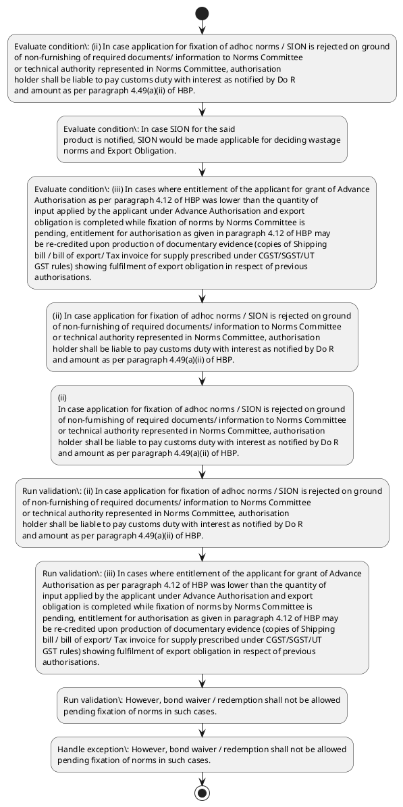

# Chapter 4 / Section 4.16: Fixation of norms by Norms Committees

**Chapter Title:** Duty Exemption / Remission Schemes

**Pages:** 10

**Purpose:** 4.16 Fixation of norms by Norms Committees
(i) All Norms Committees would endeavour for earliest fixation of norms.

**Purpose Thanglish:** Indha Fixation of norms by Norms Committees section-la, 4.16 Fixation of norms by Norms Committees
(i) All Norms Committees would endeavour for earliest fixation of norms.

**Summary:** 4.16 Fixation of norms by Norms Committees
(i) All Norms Committees would endeavour for earliest fixation of norms. (ii) In case application for fixation of adhoc norms / SION is rejected on ground
of non-furnishing of required documents/ information to Norms Committee
or technical authority represented in Norms Committee, authorisation
holder shall be liable to pay customs duty with interest as notified by Do R
and amount as per paragraph 4.49(a)(ii) of HBP. In case SION for the said
product is notified, SION would be made applicable for deciding wastage
norms and Export Obligation.

**Business Meaning:** Fixation of norms by Norms Committees governs how DGFT business controls should be applied, validated, and enforced.

**Business Explanation:** Fixation of norms by Norms Committees explains the operating rule set that DEKAI should enforce. Key control points include (ii) In case application for fixation of adhoc norms / SION is rejected on ground
of non-furnishing of required documents/ information to Norms Committee
or technical authority represented in Norms Committee, authorisation
holder shall be liable to pay customs duty with interest as notified by Do R
and amount as per paragraph 4.49(a)(ii) of HBP. The section also drives actions such as (ii) In case application for fixation of adhoc norms / SION is rejected on ground
of non-furnishing of required documents/ information to Norms Committee
or technical authority represented in Norms Committee, authorisation
holder shall be liable to pay customs duty with interest as notified by Do R
and amount as per paragraph 4.49(a)(ii) of HBP..

**Business Explanation Thanglish:** Indha Fixation of norms by Norms Committees section-la, Fixation of norms by Norms Committees explains the operating rule set that DEKAI should enforce. Key control points include (ii) In case application for fixation of adhoc norms / SION is rejected on ground
of non-furnishing of required documents/ information to Norms Committee
or technical authority represented in Norms Committee, authorisation
holder kandippa be liable to pay customs duty with interest as notified by Do R
and amount as per paragraph 4.49(a)(ii) of HBP. The section also drives actions such as (ii) In case application for fixation of adhoc norms / SION is rejected on ground
of non-furnishing of required documents/ information to Norms Committee
or technical authority represented in Norms Committee, authorisation
holder kandippa be liable to pay customs duty with interest as notified by Do R
and amount as per paragraph 4.49(a)(ii) of HBP..

## Business Logic
- (ii) In case application for fixation of adhoc norms / SION is rejected on ground
of non-furnishing of required documents/ information to Norms Committee
or technical authority represented in Norms Committee, authorisation
holder shall be liable to pay customs duty with interest as notified by Do R
and amount as per paragraph 4.49(a)(ii) of HBP.
- However, bond waiver / redemption shall not be allowed
pending fixation of norms in such cases.
- (ii)
In case application for fixation of adhoc norms / SION is rejected on ground
of non-furnishing of required documents/ information to Norms Committee
or technical authority represented in Norms Committee, authorisation
holder shall be liable to pay customs duty with interest as notified by Do R
and amount as per paragraph 4.49(a)(ii) of HBP.

## Business Rules
- rule_id=CH4-SEC4_16-R001, rule_description=(ii) In case application for fixation of adhoc norms / SION is rejected on ground
of non-furnishing of required documents/ information to Norms Committee
or technical authority represented in Norms Committee, authorisation
holder shall be liable to pay customs duty with interest as notified by Do R
and amount as per paragraph 4.49(a)(ii) of HBP., trigger=Fixation of norms by Norms Committees, condition=(ii) In case application for fixation of adhoc norms / SION is rejected on ground
of non-furnishing of required documents/ information to Norms Committee
or technical authority represented in Norms Committee, authorisation
holder shall be liable to pay customs duty with interest as notified by Do R
and amount as per paragraph 4.49(a)(ii) of HBP., validation=(ii) In case application for fixation of adhoc norms / SION is rejected on ground
of non-furnishing of required documents/ information to Norms Committee
or technical authority represented in Norms Committee, authorisation
holder shall be liable to pay customs duty with interest as notified by Do R
and amount as per paragraph 4.49(a)(ii) of HBP., action=(ii) In case application for fixation of adhoc norms / SION is rejected on ground
of non-furnishing of required documents/ information to Norms Committee
or technical authority represented in Norms Committee, authorisation
holder shall be liable to pay customs duty with interest as notified by Do R
and amount as per paragraph 4.49(a)(ii) of HBP., exception=However, bond waiver / redemption shall not be allowed
pending fixation of norms in such cases., output=DEKAI should produce a compliance decision for 4.16 - Fixation of norms by Norms Committees.
- rule_id=CH4-SEC4_16-R002, rule_description=However, bond waiver / redemption shall not be allowed
pending fixation of norms in such cases., trigger=Fixation of norms by Norms Committees, condition=In case SION for the said
product is notified, SION would be made applicable for deciding wastage
norms and Export Obligation., validation=(iii) In cases where entitlement of the applicant for grant of Advance
Authorisation as per paragraph 4.12 of HBP was lower than the quantity of
input applied by the applicant under Advance Authorisation and export
obligation is completed while fixation of norms by Norms Committee is
pending, entitlement for authorisation as given in paragraph 4.12 of HBP may
be re-credited upon production of documentary evidence (copies of Shipping
bill / bill of export/ Tax invoice for supply prescribed under CGST/SGST/UT
GST rules) showing fulfilment of export obligation in respect of previous
authorisations., action=(ii)
In case application for fixation of adhoc norms / SION is rejected on ground
of non-furnishing of required documents/ information to Norms Committee
or technical authority represented in Norms Committee, authorisation
holder shall be liable to pay customs duty with interest as notified by Do R
and amount as per paragraph 4.49(a)(ii) of HBP., exception=However, bond waiver / redemption shall not be allowed
pending fixation of norms in such cases., output=DEKAI should produce a compliance decision for 4.16 - Fixation of norms by Norms Committees.
- rule_id=CH4-SEC4_16-R003, rule_description=(ii)
In case application for fixation of adhoc norms / SION is rejected on ground
of non-furnishing of required documents/ information to Norms Committee
or technical authority represented in Norms Committee, authorisation
holder shall be liable to pay customs duty with interest as notified by Do R
and amount as per paragraph 4.49(a)(ii) of HBP., trigger=Fixation of norms by Norms Committees, condition=(iii) In cases where entitlement of the applicant for grant of Advance
Authorisation as per paragraph 4.12 of HBP was lower than the quantity of
input applied by the applicant under Advance Authorisation and export
obligation is completed while fixation of norms by Norms Committee is
pending, entitlement for authorisation as given in paragraph 4.12 of HBP may
be re-credited upon production of documentary evidence (copies of Shipping
bill / bill of export/ Tax invoice for supply prescribed under CGST/SGST/UT
GST rules) showing fulfilment of export obligation in respect of previous
authorisations., validation=However, bond waiver / redemption shall not be allowed
pending fixation of norms in such cases., action=(ii)
In case application for fixation of adhoc norms / SION is rejected on ground
of non-furnishing of required documents/ information to Norms Committee
or technical authority represented in Norms Committee, authorisation
holder shall be liable to pay customs duty with interest as notified by Do R
and amount as per paragraph 4.49(a)(ii) of HBP., exception=However, bond waiver / redemption shall not be allowed
pending fixation of norms in such cases., output=DEKAI should produce a compliance decision for 4.16 - Fixation of norms by Norms Committees.

## Conditions
- (ii) In case application for fixation of adhoc norms / SION is rejected on ground
of non-furnishing of required documents/ information to Norms Committee
or technical authority represented in Norms Committee, authorisation
holder shall be liable to pay customs duty with interest as notified by Do R
and amount as per paragraph 4.49(a)(ii) of HBP.
- In case SION for the said
product is notified, SION would be made applicable for deciding wastage
norms and Export Obligation.
- (iii) In cases where entitlement of the applicant for grant of Advance
Authorisation as per paragraph 4.12 of HBP was lower than the quantity of
input applied by the applicant under Advance Authorisation and export
obligation is completed while fixation of norms by Norms Committee is
pending, entitlement for authorisation as given in paragraph 4.12 of HBP may
be re-credited upon production of documentary evidence (copies of Shipping
bill / bill of export/ Tax invoice for supply prescribed under CGST/SGST/UT
GST rules) showing fulfilment of export obligation in respect of previous
authorisations.
- (ii)
In case application for fixation of adhoc norms / SION is rejected on ground
of non-furnishing of required documents/ information to Norms Committee
or technical authority represented in Norms Committee, authorisation
holder shall be liable to pay customs duty with interest as notified by Do R
and amount as per paragraph 4.49(a)(ii) of HBP.
- (iii)
In cases where entitlement of the applicant for grant of Advance
Authorisation as per paragraph 4.12 of HBP was lower than the quantity of
input applied by the applicant under Advance Authorisation and export
obligation is completed while fixation of norms by Norms Committee is
pending, entitlement for authorisation as given in paragraph 4.12 of HBP may
be re-credited upon production of documentary evidence (copies of Shipping
bill / bill of export/ Tax invoice for supply prescribed under CGST/SGST/UT
GST rules) showing fulfilment of export obligation in respect of previous
authorisations.

## Condition Logic
- id=4.4.16.1, if=(ii) In case application for fixation of adhoc norms / SION is rejected on ground
of non-furnishing of required documents/ information to Norms Committee
or technical authority represented in Norms Committee, authorisation
holder shall be liable to pay customs duty with interest as notified by Do R
and amount as per paragraph 4.49(a)(ii) of HBP., then=(ii) In case application for fixation of adhoc norms / SION is rejected on ground
of non-furnishing of required documents/ information to Norms Committee
or technical authority represented in Norms Committee, authorisation
holder shall be liable to pay customs duty with interest as notified by Do R
and amount as per paragraph 4.49(a)(ii) of HBP., source=(ii) In case application for fixation of adhoc norms / SION is rejected on ground
of non-furnishing of required documents/ information to Norms Committee
or technical authority represented in Norms Committee, authorisation
holder shall be liable to pay customs duty with interest as notified by Do R
and amount as per paragraph 4.49(a)(ii) of HBP.
- id=4.4.16.2, if=In case SION for the said
product is notified, SION would be made applicable for deciding wastage
norms and Export Obligation., then=(ii) In case application for fixation of adhoc norms / SION is rejected on ground
of non-furnishing of required documents/ information to Norms Committee
or technical authority represented in Norms Committee, authorisation
holder shall be liable to pay customs duty with interest as notified by Do R
and amount as per paragraph 4.49(a)(ii) of HBP., source=In case SION for the said
product is notified, SION would be made applicable for deciding wastage
norms and Export Obligation.
- id=4.4.16.3, if=(iii) In cases where entitlement of the applicant for grant of Advance
Authorisation as per paragraph 4.12 of HBP was lower than the quantity of
input applied by the applicant under Advance Authorisation and export
obligation is completed while fixation of norms by Norms Committee is
pending, entitlement for authorisation as given in paragraph 4.12 of HBP may
be re-credited upon production of documentary evidence (copies of Shipping
bill / bill of export/ Tax invoice for supply prescribed under CGST/SGST/UT
GST rules) showing fulfilment of export obligation in respect of previous
authorisations., then=(ii) In case application for fixation of adhoc norms / SION is rejected on ground
of non-furnishing of required documents/ information to Norms Committee
or technical authority represented in Norms Committee, authorisation
holder shall be liable to pay customs duty with interest as notified by Do R
and amount as per paragraph 4.49(a)(ii) of HBP., source=(iii) In cases where entitlement of the applicant for grant of Advance
Authorisation as per paragraph 4.12 of HBP was lower than the quantity of
input applied by the applicant under Advance Authorisation and export
obligation is completed while fixation of norms by Norms Committee is
pending, entitlement for authorisation as given in paragraph 4.12 of HBP may
be re-credited upon production of documentary evidence (copies of Shipping
bill / bill of export/ Tax invoice for supply prescribed under CGST/SGST/UT
GST rules) showing fulfilment of export obligation in respect of previous
authorisations.
- id=4.4.16.4, if=(ii)
In case application for fixation of adhoc norms / SION is rejected on ground
of non-furnishing of required documents/ information to Norms Committee
or technical authority represented in Norms Committee, authorisation
holder shall be liable to pay customs duty with interest as notified by Do R
and amount as per paragraph 4.49(a)(ii) of HBP., then=(ii) In case application for fixation of adhoc norms / SION is rejected on ground
of non-furnishing of required documents/ information to Norms Committee
or technical authority represented in Norms Committee, authorisation
holder shall be liable to pay customs duty with interest as notified by Do R
and amount as per paragraph 4.49(a)(ii) of HBP., source=(ii)
In case application for fixation of adhoc norms / SION is rejected on ground
of non-furnishing of required documents/ information to Norms Committee
or technical authority represented in Norms Committee, authorisation
holder shall be liable to pay customs duty with interest as notified by Do R
and amount as per paragraph 4.49(a)(ii) of HBP.
- id=4.4.16.5, if=(iii)
In cases where entitlement of the applicant for grant of Advance
Authorisation as per paragraph 4.12 of HBP was lower than the quantity of
input applied by the applicant under Advance Authorisation and export
obligation is completed while fixation of norms by Norms Committee is
pending, entitlement for authorisation as given in paragraph 4.12 of HBP may
be re-credited upon production of documentary evidence (copies of Shipping
bill / bill of export/ Tax invoice for supply prescribed under CGST/SGST/UT
GST rules) showing fulfilment of export obligation in respect of previous
authorisations., then=(ii) In case application for fixation of adhoc norms / SION is rejected on ground
of non-furnishing of required documents/ information to Norms Committee
or technical authority represented in Norms Committee, authorisation
holder shall be liable to pay customs duty with interest as notified by Do R
and amount as per paragraph 4.49(a)(ii) of HBP., source=(iii)
In cases where entitlement of the applicant for grant of Advance
Authorisation as per paragraph 4.12 of HBP was lower than the quantity of
input applied by the applicant under Advance Authorisation and export
obligation is completed while fixation of norms by Norms Committee is
pending, entitlement for authorisation as given in paragraph 4.12 of HBP may
be re-credited upon production of documentary evidence (copies of Shipping
bill / bill of export/ Tax invoice for supply prescribed under CGST/SGST/UT
GST rules) showing fulfilment of export obligation in respect of previous
authorisations.

## Validations
- (ii) In case application for fixation of adhoc norms / SION is rejected on ground
of non-furnishing of required documents/ information to Norms Committee
or technical authority represented in Norms Committee, authorisation
holder shall be liable to pay customs duty with interest as notified by Do R
and amount as per paragraph 4.49(a)(ii) of HBP.
- (iii) In cases where entitlement of the applicant for grant of Advance
Authorisation as per paragraph 4.12 of HBP was lower than the quantity of
input applied by the applicant under Advance Authorisation and export
obligation is completed while fixation of norms by Norms Committee is
pending, entitlement for authorisation as given in paragraph 4.12 of HBP may
be re-credited upon production of documentary evidence (copies of Shipping
bill / bill of export/ Tax invoice for supply prescribed under CGST/SGST/UT
GST rules) showing fulfilment of export obligation in respect of previous
authorisations.
- However, bond waiver / redemption shall not be allowed
pending fixation of norms in such cases.
- (ii)
In case application for fixation of adhoc norms / SION is rejected on ground
of non-furnishing of required documents/ information to Norms Committee
or technical authority represented in Norms Committee, authorisation
holder shall be liable to pay customs duty with interest as notified by Do R
and amount as per paragraph 4.49(a)(ii) of HBP.
- (iii)
In cases where entitlement of the applicant for grant of Advance
Authorisation as per paragraph 4.12 of HBP was lower than the quantity of
input applied by the applicant under Advance Authorisation and export
obligation is completed while fixation of norms by Norms Committee is
pending, entitlement for authorisation as given in paragraph 4.12 of HBP may
be re-credited upon production of documentary evidence (copies of Shipping
bill / bill of export/ Tax invoice for supply prescribed under CGST/SGST/UT
GST rules) showing fulfilment of export obligation in respect of previous
authorisations.

## Exceptions
- However, bond waiver / redemption shall not be allowed
pending fixation of norms in such cases.

## Dependencies
- 4.49
- 4.12

## Authorities
- customs
- Norms Committee

## Required Documents
- (ii) In case application for fixation of adhoc norms / SION is rejected on ground
of non-furnishing of required documents/ information to Norms Committee
or technical authority represented in Norms Committee, authorisation
holder shall be liable to pay customs duty with interest as notified by Do R
and amount as per paragraph 4.49(a)(ii) of HBP.
- (iii) In cases where entitlement of the applicant for grant of Advance
Authorisation as per paragraph 4.12 of HBP was lower than the quantity of
input applied by the applicant under Advance Authorisation and export
obligation is completed while fixation of norms by Norms Committee is
pending, entitlement for authorisation as given in paragraph 4.12 of HBP may
be re-credited upon production of documentary evidence (copies of Shipping
bill / bill of export/ Tax invoice for supply prescribed under CGST/SGST/UT
GST rules) showing fulfilment of export obligation in respect of previous
authorisations.
- (ii)
In case application for fixation of adhoc norms / SION is rejected on ground
of non-furnishing of required documents/ information to Norms Committee
or technical authority represented in Norms Committee, authorisation
holder shall be liable to pay customs duty with interest as notified by Do R
and amount as per paragraph 4.49(a)(ii) of HBP.
- (iii)
In cases where entitlement of the applicant for grant of Advance
Authorisation as per paragraph 4.12 of HBP was lower than the quantity of
input applied by the applicant under Advance Authorisation and export
obligation is completed while fixation of norms by Norms Committee is
pending, entitlement for authorisation as given in paragraph 4.12 of HBP may
be re-credited upon production of documentary evidence (copies of Shipping
bill / bill of export/ Tax invoice for supply prescribed under CGST/SGST/UT
GST rules) showing fulfilment of export obligation in respect of previous
authorisations.

## Timelines
- None identified

## Actions
- (ii) In case application for fixation of adhoc norms / SION is rejected on ground
of non-furnishing of required documents/ information to Norms Committee
or technical authority represented in Norms Committee, authorisation
holder shall be liable to pay customs duty with interest as notified by Do R
and amount as per paragraph 4.49(a)(ii) of HBP.
- (ii)
In case application for fixation of adhoc norms / SION is rejected on ground
of non-furnishing of required documents/ information to Norms Committee
or technical authority represented in Norms Committee, authorisation
holder shall be liable to pay customs duty with interest as notified by Do R
and amount as per paragraph 4.49(a)(ii) of HBP.

## Workflow
- Evaluate condition: (ii) In case application for fixation of adhoc norms / SION is rejected on ground
of non-furnishing of required documents/ information to Norms Committee
or technical authority represented in Norms Committee, authorisation
holder shall be liable to pay customs duty with interest as notified by Do R
and amount as per paragraph 4.49(a)(ii) of HBP.
- Evaluate condition: In case SION for the said
product is notified, SION would be made applicable for deciding wastage
norms and Export Obligation.
- Evaluate condition: (iii) In cases where entitlement of the applicant for grant of Advance
Authorisation as per paragraph 4.12 of HBP was lower than the quantity of
input applied by the applicant under Advance Authorisation and export
obligation is completed while fixation of norms by Norms Committee is
pending, entitlement for authorisation as given in paragraph 4.12 of HBP may
be re-credited upon production of documentary evidence (copies of Shipping
bill / bill of export/ Tax invoice for supply prescribed under CGST/SGST/UT
GST rules) showing fulfilment of export obligation in respect of previous
authorisations.
- (ii) In case application for fixation of adhoc norms / SION is rejected on ground
of non-furnishing of required documents/ information to Norms Committee
or technical authority represented in Norms Committee, authorisation
holder shall be liable to pay customs duty with interest as notified by Do R
and amount as per paragraph 4.49(a)(ii) of HBP.
- (ii)
In case application for fixation of adhoc norms / SION is rejected on ground
of non-furnishing of required documents/ information to Norms Committee
or technical authority represented in Norms Committee, authorisation
holder shall be liable to pay customs duty with interest as notified by Do R
and amount as per paragraph 4.49(a)(ii) of HBP.
- Run validation: (ii) In case application for fixation of adhoc norms / SION is rejected on ground
of non-furnishing of required documents/ information to Norms Committee
or technical authority represented in Norms Committee, authorisation
holder shall be liable to pay customs duty with interest as notified by Do R
and amount as per paragraph 4.49(a)(ii) of HBP.
- Run validation: (iii) In cases where entitlement of the applicant for grant of Advance
Authorisation as per paragraph 4.12 of HBP was lower than the quantity of
input applied by the applicant under Advance Authorisation and export
obligation is completed while fixation of norms by Norms Committee is
pending, entitlement for authorisation as given in paragraph 4.12 of HBP may
be re-credited upon production of documentary evidence (copies of Shipping
bill / bill of export/ Tax invoice for supply prescribed under CGST/SGST/UT
GST rules) showing fulfilment of export obligation in respect of previous
authorisations.
- Run validation: However, bond waiver / redemption shall not be allowed
pending fixation of norms in such cases.
- Handle exception: However, bond waiver / redemption shall not be allowed
pending fixation of norms in such cases.

## Workflow ASCII
```text
Fixation of norms by Norms Committees
Evaluate condition: (ii) In case application for fixation of adhoc norms / SION is rejected on ground
of non-furnishing of required documents/ information to Norms Committee
or technical authority represented in Norms Committee, authorisation
holder shall be liable to pay customs duty with interest as notified by Do R
and amount as per paragraph 4.49(a)(ii) of HBP.
   |
   v
Evaluate condition: In case SION for the said
product is notified, SION would be made applicable for deciding wastage
norms and Export Obligation.
   |
   v
Evaluate condition: (iii) In cases where entitlement of the applicant for grant of Advance
Authorisation as per paragraph 4.12 of HBP was lower than the quantity of
input applied by the applicant under Advance Authorisation and export
obligation is completed while fixation of norms by Norms Committee is
pending, entitlement for authorisation as given in paragraph 4.12 of HBP may
be re-credited upon production of documentary evidence (copies of Shipping
bill / bill of export/ Tax invoice for supply prescribed under CGST/SGST/UT
GST rules) showing fulfilment of export obligation in respect of previous
authorisations.
   |
   v
(ii) In case application for fixation of adhoc norms / SION is rejected on ground
of non-furnishing of required documents/ information to Norms Committee
or technical authority represented in Norms Committee, authorisation
holder shall be liable to pay customs duty with interest as notified by Do R
and amount as per paragraph 4.49(a)(ii) of HBP.
   |
   v
(ii)
In case application for fixation of adhoc norms / SION is rejected on ground
of non-furnishing of required documents/ information to Norms Committee
or technical authority represented in Norms Committee, authorisation
holder shall be liable to pay customs duty with interest as notified by Do R
and amount as per paragraph 4.49(a)(ii) of HBP.
   |
   v
Run validation: (ii) In case application for fixation of adhoc norms / SION is rejected on ground
of non-furnishing of required documents/ information to Norms Committee
or technical authority represented in Norms Committee, authorisation
holder shall be liable to pay customs duty with interest as notified by Do R
and amount as per paragraph 4.49(a)(ii) of HBP.
   |
   v
Run validation: (iii) In cases where entitlement of the applicant for grant of Advance
Authorisation as per paragraph 4.12 of HBP was lower than the quantity of
input applied by the applicant under Advance Authorisation and export
obligation is completed while fixation of norms by Norms Committee is
pending, entitlement for authorisation as given in paragraph 4.12 of HBP may
be re-credited upon production of documentary evidence (copies of Shipping
bill / bill of export/ Tax invoice for supply prescribed under CGST/SGST/UT
GST rules) showing fulfilment of export obligation in respect of previous
authorisations.
   |
   v
Run validation: However, bond waiver / redemption shall not be allowed
pending fixation of norms in such cases.
   |
   v
Handle exception: However, bond waiver / redemption shall not be allowed
pending fixation of norms in such cases.
```

## Decision Tree
- IF (ii) In case application for fixation of adhoc norms / SION is rejected on ground
of non-furnishing of required documents/ information to Norms Committee
or technical authority represented in Norms Committee, authorisation
holder shall be liable to pay customs duty with interest as notified by Do R
and amount as per paragraph 4.49(a)(ii) of HBP. THEN (ii) In case application for fixation of adhoc norms / SION is rejected on ground
of non-furnishing of required documents/ information to Norms Committee
or technical authority represented in Norms Committee, authorisation
holder shall be liable to pay customs duty with interest as notified by Do R
and amount as per paragraph 4.49(a)(ii) of HBP.
- IF In case SION for the said
product is notified, SION would be made applicable for deciding wastage
norms and Export Obligation. THEN (ii) In case application for fixation of adhoc norms / SION is rejected on ground
of non-furnishing of required documents/ information to Norms Committee
or technical authority represented in Norms Committee, authorisation
holder shall be liable to pay customs duty with interest as notified by Do R
and amount as per paragraph 4.49(a)(ii) of HBP.
- IF (iii) In cases where entitlement of the applicant for grant of Advance
Authorisation as per paragraph 4.12 of HBP was lower than the quantity of
input applied by the applicant under Advance Authorisation and export
obligation is completed while fixation of norms by Norms Committee is
pending, entitlement for authorisation as given in paragraph 4.12 of HBP may
be re-credited upon production of documentary evidence (copies of Shipping
bill / bill of export/ Tax invoice for supply prescribed under CGST/SGST/UT
GST rules) showing fulfilment of export obligation in respect of previous
authorisations. THEN (ii) In case application for fixation of adhoc norms / SION is rejected on ground
of non-furnishing of required documents/ information to Norms Committee
or technical authority represented in Norms Committee, authorisation
holder shall be liable to pay customs duty with interest as notified by Do R
and amount as per paragraph 4.49(a)(ii) of HBP.
- IF (ii)
In case application for fixation of adhoc norms / SION is rejected on ground
of non-furnishing of required documents/ information to Norms Committee
or technical authority represented in Norms Committee, authorisation
holder shall be liable to pay customs duty with interest as notified by Do R
and amount as per paragraph 4.49(a)(ii) of HBP. THEN (ii) In case application for fixation of adhoc norms / SION is rejected on ground
of non-furnishing of required documents/ information to Norms Committee
or technical authority represented in Norms Committee, authorisation
holder shall be liable to pay customs duty with interest as notified by Do R
and amount as per paragraph 4.49(a)(ii) of HBP.
- IF (iii)
In cases where entitlement of the applicant for grant of Advance
Authorisation as per paragraph 4.12 of HBP was lower than the quantity of
input applied by the applicant under Advance Authorisation and export
obligation is completed while fixation of norms by Norms Committee is
pending, entitlement for authorisation as given in paragraph 4.12 of HBP may
be re-credited upon production of documentary evidence (copies of Shipping
bill / bill of export/ Tax invoice for supply prescribed under CGST/SGST/UT
GST rules) showing fulfilment of export obligation in respect of previous
authorisations. THEN (ii) In case application for fixation of adhoc norms / SION is rejected on ground
of non-furnishing of required documents/ information to Norms Committee
or technical authority represented in Norms Committee, authorisation
holder shall be liable to pay customs duty with interest as notified by Do R
and amount as per paragraph 4.49(a)(ii) of HBP.
- IF exception applies (However, bond waiver / redemption shall not be allowed
pending fixation of norms in such cases.) THEN route to manual review

## Decision Tree ASCII
```text
Fixation of norms by Norms Committees Decision
IF (ii) In case application for fixation of adhoc norms / SION is rejected on ground
of non-furnishing of required documents/ information to Norms Committee
or technical authority represented in Norms Committee, authorisation
holder shall be liable to pay customs duty with interest as notified by Do R
and amount as per paragraph 4.49(a)(ii) of HBP. THEN (ii) In case application for fixation of adhoc norms / SION is rejected on ground
of non-furnishing of required documents/ information to Norms Committee
or technical authority represented in Norms Committee, authorisation
holder shall be liable to pay customs duty with interest as notified by Do R
and amount as per paragraph 4.49(a)(ii) of HBP.
   |
   v
IF In case SION for the said
product is notified, SION would be made applicable for deciding wastage
norms and Export Obligation. THEN (ii) In case application for fixation of adhoc norms / SION is rejected on ground
of non-furnishing of required documents/ information to Norms Committee
or technical authority represented in Norms Committee, authorisation
holder shall be liable to pay customs duty with interest as notified by Do R
and amount as per paragraph 4.49(a)(ii) of HBP.
   |
   v
IF (iii) In cases where entitlement of the applicant for grant of Advance
Authorisation as per paragraph 4.12 of HBP was lower than the quantity of
input applied by the applicant under Advance Authorisation and export
obligation is completed while fixation of norms by Norms Committee is
pending, entitlement for authorisation as given in paragraph 4.12 of HBP may
be re-credited upon production of documentary evidence (copies of Shipping
bill / bill of export/ Tax invoice for supply prescribed under CGST/SGST/UT
GST rules) showing fulfilment of export obligation in respect of previous
authorisations. THEN (ii) In case application for fixation of adhoc norms / SION is rejected on ground
of non-furnishing of required documents/ information to Norms Committee
or technical authority represented in Norms Committee, authorisation
holder shall be liable to pay customs duty with interest as notified by Do R
and amount as per paragraph 4.49(a)(ii) of HBP.
   |
   v
IF (ii)
In case application for fixation of adhoc norms / SION is rejected on ground
of non-furnishing of required documents/ information to Norms Committee
or technical authority represented in Norms Committee, authorisation
holder shall be liable to pay customs duty with interest as notified by Do R
and amount as per paragraph 4.49(a)(ii) of HBP. THEN (ii) In case application for fixation of adhoc norms / SION is rejected on ground
of non-furnishing of required documents/ information to Norms Committee
or technical authority represented in Norms Committee, authorisation
holder shall be liable to pay customs duty with interest as notified by Do R
and amount as per paragraph 4.49(a)(ii) of HBP.
   |
   v
IF (iii)
In cases where entitlement of the applicant for grant of Advance
Authorisation as per paragraph 4.12 of HBP was lower than the quantity of
input applied by the applicant under Advance Authorisation and export
obligation is completed while fixation of norms by Norms Committee is
pending, entitlement for authorisation as given in paragraph 4.12 of HBP may
be re-credited upon production of documentary evidence (copies of Shipping
bill / bill of export/ Tax invoice for supply prescribed under CGST/SGST/UT
GST rules) showing fulfilment of export obligation in respect of previous
authorisations. THEN (ii) In case application for fixation of adhoc norms / SION is rejected on ground
of non-furnishing of required documents/ information to Norms Committee
or technical authority represented in Norms Committee, authorisation
holder shall be liable to pay customs duty with interest as notified by Do R
and amount as per paragraph 4.49(a)(ii) of HBP.
   |
   v
IF exception applies (However, bond waiver / redemption shall not be allowed
pending fixation of norms in such cases.) THEN route to manual review
```

## Examples
- User asks to process Fixation of norms by Norms Committees; the platform checks conditions, validations, and documents before action.

**Real-world Example:** Example: an importer or exporter invokes Fixation of norms by Norms Committees, submits (ii) In case application for fixation of adhoc norms / SION is rejected on ground
of non-furnishing of required documents/ information to Norms Committee
or technical authority represented in Norms Committee, authorisation
holder shall be liable to pay customs duty with interest as notified by Do R
and amount as per paragraph 4.49(a)(ii) of HBP., (iii) In cases where entitlement of the applicant for grant of Advance
Authorisation as per paragraph 4.12 of HBP was lower than the quantity of
input applied by the applicant under Advance Authorisation and export
obligation is completed while fixation of norms by Norms Committee is
pending, entitlement for authorisation as given in paragraph 4.12 of HBP may
be re-credited upon production of documentary evidence (copies of Shipping
bill / bill of export/ Tax invoice for supply prescribed under CGST/SGST/UT
GST rules) showing fulfilment of export obligation in respect of previous
authorisations., (ii)
In case application for fixation of adhoc norms / SION is rejected on ground
of non-furnishing of required documents/ information to Norms Committee
or technical authority represented in Norms Committee, authorisation
holder shall be liable to pay customs duty with interest as notified by Do R
and amount as per paragraph 4.49(a)(ii) of HBP., and DEKAI uses the extracted rules to (ii) in case application for fixation of adhoc norms / sion is rejected on ground
of non-furnishing of required documents/ information to norms committee
or technical authority represented in norms committee, authorisation
holder shall be liable to pay customs duty with interest as notified by do r
and amount as per paragraph 4.49(a)(ii) of hbp..

**Real-world Example Thanglish:** Indha Fixation of norms by Norms Committees section-la, Example: an importer or exporter invokes Fixation of norms by Norms Committees, submits (ii) In case application for fixation of adhoc norms / SION is rejected on ground
of non-furnishing of required documents/ information to Norms Committee
or technical authority represented in Norms Committee, authorisation
holder kandippa be liable to pay customs duty with interest as notified by Do R
and amount as per paragraph 4.49(a)(ii) of HBP., (iii) In cases where entitlement of the applicant for grant of Advance
Authorisation as per paragraph 4.12 of HBP was lower than the quantity of
input applied by the applicant under Advance Authorisation and export
obligation is completed while fixation of norms by Norms Committee is
pending, entitlement for authorisation as given in paragraph 4.12 of HBP may
be re-credited upon production of documentary evidence (copies of Shipping
bill / bill of export/ Tax invoice for supply prescribed under CGST/SGST/UT
GST rules) showing fulfilment of export obligation in respect of previous
authorisations., (ii)
In case application for fixation of adhoc norms / SION is rejected on ground
of non-furnishing of required documents/ information to Norms Committee
or technical authority represented in Norms Committee, authorisation
holder kandippa be liable to pay customs duty with interest as notified by Do R
and amount as per paragraph 4.49(a)(ii) of HBP., and DEKAI uses the extracted rules to (ii) in case application for fixation of adhoc norms / sion is rejected on ground
of non-furnishing of required documents/ information to norms committee
or technical authority represented in norms committee, authorisation
holder kandippa be liable to pay customs duty with interest as notified by do r
and amount as per paragraph 4.49(a)(ii) of hbp..

## AI Rules
- IF detected context matches section rule THEN enforce: (ii) In case application for fixation of adhoc norms / SION is rejected on ground
of non-furnishing of required documents/ information to Norms Committee
or technical authority represented in Norms Committee, authorisation
holder shall be liable to pay customs duty with interest as notified by Do R
and amount as per paragraph 4.49(a)(ii) of HBP.
- IF detected context matches section rule THEN enforce: However, bond waiver / redemption shall not be allowed
pending fixation of norms in such cases.
- IF detected context matches section rule THEN enforce: (ii)
In case application for fixation of adhoc norms / SION is rejected on ground
of non-furnishing of required documents/ information to Norms Committee
or technical authority represented in Norms Committee, authorisation
holder shall be liable to pay customs duty with interest as notified by Do R
and amount as per paragraph 4.49(a)(ii) of HBP.
- IF validations pass THEN recommend action: (ii) In case application for fixation of adhoc norms / SION is rejected on ground
of non-furnishing of required documents/ information to Norms Committee
or technical authority represented in Norms Committee, authorisation
holder shall be liable to pay customs duty with interest as notified by Do R
and amount as per paragraph 4.49(a)(ii) of HBP.

## Database Fields
- name=section_code, type=string, required=True, source=parsed_section_heading
- name=section_title, type=string, required=True, source=parsed_section_heading
- name=all_flag, type=boolean, required=False, source=keyword:All
- name=for_flag, type=boolean, required=False, source=keyword:for
- name=pay_flag, type=boolean, required=False, source=keyword:pay
- name=and_flag, type=boolean, required=False, source=keyword:and
- name=per_flag, type=boolean, required=False, source=keyword:per
- name=hbp_flag, type=boolean, required=False, source=keyword:HBP
- name=the_flag, type=boolean, required=False, source=keyword:the
- name=iii_flag, type=boolean, required=False, source=keyword:iii
- name=document_1_submitted, type=boolean, required=True, source=(ii) In case application for fixation of adhoc norms / SION is rejected on ground
of non-furnishing of required documents/ information to Norms Committee
or technical authority represented in Norms Committee, authorisation
holder shall be liable to pay customs duty with interest as notified by Do R
and amount as per paragraph 4.49(a)(ii) of HBP.
- name=document_2_submitted, type=boolean, required=True, source=(iii) In cases where entitlement of the applicant for grant of Advance
Authorisation as per paragraph 4.12 of HBP was lower than the quantity of
input applied by the applicant under Advance Authorisation and export
obligation is completed while fixation of norms by Norms Committee is
pending, entitlement for authorisation as given in paragraph 4.12 of HBP may
be re-credited upon production of documentary evidence (copies of Shipping
bill / bill of export/ Tax invoice for supply prescribed under CGST/SGST/UT
GST rules) showing fulfilment of export obligation in respect of previous
authorisations.
- name=document_3_submitted, type=boolean, required=True, source=(ii)
In case application for fixation of adhoc norms / SION is rejected on ground
of non-furnishing of required documents/ information to Norms Committee
or technical authority represented in Norms Committee, authorisation
holder shall be liable to pay customs duty with interest as notified by Do R
and amount as per paragraph 4.49(a)(ii) of HBP.
- name=document_4_submitted, type=boolean, required=True, source=(iii)
In cases where entitlement of the applicant for grant of Advance
Authorisation as per paragraph 4.12 of HBP was lower than the quantity of
input applied by the applicant under Advance Authorisation and export
obligation is completed while fixation of norms by Norms Committee is
pending, entitlement for authorisation as given in paragraph 4.12 of HBP may
be re-credited upon production of documentary evidence (copies of Shipping
bill / bill of export/ Tax invoice for supply prescribed under CGST/SGST/UT
GST rules) showing fulfilment of export obligation in respect of previous
authorisations.

## API Requirements
- method=GET, path=/api/dgft/sections/4.16, purpose=Retrieve knowledge payload for section 4.16, query_params=['include=workflow,decision_tree,validations'], response_fields=['section', 'title', 'summary', 'conditions', 'validations', 'exceptions', 'workflow', 'decision_tree']
- method=POST, path=/api/dgft/Fixation-of-norms-by-Norms-Committees/validate, purpose=Validate inputs and documents for Fixation of norms by Norms Committees, request_fields=['section_code', 'section_title', 'document_1_submitted', 'document_2_submitted', 'document_3_submitted', 'document_4_submitted'], response_fields=['status', 'errors', 'warnings', 'next_actions']
- method=POST, path=/api/dgft/Fixation-of-norms-by-Norms-Committees/execute, purpose=Trigger business action for (ii) In case application for fixation of adhoc norms / SION is rejected on ground
of non-furnishing of required documents/ information to Norms Committee
or technical authority represented in Norms Committee, authorisation
holder shall be liable to pay customs duty with interest as notified by Do R
and amount as per paragraph 4.49(a)(ii) of HBP., request_fields=['section_code', 'section_title', 'document_1_submitted', 'document_2_submitted', 'document_3_submitted', 'document_4_submitted'], response_fields=['reference_id', 'status', 'authority', 'timeline']

## UI Screens
- screen_id=Fixation_of_norms_by_Norms_Committees_overview, name=Fixation of norms by Norms Committees Overview, purpose=Show section summary, authority, timeline, and eligibility cues., widgets=['summary_card', 'conditions_table', 'authority_badges', 'timeline_panel']
- screen_id=Fixation_of_norms_by_Norms_Committees_submission, name=Fixation of norms by Norms Committees Submission, purpose=Capture applicant data and supporting documents., widgets=['dynamic_form', 'document_uploader', 'validation_panel', 'next_action_footer'], fields=['section_code', 'section_title', 'all_flag', 'for_flag', 'pay_flag', 'and_flag', 'per_flag', 'hbp_flag']
- screen_id=Fixation_of_norms_by_Norms_Committees_exceptions, name=Fixation of norms by Norms Committees Exception Review, purpose=Explain exception handling and manual review triggers., widgets=['exception_banner', 'decision_tree', 'case_notes']

## Error Messages
- Validation failed because the section requirements were not fully met.

## FAQ
- question_en=What is the purpose of section 4.16?, answer_en=Fixation of norms by Norms Committees explains the operating rule set that DEKAI should enforce. Key control points include (ii) In case application for fixation of adhoc norms / SION is rejected on ground
of non-furnishing of required documents/ information to Norms Committee
or technical authority represented in Norms Committee, authorisation
holder shall be liable to pay customs duty with interest as notified by Do R
and amount as per paragraph 4.49(a)(ii) of HBP. The section also drives actions such as (ii) In case application for fixation of adhoc norms / SION is rejected on ground
of non-furnishing of required documents/ information to Norms Committee
or technical authority represented in Norms Committee, authorisation
holder shall be liable to pay customs duty with interest as notified by Do R
and amount as per paragraph 4.49(a)(ii) of HBP.., question_thanglish=Indha Fixation of norms by Norms Committees section-la, What is the purpose of section 4.16?, answer_thanglish=Indha Fixation of norms by Norms Committees section-la, Fixation of norms by Norms Committees explains the operating rule set that DEKAI should enforce. Key control points include (ii) In case application for fixation of adhoc norms / SION is rejected on ground
of non-furnishing of required documents/ information to Norms Committee
or technical authority represented in Norms Committee, authorisation
holder kandippa be liable to pay customs duty with interest as notified by Do R
and amount as per paragraph 4.49(a)(ii) of HBP. The section also drives actions such as (ii) In case application for fixation of adhoc norms / SION is rejected on ground
of non-furnishing of required documents/ information to Norms Committee
or technical authority represented in Norms Committee, authorisation
holder kandippa be liable to pay customs duty with interest as notified by Do R
and amount as per paragraph 4.49(a)(ii) of HBP..
- question_en=What documents are required under Fixation of norms by Norms Committees?, answer_en=(ii) In case application for fixation of adhoc norms / SION is rejected on ground
of non-furnishing of required documents/ information to Norms Committee
or technical authority represented in Norms Committee, authorisation
holder shall be liable to pay customs duty with interest as notified by Do R
and amount as per paragraph 4.49(a)(ii) of HBP., (iii) In cases where entitlement of the applicant for grant of Advance
Authorisation as per paragraph 4.12 of HBP was lower than the quantity of
input applied by the applicant under Advance Authorisation and export
obligation is completed while fixation of norms by Norms Committee is
pending, entitlement for authorisation as given in paragraph 4.12 of HBP may
be re-credited upon production of documentary evidence (copies of Shipping
bill / bill of export/ Tax invoice for supply prescribed under CGST/SGST/UT
GST rules) showing fulfilment of export obligation in respect of previous
authorisations., (ii)
In case application for fixation of adhoc norms / SION is rejected on ground
of non-furnishing of required documents/ information to Norms Committee
or technical authority represented in Norms Committee, authorisation
holder shall be liable to pay customs duty with interest as notified by Do R
and amount as per paragraph 4.49(a)(ii) of HBP., (iii)
In cases where entitlement of the applicant for grant of Advance
Authorisation as per paragraph 4.12 of HBP was lower than the quantity of
input applied by the applicant under Advance Authorisation and export
obligation is completed while fixation of norms by Norms Committee is
pending, entitlement for authorisation as given in paragraph 4.12 of HBP may
be re-credited upon production of documentary evidence (copies of Shipping
bill / bill of export/ Tax invoice for supply prescribed under CGST/SGST/UT
GST rules) showing fulfilment of export obligation in respect of previous
authorisations., question_thanglish=Indha Fixation of norms by Norms Committees section-la, What documents are required under Fixation of norms by Norms Committees?, answer_thanglish=Indha Fixation of norms by Norms Committees section-la, (ii) In case application for fixation of adhoc norms / SION is rejected on ground
of non-furnishing of required documents/ information to Norms Committee
or technical authority represented in Norms Committee, authorisation
holder kandippa be liable to pay customs duty with interest as notified by Do R
and amount as per paragraph 4.49(a)(ii) of HBP., (iii) In cases where entitlement of the applicant for grant of Advance
Authorisation as per paragraph 4.12 of HBP was lower than the quantity of
input applied by the applicant under Advance Authorisation and export
obligation is completed while fixation of norms by Norms Committee is
pending, entitlement for authorisation as given in paragraph 4.12 of HBP may
be re-credited upon production of documentary evidence (copies of Shipping
bill / bill of export/ Tax invoice for supply prescribed under CGST/SGST/UT
GST rules) showing fulfilment of export obligation in respect of previous
authorisations., (ii)
In case application for fixation of adhoc norms / SION is rejected on ground
of non-furnishing of required documents/ information to Norms Committee
or technical authority represented in Norms Committee, authorisation
holder kandippa be liable to pay customs duty with interest as notified by Do R
and amount as per paragraph 4.49(a)(ii) of HBP., (iii)
In cases where entitlement of the applicant for grant of Advance
Authorisation as per paragraph 4.12 of HBP was lower than the quantity of
input applied by the applicant under Advance Authorisation and export
obligation is completed while fixation of norms by Norms Committee is
pending, entitlement for authorisation as given in paragraph 4.12 of HBP may
be re-credited upon production of documentary evidence (copies of Shipping
bill / bill of export/ Tax invoice for supply prescribed under CGST/SGST/UT
GST rules) showing fulfilment of export obligation in respect of previous
authorisations.
- question_en=Which authority handles Fixation of norms by Norms Committees?, answer_en=customs, Norms Committee, question_thanglish=Indha Fixation of norms by Norms Committees section-la, Which authority handles Fixation of norms by Norms Committees?, answer_thanglish=Indha Fixation of norms by Norms Committees section-la, customs, Norms Committee

## Questions Users May Ask
- What does Fixation of norms by Norms Committees require?
- Which documents are needed for Fixation of norms by Norms Committees?
- How does DEKAI validate Fixation of norms by Norms Committees requests?
- What action should be taken for Fixation of norms by Norms Committees?

## Expected AI Answers
- Fixation of norms by Norms Committees requires the platform to interpret the section text, apply the extracted business rules, and present the correct next action.
- Required documents are inferred from the section text: (ii) In case application for fixation of adhoc norms / SION is rejected on ground
of non-furnishing of required documents/ information to Norms Committee
or technical authority represented in Norms Committee, authorisation
holder shall be liable to pay customs duty with interest as notified by Do R
and amount as per paragraph 4.49(a)(ii) of HBP., (iii) In cases where entitlement of the applicant for grant of Advance
Authorisation as per paragraph 4.12 of HBP was lower than the quantity of
input applied by the applicant under Advance Authorisation and export
obligation is completed while fixation of norms by Norms Committee is
pending, entitlement for authorisation as given in paragraph 4.12 of HBP may
be re-credited upon production of documentary evidence (copies of Shipping
bill / bill of export/ Tax invoice for supply prescribed under CGST/SGST/UT
GST rules) showing fulfilment of export obligation in respect of previous
authorisations., (ii)
In case application for fixation of adhoc norms / SION is rejected on ground
of non-furnishing of required documents/ information to Norms Committee
or technical authority represented in Norms Committee, authorisation
holder shall be liable to pay customs duty with interest as notified by Do R
and amount as per paragraph 4.49(a)(ii) of HBP., (iii)
In cases where entitlement of the applicant for grant of Advance
Authorisation as per paragraph 4.12 of HBP was lower than the quantity of
input applied by the applicant under Advance Authorisation and export
obligation is completed while fixation of norms by Norms Committee is
pending, entitlement for authorisation as given in paragraph 4.12 of HBP may
be re-credited upon production of documentary evidence (copies of Shipping
bill / bill of export/ Tax invoice for supply prescribed under CGST/SGST/UT
GST rules) showing fulfilment of export obligation in respect of previous
authorisations.
- DEKAI validates Fixation of norms by Norms Committees by checking conditions, required documents, authority references, and exception clauses before recommending an outcome.
- The primary extracted action is: (ii) In case application for fixation of adhoc norms / SION is rejected on ground
of non-furnishing of required documents/ information to Norms Committee
or technical authority represented in Norms Committee, authorisation
holder shall be liable to pay customs duty with interest as notified by Do R
and amount as per paragraph 4.49(a)(ii) of HBP.

## AI Q&A Examples
- question_en=User asks: How do I comply with Fixation of norms by Norms Committees?, answer_en=AI answers: DEKAI should evaluate section 4.16, apply the extracted rules, and guide the user through Evaluate condition: (ii) In case application for fixation of adhoc norms / SION is rejected on ground
of non-furnishing of required documents/ information to Norms Committee
or technical authority represented in Norms Committee, authorisation
holder shall be liable to pay customs duty with interest as notified by Do R
and amount as per paragraph 4.49(a)(ii) of HBP.., question_thanglish=Indha Fixation of norms by Norms Committees section-la, User asks: How do I comply with Fixation of norms by Norms Committees?, answer_thanglish=Indha Fixation of norms by Norms Committees section-la, AI answers: DEKAI should evaluate section 4.16, apply the extracted rules, and guide the user through Evaluate condition: (ii) In case application for fixation of adhoc norms / SION is rejected on ground
of non-furnishing of required documents/ information to Norms Committee
or technical authority represented in Norms Committee, authorisation
holder kandippa be liable to pay customs duty with interest as notified by Do R
and amount as per paragraph 4.49(a)(ii) of HBP..
- question_en=User asks: Which validations apply to Fixation of norms by Norms Committees?, answer_en=AI answers: Applicable validations are (ii) In case application for fixation of adhoc norms / SION is rejected on ground
of non-furnishing of required documents/ information to Norms Committee
or technical authority represented in Norms Committee, authorisation
holder shall be liable to pay customs duty with interest as notified by Do R
and amount as per paragraph 4.49(a)(ii) of HBP., (iii) In cases where entitlement of the applicant for grant of Advance
Authorisation as per paragraph 4.12 of HBP was lower than the quantity of
input applied by the applicant under Advance Authorisation and export
obligation is completed while fixation of norms by Norms Committee is
pending, entitlement for authorisation as given in paragraph 4.12 of HBP may
be re-credited upon production of documentary evidence (copies of Shipping
bill / bill of export/ Tax invoice for supply prescribed under CGST/SGST/UT
GST rules) showing fulfilment of export obligation in respect of previous
authorisations., However, bond waiver / redemption shall not be allowed
pending fixation of norms in such cases., question_thanglish=Indha Fixation of norms by Norms Committees section-la, User asks: Which validations apply to Fixation of norms by Norms Committees?, answer_thanglish=Indha Fixation of norms by Norms Committees section-la, AI answers: Applicable validations are (ii) In case application for fixation of adhoc norms / SION is rejected on ground
of non-furnishing of required documents/ information to Norms Committee
or technical authority represented in Norms Committee, authorisation
holder kandippa be liable to pay customs duty with interest as notified by Do R
and amount as per paragraph 4.49(a)(ii) of HBP., (iii) In cases where entitlement of the applicant for grant of Advance
Authorisation as per paragraph 4.12 of HBP was lower than the quantity of
input applied by the applicant under Advance Authorisation and export
obligation is completed while fixation of norms by Norms Committee is
pending, entitlement for authorisation as given in paragraph 4.12 of HBP may
be re-credited upon production of documentary evidence (copies of Shipping
bill / bill of export/ Tax invoice for supply prescribed under CGST/SGST/UT
GST rules) showing fulfilment of export obligation in respect of previous
authorisations., However, bond waiver / redemption kandippa not be allowed
pending fixation of norms in such cases.

## DEKAI AI Implementation Notes
- Capture chapter 4, section 4.16, title, and page references as immutable knowledge metadata.
- Bind validations for Fixation of norms by Norms Committees into a rule engine keyed by the rule IDs extracted for this section.
- Expose document upload controls for: (ii) In case application for fixation of adhoc norms / SION is rejected on ground
of non-furnishing of required documents/ information to Norms Committee
or technical authority represented in Norms Committee, authorisation
holder shall be liable to pay customs duty with interest as notified by Do R
and amount as per paragraph 4.49(a)(ii) of HBP., (iii) In cases where entitlement of the applicant for grant of Advance
Authorisation as per paragraph 4.12 of HBP was lower than the quantity of
input applied by the applicant under Advance Authorisation and export
obligation is completed while fixation of norms by Norms Committee is
pending, entitlement for authorisation as given in paragraph 4.12 of HBP may
be re-credited upon production of documentary evidence (copies of Shipping
bill / bill of export/ Tax invoice for supply prescribed under CGST/SGST/UT
GST rules) showing fulfilment of export obligation in respect of previous
authorisations., (ii)
In case application for fixation of adhoc norms / SION is rejected on ground
of non-furnishing of required documents/ information to Norms Committee
or technical authority represented in Norms Committee, authorisation
holder shall be liable to pay customs duty with interest as notified by Do R
and amount as per paragraph 4.49(a)(ii) of HBP., (iii)
In cases where entitlement of the applicant for grant of Advance
Authorisation as per paragraph 4.12 of HBP was lower than the quantity of
input applied by the applicant under Advance Authorisation and export
obligation is completed while fixation of norms by Norms Committee is
pending, entitlement for authorisation as given in paragraph 4.12 of HBP may
be re-credited upon production of documentary evidence (copies of Shipping
bill / bill of export/ Tax invoice for supply prescribed under CGST/SGST/UT
GST rules) showing fulfilment of export obligation in respect of previous
authorisations..
- Route escalations or approvals to: customs, Norms Committee.
- Trigger manual review when exception clauses are detected.
- Show contextual links to related sections: 4.12, 4.49.

## DEKAI AI Implementation Notes Thanglish
- Indha Fixation of norms by Norms Committees section-la, Capture chapter 4, section 4.16, title, and page references as immutable knowledge metadata.
- Indha Fixation of norms by Norms Committees section-la, Bind validations for Fixation of norms by Norms Committees into a rule engine keyed by the rule IDs extracted for this section.
- Indha Fixation of norms by Norms Committees section-la, Expose document upload controls for: (ii) In case application for fixation of adhoc norms / SION is rejected on ground
of non-furnishing of required documents/ information to Norms Committee
or technical authority represented in Norms Committee, authorisation
holder kandippa be liable to pay customs duty with interest as notified by Do R
and amount as per paragraph 4.49(a)(ii) of HBP., (iii) In cases where entitlement of the applicant for grant of Advance
Authorisation as per paragraph 4.12 of HBP was lower than the quantity of
input applied by the applicant under Advance Authorisation and export
obligation is completed while fixation of norms by Norms Committee is
pending, entitlement for authorisation as given in paragraph 4.12 of HBP may
be re-credited upon production of documentary evidence (copies of Shipping
bill / bill of export/ Tax invoice for supply prescribed under CGST/SGST/UT
GST rules) showing fulfilment of export obligation in respect of previous
authorisations., (ii)
In case application for fixation of adhoc norms / SION is rejected on ground
of non-furnishing of required documents/ information to Norms Committee
or technical authority represented in Norms Committee, authorisation
holder kandippa be liable to pay customs duty with interest as notified by Do R
and amount as per paragraph 4.49(a)(ii) of HBP., (iii)
In cases where entitlement of the applicant for grant of Advance
Authorisation as per paragraph 4.12 of HBP was lower than the quantity of
input applied by the applicant under Advance Authorisation and export
obligation is completed while fixation of norms by Norms Committee is
pending, entitlement for authorisation as given in paragraph 4.12 of HBP may
be re-credited upon production of documentary evidence (copies of Shipping
bill / bill of export/ Tax invoice for supply prescribed under CGST/SGST/UT
GST rules) showing fulfilment of export obligation in respect of previous
authorisations..
- Indha Fixation of norms by Norms Committees section-la, Route escalations or approvals to: customs, Norms Committee.
- Indha Fixation of norms by Norms Committees section-la, Trigger manual review when exception clauses are detected.
- Indha Fixation of norms by Norms Committees section-la, Show contextual links to related sections: 4.12, 4.49.

## AI Metadata
- Keywords: All, for, pay, and, per, HBP, the, iii, was, may, Tax, GST, not, case, SION, duty, with, said, made, than
- Search Keywords: All, for, pay, and, per, HBP, the, iii, was, may, Tax, GST, not, case, SION, duty, with, said, made, than
- Intent: Support Fixation of norms by Norms Committees processing and compliance validation.
- Tags: 4.16, Fixation of norms by Norms Committees, business-rule, document-driven, dgft
- Related Sections: 4.12, 4.49
- Related Chapters: 
- Related Rules: (ii) In case application for fixation of adhoc norms / SION is rejected on ground
of non-furnishing of required documents/ information to Norms Committee
or technical authority represented in Norms Committee, authorisation
holder shall be liable to pay customs duty with interest as notified by Do R
and amount as per paragraph 4.49(a)(ii) of HBP., However, bond waiver / redemption shall not be allowed
pending fixation of norms in such cases., (ii)
In case application for fixation of adhoc norms / SION is rejected on ground
of non-furnishing of required documents/ information to Norms Committee
or technical authority represented in Norms Committee, authorisation
holder shall be liable to pay customs duty with interest as notified by Do R
and amount as per paragraph 4.49(a)(ii) of HBP.

## Mermaid

```mermaid
flowchart TD
    S1["Evaluate condition: (ii) In case application for fixation of adhoc norms / SION is rejected on ground
of non-furnishing of required documents/ information to Norms Committee
or technical authority represented in Norms Committee, authorisation
holder shall be liable to pay customs duty with interest as notified by Do R
and amount as per paragraph 4.49(a)(ii) of HBP."]
    S2["Evaluate condition: In case SION for the said
product is notified, SION would be made applicable for deciding wastage
norms and Export Obligation."]
    S1 --> S2
    S3["Evaluate condition: (iii) In cases where entitlement of the applicant for grant of Advance
Authorisation as per paragraph 4.12 of HBP was lower than the quantity of
input applied by the applicant under Advance Authorisation and export
obligation is completed while fixation of norms by Norms Committee is
pending, entitlement for authorisation as given in paragraph 4.12 of HBP may
be re-credited upon production of documentary evidence (copies of Shipping
bill / bill of export/ Tax invoice for supply prescribed under CGST/SGST/UT
GST rules) showing fulfilment of export obligation in respect of previous
authorisations."]
    S2 --> S3
    S4["(ii) In case application for fixation of adhoc norms / SION is rejected on ground
of non-furnishing of required documents/ information to Norms Committee
or technical authority represented in Norms Committee, authorisation
holder shall be liable to pay customs duty with interest as notified by Do R
and amount as per paragraph 4.49(a)(ii) of HBP."]
    S3 --> S4
    S5["(ii)
In case application for fixation of adhoc norms / SION is rejected on ground
of non-furnishing of required documents/ information to Norms Committee
or technical authority represented in Norms Committee, authorisation
holder shall be liable to pay customs duty with interest as notified by Do R
and amount as per paragraph 4.49(a)(ii) of HBP."]
    S4 --> S5
    S6["Run validation: (ii) In case application for fixation of adhoc norms / SION is rejected on ground
of non-furnishing of required documents/ information to Norms Committee
or technical authority represented in Norms Committee, authorisation
holder shall be liable to pay customs duty with interest as notified by Do R
and amount as per paragraph 4.49(a)(ii) of HBP."]
    S5 --> S6
    S7["Run validation: (iii) In cases where entitlement of the applicant for grant of Advance
Authorisation as per paragraph 4.12 of HBP was lower than the quantity of
input applied by the applicant under Advance Authorisation and export
obligation is completed while fixation of norms by Norms Committee is
pending, entitlement for authorisation as given in paragraph 4.12 of HBP may
be re-credited upon production of documentary evidence (copies of Shipping
bill / bill of export/ Tax invoice for supply prescribed under CGST/SGST/UT
GST rules) showing fulfilment of export obligation in respect of previous
authorisations."]
    S6 --> S7
    S8["Run validation: However, bond waiver / redemption shall not be allowed
pending fixation of norms in such cases."]
    S7 --> S8
    S9["Handle exception: However, bond waiver / redemption shall not be allowed
pending fixation of norms in such cases."]
    S8 --> S9
```


## PlantUML

