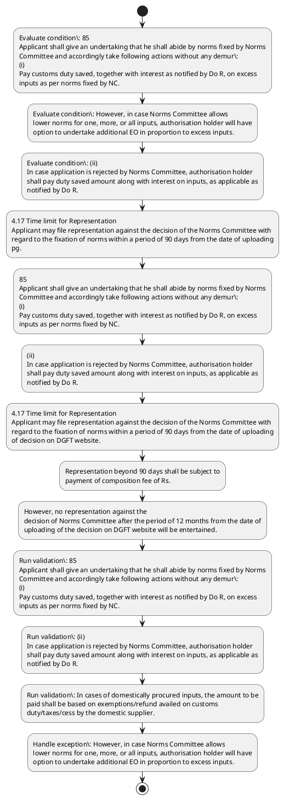

# Chapter 4 / Section 4.17: Time limit for Representation

**Chapter Title:** Duty Exemption / Remission Schemes

**Pages:** 10, 11

**Purpose:** 4.17 Time limit for Representation
Applicant may file representation against the decision of the Norms Committee with
regard to the fixation of norms within a period of 90 days from the date of uploading
pg.

**Purpose Thanglish:** Indha Time limit for Representation section-la, 4.17 Time limit for Representation
Applicant may file representation against the decision of the Norms Committee with
regard to the fixation of norms within a period of 90 days from the date of uploading
pg.

**Summary:** 4.17 Time limit for Representation
Applicant may file representation against the decision of the Norms Committee with
regard to the fixation of norms within a period of 90 days from the date of uploading
pg. 85
pg. 85
Applicant shall give an undertaking that he shall abide by norms fixed by Norms
Committee and accordingly take following actions without any demur:
(i)
Pay customs duty saved, together with interest as notified by Do R, on excess
inputs as per norms fixed by NC.

**Business Meaning:** Time limit for Representation governs how DGFT business controls should be applied, validated, and enforced.

**Business Explanation:** Time limit for Representation explains the operating rule set that DEKAI should enforce. Key control points include 85
Applicant shall give an undertaking that he shall abide by norms fixed by Norms
Committee and accordingly take following actions without any demur:
(i)
Pay customs duty saved, together with interest as notified by Do R, on excess
inputs as per norms fixed by NC. The section also drives actions such as 4.17 Time limit for Representation
Applicant may file representation against the decision of the Norms Committee with
regard to the fixation of norms within a period of 90 days from the date of uploading
pg..

**Business Explanation Thanglish:** Indha Time limit for Representation section-la, Time limit for Representation explains the operating rule set that DEKAI should enforce. Key control points include 85
Applicant kandippa give an undertaking that he kandippa abide by norms fixed by Norms
Committee and accordingly take following actions without any demur:
(i)
Pay customs duty saved, together with interest as notified by Do R, on excess
inputs as per norms fixed by NC. The section also drives actions such as 4.17 Time limit for Representation
Applicant may file representation against the decision of the Norms Committee with
regard to the fixation of norms within a period of 90 days from the date of uploading
pg..

## Business Logic
- 85
Applicant shall give an undertaking that he shall abide by norms fixed by Norms
Committee and accordingly take following actions without any demur:
(i)
Pay customs duty saved, together with interest as notified by Do R, on excess
inputs as per norms fixed by NC.
- (ii)
In case application is rejected by Norms Committee, authorisation holder
shall pay duty saved amount along with interest on inputs, as applicable as
notified by Do R.
- In cases of domestically procured inputs, the amount to be
paid shall be based on exemptions/refund availed on customs
duty/taxes/cess by the domestic supplier.
- (iii)
Applicant shall deposit amount as per paragraph 4.49(a)(ii) of HBP in case
the inputs were not freely importable.
- Representation beyond 90 days shall be subject to
payment of composition fee of Rs.

## Business Rules
- rule_id=CH4-SEC4_17-R001, rule_description=85
Applicant shall give an undertaking that he shall abide by norms fixed by Norms
Committee and accordingly take following actions without any demur:
(i)
Pay customs duty saved, together with interest as notified by Do R, on excess
inputs as per norms fixed by NC., trigger=Time limit for Representation, condition=85
Applicant shall give an undertaking that he shall abide by norms fixed by Norms
Committee and accordingly take following actions without any demur:
(i)
Pay customs duty saved, together with interest as notified by Do R, on excess
inputs as per norms fixed by NC., validation=85
Applicant shall give an undertaking that he shall abide by norms fixed by Norms
Committee and accordingly take following actions without any demur:
(i)
Pay customs duty saved, together with interest as notified by Do R, on excess
inputs as per norms fixed by NC., action=4.17 Time limit for Representation
Applicant may file representation against the decision of the Norms Committee with
regard to the fixation of norms within a period of 90 days from the date of uploading
pg., exception=However, in case Norms Committee allows
lower norms for one, more, or all inputs, authorisation holder will have
option to undertake additional EO in proportion to excess inputs., output=DEKAI should produce a compliance decision for 4.17 - Time limit for Representation.
- rule_id=CH4-SEC4_17-R002, rule_description=(ii)
In case application is rejected by Norms Committee, authorisation holder
shall pay duty saved amount along with interest on inputs, as applicable as
notified by Do R., trigger=Time limit for Representation, condition=However, in case Norms Committee allows
lower norms for one, more, or all inputs, authorisation holder will have
option to undertake additional EO in proportion to excess inputs., validation=(ii)
In case application is rejected by Norms Committee, authorisation holder
shall pay duty saved amount along with interest on inputs, as applicable as
notified by Do R., action=85
Applicant shall give an undertaking that he shall abide by norms fixed by Norms
Committee and accordingly take following actions without any demur:
(i)
Pay customs duty saved, together with interest as notified by Do R, on excess
inputs as per norms fixed by NC., exception=In cases of domestically procured inputs, the amount to be
paid shall be based on exemptions/refund availed on customs
duty/taxes/cess by the domestic supplier., output=DEKAI should produce a compliance decision for 4.17 - Time limit for Representation.
- rule_id=CH4-SEC4_17-R003, rule_description=In cases of domestically procured inputs, the amount to be
paid shall be based on exemptions/refund availed on customs
duty/taxes/cess by the domestic supplier., trigger=Time limit for Representation, condition=(ii)
In case application is rejected by Norms Committee, authorisation holder
shall pay duty saved amount along with interest on inputs, as applicable as
notified by Do R., validation=In cases of domestically procured inputs, the amount to be
paid shall be based on exemptions/refund availed on customs
duty/taxes/cess by the domestic supplier., action=(ii)
In case application is rejected by Norms Committee, authorisation holder
shall pay duty saved amount along with interest on inputs, as applicable as
notified by Do R., exception=However, no representation against the
decision of Norms Committee after the period of 12 months from the date of
uploading of the decision on DGFT website will be entertained., output=DEKAI should produce a compliance decision for 4.17 - Time limit for Representation.
- rule_id=CH4-SEC4_17-R004, rule_description=(iii)
Applicant shall deposit amount as per paragraph 4.49(a)(ii) of HBP in case
the inputs were not freely importable., trigger=Time limit for Representation, condition=In cases of domestically procured inputs, the amount to be
paid shall be based on exemptions/refund availed on customs
duty/taxes/cess by the domestic supplier., validation=(iii)
Applicant shall deposit amount as per paragraph 4.49(a)(ii) of HBP in case
the inputs were not freely importable., action=4.17 Time limit for Representation
Applicant may file representation against the decision of the Norms Committee with
regard to the fixation of norms within a period of 90 days from the date of uploading
of decision on DGFT website., exception=However, no representation against the
decision of Norms Committee after the period of 12 months from the date of
uploading of the decision on DGFT website will be entertained., output=DEKAI should produce a compliance decision for 4.17 - Time limit for Representation.
- rule_id=CH4-SEC4_17-R005, rule_description=Representation beyond 90 days shall be subject to
payment of composition fee of Rs., trigger=Time limit for Representation, condition=(iii)
Applicant shall deposit amount as per paragraph 4.49(a)(ii) of HBP in case
the inputs were not freely importable., validation=Representation beyond 90 days shall be subject to
payment of composition fee of Rs., action=Representation beyond 90 days shall be subject to
payment of composition fee of Rs., exception=However, no representation against the
decision of Norms Committee after the period of 12 months from the date of
uploading of the decision on DGFT website will be entertained., output=DEKAI should produce a compliance decision for 4.17 - Time limit for Representation.

## Conditions
- 85
Applicant shall give an undertaking that he shall abide by norms fixed by Norms
Committee and accordingly take following actions without any demur:
(i)
Pay customs duty saved, together with interest as notified by Do R, on excess
inputs as per norms fixed by NC.
- However, in case Norms Committee allows
lower norms for one, more, or all inputs, authorisation holder will have
option to undertake additional EO in proportion to excess inputs.
- (ii)
In case application is rejected by Norms Committee, authorisation holder
shall pay duty saved amount along with interest on inputs, as applicable as
notified by Do R.
- In cases of domestically procured inputs, the amount to be
paid shall be based on exemptions/refund availed on customs
duty/taxes/cess by the domestic supplier.
- (iii)
Applicant shall deposit amount as per paragraph 4.49(a)(ii) of HBP in case
the inputs were not freely importable.
- Representation beyond 90 days shall be subject to
payment of composition fee of Rs.
- However, no representation against the
decision of Norms Committee after the period of 12 months from the date of
uploading of the decision on DGFT website will be entertained.

## Condition Logic
- id=4.4.17.1, if=85
Applicant shall give an undertaking that he shall abide by norms fixed by Norms
Committee and accordingly take following actions without any demur:
(i)
Pay customs duty saved, together with interest as notified by Do R, on excess
inputs as per norms fixed by NC., then=4.17 Time limit for Representation
Applicant may file representation against the decision of the Norms Committee with
regard to the fixation of norms within a period of 90 days from the date of uploading
pg., source=85
Applicant shall give an undertaking that he shall abide by norms fixed by Norms
Committee and accordingly take following actions without any demur:
(i)
Pay customs duty saved, together with interest as notified by Do R, on excess
inputs as per norms fixed by NC.
- id=4.4.17.2, if=However, in case Norms Committee allows
lower norms for one, more, or all inputs, authorisation holder will have
option to undertake additional EO in proportion to excess inputs., then=4.17 Time limit for Representation
Applicant may file representation against the decision of the Norms Committee with
regard to the fixation of norms within a period of 90 days from the date of uploading
pg., source=However, in case Norms Committee allows
lower norms for one, more, or all inputs, authorisation holder will have
option to undertake additional EO in proportion to excess inputs.
- id=4.4.17.3, if=(ii)
In case application is rejected by Norms Committee, authorisation holder
shall pay duty saved amount along with interest on inputs, as applicable as
notified by Do R., then=4.17 Time limit for Representation
Applicant may file representation against the decision of the Norms Committee with
regard to the fixation of norms within a period of 90 days from the date of uploading
pg., source=(ii)
In case application is rejected by Norms Committee, authorisation holder
shall pay duty saved amount along with interest on inputs, as applicable as
notified by Do R.
- id=4.4.17.4, if=In cases of domestically procured inputs, the amount to be
paid shall be based on exemptions/refund availed on customs
duty/taxes/cess by the domestic supplier., then=4.17 Time limit for Representation
Applicant may file representation against the decision of the Norms Committee with
regard to the fixation of norms within a period of 90 days from the date of uploading
pg., source=In cases of domestically procured inputs, the amount to be
paid shall be based on exemptions/refund availed on customs
duty/taxes/cess by the domestic supplier.
- id=4.4.17.5, if=(iii)
Applicant shall deposit amount as per paragraph 4.49(a)(ii) of HBP in case
the inputs were not freely importable., then=4.17 Time limit for Representation
Applicant may file representation against the decision of the Norms Committee with
regard to the fixation of norms within a period of 90 days from the date of uploading
pg., source=(iii)
Applicant shall deposit amount as per paragraph 4.49(a)(ii) of HBP in case
the inputs were not freely importable.
- id=4.4.17.6, if=Representation beyond 90 days shall be subject to
payment of composition fee of Rs., then=4.17 Time limit for Representation
Applicant may file representation against the decision of the Norms Committee with
regard to the fixation of norms within a period of 90 days from the date of uploading
pg., source=Representation beyond 90 days shall be subject to
payment of composition fee of Rs.
- id=4.4.17.7, if=However, no representation against the
decision of Norms Committee after the period of 12 months from the date of
uploading of the decision on DGFT website will be entertained., then=4.17 Time limit for Representation
Applicant may file representation against the decision of the Norms Committee with
regard to the fixation of norms within a period of 90 days from the date of uploading
pg., source=However, no representation against the
decision of Norms Committee after the period of 12 months from the date of
uploading of the decision on DGFT website will be entertained.

## Validations
- 85
Applicant shall give an undertaking that he shall abide by norms fixed by Norms
Committee and accordingly take following actions without any demur:
(i)
Pay customs duty saved, together with interest as notified by Do R, on excess
inputs as per norms fixed by NC.
- (ii)
In case application is rejected by Norms Committee, authorisation holder
shall pay duty saved amount along with interest on inputs, as applicable as
notified by Do R.
- In cases of domestically procured inputs, the amount to be
paid shall be based on exemptions/refund availed on customs
duty/taxes/cess by the domestic supplier.
- (iii)
Applicant shall deposit amount as per paragraph 4.49(a)(ii) of HBP in case
the inputs were not freely importable.
- Representation beyond 90 days shall be subject to
payment of composition fee of Rs.

## Exceptions
- However, in case Norms Committee allows
lower norms for one, more, or all inputs, authorisation holder will have
option to undertake additional EO in proportion to excess inputs.
- In cases of domestically procured inputs, the amount to be
paid shall be based on exemptions/refund availed on customs
duty/taxes/cess by the domestic supplier.
- However, no representation against the
decision of Norms Committee after the period of 12 months from the date of
uploading of the decision on DGFT website will be entertained.

## Dependencies
- 4.49

## Authorities
- Applicant may file representation against the decision of the Norms Committee
- customs
- Norms Committee
- In case application is rejected by Norms Committee
- DGFT

## Required Documents
- 85
Applicant shall give an undertaking that he shall abide by norms fixed by Norms
Committee and accordingly take following actions without any demur:
(i)
Pay customs duty saved, together with interest as notified by Do R, on excess
inputs as per norms fixed by NC.
- (ii)
In case application is rejected by Norms Committee, authorisation holder
shall pay duty saved amount along with interest on inputs, as applicable as
notified by Do R.

## Timelines
- 4.17 Time limit for Representation
Applicant may file representation against the decision of the Norms Committee with
regard to the fixation of norms within a period of 90 days from the date of uploading
pg.
- 4.17 Time limit for Representation
Applicant may file representation against the decision of the Norms Committee with
regard to the fixation of norms within a period of 90 days from the date of uploading
of decision on DGFT website.
- Representation beyond 90 days shall be subject to
payment of composition fee of Rs.
- However, no representation against the
decision of Norms Committee after the period of 12 months from the date of
uploading of the decision on DGFT website will be entertained.

## Actions
- 4.17 Time limit for Representation
Applicant may file representation against the decision of the Norms Committee with
regard to the fixation of norms within a period of 90 days from the date of uploading
pg.
- 85
Applicant shall give an undertaking that he shall abide by norms fixed by Norms
Committee and accordingly take following actions without any demur:
(i)
Pay customs duty saved, together with interest as notified by Do R, on excess
inputs as per norms fixed by NC.
- (ii)
In case application is rejected by Norms Committee, authorisation holder
shall pay duty saved amount along with interest on inputs, as applicable as
notified by Do R.
- 4.17 Time limit for Representation
Applicant may file representation against the decision of the Norms Committee with
regard to the fixation of norms within a period of 90 days from the date of uploading
of decision on DGFT website.
- Representation beyond 90 days shall be subject to
payment of composition fee of Rs.
- However, no representation against the
decision of Norms Committee after the period of 12 months from the date of
uploading of the decision on DGFT website will be entertained.

## Workflow
- Evaluate condition: 85
Applicant shall give an undertaking that he shall abide by norms fixed by Norms
Committee and accordingly take following actions without any demur:
(i)
Pay customs duty saved, together with interest as notified by Do R, on excess
inputs as per norms fixed by NC.
- Evaluate condition: However, in case Norms Committee allows
lower norms for one, more, or all inputs, authorisation holder will have
option to undertake additional EO in proportion to excess inputs.
- Evaluate condition: (ii)
In case application is rejected by Norms Committee, authorisation holder
shall pay duty saved amount along with interest on inputs, as applicable as
notified by Do R.
- 4.17 Time limit for Representation
Applicant may file representation against the decision of the Norms Committee with
regard to the fixation of norms within a period of 90 days from the date of uploading
pg.
- 85
Applicant shall give an undertaking that he shall abide by norms fixed by Norms
Committee and accordingly take following actions without any demur:
(i)
Pay customs duty saved, together with interest as notified by Do R, on excess
inputs as per norms fixed by NC.
- (ii)
In case application is rejected by Norms Committee, authorisation holder
shall pay duty saved amount along with interest on inputs, as applicable as
notified by Do R.
- 4.17 Time limit for Representation
Applicant may file representation against the decision of the Norms Committee with
regard to the fixation of norms within a period of 90 days from the date of uploading
of decision on DGFT website.
- Representation beyond 90 days shall be subject to
payment of composition fee of Rs.
- However, no representation against the
decision of Norms Committee after the period of 12 months from the date of
uploading of the decision on DGFT website will be entertained.
- Run validation: 85
Applicant shall give an undertaking that he shall abide by norms fixed by Norms
Committee and accordingly take following actions without any demur:
(i)
Pay customs duty saved, together with interest as notified by Do R, on excess
inputs as per norms fixed by NC.
- Run validation: (ii)
In case application is rejected by Norms Committee, authorisation holder
shall pay duty saved amount along with interest on inputs, as applicable as
notified by Do R.
- Run validation: In cases of domestically procured inputs, the amount to be
paid shall be based on exemptions/refund availed on customs
duty/taxes/cess by the domestic supplier.
- Handle exception: However, in case Norms Committee allows
lower norms for one, more, or all inputs, authorisation holder will have
option to undertake additional EO in proportion to excess inputs.

## Workflow ASCII
```text
Time limit for Representation
Evaluate condition: 85
Applicant shall give an undertaking that he shall abide by norms fixed by Norms
Committee and accordingly take following actions without any demur:
(i)
Pay customs duty saved, together with interest as notified by Do R, on excess
inputs as per norms fixed by NC.
   |
   v
Evaluate condition: However, in case Norms Committee allows
lower norms for one, more, or all inputs, authorisation holder will have
option to undertake additional EO in proportion to excess inputs.
   |
   v
Evaluate condition: (ii)
In case application is rejected by Norms Committee, authorisation holder
shall pay duty saved amount along with interest on inputs, as applicable as
notified by Do R.
   |
   v
4.17 Time limit for Representation
Applicant may file representation against the decision of the Norms Committee with
regard to the fixation of norms within a period of 90 days from the date of uploading
pg.
   |
   v
85
Applicant shall give an undertaking that he shall abide by norms fixed by Norms
Committee and accordingly take following actions without any demur:
(i)
Pay customs duty saved, together with interest as notified by Do R, on excess
inputs as per norms fixed by NC.
   |
   v
(ii)
In case application is rejected by Norms Committee, authorisation holder
shall pay duty saved amount along with interest on inputs, as applicable as
notified by Do R.
   |
   v
4.17 Time limit for Representation
Applicant may file representation against the decision of the Norms Committee with
regard to the fixation of norms within a period of 90 days from the date of uploading
of decision on DGFT website.
   |
   v
Representation beyond 90 days shall be subject to
payment of composition fee of Rs.
   |
   v
However, no representation against the
decision of Norms Committee after the period of 12 months from the date of
uploading of the decision on DGFT website will be entertained.
   |
   v
Run validation: 85
Applicant shall give an undertaking that he shall abide by norms fixed by Norms
Committee and accordingly take following actions without any demur:
(i)
Pay customs duty saved, together with interest as notified by Do R, on excess
inputs as per norms fixed by NC.
   |
   v
Run validation: (ii)
In case application is rejected by Norms Committee, authorisation holder
shall pay duty saved amount along with interest on inputs, as applicable as
notified by Do R.
   |
   v
Run validation: In cases of domestically procured inputs, the amount to be
paid shall be based on exemptions/refund availed on customs
duty/taxes/cess by the domestic supplier.
   |
   v
Handle exception: However, in case Norms Committee allows
lower norms for one, more, or all inputs, authorisation holder will have
option to undertake additional EO in proportion to excess inputs.
```

## Decision Tree
- IF 85
Applicant shall give an undertaking that he shall abide by norms fixed by Norms
Committee and accordingly take following actions without any demur:
(i)
Pay customs duty saved, together with interest as notified by Do R, on excess
inputs as per norms fixed by NC. THEN 4.17 Time limit for Representation
Applicant may file representation against the decision of the Norms Committee with
regard to the fixation of norms within a period of 90 days from the date of uploading
pg.
- IF However, in case Norms Committee allows
lower norms for one, more, or all inputs, authorisation holder will have
option to undertake additional EO in proportion to excess inputs. THEN 4.17 Time limit for Representation
Applicant may file representation against the decision of the Norms Committee with
regard to the fixation of norms within a period of 90 days from the date of uploading
pg.
- IF (ii)
In case application is rejected by Norms Committee, authorisation holder
shall pay duty saved amount along with interest on inputs, as applicable as
notified by Do R. THEN 4.17 Time limit for Representation
Applicant may file representation against the decision of the Norms Committee with
regard to the fixation of norms within a period of 90 days from the date of uploading
pg.
- IF In cases of domestically procured inputs, the amount to be
paid shall be based on exemptions/refund availed on customs
duty/taxes/cess by the domestic supplier. THEN 4.17 Time limit for Representation
Applicant may file representation against the decision of the Norms Committee with
regard to the fixation of norms within a period of 90 days from the date of uploading
pg.
- IF (iii)
Applicant shall deposit amount as per paragraph 4.49(a)(ii) of HBP in case
the inputs were not freely importable. THEN 4.17 Time limit for Representation
Applicant may file representation against the decision of the Norms Committee with
regard to the fixation of norms within a period of 90 days from the date of uploading
pg.
- IF exception applies (However, in case Norms Committee allows
lower norms for one, more, or all inputs, authorisation holder will have
option to undertake additional EO in proportion to excess inputs.) THEN route to manual review
- IF exception applies (In cases of domestically procured inputs, the amount to be
paid shall be based on exemptions/refund availed on customs
duty/taxes/cess by the domestic supplier.) THEN route to manual review
- IF exception applies (However, no representation against the
decision of Norms Committee after the period of 12 months from the date of
uploading of the decision on DGFT website will be entertained.) THEN route to manual review

## Decision Tree ASCII
```text
Time limit for Representation Decision
IF 85
Applicant shall give an undertaking that he shall abide by norms fixed by Norms
Committee and accordingly take following actions without any demur:
(i)
Pay customs duty saved, together with interest as notified by Do R, on excess
inputs as per norms fixed by NC. THEN 4.17 Time limit for Representation
Applicant may file representation against the decision of the Norms Committee with
regard to the fixation of norms within a period of 90 days from the date of uploading
pg.
   |
   v
IF However, in case Norms Committee allows
lower norms for one, more, or all inputs, authorisation holder will have
option to undertake additional EO in proportion to excess inputs. THEN 4.17 Time limit for Representation
Applicant may file representation against the decision of the Norms Committee with
regard to the fixation of norms within a period of 90 days from the date of uploading
pg.
   |
   v
IF (ii)
In case application is rejected by Norms Committee, authorisation holder
shall pay duty saved amount along with interest on inputs, as applicable as
notified by Do R. THEN 4.17 Time limit for Representation
Applicant may file representation against the decision of the Norms Committee with
regard to the fixation of norms within a period of 90 days from the date of uploading
pg.
   |
   v
IF In cases of domestically procured inputs, the amount to be
paid shall be based on exemptions/refund availed on customs
duty/taxes/cess by the domestic supplier. THEN 4.17 Time limit for Representation
Applicant may file representation against the decision of the Norms Committee with
regard to the fixation of norms within a period of 90 days from the date of uploading
pg.
   |
   v
IF (iii)
Applicant shall deposit amount as per paragraph 4.49(a)(ii) of HBP in case
the inputs were not freely importable. THEN 4.17 Time limit for Representation
Applicant may file representation against the decision of the Norms Committee with
regard to the fixation of norms within a period of 90 days from the date of uploading
pg.
   |
   v
IF exception applies (However, in case Norms Committee allows
lower norms for one, more, or all inputs, authorisation holder will have
option to undertake additional EO in proportion to excess inputs.) THEN route to manual review
   |
   v
IF exception applies (In cases of domestically procured inputs, the amount to be
paid shall be based on exemptions/refund availed on customs
duty/taxes/cess by the domestic supplier.) THEN route to manual review
   |
   v
IF exception applies (However, no representation against the
decision of Norms Committee after the period of 12 months from the date of
uploading of the decision on DGFT website will be entertained.) THEN route to manual review
```

## Examples
- User asks to process Time limit for Representation; the platform checks conditions, validations, and documents before action.

**Real-world Example:** Example: an importer or exporter invokes Time limit for Representation, submits 85
Applicant shall give an undertaking that he shall abide by norms fixed by Norms
Committee and accordingly take following actions without any demur:
(i)
Pay customs duty saved, together with interest as notified by Do R, on excess
inputs as per norms fixed by NC., (ii)
In case application is rejected by Norms Committee, authorisation holder
shall pay duty saved amount along with interest on inputs, as applicable as
notified by Do R., and DEKAI uses the extracted rules to 4.17 time limit for representation
applicant may file representation against the decision of the norms committee with
regard to the fixation of norms within a period of 90 days from the date of uploading
pg..

**Real-world Example Thanglish:** Indha Time limit for Representation section-la, Example: an importer or exporter invokes Time limit for Representation, submits 85
Applicant kandippa give an undertaking that he kandippa abide by norms fixed by Norms
Committee and accordingly take following actions without any demur:
(i)
Pay customs duty saved, together with interest as notified by Do R, on excess
inputs as per norms fixed by NC., (ii)
In case application is rejected by Norms Committee, authorisation holder
kandippa pay duty saved amount along with interest on inputs, as applicable as
notified by Do R., and DEKAI uses the extracted rules to 4.17 time limit for representation
applicant may file representation against the decision of the norms committee with
regard to the fixation of norms within a period of 90 days from the date of uploading
pg..

## AI Rules
- IF detected context matches section rule THEN enforce: 85
Applicant shall give an undertaking that he shall abide by norms fixed by Norms
Committee and accordingly take following actions without any demur:
(i)
Pay customs duty saved, together with interest as notified by Do R, on excess
inputs as per norms fixed by NC.
- IF detected context matches section rule THEN enforce: (ii)
In case application is rejected by Norms Committee, authorisation holder
shall pay duty saved amount along with interest on inputs, as applicable as
notified by Do R.
- IF detected context matches section rule THEN enforce: In cases of domestically procured inputs, the amount to be
paid shall be based on exemptions/refund availed on customs
duty/taxes/cess by the domestic supplier.
- IF detected context matches section rule THEN enforce: (iii)
Applicant shall deposit amount as per paragraph 4.49(a)(ii) of HBP in case
the inputs were not freely importable.
- IF detected context matches section rule THEN enforce: Representation beyond 90 days shall be subject to
payment of composition fee of Rs.
- IF validations pass THEN recommend action: 4.17 Time limit for Representation
Applicant may file representation against the decision of the Norms Committee with
regard to the fixation of norms within a period of 90 days from the date of uploading
pg.

## Database Fields
- name=section_code, type=string, required=True, source=parsed_section_heading
- name=section_title, type=string, required=True, source=parsed_section_heading
- name=for_flag, type=boolean, required=False, source=keyword:for
- name=may_flag, type=boolean, required=False, source=keyword:may
- name=the_flag, type=boolean, required=False, source=keyword:the
- name=and_flag, type=boolean, required=False, source=keyword:and
- name=any_flag, type=boolean, required=False, source=keyword:any
- name=pay_flag, type=boolean, required=False, source=keyword:Pay
- name=per_flag, type=boolean, required=False, source=keyword:per
- name=one_flag, type=boolean, required=False, source=keyword:one
- name=document_1_submitted, type=boolean, required=True, source=85
Applicant shall give an undertaking that he shall abide by norms fixed by Norms
Committee and accordingly take following actions without any demur:
(i)
Pay customs duty saved, together with interest as notified by Do R, on excess
inputs as per norms fixed by NC.
- name=document_2_submitted, type=boolean, required=True, source=(ii)
In case application is rejected by Norms Committee, authorisation holder
shall pay duty saved amount along with interest on inputs, as applicable as
notified by Do R.

## API Requirements
- method=GET, path=/api/dgft/sections/4.17, purpose=Retrieve knowledge payload for section 4.17, query_params=['include=workflow,decision_tree,validations'], response_fields=['section', 'title', 'summary', 'conditions', 'validations', 'exceptions', 'workflow', 'decision_tree']
- method=POST, path=/api/dgft/Time-limit-for-Representation/validate, purpose=Validate inputs and documents for Time limit for Representation, request_fields=['section_code', 'section_title', 'document_1_submitted', 'document_2_submitted'], response_fields=['status', 'errors', 'warnings', 'next_actions']
- method=POST, path=/api/dgft/Time-limit-for-Representation/execute, purpose=Trigger business action for 4.17 Time limit for Representation
Applicant may file representation against the decision of the Norms Committee with
regard to the fixation of norms within a period of 90 days from the date of uploading
pg., request_fields=['section_code', 'section_title', 'document_1_submitted', 'document_2_submitted'], response_fields=['reference_id', 'status', 'authority', 'timeline']

## UI Screens
- screen_id=Time_limit_for_Representation_overview, name=Time limit for Representation Overview, purpose=Show section summary, authority, timeline, and eligibility cues., widgets=['summary_card', 'conditions_table', 'authority_badges', 'timeline_panel']
- screen_id=Time_limit_for_Representation_submission, name=Time limit for Representation Submission, purpose=Capture applicant data and supporting documents., widgets=['dynamic_form', 'document_uploader', 'validation_panel', 'next_action_footer'], fields=['section_code', 'section_title', 'for_flag', 'may_flag', 'the_flag', 'and_flag', 'any_flag', 'pay_flag']
- screen_id=Time_limit_for_Representation_exceptions, name=Time limit for Representation Exception Review, purpose=Explain exception handling and manual review triggers., widgets=['exception_banner', 'decision_tree', 'case_notes']

## Error Messages
- Validation failed because the section requirements were not fully met.

## FAQ
- question_en=What is the purpose of section 4.17?, answer_en=Time limit for Representation explains the operating rule set that DEKAI should enforce. Key control points include 85
Applicant shall give an undertaking that he shall abide by norms fixed by Norms
Committee and accordingly take following actions without any demur:
(i)
Pay customs duty saved, together with interest as notified by Do R, on excess
inputs as per norms fixed by NC. The section also drives actions such as 4.17 Time limit for Representation
Applicant may file representation against the decision of the Norms Committee with
regard to the fixation of norms within a period of 90 days from the date of uploading
pg.., question_thanglish=Indha Time limit for Representation section-la, What is the purpose of section 4.17?, answer_thanglish=Indha Time limit for Representation section-la, Time limit for Representation explains the operating rule set that DEKAI should enforce. Key control points include 85
Applicant kandippa give an undertaking that he kandippa abide by norms fixed by Norms
Committee and accordingly take following actions without any demur:
(i)
Pay customs duty saved, together with interest as notified by Do R, on excess
inputs as per norms fixed by NC. The section also drives actions such as 4.17 Time limit for Representation
Applicant may file representation against the decision of the Norms Committee with
regard to the fixation of norms within a period of 90 days from the date of uploading
pg..
- question_en=What documents are required under Time limit for Representation?, answer_en=85
Applicant shall give an undertaking that he shall abide by norms fixed by Norms
Committee and accordingly take following actions without any demur:
(i)
Pay customs duty saved, together with interest as notified by Do R, on excess
inputs as per norms fixed by NC., (ii)
In case application is rejected by Norms Committee, authorisation holder
shall pay duty saved amount along with interest on inputs, as applicable as
notified by Do R., question_thanglish=Indha Time limit for Representation section-la, What documents are required under Time limit for Representation?, answer_thanglish=Indha Time limit for Representation section-la, 85
Applicant kandippa give an undertaking that he kandippa abide by norms fixed by Norms
Committee and accordingly take following actions without any demur:
(i)
Pay customs duty saved, together with interest as notified by Do R, on excess
inputs as per norms fixed by NC., (ii)
In case application is rejected by Norms Committee, authorisation holder
kandippa pay duty saved amount along with interest on inputs, as applicable as
notified by Do R.
- question_en=Which authority handles Time limit for Representation?, answer_en=Applicant may file representation against the decision of the Norms Committee, customs, Norms Committee, In case application is rejected by Norms Committee, DGFT, question_thanglish=Indha Time limit for Representation section-la, Which authority handles Time limit for Representation?, answer_thanglish=Indha Time limit for Representation section-la, Applicant may file representation against the decision of the Norms Committee, customs, Norms Committee, In case application is rejected by Norms Committee, DGFT

## Questions Users May Ask
- What does Time limit for Representation require?
- Which documents are needed for Time limit for Representation?
- How does DEKAI validate Time limit for Representation requests?
- What action should be taken for Time limit for Representation?

## Expected AI Answers
- Time limit for Representation requires the platform to interpret the section text, apply the extracted business rules, and present the correct next action.
- Required documents are inferred from the section text: 85
Applicant shall give an undertaking that he shall abide by norms fixed by Norms
Committee and accordingly take following actions without any demur:
(i)
Pay customs duty saved, together with interest as notified by Do R, on excess
inputs as per norms fixed by NC., (ii)
In case application is rejected by Norms Committee, authorisation holder
shall pay duty saved amount along with interest on inputs, as applicable as
notified by Do R.
- DEKAI validates Time limit for Representation by checking conditions, required documents, authority references, and exception clauses before recommending an outcome.
- The primary extracted action is: 4.17 Time limit for Representation
Applicant may file representation against the decision of the Norms Committee with
regard to the fixation of norms within a period of 90 days from the date of uploading
pg.

## AI Q&A Examples
- question_en=User asks: How do I comply with Time limit for Representation?, answer_en=AI answers: DEKAI should evaluate section 4.17, apply the extracted rules, and guide the user through Evaluate condition: 85
Applicant shall give an undertaking that he shall abide by norms fixed by Norms
Committee and accordingly take following actions without any demur:
(i)
Pay customs duty saved, together with interest as notified by Do R, on excess
inputs as per norms fixed by NC.., question_thanglish=Indha Time limit for Representation section-la, User asks: How do I comply with Time limit for Representation?, answer_thanglish=Indha Time limit for Representation section-la, AI answers: DEKAI should evaluate section 4.17, apply the extracted rules, and guide the user through Evaluate condition: 85
Applicant kandippa give an undertaking that he kandippa abide by norms fixed by Norms
Committee and accordingly take following actions without any demur:
(i)
Pay customs duty saved, together with interest as notified by Do R, on excess
inputs as per norms fixed by NC..
- question_en=User asks: Which validations apply to Time limit for Representation?, answer_en=AI answers: Applicable validations are 85
Applicant shall give an undertaking that he shall abide by norms fixed by Norms
Committee and accordingly take following actions without any demur:
(i)
Pay customs duty saved, together with interest as notified by Do R, on excess
inputs as per norms fixed by NC., (ii)
In case application is rejected by Norms Committee, authorisation holder
shall pay duty saved amount along with interest on inputs, as applicable as
notified by Do R., In cases of domestically procured inputs, the amount to be
paid shall be based on exemptions/refund availed on customs
duty/taxes/cess by the domestic supplier., question_thanglish=Indha Time limit for Representation section-la, User asks: Which validations apply to Time limit for Representation?, answer_thanglish=Indha Time limit for Representation section-la, AI answers: Applicable validations are 85
Applicant kandippa give an undertaking that he kandippa abide by norms fixed by Norms
Committee and accordingly take following actions without any demur:
(i)
Pay customs duty saved, together with interest as notified by Do R, on excess
inputs as per norms fixed by NC., (ii)
In case application is rejected by Norms Committee, authorisation holder
kandippa pay duty saved amount along with interest on inputs, as applicable as
notified by Do R., In cases of domestically procured inputs, the amount to be
paid kandippa be based on exemptions/refund availed on customs
duty/taxes/cess by the domestic supplier.

## DEKAI AI Implementation Notes
- Capture chapter 4, section 4.17, title, and page references as immutable knowledge metadata.
- Bind validations for Time limit for Representation into a rule engine keyed by the rule IDs extracted for this section.
- Expose document upload controls for: 85
Applicant shall give an undertaking that he shall abide by norms fixed by Norms
Committee and accordingly take following actions without any demur:
(i)
Pay customs duty saved, together with interest as notified by Do R, on excess
inputs as per norms fixed by NC., (ii)
In case application is rejected by Norms Committee, authorisation holder
shall pay duty saved amount along with interest on inputs, as applicable as
notified by Do R..
- Route escalations or approvals to: Applicant may file representation against the decision of the Norms Committee, customs, Norms Committee, In case application is rejected by Norms Committee.
- Trigger manual review when exception clauses are detected.
- Show contextual links to related sections: 4.49.

## DEKAI AI Implementation Notes Thanglish
- Indha Time limit for Representation section-la, Capture chapter 4, section 4.17, title, and page references as immutable knowledge metadata.
- Indha Time limit for Representation section-la, Bind validations for Time limit for Representation into a rule engine keyed by the rule IDs extracted for this section.
- Indha Time limit for Representation section-la, Expose document upload controls for: 85
Applicant kandippa give an undertaking that he kandippa abide by norms fixed by Norms
Committee and accordingly take following actions without any demur:
(i)
Pay customs duty saved, together with interest as notified by Do R, on excess
inputs as per norms fixed by NC., (ii)
In case application is rejected by Norms Committee, authorisation holder
kandippa pay duty saved amount along with interest on inputs, as applicable as
notified by Do R..
- Indha Time limit for Representation section-la, Route escalations or approvals to: Applicant may file representation against the decision of the Norms Committee, customs, Norms Committee, In case application is rejected by Norms Committee.
- Indha Time limit for Representation section-la, Trigger manual review when exception clauses are detected.
- Indha Time limit for Representation section-la, Show contextual links to related sections: 4.49.

## AI Metadata
- Keywords: for, may, the, and, any, Pay, per, one, all, iii, HBP, not, fee, Time, file, with, days, from, date, give
- Search Keywords: for, may, the, and, any, Pay, per, one, all, iii, HBP, not, fee, Time, file, with, days, from, date, give
- Intent: Support Time limit for Representation processing and compliance validation.
- Tags: 4.17, Time limit for Representation, business-rule, document-driven, dgft
- Related Sections: 4.49
- Related Chapters: 
- Related Rules: 85
Applicant shall give an undertaking that he shall abide by norms fixed by Norms
Committee and accordingly take following actions without any demur:
(i)
Pay customs duty saved, together with interest as notified by Do R, on excess
inputs as per norms fixed by NC., (ii)
In case application is rejected by Norms Committee, authorisation holder
shall pay duty saved amount along with interest on inputs, as applicable as
notified by Do R., In cases of domestically procured inputs, the amount to be
paid shall be based on exemptions/refund availed on customs
duty/taxes/cess by the domestic supplier., (iii)
Applicant shall deposit amount as per paragraph 4.49(a)(ii) of HBP in case
the inputs were not freely importable., Representation beyond 90 days shall be subject to
payment of composition fee of Rs.

## Mermaid

```mermaid
flowchart TD
    S1["Evaluate condition: 85
Applicant shall give an undertaking that he shall abide by norms fixed by Norms
Committee and accordingly take following actions without any demur:
(i)
Pay customs duty saved, together with interest as notified by Do R, on excess
inputs as per norms fixed by NC."]
    S2["Evaluate condition: However, in case Norms Committee allows
lower norms for one, more, or all inputs, authorisation holder will have
option to undertake additional EO in proportion to excess inputs."]
    S1 --> S2
    S3["Evaluate condition: (ii)
In case application is rejected by Norms Committee, authorisation holder
shall pay duty saved amount along with interest on inputs, as applicable as
notified by Do R."]
    S2 --> S3
    S4["4.17 Time limit for Representation
Applicant may file representation against the decision of the Norms Committee with
regard to the fixation of norms within a period of 90 days from the date of uploading
pg."]
    S3 --> S4
    S5["85
Applicant shall give an undertaking that he shall abide by norms fixed by Norms
Committee and accordingly take following actions without any demur:
(i)
Pay customs duty saved, together with interest as notified by Do R, on excess
inputs as per norms fixed by NC."]
    S4 --> S5
    S6["(ii)
In case application is rejected by Norms Committee, authorisation holder
shall pay duty saved amount along with interest on inputs, as applicable as
notified by Do R."]
    S5 --> S6
    S7["4.17 Time limit for Representation
Applicant may file representation against the decision of the Norms Committee with
regard to the fixation of norms within a period of 90 days from the date of uploading
of decision on DGFT website."]
    S6 --> S7
    S8["Representation beyond 90 days shall be subject to
payment of composition fee of Rs."]
    S7 --> S8
    S9["However, no representation against the
decision of Norms Committee after the period of 12 months from the date of
uploading of the decision on DGFT website will be entertained."]
    S8 --> S9
    S10["Run validation: 85
Applicant shall give an undertaking that he shall abide by norms fixed by Norms
Committee and accordingly take following actions without any demur:
(i)
Pay customs duty saved, together with interest as notified by Do R, on excess
inputs as per norms fixed by NC."]
    S9 --> S10
    S11["Run validation: (ii)
In case application is rejected by Norms Committee, authorisation holder
shall pay duty saved amount along with interest on inputs, as applicable as
notified by Do R."]
    S10 --> S11
    S12["Run validation: In cases of domestically procured inputs, the amount to be
paid shall be based on exemptions/refund availed on customs
duty/taxes/cess by the domestic supplier."]
    S11 --> S12
    S13["Handle exception: However, in case Norms Committee allows
lower norms for one, more, or all inputs, authorisation holder will have
option to undertake additional EO in proportion to excess inputs."]
    S12 --> S13
```


## PlantUML

