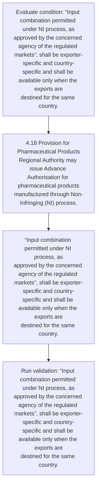
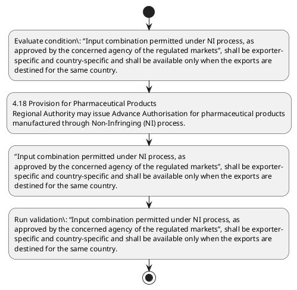

# Chapter 4 / Section 4.18: Provision for Pharmaceutical Products

**Chapter Title:** Duty Exemption / Remission Schemes

**Pages:** 11

**Purpose:** 4.18 Provision for Pharmaceutical Products
Regional Authority may issue Advance Authorisation for pharmaceutical products
manufactured through Non-Infringing (NI) process.

**Purpose Thanglish:** Indha Provision for Pharmaceutical Products section-la, 4.18 Provision for Pharmaceutical Products
Regional authority may issue Advance Authorisation for pharmaceutical products
manufactured through Non-Infringing (NI) process.

**Summary:** 4.18 Provision for Pharmaceutical Products
Regional Authority may issue Advance Authorisation for pharmaceutical products
manufactured through Non-Infringing (NI) process. A manufacturer exporter can
avail the benefit of this provision whether the SION or the adhoc norms (under self-
declared basis in terms of paragraph 4.07 of the Handbook of Procedures) for the
said product is available or not. “Input combination permitted under NI process, as
approved by the concerned agency of the regulated markets”, shall be exporter-
specific and country-specific and shall be available only when the exports are
destined for the same country.

**Business Meaning:** Provision for Pharmaceutical Products governs how DGFT business controls should be applied, validated, and enforced.

**Business Explanation:** Provision for Pharmaceutical Products explains the operating rule set that DEKAI should enforce. Key control points include “Input combination permitted under NI process, as
approved by the concerned agency of the regulated markets”, shall be exporter-
specific and country-specific and shall be available only when the exports are
destined for the same country. The section also drives actions such as 4.18 Provision for Pharmaceutical Products
Regional Authority may issue Advance Authorisation for pharmaceutical products
manufactured through Non-Infringing (NI) process..

**Business Explanation Thanglish:** Indha Provision for Pharmaceutical Products section-la, Provision for Pharmaceutical Products explains the operating rule set that DEKAI should enforce. Key control points include “Input combination permitted under NI process, as
approved by the concerned agency of the regulated markets”, kandippa be exporter-
specific and country-specific and kandippa be available only when the exports are
destined for the same country. The section also drives actions such as 4.18 Provision for Pharmaceutical Products
Regional authority may issue Advance Authorisation for pharmaceutical products
manufactured through Non-Infringing (NI) process..

## Business Logic
- “Input combination permitted under NI process, as
approved by the concerned agency of the regulated markets”, shall be exporter-
specific and country-specific and shall be available only when the exports are
destined for the same country.

## Business Rules
- rule_id=CH4-SEC4_18-R001, rule_description=“Input combination permitted under NI process, as
approved by the concerned agency of the regulated markets”, shall be exporter-
specific and country-specific and shall be available only when the exports are
destined for the same country., trigger=Provision for Pharmaceutical Products, condition=“Input combination permitted under NI process, as
approved by the concerned agency of the regulated markets”, shall be exporter-
specific and country-specific and shall be available only when the exports are
destined for the same country., validation=“Input combination permitted under NI process, as
approved by the concerned agency of the regulated markets”, shall be exporter-
specific and country-specific and shall be available only when the exports are
destined for the same country., action=4.18 Provision for Pharmaceutical Products
Regional Authority may issue Advance Authorisation for pharmaceutical products
manufactured through Non-Infringing (NI) process., exception=No explicit exception found in uploaded documents., output=DEKAI should produce a compliance decision for 4.18 - Provision for Pharmaceutical Products.

## Conditions
- “Input combination permitted under NI process, as
approved by the concerned agency of the regulated markets”, shall be exporter-
specific and country-specific and shall be available only when the exports are
destined for the same country.

## Condition Logic
- id=4.4.18.1, if=“Input combination permitted under NI process, as
approved by the concerned agency of the regulated markets”, shall be exporter-
specific and country-specific and shall be available only when the exports are
destined for the same country., then=4.18 Provision for Pharmaceutical Products
Regional Authority may issue Advance Authorisation for pharmaceutical products
manufactured through Non-Infringing (NI) process., source=“Input combination permitted under NI process, as
approved by the concerned agency of the regulated markets”, shall be exporter-
specific and country-specific and shall be available only when the exports are
destined for the same country.

## Validations
- “Input combination permitted under NI process, as
approved by the concerned agency of the regulated markets”, shall be exporter-
specific and country-specific and shall be available only when the exports are
destined for the same country.

## Exceptions
- None identified

## Dependencies
- 4.07

## Authorities
- Regional Authority

## Required Documents
- None identified

## Timelines
- None identified

## Actions
- 4.18 Provision for Pharmaceutical Products
Regional Authority may issue Advance Authorisation for pharmaceutical products
manufactured through Non-Infringing (NI) process.
- “Input combination permitted under NI process, as
approved by the concerned agency of the regulated markets”, shall be exporter-
specific and country-specific and shall be available only when the exports are
destined for the same country.

## Workflow
- Evaluate condition: “Input combination permitted under NI process, as
approved by the concerned agency of the regulated markets”, shall be exporter-
specific and country-specific and shall be available only when the exports are
destined for the same country.
- 4.18 Provision for Pharmaceutical Products
Regional Authority may issue Advance Authorisation for pharmaceutical products
manufactured through Non-Infringing (NI) process.
- “Input combination permitted under NI process, as
approved by the concerned agency of the regulated markets”, shall be exporter-
specific and country-specific and shall be available only when the exports are
destined for the same country.
- Run validation: “Input combination permitted under NI process, as
approved by the concerned agency of the regulated markets”, shall be exporter-
specific and country-specific and shall be available only when the exports are
destined for the same country.

## Workflow ASCII
```text
Provision for Pharmaceutical Products
Evaluate condition: “Input combination permitted under NI process, as
approved by the concerned agency of the regulated markets”, shall be exporter-
specific and country-specific and shall be available only when the exports are
destined for the same country.
   |
   v
4.18 Provision for Pharmaceutical Products
Regional Authority may issue Advance Authorisation for pharmaceutical products
manufactured through Non-Infringing (NI) process.
   |
   v
“Input combination permitted under NI process, as
approved by the concerned agency of the regulated markets”, shall be exporter-
specific and country-specific and shall be available only when the exports are
destined for the same country.
   |
   v
Run validation: “Input combination permitted under NI process, as
approved by the concerned agency of the regulated markets”, shall be exporter-
specific and country-specific and shall be available only when the exports are
destined for the same country.
```

## Decision Tree
- IF “Input combination permitted under NI process, as
approved by the concerned agency of the regulated markets”, shall be exporter-
specific and country-specific and shall be available only when the exports are
destined for the same country. THEN 4.18 Provision for Pharmaceutical Products
Regional Authority may issue Advance Authorisation for pharmaceutical products
manufactured through Non-Infringing (NI) process.

## Decision Tree ASCII
```text
Provision for Pharmaceutical Products Decision
IF “Input combination permitted under NI process, as
approved by the concerned agency of the regulated markets”, shall be exporter-
specific and country-specific and shall be available only when the exports are
destined for the same country. THEN 4.18 Provision for Pharmaceutical Products
Regional Authority may issue Advance Authorisation for pharmaceutical products
manufactured through Non-Infringing (NI) process.
```

## Examples
- User asks to process Provision for Pharmaceutical Products; the platform checks conditions, validations, and documents before action.

**Real-world Example:** Example: an importer or exporter invokes Provision for Pharmaceutical Products, submits the prescribed DGFT records, and DEKAI uses the extracted rules to 4.18 provision for pharmaceutical products
regional authority may issue advance authorisation for pharmaceutical products
manufactured through non-infringing (ni) process..

**Real-world Example Thanglish:** Indha Provision for Pharmaceutical Products section-la, Example: an importer or exporter invokes Provision for Pharmaceutical Products, submits the prescribed DGFT records, and DEKAI uses the extracted rules to 4.18 provision for pharmaceutical products
regional authority may issue advance authorisation for pharmaceutical products
manufactured through non-infringing (ni) process..

## AI Rules
- IF detected context matches section rule THEN enforce: “Input combination permitted under NI process, as
approved by the concerned agency of the regulated markets”, shall be exporter-
specific and country-specific and shall be available only when the exports are
destined for the same country.
- IF validations pass THEN recommend action: 4.18 Provision for Pharmaceutical Products
Regional Authority may issue Advance Authorisation for pharmaceutical products
manufactured through Non-Infringing (NI) process.

## Database Fields
- name=section_code, type=string, required=True, source=parsed_section_heading
- name=section_title, type=string, required=True, source=parsed_section_heading
- name=for_flag, type=boolean, required=False, source=keyword:for
- name=may_flag, type=boolean, required=False, source=keyword:may
- name=can_flag, type=boolean, required=False, source=keyword:can
- name=the_flag, type=boolean, required=False, source=keyword:the
- name=not_flag, type=boolean, required=False, source=keyword:not
- name=and_flag, type=boolean, required=False, source=keyword:and
- name=are_flag, type=boolean, required=False, source=keyword:are
- name=this_flag, type=boolean, required=False, source=keyword:this

## API Requirements
- method=GET, path=/api/dgft/sections/4.18, purpose=Retrieve knowledge payload for section 4.18, query_params=['include=workflow,decision_tree,validations'], response_fields=['section', 'title', 'summary', 'conditions', 'validations', 'exceptions', 'workflow', 'decision_tree']
- method=POST, path=/api/dgft/Provision-for-Pharmaceutical-Products/validate, purpose=Validate inputs and documents for Provision for Pharmaceutical Products, request_fields=['section_code', 'section_title'], response_fields=['status', 'errors', 'warnings', 'next_actions']
- method=POST, path=/api/dgft/Provision-for-Pharmaceutical-Products/execute, purpose=Trigger business action for 4.18 Provision for Pharmaceutical Products
Regional Authority may issue Advance Authorisation for pharmaceutical products
manufactured through Non-Infringing (NI) process., request_fields=['section_code', 'section_title'], response_fields=['reference_id', 'status', 'authority', 'timeline']

## UI Screens
- screen_id=Provision_for_Pharmaceutical_Products_overview, name=Provision for Pharmaceutical Products Overview, purpose=Show section summary, authority, timeline, and eligibility cues., widgets=['summary_card', 'conditions_table', 'authority_badges', 'timeline_panel']
- screen_id=Provision_for_Pharmaceutical_Products_submission, name=Provision for Pharmaceutical Products Submission, purpose=Capture applicant data and supporting documents., widgets=['dynamic_form', 'document_uploader', 'validation_panel', 'next_action_footer'], fields=['section_code', 'section_title', 'for_flag', 'may_flag', 'can_flag', 'the_flag', 'not_flag', 'and_flag']

## Error Messages
- Validation failed because the section requirements were not fully met.

## FAQ
- question_en=What is the purpose of section 4.18?, answer_en=Provision for Pharmaceutical Products explains the operating rule set that DEKAI should enforce. Key control points include “Input combination permitted under NI process, as
approved by the concerned agency of the regulated markets”, shall be exporter-
specific and country-specific and shall be available only when the exports are
destined for the same country. The section also drives actions such as 4.18 Provision for Pharmaceutical Products
Regional Authority may issue Advance Authorisation for pharmaceutical products
manufactured through Non-Infringing (NI) process.., question_thanglish=Indha Provision for Pharmaceutical Products section-la, What is the purpose of section 4.18?, answer_thanglish=Indha Provision for Pharmaceutical Products section-la, Provision for Pharmaceutical Products explains the operating rule set that DEKAI should enforce. Key control points include “Input combination permitted under NI process, as
approved by the concerned agency of the regulated markets”, kandippa be exporter-
specific and country-specific and kandippa be available only when the exports are
destined for the same country. The section also drives actions such as 4.18 Provision for Pharmaceutical Products
Regional authority may issue Advance Authorisation for pharmaceutical products
manufactured through Non-Infringing (NI) process..
- question_en=What documents are required under Provision for Pharmaceutical Products?, answer_en=Not explicitly covered in uploaded documents., question_thanglish=Indha Provision for Pharmaceutical Products section-la, What documents are required under Provision for Pharmaceutical Products?, answer_thanglish=Indha Provision for Pharmaceutical Products section-la, Not explicitly covered in uploaded documents.
- question_en=Which authority handles Provision for Pharmaceutical Products?, answer_en=Regional Authority, question_thanglish=Indha Provision for Pharmaceutical Products section-la, Which authority handles Provision for Pharmaceutical Products?, answer_thanglish=Indha Provision for Pharmaceutical Products section-la, Regional authority

## Questions Users May Ask
- What does Provision for Pharmaceutical Products require?
- Which documents are needed for Provision for Pharmaceutical Products?
- How does DEKAI validate Provision for Pharmaceutical Products requests?
- What action should be taken for Provision for Pharmaceutical Products?

## Expected AI Answers
- Provision for Pharmaceutical Products requires the platform to interpret the section text, apply the extracted business rules, and present the correct next action.
- Required documents are inferred from the section text: no explicit documents were detected.
- DEKAI validates Provision for Pharmaceutical Products by checking conditions, required documents, authority references, and exception clauses before recommending an outcome.
- The primary extracted action is: 4.18 Provision for Pharmaceutical Products
Regional Authority may issue Advance Authorisation for pharmaceutical products
manufactured through Non-Infringing (NI) process.

## AI Q&A Examples
- question_en=User asks: How do I comply with Provision for Pharmaceutical Products?, answer_en=AI answers: DEKAI should evaluate section 4.18, apply the extracted rules, and guide the user through Evaluate condition: “Input combination permitted under NI process, as
approved by the concerned agency of the regulated markets”, shall be exporter-
specific and country-specific and shall be available only when the exports are
destined for the same country.., question_thanglish=Indha Provision for Pharmaceutical Products section-la, User asks: How do I comply with Provision for Pharmaceutical Products?, answer_thanglish=Indha Provision for Pharmaceutical Products section-la, AI answers: DEKAI should evaluate section 4.18, apply the extracted rules, and guide the user through Evaluate condition: “Input combination permitted under NI process, as
approved by the concerned agency of the regulated markets”, kandippa be exporter-
specific and country-specific and kandippa be available only when the exports are
destined for the same country..
- question_en=User asks: Which validations apply to Provision for Pharmaceutical Products?, answer_en=AI answers: Applicable validations are “Input combination permitted under NI process, as
approved by the concerned agency of the regulated markets”, shall be exporter-
specific and country-specific and shall be available only when the exports are
destined for the same country., question_thanglish=Indha Provision for Pharmaceutical Products section-la, User asks: Which validations apply to Provision for Pharmaceutical Products?, answer_thanglish=Indha Provision for Pharmaceutical Products section-la, AI answers: Applicable validations are “Input combination permitted under NI process, as
approved by the concerned agency of the regulated markets”, kandippa be exporter-
specific and country-specific and kandippa be available only when the exports are
destined for the same country.

## DEKAI AI Implementation Notes
- Capture chapter 4, section 4.18, title, and page references as immutable knowledge metadata.
- Bind validations for Provision for Pharmaceutical Products into a rule engine keyed by the rule IDs extracted for this section.
- Route escalations or approvals to: Regional Authority.
- Show contextual links to related sections: 4.07.

## DEKAI AI Implementation Notes Thanglish
- Indha Provision for Pharmaceutical Products section-la, Capture chapter 4, section 4.18, title, and page references as immutable knowledge metadata.
- Indha Provision for Pharmaceutical Products section-la, Bind validations for Provision for Pharmaceutical Products into a rule engine keyed by the rule IDs extracted for this section.
- Indha Provision for Pharmaceutical Products section-la, Route escalations or approvals to: Regional authority.
- Indha Provision for Pharmaceutical Products section-la, Show contextual links to related sections: 4.07.

## AI Metadata
- Keywords: for, may, can, the, not, and, are, this, SION, self, said, only, when, same, issue, avail, adhoc, norms, under, basis
- Search Keywords: for, may, can, the, not, and, are, this, SION, self, said, only, when, same, issue, avail, adhoc, norms, under, basis
- Intent: Support Provision for Pharmaceutical Products processing and compliance validation.
- Tags: 4.18, Provision for Pharmaceutical Products, business-rule, dgft
- Related Sections: 4.07
- Related Chapters: 
- Related Rules: “Input combination permitted under NI process, as
approved by the concerned agency of the regulated markets”, shall be exporter-
specific and country-specific and shall be available only when the exports are
destined for the same country.

## Mermaid


## PlantUML

