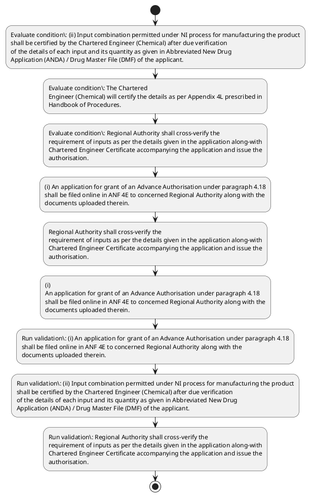

# Chapter 4 / Section 4.19: Processing of Application for Pharmaceutical Products.

**Chapter Title:** Duty Exemption / Remission Schemes

**Pages:** 11

**Purpose:** 4.19 Processing of Application for Pharmaceutical Products.

**Purpose Thanglish:** Indha Processing of Application for Pharmaceutical Products. section-la, 4.19 Processing of application for Pharmaceutical Products.

**Summary:** 4.19 Processing of Application for Pharmaceutical Products. (i) An application for grant of an Advance Authorisation under paragraph 4.18
shall be filed online in ANF 4E to concerned Regional Authority along with the
documents uploaded therein. (ii) Input combination permitted under NI process for manufacturing the product
shall be certified by the Chartered Engineer (Chemical) after due verification
of the details of each input and its quantity as given in Abbreviated New Drug
Application (ANDA) / Drug Master File (DMF) of the applicant.

**Business Meaning:** Processing of Application for Pharmaceutical Products. governs how DGFT business controls should be applied, validated, and enforced.

**Business Explanation:** Processing of Application for Pharmaceutical Products. explains the operating rule set that DEKAI should enforce. Key control points include (i) An application for grant of an Advance Authorisation under paragraph 4.18
shall be filed online in ANF 4E to concerned Regional Authority along with the
documents uploaded therein. The section also drives actions such as (i) An application for grant of an Advance Authorisation under paragraph 4.18
shall be filed online in ANF 4E to concerned Regional Authority along with the
documents uploaded therein..

**Business Explanation Thanglish:** Indha Processing of Application for Pharmaceutical Products. section-la, Processing of application for Pharmaceutical Products. explains the operating rule set that DEKAI should enforce. Key control points include (i) An application for grant of an Advance Authorisation under paragraph 4.18
kandippa be filed online in ANF 4E to concerned Regional authority along with the
documents uploaded therein. The section also drives actions such as (i) An application for grant of an Advance Authorisation under paragraph 4.18
kandippa be filed online in ANF 4E to concerned Regional authority along with the
documents uploaded therein..

## Business Logic
- (i) An application for grant of an Advance Authorisation under paragraph 4.18
shall be filed online in ANF 4E to concerned Regional Authority along with the
documents uploaded therein.
- (ii) Input combination permitted under NI process for manufacturing the product
shall be certified by the Chartered Engineer (Chemical) after due verification
of the details of each input and its quantity as given in Abbreviated New Drug
Application (ANDA) / Drug Master File (DMF) of the applicant.
- Regional Authority shall cross-verify the
requirement of inputs as per the details given in the application along-with
Chartered Engineer Certificate accompanying the application and issue the
authorisation.
- Regional Authority shall not forward such application to Norms
Committee and the inputs and export product so allowed by Regional
Authority shall be treated as input combinations permitted under NI Process.
- (i)
An application for grant of an Advance Authorisation under paragraph 4.18
shall be filed online in ANF 4E to concerned Regional Authority along with the
documents uploaded therein.
- (ii)
Input combination permitted under NI process for manufacturing the product
shall be certified by the Chartered Engineer (Chemical) after due verification
of the details of each input and its quantity as given in Abbreviated New Drug
Application (ANDA) / Drug Master File (DMF) of the applicant.

## Business Rules
- rule_id=CH4-SEC4_19-R001, rule_description=(i) An application for grant of an Advance Authorisation under paragraph 4.18
shall be filed online in ANF 4E to concerned Regional Authority along with the
documents uploaded therein., trigger=Processing of Application for Pharmaceutical Products., condition=(ii) Input combination permitted under NI process for manufacturing the product
shall be certified by the Chartered Engineer (Chemical) after due verification
of the details of each input and its quantity as given in Abbreviated New Drug
Application (ANDA) / Drug Master File (DMF) of the applicant., validation=(i) An application for grant of an Advance Authorisation under paragraph 4.18
shall be filed online in ANF 4E to concerned Regional Authority along with the
documents uploaded therein., action=(i) An application for grant of an Advance Authorisation under paragraph 4.18
shall be filed online in ANF 4E to concerned Regional Authority along with the
documents uploaded therein., exception=No explicit exception found in uploaded documents., output=DEKAI should produce a compliance decision for 4.19 - Processing of Application for Pharmaceutical Products..
- rule_id=CH4-SEC4_19-R002, rule_description=(ii) Input combination permitted under NI process for manufacturing the product
shall be certified by the Chartered Engineer (Chemical) after due verification
of the details of each input and its quantity as given in Abbreviated New Drug
Application (ANDA) / Drug Master File (DMF) of the applicant., trigger=Processing of Application for Pharmaceutical Products., condition=The Chartered
Engineer (Chemical) will certify the details as per Appendix 4L prescribed in
Handbook of Procedures., validation=(ii) Input combination permitted under NI process for manufacturing the product
shall be certified by the Chartered Engineer (Chemical) after due verification
of the details of each input and its quantity as given in Abbreviated New Drug
Application (ANDA) / Drug Master File (DMF) of the applicant., action=Regional Authority shall cross-verify the
requirement of inputs as per the details given in the application along-with
Chartered Engineer Certificate accompanying the application and issue the
authorisation., exception=No explicit exception found in uploaded documents., output=DEKAI should produce a compliance decision for 4.19 - Processing of Application for Pharmaceutical Products..
- rule_id=CH4-SEC4_19-R003, rule_description=Regional Authority shall cross-verify the
requirement of inputs as per the details given in the application along-with
Chartered Engineer Certificate accompanying the application and issue the
authorisation., trigger=Processing of Application for Pharmaceutical Products., condition=Regional Authority shall cross-verify the
requirement of inputs as per the details given in the application along-with
Chartered Engineer Certificate accompanying the application and issue the
authorisation., validation=Regional Authority shall cross-verify the
requirement of inputs as per the details given in the application along-with
Chartered Engineer Certificate accompanying the application and issue the
authorisation., action=(i)
An application for grant of an Advance Authorisation under paragraph 4.18
shall be filed online in ANF 4E to concerned Regional Authority along with the
documents uploaded therein., exception=No explicit exception found in uploaded documents., output=DEKAI should produce a compliance decision for 4.19 - Processing of Application for Pharmaceutical Products..
- rule_id=CH4-SEC4_19-R004, rule_description=Regional Authority shall not forward such application to Norms
Committee and the inputs and export product so allowed by Regional
Authority shall be treated as input combinations permitted under NI Process., trigger=Processing of Application for Pharmaceutical Products., condition=(ii)
Input combination permitted under NI process for manufacturing the product
shall be certified by the Chartered Engineer (Chemical) after due verification
of the details of each input and its quantity as given in Abbreviated New Drug
Application (ANDA) / Drug Master File (DMF) of the applicant., validation=Regional Authority shall not forward such application to Norms
Committee and the inputs and export product so allowed by Regional
Authority shall be treated as input combinations permitted under NI Process., action=(i)
An application for grant of an Advance Authorisation under paragraph 4.18
shall be filed online in ANF 4E to concerned Regional Authority along with the
documents uploaded therein., exception=No explicit exception found in uploaded documents., output=DEKAI should produce a compliance decision for 4.19 - Processing of Application for Pharmaceutical Products..
- rule_id=CH4-SEC4_19-R005, rule_description=(i)
An application for grant of an Advance Authorisation under paragraph 4.18
shall be filed online in ANF 4E to concerned Regional Authority along with the
documents uploaded therein., trigger=Processing of Application for Pharmaceutical Products., condition=(ii)
Input combination permitted under NI process for manufacturing the product
shall be certified by the Chartered Engineer (Chemical) after due verification
of the details of each input and its quantity as given in Abbreviated New Drug
Application (ANDA) / Drug Master File (DMF) of the applicant., validation=(i)
An application for grant of an Advance Authorisation under paragraph 4.18
shall be filed online in ANF 4E to concerned Regional Authority along with the
documents uploaded therein., action=(i)
An application for grant of an Advance Authorisation under paragraph 4.18
shall be filed online in ANF 4E to concerned Regional Authority along with the
documents uploaded therein., exception=No explicit exception found in uploaded documents., output=DEKAI should produce a compliance decision for 4.19 - Processing of Application for Pharmaceutical Products..
- rule_id=CH4-SEC4_19-R006, rule_description=(ii)
Input combination permitted under NI process for manufacturing the product
shall be certified by the Chartered Engineer (Chemical) after due verification
of the details of each input and its quantity as given in Abbreviated New Drug
Application (ANDA) / Drug Master File (DMF) of the applicant., trigger=Processing of Application for Pharmaceutical Products., condition=(ii)
Input combination permitted under NI process for manufacturing the product
shall be certified by the Chartered Engineer (Chemical) after due verification
of the details of each input and its quantity as given in Abbreviated New Drug
Application (ANDA) / Drug Master File (DMF) of the applicant., validation=(ii)
Input combination permitted under NI process for manufacturing the product
shall be certified by the Chartered Engineer (Chemical) after due verification
of the details of each input and its quantity as given in Abbreviated New Drug
Application (ANDA) / Drug Master File (DMF) of the applicant., action=(i)
An application for grant of an Advance Authorisation under paragraph 4.18
shall be filed online in ANF 4E to concerned Regional Authority along with the
documents uploaded therein., exception=No explicit exception found in uploaded documents., output=DEKAI should produce a compliance decision for 4.19 - Processing of Application for Pharmaceutical Products..

## Conditions
- (ii) Input combination permitted under NI process for manufacturing the product
shall be certified by the Chartered Engineer (Chemical) after due verification
of the details of each input and its quantity as given in Abbreviated New Drug
Application (ANDA) / Drug Master File (DMF) of the applicant.
- The Chartered
Engineer (Chemical) will certify the details as per Appendix 4L prescribed in
Handbook of Procedures.
- Regional Authority shall cross-verify the
requirement of inputs as per the details given in the application along-with
Chartered Engineer Certificate accompanying the application and issue the
authorisation.
- (ii)
Input combination permitted under NI process for manufacturing the product
shall be certified by the Chartered Engineer (Chemical) after due verification
of the details of each input and its quantity as given in Abbreviated New Drug
Application (ANDA) / Drug Master File (DMF) of the applicant.

## Condition Logic
- id=4.4.19.1, if=(ii) Input combination permitted under NI process for manufacturing the product
shall be certified by the Chartered Engineer (Chemical) after due verification
of the details of each input and its quantity as given in Abbreviated New Drug
Application (ANDA) / Drug Master File (DMF) of the applicant., then=(i) An application for grant of an Advance Authorisation under paragraph 4.18
shall be filed online in ANF 4E to concerned Regional Authority along with the
documents uploaded therein., source=(ii) Input combination permitted under NI process for manufacturing the product
shall be certified by the Chartered Engineer (Chemical) after due verification
of the details of each input and its quantity as given in Abbreviated New Drug
Application (ANDA) / Drug Master File (DMF) of the applicant.
- id=4.4.19.2, if=The Chartered
Engineer (Chemical) will certify the details as per Appendix 4L prescribed in
Handbook of Procedures., then=(i) An application for grant of an Advance Authorisation under paragraph 4.18
shall be filed online in ANF 4E to concerned Regional Authority along with the
documents uploaded therein., source=The Chartered
Engineer (Chemical) will certify the details as per Appendix 4L prescribed in
Handbook of Procedures.
- id=4.4.19.3, if=Regional Authority shall cross-verify the
requirement of inputs as per the details given in the application along-with
Chartered Engineer Certificate accompanying the application and issue the
authorisation., then=(i) An application for grant of an Advance Authorisation under paragraph 4.18
shall be filed online in ANF 4E to concerned Regional Authority along with the
documents uploaded therein., source=Regional Authority shall cross-verify the
requirement of inputs as per the details given in the application along-with
Chartered Engineer Certificate accompanying the application and issue the
authorisation.
- id=4.4.19.4, if=(ii)
Input combination permitted under NI process for manufacturing the product
shall be certified by the Chartered Engineer (Chemical) after due verification
of the details of each input and its quantity as given in Abbreviated New Drug
Application (ANDA) / Drug Master File (DMF) of the applicant., then=(i) An application for grant of an Advance Authorisation under paragraph 4.18
shall be filed online in ANF 4E to concerned Regional Authority along with the
documents uploaded therein., source=(ii)
Input combination permitted under NI process for manufacturing the product
shall be certified by the Chartered Engineer (Chemical) after due verification
of the details of each input and its quantity as given in Abbreviated New Drug
Application (ANDA) / Drug Master File (DMF) of the applicant.

## Validations
- (i) An application for grant of an Advance Authorisation under paragraph 4.18
shall be filed online in ANF 4E to concerned Regional Authority along with the
documents uploaded therein.
- (ii) Input combination permitted under NI process for manufacturing the product
shall be certified by the Chartered Engineer (Chemical) after due verification
of the details of each input and its quantity as given in Abbreviated New Drug
Application (ANDA) / Drug Master File (DMF) of the applicant.
- Regional Authority shall cross-verify the
requirement of inputs as per the details given in the application along-with
Chartered Engineer Certificate accompanying the application and issue the
authorisation.
- Regional Authority shall not forward such application to Norms
Committee and the inputs and export product so allowed by Regional
Authority shall be treated as input combinations permitted under NI Process.
- (i)
An application for grant of an Advance Authorisation under paragraph 4.18
shall be filed online in ANF 4E to concerned Regional Authority along with the
documents uploaded therein.
- (ii)
Input combination permitted under NI process for manufacturing the product
shall be certified by the Chartered Engineer (Chemical) after due verification
of the details of each input and its quantity as given in Abbreviated New Drug
Application (ANDA) / Drug Master File (DMF) of the applicant.

## Exceptions
- None identified

## Dependencies
- 4.18
- 1
- 4

## Authorities
- Regional Authority

## Required Documents
- Processing of Application
- (i) An application for grant of an Advance Authorisation under paragraph 4.18
shall be filed online in ANF 4E to concerned Regional Authority along with the
documents uploaded therein.
- (ii) Input combination permitted under NI process for manufacturing the product
shall be certified by the Chartered Engineer (Chemical) after due verification
of the details of each input and its quantity as given in Abbreviated New Drug
Application (ANDA) / Drug Master File (DMF) of the applicant.
- Chartered Engineer Certificate
- Regional Authority shall not forward such application to Norms
Committee and the inputs and export product so allowed by Regional
Authority shall be treated as input combinations permitted under NI Process.
- (i)
An application for grant of an Advance Authorisation under paragraph 4.18
shall be filed online in ANF 4E to concerned Regional Authority along with the
documents uploaded therein.
- (ii)
Input combination permitted under NI process for manufacturing the product
shall be certified by the Chartered Engineer (Chemical) after due verification
of the details of each input and its quantity as given in Abbreviated New Drug
Application (ANDA) / Drug Master File (DMF) of the applicant.

## Timelines
- (ii) Input combination permitted under NI process for manufacturing the product
shall be certified by the Chartered Engineer (Chemical) after due verification
of the details of each input and its quantity as given in Abbreviated New Drug
Application (ANDA) / Drug Master File (DMF) of the applicant.
- (ii)
Input combination permitted under NI process for manufacturing the product
shall be certified by the Chartered Engineer (Chemical) after due verification
of the details of each input and its quantity as given in Abbreviated New Drug
Application (ANDA) / Drug Master File (DMF) of the applicant.

## Actions
- (i) An application for grant of an Advance Authorisation under paragraph 4.18
shall be filed online in ANF 4E to concerned Regional Authority along with the
documents uploaded therein.
- Regional Authority shall cross-verify the
requirement of inputs as per the details given in the application along-with
Chartered Engineer Certificate accompanying the application and issue the
authorisation.
- (i)
An application for grant of an Advance Authorisation under paragraph 4.18
shall be filed online in ANF 4E to concerned Regional Authority along with the
documents uploaded therein.

## Workflow
- Evaluate condition: (ii) Input combination permitted under NI process for manufacturing the product
shall be certified by the Chartered Engineer (Chemical) after due verification
of the details of each input and its quantity as given in Abbreviated New Drug
Application (ANDA) / Drug Master File (DMF) of the applicant.
- Evaluate condition: The Chartered
Engineer (Chemical) will certify the details as per Appendix 4L prescribed in
Handbook of Procedures.
- Evaluate condition: Regional Authority shall cross-verify the
requirement of inputs as per the details given in the application along-with
Chartered Engineer Certificate accompanying the application and issue the
authorisation.
- (i) An application for grant of an Advance Authorisation under paragraph 4.18
shall be filed online in ANF 4E to concerned Regional Authority along with the
documents uploaded therein.
- Regional Authority shall cross-verify the
requirement of inputs as per the details given in the application along-with
Chartered Engineer Certificate accompanying the application and issue the
authorisation.
- (i)
An application for grant of an Advance Authorisation under paragraph 4.18
shall be filed online in ANF 4E to concerned Regional Authority along with the
documents uploaded therein.
- Run validation: (i) An application for grant of an Advance Authorisation under paragraph 4.18
shall be filed online in ANF 4E to concerned Regional Authority along with the
documents uploaded therein.
- Run validation: (ii) Input combination permitted under NI process for manufacturing the product
shall be certified by the Chartered Engineer (Chemical) after due verification
of the details of each input and its quantity as given in Abbreviated New Drug
Application (ANDA) / Drug Master File (DMF) of the applicant.
- Run validation: Regional Authority shall cross-verify the
requirement of inputs as per the details given in the application along-with
Chartered Engineer Certificate accompanying the application and issue the
authorisation.

## Workflow ASCII
```text
Processing of Application for Pharmaceutical Products.
Evaluate condition: (ii) Input combination permitted under NI process for manufacturing the product
shall be certified by the Chartered Engineer (Chemical) after due verification
of the details of each input and its quantity as given in Abbreviated New Drug
Application (ANDA) / Drug Master File (DMF) of the applicant.
   |
   v
Evaluate condition: The Chartered
Engineer (Chemical) will certify the details as per Appendix 4L prescribed in
Handbook of Procedures.
   |
   v
Evaluate condition: Regional Authority shall cross-verify the
requirement of inputs as per the details given in the application along-with
Chartered Engineer Certificate accompanying the application and issue the
authorisation.
   |
   v
(i) An application for grant of an Advance Authorisation under paragraph 4.18
shall be filed online in ANF 4E to concerned Regional Authority along with the
documents uploaded therein.
   |
   v
Regional Authority shall cross-verify the
requirement of inputs as per the details given in the application along-with
Chartered Engineer Certificate accompanying the application and issue the
authorisation.
   |
   v
(i)
An application for grant of an Advance Authorisation under paragraph 4.18
shall be filed online in ANF 4E to concerned Regional Authority along with the
documents uploaded therein.
   |
   v
Run validation: (i) An application for grant of an Advance Authorisation under paragraph 4.18
shall be filed online in ANF 4E to concerned Regional Authority along with the
documents uploaded therein.
   |
   v
Run validation: (ii) Input combination permitted under NI process for manufacturing the product
shall be certified by the Chartered Engineer (Chemical) after due verification
of the details of each input and its quantity as given in Abbreviated New Drug
Application (ANDA) / Drug Master File (DMF) of the applicant.
   |
   v
Run validation: Regional Authority shall cross-verify the
requirement of inputs as per the details given in the application along-with
Chartered Engineer Certificate accompanying the application and issue the
authorisation.
```

## Decision Tree
- IF (ii) Input combination permitted under NI process for manufacturing the product
shall be certified by the Chartered Engineer (Chemical) after due verification
of the details of each input and its quantity as given in Abbreviated New Drug
Application (ANDA) / Drug Master File (DMF) of the applicant. THEN (i) An application for grant of an Advance Authorisation under paragraph 4.18
shall be filed online in ANF 4E to concerned Regional Authority along with the
documents uploaded therein.
- IF The Chartered
Engineer (Chemical) will certify the details as per Appendix 4L prescribed in
Handbook of Procedures. THEN (i) An application for grant of an Advance Authorisation under paragraph 4.18
shall be filed online in ANF 4E to concerned Regional Authority along with the
documents uploaded therein.
- IF Regional Authority shall cross-verify the
requirement of inputs as per the details given in the application along-with
Chartered Engineer Certificate accompanying the application and issue the
authorisation. THEN (i) An application for grant of an Advance Authorisation under paragraph 4.18
shall be filed online in ANF 4E to concerned Regional Authority along with the
documents uploaded therein.
- IF (ii)
Input combination permitted under NI process for manufacturing the product
shall be certified by the Chartered Engineer (Chemical) after due verification
of the details of each input and its quantity as given in Abbreviated New Drug
Application (ANDA) / Drug Master File (DMF) of the applicant. THEN (i) An application for grant of an Advance Authorisation under paragraph 4.18
shall be filed online in ANF 4E to concerned Regional Authority along with the
documents uploaded therein.

## Decision Tree ASCII
```text
Processing of Application for Pharmaceutical Products. Decision
IF (ii) Input combination permitted under NI process for manufacturing the product
shall be certified by the Chartered Engineer (Chemical) after due verification
of the details of each input and its quantity as given in Abbreviated New Drug
Application (ANDA) / Drug Master File (DMF) of the applicant. THEN (i) An application for grant of an Advance Authorisation under paragraph 4.18
shall be filed online in ANF 4E to concerned Regional Authority along with the
documents uploaded therein.
   |
   v
IF The Chartered
Engineer (Chemical) will certify the details as per Appendix 4L prescribed in
Handbook of Procedures. THEN (i) An application for grant of an Advance Authorisation under paragraph 4.18
shall be filed online in ANF 4E to concerned Regional Authority along with the
documents uploaded therein.
   |
   v
IF Regional Authority shall cross-verify the
requirement of inputs as per the details given in the application along-with
Chartered Engineer Certificate accompanying the application and issue the
authorisation. THEN (i) An application for grant of an Advance Authorisation under paragraph 4.18
shall be filed online in ANF 4E to concerned Regional Authority along with the
documents uploaded therein.
   |
   v
IF (ii)
Input combination permitted under NI process for manufacturing the product
shall be certified by the Chartered Engineer (Chemical) after due verification
of the details of each input and its quantity as given in Abbreviated New Drug
Application (ANDA) / Drug Master File (DMF) of the applicant. THEN (i) An application for grant of an Advance Authorisation under paragraph 4.18
shall be filed online in ANF 4E to concerned Regional Authority along with the
documents uploaded therein.
```

## Examples
- User asks to process Processing of Application for Pharmaceutical Products.; the platform checks conditions, validations, and documents before action.

**Real-world Example:** Example: an importer or exporter invokes Processing of Application for Pharmaceutical Products., submits Processing of Application, (i) An application for grant of an Advance Authorisation under paragraph 4.18
shall be filed online in ANF 4E to concerned Regional Authority along with the
documents uploaded therein., (ii) Input combination permitted under NI process for manufacturing the product
shall be certified by the Chartered Engineer (Chemical) after due verification
of the details of each input and its quantity as given in Abbreviated New Drug
Application (ANDA) / Drug Master File (DMF) of the applicant., and DEKAI uses the extracted rules to (i) an application for grant of an advance authorisation under paragraph 4.18
shall be filed online in anf 4e to concerned regional authority along with the
documents uploaded therein..

**Real-world Example Thanglish:** Indha Processing of Application for Pharmaceutical Products. section-la, Example: an importer or exporter invokes Processing of application for Pharmaceutical Products., submits Processing of application, (i) An application for grant of an Advance Authorisation under paragraph 4.18
kandippa be filed online in ANF 4E to concerned Regional authority along with the
documents uploaded therein., (ii) Input combination permitted under NI process for manufacturing the product
kandippa be certified by the Chartered Engineer (Chemical) after due verification
of the details of each input and its quantity as given in Abbreviated New Drug
application (ANDA) / Drug Master File (DMF) of the applicant., and DEKAI uses the extracted rules to (i) an application for grant of an advance authorisation under paragraph 4.18
kandippa be filed online in anf 4e to concerned regional authority along with the
documents uploaded therein..

## AI Rules
- IF detected context matches section rule THEN enforce: (i) An application for grant of an Advance Authorisation under paragraph 4.18
shall be filed online in ANF 4E to concerned Regional Authority along with the
documents uploaded therein.
- IF detected context matches section rule THEN enforce: (ii) Input combination permitted under NI process for manufacturing the product
shall be certified by the Chartered Engineer (Chemical) after due verification
of the details of each input and its quantity as given in Abbreviated New Drug
Application (ANDA) / Drug Master File (DMF) of the applicant.
- IF detected context matches section rule THEN enforce: Regional Authority shall cross-verify the
requirement of inputs as per the details given in the application along-with
Chartered Engineer Certificate accompanying the application and issue the
authorisation.
- IF detected context matches section rule THEN enforce: Regional Authority shall not forward such application to Norms
Committee and the inputs and export product so allowed by Regional
Authority shall be treated as input combinations permitted under NI Process.
- IF detected context matches section rule THEN enforce: (i)
An application for grant of an Advance Authorisation under paragraph 4.18
shall be filed online in ANF 4E to concerned Regional Authority along with the
documents uploaded therein.
- IF detected context matches section rule THEN enforce: (ii)
Input combination permitted under NI process for manufacturing the product
shall be certified by the Chartered Engineer (Chemical) after due verification
of the details of each input and its quantity as given in Abbreviated New Drug
Application (ANDA) / Drug Master File (DMF) of the applicant.
- IF validations pass THEN recommend action: (i) An application for grant of an Advance Authorisation under paragraph 4.18
shall be filed online in ANF 4E to concerned Regional Authority along with the
documents uploaded therein.

## Database Fields
- name=section_code, type=string, required=True, source=parsed_section_heading
- name=section_title, type=string, required=True, source=parsed_section_heading
- name=for_flag, type=boolean, required=False, source=keyword:for
- name=anf_flag, type=boolean, required=False, source=keyword:ANF
- name=the_flag, type=boolean, required=False, source=keyword:the
- name=due_flag, type=boolean, required=False, source=keyword:due
- name=and_flag, type=boolean, required=False, source=keyword:and
- name=its_flag, type=boolean, required=False, source=keyword:its
- name=new_flag, type=boolean, required=False, source=keyword:New
- name=dmf_flag, type=boolean, required=False, source=keyword:DMF
- name=document_1_submitted, type=boolean, required=True, source=Processing of Application
- name=document_2_submitted, type=boolean, required=True, source=(i) An application for grant of an Advance Authorisation under paragraph 4.18
shall be filed online in ANF 4E to concerned Regional Authority along with the
documents uploaded therein.
- name=document_3_submitted, type=boolean, required=True, source=(ii) Input combination permitted under NI process for manufacturing the product
shall be certified by the Chartered Engineer (Chemical) after due verification
of the details of each input and its quantity as given in Abbreviated New Drug
Application (ANDA) / Drug Master File (DMF) of the applicant.
- name=document_4_submitted, type=boolean, required=True, source=Chartered Engineer Certificate
- name=document_5_submitted, type=boolean, required=True, source=Regional Authority shall not forward such application to Norms
Committee and the inputs and export product so allowed by Regional
Authority shall be treated as input combinations permitted under NI Process.
- name=document_6_submitted, type=boolean, required=True, source=(i)
An application for grant of an Advance Authorisation under paragraph 4.18
shall be filed online in ANF 4E to concerned Regional Authority along with the
documents uploaded therein.

## API Requirements
- method=GET, path=/api/dgft/sections/4.19, purpose=Retrieve knowledge payload for section 4.19, query_params=['include=workflow,decision_tree,validations'], response_fields=['section', 'title', 'summary', 'conditions', 'validations', 'exceptions', 'workflow', 'decision_tree']
- method=POST, path=/api/dgft/Processing-of-Application-for-Pharmaceutical-Products/validate, purpose=Validate inputs and documents for Processing of Application for Pharmaceutical Products., request_fields=['section_code', 'section_title', 'document_1_submitted', 'document_2_submitted', 'document_3_submitted', 'document_4_submitted', 'document_5_submitted', 'document_6_submitted'], response_fields=['status', 'errors', 'warnings', 'next_actions']
- method=POST, path=/api/dgft/Processing-of-Application-for-Pharmaceutical-Products/execute, purpose=Trigger business action for (i) An application for grant of an Advance Authorisation under paragraph 4.18
shall be filed online in ANF 4E to concerned Regional Authority along with the
documents uploaded therein., request_fields=['section_code', 'section_title', 'document_1_submitted', 'document_2_submitted', 'document_3_submitted', 'document_4_submitted', 'document_5_submitted', 'document_6_submitted'], response_fields=['reference_id', 'status', 'authority', 'timeline']

## UI Screens
- screen_id=Processing_of_Application_for_Pharmaceutical_Products_overview, name=Processing of Application for Pharmaceutical Products. Overview, purpose=Show section summary, authority, timeline, and eligibility cues., widgets=['summary_card', 'conditions_table', 'authority_badges', 'timeline_panel']
- screen_id=Processing_of_Application_for_Pharmaceutical_Products_submission, name=Processing of Application for Pharmaceutical Products. Submission, purpose=Capture applicant data and supporting documents., widgets=['dynamic_form', 'document_uploader', 'validation_panel', 'next_action_footer'], fields=['section_code', 'section_title', 'for_flag', 'anf_flag', 'the_flag', 'due_flag', 'and_flag', 'its_flag']

## Error Messages
- Validation failed because the section requirements were not fully met.

## FAQ
- question_en=What is the purpose of section 4.19?, answer_en=Processing of Application for Pharmaceutical Products. explains the operating rule set that DEKAI should enforce. Key control points include (i) An application for grant of an Advance Authorisation under paragraph 4.18
shall be filed online in ANF 4E to concerned Regional Authority along with the
documents uploaded therein. The section also drives actions such as (i) An application for grant of an Advance Authorisation under paragraph 4.18
shall be filed online in ANF 4E to concerned Regional Authority along with the
documents uploaded therein.., question_thanglish=Indha Processing of Application for Pharmaceutical Products. section-la, What is the purpose of section 4.19?, answer_thanglish=Indha Processing of Application for Pharmaceutical Products. section-la, Processing of application for Pharmaceutical Products. explains the operating rule set that DEKAI should enforce. Key control points include (i) An application for grant of an Advance Authorisation under paragraph 4.18
kandippa be filed online in ANF 4E to concerned Regional authority along with the
documents uploaded therein. The section also drives actions such as (i) An application for grant of an Advance Authorisation under paragraph 4.18
kandippa be filed online in ANF 4E to concerned Regional authority along with the
documents uploaded therein..
- question_en=What documents are required under Processing of Application for Pharmaceutical Products.?, answer_en=Processing of Application, (i) An application for grant of an Advance Authorisation under paragraph 4.18
shall be filed online in ANF 4E to concerned Regional Authority along with the
documents uploaded therein., (ii) Input combination permitted under NI process for manufacturing the product
shall be certified by the Chartered Engineer (Chemical) after due verification
of the details of each input and its quantity as given in Abbreviated New Drug
Application (ANDA) / Drug Master File (DMF) of the applicant., Chartered Engineer Certificate, Regional Authority shall not forward such application to Norms
Committee and the inputs and export product so allowed by Regional
Authority shall be treated as input combinations permitted under NI Process., (i)
An application for grant of an Advance Authorisation under paragraph 4.18
shall be filed online in ANF 4E to concerned Regional Authority along with the
documents uploaded therein., (ii)
Input combination permitted under NI process for manufacturing the product
shall be certified by the Chartered Engineer (Chemical) after due verification
of the details of each input and its quantity as given in Abbreviated New Drug
Application (ANDA) / Drug Master File (DMF) of the applicant., question_thanglish=Indha Processing of Application for Pharmaceutical Products. section-la, What documents are required under Processing of application for Pharmaceutical Products.?, answer_thanglish=Indha Processing of Application for Pharmaceutical Products. section-la, Processing of application, (i) An application for grant of an Advance Authorisation under paragraph 4.18
kandippa be filed online in ANF 4E to concerned Regional authority along with the
documents uploaded therein., (ii) Input combination permitted under NI process for manufacturing the product
kandippa be certified by the Chartered Engineer (Chemical) after due verification
of the details of each input and its quantity as given in Abbreviated New Drug
application (ANDA) / Drug Master File (DMF) of the applicant., Chartered Engineer Certificate, Regional authority kandippa not forward such application to Norms
Committee and the inputs and export product so allowed by Regional
authority kandippa be treated as input combinations permitted under NI Process., (i)
An application for grant of an Advance Authorisation under paragraph 4.18
kandippa be filed online in ANF 4E to concerned Regional authority along with the
documents uploaded therein., (ii)
Input combination permitted under NI process for manufacturing the product
kandippa be certified by the Chartered Engineer (Chemical) after due verification
of the details of each input and its quantity as given in Abbreviated New Drug
application (ANDA) / Drug Master File (DMF) of the applicant.
- question_en=Which authority handles Processing of Application for Pharmaceutical Products.?, answer_en=Regional Authority, question_thanglish=Indha Processing of Application for Pharmaceutical Products. section-la, Which authority handles Processing of application for Pharmaceutical Products.?, answer_thanglish=Indha Processing of Application for Pharmaceutical Products. section-la, Regional authority

## Questions Users May Ask
- What does Processing of Application for Pharmaceutical Products. require?
- Which documents are needed for Processing of Application for Pharmaceutical Products.?
- How does DEKAI validate Processing of Application for Pharmaceutical Products. requests?
- What action should be taken for Processing of Application for Pharmaceutical Products.?

## Expected AI Answers
- Processing of Application for Pharmaceutical Products. requires the platform to interpret the section text, apply the extracted business rules, and present the correct next action.
- Required documents are inferred from the section text: Processing of Application, (i) An application for grant of an Advance Authorisation under paragraph 4.18
shall be filed online in ANF 4E to concerned Regional Authority along with the
documents uploaded therein., (ii) Input combination permitted under NI process for manufacturing the product
shall be certified by the Chartered Engineer (Chemical) after due verification
of the details of each input and its quantity as given in Abbreviated New Drug
Application (ANDA) / Drug Master File (DMF) of the applicant., Chartered Engineer Certificate, Regional Authority shall not forward such application to Norms
Committee and the inputs and export product so allowed by Regional
Authority shall be treated as input combinations permitted under NI Process.
- DEKAI validates Processing of Application for Pharmaceutical Products. by checking conditions, required documents, authority references, and exception clauses before recommending an outcome.
- The primary extracted action is: (i) An application for grant of an Advance Authorisation under paragraph 4.18
shall be filed online in ANF 4E to concerned Regional Authority along with the
documents uploaded therein.

## AI Q&A Examples
- question_en=User asks: How do I comply with Processing of Application for Pharmaceutical Products.?, answer_en=AI answers: DEKAI should evaluate section 4.19, apply the extracted rules, and guide the user through Evaluate condition: (ii) Input combination permitted under NI process for manufacturing the product
shall be certified by the Chartered Engineer (Chemical) after due verification
of the details of each input and its quantity as given in Abbreviated New Drug
Application (ANDA) / Drug Master File (DMF) of the applicant.., question_thanglish=Indha Processing of Application for Pharmaceutical Products. section-la, User asks: How do I comply with Processing of application for Pharmaceutical Products.?, answer_thanglish=Indha Processing of Application for Pharmaceutical Products. section-la, AI answers: DEKAI should evaluate section 4.19, apply the extracted rules, and guide the user through Evaluate condition: (ii) Input combination permitted under NI process for manufacturing the product
kandippa be certified by the Chartered Engineer (Chemical) after due verification
of the details of each input and its quantity as given in Abbreviated New Drug
application (ANDA) / Drug Master File (DMF) of the applicant..
- question_en=User asks: Which validations apply to Processing of Application for Pharmaceutical Products.?, answer_en=AI answers: Applicable validations are (i) An application for grant of an Advance Authorisation under paragraph 4.18
shall be filed online in ANF 4E to concerned Regional Authority along with the
documents uploaded therein., (ii) Input combination permitted under NI process for manufacturing the product
shall be certified by the Chartered Engineer (Chemical) after due verification
of the details of each input and its quantity as given in Abbreviated New Drug
Application (ANDA) / Drug Master File (DMF) of the applicant., Regional Authority shall cross-verify the
requirement of inputs as per the details given in the application along-with
Chartered Engineer Certificate accompanying the application and issue the
authorisation., question_thanglish=Indha Processing of Application for Pharmaceutical Products. section-la, User asks: Which validations apply to Processing of application for Pharmaceutical Products.?, answer_thanglish=Indha Processing of Application for Pharmaceutical Products. section-la, AI answers: Applicable validations are (i) An application for grant of an Advance Authorisation under paragraph 4.18
kandippa be filed online in ANF 4E to concerned Regional authority along with the
documents uploaded therein., (ii) Input combination permitted under NI process for manufacturing the product
kandippa be certified by the Chartered Engineer (Chemical) after due verification
of the details of each input and its quantity as given in Abbreviated New Drug
application (ANDA) / Drug Master File (DMF) of the applicant., Regional authority kandippa cross-verify the
requirement of inputs as per the details given in the application along-with
Chartered Engineer Certificate accompanying the application and issue the
authorisation.

## DEKAI AI Implementation Notes
- Capture chapter 4, section 4.19, title, and page references as immutable knowledge metadata.
- Bind validations for Processing of Application for Pharmaceutical Products. into a rule engine keyed by the rule IDs extracted for this section.
- Expose document upload controls for: Processing of Application, (i) An application for grant of an Advance Authorisation under paragraph 4.18
shall be filed online in ANF 4E to concerned Regional Authority along with the
documents uploaded therein., (ii) Input combination permitted under NI process for manufacturing the product
shall be certified by the Chartered Engineer (Chemical) after due verification
of the details of each input and its quantity as given in Abbreviated New Drug
Application (ANDA) / Drug Master File (DMF) of the applicant., Chartered Engineer Certificate, Regional Authority shall not forward such application to Norms
Committee and the inputs and export product so allowed by Regional
Authority shall be treated as input combinations permitted under NI Process., (i)
An application for grant of an Advance Authorisation under paragraph 4.18
shall be filed online in ANF 4E to concerned Regional Authority along with the
documents uploaded therein..
- Route escalations or approvals to: Regional Authority.
- Show contextual links to related sections: 4.18, 1, 4.

## DEKAI AI Implementation Notes Thanglish
- Indha Processing of Application for Pharmaceutical Products. section-la, Capture chapter 4, section 4.19, title, and page references as immutable knowledge metadata.
- Indha Processing of Application for Pharmaceutical Products. section-la, Bind validations for Processing of application for Pharmaceutical Products. into a rule engine keyed by the rule IDs extracted for this section.
- Indha Processing of Application for Pharmaceutical Products. section-la, Expose document upload controls for: Processing of application, (i) An application for grant of an Advance Authorisation under paragraph 4.18
kandippa be filed online in ANF 4E to concerned Regional authority along with the
documents uploaded therein., (ii) Input combination permitted under NI process for manufacturing the product
kandippa be certified by the Chartered Engineer (Chemical) after due verification
of the details of each input and its quantity as given in Abbreviated New Drug
application (ANDA) / Drug Master File (DMF) of the applicant., Chartered Engineer Certificate, Regional authority kandippa not forward such application to Norms
Committee and the inputs and export product so allowed by Regional
authority kandippa be treated as input combinations permitted under NI Process., (i)
An application for grant of an Advance Authorisation under paragraph 4.18
kandippa be filed online in ANF 4E to concerned Regional authority along with the
documents uploaded therein..
- Indha Processing of Application for Pharmaceutical Products. section-la, Route escalations or approvals to: Regional authority.
- Indha Processing of Application for Pharmaceutical Products. section-la, Show contextual links to related sections: 4.18, 1, 4.

## AI Metadata
- Keywords: for, ANF, the, due, and, its, New, DMF, per, not, with, each, Drug, ANDA, File, will, such, grant, under, shall
- Search Keywords: for, ANF, the, due, and, its, New, DMF, per, not, with, each, Drug, ANDA, File, will, such, grant, under, shall
- Intent: Support Processing of Application for Pharmaceutical Products. processing and compliance validation.
- Tags: 4.19, Processing of Application for Pharmaceutical Products., business-rule, document-driven, dgft
- Related Sections: 4.18, 1, 4
- Related Chapters: 
- Related Rules: (i) An application for grant of an Advance Authorisation under paragraph 4.18
shall be filed online in ANF 4E to concerned Regional Authority along with the
documents uploaded therein., (ii) Input combination permitted under NI process for manufacturing the product
shall be certified by the Chartered Engineer (Chemical) after due verification
of the details of each input and its quantity as given in Abbreviated New Drug
Application (ANDA) / Drug Master File (DMF) of the applicant., Regional Authority shall cross-verify the
requirement of inputs as per the details given in the application along-with
Chartered Engineer Certificate accompanying the application and issue the
authorisation., Regional Authority shall not forward such application to Norms
Committee and the inputs and export product so allowed by Regional
Authority shall be treated as input combinations permitted under NI Process., (i)
An application for grant of an Advance Authorisation under paragraph 4.18
shall be filed online in ANF 4E to concerned Regional Authority along with the
documents uploaded therein.

## Mermaid

```mermaid
flowchart TD
    S1["Evaluate condition: (ii) Input combination permitted under NI process for manufacturing the product
shall be certified by the Chartered Engineer (Chemical) after due verification
of the details of each input and its quantity as given in Abbreviated New Drug
Application (ANDA) / Drug Master File (DMF) of the applicant."]
    S2["Evaluate condition: The Chartered
Engineer (Chemical) will certify the details as per Appendix 4L prescribed in
Handbook of Procedures."]
    S1 --> S2
    S3["Evaluate condition: Regional Authority shall cross-verify the
requirement of inputs as per the details given in the application along-with
Chartered Engineer Certificate accompanying the application and issue the
authorisation."]
    S2 --> S3
    S4["(i) An application for grant of an Advance Authorisation under paragraph 4.18
shall be filed online in ANF 4E to concerned Regional Authority along with the
documents uploaded therein."]
    S3 --> S4
    S5["Regional Authority shall cross-verify the
requirement of inputs as per the details given in the application along-with
Chartered Engineer Certificate accompanying the application and issue the
authorisation."]
    S4 --> S5
    S6["(i)
An application for grant of an Advance Authorisation under paragraph 4.18
shall be filed online in ANF 4E to concerned Regional Authority along with the
documents uploaded therein."]
    S5 --> S6
    S7["Run validation: (i) An application for grant of an Advance Authorisation under paragraph 4.18
shall be filed online in ANF 4E to concerned Regional Authority along with the
documents uploaded therein."]
    S6 --> S7
    S8["Run validation: (ii) Input combination permitted under NI process for manufacturing the product
shall be certified by the Chartered Engineer (Chemical) after due verification
of the details of each input and its quantity as given in Abbreviated New Drug
Application (ANDA) / Drug Master File (DMF) of the applicant."]
    S7 --> S8
    S9["Run validation: Regional Authority shall cross-verify the
requirement of inputs as per the details given in the application along-with
Chartered Engineer Certificate accompanying the application and issue the
authorisation."]
    S8 --> S9
```


## PlantUML

