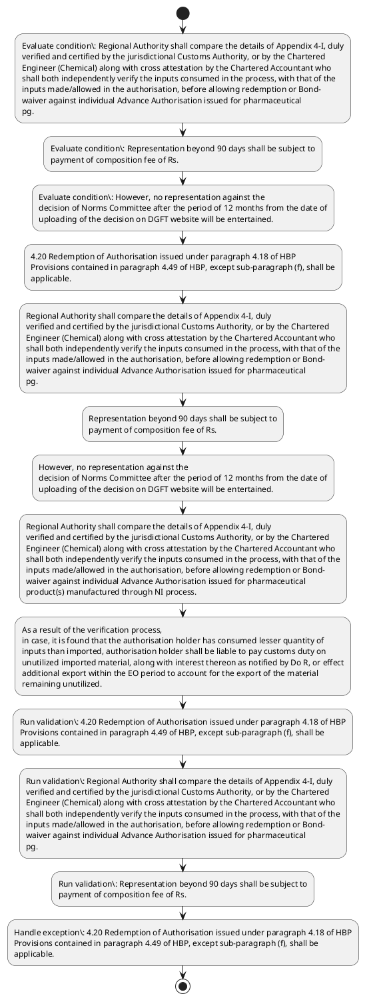

# Chapter 4 / Section 4.20: Redemption of Authorisation issued under paragraph 4.18 of HBP

**Chapter Title:** Duty Exemption / Remission Schemes

**Pages:** 11, 12

**Purpose:** 4.20 Redemption of Authorisation issued under paragraph 4.18 of HBP
Provisions contained in paragraph 4.49 of HBP, except sub-paragraph (f), shall be
applicable.

**Purpose Thanglish:** Indha Redemption of Authorisation issued under paragraph 4.18 of HBP section-la, 4.20 Redemption of Authorisation issued under paragraph 4.18 of HBP
Provisions contained in paragraph 4.49 of HBP, except sub-paragraph (f), kandippa be
applicable.

**Summary:** 4.20 Redemption of Authorisation issued under paragraph 4.18 of HBP
Provisions contained in paragraph 4.49 of HBP, except sub-paragraph (f), shall be
applicable. Regional Authority shall compare the details of Appendix 4-I, duly
verified and certified by the jurisdictional Customs Authority, or by the Chartered
Engineer (Chemical) along with cross attestation by the Chartered Accountant who
shall both independently verify the inputs consumed in the process, with that of the
inputs made/allowed in the authorisation, before allowing redemption or Bond-
waiver against individual Advance Authorisation issued for pharmaceutical
pg. 86
pg.

**Business Meaning:** Redemption of Authorisation issued under paragraph 4.18 of HBP governs how DGFT business controls should be applied, validated, and enforced.

**Business Explanation:** Redemption of Authorisation issued under paragraph 4.18 of HBP explains the operating rule set that DEKAI should enforce. Key control points include 4.20 Redemption of Authorisation issued under paragraph 4.18 of HBP
Provisions contained in paragraph 4.49 of HBP, except sub-paragraph (f), shall be
applicable. The section also drives actions such as 4.20 Redemption of Authorisation issued under paragraph 4.18 of HBP
Provisions contained in paragraph 4.49 of HBP, except sub-paragraph (f), shall be
applicable..

**Business Explanation Thanglish:** Indha Redemption of Authorisation issued under paragraph 4.18 of HBP section-la, Redemption of Authorisation issued under paragraph 4.18 of HBP explains the operating rule set that DEKAI should enforce. Key control points include 4.20 Redemption of Authorisation issued under paragraph 4.18 of HBP
Provisions contained in paragraph 4.49 of HBP, except sub-paragraph (f), kandippa be
applicable. The section also drives actions such as 4.20 Redemption of Authorisation issued under paragraph 4.18 of HBP
Provisions contained in paragraph 4.49 of HBP, except sub-paragraph (f), kandippa be
applicable..

## Business Logic
- 4.20 Redemption of Authorisation issued under paragraph 4.18 of HBP
Provisions contained in paragraph 4.49 of HBP, except sub-paragraph (f), shall be
applicable.
- Regional Authority shall compare the details of Appendix 4-I, duly
verified and certified by the jurisdictional Customs Authority, or by the Chartered
Engineer (Chemical) along with cross attestation by the Chartered Accountant who
shall both independently verify the inputs consumed in the process, with that of the
inputs made/allowed in the authorisation, before allowing redemption or Bond-
waiver against individual Advance Authorisation issued for pharmaceutical
pg.
- Representation beyond 90 days shall be subject to
payment of composition fee of Rs.
- Regional Authority shall compare the details of Appendix 4-I, duly
verified and certified by the jurisdictional Customs Authority, or by the Chartered
Engineer (Chemical) along with cross attestation by the Chartered Accountant who
shall both independently verify the inputs consumed in the process, with that of the
inputs made/allowed in the authorisation, before allowing redemption or Bond-
waiver against individual Advance Authorisation issued for pharmaceutical
product(s) manufactured through NI process.
- As a result of the verification process,
in case, it is found that the authorisation holder has consumed lesser quantity of
inputs than imported, authorisation holder shall be liable to pay customs duty on
unutilized imported material, along with interest thereon as notified by Do R, or effect
additional export within the EO period to account for the export of the material
remaining unutilized.

## Business Rules
- rule_id=CH4-SEC4_20-R001, rule_description=4.20 Redemption of Authorisation issued under paragraph 4.18 of HBP
Provisions contained in paragraph 4.49 of HBP, except sub-paragraph (f), shall be
applicable., trigger=Redemption of Authorisation issued under paragraph 4.18 of HBP, condition=Regional Authority shall compare the details of Appendix 4-I, duly
verified and certified by the jurisdictional Customs Authority, or by the Chartered
Engineer (Chemical) along with cross attestation by the Chartered Accountant who
shall both independently verify the inputs consumed in the process, with that of the
inputs made/allowed in the authorisation, before allowing redemption or Bond-
waiver against individual Advance Authorisation issued for pharmaceutical
pg., validation=4.20 Redemption of Authorisation issued under paragraph 4.18 of HBP
Provisions contained in paragraph 4.49 of HBP, except sub-paragraph (f), shall be
applicable., action=4.20 Redemption of Authorisation issued under paragraph 4.18 of HBP
Provisions contained in paragraph 4.49 of HBP, except sub-paragraph (f), shall be
applicable., exception=4.20 Redemption of Authorisation issued under paragraph 4.18 of HBP
Provisions contained in paragraph 4.49 of HBP, except sub-paragraph (f), shall be
applicable., output=DEKAI should produce a compliance decision for 4.20 - Redemption of Authorisation issued under paragraph 4.18 of HBP.
- rule_id=CH4-SEC4_20-R002, rule_description=Regional Authority shall compare the details of Appendix 4-I, duly
verified and certified by the jurisdictional Customs Authority, or by the Chartered
Engineer (Chemical) along with cross attestation by the Chartered Accountant who
shall both independently verify the inputs consumed in the process, with that of the
inputs made/allowed in the authorisation, before allowing redemption or Bond-
waiver against individual Advance Authorisation issued for pharmaceutical
pg., trigger=Redemption of Authorisation issued under paragraph 4.18 of HBP, condition=Representation beyond 90 days shall be subject to
payment of composition fee of Rs., validation=Regional Authority shall compare the details of Appendix 4-I, duly
verified and certified by the jurisdictional Customs Authority, or by the Chartered
Engineer (Chemical) along with cross attestation by the Chartered Accountant who
shall both independently verify the inputs consumed in the process, with that of the
inputs made/allowed in the authorisation, before allowing redemption or Bond-
waiver against individual Advance Authorisation issued for pharmaceutical
pg., action=Regional Authority shall compare the details of Appendix 4-I, duly
verified and certified by the jurisdictional Customs Authority, or by the Chartered
Engineer (Chemical) along with cross attestation by the Chartered Accountant who
shall both independently verify the inputs consumed in the process, with that of the
inputs made/allowed in the authorisation, before allowing redemption or Bond-
waiver against individual Advance Authorisation issued for pharmaceutical
pg., exception=However, no representation against the
decision of Norms Committee after the period of 12 months from the date of
uploading of the decision on DGFT website will be entertained., output=DEKAI should produce a compliance decision for 4.20 - Redemption of Authorisation issued under paragraph 4.18 of HBP.
- rule_id=CH4-SEC4_20-R003, rule_description=Representation beyond 90 days shall be subject to
payment of composition fee of Rs., trigger=Redemption of Authorisation issued under paragraph 4.18 of HBP, condition=However, no representation against the
decision of Norms Committee after the period of 12 months from the date of
uploading of the decision on DGFT website will be entertained., validation=Representation beyond 90 days shall be subject to
payment of composition fee of Rs., action=Representation beyond 90 days shall be subject to
payment of composition fee of Rs., exception=However, for the Customs duty component, the authorisation
holder has also the option to furnish valid duty credit scrip issued under Chapter 3 of
FTP (2015-20)., output=DEKAI should produce a compliance decision for 4.20 - Redemption of Authorisation issued under paragraph 4.18 of HBP.
- rule_id=CH4-SEC4_20-R004, rule_description=Regional Authority shall compare the details of Appendix 4-I, duly
verified and certified by the jurisdictional Customs Authority, or by the Chartered
Engineer (Chemical) along with cross attestation by the Chartered Accountant who
shall both independently verify the inputs consumed in the process, with that of the
inputs made/allowed in the authorisation, before allowing redemption or Bond-
waiver against individual Advance Authorisation issued for pharmaceutical
product(s) manufactured through NI process., trigger=Redemption of Authorisation issued under paragraph 4.18 of HBP, condition=Regional Authority shall compare the details of Appendix 4-I, duly
verified and certified by the jurisdictional Customs Authority, or by the Chartered
Engineer (Chemical) along with cross attestation by the Chartered Accountant who
shall both independently verify the inputs consumed in the process, with that of the
inputs made/allowed in the authorisation, before allowing redemption or Bond-
waiver against individual Advance Authorisation issued for pharmaceutical
product(s) manufactured through NI process., validation=Regional Authority shall compare the details of Appendix 4-I, duly
verified and certified by the jurisdictional Customs Authority, or by the Chartered
Engineer (Chemical) along with cross attestation by the Chartered Accountant who
shall both independently verify the inputs consumed in the process, with that of the
inputs made/allowed in the authorisation, before allowing redemption or Bond-
waiver against individual Advance Authorisation issued for pharmaceutical
product(s) manufactured through NI process., action=However, no representation against the
decision of Norms Committee after the period of 12 months from the date of
uploading of the decision on DGFT website will be entertained., exception=However, for the Customs duty component, the authorisation
holder has also the option to furnish valid duty credit scrip issued under Chapter 3 of
FTP (2015-20)., output=DEKAI should produce a compliance decision for 4.20 - Redemption of Authorisation issued under paragraph 4.18 of HBP.
- rule_id=CH4-SEC4_20-R005, rule_description=As a result of the verification process,
in case, it is found that the authorisation holder has consumed lesser quantity of
inputs than imported, authorisation holder shall be liable to pay customs duty on
unutilized imported material, along with interest thereon as notified by Do R, or effect
additional export within the EO period to account for the export of the material
remaining unutilized., trigger=Redemption of Authorisation issued under paragraph 4.18 of HBP, condition=As a result of the verification process,
in case, it is found that the authorisation holder has consumed lesser quantity of
inputs than imported, authorisation holder shall be liable to pay customs duty on
unutilized imported material, along with interest thereon as notified by Do R, or effect
additional export within the EO period to account for the export of the material
remaining unutilized., validation=As a result of the verification process,
in case, it is found that the authorisation holder has consumed lesser quantity of
inputs than imported, authorisation holder shall be liable to pay customs duty on
unutilized imported material, along with interest thereon as notified by Do R, or effect
additional export within the EO period to account for the export of the material
remaining unutilized., action=Regional Authority shall compare the details of Appendix 4-I, duly
verified and certified by the jurisdictional Customs Authority, or by the Chartered
Engineer (Chemical) along with cross attestation by the Chartered Accountant who
shall both independently verify the inputs consumed in the process, with that of the
inputs made/allowed in the authorisation, before allowing redemption or Bond-
waiver against individual Advance Authorisation issued for pharmaceutical
product(s) manufactured through NI process., exception=However, for the Customs duty component, the authorisation
holder has also the option to furnish valid duty credit scrip issued under Chapter 3 of
FTP (2015-20)., output=DEKAI should produce a compliance decision for 4.20 - Redemption of Authorisation issued under paragraph 4.18 of HBP.

## Conditions
- Regional Authority shall compare the details of Appendix 4-I, duly
verified and certified by the jurisdictional Customs Authority, or by the Chartered
Engineer (Chemical) along with cross attestation by the Chartered Accountant who
shall both independently verify the inputs consumed in the process, with that of the
inputs made/allowed in the authorisation, before allowing redemption or Bond-
waiver against individual Advance Authorisation issued for pharmaceutical
pg.
- Representation beyond 90 days shall be subject to
payment of composition fee of Rs.
- However, no representation against the
decision of Norms Committee after the period of 12 months from the date of
uploading of the decision on DGFT website will be entertained.
- Regional Authority shall compare the details of Appendix 4-I, duly
verified and certified by the jurisdictional Customs Authority, or by the Chartered
Engineer (Chemical) along with cross attestation by the Chartered Accountant who
shall both independently verify the inputs consumed in the process, with that of the
inputs made/allowed in the authorisation, before allowing redemption or Bond-
waiver against individual Advance Authorisation issued for pharmaceutical
product(s) manufactured through NI process.
- As a result of the verification process,
in case, it is found that the authorisation holder has consumed lesser quantity of
inputs than imported, authorisation holder shall be liable to pay customs duty on
unutilized imported material, along with interest thereon as notified by Do R, or effect
additional export within the EO period to account for the export of the material
remaining unutilized.

## Condition Logic
- id=4.4.20.1, if=Regional Authority shall compare the details of Appendix 4-I, duly
verified and certified by the jurisdictional Customs Authority, or by the Chartered
Engineer (Chemical) along with cross attestation by the Chartered Accountant who
shall both independently verify the inputs consumed in the process, with that of the
inputs made/allowed in the authorisation, before allowing redemption or Bond-
waiver against individual Advance Authorisation issued for pharmaceutical
pg., then=4.20 Redemption of Authorisation issued under paragraph 4.18 of HBP
Provisions contained in paragraph 4.49 of HBP, except sub-paragraph (f), shall be
applicable., source=Regional Authority shall compare the details of Appendix 4-I, duly
verified and certified by the jurisdictional Customs Authority, or by the Chartered
Engineer (Chemical) along with cross attestation by the Chartered Accountant who
shall both independently verify the inputs consumed in the process, with that of the
inputs made/allowed in the authorisation, before allowing redemption or Bond-
waiver against individual Advance Authorisation issued for pharmaceutical
pg.
- id=4.4.20.2, if=Representation beyond 90 days shall be subject to
payment of composition fee of Rs., then=4.20 Redemption of Authorisation issued under paragraph 4.18 of HBP
Provisions contained in paragraph 4.49 of HBP, except sub-paragraph (f), shall be
applicable., source=Representation beyond 90 days shall be subject to
payment of composition fee of Rs.
- id=4.4.20.3, if=However, no representation against the
decision of Norms Committee after the period of 12 months from the date of
uploading of the decision on DGFT website will be entertained., then=4.20 Redemption of Authorisation issued under paragraph 4.18 of HBP
Provisions contained in paragraph 4.49 of HBP, except sub-paragraph (f), shall be
applicable., source=However, no representation against the
decision of Norms Committee after the period of 12 months from the date of
uploading of the decision on DGFT website will be entertained.
- id=4.4.20.4, if=Regional Authority shall compare the details of Appendix 4-I, duly
verified and certified by the jurisdictional Customs Authority, or by the Chartered
Engineer (Chemical) along with cross attestation by the Chartered Accountant who
shall both independently verify the inputs consumed in the process, with that of the
inputs made/allowed in the authorisation, before allowing redemption or Bond-
waiver against individual Advance Authorisation issued for pharmaceutical
product(s) manufactured through NI process., then=4.20 Redemption of Authorisation issued under paragraph 4.18 of HBP
Provisions contained in paragraph 4.49 of HBP, except sub-paragraph (f), shall be
applicable., source=Regional Authority shall compare the details of Appendix 4-I, duly
verified and certified by the jurisdictional Customs Authority, or by the Chartered
Engineer (Chemical) along with cross attestation by the Chartered Accountant who
shall both independently verify the inputs consumed in the process, with that of the
inputs made/allowed in the authorisation, before allowing redemption or Bond-
waiver against individual Advance Authorisation issued for pharmaceutical
product(s) manufactured through NI process.
- id=4.4.20.5, if=As a result of the verification process,
in case, it is found that the authorisation holder has consumed lesser quantity of
inputs than imported, authorisation holder shall be liable to pay customs duty on
unutilized imported material, along with interest thereon as notified by Do R, or effect
additional export within the EO period to account for the export of the material
remaining unutilized., then=4.20 Redemption of Authorisation issued under paragraph 4.18 of HBP
Provisions contained in paragraph 4.49 of HBP, except sub-paragraph (f), shall be
applicable., source=As a result of the verification process,
in case, it is found that the authorisation holder has consumed lesser quantity of
inputs than imported, authorisation holder shall be liable to pay customs duty on
unutilized imported material, along with interest thereon as notified by Do R, or effect
additional export within the EO period to account for the export of the material
remaining unutilized.

## Validations
- 4.20 Redemption of Authorisation issued under paragraph 4.18 of HBP
Provisions contained in paragraph 4.49 of HBP, except sub-paragraph (f), shall be
applicable.
- Regional Authority shall compare the details of Appendix 4-I, duly
verified and certified by the jurisdictional Customs Authority, or by the Chartered
Engineer (Chemical) along with cross attestation by the Chartered Accountant who
shall both independently verify the inputs consumed in the process, with that of the
inputs made/allowed in the authorisation, before allowing redemption or Bond-
waiver against individual Advance Authorisation issued for pharmaceutical
pg.
- Representation beyond 90 days shall be subject to
payment of composition fee of Rs.
- Regional Authority shall compare the details of Appendix 4-I, duly
verified and certified by the jurisdictional Customs Authority, or by the Chartered
Engineer (Chemical) along with cross attestation by the Chartered Accountant who
shall both independently verify the inputs consumed in the process, with that of the
inputs made/allowed in the authorisation, before allowing redemption or Bond-
waiver against individual Advance Authorisation issued for pharmaceutical
product(s) manufactured through NI process.
- As a result of the verification process,
in case, it is found that the authorisation holder has consumed lesser quantity of
inputs than imported, authorisation holder shall be liable to pay customs duty on
unutilized imported material, along with interest thereon as notified by Do R, or effect
additional export within the EO period to account for the export of the material
remaining unutilized.

## Exceptions
- 4.20 Redemption of Authorisation issued under paragraph 4.18 of HBP
Provisions contained in paragraph 4.49 of HBP, except sub-paragraph (f), shall be
applicable.
- However, no representation against the
decision of Norms Committee after the period of 12 months from the date of
uploading of the decision on DGFT website will be entertained.
- However, for the Customs duty component, the authorisation
holder has also the option to furnish valid duty credit scrip issued under Chapter 3 of
FTP (2015-20).

## Dependencies
- 4.18
- 4.49
- 3
- 1
- 2
- 4
- 5
- 6

## Authorities
- Regional Authority
- Customs
- Customs Authority
- DGFT
- Norms Committee

## Required Documents
- None identified

## Timelines
- Regional Authority shall compare the details of Appendix 4-I, duly
verified and certified by the jurisdictional Customs Authority, or by the Chartered
Engineer (Chemical) along with cross attestation by the Chartered Accountant who
shall both independently verify the inputs consumed in the process, with that of the
inputs made/allowed in the authorisation, before allowing redemption or Bond-
waiver against individual Advance Authorisation issued for pharmaceutical
pg.
- Representation beyond 90 days shall be subject to
payment of composition fee of Rs.
- However, no representation against the
decision of Norms Committee after the period of 12 months from the date of
uploading of the decision on DGFT website will be entertained.
- Regional Authority shall compare the details of Appendix 4-I, duly
verified and certified by the jurisdictional Customs Authority, or by the Chartered
Engineer (Chemical) along with cross attestation by the Chartered Accountant who
shall both independently verify the inputs consumed in the process, with that of the
inputs made/allowed in the authorisation, before allowing redemption or Bond-
waiver against individual Advance Authorisation issued for pharmaceutical
product(s) manufactured through NI process.
- As a result of the verification process,
in case, it is found that the authorisation holder has consumed lesser quantity of
inputs than imported, authorisation holder shall be liable to pay customs duty on
unutilized imported material, along with interest thereon as notified by Do R, or effect
additional export within the EO period to account for the export of the material
remaining unutilized.

## Actions
- 4.20 Redemption of Authorisation issued under paragraph 4.18 of HBP
Provisions contained in paragraph 4.49 of HBP, except sub-paragraph (f), shall be
applicable.
- Regional Authority shall compare the details of Appendix 4-I, duly
verified and certified by the jurisdictional Customs Authority, or by the Chartered
Engineer (Chemical) along with cross attestation by the Chartered Accountant who
shall both independently verify the inputs consumed in the process, with that of the
inputs made/allowed in the authorisation, before allowing redemption or Bond-
waiver against individual Advance Authorisation issued for pharmaceutical
pg.
- Representation beyond 90 days shall be subject to
payment of composition fee of Rs.
- However, no representation against the
decision of Norms Committee after the period of 12 months from the date of
uploading of the decision on DGFT website will be entertained.
- Regional Authority shall compare the details of Appendix 4-I, duly
verified and certified by the jurisdictional Customs Authority, or by the Chartered
Engineer (Chemical) along with cross attestation by the Chartered Accountant who
shall both independently verify the inputs consumed in the process, with that of the
inputs made/allowed in the authorisation, before allowing redemption or Bond-
waiver against individual Advance Authorisation issued for pharmaceutical
product(s) manufactured through NI process.
- As a result of the verification process,
in case, it is found that the authorisation holder has consumed lesser quantity of
inputs than imported, authorisation holder shall be liable to pay customs duty on
unutilized imported material, along with interest thereon as notified by Do R, or effect
additional export within the EO period to account for the export of the material
remaining unutilized.
- However, for the Customs duty component, the authorisation
holder has also the option to furnish valid duty credit scrip issued under Chapter 3 of
FTP (2015-20).

## Workflow
- Evaluate condition: Regional Authority shall compare the details of Appendix 4-I, duly
verified and certified by the jurisdictional Customs Authority, or by the Chartered
Engineer (Chemical) along with cross attestation by the Chartered Accountant who
shall both independently verify the inputs consumed in the process, with that of the
inputs made/allowed in the authorisation, before allowing redemption or Bond-
waiver against individual Advance Authorisation issued for pharmaceutical
pg.
- Evaluate condition: Representation beyond 90 days shall be subject to
payment of composition fee of Rs.
- Evaluate condition: However, no representation against the
decision of Norms Committee after the period of 12 months from the date of
uploading of the decision on DGFT website will be entertained.
- 4.20 Redemption of Authorisation issued under paragraph 4.18 of HBP
Provisions contained in paragraph 4.49 of HBP, except sub-paragraph (f), shall be
applicable.
- Regional Authority shall compare the details of Appendix 4-I, duly
verified and certified by the jurisdictional Customs Authority, or by the Chartered
Engineer (Chemical) along with cross attestation by the Chartered Accountant who
shall both independently verify the inputs consumed in the process, with that of the
inputs made/allowed in the authorisation, before allowing redemption or Bond-
waiver against individual Advance Authorisation issued for pharmaceutical
pg.
- Representation beyond 90 days shall be subject to
payment of composition fee of Rs.
- However, no representation against the
decision of Norms Committee after the period of 12 months from the date of
uploading of the decision on DGFT website will be entertained.
- Regional Authority shall compare the details of Appendix 4-I, duly
verified and certified by the jurisdictional Customs Authority, or by the Chartered
Engineer (Chemical) along with cross attestation by the Chartered Accountant who
shall both independently verify the inputs consumed in the process, with that of the
inputs made/allowed in the authorisation, before allowing redemption or Bond-
waiver against individual Advance Authorisation issued for pharmaceutical
product(s) manufactured through NI process.
- As a result of the verification process,
in case, it is found that the authorisation holder has consumed lesser quantity of
inputs than imported, authorisation holder shall be liable to pay customs duty on
unutilized imported material, along with interest thereon as notified by Do R, or effect
additional export within the EO period to account for the export of the material
remaining unutilized.
- Run validation: 4.20 Redemption of Authorisation issued under paragraph 4.18 of HBP
Provisions contained in paragraph 4.49 of HBP, except sub-paragraph (f), shall be
applicable.
- Run validation: Regional Authority shall compare the details of Appendix 4-I, duly
verified and certified by the jurisdictional Customs Authority, or by the Chartered
Engineer (Chemical) along with cross attestation by the Chartered Accountant who
shall both independently verify the inputs consumed in the process, with that of the
inputs made/allowed in the authorisation, before allowing redemption or Bond-
waiver against individual Advance Authorisation issued for pharmaceutical
pg.
- Run validation: Representation beyond 90 days shall be subject to
payment of composition fee of Rs.
- Handle exception: 4.20 Redemption of Authorisation issued under paragraph 4.18 of HBP
Provisions contained in paragraph 4.49 of HBP, except sub-paragraph (f), shall be
applicable.

## Workflow ASCII
```text
Redemption of Authorisation issued under paragraph 4.18 of HBP
Evaluate condition: Regional Authority shall compare the details of Appendix 4-I, duly
verified and certified by the jurisdictional Customs Authority, or by the Chartered
Engineer (Chemical) along with cross attestation by the Chartered Accountant who
shall both independently verify the inputs consumed in the process, with that of the
inputs made/allowed in the authorisation, before allowing redemption or Bond-
waiver against individual Advance Authorisation issued for pharmaceutical
pg.
   |
   v
Evaluate condition: Representation beyond 90 days shall be subject to
payment of composition fee of Rs.
   |
   v
Evaluate condition: However, no representation against the
decision of Norms Committee after the period of 12 months from the date of
uploading of the decision on DGFT website will be entertained.
   |
   v
4.20 Redemption of Authorisation issued under paragraph 4.18 of HBP
Provisions contained in paragraph 4.49 of HBP, except sub-paragraph (f), shall be
applicable.
   |
   v
Regional Authority shall compare the details of Appendix 4-I, duly
verified and certified by the jurisdictional Customs Authority, or by the Chartered
Engineer (Chemical) along with cross attestation by the Chartered Accountant who
shall both independently verify the inputs consumed in the process, with that of the
inputs made/allowed in the authorisation, before allowing redemption or Bond-
waiver against individual Advance Authorisation issued for pharmaceutical
pg.
   |
   v
Representation beyond 90 days shall be subject to
payment of composition fee of Rs.
   |
   v
However, no representation against the
decision of Norms Committee after the period of 12 months from the date of
uploading of the decision on DGFT website will be entertained.
   |
   v
Regional Authority shall compare the details of Appendix 4-I, duly
verified and certified by the jurisdictional Customs Authority, or by the Chartered
Engineer (Chemical) along with cross attestation by the Chartered Accountant who
shall both independently verify the inputs consumed in the process, with that of the
inputs made/allowed in the authorisation, before allowing redemption or Bond-
waiver against individual Advance Authorisation issued for pharmaceutical
product(s) manufactured through NI process.
   |
   v
As a result of the verification process,
in case, it is found that the authorisation holder has consumed lesser quantity of
inputs than imported, authorisation holder shall be liable to pay customs duty on
unutilized imported material, along with interest thereon as notified by Do R, or effect
additional export within the EO period to account for the export of the material
remaining unutilized.
   |
   v
Run validation: 4.20 Redemption of Authorisation issued under paragraph 4.18 of HBP
Provisions contained in paragraph 4.49 of HBP, except sub-paragraph (f), shall be
applicable.
   |
   v
Run validation: Regional Authority shall compare the details of Appendix 4-I, duly
verified and certified by the jurisdictional Customs Authority, or by the Chartered
Engineer (Chemical) along with cross attestation by the Chartered Accountant who
shall both independently verify the inputs consumed in the process, with that of the
inputs made/allowed in the authorisation, before allowing redemption or Bond-
waiver against individual Advance Authorisation issued for pharmaceutical
pg.
   |
   v
Run validation: Representation beyond 90 days shall be subject to
payment of composition fee of Rs.
   |
   v
Handle exception: 4.20 Redemption of Authorisation issued under paragraph 4.18 of HBP
Provisions contained in paragraph 4.49 of HBP, except sub-paragraph (f), shall be
applicable.
```

## Decision Tree
- IF Regional Authority shall compare the details of Appendix 4-I, duly
verified and certified by the jurisdictional Customs Authority, or by the Chartered
Engineer (Chemical) along with cross attestation by the Chartered Accountant who
shall both independently verify the inputs consumed in the process, with that of the
inputs made/allowed in the authorisation, before allowing redemption or Bond-
waiver against individual Advance Authorisation issued for pharmaceutical
pg. THEN 4.20 Redemption of Authorisation issued under paragraph 4.18 of HBP
Provisions contained in paragraph 4.49 of HBP, except sub-paragraph (f), shall be
applicable.
- IF Representation beyond 90 days shall be subject to
payment of composition fee of Rs. THEN 4.20 Redemption of Authorisation issued under paragraph 4.18 of HBP
Provisions contained in paragraph 4.49 of HBP, except sub-paragraph (f), shall be
applicable.
- IF However, no representation against the
decision of Norms Committee after the period of 12 months from the date of
uploading of the decision on DGFT website will be entertained. THEN 4.20 Redemption of Authorisation issued under paragraph 4.18 of HBP
Provisions contained in paragraph 4.49 of HBP, except sub-paragraph (f), shall be
applicable.
- IF Regional Authority shall compare the details of Appendix 4-I, duly
verified and certified by the jurisdictional Customs Authority, or by the Chartered
Engineer (Chemical) along with cross attestation by the Chartered Accountant who
shall both independently verify the inputs consumed in the process, with that of the
inputs made/allowed in the authorisation, before allowing redemption or Bond-
waiver against individual Advance Authorisation issued for pharmaceutical
product(s) manufactured through NI process. THEN 4.20 Redemption of Authorisation issued under paragraph 4.18 of HBP
Provisions contained in paragraph 4.49 of HBP, except sub-paragraph (f), shall be
applicable.
- IF As a result of the verification process,
in case, it is found that the authorisation holder has consumed lesser quantity of
inputs than imported, authorisation holder shall be liable to pay customs duty on
unutilized imported material, along with interest thereon as notified by Do R, or effect
additional export within the EO period to account for the export of the material
remaining unutilized. THEN 4.20 Redemption of Authorisation issued under paragraph 4.18 of HBP
Provisions contained in paragraph 4.49 of HBP, except sub-paragraph (f), shall be
applicable.
- IF exception applies (4.20 Redemption of Authorisation issued under paragraph 4.18 of HBP
Provisions contained in paragraph 4.49 of HBP, except sub-paragraph (f), shall be
applicable.) THEN route to manual review
- IF exception applies (However, no representation against the
decision of Norms Committee after the period of 12 months from the date of
uploading of the decision on DGFT website will be entertained.) THEN route to manual review
- IF exception applies (However, for the Customs duty component, the authorisation
holder has also the option to furnish valid duty credit scrip issued under Chapter 3 of
FTP (2015-20).) THEN route to manual review

## Decision Tree ASCII
```text
Redemption of Authorisation issued under paragraph 4.18 of HBP Decision
IF Regional Authority shall compare the details of Appendix 4-I, duly
verified and certified by the jurisdictional Customs Authority, or by the Chartered
Engineer (Chemical) along with cross attestation by the Chartered Accountant who
shall both independently verify the inputs consumed in the process, with that of the
inputs made/allowed in the authorisation, before allowing redemption or Bond-
waiver against individual Advance Authorisation issued for pharmaceutical
pg. THEN 4.20 Redemption of Authorisation issued under paragraph 4.18 of HBP
Provisions contained in paragraph 4.49 of HBP, except sub-paragraph (f), shall be
applicable.
   |
   v
IF Representation beyond 90 days shall be subject to
payment of composition fee of Rs. THEN 4.20 Redemption of Authorisation issued under paragraph 4.18 of HBP
Provisions contained in paragraph 4.49 of HBP, except sub-paragraph (f), shall be
applicable.
   |
   v
IF However, no representation against the
decision of Norms Committee after the period of 12 months from the date of
uploading of the decision on DGFT website will be entertained. THEN 4.20 Redemption of Authorisation issued under paragraph 4.18 of HBP
Provisions contained in paragraph 4.49 of HBP, except sub-paragraph (f), shall be
applicable.
   |
   v
IF Regional Authority shall compare the details of Appendix 4-I, duly
verified and certified by the jurisdictional Customs Authority, or by the Chartered
Engineer (Chemical) along with cross attestation by the Chartered Accountant who
shall both independently verify the inputs consumed in the process, with that of the
inputs made/allowed in the authorisation, before allowing redemption or Bond-
waiver against individual Advance Authorisation issued for pharmaceutical
product(s) manufactured through NI process. THEN 4.20 Redemption of Authorisation issued under paragraph 4.18 of HBP
Provisions contained in paragraph 4.49 of HBP, except sub-paragraph (f), shall be
applicable.
   |
   v
IF As a result of the verification process,
in case, it is found that the authorisation holder has consumed lesser quantity of
inputs than imported, authorisation holder shall be liable to pay customs duty on
unutilized imported material, along with interest thereon as notified by Do R, or effect
additional export within the EO period to account for the export of the material
remaining unutilized. THEN 4.20 Redemption of Authorisation issued under paragraph 4.18 of HBP
Provisions contained in paragraph 4.49 of HBP, except sub-paragraph (f), shall be
applicable.
   |
   v
IF exception applies (4.20 Redemption of Authorisation issued under paragraph 4.18 of HBP
Provisions contained in paragraph 4.49 of HBP, except sub-paragraph (f), shall be
applicable.) THEN route to manual review
   |
   v
IF exception applies (However, no representation against the
decision of Norms Committee after the period of 12 months from the date of
uploading of the decision on DGFT website will be entertained.) THEN route to manual review
   |
   v
IF exception applies (However, for the Customs duty component, the authorisation
holder has also the option to furnish valid duty credit scrip issued under Chapter 3 of
FTP (2015-20).) THEN route to manual review
```

## Examples
- User asks to process Redemption of Authorisation issued under paragraph 4.18 of HBP; the platform checks conditions, validations, and documents before action.

**Real-world Example:** Example: an importer or exporter invokes Redemption of Authorisation issued under paragraph 4.18 of HBP, submits the prescribed DGFT records, and DEKAI uses the extracted rules to 4.20 redemption of authorisation issued under paragraph 4.18 of hbp
provisions contained in paragraph 4.49 of hbp, except sub-paragraph (f), shall be
applicable..

**Real-world Example Thanglish:** Indha Redemption of Authorisation issued under paragraph 4.18 of HBP section-la, Example: an importer or exporter invokes Redemption of Authorisation issued under paragraph 4.18 of HBP, submits the prescribed DGFT records, and DEKAI uses the extracted rules to 4.20 redemption of authorisation issued under paragraph 4.18 of hbp
provisions contained in paragraph 4.49 of hbp, except sub-paragraph (f), kandippa be
applicable..

## AI Rules
- IF detected context matches section rule THEN enforce: 4.20 Redemption of Authorisation issued under paragraph 4.18 of HBP
Provisions contained in paragraph 4.49 of HBP, except sub-paragraph (f), shall be
applicable.
- IF detected context matches section rule THEN enforce: Regional Authority shall compare the details of Appendix 4-I, duly
verified and certified by the jurisdictional Customs Authority, or by the Chartered
Engineer (Chemical) along with cross attestation by the Chartered Accountant who
shall both independently verify the inputs consumed in the process, with that of the
inputs made/allowed in the authorisation, before allowing redemption or Bond-
waiver against individual Advance Authorisation issued for pharmaceutical
pg.
- IF detected context matches section rule THEN enforce: Representation beyond 90 days shall be subject to
payment of composition fee of Rs.
- IF detected context matches section rule THEN enforce: Regional Authority shall compare the details of Appendix 4-I, duly
verified and certified by the jurisdictional Customs Authority, or by the Chartered
Engineer (Chemical) along with cross attestation by the Chartered Accountant who
shall both independently verify the inputs consumed in the process, with that of the
inputs made/allowed in the authorisation, before allowing redemption or Bond-
waiver against individual Advance Authorisation issued for pharmaceutical
product(s) manufactured through NI process.
- IF detected context matches section rule THEN enforce: As a result of the verification process,
in case, it is found that the authorisation holder has consumed lesser quantity of
inputs than imported, authorisation holder shall be liable to pay customs duty on
unutilized imported material, along with interest thereon as notified by Do R, or effect
additional export within the EO period to account for the export of the material
remaining unutilized.
- IF validations pass THEN recommend action: 4.20 Redemption of Authorisation issued under paragraph 4.18 of HBP
Provisions contained in paragraph 4.49 of HBP, except sub-paragraph (f), shall be
applicable.

## Database Fields
- name=section_code, type=string, required=True, source=parsed_section_heading
- name=section_title, type=string, required=True, source=parsed_section_heading
- name=hbp_flag, type=boolean, required=False, source=keyword:HBP
- name=the_flag, type=boolean, required=False, source=keyword:the
- name=and_flag, type=boolean, required=False, source=keyword:and
- name=who_flag, type=boolean, required=False, source=keyword:who
- name=for_flag, type=boolean, required=False, source=keyword:for
- name=fee_flag, type=boolean, required=False, source=keyword:fee
- name=has_flag, type=boolean, required=False, source=keyword:has
- name=pay_flag, type=boolean, required=False, source=keyword:pay

## API Requirements
- method=GET, path=/api/dgft/sections/4.20, purpose=Retrieve knowledge payload for section 4.20, query_params=['include=workflow,decision_tree,validations'], response_fields=['section', 'title', 'summary', 'conditions', 'validations', 'exceptions', 'workflow', 'decision_tree']
- method=POST, path=/api/dgft/Redemption-of-Authorisation-issued-under-paragraph-4-18-of-HBP/validate, purpose=Validate inputs and documents for Redemption of Authorisation issued under paragraph 4.18 of HBP, request_fields=['section_code', 'section_title'], response_fields=['status', 'errors', 'warnings', 'next_actions']
- method=POST, path=/api/dgft/Redemption-of-Authorisation-issued-under-paragraph-4-18-of-HBP/execute, purpose=Trigger business action for 4.20 Redemption of Authorisation issued under paragraph 4.18 of HBP
Provisions contained in paragraph 4.49 of HBP, except sub-paragraph (f), shall be
applicable., request_fields=['section_code', 'section_title'], response_fields=['reference_id', 'status', 'authority', 'timeline']

## UI Screens
- screen_id=Redemption_of_Authorisation_issued_under_paragraph_4_18_of_HBP_overview, name=Redemption of Authorisation issued under paragraph 4.18 of HBP Overview, purpose=Show section summary, authority, timeline, and eligibility cues., widgets=['summary_card', 'conditions_table', 'authority_badges', 'timeline_panel']
- screen_id=Redemption_of_Authorisation_issued_under_paragraph_4_18_of_HBP_submission, name=Redemption of Authorisation issued under paragraph 4.18 of HBP Submission, purpose=Capture applicant data and supporting documents., widgets=['dynamic_form', 'document_uploader', 'validation_panel', 'next_action_footer'], fields=['section_code', 'section_title', 'hbp_flag', 'the_flag', 'and_flag', 'who_flag', 'for_flag', 'fee_flag']
- screen_id=Redemption_of_Authorisation_issued_under_paragraph_4_18_of_HBP_exceptions, name=Redemption of Authorisation issued under paragraph 4.18 of HBP Exception Review, purpose=Explain exception handling and manual review triggers., widgets=['exception_banner', 'decision_tree', 'case_notes']

## Error Messages
- Validation failed because the section requirements were not fully met.

## FAQ
- question_en=What is the purpose of section 4.20?, answer_en=Redemption of Authorisation issued under paragraph 4.18 of HBP explains the operating rule set that DEKAI should enforce. Key control points include 4.20 Redemption of Authorisation issued under paragraph 4.18 of HBP
Provisions contained in paragraph 4.49 of HBP, except sub-paragraph (f), shall be
applicable. The section also drives actions such as 4.20 Redemption of Authorisation issued under paragraph 4.18 of HBP
Provisions contained in paragraph 4.49 of HBP, except sub-paragraph (f), shall be
applicable.., question_thanglish=Indha Redemption of Authorisation issued under paragraph 4.18 of HBP section-la, What is the purpose of section 4.20?, answer_thanglish=Indha Redemption of Authorisation issued under paragraph 4.18 of HBP section-la, Redemption of Authorisation issued under paragraph 4.18 of HBP explains the operating rule set that DEKAI should enforce. Key control points include 4.20 Redemption of Authorisation issued under paragraph 4.18 of HBP
Provisions contained in paragraph 4.49 of HBP, except sub-paragraph (f), kandippa be
applicable. The section also drives actions such as 4.20 Redemption of Authorisation issued under paragraph 4.18 of HBP
Provisions contained in paragraph 4.49 of HBP, except sub-paragraph (f), kandippa be
applicable..
- question_en=What documents are required under Redemption of Authorisation issued under paragraph 4.18 of HBP?, answer_en=Not explicitly covered in uploaded documents., question_thanglish=Indha Redemption of Authorisation issued under paragraph 4.18 of HBP section-la, What documents are required under Redemption of Authorisation issued under paragraph 4.18 of HBP?, answer_thanglish=Indha Redemption of Authorisation issued under paragraph 4.18 of HBP section-la, Not explicitly covered in uploaded documents.
- question_en=Which authority handles Redemption of Authorisation issued under paragraph 4.18 of HBP?, answer_en=Regional Authority, Customs, Customs Authority, DGFT, Norms Committee, question_thanglish=Indha Redemption of Authorisation issued under paragraph 4.18 of HBP section-la, Which authority handles Redemption of Authorisation issued under paragraph 4.18 of HBP?, answer_thanglish=Indha Redemption of Authorisation issued under paragraph 4.18 of HBP section-la, Regional authority, Customs, Customs authority, DGFT, Norms Committee

## Questions Users May Ask
- What does Redemption of Authorisation issued under paragraph 4.18 of HBP require?
- Which documents are needed for Redemption of Authorisation issued under paragraph 4.18 of HBP?
- How does DEKAI validate Redemption of Authorisation issued under paragraph 4.18 of HBP requests?
- What action should be taken for Redemption of Authorisation issued under paragraph 4.18 of HBP?

## Expected AI Answers
- Redemption of Authorisation issued under paragraph 4.18 of HBP requires the platform to interpret the section text, apply the extracted business rules, and present the correct next action.
- Required documents are inferred from the section text: no explicit documents were detected.
- DEKAI validates Redemption of Authorisation issued under paragraph 4.18 of HBP by checking conditions, required documents, authority references, and exception clauses before recommending an outcome.
- The primary extracted action is: 4.20 Redemption of Authorisation issued under paragraph 4.18 of HBP
Provisions contained in paragraph 4.49 of HBP, except sub-paragraph (f), shall be
applicable.

## AI Q&A Examples
- question_en=User asks: How do I comply with Redemption of Authorisation issued under paragraph 4.18 of HBP?, answer_en=AI answers: DEKAI should evaluate section 4.20, apply the extracted rules, and guide the user through Evaluate condition: Regional Authority shall compare the details of Appendix 4-I, duly
verified and certified by the jurisdictional Customs Authority, or by the Chartered
Engineer (Chemical) along with cross attestation by the Chartered Accountant who
shall both independently verify the inputs consumed in the process, with that of the
inputs made/allowed in the authorisation, before allowing redemption or Bond-
waiver against individual Advance Authorisation issued for pharmaceutical
pg.., question_thanglish=Indha Redemption of Authorisation issued under paragraph 4.18 of HBP section-la, User asks: How do I comply with Redemption of Authorisation issued under paragraph 4.18 of HBP?, answer_thanglish=Indha Redemption of Authorisation issued under paragraph 4.18 of HBP section-la, AI answers: DEKAI should evaluate section 4.20, apply the extracted rules, and guide the user through Evaluate condition: Regional authority kandippa compare the details of Appendix 4-I, duly
verified and certified by the jurisdictional Customs authority, or by the Chartered
Engineer (Chemical) along with cross attestation by the Chartered Accountant who
kandippa both independently verify the inputs consumed in the process, with that of the
inputs made/allowed in the authorisation, before allowing redemption or Bond-
waiver against individual Advance Authorisation issued for pharmaceutical
pg..
- question_en=User asks: Which validations apply to Redemption of Authorisation issued under paragraph 4.18 of HBP?, answer_en=AI answers: Applicable validations are 4.20 Redemption of Authorisation issued under paragraph 4.18 of HBP
Provisions contained in paragraph 4.49 of HBP, except sub-paragraph (f), shall be
applicable., Regional Authority shall compare the details of Appendix 4-I, duly
verified and certified by the jurisdictional Customs Authority, or by the Chartered
Engineer (Chemical) along with cross attestation by the Chartered Accountant who
shall both independently verify the inputs consumed in the process, with that of the
inputs made/allowed in the authorisation, before allowing redemption or Bond-
waiver against individual Advance Authorisation issued for pharmaceutical
pg., Representation beyond 90 days shall be subject to
payment of composition fee of Rs., question_thanglish=Indha Redemption of Authorisation issued under paragraph 4.18 of HBP section-la, User asks: Which validations apply to Redemption of Authorisation issued under paragraph 4.18 of HBP?, answer_thanglish=Indha Redemption of Authorisation issued under paragraph 4.18 of HBP section-la, AI answers: Applicable validations are 4.20 Redemption of Authorisation issued under paragraph 4.18 of HBP
Provisions contained in paragraph 4.49 of HBP, except sub-paragraph (f), kandippa be
applicable., Regional authority kandippa compare the details of Appendix 4-I, duly
verified and certified by the jurisdictional Customs authority, or by the Chartered
Engineer (Chemical) along with cross attestation by the Chartered Accountant who
kandippa both independently verify the inputs consumed in the process, with that of the
inputs made/allowed in the authorisation, before allowing redemption or Bond-
waiver against individual Advance Authorisation issued for pharmaceutical
pg., Representation beyond 90 days kandippa be subject to
payment of composition fee of Rs.

## DEKAI AI Implementation Notes
- Capture chapter 4, section 4.20, title, and page references as immutable knowledge metadata.
- Bind validations for Redemption of Authorisation issued under paragraph 4.18 of HBP into a rule engine keyed by the rule IDs extracted for this section.
- Route escalations or approvals to: Regional Authority, Customs, Customs Authority, DGFT.
- Trigger manual review when exception clauses are detected.
- Show contextual links to related sections: 4.18, 4.49, 1, 2, 3, 4, 5, 6.

## DEKAI AI Implementation Notes Thanglish
- Indha Redemption of Authorisation issued under paragraph 4.18 of HBP section-la, Capture chapter 4, section 4.20, title, and page references as immutable knowledge metadata.
- Indha Redemption of Authorisation issued under paragraph 4.18 of HBP section-la, Bind validations for Redemption of Authorisation issued under paragraph 4.18 of HBP into a rule engine keyed by the rule IDs extracted for this section.
- Indha Redemption of Authorisation issued under paragraph 4.18 of HBP section-la, Route escalations or approvals to: Regional authority, Customs, Customs authority, DGFT.
- Indha Redemption of Authorisation issued under paragraph 4.18 of HBP section-la, Trigger manual review when exception clauses are detected.
- Indha Redemption of Authorisation issued under paragraph 4.18 of HBP section-la, Show contextual links to related sections: 4.18, 4.49, 1, 2, 3, 4, 5, 6.

## AI Metadata
- Keywords: HBP, the, and, who, for, fee, has, pay, FTP, duly, with, both, that, Bond, DGFT, days, from, date, will, case
- Search Keywords: HBP, the, and, who, for, fee, has, pay, FTP, duly, with, both, that, Bond, DGFT, days, from, date, will, case
- Intent: Support Redemption of Authorisation issued under paragraph 4.18 of HBP processing and compliance validation.
- Tags: 4.20, Redemption of Authorisation issued under paragraph 4.18 of HBP, business-rule, dgft
- Related Sections: 4.18, 4.49, 1, 2, 3, 4, 5, 6
- Related Chapters: 
- Related Rules: 4.20 Redemption of Authorisation issued under paragraph 4.18 of HBP
Provisions contained in paragraph 4.49 of HBP, except sub-paragraph (f), shall be
applicable., Regional Authority shall compare the details of Appendix 4-I, duly
verified and certified by the jurisdictional Customs Authority, or by the Chartered
Engineer (Chemical) along with cross attestation by the Chartered Accountant who
shall both independently verify the inputs consumed in the process, with that of the
inputs made/allowed in the authorisation, before allowing redemption or Bond-
waiver against individual Advance Authorisation issued for pharmaceutical
pg., Representation beyond 90 days shall be subject to
payment of composition fee of Rs., Regional Authority shall compare the details of Appendix 4-I, duly
verified and certified by the jurisdictional Customs Authority, or by the Chartered
Engineer (Chemical) along with cross attestation by the Chartered Accountant who
shall both independently verify the inputs consumed in the process, with that of the
inputs made/allowed in the authorisation, before allowing redemption or Bond-
waiver against individual Advance Authorisation issued for pharmaceutical
product(s) manufactured through NI process., As a result of the verification process,
in case, it is found that the authorisation holder has consumed lesser quantity of
inputs than imported, authorisation holder shall be liable to pay customs duty on
unutilized imported material, along with interest thereon as notified by Do R, or effect
additional export within the EO period to account for the export of the material
remaining unutilized.

## Mermaid

```mermaid
flowchart TD
    S1["Evaluate condition: Regional Authority shall compare the details of Appendix 4-I, duly
verified and certified by the jurisdictional Customs Authority, or by the Chartered
Engineer (Chemical) along with cross attestation by the Chartered Accountant who
shall both independently verify the inputs consumed in the process, with that of the
inputs made/allowed in the authorisation, before allowing redemption or Bond-
waiver against individual Advance Authorisation issued for pharmaceutical
pg."]
    S2["Evaluate condition: Representation beyond 90 days shall be subject to
payment of composition fee of Rs."]
    S1 --> S2
    S3["Evaluate condition: However, no representation against the
decision of Norms Committee after the period of 12 months from the date of
uploading of the decision on DGFT website will be entertained."]
    S2 --> S3
    S4["4.20 Redemption of Authorisation issued under paragraph 4.18 of HBP
Provisions contained in paragraph 4.49 of HBP, except sub-paragraph (f), shall be
applicable."]
    S3 --> S4
    S5["Regional Authority shall compare the details of Appendix 4-I, duly
verified and certified by the jurisdictional Customs Authority, or by the Chartered
Engineer (Chemical) along with cross attestation by the Chartered Accountant who
shall both independently verify the inputs consumed in the process, with that of the
inputs made/allowed in the authorisation, before allowing redemption or Bond-
waiver against individual Advance Authorisation issued for pharmaceutical
pg."]
    S4 --> S5
    S6["Representation beyond 90 days shall be subject to
payment of composition fee of Rs."]
    S5 --> S6
    S7["However, no representation against the
decision of Norms Committee after the period of 12 months from the date of
uploading of the decision on DGFT website will be entertained."]
    S6 --> S7
    S8["Regional Authority shall compare the details of Appendix 4-I, duly
verified and certified by the jurisdictional Customs Authority, or by the Chartered
Engineer (Chemical) along with cross attestation by the Chartered Accountant who
shall both independently verify the inputs consumed in the process, with that of the
inputs made/allowed in the authorisation, before allowing redemption or Bond-
waiver against individual Advance Authorisation issued for pharmaceutical
product(s) manufactured through NI process."]
    S7 --> S8
    S9["As a result of the verification process,
in case, it is found that the authorisation holder has consumed lesser quantity of
inputs than imported, authorisation holder shall be liable to pay customs duty on
unutilized imported material, along with interest thereon as notified by Do R, or effect
additional export within the EO period to account for the export of the material
remaining unutilized."]
    S8 --> S9
    S10["Run validation: 4.20 Redemption of Authorisation issued under paragraph 4.18 of HBP
Provisions contained in paragraph 4.49 of HBP, except sub-paragraph (f), shall be
applicable."]
    S9 --> S10
    S11["Run validation: Regional Authority shall compare the details of Appendix 4-I, duly
verified and certified by the jurisdictional Customs Authority, or by the Chartered
Engineer (Chemical) along with cross attestation by the Chartered Accountant who
shall both independently verify the inputs consumed in the process, with that of the
inputs made/allowed in the authorisation, before allowing redemption or Bond-
waiver against individual Advance Authorisation issued for pharmaceutical
pg."]
    S10 --> S11
    S12["Run validation: Representation beyond 90 days shall be subject to
payment of composition fee of Rs."]
    S11 --> S12
    S13["Handle exception: 4.20 Redemption of Authorisation issued under paragraph 4.18 of HBP
Provisions contained in paragraph 4.49 of HBP, except sub-paragraph (f), shall be
applicable."]
    S12 --> S13
```


## PlantUML

