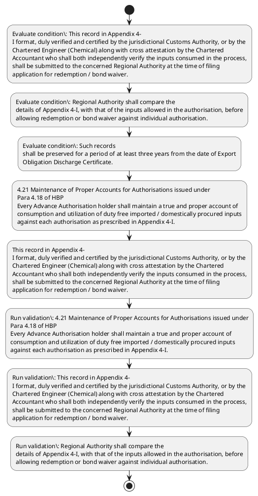

# Chapter 4 / Section 4.21: Maintenance of Proper Accounts for Authorisations issued under

**Chapter Title:** Duty Exemption / Remission Schemes

**Pages:** 12

**Purpose:** 4.21 Maintenance of Proper Accounts for Authorisations issued under
Para 4.18 of HBP
Every Advance Authorisation holder shall maintain a true and proper account of
consumption and utilization of duty free imported / domestically procured inputs
against each authorisation as prescribed in Appendix 4-I.

**Purpose Thanglish:** Indha Maintenance of Proper Accounts for Authorisations issued under section-la, 4.21 Maintenance of Proper Accounts for Authorisations issued under
Para 4.18 of HBP
Every Advance Authorisation holder kandippa maintain a true and proper account of
consumption and utilization of duty free imported / domestically procured inputs
against each authorisation as prescribed in Appendix 4-I.

**Summary:** 4.21 Maintenance of Proper Accounts for Authorisations issued under
Para 4.18 of HBP
Every Advance Authorisation holder shall maintain a true and proper account of
consumption and utilization of duty free imported / domestically procured inputs
against each authorisation as prescribed in Appendix 4-I. This record in Appendix 4-
I format, duly verified and certified by the jurisdictional Customs Authority, or by the
Chartered Engineer (Chemical) along with cross attestation by the Chartered
Accountant who shall both independently verify the inputs consumed in the process,
shall be submitted to the concerned Regional Authority at the time of filing
application for redemption / bond waiver. Regional Authority shall compare the
details of Appendix 4-I, with that of the inputs allowed in the authorisation, before
allowing redemption or bond waiver against individual authorisation.

**Business Meaning:** Maintenance of Proper Accounts for Authorisations issued under governs how DGFT business controls should be applied, validated, and enforced.

**Business Explanation:** Maintenance of Proper Accounts for Authorisations issued under explains the operating rule set that DEKAI should enforce. Key control points include 4.21 Maintenance of Proper Accounts for Authorisations issued under
Para 4.18 of HBP
Every Advance Authorisation holder shall maintain a true and proper account of
consumption and utilization of duty free imported / domestically procured inputs
against each authorisation as prescribed in Appendix 4-I. The section also drives actions such as 4.21 Maintenance of Proper Accounts for Authorisations issued under
Para 4.18 of HBP
Every Advance Authorisation holder shall maintain a true and proper account of
consumption and utilization of duty free imported / domestically procured inputs
against each authorisation as prescribed in Appendix 4-I..

**Business Explanation Thanglish:** Indha Maintenance of Proper Accounts for Authorisations issued under section-la, Maintenance of Proper Accounts for Authorisations issued under explains the operating rule set that DEKAI should enforce. Key control points include 4.21 Maintenance of Proper Accounts for Authorisations issued under
Para 4.18 of HBP
Every Advance Authorisation holder kandippa maintain a true and proper account of
consumption and utilization of duty free imported / domestically procured inputs
against each authorisation as prescribed in Appendix 4-I. The section also drives actions such as 4.21 Maintenance of Proper Accounts for Authorisations issued under
Para 4.18 of HBP
Every Advance Authorisation holder kandippa maintain a true and proper account of
consumption and utilization of duty free imported / domestically procured inputs
against each authorisation as prescribed in Appendix 4-I..

## Business Logic
- 4.21 Maintenance of Proper Accounts for Authorisations issued under
Para 4.18 of HBP
Every Advance Authorisation holder shall maintain a true and proper account of
consumption and utilization of duty free imported / domestically procured inputs
against each authorisation as prescribed in Appendix 4-I.
- This record in Appendix 4-
I format, duly verified and certified by the jurisdictional Customs Authority, or by the
Chartered Engineer (Chemical) along with cross attestation by the Chartered
Accountant who shall both independently verify the inputs consumed in the process,
shall be submitted to the concerned Regional Authority at the time of filing
application for redemption / bond waiver.
- Regional Authority shall compare the
details of Appendix 4-I, with that of the inputs allowed in the authorisation, before
allowing redemption or bond waiver against individual authorisation.
- Such records
shall be preserved for a period of at least three years from the date of Export
Obligation Discharge Certificate.

## Business Rules
- rule_id=CH4-SEC4_21-R001, rule_description=4.21 Maintenance of Proper Accounts for Authorisations issued under
Para 4.18 of HBP
Every Advance Authorisation holder shall maintain a true and proper account of
consumption and utilization of duty free imported / domestically procured inputs
against each authorisation as prescribed in Appendix 4-I., trigger=Maintenance of Proper Accounts for Authorisations issued under, condition=This record in Appendix 4-
I format, duly verified and certified by the jurisdictional Customs Authority, or by the
Chartered Engineer (Chemical) along with cross attestation by the Chartered
Accountant who shall both independently verify the inputs consumed in the process,
shall be submitted to the concerned Regional Authority at the time of filing
application for redemption / bond waiver., validation=4.21 Maintenance of Proper Accounts for Authorisations issued under
Para 4.18 of HBP
Every Advance Authorisation holder shall maintain a true and proper account of
consumption and utilization of duty free imported / domestically procured inputs
against each authorisation as prescribed in Appendix 4-I., action=4.21 Maintenance of Proper Accounts for Authorisations issued under
Para 4.18 of HBP
Every Advance Authorisation holder shall maintain a true and proper account of
consumption and utilization of duty free imported / domestically procured inputs
against each authorisation as prescribed in Appendix 4-I., exception=No explicit exception found in uploaded documents., output=DEKAI should produce a compliance decision for 4.21 - Maintenance of Proper Accounts for Authorisations issued under.
- rule_id=CH4-SEC4_21-R002, rule_description=This record in Appendix 4-
I format, duly verified and certified by the jurisdictional Customs Authority, or by the
Chartered Engineer (Chemical) along with cross attestation by the Chartered
Accountant who shall both independently verify the inputs consumed in the process,
shall be submitted to the concerned Regional Authority at the time of filing
application for redemption / bond waiver., trigger=Maintenance of Proper Accounts for Authorisations issued under, condition=Regional Authority shall compare the
details of Appendix 4-I, with that of the inputs allowed in the authorisation, before
allowing redemption or bond waiver against individual authorisation., validation=This record in Appendix 4-
I format, duly verified and certified by the jurisdictional Customs Authority, or by the
Chartered Engineer (Chemical) along with cross attestation by the Chartered
Accountant who shall both independently verify the inputs consumed in the process,
shall be submitted to the concerned Regional Authority at the time of filing
application for redemption / bond waiver., action=This record in Appendix 4-
I format, duly verified and certified by the jurisdictional Customs Authority, or by the
Chartered Engineer (Chemical) along with cross attestation by the Chartered
Accountant who shall both independently verify the inputs consumed in the process,
shall be submitted to the concerned Regional Authority at the time of filing
application for redemption / bond waiver., exception=No explicit exception found in uploaded documents., output=DEKAI should produce a compliance decision for 4.21 - Maintenance of Proper Accounts for Authorisations issued under.
- rule_id=CH4-SEC4_21-R003, rule_description=Regional Authority shall compare the
details of Appendix 4-I, with that of the inputs allowed in the authorisation, before
allowing redemption or bond waiver against individual authorisation., trigger=Maintenance of Proper Accounts for Authorisations issued under, condition=Such records
shall be preserved for a period of at least three years from the date of Export
Obligation Discharge Certificate., validation=Regional Authority shall compare the
details of Appendix 4-I, with that of the inputs allowed in the authorisation, before
allowing redemption or bond waiver against individual authorisation., action=This record in Appendix 4-
I format, duly verified and certified by the jurisdictional Customs Authority, or by the
Chartered Engineer (Chemical) along with cross attestation by the Chartered
Accountant who shall both independently verify the inputs consumed in the process,
shall be submitted to the concerned Regional Authority at the time of filing
application for redemption / bond waiver., exception=No explicit exception found in uploaded documents., output=DEKAI should produce a compliance decision for 4.21 - Maintenance of Proper Accounts for Authorisations issued under.
- rule_id=CH4-SEC4_21-R004, rule_description=Such records
shall be preserved for a period of at least three years from the date of Export
Obligation Discharge Certificate., trigger=Maintenance of Proper Accounts for Authorisations issued under, condition=Such records
shall be preserved for a period of at least three years from the date of Export
Obligation Discharge Certificate., validation=Such records
shall be preserved for a period of at least three years from the date of Export
Obligation Discharge Certificate., action=This record in Appendix 4-
I format, duly verified and certified by the jurisdictional Customs Authority, or by the
Chartered Engineer (Chemical) along with cross attestation by the Chartered
Accountant who shall both independently verify the inputs consumed in the process,
shall be submitted to the concerned Regional Authority at the time of filing
application for redemption / bond waiver., exception=No explicit exception found in uploaded documents., output=DEKAI should produce a compliance decision for 4.21 - Maintenance of Proper Accounts for Authorisations issued under.

## Conditions
- This record in Appendix 4-
I format, duly verified and certified by the jurisdictional Customs Authority, or by the
Chartered Engineer (Chemical) along with cross attestation by the Chartered
Accountant who shall both independently verify the inputs consumed in the process,
shall be submitted to the concerned Regional Authority at the time of filing
application for redemption / bond waiver.
- Regional Authority shall compare the
details of Appendix 4-I, with that of the inputs allowed in the authorisation, before
allowing redemption or bond waiver against individual authorisation.
- Such records
shall be preserved for a period of at least three years from the date of Export
Obligation Discharge Certificate.

## Condition Logic
- id=4.4.21.1, if=This record in Appendix 4-
I format, duly verified and certified by the jurisdictional Customs Authority, or by the
Chartered Engineer (Chemical) along with cross attestation by the Chartered
Accountant who shall both independently verify the inputs consumed in the process,
shall be submitted to the concerned Regional Authority at the time of filing
application for redemption / bond waiver., then=4.21 Maintenance of Proper Accounts for Authorisations issued under
Para 4.18 of HBP
Every Advance Authorisation holder shall maintain a true and proper account of
consumption and utilization of duty free imported / domestically procured inputs
against each authorisation as prescribed in Appendix 4-I., source=This record in Appendix 4-
I format, duly verified and certified by the jurisdictional Customs Authority, or by the
Chartered Engineer (Chemical) along with cross attestation by the Chartered
Accountant who shall both independently verify the inputs consumed in the process,
shall be submitted to the concerned Regional Authority at the time of filing
application for redemption / bond waiver.
- id=4.4.21.2, if=Regional Authority shall compare the
details of Appendix 4-I, with that of the inputs allowed in the authorisation, before
allowing redemption or bond waiver against individual authorisation., then=4.21 Maintenance of Proper Accounts for Authorisations issued under
Para 4.18 of HBP
Every Advance Authorisation holder shall maintain a true and proper account of
consumption and utilization of duty free imported / domestically procured inputs
against each authorisation as prescribed in Appendix 4-I., source=Regional Authority shall compare the
details of Appendix 4-I, with that of the inputs allowed in the authorisation, before
allowing redemption or bond waiver against individual authorisation.
- id=4.4.21.3, if=Such records
shall be preserved for a period of at least three years from the date of Export
Obligation Discharge Certificate., then=4.21 Maintenance of Proper Accounts for Authorisations issued under
Para 4.18 of HBP
Every Advance Authorisation holder shall maintain a true and proper account of
consumption and utilization of duty free imported / domestically procured inputs
against each authorisation as prescribed in Appendix 4-I., source=Such records
shall be preserved for a period of at least three years from the date of Export
Obligation Discharge Certificate.

## Validations
- 4.21 Maintenance of Proper Accounts for Authorisations issued under
Para 4.18 of HBP
Every Advance Authorisation holder shall maintain a true and proper account of
consumption and utilization of duty free imported / domestically procured inputs
against each authorisation as prescribed in Appendix 4-I.
- This record in Appendix 4-
I format, duly verified and certified by the jurisdictional Customs Authority, or by the
Chartered Engineer (Chemical) along with cross attestation by the Chartered
Accountant who shall both independently verify the inputs consumed in the process,
shall be submitted to the concerned Regional Authority at the time of filing
application for redemption / bond waiver.
- Regional Authority shall compare the
details of Appendix 4-I, with that of the inputs allowed in the authorisation, before
allowing redemption or bond waiver against individual authorisation.
- Such records
shall be preserved for a period of at least three years from the date of Export
Obligation Discharge Certificate.

## Exceptions
- None identified

## Dependencies
- 4.18

## Authorities
- Regional Authority
- Customs
- Customs Authority

## Required Documents
- This record in Appendix 4-
I format, duly verified and certified by the jurisdictional Customs Authority, or by the
Chartered Engineer (Chemical) along with cross attestation by the Chartered
Accountant who shall both independently verify the inputs consumed in the process,
shall be submitted to the concerned Regional Authority at the time of filing
application for redemption / bond waiver.
- Obligation Discharge Certificate

## Timelines
- Regional Authority shall compare the
details of Appendix 4-I, with that of the inputs allowed in the authorisation, before
allowing redemption or bond waiver against individual authorisation.
- Such records
shall be preserved for a period of at least three years from the date of Export
Obligation Discharge Certificate.

## Actions
- 4.21 Maintenance of Proper Accounts for Authorisations issued under
Para 4.18 of HBP
Every Advance Authorisation holder shall maintain a true and proper account of
consumption and utilization of duty free imported / domestically procured inputs
against each authorisation as prescribed in Appendix 4-I.
- This record in Appendix 4-
I format, duly verified and certified by the jurisdictional Customs Authority, or by the
Chartered Engineer (Chemical) along with cross attestation by the Chartered
Accountant who shall both independently verify the inputs consumed in the process,
shall be submitted to the concerned Regional Authority at the time of filing
application for redemption / bond waiver.

## Workflow
- Evaluate condition: This record in Appendix 4-
I format, duly verified and certified by the jurisdictional Customs Authority, or by the
Chartered Engineer (Chemical) along with cross attestation by the Chartered
Accountant who shall both independently verify the inputs consumed in the process,
shall be submitted to the concerned Regional Authority at the time of filing
application for redemption / bond waiver.
- Evaluate condition: Regional Authority shall compare the
details of Appendix 4-I, with that of the inputs allowed in the authorisation, before
allowing redemption or bond waiver against individual authorisation.
- Evaluate condition: Such records
shall be preserved for a period of at least three years from the date of Export
Obligation Discharge Certificate.
- 4.21 Maintenance of Proper Accounts for Authorisations issued under
Para 4.18 of HBP
Every Advance Authorisation holder shall maintain a true and proper account of
consumption and utilization of duty free imported / domestically procured inputs
against each authorisation as prescribed in Appendix 4-I.
- This record in Appendix 4-
I format, duly verified and certified by the jurisdictional Customs Authority, or by the
Chartered Engineer (Chemical) along with cross attestation by the Chartered
Accountant who shall both independently verify the inputs consumed in the process,
shall be submitted to the concerned Regional Authority at the time of filing
application for redemption / bond waiver.
- Run validation: 4.21 Maintenance of Proper Accounts for Authorisations issued under
Para 4.18 of HBP
Every Advance Authorisation holder shall maintain a true and proper account of
consumption and utilization of duty free imported / domestically procured inputs
against each authorisation as prescribed in Appendix 4-I.
- Run validation: This record in Appendix 4-
I format, duly verified and certified by the jurisdictional Customs Authority, or by the
Chartered Engineer (Chemical) along with cross attestation by the Chartered
Accountant who shall both independently verify the inputs consumed in the process,
shall be submitted to the concerned Regional Authority at the time of filing
application for redemption / bond waiver.
- Run validation: Regional Authority shall compare the
details of Appendix 4-I, with that of the inputs allowed in the authorisation, before
allowing redemption or bond waiver against individual authorisation.

## Workflow ASCII
```text
Maintenance of Proper Accounts for Authorisations issued under
Evaluate condition: This record in Appendix 4-
I format, duly verified and certified by the jurisdictional Customs Authority, or by the
Chartered Engineer (Chemical) along with cross attestation by the Chartered
Accountant who shall both independently verify the inputs consumed in the process,
shall be submitted to the concerned Regional Authority at the time of filing
application for redemption / bond waiver.
   |
   v
Evaluate condition: Regional Authority shall compare the
details of Appendix 4-I, with that of the inputs allowed in the authorisation, before
allowing redemption or bond waiver against individual authorisation.
   |
   v
Evaluate condition: Such records
shall be preserved for a period of at least three years from the date of Export
Obligation Discharge Certificate.
   |
   v
4.21 Maintenance of Proper Accounts for Authorisations issued under
Para 4.18 of HBP
Every Advance Authorisation holder shall maintain a true and proper account of
consumption and utilization of duty free imported / domestically procured inputs
against each authorisation as prescribed in Appendix 4-I.
   |
   v
This record in Appendix 4-
I format, duly verified and certified by the jurisdictional Customs Authority, or by the
Chartered Engineer (Chemical) along with cross attestation by the Chartered
Accountant who shall both independently verify the inputs consumed in the process,
shall be submitted to the concerned Regional Authority at the time of filing
application for redemption / bond waiver.
   |
   v
Run validation: 4.21 Maintenance of Proper Accounts for Authorisations issued under
Para 4.18 of HBP
Every Advance Authorisation holder shall maintain a true and proper account of
consumption and utilization of duty free imported / domestically procured inputs
against each authorisation as prescribed in Appendix 4-I.
   |
   v
Run validation: This record in Appendix 4-
I format, duly verified and certified by the jurisdictional Customs Authority, or by the
Chartered Engineer (Chemical) along with cross attestation by the Chartered
Accountant who shall both independently verify the inputs consumed in the process,
shall be submitted to the concerned Regional Authority at the time of filing
application for redemption / bond waiver.
   |
   v
Run validation: Regional Authority shall compare the
details of Appendix 4-I, with that of the inputs allowed in the authorisation, before
allowing redemption or bond waiver against individual authorisation.
```

## Decision Tree
- IF This record in Appendix 4-
I format, duly verified and certified by the jurisdictional Customs Authority, or by the
Chartered Engineer (Chemical) along with cross attestation by the Chartered
Accountant who shall both independently verify the inputs consumed in the process,
shall be submitted to the concerned Regional Authority at the time of filing
application for redemption / bond waiver. THEN 4.21 Maintenance of Proper Accounts for Authorisations issued under
Para 4.18 of HBP
Every Advance Authorisation holder shall maintain a true and proper account of
consumption and utilization of duty free imported / domestically procured inputs
against each authorisation as prescribed in Appendix 4-I.
- IF Regional Authority shall compare the
details of Appendix 4-I, with that of the inputs allowed in the authorisation, before
allowing redemption or bond waiver against individual authorisation. THEN 4.21 Maintenance of Proper Accounts for Authorisations issued under
Para 4.18 of HBP
Every Advance Authorisation holder shall maintain a true and proper account of
consumption and utilization of duty free imported / domestically procured inputs
against each authorisation as prescribed in Appendix 4-I.
- IF Such records
shall be preserved for a period of at least three years from the date of Export
Obligation Discharge Certificate. THEN 4.21 Maintenance of Proper Accounts for Authorisations issued under
Para 4.18 of HBP
Every Advance Authorisation holder shall maintain a true and proper account of
consumption and utilization of duty free imported / domestically procured inputs
against each authorisation as prescribed in Appendix 4-I.

## Decision Tree ASCII
```text
Maintenance of Proper Accounts for Authorisations issued under Decision
IF This record in Appendix 4-
I format, duly verified and certified by the jurisdictional Customs Authority, or by the
Chartered Engineer (Chemical) along with cross attestation by the Chartered
Accountant who shall both independently verify the inputs consumed in the process,
shall be submitted to the concerned Regional Authority at the time of filing
application for redemption / bond waiver. THEN 4.21 Maintenance of Proper Accounts for Authorisations issued under
Para 4.18 of HBP
Every Advance Authorisation holder shall maintain a true and proper account of
consumption and utilization of duty free imported / domestically procured inputs
against each authorisation as prescribed in Appendix 4-I.
   |
   v
IF Regional Authority shall compare the
details of Appendix 4-I, with that of the inputs allowed in the authorisation, before
allowing redemption or bond waiver against individual authorisation. THEN 4.21 Maintenance of Proper Accounts for Authorisations issued under
Para 4.18 of HBP
Every Advance Authorisation holder shall maintain a true and proper account of
consumption and utilization of duty free imported / domestically procured inputs
against each authorisation as prescribed in Appendix 4-I.
   |
   v
IF Such records
shall be preserved for a period of at least three years from the date of Export
Obligation Discharge Certificate. THEN 4.21 Maintenance of Proper Accounts for Authorisations issued under
Para 4.18 of HBP
Every Advance Authorisation holder shall maintain a true and proper account of
consumption and utilization of duty free imported / domestically procured inputs
against each authorisation as prescribed in Appendix 4-I.
```

## Examples
- User asks to process Maintenance of Proper Accounts for Authorisations issued under; the platform checks conditions, validations, and documents before action.

**Real-world Example:** Example: an importer or exporter invokes Maintenance of Proper Accounts for Authorisations issued under, submits This record in Appendix 4-
I format, duly verified and certified by the jurisdictional Customs Authority, or by the
Chartered Engineer (Chemical) along with cross attestation by the Chartered
Accountant who shall both independently verify the inputs consumed in the process,
shall be submitted to the concerned Regional Authority at the time of filing
application for redemption / bond waiver., Obligation Discharge Certificate, and DEKAI uses the extracted rules to 4.21 maintenance of proper accounts for authorisations issued under
para 4.18 of hbp
every advance authorisation holder shall maintain a true and proper account of
consumption and utilization of duty free imported / domestically procured inputs
against each authorisation as prescribed in appendix 4-i..

**Real-world Example Thanglish:** Indha Maintenance of Proper Accounts for Authorisations issued under section-la, Example: an importer or exporter invokes Maintenance of Proper Accounts for Authorisations issued under, submits This record in Appendix 4-
I format, duly verified and certified by the jurisdictional Customs authority, or by the
Chartered Engineer (Chemical) along with cross attestation by the Chartered
Accountant who kandippa both independently verify the inputs consumed in the process,
kandippa be submitted to the concerned Regional authority at the time of filing
application for redemption / bond waiver., Obligation Discharge Certificate, and DEKAI uses the extracted rules to 4.21 maintenance of proper accounts for authorisations issued under
para 4.18 of hbp
every advance authorisation holder kandippa maintain a true and proper account of
consumption and utilization of duty free imported / domestically procured inputs
against each authorisation as prescribed in appendix 4-i..

## AI Rules
- IF detected context matches section rule THEN enforce: 4.21 Maintenance of Proper Accounts for Authorisations issued under
Para 4.18 of HBP
Every Advance Authorisation holder shall maintain a true and proper account of
consumption and utilization of duty free imported / domestically procured inputs
against each authorisation as prescribed in Appendix 4-I.
- IF detected context matches section rule THEN enforce: This record in Appendix 4-
I format, duly verified and certified by the jurisdictional Customs Authority, or by the
Chartered Engineer (Chemical) along with cross attestation by the Chartered
Accountant who shall both independently verify the inputs consumed in the process,
shall be submitted to the concerned Regional Authority at the time of filing
application for redemption / bond waiver.
- IF detected context matches section rule THEN enforce: Regional Authority shall compare the
details of Appendix 4-I, with that of the inputs allowed in the authorisation, before
allowing redemption or bond waiver against individual authorisation.
- IF detected context matches section rule THEN enforce: Such records
shall be preserved for a period of at least three years from the date of Export
Obligation Discharge Certificate.
- IF validations pass THEN recommend action: 4.21 Maintenance of Proper Accounts for Authorisations issued under
Para 4.18 of HBP
Every Advance Authorisation holder shall maintain a true and proper account of
consumption and utilization of duty free imported / domestically procured inputs
against each authorisation as prescribed in Appendix 4-I.

## Database Fields
- name=section_code, type=string, required=True, source=parsed_section_heading
- name=section_title, type=string, required=True, source=parsed_section_heading
- name=for_flag, type=boolean, required=False, source=keyword:for
- name=hbp_flag, type=boolean, required=False, source=keyword:HBP
- name=and_flag, type=boolean, required=False, source=keyword:and
- name=the_flag, type=boolean, required=False, source=keyword:the
- name=who_flag, type=boolean, required=False, source=keyword:who
- name=para_flag, type=boolean, required=False, source=keyword:Para
- name=true_flag, type=boolean, required=False, source=keyword:true
- name=duty_flag, type=boolean, required=False, source=keyword:duty
- name=document_1_submitted, type=boolean, required=True, source=This record in Appendix 4-
I format, duly verified and certified by the jurisdictional Customs Authority, or by the
Chartered Engineer (Chemical) along with cross attestation by the Chartered
Accountant who shall both independently verify the inputs consumed in the process,
shall be submitted to the concerned Regional Authority at the time of filing
application for redemption / bond waiver.
- name=document_2_submitted, type=boolean, required=True, source=Obligation Discharge Certificate

## API Requirements
- method=GET, path=/api/dgft/sections/4.21, purpose=Retrieve knowledge payload for section 4.21, query_params=['include=workflow,decision_tree,validations'], response_fields=['section', 'title', 'summary', 'conditions', 'validations', 'exceptions', 'workflow', 'decision_tree']
- method=POST, path=/api/dgft/Maintenance-of-Proper-Accounts-for-Authorisations-issued-under/validate, purpose=Validate inputs and documents for Maintenance of Proper Accounts for Authorisations issued under, request_fields=['section_code', 'section_title', 'document_1_submitted', 'document_2_submitted'], response_fields=['status', 'errors', 'warnings', 'next_actions']
- method=POST, path=/api/dgft/Maintenance-of-Proper-Accounts-for-Authorisations-issued-under/execute, purpose=Trigger business action for 4.21 Maintenance of Proper Accounts for Authorisations issued under
Para 4.18 of HBP
Every Advance Authorisation holder shall maintain a true and proper account of
consumption and utilization of duty free imported / domestically procured inputs
against each authorisation as prescribed in Appendix 4-I., request_fields=['section_code', 'section_title', 'document_1_submitted', 'document_2_submitted'], response_fields=['reference_id', 'status', 'authority', 'timeline']

## UI Screens
- screen_id=Maintenance_of_Proper_Accounts_for_Authorisations_issued_under_overview, name=Maintenance of Proper Accounts for Authorisations issued under Overview, purpose=Show section summary, authority, timeline, and eligibility cues., widgets=['summary_card', 'conditions_table', 'authority_badges', 'timeline_panel']
- screen_id=Maintenance_of_Proper_Accounts_for_Authorisations_issued_under_submission, name=Maintenance of Proper Accounts for Authorisations issued under Submission, purpose=Capture applicant data and supporting documents., widgets=['dynamic_form', 'document_uploader', 'validation_panel', 'next_action_footer'], fields=['section_code', 'section_title', 'for_flag', 'hbp_flag', 'and_flag', 'the_flag', 'who_flag', 'para_flag']

## Error Messages
- Validation failed because the section requirements were not fully met.

## FAQ
- question_en=What is the purpose of section 4.21?, answer_en=Maintenance of Proper Accounts for Authorisations issued under explains the operating rule set that DEKAI should enforce. Key control points include 4.21 Maintenance of Proper Accounts for Authorisations issued under
Para 4.18 of HBP
Every Advance Authorisation holder shall maintain a true and proper account of
consumption and utilization of duty free imported / domestically procured inputs
against each authorisation as prescribed in Appendix 4-I. The section also drives actions such as 4.21 Maintenance of Proper Accounts for Authorisations issued under
Para 4.18 of HBP
Every Advance Authorisation holder shall maintain a true and proper account of
consumption and utilization of duty free imported / domestically procured inputs
against each authorisation as prescribed in Appendix 4-I.., question_thanglish=Indha Maintenance of Proper Accounts for Authorisations issued under section-la, What is the purpose of section 4.21?, answer_thanglish=Indha Maintenance of Proper Accounts for Authorisations issued under section-la, Maintenance of Proper Accounts for Authorisations issued under explains the operating rule set that DEKAI should enforce. Key control points include 4.21 Maintenance of Proper Accounts for Authorisations issued under
Para 4.18 of HBP
Every Advance Authorisation holder kandippa maintain a true and proper account of
consumption and utilization of duty free imported / domestically procured inputs
against each authorisation as prescribed in Appendix 4-I. The section also drives actions such as 4.21 Maintenance of Proper Accounts for Authorisations issued under
Para 4.18 of HBP
Every Advance Authorisation holder kandippa maintain a true and proper account of
consumption and utilization of duty free imported / domestically procured inputs
against each authorisation as prescribed in Appendix 4-I..
- question_en=What documents are required under Maintenance of Proper Accounts for Authorisations issued under?, answer_en=This record in Appendix 4-
I format, duly verified and certified by the jurisdictional Customs Authority, or by the
Chartered Engineer (Chemical) along with cross attestation by the Chartered
Accountant who shall both independently verify the inputs consumed in the process,
shall be submitted to the concerned Regional Authority at the time of filing
application for redemption / bond waiver., Obligation Discharge Certificate, question_thanglish=Indha Maintenance of Proper Accounts for Authorisations issued under section-la, What documents are required under Maintenance of Proper Accounts for Authorisations issued under?, answer_thanglish=Indha Maintenance of Proper Accounts for Authorisations issued under section-la, This record in Appendix 4-
I format, duly verified and certified by the jurisdictional Customs authority, or by the
Chartered Engineer (Chemical) along with cross attestation by the Chartered
Accountant who kandippa both independently verify the inputs consumed in the process,
kandippa be submitted to the concerned Regional authority at the time of filing
application for redemption / bond waiver., Obligation Discharge Certificate
- question_en=Which authority handles Maintenance of Proper Accounts for Authorisations issued under?, answer_en=Regional Authority, Customs, Customs Authority, question_thanglish=Indha Maintenance of Proper Accounts for Authorisations issued under section-la, Which authority handles Maintenance of Proper Accounts for Authorisations issued under?, answer_thanglish=Indha Maintenance of Proper Accounts for Authorisations issued under section-la, Regional authority, Customs, Customs authority

## Questions Users May Ask
- What does Maintenance of Proper Accounts for Authorisations issued under require?
- Which documents are needed for Maintenance of Proper Accounts for Authorisations issued under?
- How does DEKAI validate Maintenance of Proper Accounts for Authorisations issued under requests?
- What action should be taken for Maintenance of Proper Accounts for Authorisations issued under?

## Expected AI Answers
- Maintenance of Proper Accounts for Authorisations issued under requires the platform to interpret the section text, apply the extracted business rules, and present the correct next action.
- Required documents are inferred from the section text: This record in Appendix 4-
I format, duly verified and certified by the jurisdictional Customs Authority, or by the
Chartered Engineer (Chemical) along with cross attestation by the Chartered
Accountant who shall both independently verify the inputs consumed in the process,
shall be submitted to the concerned Regional Authority at the time of filing
application for redemption / bond waiver., Obligation Discharge Certificate
- DEKAI validates Maintenance of Proper Accounts for Authorisations issued under by checking conditions, required documents, authority references, and exception clauses before recommending an outcome.
- The primary extracted action is: 4.21 Maintenance of Proper Accounts for Authorisations issued under
Para 4.18 of HBP
Every Advance Authorisation holder shall maintain a true and proper account of
consumption and utilization of duty free imported / domestically procured inputs
against each authorisation as prescribed in Appendix 4-I.

## AI Q&A Examples
- question_en=User asks: How do I comply with Maintenance of Proper Accounts for Authorisations issued under?, answer_en=AI answers: DEKAI should evaluate section 4.21, apply the extracted rules, and guide the user through Evaluate condition: This record in Appendix 4-
I format, duly verified and certified by the jurisdictional Customs Authority, or by the
Chartered Engineer (Chemical) along with cross attestation by the Chartered
Accountant who shall both independently verify the inputs consumed in the process,
shall be submitted to the concerned Regional Authority at the time of filing
application for redemption / bond waiver.., question_thanglish=Indha Maintenance of Proper Accounts for Authorisations issued under section-la, User asks: How do I comply with Maintenance of Proper Accounts for Authorisations issued under?, answer_thanglish=Indha Maintenance of Proper Accounts for Authorisations issued under section-la, AI answers: DEKAI should evaluate section 4.21, apply the extracted rules, and guide the user through Evaluate condition: This record in Appendix 4-
I format, duly verified and certified by the jurisdictional Customs authority, or by the
Chartered Engineer (Chemical) along with cross attestation by the Chartered
Accountant who kandippa both independently verify the inputs consumed in the process,
kandippa be submitted to the concerned Regional authority at the time of filing
application for redemption / bond waiver..
- question_en=User asks: Which validations apply to Maintenance of Proper Accounts for Authorisations issued under?, answer_en=AI answers: Applicable validations are 4.21 Maintenance of Proper Accounts for Authorisations issued under
Para 4.18 of HBP
Every Advance Authorisation holder shall maintain a true and proper account of
consumption and utilization of duty free imported / domestically procured inputs
against each authorisation as prescribed in Appendix 4-I., This record in Appendix 4-
I format, duly verified and certified by the jurisdictional Customs Authority, or by the
Chartered Engineer (Chemical) along with cross attestation by the Chartered
Accountant who shall both independently verify the inputs consumed in the process,
shall be submitted to the concerned Regional Authority at the time of filing
application for redemption / bond waiver., Regional Authority shall compare the
details of Appendix 4-I, with that of the inputs allowed in the authorisation, before
allowing redemption or bond waiver against individual authorisation., question_thanglish=Indha Maintenance of Proper Accounts for Authorisations issued under section-la, User asks: Which validations apply to Maintenance of Proper Accounts for Authorisations issued under?, answer_thanglish=Indha Maintenance of Proper Accounts for Authorisations issued under section-la, AI answers: Applicable validations are 4.21 Maintenance of Proper Accounts for Authorisations issued under
Para 4.18 of HBP
Every Advance Authorisation holder kandippa maintain a true and proper account of
consumption and utilization of duty free imported / domestically procured inputs
against each authorisation as prescribed in Appendix 4-I., This record in Appendix 4-
I format, duly verified and certified by the jurisdictional Customs authority, or by the
Chartered Engineer (Chemical) along with cross attestation by the Chartered
Accountant who kandippa both independently verify the inputs consumed in the process,
kandippa be submitted to the concerned Regional authority at the time of filing
application for redemption / bond waiver., Regional authority kandippa compare the
details of Appendix 4-I, with that of the inputs allowed in the authorisation, before
allowing redemption or bond waiver against individual authorisation.

## DEKAI AI Implementation Notes
- Capture chapter 4, section 4.21, title, and page references as immutable knowledge metadata.
- Bind validations for Maintenance of Proper Accounts for Authorisations issued under into a rule engine keyed by the rule IDs extracted for this section.
- Expose document upload controls for: This record in Appendix 4-
I format, duly verified and certified by the jurisdictional Customs Authority, or by the
Chartered Engineer (Chemical) along with cross attestation by the Chartered
Accountant who shall both independently verify the inputs consumed in the process,
shall be submitted to the concerned Regional Authority at the time of filing
application for redemption / bond waiver., Obligation Discharge Certificate.
- Route escalations or approvals to: Regional Authority, Customs, Customs Authority.
- Show contextual links to related sections: 4.18.

## DEKAI AI Implementation Notes Thanglish
- Indha Maintenance of Proper Accounts for Authorisations issued under section-la, Capture chapter 4, section 4.21, title, and page references as immutable knowledge metadata.
- Indha Maintenance of Proper Accounts for Authorisations issued under section-la, Bind validations for Maintenance of Proper Accounts for Authorisations issued under into a rule engine keyed by the rule IDs extracted for this section.
- Indha Maintenance of Proper Accounts for Authorisations issued under section-la, Expose document upload controls for: This record in Appendix 4-
I format, duly verified and certified by the jurisdictional Customs authority, or by the
Chartered Engineer (Chemical) along with cross attestation by the Chartered
Accountant who kandippa both independently verify the inputs consumed in the process,
kandippa be submitted to the concerned Regional authority at the time of filing
application for redemption / bond waiver., Obligation Discharge Certificate.
- Indha Maintenance of Proper Accounts for Authorisations issued under section-la, Route escalations or approvals to: Regional authority, Customs, Customs authority.
- Indha Maintenance of Proper Accounts for Authorisations issued under section-la, Show contextual links to related sections: 4.18.

## AI Metadata
- Keywords: for, HBP, and, the, who, Para, true, duty, free, each, This, duly, with, both, time, bond, that, Such, from, date
- Search Keywords: for, HBP, and, the, who, Para, true, duty, free, each, This, duly, with, both, time, bond, that, Such, from, date
- Intent: Support Maintenance of Proper Accounts for Authorisations issued under processing and compliance validation.
- Tags: 4.21, Maintenance of Proper Accounts for Authorisations issued under, business-rule, document-driven, dgft
- Related Sections: 4.18
- Related Chapters: 
- Related Rules: 4.21 Maintenance of Proper Accounts for Authorisations issued under
Para 4.18 of HBP
Every Advance Authorisation holder shall maintain a true and proper account of
consumption and utilization of duty free imported / domestically procured inputs
against each authorisation as prescribed in Appendix 4-I., This record in Appendix 4-
I format, duly verified and certified by the jurisdictional Customs Authority, or by the
Chartered Engineer (Chemical) along with cross attestation by the Chartered
Accountant who shall both independently verify the inputs consumed in the process,
shall be submitted to the concerned Regional Authority at the time of filing
application for redemption / bond waiver., Regional Authority shall compare the
details of Appendix 4-I, with that of the inputs allowed in the authorisation, before
allowing redemption or bond waiver against individual authorisation., Such records
shall be preserved for a period of at least three years from the date of Export
Obligation Discharge Certificate.

## Mermaid

```mermaid
flowchart TD
    S1["Evaluate condition: This record in Appendix 4-
I format, duly verified and certified by the jurisdictional Customs Authority, or by the
Chartered Engineer (Chemical) along with cross attestation by the Chartered
Accountant who shall both independently verify the inputs consumed in the process,
shall be submitted to the concerned Regional Authority at the time of filing
application for redemption / bond waiver."]
    S2["Evaluate condition: Regional Authority shall compare the
details of Appendix 4-I, with that of the inputs allowed in the authorisation, before
allowing redemption or bond waiver against individual authorisation."]
    S1 --> S2
    S3["Evaluate condition: Such records
shall be preserved for a period of at least three years from the date of Export
Obligation Discharge Certificate."]
    S2 --> S3
    S4["4.21 Maintenance of Proper Accounts for Authorisations issued under
Para 4.18 of HBP
Every Advance Authorisation holder shall maintain a true and proper account of
consumption and utilization of duty free imported / domestically procured inputs
against each authorisation as prescribed in Appendix 4-I."]
    S3 --> S4
    S5["This record in Appendix 4-
I format, duly verified and certified by the jurisdictional Customs Authority, or by the
Chartered Engineer (Chemical) along with cross attestation by the Chartered
Accountant who shall both independently verify the inputs consumed in the process,
shall be submitted to the concerned Regional Authority at the time of filing
application for redemption / bond waiver."]
    S4 --> S5
    S6["Run validation: 4.21 Maintenance of Proper Accounts for Authorisations issued under
Para 4.18 of HBP
Every Advance Authorisation holder shall maintain a true and proper account of
consumption and utilization of duty free imported / domestically procured inputs
against each authorisation as prescribed in Appendix 4-I."]
    S5 --> S6
    S7["Run validation: This record in Appendix 4-
I format, duly verified and certified by the jurisdictional Customs Authority, or by the
Chartered Engineer (Chemical) along with cross attestation by the Chartered
Accountant who shall both independently verify the inputs consumed in the process,
shall be submitted to the concerned Regional Authority at the time of filing
application for redemption / bond waiver."]
    S6 --> S7
    S8["Run validation: Regional Authority shall compare the
details of Appendix 4-I, with that of the inputs allowed in the authorisation, before
allowing redemption or bond waiver against individual authorisation."]
    S7 --> S8
```


## PlantUML

