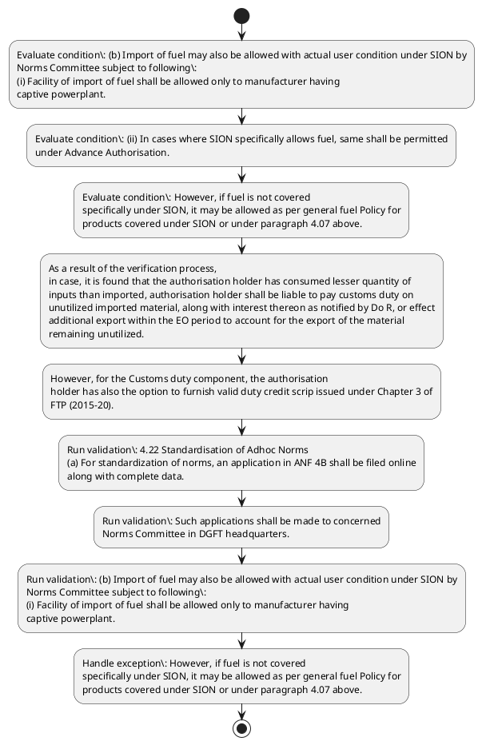

# Chapter 4 / Section 4.22: Standardisation of Adhoc Norms

**Chapter Title:** Duty Exemption / Remission Schemes

**Pages:** 12, 13

**Purpose:** 4.22 Standardisation of Adhoc Norms
(a) For standardization of norms, an application in ANF 4B shall be filed online
along with complete data.

**Purpose Thanglish:** Indha Standardisation of Adhoc Norms section-la, 4.22 Standardisation of Adhoc Norms
(a) For standardization of norms, an application in ANF 4B kandippa be filed online
along with complete data.

**Summary:** 4.22 Standardisation of Adhoc Norms
(a) For standardization of norms, an application in ANF 4B shall be filed online
along with complete data. Such applications shall be made to concerned
Norms Committee in DGFT headquarters. (b) Import of fuel may also be allowed with actual user condition under SION by
Norms Committee subject to following:
(i) Facility of import of fuel shall be allowed only to manufacturer having
captive powerplant.

**Business Meaning:** Standardisation of Adhoc Norms governs how DGFT business controls should be applied, validated, and enforced.

**Business Explanation:** Standardisation of Adhoc Norms explains the operating rule set that DEKAI should enforce. Key control points include 4.22 Standardisation of Adhoc Norms
(a) For standardization of norms, an application in ANF 4B shall be filed online
along with complete data. The section also drives actions such as As a result of the verification process,
in case, it is found that the authorisation holder has consumed lesser quantity of
inputs than imported, authorisation holder shall be liable to pay customs duty on
unutilized imported material, along with interest thereon as notified by Do R, or effect
additional export within the EO period to account for the export of the material
remaining unutilized..

**Business Explanation Thanglish:** Indha Standardisation of Adhoc Norms section-la, Standardisation of Adhoc Norms explains the operating rule set that DEKAI should enforce. Key control points include 4.22 Standardisation of Adhoc Norms
(a) For standardization of norms, an application in ANF 4B kandippa be filed online
along with complete data. The section also drives actions such as As a result of the verification process,
in case, it is found that the authorisation holder has consumed lesser quantity of
inputs than imported, authorisation holder kandippa be liable to pay customs duty on
unutilized imported material, along with interest thereon as notified by Do R, or effect
additional export within the EO period to account for the export of the material
remaining unutilized..

## Business Logic
- 4.22 Standardisation of Adhoc Norms
(a) For standardization of norms, an application in ANF 4B shall be filed online
along with complete data.
- Such applications shall be made to concerned
Norms Committee in DGFT headquarters.
- (b) Import of fuel may also be allowed with actual user condition under SION by
Norms Committee subject to following:
(i) Facility of import of fuel shall be allowed only to manufacturer having
captive powerplant.
- (ii) In cases where SION specifically allows fuel, same shall be permitted
under Advance Authorisation.
- (iii) Applications for fixation of fuel entitlement for new sectors and
modification of the existing entitlement as per General Note for Fuel in
Handbook of Procedures shall be filed online to the Norms Committee
pg.
- As a result of the verification process,
in case, it is found that the authorisation holder has consumed lesser quantity of
inputs than imported, authorisation holder shall be liable to pay customs duty on
unutilized imported material, along with interest thereon as notified by Do R, or effect
additional export within the EO period to account for the export of the material
remaining unutilized.
- 4.22 Standardisation of Adhoc Norms
(a)
For standardization of norms, an application in ANF 4B shall be filed online
along with complete data.
- (b)
Import of fuel may also be allowed with actual user condition under SION by
Norms Committee subject to following:
(i)
Facility of import of fuel shall be allowed only to manufacturer having
captive powerplant.
- (ii)
In cases where SION specifically allows fuel, same shall be permitted
under Advance Authorisation.
- (iii)
Applications for fixation of fuel entitlement for new sectors and
modification of the existing entitlement as per General Note for Fuel in
Handbook of Procedures shall be filed online to the Norms Committee
along-with requisite data in ANF 4B.

## Business Rules
- rule_id=CH4-SEC4_22-R001, rule_description=4.22 Standardisation of Adhoc Norms
(a) For standardization of norms, an application in ANF 4B shall be filed online
along with complete data., trigger=Standardisation of Adhoc Norms, condition=(b) Import of fuel may also be allowed with actual user condition under SION by
Norms Committee subject to following:
(i) Facility of import of fuel shall be allowed only to manufacturer having
captive powerplant., validation=4.22 Standardisation of Adhoc Norms
(a) For standardization of norms, an application in ANF 4B shall be filed online
along with complete data., action=As a result of the verification process,
in case, it is found that the authorisation holder has consumed lesser quantity of
inputs than imported, authorisation holder shall be liable to pay customs duty on
unutilized imported material, along with interest thereon as notified by Do R, or effect
additional export within the EO period to account for the export of the material
remaining unutilized., exception=However, if fuel is not covered
specifically under SION, it may be allowed as per general fuel Policy for
products covered under SION or under paragraph 4.07 above., output=DEKAI should produce a compliance decision for 4.22 - Standardisation of Adhoc Norms.
- rule_id=CH4-SEC4_22-R002, rule_description=Such applications shall be made to concerned
Norms Committee in DGFT headquarters., trigger=Standardisation of Adhoc Norms, condition=(ii) In cases where SION specifically allows fuel, same shall be permitted
under Advance Authorisation., validation=Such applications shall be made to concerned
Norms Committee in DGFT headquarters., action=However, for the Customs duty component, the authorisation
holder has also the option to furnish valid duty credit scrip issued under Chapter 3 of
FTP (2015-20)., exception=However, for the Customs duty component, the authorisation
holder has also the option to furnish valid duty credit scrip issued under Chapter 3 of
FTP (2015-20)., output=DEKAI should produce a compliance decision for 4.22 - Standardisation of Adhoc Norms.
- rule_id=CH4-SEC4_22-R003, rule_description=(b) Import of fuel may also be allowed with actual user condition under SION by
Norms Committee subject to following:
(i) Facility of import of fuel shall be allowed only to manufacturer having
captive powerplant., trigger=Standardisation of Adhoc Norms, condition=However, if fuel is not covered
specifically under SION, it may be allowed as per general fuel Policy for
products covered under SION or under paragraph 4.07 above., validation=(b) Import of fuel may also be allowed with actual user condition under SION by
Norms Committee subject to following:
(i) Facility of import of fuel shall be allowed only to manufacturer having
captive powerplant., action=However, for the Customs duty component, the authorisation
holder has also the option to furnish valid duty credit scrip issued under Chapter 3 of
FTP (2015-20)., exception=However, for the Customs duty component, the authorisation
holder has also the option to furnish valid duty credit scrip issued under Chapter 3 of
FTP (2015-20)., output=DEKAI should produce a compliance decision for 4.22 - Standardisation of Adhoc Norms.
- rule_id=CH4-SEC4_22-R004, rule_description=(ii) In cases where SION specifically allows fuel, same shall be permitted
under Advance Authorisation., trigger=Standardisation of Adhoc Norms, condition=(iii) Applications for fixation of fuel entitlement for new sectors and
modification of the existing entitlement as per General Note for Fuel in
Handbook of Procedures shall be filed online to the Norms Committee
pg., validation=(ii) In cases where SION specifically allows fuel, same shall be permitted
under Advance Authorisation., action=However, for the Customs duty component, the authorisation
holder has also the option to furnish valid duty credit scrip issued under Chapter 3 of
FTP (2015-20)., exception=However, for the Customs duty component, the authorisation
holder has also the option to furnish valid duty credit scrip issued under Chapter 3 of
FTP (2015-20)., output=DEKAI should produce a compliance decision for 4.22 - Standardisation of Adhoc Norms.
- rule_id=CH4-SEC4_22-R005, rule_description=(iii) Applications for fixation of fuel entitlement for new sectors and
modification of the existing entitlement as per General Note for Fuel in
Handbook of Procedures shall be filed online to the Norms Committee
pg., trigger=Standardisation of Adhoc Norms, condition=As a result of the verification process,
in case, it is found that the authorisation holder has consumed lesser quantity of
inputs than imported, authorisation holder shall be liable to pay customs duty on
unutilized imported material, along with interest thereon as notified by Do R, or effect
additional export within the EO period to account for the export of the material
remaining unutilized., validation=(iii) Applications for fixation of fuel entitlement for new sectors and
modification of the existing entitlement as per General Note for Fuel in
Handbook of Procedures shall be filed online to the Norms Committee
pg., action=However, for the Customs duty component, the authorisation
holder has also the option to furnish valid duty credit scrip issued under Chapter 3 of
FTP (2015-20)., exception=However, for the Customs duty component, the authorisation
holder has also the option to furnish valid duty credit scrip issued under Chapter 3 of
FTP (2015-20)., output=DEKAI should produce a compliance decision for 4.22 - Standardisation of Adhoc Norms.
- rule_id=CH4-SEC4_22-R006, rule_description=As a result of the verification process,
in case, it is found that the authorisation holder has consumed lesser quantity of
inputs than imported, authorisation holder shall be liable to pay customs duty on
unutilized imported material, along with interest thereon as notified by Do R, or effect
additional export within the EO period to account for the export of the material
remaining unutilized., trigger=Standardisation of Adhoc Norms, condition=(b)
Import of fuel may also be allowed with actual user condition under SION by
Norms Committee subject to following:
(i)
Facility of import of fuel shall be allowed only to manufacturer having
captive powerplant., validation=As a result of the verification process,
in case, it is found that the authorisation holder has consumed lesser quantity of
inputs than imported, authorisation holder shall be liable to pay customs duty on
unutilized imported material, along with interest thereon as notified by Do R, or effect
additional export within the EO period to account for the export of the material
remaining unutilized., action=However, for the Customs duty component, the authorisation
holder has also the option to furnish valid duty credit scrip issued under Chapter 3 of
FTP (2015-20)., exception=However, for the Customs duty component, the authorisation
holder has also the option to furnish valid duty credit scrip issued under Chapter 3 of
FTP (2015-20)., output=DEKAI should produce a compliance decision for 4.22 - Standardisation of Adhoc Norms.
- rule_id=CH4-SEC4_22-R007, rule_description=4.22 Standardisation of Adhoc Norms
(a)
For standardization of norms, an application in ANF 4B shall be filed online
along with complete data., trigger=Standardisation of Adhoc Norms, condition=(ii)
In cases where SION specifically allows fuel, same shall be permitted
under Advance Authorisation., validation=4.22 Standardisation of Adhoc Norms
(a)
For standardization of norms, an application in ANF 4B shall be filed online
along with complete data., action=However, for the Customs duty component, the authorisation
holder has also the option to furnish valid duty credit scrip issued under Chapter 3 of
FTP (2015-20)., exception=However, for the Customs duty component, the authorisation
holder has also the option to furnish valid duty credit scrip issued under Chapter 3 of
FTP (2015-20)., output=DEKAI should produce a compliance decision for 4.22 - Standardisation of Adhoc Norms.
- rule_id=CH4-SEC4_22-R008, rule_description=(b)
Import of fuel may also be allowed with actual user condition under SION by
Norms Committee subject to following:
(i)
Facility of import of fuel shall be allowed only to manufacturer having
captive powerplant., trigger=Standardisation of Adhoc Norms, condition=(iii)
Applications for fixation of fuel entitlement for new sectors and
modification of the existing entitlement as per General Note for Fuel in
Handbook of Procedures shall be filed online to the Norms Committee
along-with requisite data in ANF 4B., validation=(b)
Import of fuel may also be allowed with actual user condition under SION by
Norms Committee subject to following:
(i)
Facility of import of fuel shall be allowed only to manufacturer having
captive powerplant., action=However, for the Customs duty component, the authorisation
holder has also the option to furnish valid duty credit scrip issued under Chapter 3 of
FTP (2015-20)., exception=However, for the Customs duty component, the authorisation
holder has also the option to furnish valid duty credit scrip issued under Chapter 3 of
FTP (2015-20)., output=DEKAI should produce a compliance decision for 4.22 - Standardisation of Adhoc Norms.
- rule_id=CH4-SEC4_22-R009, rule_description=(ii)
In cases where SION specifically allows fuel, same shall be permitted
under Advance Authorisation., trigger=Standardisation of Adhoc Norms, condition=(iii)
Applications for fixation of fuel entitlement for new sectors and
modification of the existing entitlement as per General Note for Fuel in
Handbook of Procedures shall be filed online to the Norms Committee
along-with requisite data in ANF 4B., validation=(ii)
In cases where SION specifically allows fuel, same shall be permitted
under Advance Authorisation., action=However, for the Customs duty component, the authorisation
holder has also the option to furnish valid duty credit scrip issued under Chapter 3 of
FTP (2015-20)., exception=However, for the Customs duty component, the authorisation
holder has also the option to furnish valid duty credit scrip issued under Chapter 3 of
FTP (2015-20)., output=DEKAI should produce a compliance decision for 4.22 - Standardisation of Adhoc Norms.
- rule_id=CH4-SEC4_22-R010, rule_description=(iii)
Applications for fixation of fuel entitlement for new sectors and
modification of the existing entitlement as per General Note for Fuel in
Handbook of Procedures shall be filed online to the Norms Committee
along-with requisite data in ANF 4B., trigger=Standardisation of Adhoc Norms, condition=(iii)
Applications for fixation of fuel entitlement for new sectors and
modification of the existing entitlement as per General Note for Fuel in
Handbook of Procedures shall be filed online to the Norms Committee
along-with requisite data in ANF 4B., validation=(iii)
Applications for fixation of fuel entitlement for new sectors and
modification of the existing entitlement as per General Note for Fuel in
Handbook of Procedures shall be filed online to the Norms Committee
along-with requisite data in ANF 4B., action=However, for the Customs duty component, the authorisation
holder has also the option to furnish valid duty credit scrip issued under Chapter 3 of
FTP (2015-20)., exception=However, for the Customs duty component, the authorisation
holder has also the option to furnish valid duty credit scrip issued under Chapter 3 of
FTP (2015-20)., output=DEKAI should produce a compliance decision for 4.22 - Standardisation of Adhoc Norms.

## Conditions
- (b) Import of fuel may also be allowed with actual user condition under SION by
Norms Committee subject to following:
(i) Facility of import of fuel shall be allowed only to manufacturer having
captive powerplant.
- (ii) In cases where SION specifically allows fuel, same shall be permitted
under Advance Authorisation.
- However, if fuel is not covered
specifically under SION, it may be allowed as per general fuel Policy for
products covered under SION or under paragraph 4.07 above.
- (iii) Applications for fixation of fuel entitlement for new sectors and
modification of the existing entitlement as per General Note for Fuel in
Handbook of Procedures shall be filed online to the Norms Committee
pg.
- As a result of the verification process,
in case, it is found that the authorisation holder has consumed lesser quantity of
inputs than imported, authorisation holder shall be liable to pay customs duty on
unutilized imported material, along with interest thereon as notified by Do R, or effect
additional export within the EO period to account for the export of the material
remaining unutilized.
- (b)
Import of fuel may also be allowed with actual user condition under SION by
Norms Committee subject to following:
(i)
Facility of import of fuel shall be allowed only to manufacturer having
captive powerplant.
- (ii)
In cases where SION specifically allows fuel, same shall be permitted
under Advance Authorisation.
- (iii)
Applications for fixation of fuel entitlement for new sectors and
modification of the existing entitlement as per General Note for Fuel in
Handbook of Procedures shall be filed online to the Norms Committee
along-with requisite data in ANF 4B.

## Condition Logic
- id=4.4.22.1, if=(b) Import of fuel may also be allowed with actual user condition under SION by
Norms Committee subject to following:
(i) Facility of import of fuel shall be allowed only to manufacturer having
captive powerplant., then=As a result of the verification process,
in case, it is found that the authorisation holder has consumed lesser quantity of
inputs than imported, authorisation holder shall be liable to pay customs duty on
unutilized imported material, along with interest thereon as notified by Do R, or effect
additional export within the EO period to account for the export of the material
remaining unutilized., source=(b) Import of fuel may also be allowed with actual user condition under SION by
Norms Committee subject to following:
(i) Facility of import of fuel shall be allowed only to manufacturer having
captive powerplant.
- id=4.4.22.2, if=(ii) In cases where SION specifically allows fuel, same shall be permitted
under Advance Authorisation., then=As a result of the verification process,
in case, it is found that the authorisation holder has consumed lesser quantity of
inputs than imported, authorisation holder shall be liable to pay customs duty on
unutilized imported material, along with interest thereon as notified by Do R, or effect
additional export within the EO period to account for the export of the material
remaining unutilized., source=(ii) In cases where SION specifically allows fuel, same shall be permitted
under Advance Authorisation.
- id=4.4.22.3, if=However, if fuel is not covered
specifically under SION, it may be allowed as per general fuel Policy for
products covered under SION or under paragraph 4.07 above., then=As a result of the verification process,
in case, it is found that the authorisation holder has consumed lesser quantity of
inputs than imported, authorisation holder shall be liable to pay customs duty on
unutilized imported material, along with interest thereon as notified by Do R, or effect
additional export within the EO period to account for the export of the material
remaining unutilized., source=However, if fuel is not covered
specifically under SION, it may be allowed as per general fuel Policy for
products covered under SION or under paragraph 4.07 above.
- id=4.4.22.4, if=(iii) Applications for fixation of fuel entitlement for new sectors and
modification of the existing entitlement as per General Note for Fuel in
Handbook of Procedures shall be filed online to the Norms Committee
pg., then=As a result of the verification process,
in case, it is found that the authorisation holder has consumed lesser quantity of
inputs than imported, authorisation holder shall be liable to pay customs duty on
unutilized imported material, along with interest thereon as notified by Do R, or effect
additional export within the EO period to account for the export of the material
remaining unutilized., source=(iii) Applications for fixation of fuel entitlement for new sectors and
modification of the existing entitlement as per General Note for Fuel in
Handbook of Procedures shall be filed online to the Norms Committee
pg.
- id=4.4.22.5, if=As a result of the verification process,
in case, it is found that the authorisation holder has consumed lesser quantity of
inputs than imported, authorisation holder shall be liable to pay customs duty on
unutilized imported material, along with interest thereon as notified by Do R, or effect
additional export within the EO period to account for the export of the material
remaining unutilized., then=As a result of the verification process,
in case, it is found that the authorisation holder has consumed lesser quantity of
inputs than imported, authorisation holder shall be liable to pay customs duty on
unutilized imported material, along with interest thereon as notified by Do R, or effect
additional export within the EO period to account for the export of the material
remaining unutilized., source=As a result of the verification process,
in case, it is found that the authorisation holder has consumed lesser quantity of
inputs than imported, authorisation holder shall be liable to pay customs duty on
unutilized imported material, along with interest thereon as notified by Do R, or effect
additional export within the EO period to account for the export of the material
remaining unutilized.
- id=4.4.22.6, if=(b)
Import of fuel may also be allowed with actual user condition under SION by
Norms Committee subject to following:
(i)
Facility of import of fuel shall be allowed only to manufacturer having
captive powerplant., then=As a result of the verification process,
in case, it is found that the authorisation holder has consumed lesser quantity of
inputs than imported, authorisation holder shall be liable to pay customs duty on
unutilized imported material, along with interest thereon as notified by Do R, or effect
additional export within the EO period to account for the export of the material
remaining unutilized., source=(b)
Import of fuel may also be allowed with actual user condition under SION by
Norms Committee subject to following:
(i)
Facility of import of fuel shall be allowed only to manufacturer having
captive powerplant.
- id=4.4.22.7, if=(ii)
In cases where SION specifically allows fuel, same shall be permitted
under Advance Authorisation., then=As a result of the verification process,
in case, it is found that the authorisation holder has consumed lesser quantity of
inputs than imported, authorisation holder shall be liable to pay customs duty on
unutilized imported material, along with interest thereon as notified by Do R, or effect
additional export within the EO period to account for the export of the material
remaining unutilized., source=(ii)
In cases where SION specifically allows fuel, same shall be permitted
under Advance Authorisation.
- id=4.4.22.8, if=(iii)
Applications for fixation of fuel entitlement for new sectors and
modification of the existing entitlement as per General Note for Fuel in
Handbook of Procedures shall be filed online to the Norms Committee
along-with requisite data in ANF 4B., then=As a result of the verification process,
in case, it is found that the authorisation holder has consumed lesser quantity of
inputs than imported, authorisation holder shall be liable to pay customs duty on
unutilized imported material, along with interest thereon as notified by Do R, or effect
additional export within the EO period to account for the export of the material
remaining unutilized., source=(iii)
Applications for fixation of fuel entitlement for new sectors and
modification of the existing entitlement as per General Note for Fuel in
Handbook of Procedures shall be filed online to the Norms Committee
along-with requisite data in ANF 4B.

## Validations
- 4.22 Standardisation of Adhoc Norms
(a) For standardization of norms, an application in ANF 4B shall be filed online
along with complete data.
- Such applications shall be made to concerned
Norms Committee in DGFT headquarters.
- (b) Import of fuel may also be allowed with actual user condition under SION by
Norms Committee subject to following:
(i) Facility of import of fuel shall be allowed only to manufacturer having
captive powerplant.
- (ii) In cases where SION specifically allows fuel, same shall be permitted
under Advance Authorisation.
- (iii) Applications for fixation of fuel entitlement for new sectors and
modification of the existing entitlement as per General Note for Fuel in
Handbook of Procedures shall be filed online to the Norms Committee
pg.
- As a result of the verification process,
in case, it is found that the authorisation holder has consumed lesser quantity of
inputs than imported, authorisation holder shall be liable to pay customs duty on
unutilized imported material, along with interest thereon as notified by Do R, or effect
additional export within the EO period to account for the export of the material
remaining unutilized.
- 4.22 Standardisation of Adhoc Norms
(a)
For standardization of norms, an application in ANF 4B shall be filed online
along with complete data.
- (b)
Import of fuel may also be allowed with actual user condition under SION by
Norms Committee subject to following:
(i)
Facility of import of fuel shall be allowed only to manufacturer having
captive powerplant.
- (ii)
In cases where SION specifically allows fuel, same shall be permitted
under Advance Authorisation.
- (iii)
Applications for fixation of fuel entitlement for new sectors and
modification of the existing entitlement as per General Note for Fuel in
Handbook of Procedures shall be filed online to the Norms Committee
along-with requisite data in ANF 4B.

## Exceptions
- However, if fuel is not covered
specifically under SION, it may be allowed as per general fuel Policy for
products covered under SION or under paragraph 4.07 above.
- However, for the Customs duty component, the authorisation
holder has also the option to furnish valid duty credit scrip issued under Chapter 3 of
FTP (2015-20).

## Dependencies
- 4.07
- 3

## Authorities
- DGFT
- Norms Committee in DGFT
- Norms Committee
- Handbook of Procedures shall be filed online to the Norms Committee
- customs

## Required Documents
- 4.22 Standardisation of Adhoc Norms
(a) For standardization of norms, an application in ANF 4B shall be filed online
along with complete data.
- Such applications shall be made to concerned
Norms Committee in DGFT headquarters.
- (iii) Applications for fixation of fuel entitlement for new sectors and
modification of the existing entitlement as per General Note for Fuel in
Handbook of Procedures shall be filed online to the Norms Committee
pg.
- 4.22 Standardisation of Adhoc Norms
(a)
For standardization of norms, an application in ANF 4B shall be filed online
along with complete data.
- (iii)
Applications for fixation of fuel entitlement for new sectors and
modification of the existing entitlement as per General Note for Fuel in
Handbook of Procedures shall be filed online to the Norms Committee
along-with requisite data in ANF 4B.

## Timelines
- As a result of the verification process,
in case, it is found that the authorisation holder has consumed lesser quantity of
inputs than imported, authorisation holder shall be liable to pay customs duty on
unutilized imported material, along with interest thereon as notified by Do R, or effect
additional export within the EO period to account for the export of the material
remaining unutilized.

## Actions
- As a result of the verification process,
in case, it is found that the authorisation holder has consumed lesser quantity of
inputs than imported, authorisation holder shall be liable to pay customs duty on
unutilized imported material, along with interest thereon as notified by Do R, or effect
additional export within the EO period to account for the export of the material
remaining unutilized.
- However, for the Customs duty component, the authorisation
holder has also the option to furnish valid duty credit scrip issued under Chapter 3 of
FTP (2015-20).

## Workflow
- Evaluate condition: (b) Import of fuel may also be allowed with actual user condition under SION by
Norms Committee subject to following:
(i) Facility of import of fuel shall be allowed only to manufacturer having
captive powerplant.
- Evaluate condition: (ii) In cases where SION specifically allows fuel, same shall be permitted
under Advance Authorisation.
- Evaluate condition: However, if fuel is not covered
specifically under SION, it may be allowed as per general fuel Policy for
products covered under SION or under paragraph 4.07 above.
- As a result of the verification process,
in case, it is found that the authorisation holder has consumed lesser quantity of
inputs than imported, authorisation holder shall be liable to pay customs duty on
unutilized imported material, along with interest thereon as notified by Do R, or effect
additional export within the EO period to account for the export of the material
remaining unutilized.
- However, for the Customs duty component, the authorisation
holder has also the option to furnish valid duty credit scrip issued under Chapter 3 of
FTP (2015-20).
- Run validation: 4.22 Standardisation of Adhoc Norms
(a) For standardization of norms, an application in ANF 4B shall be filed online
along with complete data.
- Run validation: Such applications shall be made to concerned
Norms Committee in DGFT headquarters.
- Run validation: (b) Import of fuel may also be allowed with actual user condition under SION by
Norms Committee subject to following:
(i) Facility of import of fuel shall be allowed only to manufacturer having
captive powerplant.
- Handle exception: However, if fuel is not covered
specifically under SION, it may be allowed as per general fuel Policy for
products covered under SION or under paragraph 4.07 above.

## Workflow ASCII
```text
Standardisation of Adhoc Norms
Evaluate condition: (b) Import of fuel may also be allowed with actual user condition under SION by
Norms Committee subject to following:
(i) Facility of import of fuel shall be allowed only to manufacturer having
captive powerplant.
   |
   v
Evaluate condition: (ii) In cases where SION specifically allows fuel, same shall be permitted
under Advance Authorisation.
   |
   v
Evaluate condition: However, if fuel is not covered
specifically under SION, it may be allowed as per general fuel Policy for
products covered under SION or under paragraph 4.07 above.
   |
   v
As a result of the verification process,
in case, it is found that the authorisation holder has consumed lesser quantity of
inputs than imported, authorisation holder shall be liable to pay customs duty on
unutilized imported material, along with interest thereon as notified by Do R, or effect
additional export within the EO period to account for the export of the material
remaining unutilized.
   |
   v
However, for the Customs duty component, the authorisation
holder has also the option to furnish valid duty credit scrip issued under Chapter 3 of
FTP (2015-20).
   |
   v
Run validation: 4.22 Standardisation of Adhoc Norms
(a) For standardization of norms, an application in ANF 4B shall be filed online
along with complete data.
   |
   v
Run validation: Such applications shall be made to concerned
Norms Committee in DGFT headquarters.
   |
   v
Run validation: (b) Import of fuel may also be allowed with actual user condition under SION by
Norms Committee subject to following:
(i) Facility of import of fuel shall be allowed only to manufacturer having
captive powerplant.
   |
   v
Handle exception: However, if fuel is not covered
specifically under SION, it may be allowed as per general fuel Policy for
products covered under SION or under paragraph 4.07 above.
```

## Decision Tree
- IF (b) Import of fuel may also be allowed with actual user condition under SION by
Norms Committee subject to following:
(i) Facility of import of fuel shall be allowed only to manufacturer having
captive powerplant. THEN As a result of the verification process,
in case, it is found that the authorisation holder has consumed lesser quantity of
inputs than imported, authorisation holder shall be liable to pay customs duty on
unutilized imported material, along with interest thereon as notified by Do R, or effect
additional export within the EO period to account for the export of the material
remaining unutilized.
- IF (ii) In cases where SION specifically allows fuel, same shall be permitted
under Advance Authorisation. THEN As a result of the verification process,
in case, it is found that the authorisation holder has consumed lesser quantity of
inputs than imported, authorisation holder shall be liable to pay customs duty on
unutilized imported material, along with interest thereon as notified by Do R, or effect
additional export within the EO period to account for the export of the material
remaining unutilized.
- IF However, if fuel is not covered
specifically under SION, it may be allowed as per general fuel Policy for
products covered under SION or under paragraph 4.07 above. THEN As a result of the verification process,
in case, it is found that the authorisation holder has consumed lesser quantity of
inputs than imported, authorisation holder shall be liable to pay customs duty on
unutilized imported material, along with interest thereon as notified by Do R, or effect
additional export within the EO period to account for the export of the material
remaining unutilized.
- IF (iii) Applications for fixation of fuel entitlement for new sectors and
modification of the existing entitlement as per General Note for Fuel in
Handbook of Procedures shall be filed online to the Norms Committee
pg. THEN As a result of the verification process,
in case, it is found that the authorisation holder has consumed lesser quantity of
inputs than imported, authorisation holder shall be liable to pay customs duty on
unutilized imported material, along with interest thereon as notified by Do R, or effect
additional export within the EO period to account for the export of the material
remaining unutilized.
- IF As a result of the verification process,
in case, it is found that the authorisation holder has consumed lesser quantity of
inputs than imported, authorisation holder shall be liable to pay customs duty on
unutilized imported material, along with interest thereon as notified by Do R, or effect
additional export within the EO period to account for the export of the material
remaining unutilized. THEN As a result of the verification process,
in case, it is found that the authorisation holder has consumed lesser quantity of
inputs than imported, authorisation holder shall be liable to pay customs duty on
unutilized imported material, along with interest thereon as notified by Do R, or effect
additional export within the EO period to account for the export of the material
remaining unutilized.
- IF exception applies (However, if fuel is not covered
specifically under SION, it may be allowed as per general fuel Policy for
products covered under SION or under paragraph 4.07 above.) THEN route to manual review
- IF exception applies (However, for the Customs duty component, the authorisation
holder has also the option to furnish valid duty credit scrip issued under Chapter 3 of
FTP (2015-20).) THEN route to manual review

## Decision Tree ASCII
```text
Standardisation of Adhoc Norms Decision
IF (b) Import of fuel may also be allowed with actual user condition under SION by
Norms Committee subject to following:
(i) Facility of import of fuel shall be allowed only to manufacturer having
captive powerplant. THEN As a result of the verification process,
in case, it is found that the authorisation holder has consumed lesser quantity of
inputs than imported, authorisation holder shall be liable to pay customs duty on
unutilized imported material, along with interest thereon as notified by Do R, or effect
additional export within the EO period to account for the export of the material
remaining unutilized.
   |
   v
IF (ii) In cases where SION specifically allows fuel, same shall be permitted
under Advance Authorisation. THEN As a result of the verification process,
in case, it is found that the authorisation holder has consumed lesser quantity of
inputs than imported, authorisation holder shall be liable to pay customs duty on
unutilized imported material, along with interest thereon as notified by Do R, or effect
additional export within the EO period to account for the export of the material
remaining unutilized.
   |
   v
IF However, if fuel is not covered
specifically under SION, it may be allowed as per general fuel Policy for
products covered under SION or under paragraph 4.07 above. THEN As a result of the verification process,
in case, it is found that the authorisation holder has consumed lesser quantity of
inputs than imported, authorisation holder shall be liable to pay customs duty on
unutilized imported material, along with interest thereon as notified by Do R, or effect
additional export within the EO period to account for the export of the material
remaining unutilized.
   |
   v
IF (iii) Applications for fixation of fuel entitlement for new sectors and
modification of the existing entitlement as per General Note for Fuel in
Handbook of Procedures shall be filed online to the Norms Committee
pg. THEN As a result of the verification process,
in case, it is found that the authorisation holder has consumed lesser quantity of
inputs than imported, authorisation holder shall be liable to pay customs duty on
unutilized imported material, along with interest thereon as notified by Do R, or effect
additional export within the EO period to account for the export of the material
remaining unutilized.
   |
   v
IF As a result of the verification process,
in case, it is found that the authorisation holder has consumed lesser quantity of
inputs than imported, authorisation holder shall be liable to pay customs duty on
unutilized imported material, along with interest thereon as notified by Do R, or effect
additional export within the EO period to account for the export of the material
remaining unutilized. THEN As a result of the verification process,
in case, it is found that the authorisation holder has consumed lesser quantity of
inputs than imported, authorisation holder shall be liable to pay customs duty on
unutilized imported material, along with interest thereon as notified by Do R, or effect
additional export within the EO period to account for the export of the material
remaining unutilized.
   |
   v
IF exception applies (However, if fuel is not covered
specifically under SION, it may be allowed as per general fuel Policy for
products covered under SION or under paragraph 4.07 above.) THEN route to manual review
   |
   v
IF exception applies (However, for the Customs duty component, the authorisation
holder has also the option to furnish valid duty credit scrip issued under Chapter 3 of
FTP (2015-20).) THEN route to manual review
```

## Examples
- User asks to process Standardisation of Adhoc Norms; the platform checks conditions, validations, and documents before action.

**Real-world Example:** Example: an importer or exporter invokes Standardisation of Adhoc Norms, submits 4.22 Standardisation of Adhoc Norms
(a) For standardization of norms, an application in ANF 4B shall be filed online
along with complete data., Such applications shall be made to concerned
Norms Committee in DGFT headquarters., (iii) Applications for fixation of fuel entitlement for new sectors and
modification of the existing entitlement as per General Note for Fuel in
Handbook of Procedures shall be filed online to the Norms Committee
pg., and DEKAI uses the extracted rules to as a result of the verification process,
in case, it is found that the authorisation holder has consumed lesser quantity of
inputs than imported, authorisation holder shall be liable to pay customs duty on
unutilized imported material, along with interest thereon as notified by do r, or effect
additional export within the eo period to account for the export of the material
remaining unutilized..

**Real-world Example Thanglish:** Indha Standardisation of Adhoc Norms section-la, Example: an importer or exporter invokes Standardisation of Adhoc Norms, submits 4.22 Standardisation of Adhoc Norms
(a) For standardization of norms, an application in ANF 4B kandippa be filed online
along with complete data., Such applications kandippa be made to concerned
Norms Committee in DGFT headquarters., (iii) Applications for fixation of fuel entitlement for new sectors and
modification of the existing entitlement as per General Note for Fuel in
Handbook of Procedures kandippa be filed online to the Norms Committee
pg., and DEKAI uses the extracted rules to as a result of the verification process,
in case, it is found that the authorisation holder has consumed lesser quantity of
inputs than imported, authorisation holder kandippa be liable to pay customs duty on
unutilized imported material, along with interest thereon as notified by do r, or effect
additional export within the eo period to account for the export of the material
remaining unutilized..

## AI Rules
- IF detected context matches section rule THEN enforce: 4.22 Standardisation of Adhoc Norms
(a) For standardization of norms, an application in ANF 4B shall be filed online
along with complete data.
- IF detected context matches section rule THEN enforce: Such applications shall be made to concerned
Norms Committee in DGFT headquarters.
- IF detected context matches section rule THEN enforce: (b) Import of fuel may also be allowed with actual user condition under SION by
Norms Committee subject to following:
(i) Facility of import of fuel shall be allowed only to manufacturer having
captive powerplant.
- IF detected context matches section rule THEN enforce: (ii) In cases where SION specifically allows fuel, same shall be permitted
under Advance Authorisation.
- IF detected context matches section rule THEN enforce: (iii) Applications for fixation of fuel entitlement for new sectors and
modification of the existing entitlement as per General Note for Fuel in
Handbook of Procedures shall be filed online to the Norms Committee
pg.
- IF detected context matches section rule THEN enforce: As a result of the verification process,
in case, it is found that the authorisation holder has consumed lesser quantity of
inputs than imported, authorisation holder shall be liable to pay customs duty on
unutilized imported material, along with interest thereon as notified by Do R, or effect
additional export within the EO period to account for the export of the material
remaining unutilized.
- IF validations pass THEN recommend action: As a result of the verification process,
in case, it is found that the authorisation holder has consumed lesser quantity of
inputs than imported, authorisation holder shall be liable to pay customs duty on
unutilized imported material, along with interest thereon as notified by Do R, or effect
additional export within the EO period to account for the export of the material
remaining unutilized.

## Database Fields
- name=section_code, type=string, required=True, source=parsed_section_heading
- name=section_title, type=string, required=True, source=parsed_section_heading
- name=for_flag, type=boolean, required=False, source=keyword:For
- name=anf_flag, type=boolean, required=False, source=keyword:ANF
- name=may_flag, type=boolean, required=False, source=keyword:may
- name=not_flag, type=boolean, required=False, source=keyword:not
- name=per_flag, type=boolean, required=False, source=keyword:per
- name=iii_flag, type=boolean, required=False, source=keyword:iii
- name=new_flag, type=boolean, required=False, source=keyword:new
- name=and_flag, type=boolean, required=False, source=keyword:and
- name=document_1_submitted, type=boolean, required=True, source=4.22 Standardisation of Adhoc Norms
(a) For standardization of norms, an application in ANF 4B shall be filed online
along with complete data.
- name=document_2_submitted, type=boolean, required=True, source=Such applications shall be made to concerned
Norms Committee in DGFT headquarters.
- name=document_3_submitted, type=boolean, required=True, source=(iii) Applications for fixation of fuel entitlement for new sectors and
modification of the existing entitlement as per General Note for Fuel in
Handbook of Procedures shall be filed online to the Norms Committee
pg.
- name=document_4_submitted, type=boolean, required=True, source=4.22 Standardisation of Adhoc Norms
(a)
For standardization of norms, an application in ANF 4B shall be filed online
along with complete data.
- name=document_5_submitted, type=boolean, required=True, source=(iii)
Applications for fixation of fuel entitlement for new sectors and
modification of the existing entitlement as per General Note for Fuel in
Handbook of Procedures shall be filed online to the Norms Committee
along-with requisite data in ANF 4B.

## API Requirements
- method=GET, path=/api/dgft/sections/4.22, purpose=Retrieve knowledge payload for section 4.22, query_params=['include=workflow,decision_tree,validations'], response_fields=['section', 'title', 'summary', 'conditions', 'validations', 'exceptions', 'workflow', 'decision_tree']
- method=POST, path=/api/dgft/Standardisation-of-Adhoc-Norms/validate, purpose=Validate inputs and documents for Standardisation of Adhoc Norms, request_fields=['section_code', 'section_title', 'document_1_submitted', 'document_2_submitted', 'document_3_submitted', 'document_4_submitted', 'document_5_submitted'], response_fields=['status', 'errors', 'warnings', 'next_actions']
- method=POST, path=/api/dgft/Standardisation-of-Adhoc-Norms/execute, purpose=Trigger business action for As a result of the verification process,
in case, it is found that the authorisation holder has consumed lesser quantity of
inputs than imported, authorisation holder shall be liable to pay customs duty on
unutilized imported material, along with interest thereon as notified by Do R, or effect
additional export within the EO period to account for the export of the material
remaining unutilized., request_fields=['section_code', 'section_title', 'document_1_submitted', 'document_2_submitted', 'document_3_submitted', 'document_4_submitted', 'document_5_submitted'], response_fields=['reference_id', 'status', 'authority', 'timeline']

## UI Screens
- screen_id=Standardisation_of_Adhoc_Norms_overview, name=Standardisation of Adhoc Norms Overview, purpose=Show section summary, authority, timeline, and eligibility cues., widgets=['summary_card', 'conditions_table', 'authority_badges', 'timeline_panel']
- screen_id=Standardisation_of_Adhoc_Norms_submission, name=Standardisation of Adhoc Norms Submission, purpose=Capture applicant data and supporting documents., widgets=['dynamic_form', 'document_uploader', 'validation_panel', 'next_action_footer'], fields=['section_code', 'section_title', 'for_flag', 'anf_flag', 'may_flag', 'not_flag', 'per_flag', 'iii_flag']
- screen_id=Standardisation_of_Adhoc_Norms_exceptions, name=Standardisation of Adhoc Norms Exception Review, purpose=Explain exception handling and manual review triggers., widgets=['exception_banner', 'decision_tree', 'case_notes']

## Error Messages
- Validation failed because the section requirements were not fully met.

## FAQ
- question_en=What is the purpose of section 4.22?, answer_en=Standardisation of Adhoc Norms explains the operating rule set that DEKAI should enforce. Key control points include 4.22 Standardisation of Adhoc Norms
(a) For standardization of norms, an application in ANF 4B shall be filed online
along with complete data. The section also drives actions such as As a result of the verification process,
in case, it is found that the authorisation holder has consumed lesser quantity of
inputs than imported, authorisation holder shall be liable to pay customs duty on
unutilized imported material, along with interest thereon as notified by Do R, or effect
additional export within the EO period to account for the export of the material
remaining unutilized.., question_thanglish=Indha Standardisation of Adhoc Norms section-la, What is the purpose of section 4.22?, answer_thanglish=Indha Standardisation of Adhoc Norms section-la, Standardisation of Adhoc Norms explains the operating rule set that DEKAI should enforce. Key control points include 4.22 Standardisation of Adhoc Norms
(a) For standardization of norms, an application in ANF 4B kandippa be filed online
along with complete data. The section also drives actions such as As a result of the verification process,
in case, it is found that the authorisation holder has consumed lesser quantity of
inputs than imported, authorisation holder kandippa be liable to pay customs duty on
unutilized imported material, along with interest thereon as notified by Do R, or effect
additional export within the EO period to account for the export of the material
remaining unutilized..
- question_en=What documents are required under Standardisation of Adhoc Norms?, answer_en=4.22 Standardisation of Adhoc Norms
(a) For standardization of norms, an application in ANF 4B shall be filed online
along with complete data., Such applications shall be made to concerned
Norms Committee in DGFT headquarters., (iii) Applications for fixation of fuel entitlement for new sectors and
modification of the existing entitlement as per General Note for Fuel in
Handbook of Procedures shall be filed online to the Norms Committee
pg., 4.22 Standardisation of Adhoc Norms
(a)
For standardization of norms, an application in ANF 4B shall be filed online
along with complete data., (iii)
Applications for fixation of fuel entitlement for new sectors and
modification of the existing entitlement as per General Note for Fuel in
Handbook of Procedures shall be filed online to the Norms Committee
along-with requisite data in ANF 4B., question_thanglish=Indha Standardisation of Adhoc Norms section-la, What documents are required under Standardisation of Adhoc Norms?, answer_thanglish=Indha Standardisation of Adhoc Norms section-la, 4.22 Standardisation of Adhoc Norms
(a) For standardization of norms, an application in ANF 4B kandippa be filed online
along with complete data., Such applications kandippa be made to concerned
Norms Committee in DGFT headquarters., (iii) Applications for fixation of fuel entitlement for new sectors and
modification of the existing entitlement as per General Note for Fuel in
Handbook of Procedures kandippa be filed online to the Norms Committee
pg., 4.22 Standardisation of Adhoc Norms
(a)
For standardization of norms, an application in ANF 4B kandippa be filed online
along with complete data., (iii)
Applications for fixation of fuel entitlement for new sectors and
modification of the existing entitlement as per General Note for Fuel in
Handbook of Procedures kandippa be filed online to the Norms Committee
along-with requisite data in ANF 4B.
- question_en=Which authority handles Standardisation of Adhoc Norms?, answer_en=DGFT, Norms Committee in DGFT, Norms Committee, Handbook of Procedures shall be filed online to the Norms Committee, customs, question_thanglish=Indha Standardisation of Adhoc Norms section-la, Which authority handles Standardisation of Adhoc Norms?, answer_thanglish=Indha Standardisation of Adhoc Norms section-la, DGFT, Norms Committee in DGFT, Norms Committee, Handbook of Procedures kandippa be filed online to the Norms Committee, customs

## Questions Users May Ask
- What does Standardisation of Adhoc Norms require?
- Which documents are needed for Standardisation of Adhoc Norms?
- How does DEKAI validate Standardisation of Adhoc Norms requests?
- What action should be taken for Standardisation of Adhoc Norms?

## Expected AI Answers
- Standardisation of Adhoc Norms requires the platform to interpret the section text, apply the extracted business rules, and present the correct next action.
- Required documents are inferred from the section text: 4.22 Standardisation of Adhoc Norms
(a) For standardization of norms, an application in ANF 4B shall be filed online
along with complete data., Such applications shall be made to concerned
Norms Committee in DGFT headquarters., (iii) Applications for fixation of fuel entitlement for new sectors and
modification of the existing entitlement as per General Note for Fuel in
Handbook of Procedures shall be filed online to the Norms Committee
pg., 4.22 Standardisation of Adhoc Norms
(a)
For standardization of norms, an application in ANF 4B shall be filed online
along with complete data., (iii)
Applications for fixation of fuel entitlement for new sectors and
modification of the existing entitlement as per General Note for Fuel in
Handbook of Procedures shall be filed online to the Norms Committee
along-with requisite data in ANF 4B.
- DEKAI validates Standardisation of Adhoc Norms by checking conditions, required documents, authority references, and exception clauses before recommending an outcome.
- The primary extracted action is: As a result of the verification process,
in case, it is found that the authorisation holder has consumed lesser quantity of
inputs than imported, authorisation holder shall be liable to pay customs duty on
unutilized imported material, along with interest thereon as notified by Do R, or effect
additional export within the EO period to account for the export of the material
remaining unutilized.

## AI Q&A Examples
- question_en=User asks: How do I comply with Standardisation of Adhoc Norms?, answer_en=AI answers: DEKAI should evaluate section 4.22, apply the extracted rules, and guide the user through Evaluate condition: (b) Import of fuel may also be allowed with actual user condition under SION by
Norms Committee subject to following:
(i) Facility of import of fuel shall be allowed only to manufacturer having
captive powerplant.., question_thanglish=Indha Standardisation of Adhoc Norms section-la, User asks: How do I comply with Standardisation of Adhoc Norms?, answer_thanglish=Indha Standardisation of Adhoc Norms section-la, AI answers: DEKAI should evaluate section 4.22, apply the extracted rules, and guide the user through Evaluate condition: (b) import of fuel may also be allowed with actual user condition under SION by
Norms Committee subject to following:
(i) Facility of import of fuel kandippa be allowed only to manufacturer having
captive powerplant..
- question_en=User asks: Which validations apply to Standardisation of Adhoc Norms?, answer_en=AI answers: Applicable validations are 4.22 Standardisation of Adhoc Norms
(a) For standardization of norms, an application in ANF 4B shall be filed online
along with complete data., Such applications shall be made to concerned
Norms Committee in DGFT headquarters., (b) Import of fuel may also be allowed with actual user condition under SION by
Norms Committee subject to following:
(i) Facility of import of fuel shall be allowed only to manufacturer having
captive powerplant., question_thanglish=Indha Standardisation of Adhoc Norms section-la, User asks: Which validations apply to Standardisation of Adhoc Norms?, answer_thanglish=Indha Standardisation of Adhoc Norms section-la, AI answers: Applicable validations are 4.22 Standardisation of Adhoc Norms
(a) For standardization of norms, an application in ANF 4B kandippa be filed online
along with complete data., Such applications kandippa be made to concerned
Norms Committee in DGFT headquarters., (b) import of fuel may also be allowed with actual user condition under SION by
Norms Committee subject to following:
(i) Facility of import of fuel kandippa be allowed only to manufacturer having
captive powerplant.

## DEKAI AI Implementation Notes
- Capture chapter 4, section 4.22, title, and page references as immutable knowledge metadata.
- Bind validations for Standardisation of Adhoc Norms into a rule engine keyed by the rule IDs extracted for this section.
- Expose document upload controls for: 4.22 Standardisation of Adhoc Norms
(a) For standardization of norms, an application in ANF 4B shall be filed online
along with complete data., Such applications shall be made to concerned
Norms Committee in DGFT headquarters., (iii) Applications for fixation of fuel entitlement for new sectors and
modification of the existing entitlement as per General Note for Fuel in
Handbook of Procedures shall be filed online to the Norms Committee
pg., 4.22 Standardisation of Adhoc Norms
(a)
For standardization of norms, an application in ANF 4B shall be filed online
along with complete data., (iii)
Applications for fixation of fuel entitlement for new sectors and
modification of the existing entitlement as per General Note for Fuel in
Handbook of Procedures shall be filed online to the Norms Committee
along-with requisite data in ANF 4B..
- Route escalations or approvals to: DGFT, Norms Committee in DGFT, Norms Committee, Handbook of Procedures shall be filed online to the Norms Committee.
- Trigger manual review when exception clauses are detected.
- Show contextual links to related sections: 4.07.

## DEKAI AI Implementation Notes Thanglish
- Indha Standardisation of Adhoc Norms section-la, Capture chapter 4, section 4.22, title, and page references as immutable knowledge metadata.
- Indha Standardisation of Adhoc Norms section-la, Bind validations for Standardisation of Adhoc Norms into a rule engine keyed by the rule IDs extracted for this section.
- Indha Standardisation of Adhoc Norms section-la, Expose document upload controls for: 4.22 Standardisation of Adhoc Norms
(a) For standardization of norms, an application in ANF 4B kandippa be filed online
along with complete data., Such applications kandippa be made to concerned
Norms Committee in DGFT headquarters., (iii) Applications for fixation of fuel entitlement for new sectors and
modification of the existing entitlement as per General Note for Fuel in
Handbook of Procedures kandippa be filed online to the Norms Committee
pg., 4.22 Standardisation of Adhoc Norms
(a)
For standardization of norms, an application in ANF 4B kandippa be filed online
along with complete data., (iii)
Applications for fixation of fuel entitlement for new sectors and
modification of the existing entitlement as per General Note for Fuel in
Handbook of Procedures kandippa be filed online to the Norms Committee
along-with requisite data in ANF 4B..
- Indha Standardisation of Adhoc Norms section-la, Route escalations or approvals to: DGFT, Norms Committee in DGFT, Norms Committee, Handbook of Procedures kandippa be filed online to the Norms Committee.
- Indha Standardisation of Adhoc Norms section-la, Trigger manual review when exception clauses are detected.
- Indha Standardisation of Adhoc Norms section-la, Show contextual links to related sections: 4.07.

## AI Metadata
- Keywords: For, ANF, may, not, per, iii, new, and, the, has, pay, FTP, with, data, Such, made, DGFT, fuel, also, user
- Search Keywords: For, ANF, may, not, per, iii, new, and, the, has, pay, FTP, with, data, Such, made, DGFT, fuel, also, user
- Intent: Support Standardisation of Adhoc Norms processing and compliance validation.
- Tags: 4.22, Standardisation of Adhoc Norms, business-rule, document-driven, dgft
- Related Sections: 4.07
- Related Chapters: 
- Related Rules: 4.22 Standardisation of Adhoc Norms
(a) For standardization of norms, an application in ANF 4B shall be filed online
along with complete data., Such applications shall be made to concerned
Norms Committee in DGFT headquarters., (b) Import of fuel may also be allowed with actual user condition under SION by
Norms Committee subject to following:
(i) Facility of import of fuel shall be allowed only to manufacturer having
captive powerplant., (ii) In cases where SION specifically allows fuel, same shall be permitted
under Advance Authorisation., (iii) Applications for fixation of fuel entitlement for new sectors and
modification of the existing entitlement as per General Note for Fuel in
Handbook of Procedures shall be filed online to the Norms Committee
pg.

## Mermaid

```mermaid
flowchart TD
    S1["Evaluate condition: (b) Import of fuel may also be allowed with actual user condition under SION by
Norms Committee subject to following:
(i) Facility of import of fuel shall be allowed only to manufacturer having
captive powerplant."]
    S2["Evaluate condition: (ii) In cases where SION specifically allows fuel, same shall be permitted
under Advance Authorisation."]
    S1 --> S2
    S3["Evaluate condition: However, if fuel is not covered
specifically under SION, it may be allowed as per general fuel Policy for
products covered under SION or under paragraph 4.07 above."]
    S2 --> S3
    S4["As a result of the verification process,
in case, it is found that the authorisation holder has consumed lesser quantity of
inputs than imported, authorisation holder shall be liable to pay customs duty on
unutilized imported material, along with interest thereon as notified by Do R, or effect
additional export within the EO period to account for the export of the material
remaining unutilized."]
    S3 --> S4
    S5["However, for the Customs duty component, the authorisation
holder has also the option to furnish valid duty credit scrip issued under Chapter 3 of
FTP (2015-20)."]
    S4 --> S5
    S6["Run validation: 4.22 Standardisation of Adhoc Norms
(a) For standardization of norms, an application in ANF 4B shall be filed online
along with complete data."]
    S5 --> S6
    S7["Run validation: Such applications shall be made to concerned
Norms Committee in DGFT headquarters."]
    S6 --> S7
    S8["Run validation: (b) Import of fuel may also be allowed with actual user condition under SION by
Norms Committee subject to following:
(i) Facility of import of fuel shall be allowed only to manufacturer having
captive powerplant."]
    S7 --> S8
    S9["Handle exception: However, if fuel is not covered
specifically under SION, it may be allowed as per general fuel Policy for
products covered under SION or under paragraph 4.07 above."]
    S8 --> S9
```


## PlantUML

