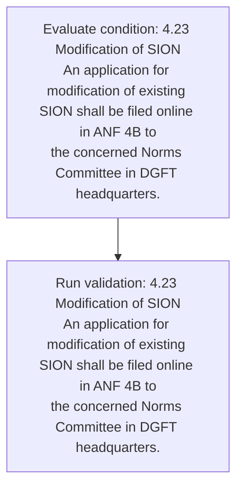
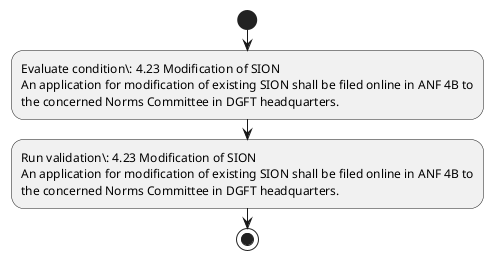

# Chapter 4 / Section 4.23: Modification of SION

**Chapter Title:** Duty Exemption / Remission Schemes

**Pages:** 13

**Purpose:** 4.23 Modification of SION
An application for modification of existing SION shall be filed online in ANF 4B to
the concerned Norms Committee in DGFT headquarters.

**Purpose Thanglish:** Indha Modification of SION section-la, 4.23 Modification of SION
An application for modification of existing SION kandippa be filed online in ANF 4B to
the concerned Norms Committee in DGFT headquarters.

**Summary:** 4.23 Modification of SION
An application for modification of existing SION shall be filed online in ANF 4B to
the concerned Norms Committee in DGFT headquarters.

**Business Meaning:** Modification of SION governs how DGFT business controls should be applied, validated, and enforced.

**Business Explanation:** Modification of SION explains the operating rule set that DEKAI should enforce. Key control points include 4.23 Modification of SION
An application for modification of existing SION shall be filed online in ANF 4B to
the concerned Norms Committee in DGFT headquarters.

**Business Explanation Thanglish:** Indha Modification of SION section-la, Modification of SION explains the operating rule set that DEKAI should enforce. Key control points include 4.23 Modification of SION
An application for modification of existing SION kandippa be filed online in ANF 4B to
the concerned Norms Committee in DGFT headquarters.

## Business Logic
- 4.23 Modification of SION
An application for modification of existing SION shall be filed online in ANF 4B to
the concerned Norms Committee in DGFT headquarters.

## Business Rules
- rule_id=CH4-SEC4_23-R001, rule_description=4.23 Modification of SION
An application for modification of existing SION shall be filed online in ANF 4B to
the concerned Norms Committee in DGFT headquarters., trigger=Modification of SION, condition=4.23 Modification of SION
An application for modification of existing SION shall be filed online in ANF 4B to
the concerned Norms Committee in DGFT headquarters., validation=4.23 Modification of SION
An application for modification of existing SION shall be filed online in ANF 4B to
the concerned Norms Committee in DGFT headquarters., action=Manual review required., exception=No explicit exception found in uploaded documents., output=DEKAI should produce a compliance decision for 4.23 - Modification of SION.

## Conditions
- 4.23 Modification of SION
An application for modification of existing SION shall be filed online in ANF 4B to
the concerned Norms Committee in DGFT headquarters.

## Condition Logic
- id=4.4.23.1, if=4.23 Modification of SION
An application for modification of existing SION shall be filed online in ANF 4B to
the concerned Norms Committee in DGFT headquarters., then=Route for review, source=4.23 Modification of SION
An application for modification of existing SION shall be filed online in ANF 4B to
the concerned Norms Committee in DGFT headquarters.

## Validations
- 4.23 Modification of SION
An application for modification of existing SION shall be filed online in ANF 4B to
the concerned Norms Committee in DGFT headquarters.

## Exceptions
- None identified

## Dependencies
- 2
- 3
- 4

## Authorities
- DGFT
- Norms Committee in DGFT

## Required Documents
- 4.23 Modification of SION
An application for modification of existing SION shall be filed online in ANF 4B to
the concerned Norms Committee in DGFT headquarters.

## Timelines
- None identified

## Actions
- None identified

## Workflow
- Evaluate condition: 4.23 Modification of SION
An application for modification of existing SION shall be filed online in ANF 4B to
the concerned Norms Committee in DGFT headquarters.
- Run validation: 4.23 Modification of SION
An application for modification of existing SION shall be filed online in ANF 4B to
the concerned Norms Committee in DGFT headquarters.

## Workflow ASCII
```text
Modification of SION
Evaluate condition: 4.23 Modification of SION
An application for modification of existing SION shall be filed online in ANF 4B to
the concerned Norms Committee in DGFT headquarters.
   |
   v
Run validation: 4.23 Modification of SION
An application for modification of existing SION shall be filed online in ANF 4B to
the concerned Norms Committee in DGFT headquarters.
```

## Decision Tree
- IF section 4.23 applies THEN proceed with standard DGFT workflow

## Decision Tree ASCII
```text
Modification of SION Decision
IF section 4.23 applies THEN proceed with standard DGFT workflow
```

## Examples
- User asks to process Modification of SION; the platform checks conditions, validations, and documents before action.

**Real-world Example:** Example: an importer or exporter invokes Modification of SION, submits 4.23 Modification of SION
An application for modification of existing SION shall be filed online in ANF 4B to
the concerned Norms Committee in DGFT headquarters., and DEKAI uses the extracted rules to follow the modification of sion process.

**Real-world Example Thanglish:** Indha Modification of SION section-la, Example: an importer or exporter invokes Modification of SION, submits 4.23 Modification of SION
An application for modification of existing SION kandippa be filed online in ANF 4B to
the concerned Norms Committee in DGFT headquarters., and DEKAI uses the extracted rules to follow the modification of sion process.

## AI Rules
- IF detected context matches section rule THEN enforce: 4.23 Modification of SION
An application for modification of existing SION shall be filed online in ANF 4B to
the concerned Norms Committee in DGFT headquarters.

## Database Fields
- name=section_code, type=string, required=True, source=parsed_section_heading
- name=section_title, type=string, required=True, source=parsed_section_heading
- name=for_flag, type=boolean, required=False, source=keyword:for
- name=anf_flag, type=boolean, required=False, source=keyword:ANF
- name=the_flag, type=boolean, required=False, source=keyword:the
- name=sion_flag, type=boolean, required=False, source=keyword:SION
- name=dgft_flag, type=boolean, required=False, source=keyword:DGFT
- name=shall_flag, type=boolean, required=False, source=keyword:shall
- name=filed_flag, type=boolean, required=False, source=keyword:filed
- name=norms_flag, type=boolean, required=False, source=keyword:Norms
- name=document_1_submitted, type=boolean, required=True, source=4.23 Modification of SION
An application for modification of existing SION shall be filed online in ANF 4B to
the concerned Norms Committee in DGFT headquarters.

## API Requirements
- method=GET, path=/api/dgft/sections/4.23, purpose=Retrieve knowledge payload for section 4.23, query_params=['include=workflow,decision_tree,validations'], response_fields=['section', 'title', 'summary', 'conditions', 'validations', 'exceptions', 'workflow', 'decision_tree']
- method=POST, path=/api/dgft/Modification-of-SION/validate, purpose=Validate inputs and documents for Modification of SION, request_fields=['section_code', 'section_title', 'document_1_submitted'], response_fields=['status', 'errors', 'warnings', 'next_actions']

## UI Screens
- screen_id=Modification_of_SION_overview, name=Modification of SION Overview, purpose=Show section summary, authority, timeline, and eligibility cues., widgets=['summary_card', 'conditions_table', 'authority_badges', 'timeline_panel']
- screen_id=Modification_of_SION_submission, name=Modification of SION Submission, purpose=Capture applicant data and supporting documents., widgets=['dynamic_form', 'document_uploader', 'validation_panel', 'next_action_footer'], fields=['section_code', 'section_title', 'for_flag', 'anf_flag', 'the_flag', 'sion_flag', 'dgft_flag', 'shall_flag']

## Error Messages
- Validation failed because the section requirements were not fully met.

## FAQ
- question_en=What is the purpose of section 4.23?, answer_en=Modification of SION explains the operating rule set that DEKAI should enforce. Key control points include 4.23 Modification of SION
An application for modification of existing SION shall be filed online in ANF 4B to
the concerned Norms Committee in DGFT headquarters., question_thanglish=Indha Modification of SION section-la, What is the purpose of section 4.23?, answer_thanglish=Indha Modification of SION section-la, Modification of SION explains the operating rule set that DEKAI should enforce. Key control points include 4.23 Modification of SION
An application for modification of existing SION kandippa be filed online in ANF 4B to
the concerned Norms Committee in DGFT headquarters.
- question_en=What documents are required under Modification of SION?, answer_en=4.23 Modification of SION
An application for modification of existing SION shall be filed online in ANF 4B to
the concerned Norms Committee in DGFT headquarters., question_thanglish=Indha Modification of SION section-la, What documents are required under Modification of SION?, answer_thanglish=Indha Modification of SION section-la, 4.23 Modification of SION
An application for modification of existing SION kandippa be filed online in ANF 4B to
the concerned Norms Committee in DGFT headquarters.
- question_en=Which authority handles Modification of SION?, answer_en=DGFT, Norms Committee in DGFT, question_thanglish=Indha Modification of SION section-la, Which authority handles Modification of SION?, answer_thanglish=Indha Modification of SION section-la, DGFT, Norms Committee in DGFT

## Questions Users May Ask
- What does Modification of SION require?
- Which documents are needed for Modification of SION?
- How does DEKAI validate Modification of SION requests?

## Expected AI Answers
- Modification of SION requires the platform to interpret the section text, apply the extracted business rules, and present the correct next action.
- Required documents are inferred from the section text: 4.23 Modification of SION
An application for modification of existing SION shall be filed online in ANF 4B to
the concerned Norms Committee in DGFT headquarters.
- DEKAI validates Modification of SION by checking conditions, required documents, authority references, and exception clauses before recommending an outcome.

## AI Q&A Examples
- question_en=User asks: How do I comply with Modification of SION?, answer_en=AI answers: DEKAI should evaluate section 4.23, apply the extracted rules, and guide the user through Evaluate condition: 4.23 Modification of SION
An application for modification of existing SION shall be filed online in ANF 4B to
the concerned Norms Committee in DGFT headquarters.., question_thanglish=Indha Modification of SION section-la, User asks: How do I comply with Modification of SION?, answer_thanglish=Indha Modification of SION section-la, AI answers: DEKAI should evaluate section 4.23, apply the extracted rules, and guide the user through Evaluate condition: 4.23 Modification of SION
An application for modification of existing SION kandippa be filed online in ANF 4B to
the concerned Norms Committee in DGFT headquarters..
- question_en=User asks: Which validations apply to Modification of SION?, answer_en=AI answers: Applicable validations are 4.23 Modification of SION
An application for modification of existing SION shall be filed online in ANF 4B to
the concerned Norms Committee in DGFT headquarters., question_thanglish=Indha Modification of SION section-la, User asks: Which validations apply to Modification of SION?, answer_thanglish=Indha Modification of SION section-la, AI answers: Applicable validations are 4.23 Modification of SION
An application for modification of existing SION kandippa be filed online in ANF 4B to
the concerned Norms Committee in DGFT headquarters.

## DEKAI AI Implementation Notes
- Capture chapter 4, section 4.23, title, and page references as immutable knowledge metadata.
- Bind validations for Modification of SION into a rule engine keyed by the rule IDs extracted for this section.
- Expose document upload controls for: 4.23 Modification of SION
An application for modification of existing SION shall be filed online in ANF 4B to
the concerned Norms Committee in DGFT headquarters..
- Route escalations or approvals to: DGFT, Norms Committee in DGFT.
- Show contextual links to related sections: 2, 3, 4.

## DEKAI AI Implementation Notes Thanglish
- Indha Modification of SION section-la, Capture chapter 4, section 4.23, title, and page references as immutable knowledge metadata.
- Indha Modification of SION section-la, Bind validations for Modification of SION into a rule engine keyed by the rule IDs extracted for this section.
- Indha Modification of SION section-la, Expose document upload controls for: 4.23 Modification of SION
An application for modification of existing SION kandippa be filed online in ANF 4B to
the concerned Norms Committee in DGFT headquarters..
- Indha Modification of SION section-la, Route escalations or approvals to: DGFT, Norms Committee in DGFT.
- Indha Modification of SION section-la, Show contextual links to related sections: 2, 3, 4.

## AI Metadata
- Keywords: for, ANF, the, SION, DGFT, shall, filed, Norms, online, existing, concerned, Committee, application, Modification, headquarters
- Search Keywords: for, ANF, the, SION, DGFT, shall, filed, Norms, online, existing, concerned, Committee, application, Modification, headquarters
- Intent: Provide knowledge guidance for Modification of SION.
- Tags: 4.23, Modification of SION, business-rule, document-driven, dgft
- Related Sections: 2, 3, 4
- Related Chapters: 
- Related Rules: 4.23 Modification of SION
An application for modification of existing SION shall be filed online in ANF 4B to
the concerned Norms Committee in DGFT headquarters.

## Mermaid


## PlantUML

