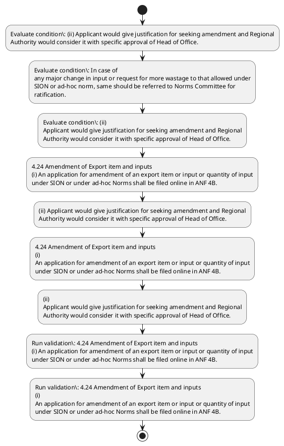

# Chapter 4 / Section 4.24: Amendment of Export item and inputs

**Chapter Title:** Duty Exemption / Remission Schemes

**Pages:** 13

**Purpose:** 4.24 Amendment of Export item and inputs
(i) An application for amendment of an export item or input or quantity of input
under SION or under ad-hoc Norms shall be filed online in ANF 4B.

**Purpose Thanglish:** Indha Amendment of Export item and inputs section-la, 4.24 Amendment of export item and inputs
(i) An application for amendment of an export item or input or quantity of input
under SION or under ad-hoc Norms kandippa be filed online in ANF 4B.

**Summary:** 4.24 Amendment of Export item and inputs
(i) An application for amendment of an export item or input or quantity of input
under SION or under ad-hoc Norms shall be filed online in ANF 4B. (ii) Applicant would give justification for seeking amendment and Regional
Authority would consider it with specific approval of Head of Office. In case of
any major change in input or request for more wastage to that allowed under
SION or ad-hoc norm, same should be referred to Norms Committee for
ratification.

**Business Meaning:** Amendment of Export item and inputs governs how DGFT business controls should be applied, validated, and enforced.

**Business Explanation:** Amendment of Export item and inputs explains the operating rule set that DEKAI should enforce. Key control points include 4.24 Amendment of Export item and inputs
(i) An application for amendment of an export item or input or quantity of input
under SION or under ad-hoc Norms shall be filed online in ANF 4B. The section also drives actions such as 4.24 Amendment of Export item and inputs
(i) An application for amendment of an export item or input or quantity of input
under SION or under ad-hoc Norms shall be filed online in ANF 4B..

**Business Explanation Thanglish:** Indha Amendment of Export item and inputs section-la, Amendment of export item and inputs explains the operating rule set that DEKAI should enforce. Key control points include 4.24 Amendment of export item and inputs
(i) An application for amendment of an export item or input or quantity of input
under SION or under ad-hoc Norms kandippa be filed online in ANF 4B. The section also drives actions such as 4.24 Amendment of export item and inputs
(i) An application for amendment of an export item or input or quantity of input
under SION or under ad-hoc Norms kandippa be filed online in ANF 4B..

## Business Logic
- 4.24 Amendment of Export item and inputs
(i) An application for amendment of an export item or input or quantity of input
under SION or under ad-hoc Norms shall be filed online in ANF 4B.
- In case of
any major change in input or request for more wastage to that allowed under
SION or ad-hoc norm, same should be referred to Norms Committee for
ratification.
- 4.24 Amendment of Export item and inputs
(i)
An application for amendment of an export item or input or quantity of input
under SION or under ad-hoc Norms shall be filed online in ANF 4B.

## Business Rules
- rule_id=CH4-SEC4_24-R001, rule_description=4.24 Amendment of Export item and inputs
(i) An application for amendment of an export item or input or quantity of input
under SION or under ad-hoc Norms shall be filed online in ANF 4B., trigger=Amendment of Export item and inputs, condition=(ii) Applicant would give justification for seeking amendment and Regional
Authority would consider it with specific approval of Head of Office., validation=4.24 Amendment of Export item and inputs
(i) An application for amendment of an export item or input or quantity of input
under SION or under ad-hoc Norms shall be filed online in ANF 4B., action=4.24 Amendment of Export item and inputs
(i) An application for amendment of an export item or input or quantity of input
under SION or under ad-hoc Norms shall be filed online in ANF 4B., exception=No explicit exception found in uploaded documents., output=DEKAI should produce a compliance decision for 4.24 - Amendment of Export item and inputs.
- rule_id=CH4-SEC4_24-R002, rule_description=In case of
any major change in input or request for more wastage to that allowed under
SION or ad-hoc norm, same should be referred to Norms Committee for
ratification., trigger=Amendment of Export item and inputs, condition=In case of
any major change in input or request for more wastage to that allowed under
SION or ad-hoc norm, same should be referred to Norms Committee for
ratification., validation=4.24 Amendment of Export item and inputs
(i)
An application for amendment of an export item or input or quantity of input
under SION or under ad-hoc Norms shall be filed online in ANF 4B., action=(ii) Applicant would give justification for seeking amendment and Regional
Authority would consider it with specific approval of Head of Office., exception=No explicit exception found in uploaded documents., output=DEKAI should produce a compliance decision for 4.24 - Amendment of Export item and inputs.
- rule_id=CH4-SEC4_24-R003, rule_description=4.24 Amendment of Export item and inputs
(i)
An application for amendment of an export item or input or quantity of input
under SION or under ad-hoc Norms shall be filed online in ANF 4B., trigger=Amendment of Export item and inputs, condition=(ii)
Applicant would give justification for seeking amendment and Regional
Authority would consider it with specific approval of Head of Office., validation=4.24 Amendment of Export item and inputs
(i)
An application for amendment of an export item or input or quantity of input
under SION or under ad-hoc Norms shall be filed online in ANF 4B., action=4.24 Amendment of Export item and inputs
(i)
An application for amendment of an export item or input or quantity of input
under SION or under ad-hoc Norms shall be filed online in ANF 4B., exception=No explicit exception found in uploaded documents., output=DEKAI should produce a compliance decision for 4.24 - Amendment of Export item and inputs.

## Conditions
- (ii) Applicant would give justification for seeking amendment and Regional
Authority would consider it with specific approval of Head of Office.
- In case of
any major change in input or request for more wastage to that allowed under
SION or ad-hoc norm, same should be referred to Norms Committee for
ratification.
- (ii)
Applicant would give justification for seeking amendment and Regional
Authority would consider it with specific approval of Head of Office.

## Condition Logic
- id=4.4.24.1, if=(ii) Applicant would give justification for seeking amendment and Regional
Authority would consider it with specific approval of Head of Office., then=4.24 Amendment of Export item and inputs
(i) An application for amendment of an export item or input or quantity of input
under SION or under ad-hoc Norms shall be filed online in ANF 4B., source=(ii) Applicant would give justification for seeking amendment and Regional
Authority would consider it with specific approval of Head of Office.
- id=4.4.24.2, if=In case of
any major change in input or request for more wastage to that allowed under
SION or ad-hoc norm, same should be referred to Norms Committee for
ratification., then=4.24 Amendment of Export item and inputs
(i) An application for amendment of an export item or input or quantity of input
under SION or under ad-hoc Norms shall be filed online in ANF 4B., source=In case of
any major change in input or request for more wastage to that allowed under
SION or ad-hoc norm, same should be referred to Norms Committee for
ratification.
- id=4.4.24.3, if=(ii)
Applicant would give justification for seeking amendment and Regional
Authority would consider it with specific approval of Head of Office., then=4.24 Amendment of Export item and inputs
(i) An application for amendment of an export item or input or quantity of input
under SION or under ad-hoc Norms shall be filed online in ANF 4B., source=(ii)
Applicant would give justification for seeking amendment and Regional
Authority would consider it with specific approval of Head of Office.

## Validations
- 4.24 Amendment of Export item and inputs
(i) An application for amendment of an export item or input or quantity of input
under SION or under ad-hoc Norms shall be filed online in ANF 4B.
- 4.24 Amendment of Export item and inputs
(i)
An application for amendment of an export item or input or quantity of input
under SION or under ad-hoc Norms shall be filed online in ANF 4B.

## Exceptions
- None identified

## Dependencies
- 2
- 4

## Authorities
- Norms Committee

## Required Documents
- 4.24 Amendment of Export item and inputs
(i) An application for amendment of an export item or input or quantity of input
under SION or under ad-hoc Norms shall be filed online in ANF 4B.
- 4.24 Amendment of Export item and inputs
(i)
An application for amendment of an export item or input or quantity of input
under SION or under ad-hoc Norms shall be filed online in ANF 4B.

## Timelines
- None identified

## Actions
- 4.24 Amendment of Export item and inputs
(i) An application for amendment of an export item or input or quantity of input
under SION or under ad-hoc Norms shall be filed online in ANF 4B.
- (ii) Applicant would give justification for seeking amendment and Regional
Authority would consider it with specific approval of Head of Office.
- 4.24 Amendment of Export item and inputs
(i)
An application for amendment of an export item or input or quantity of input
under SION or under ad-hoc Norms shall be filed online in ANF 4B.
- (ii)
Applicant would give justification for seeking amendment and Regional
Authority would consider it with specific approval of Head of Office.

## Workflow
- Evaluate condition: (ii) Applicant would give justification for seeking amendment and Regional
Authority would consider it with specific approval of Head of Office.
- Evaluate condition: In case of
any major change in input or request for more wastage to that allowed under
SION or ad-hoc norm, same should be referred to Norms Committee for
ratification.
- Evaluate condition: (ii)
Applicant would give justification for seeking amendment and Regional
Authority would consider it with specific approval of Head of Office.
- 4.24 Amendment of Export item and inputs
(i) An application for amendment of an export item or input or quantity of input
under SION or under ad-hoc Norms shall be filed online in ANF 4B.
- (ii) Applicant would give justification for seeking amendment and Regional
Authority would consider it with specific approval of Head of Office.
- 4.24 Amendment of Export item and inputs
(i)
An application for amendment of an export item or input or quantity of input
under SION or under ad-hoc Norms shall be filed online in ANF 4B.
- (ii)
Applicant would give justification for seeking amendment and Regional
Authority would consider it with specific approval of Head of Office.
- Run validation: 4.24 Amendment of Export item and inputs
(i) An application for amendment of an export item or input or quantity of input
under SION or under ad-hoc Norms shall be filed online in ANF 4B.
- Run validation: 4.24 Amendment of Export item and inputs
(i)
An application for amendment of an export item or input or quantity of input
under SION or under ad-hoc Norms shall be filed online in ANF 4B.

## Workflow ASCII
```text
Amendment of Export item and inputs
Evaluate condition: (ii) Applicant would give justification for seeking amendment and Regional
Authority would consider it with specific approval of Head of Office.
   |
   v
Evaluate condition: In case of
any major change in input or request for more wastage to that allowed under
SION or ad-hoc norm, same should be referred to Norms Committee for
ratification.
   |
   v
Evaluate condition: (ii)
Applicant would give justification for seeking amendment and Regional
Authority would consider it with specific approval of Head of Office.
   |
   v
4.24 Amendment of Export item and inputs
(i) An application for amendment of an export item or input or quantity of input
under SION or under ad-hoc Norms shall be filed online in ANF 4B.
   |
   v
(ii) Applicant would give justification for seeking amendment and Regional
Authority would consider it with specific approval of Head of Office.
   |
   v
4.24 Amendment of Export item and inputs
(i)
An application for amendment of an export item or input or quantity of input
under SION or under ad-hoc Norms shall be filed online in ANF 4B.
   |
   v
(ii)
Applicant would give justification for seeking amendment and Regional
Authority would consider it with specific approval of Head of Office.
   |
   v
Run validation: 4.24 Amendment of Export item and inputs
(i) An application for amendment of an export item or input or quantity of input
under SION or under ad-hoc Norms shall be filed online in ANF 4B.
   |
   v
Run validation: 4.24 Amendment of Export item and inputs
(i)
An application for amendment of an export item or input or quantity of input
under SION or under ad-hoc Norms shall be filed online in ANF 4B.
```

## Decision Tree
- IF (ii) Applicant would give justification for seeking amendment and Regional
Authority would consider it with specific approval of Head of Office. THEN 4.24 Amendment of Export item and inputs
(i) An application for amendment of an export item or input or quantity of input
under SION or under ad-hoc Norms shall be filed online in ANF 4B.
- IF In case of
any major change in input or request for more wastage to that allowed under
SION or ad-hoc norm, same should be referred to Norms Committee for
ratification. THEN 4.24 Amendment of Export item and inputs
(i) An application for amendment of an export item or input or quantity of input
under SION or under ad-hoc Norms shall be filed online in ANF 4B.
- IF (ii)
Applicant would give justification for seeking amendment and Regional
Authority would consider it with specific approval of Head of Office. THEN 4.24 Amendment of Export item and inputs
(i) An application for amendment of an export item or input or quantity of input
under SION or under ad-hoc Norms shall be filed online in ANF 4B.

## Decision Tree ASCII
```text
Amendment of Export item and inputs Decision
IF (ii) Applicant would give justification for seeking amendment and Regional
Authority would consider it with specific approval of Head of Office. THEN 4.24 Amendment of Export item and inputs
(i) An application for amendment of an export item or input or quantity of input
under SION or under ad-hoc Norms shall be filed online in ANF 4B.
   |
   v
IF In case of
any major change in input or request for more wastage to that allowed under
SION or ad-hoc norm, same should be referred to Norms Committee for
ratification. THEN 4.24 Amendment of Export item and inputs
(i) An application for amendment of an export item or input or quantity of input
under SION or under ad-hoc Norms shall be filed online in ANF 4B.
   |
   v
IF (ii)
Applicant would give justification for seeking amendment and Regional
Authority would consider it with specific approval of Head of Office. THEN 4.24 Amendment of Export item and inputs
(i) An application for amendment of an export item or input or quantity of input
under SION or under ad-hoc Norms shall be filed online in ANF 4B.
```

## Examples
- User asks to process Amendment of Export item and inputs; the platform checks conditions, validations, and documents before action.

**Real-world Example:** Example: an importer or exporter invokes Amendment of Export item and inputs, submits 4.24 Amendment of Export item and inputs
(i) An application for amendment of an export item or input or quantity of input
under SION or under ad-hoc Norms shall be filed online in ANF 4B., 4.24 Amendment of Export item and inputs
(i)
An application for amendment of an export item or input or quantity of input
under SION or under ad-hoc Norms shall be filed online in ANF 4B., and DEKAI uses the extracted rules to 4.24 amendment of export item and inputs
(i) an application for amendment of an export item or input or quantity of input
under sion or under ad-hoc norms shall be filed online in anf 4b..

**Real-world Example Thanglish:** Indha Amendment of Export item and inputs section-la, Example: an importer or exporter invokes Amendment of export item and inputs, submits 4.24 Amendment of export item and inputs
(i) An application for amendment of an export item or input or quantity of input
under SION or under ad-hoc Norms kandippa be filed online in ANF 4B., 4.24 Amendment of export item and inputs
(i)
An application for amendment of an export item or input or quantity of input
under SION or under ad-hoc Norms kandippa be filed online in ANF 4B., and DEKAI uses the extracted rules to 4.24 amendment of export item and inputs
(i) an application for amendment of an export item or input or quantity of input
under sion or under ad-hoc norms kandippa be filed online in anf 4b..

## AI Rules
- IF detected context matches section rule THEN enforce: 4.24 Amendment of Export item and inputs
(i) An application for amendment of an export item or input or quantity of input
under SION or under ad-hoc Norms shall be filed online in ANF 4B.
- IF detected context matches section rule THEN enforce: In case of
any major change in input or request for more wastage to that allowed under
SION or ad-hoc norm, same should be referred to Norms Committee for
ratification.
- IF detected context matches section rule THEN enforce: 4.24 Amendment of Export item and inputs
(i)
An application for amendment of an export item or input or quantity of input
under SION or under ad-hoc Norms shall be filed online in ANF 4B.
- IF validations pass THEN recommend action: 4.24 Amendment of Export item and inputs
(i) An application for amendment of an export item or input or quantity of input
under SION or under ad-hoc Norms shall be filed online in ANF 4B.

## Database Fields
- name=section_code, type=string, required=True, source=parsed_section_heading
- name=section_title, type=string, required=True, source=parsed_section_heading
- name=and_flag, type=boolean, required=False, source=keyword:and
- name=for_flag, type=boolean, required=False, source=keyword:for
- name=anf_flag, type=boolean, required=False, source=keyword:ANF
- name=any_flag, type=boolean, required=False, source=keyword:any
- name=item_flag, type=boolean, required=False, source=keyword:item
- name=sion_flag, type=boolean, required=False, source=keyword:SION
- name=give_flag, type=boolean, required=False, source=keyword:give
- name=with_flag, type=boolean, required=False, source=keyword:with
- name=document_1_submitted, type=boolean, required=True, source=4.24 Amendment of Export item and inputs
(i) An application for amendment of an export item or input or quantity of input
under SION or under ad-hoc Norms shall be filed online in ANF 4B.
- name=document_2_submitted, type=boolean, required=True, source=4.24 Amendment of Export item and inputs
(i)
An application for amendment of an export item or input or quantity of input
under SION or under ad-hoc Norms shall be filed online in ANF 4B.

## API Requirements
- method=GET, path=/api/dgft/sections/4.24, purpose=Retrieve knowledge payload for section 4.24, query_params=['include=workflow,decision_tree,validations'], response_fields=['section', 'title', 'summary', 'conditions', 'validations', 'exceptions', 'workflow', 'decision_tree']
- method=POST, path=/api/dgft/Amendment-of-Export-item-and-inputs/validate, purpose=Validate inputs and documents for Amendment of Export item and inputs, request_fields=['section_code', 'section_title', 'document_1_submitted', 'document_2_submitted'], response_fields=['status', 'errors', 'warnings', 'next_actions']
- method=POST, path=/api/dgft/Amendment-of-Export-item-and-inputs/execute, purpose=Trigger business action for 4.24 Amendment of Export item and inputs
(i) An application for amendment of an export item or input or quantity of input
under SION or under ad-hoc Norms shall be filed online in ANF 4B., request_fields=['section_code', 'section_title', 'document_1_submitted', 'document_2_submitted'], response_fields=['reference_id', 'status', 'authority', 'timeline']

## UI Screens
- screen_id=Amendment_of_Export_item_and_inputs_overview, name=Amendment of Export item and inputs Overview, purpose=Show section summary, authority, timeline, and eligibility cues., widgets=['summary_card', 'conditions_table', 'authority_badges', 'timeline_panel']
- screen_id=Amendment_of_Export_item_and_inputs_submission, name=Amendment of Export item and inputs Submission, purpose=Capture applicant data and supporting documents., widgets=['dynamic_form', 'document_uploader', 'validation_panel', 'next_action_footer'], fields=['section_code', 'section_title', 'and_flag', 'for_flag', 'anf_flag', 'any_flag', 'item_flag', 'sion_flag']

## Error Messages
- Validation failed because the section requirements were not fully met.

## FAQ
- question_en=What is the purpose of section 4.24?, answer_en=Amendment of Export item and inputs explains the operating rule set that DEKAI should enforce. Key control points include 4.24 Amendment of Export item and inputs
(i) An application for amendment of an export item or input or quantity of input
under SION or under ad-hoc Norms shall be filed online in ANF 4B. The section also drives actions such as 4.24 Amendment of Export item and inputs
(i) An application for amendment of an export item or input or quantity of input
under SION or under ad-hoc Norms shall be filed online in ANF 4B.., question_thanglish=Indha Amendment of Export item and inputs section-la, What is the purpose of section 4.24?, answer_thanglish=Indha Amendment of Export item and inputs section-la, Amendment of export item and inputs explains the operating rule set that DEKAI should enforce. Key control points include 4.24 Amendment of export item and inputs
(i) An application for amendment of an export item or input or quantity of input
under SION or under ad-hoc Norms kandippa be filed online in ANF 4B. The section also drives actions such as 4.24 Amendment of export item and inputs
(i) An application for amendment of an export item or input or quantity of input
under SION or under ad-hoc Norms kandippa be filed online in ANF 4B..
- question_en=What documents are required under Amendment of Export item and inputs?, answer_en=4.24 Amendment of Export item and inputs
(i) An application for amendment of an export item or input or quantity of input
under SION or under ad-hoc Norms shall be filed online in ANF 4B., 4.24 Amendment of Export item and inputs
(i)
An application for amendment of an export item or input or quantity of input
under SION or under ad-hoc Norms shall be filed online in ANF 4B., question_thanglish=Indha Amendment of Export item and inputs section-la, What documents are required under Amendment of export item and inputs?, answer_thanglish=Indha Amendment of Export item and inputs section-la, 4.24 Amendment of export item and inputs
(i) An application for amendment of an export item or input or quantity of input
under SION or under ad-hoc Norms kandippa be filed online in ANF 4B., 4.24 Amendment of export item and inputs
(i)
An application for amendment of an export item or input or quantity of input
under SION or under ad-hoc Norms kandippa be filed online in ANF 4B.
- question_en=Which authority handles Amendment of Export item and inputs?, answer_en=Norms Committee, question_thanglish=Indha Amendment of Export item and inputs section-la, Which authority handles Amendment of export item and inputs?, answer_thanglish=Indha Amendment of Export item and inputs section-la, Norms Committee

## Questions Users May Ask
- What does Amendment of Export item and inputs require?
- Which documents are needed for Amendment of Export item and inputs?
- How does DEKAI validate Amendment of Export item and inputs requests?
- What action should be taken for Amendment of Export item and inputs?

## Expected AI Answers
- Amendment of Export item and inputs requires the platform to interpret the section text, apply the extracted business rules, and present the correct next action.
- Required documents are inferred from the section text: 4.24 Amendment of Export item and inputs
(i) An application for amendment of an export item or input or quantity of input
under SION or under ad-hoc Norms shall be filed online in ANF 4B., 4.24 Amendment of Export item and inputs
(i)
An application for amendment of an export item or input or quantity of input
under SION or under ad-hoc Norms shall be filed online in ANF 4B.
- DEKAI validates Amendment of Export item and inputs by checking conditions, required documents, authority references, and exception clauses before recommending an outcome.
- The primary extracted action is: 4.24 Amendment of Export item and inputs
(i) An application for amendment of an export item or input or quantity of input
under SION or under ad-hoc Norms shall be filed online in ANF 4B.

## AI Q&A Examples
- question_en=User asks: How do I comply with Amendment of Export item and inputs?, answer_en=AI answers: DEKAI should evaluate section 4.24, apply the extracted rules, and guide the user through Evaluate condition: (ii) Applicant would give justification for seeking amendment and Regional
Authority would consider it with specific approval of Head of Office.., question_thanglish=Indha Amendment of Export item and inputs section-la, User asks: How do I comply with Amendment of export item and inputs?, answer_thanglish=Indha Amendment of Export item and inputs section-la, AI answers: DEKAI should evaluate section 4.24, apply the extracted rules, and guide the user through Evaluate condition: (ii) Applicant would give justification for seeking amendment and Regional
authority would consider it with specific approval of Head of Office..
- question_en=User asks: Which validations apply to Amendment of Export item and inputs?, answer_en=AI answers: Applicable validations are 4.24 Amendment of Export item and inputs
(i) An application for amendment of an export item or input or quantity of input
under SION or under ad-hoc Norms shall be filed online in ANF 4B., 4.24 Amendment of Export item and inputs
(i)
An application for amendment of an export item or input or quantity of input
under SION or under ad-hoc Norms shall be filed online in ANF 4B., question_thanglish=Indha Amendment of Export item and inputs section-la, User asks: Which validations apply to Amendment of export item and inputs?, answer_thanglish=Indha Amendment of Export item and inputs section-la, AI answers: Applicable validations are 4.24 Amendment of export item and inputs
(i) An application for amendment of an export item or input or quantity of input
under SION or under ad-hoc Norms kandippa be filed online in ANF 4B., 4.24 Amendment of export item and inputs
(i)
An application for amendment of an export item or input or quantity of input
under SION or under ad-hoc Norms kandippa be filed online in ANF 4B.

## DEKAI AI Implementation Notes
- Capture chapter 4, section 4.24, title, and page references as immutable knowledge metadata.
- Bind validations for Amendment of Export item and inputs into a rule engine keyed by the rule IDs extracted for this section.
- Expose document upload controls for: 4.24 Amendment of Export item and inputs
(i) An application for amendment of an export item or input or quantity of input
under SION or under ad-hoc Norms shall be filed online in ANF 4B., 4.24 Amendment of Export item and inputs
(i)
An application for amendment of an export item or input or quantity of input
under SION or under ad-hoc Norms shall be filed online in ANF 4B..
- Route escalations or approvals to: Norms Committee.
- Show contextual links to related sections: 2, 4.

## DEKAI AI Implementation Notes Thanglish
- Indha Amendment of Export item and inputs section-la, Capture chapter 4, section 4.24, title, and page references as immutable knowledge metadata.
- Indha Amendment of Export item and inputs section-la, Bind validations for Amendment of export item and inputs into a rule engine keyed by the rule IDs extracted for this section.
- Indha Amendment of Export item and inputs section-la, Expose document upload controls for: 4.24 Amendment of export item and inputs
(i) An application for amendment of an export item or input or quantity of input
under SION or under ad-hoc Norms kandippa be filed online in ANF 4B., 4.24 Amendment of export item and inputs
(i)
An application for amendment of an export item or input or quantity of input
under SION or under ad-hoc Norms kandippa be filed online in ANF 4B..
- Indha Amendment of Export item and inputs section-la, Route escalations or approvals to: Norms Committee.
- Indha Amendment of Export item and inputs section-la, Show contextual links to related sections: 2, 4.

## AI Metadata
- Keywords: and, for, ANF, any, item, SION, give, with, Head, case, more, that, norm, same, input, under, Norms, shall, filed, would
- Search Keywords: and, for, ANF, any, item, SION, give, with, Head, case, more, that, norm, same, input, under, Norms, shall, filed, would
- Intent: Support Amendment of Export item and inputs processing and compliance validation.
- Tags: 4.24, Amendment of Export item and inputs, business-rule, document-driven, dgft
- Related Sections: 2, 4
- Related Chapters: 
- Related Rules: 4.24 Amendment of Export item and inputs
(i) An application for amendment of an export item or input or quantity of input
under SION or under ad-hoc Norms shall be filed online in ANF 4B., In case of
any major change in input or request for more wastage to that allowed under
SION or ad-hoc norm, same should be referred to Norms Committee for
ratification., 4.24 Amendment of Export item and inputs
(i)
An application for amendment of an export item or input or quantity of input
under SION or under ad-hoc Norms shall be filed online in ANF 4B.

## Mermaid

```mermaid
flowchart TD
    S1["Evaluate condition: (ii) Applicant would give justification for seeking amendment and Regional
Authority would consider it with specific approval of Head of Office."]
    S2["Evaluate condition: In case of
any major change in input or request for more wastage to that allowed under
SION or ad-hoc norm, same should be referred to Norms Committee for
ratification."]
    S1 --> S2
    S3["Evaluate condition: (ii)
Applicant would give justification for seeking amendment and Regional
Authority would consider it with specific approval of Head of Office."]
    S2 --> S3
    S4["4.24 Amendment of Export item and inputs
(i) An application for amendment of an export item or input or quantity of input
under SION or under ad-hoc Norms shall be filed online in ANF 4B."]
    S3 --> S4
    S5["(ii) Applicant would give justification for seeking amendment and Regional
Authority would consider it with specific approval of Head of Office."]
    S4 --> S5
    S6["4.24 Amendment of Export item and inputs
(i)
An application for amendment of an export item or input or quantity of input
under SION or under ad-hoc Norms shall be filed online in ANF 4B."]
    S5 --> S6
    S7["(ii)
Applicant would give justification for seeking amendment and Regional
Authority would consider it with specific approval of Head of Office."]
    S6 --> S7
    S8["Run validation: 4.24 Amendment of Export item and inputs
(i) An application for amendment of an export item or input or quantity of input
under SION or under ad-hoc Norms shall be filed online in ANF 4B."]
    S7 --> S8
    S9["Run validation: 4.24 Amendment of Export item and inputs
(i)
An application for amendment of an export item or input or quantity of input
under SION or under ad-hoc Norms shall be filed online in ANF 4B."]
    S8 --> S9
```


## PlantUML

