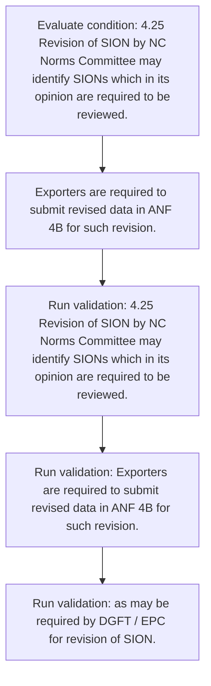
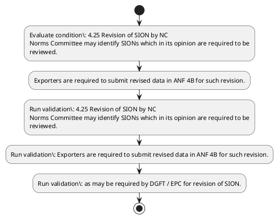

# Chapter 4 / Section 4.25: Revision of SION by NC

**Chapter Title:** Duty Exemption / Remission Schemes

**Pages:** 13

**Purpose:** 4.25 Revision of SION by NC
Norms Committee may identify SIONs which in its opinion are required to be
reviewed.

**Purpose Thanglish:** Indha Revision of SION by NC section-la, 4.25 Revision of SION by NC
Norms Committee may identify SIONs which in its opinion are required to be
reviewed.

**Summary:** 4.25 Revision of SION by NC
Norms Committee may identify SIONs which in its opinion are required to be
reviewed. Exporters are required to submit revised data in ANF 4B for such revision. It is mandatory for industry / exporter(s) to provide production and consumption
data etc.

**Business Meaning:** Revision of SION by NC governs how DGFT business controls should be applied, validated, and enforced.

**Business Explanation:** Revision of SION by NC explains the operating rule set that DEKAI should enforce. Key control points include 4.25 Revision of SION by NC
Norms Committee may identify SIONs which in its opinion are required to be
reviewed. The section also drives actions such as Exporters are required to submit revised data in ANF 4B for such revision..

**Business Explanation Thanglish:** Indha Revision of SION by NC section-la, Revision of SION by NC explains the operating rule set that DEKAI should enforce. Key control points include 4.25 Revision of SION by NC
Norms Committee may identify SIONs which in its opinion are required to be
reviewed. The section also drives actions such as Exporters are required to submit revised data in ANF 4B for such revision..

## Business Logic
- 4.25 Revision of SION by NC
Norms Committee may identify SIONs which in its opinion are required to be
reviewed.
- Exporters are required to submit revised data in ANF 4B for such revision.
- Otherwise, applicant
shall not be allowed to take benefit of Advance Authorisation scheme.

## Business Rules
- rule_id=CH4-SEC4_25-R001, rule_description=4.25 Revision of SION by NC
Norms Committee may identify SIONs which in its opinion are required to be
reviewed., trigger=Revision of SION by NC, condition=4.25 Revision of SION by NC
Norms Committee may identify SIONs which in its opinion are required to be
reviewed., validation=4.25 Revision of SION by NC
Norms Committee may identify SIONs which in its opinion are required to be
reviewed., action=Exporters are required to submit revised data in ANF 4B for such revision., exception=No explicit exception found in uploaded documents., output=DEKAI should produce a compliance decision for 4.25 - Revision of SION by NC.
- rule_id=CH4-SEC4_25-R002, rule_description=Exporters are required to submit revised data in ANF 4B for such revision., trigger=Revision of SION by NC, condition=4.25 Revision of SION by NC
Norms Committee may identify SIONs which in its opinion are required to be
reviewed., validation=Exporters are required to submit revised data in ANF 4B for such revision., action=Exporters are required to submit revised data in ANF 4B for such revision., exception=No explicit exception found in uploaded documents., output=DEKAI should produce a compliance decision for 4.25 - Revision of SION by NC.
- rule_id=CH4-SEC4_25-R003, rule_description=Otherwise, applicant
shall not be allowed to take benefit of Advance Authorisation scheme., trigger=Revision of SION by NC, condition=4.25 Revision of SION by NC
Norms Committee may identify SIONs which in its opinion are required to be
reviewed., validation=as may be required by DGFT / EPC for revision of SION., action=Exporters are required to submit revised data in ANF 4B for such revision., exception=No explicit exception found in uploaded documents., output=DEKAI should produce a compliance decision for 4.25 - Revision of SION by NC.

## Conditions
- 4.25 Revision of SION by NC
Norms Committee may identify SIONs which in its opinion are required to be
reviewed.

## Condition Logic
- id=4.4.25.1, if=4.25 Revision of SION by NC
Norms Committee may identify SIONs which in its opinion are required to be
reviewed., then=Exporters are required to submit revised data in ANF 4B for such revision., source=4.25 Revision of SION by NC
Norms Committee may identify SIONs which in its opinion are required to be
reviewed.

## Validations
- 4.25 Revision of SION by NC
Norms Committee may identify SIONs which in its opinion are required to be
reviewed.
- Exporters are required to submit revised data in ANF 4B for such revision.
- as may be required by DGFT / EPC for revision of SION.
- Otherwise, applicant
shall not be allowed to take benefit of Advance Authorisation scheme.

## Exceptions
- None identified

## Dependencies
- 2
- 4
- 5

## Authorities
- Norms Committee
- DGFT

## Required Documents
- None identified

## Timelines
- None identified

## Actions
- Exporters are required to submit revised data in ANF 4B for such revision.

## Workflow
- Evaluate condition: 4.25 Revision of SION by NC
Norms Committee may identify SIONs which in its opinion are required to be
reviewed.
- Exporters are required to submit revised data in ANF 4B for such revision.
- Run validation: 4.25 Revision of SION by NC
Norms Committee may identify SIONs which in its opinion are required to be
reviewed.
- Run validation: Exporters are required to submit revised data in ANF 4B for such revision.
- Run validation: as may be required by DGFT / EPC for revision of SION.

## Workflow ASCII
```text
Revision of SION by NC
Evaluate condition: 4.25 Revision of SION by NC
Norms Committee may identify SIONs which in its opinion are required to be
reviewed.
   |
   v
Exporters are required to submit revised data in ANF 4B for such revision.
   |
   v
Run validation: 4.25 Revision of SION by NC
Norms Committee may identify SIONs which in its opinion are required to be
reviewed.
   |
   v
Run validation: Exporters are required to submit revised data in ANF 4B for such revision.
   |
   v
Run validation: as may be required by DGFT / EPC for revision of SION.
```

## Decision Tree
- IF 4.25 Revision of SION by NC
Norms Committee may identify SIONs which in its opinion are required to be
reviewed. THEN Exporters are required to submit revised data in ANF 4B for such revision.

## Decision Tree ASCII
```text
Revision of SION by NC Decision
IF 4.25 Revision of SION by NC
Norms Committee may identify SIONs which in its opinion are required to be
reviewed. THEN Exporters are required to submit revised data in ANF 4B for such revision.
```

## Examples
- User asks to process Revision of SION by NC; the platform checks conditions, validations, and documents before action.

**Real-world Example:** Example: an importer or exporter invokes Revision of SION by NC, submits the prescribed DGFT records, and DEKAI uses the extracted rules to exporters are required to submit revised data in anf 4b for such revision..

**Real-world Example Thanglish:** Indha Revision of SION by NC section-la, Example: an importer or exporter invokes Revision of SION by NC, submits the prescribed DGFT records, and DEKAI uses the extracted rules to exporters are required to submit revised data in anf 4b for such revision..

## AI Rules
- IF detected context matches section rule THEN enforce: 4.25 Revision of SION by NC
Norms Committee may identify SIONs which in its opinion are required to be
reviewed.
- IF detected context matches section rule THEN enforce: Exporters are required to submit revised data in ANF 4B for such revision.
- IF detected context matches section rule THEN enforce: Otherwise, applicant
shall not be allowed to take benefit of Advance Authorisation scheme.
- IF validations pass THEN recommend action: Exporters are required to submit revised data in ANF 4B for such revision.

## Database Fields
- name=section_code, type=string, required=True, source=parsed_section_heading
- name=section_title, type=string, required=True, source=parsed_section_heading
- name=may_flag, type=boolean, required=False, source=keyword:may
- name=its_flag, type=boolean, required=False, source=keyword:its
- name=are_flag, type=boolean, required=False, source=keyword:are
- name=anf_flag, type=boolean, required=False, source=keyword:ANF
- name=for_flag, type=boolean, required=False, source=keyword:for
- name=and_flag, type=boolean, required=False, source=keyword:and
- name=etc_flag, type=boolean, required=False, source=keyword:etc
- name=epc_flag, type=boolean, required=False, source=keyword:EPC

## API Requirements
- method=GET, path=/api/dgft/sections/4.25, purpose=Retrieve knowledge payload for section 4.25, query_params=['include=workflow,decision_tree,validations'], response_fields=['section', 'title', 'summary', 'conditions', 'validations', 'exceptions', 'workflow', 'decision_tree']
- method=POST, path=/api/dgft/Revision-of-SION-by-NC/validate, purpose=Validate inputs and documents for Revision of SION by NC, request_fields=['section_code', 'section_title'], response_fields=['status', 'errors', 'warnings', 'next_actions']
- method=POST, path=/api/dgft/Revision-of-SION-by-NC/execute, purpose=Trigger business action for Exporters are required to submit revised data in ANF 4B for such revision., request_fields=['section_code', 'section_title'], response_fields=['reference_id', 'status', 'authority', 'timeline']

## UI Screens
- screen_id=Revision_of_SION_by_NC_overview, name=Revision of SION by NC Overview, purpose=Show section summary, authority, timeline, and eligibility cues., widgets=['summary_card', 'conditions_table', 'authority_badges', 'timeline_panel']
- screen_id=Revision_of_SION_by_NC_submission, name=Revision of SION by NC Submission, purpose=Capture applicant data and supporting documents., widgets=['dynamic_form', 'document_uploader', 'validation_panel', 'next_action_footer'], fields=['section_code', 'section_title', 'may_flag', 'its_flag', 'are_flag', 'anf_flag', 'for_flag', 'and_flag']

## Error Messages
- Validation failed because the section requirements were not fully met.

## FAQ
- question_en=What is the purpose of section 4.25?, answer_en=Revision of SION by NC explains the operating rule set that DEKAI should enforce. Key control points include 4.25 Revision of SION by NC
Norms Committee may identify SIONs which in its opinion are required to be
reviewed. The section also drives actions such as Exporters are required to submit revised data in ANF 4B for such revision.., question_thanglish=Indha Revision of SION by NC section-la, What is the purpose of section 4.25?, answer_thanglish=Indha Revision of SION by NC section-la, Revision of SION by NC explains the operating rule set that DEKAI should enforce. Key control points include 4.25 Revision of SION by NC
Norms Committee may identify SIONs which in its opinion are required to be
reviewed. The section also drives actions such as Exporters are required to submit revised data in ANF 4B for such revision..
- question_en=What documents are required under Revision of SION by NC?, answer_en=Not explicitly covered in uploaded documents., question_thanglish=Indha Revision of SION by NC section-la, What documents are required under Revision of SION by NC?, answer_thanglish=Indha Revision of SION by NC section-la, Not explicitly covered in uploaded documents.
- question_en=Which authority handles Revision of SION by NC?, answer_en=Norms Committee, DGFT, question_thanglish=Indha Revision of SION by NC section-la, Which authority handles Revision of SION by NC?, answer_thanglish=Indha Revision of SION by NC section-la, Norms Committee, DGFT

## Questions Users May Ask
- What does Revision of SION by NC require?
- Which documents are needed for Revision of SION by NC?
- How does DEKAI validate Revision of SION by NC requests?
- What action should be taken for Revision of SION by NC?

## Expected AI Answers
- Revision of SION by NC requires the platform to interpret the section text, apply the extracted business rules, and present the correct next action.
- Required documents are inferred from the section text: no explicit documents were detected.
- DEKAI validates Revision of SION by NC by checking conditions, required documents, authority references, and exception clauses before recommending an outcome.
- The primary extracted action is: Exporters are required to submit revised data in ANF 4B for such revision.

## AI Q&A Examples
- question_en=User asks: How do I comply with Revision of SION by NC?, answer_en=AI answers: DEKAI should evaluate section 4.25, apply the extracted rules, and guide the user through Evaluate condition: 4.25 Revision of SION by NC
Norms Committee may identify SIONs which in its opinion are required to be
reviewed.., question_thanglish=Indha Revision of SION by NC section-la, User asks: How do I comply with Revision of SION by NC?, answer_thanglish=Indha Revision of SION by NC section-la, AI answers: DEKAI should evaluate section 4.25, apply the extracted rules, and guide the user through Evaluate condition: 4.25 Revision of SION by NC
Norms Committee may identify SIONs which in its opinion are required to be
reviewed..
- question_en=User asks: Which validations apply to Revision of SION by NC?, answer_en=AI answers: Applicable validations are 4.25 Revision of SION by NC
Norms Committee may identify SIONs which in its opinion are required to be
reviewed., Exporters are required to submit revised data in ANF 4B for such revision., as may be required by DGFT / EPC for revision of SION., question_thanglish=Indha Revision of SION by NC section-la, User asks: Which validations apply to Revision of SION by NC?, answer_thanglish=Indha Revision of SION by NC section-la, AI answers: Applicable validations are 4.25 Revision of SION by NC
Norms Committee may identify SIONs which in its opinion are required to be
reviewed., Exporters are required to submit revised data in ANF 4B for such revision., as may be required by DGFT / EPC for revision of SION.

## DEKAI AI Implementation Notes
- Capture chapter 4, section 4.25, title, and page references as immutable knowledge metadata.
- Bind validations for Revision of SION by NC into a rule engine keyed by the rule IDs extracted for this section.
- Route escalations or approvals to: Norms Committee, DGFT.
- Show contextual links to related sections: 2, 4, 5.

## DEKAI AI Implementation Notes Thanglish
- Indha Revision of SION by NC section-la, Capture chapter 4, section 4.25, title, and page references as immutable knowledge metadata.
- Indha Revision of SION by NC section-la, Bind validations for Revision of SION by NC into a rule engine keyed by the rule IDs extracted for this section.
- Indha Revision of SION by NC section-la, Route escalations or approvals to: Norms Committee, DGFT.
- Indha Revision of SION by NC section-la, Show contextual links to related sections: 2, 4, 5.

## AI Metadata
- Keywords: may, its, are, ANF, for, and, etc, EPC, not, SION, data, such, DGFT, take, Norms, SIONs, which, shall, submit, scheme
- Search Keywords: may, its, are, ANF, for, and, etc, EPC, not, SION, data, such, DGFT, take, Norms, SIONs, which, shall, submit, scheme
- Intent: Support Revision of SION by NC processing and compliance validation.
- Tags: 4.25, Revision of SION by NC, business-rule, dgft
- Related Sections: 2, 4, 5
- Related Chapters: 
- Related Rules: 4.25 Revision of SION by NC
Norms Committee may identify SIONs which in its opinion are required to be
reviewed., Exporters are required to submit revised data in ANF 4B for such revision., Otherwise, applicant
shall not be allowed to take benefit of Advance Authorisation scheme.

## Mermaid


## PlantUML

