# Chapter 4 / Section 4.26: Description of an Advance Authorisation

**Chapter Title:** Duty Exemption / Remission Schemes

**Pages:** 13

**Purpose:** 4.26 Description of an Advance Authorisation
An Advance Authorisation shall, inter-alia, specify:
(a) Names and description of items including specifications, where applicable, to
be imported and exported/supplied;
(b) Quantity of each item to be imported or wherever quantity cannot be
indicated, value of item shall be indicated.

**Purpose Thanglish:** Indha Description of an Advance Authorisation section-la, 4.26 Description of an Advance Authorisation
An Advance Authorisation kandippa, inter-alia, specify:
(a) Names and description of items including specifications, where applicable, to
be imported and exported/supplied;
(b) Quantity of each item to be imported or wherever quantity cannot be
indicated, value of item kandippa be indicated.

**Summary:** 4.26 Description of an Advance Authorisation
An Advance Authorisation shall, inter-alia, specify:
(a) Names and description of items including specifications, where applicable, to
be imported and exported/supplied;
(b) Quantity of each item to be imported or wherever quantity cannot be
indicated, value of item shall be indicated. Wherever, quantity and value of
individual inputs is a limiting factor in SION, same shall be applicable;
(c) Aggregate CIF value of imports;
(d) FOB/FOR value and quantity of exports/supplies; and
(e) Validity period of import and Export Obligation Period. 4.26 Description of an Advance Authorisation
An Advance Authorisation shall, inter-alia, specify:
(a)
Names and description of items including specifications, where applicable, to
be imported and exported/supplied;
(b)
Quantity of each item to be imported or wherever quantity cannot be
indicated, value of item shall be indicated.

**Business Meaning:** Description of an Advance Authorisation governs how DGFT business controls should be applied, validated, and enforced.

**Business Explanation:** Description of an Advance Authorisation explains the operating rule set that DEKAI should enforce. Key control points include 4.26 Description of an Advance Authorisation
An Advance Authorisation shall, inter-alia, specify:
(a) Names and description of items including specifications, where applicable, to
be imported and exported/supplied;
(b) Quantity of each item to be imported or wherever quantity cannot be
indicated, value of item shall be indicated.

**Business Explanation Thanglish:** Indha Description of an Advance Authorisation section-la, Description of an Advance Authorisation explains the operating rule set that DEKAI should enforce. Key control points include 4.26 Description of an Advance Authorisation
An Advance Authorisation kandippa, inter-alia, specify:
(a) Names and description of items including specifications, where applicable, to
be imported and exported/supplied;
(b) Quantity of each item to be imported or wherever quantity cannot be
indicated, value of item kandippa be indicated.

## Business Logic
- 4.26 Description of an Advance Authorisation
An Advance Authorisation shall, inter-alia, specify:
(a) Names and description of items including specifications, where applicable, to
be imported and exported/supplied;
(b) Quantity of each item to be imported or wherever quantity cannot be
indicated, value of item shall be indicated.
- Wherever, quantity and value of
individual inputs is a limiting factor in SION, same shall be applicable;
(c) Aggregate CIF value of imports;
(d) FOB/FOR value and quantity of exports/supplies; and
(e) Validity period of import and Export Obligation Period.
- 4.26 Description of an Advance Authorisation
An Advance Authorisation shall, inter-alia, specify:
(a)
Names and description of items including specifications, where applicable, to
be imported and exported/supplied;
(b)
Quantity of each item to be imported or wherever quantity cannot be
indicated, value of item shall be indicated.
- Wherever, quantity and value of
individual inputs is a limiting factor in SION, same shall be applicable;
(c)
Aggregate CIF value of imports;
(d)
FOB/FOR value and quantity of exports/supplies; and
(e)
Validity period of import and Export Obligation Period.

## Business Rules
- rule_id=CH4-SEC4_26-R001, rule_description=4.26 Description of an Advance Authorisation
An Advance Authorisation shall, inter-alia, specify:
(a) Names and description of items including specifications, where applicable, to
be imported and exported/supplied;
(b) Quantity of each item to be imported or wherever quantity cannot be
indicated, value of item shall be indicated., trigger=Description of an Advance Authorisation, condition=4.26 Description of an Advance Authorisation
An Advance Authorisation shall, inter-alia, specify:
(a) Names and description of items including specifications, where applicable, to
be imported and exported/supplied;
(b) Quantity of each item to be imported or wherever quantity cannot be
indicated, value of item shall be indicated., validation=4.26 Description of an Advance Authorisation
An Advance Authorisation shall, inter-alia, specify:
(a) Names and description of items including specifications, where applicable, to
be imported and exported/supplied;
(b) Quantity of each item to be imported or wherever quantity cannot be
indicated, value of item shall be indicated., action=Manual review required., exception=No explicit exception found in uploaded documents., output=DEKAI should produce a compliance decision for 4.26 - Description of an Advance Authorisation.
- rule_id=CH4-SEC4_26-R002, rule_description=Wherever, quantity and value of
individual inputs is a limiting factor in SION, same shall be applicable;
(c) Aggregate CIF value of imports;
(d) FOB/FOR value and quantity of exports/supplies; and
(e) Validity period of import and Export Obligation Period., trigger=Description of an Advance Authorisation, condition=Wherever, quantity and value of
individual inputs is a limiting factor in SION, same shall be applicable;
(c) Aggregate CIF value of imports;
(d) FOB/FOR value and quantity of exports/supplies; and
(e) Validity period of import and Export Obligation Period., validation=Wherever, quantity and value of
individual inputs is a limiting factor in SION, same shall be applicable;
(c) Aggregate CIF value of imports;
(d) FOB/FOR value and quantity of exports/supplies; and
(e) Validity period of import and Export Obligation Period., action=Manual review required., exception=No explicit exception found in uploaded documents., output=DEKAI should produce a compliance decision for 4.26 - Description of an Advance Authorisation.
- rule_id=CH4-SEC4_26-R003, rule_description=4.26 Description of an Advance Authorisation
An Advance Authorisation shall, inter-alia, specify:
(a)
Names and description of items including specifications, where applicable, to
be imported and exported/supplied;
(b)
Quantity of each item to be imported or wherever quantity cannot be
indicated, value of item shall be indicated., trigger=Description of an Advance Authorisation, condition=4.26 Description of an Advance Authorisation
An Advance Authorisation shall, inter-alia, specify:
(a)
Names and description of items including specifications, where applicable, to
be imported and exported/supplied;
(b)
Quantity of each item to be imported or wherever quantity cannot be
indicated, value of item shall be indicated., validation=4.26 Description of an Advance Authorisation
An Advance Authorisation shall, inter-alia, specify:
(a)
Names and description of items including specifications, where applicable, to
be imported and exported/supplied;
(b)
Quantity of each item to be imported or wherever quantity cannot be
indicated, value of item shall be indicated., action=Manual review required., exception=No explicit exception found in uploaded documents., output=DEKAI should produce a compliance decision for 4.26 - Description of an Advance Authorisation.
- rule_id=CH4-SEC4_26-R004, rule_description=Wherever, quantity and value of
individual inputs is a limiting factor in SION, same shall be applicable;
(c)
Aggregate CIF value of imports;
(d)
FOB/FOR value and quantity of exports/supplies; and
(e)
Validity period of import and Export Obligation Period., trigger=Description of an Advance Authorisation, condition=Wherever, quantity and value of
individual inputs is a limiting factor in SION, same shall be applicable;
(c)
Aggregate CIF value of imports;
(d)
FOB/FOR value and quantity of exports/supplies; and
(e)
Validity period of import and Export Obligation Period., validation=Wherever, quantity and value of
individual inputs is a limiting factor in SION, same shall be applicable;
(c)
Aggregate CIF value of imports;
(d)
FOB/FOR value and quantity of exports/supplies; and
(e)
Validity period of import and Export Obligation Period., action=Manual review required., exception=No explicit exception found in uploaded documents., output=DEKAI should produce a compliance decision for 4.26 - Description of an Advance Authorisation.

## Conditions
- 4.26 Description of an Advance Authorisation
An Advance Authorisation shall, inter-alia, specify:
(a) Names and description of items including specifications, where applicable, to
be imported and exported/supplied;
(b) Quantity of each item to be imported or wherever quantity cannot be
indicated, value of item shall be indicated.
- Wherever, quantity and value of
individual inputs is a limiting factor in SION, same shall be applicable;
(c) Aggregate CIF value of imports;
(d) FOB/FOR value and quantity of exports/supplies; and
(e) Validity period of import and Export Obligation Period.
- 4.26 Description of an Advance Authorisation
An Advance Authorisation shall, inter-alia, specify:
(a)
Names and description of items including specifications, where applicable, to
be imported and exported/supplied;
(b)
Quantity of each item to be imported or wherever quantity cannot be
indicated, value of item shall be indicated.
- Wherever, quantity and value of
individual inputs is a limiting factor in SION, same shall be applicable;
(c)
Aggregate CIF value of imports;
(d)
FOB/FOR value and quantity of exports/supplies; and
(e)
Validity period of import and Export Obligation Period.

## Condition Logic
- id=4.4.26.1, if=4.26 Description of an Advance Authorisation
An Advance Authorisation shall, inter-alia, specify:
(a) Names and description of items including specifications, where applicable, to
be imported and exported/supplied;
(b) Quantity of each item to be imported or wherever quantity cannot be
indicated, value of item shall be indicated., then=Route for review, source=4.26 Description of an Advance Authorisation
An Advance Authorisation shall, inter-alia, specify:
(a) Names and description of items including specifications, where applicable, to
be imported and exported/supplied;
(b) Quantity of each item to be imported or wherever quantity cannot be
indicated, value of item shall be indicated.
- id=4.4.26.2, if=Wherever, quantity and value of
individual inputs is a limiting factor in SION, same shall be applicable;
(c) Aggregate CIF value of imports;
(d) FOB/FOR value and quantity of exports/supplies; and
(e) Validity period of import and Export Obligation Period., then=Route for review, source=Wherever, quantity and value of
individual inputs is a limiting factor in SION, same shall be applicable;
(c) Aggregate CIF value of imports;
(d) FOB/FOR value and quantity of exports/supplies; and
(e) Validity period of import and Export Obligation Period.
- id=4.4.26.3, if=4.26 Description of an Advance Authorisation
An Advance Authorisation shall, inter-alia, specify:
(a)
Names and description of items including specifications, where applicable, to
be imported and exported/supplied;
(b)
Quantity of each item to be imported or wherever quantity cannot be
indicated, value of item shall be indicated., then=Route for review, source=4.26 Description of an Advance Authorisation
An Advance Authorisation shall, inter-alia, specify:
(a)
Names and description of items including specifications, where applicable, to
be imported and exported/supplied;
(b)
Quantity of each item to be imported or wherever quantity cannot be
indicated, value of item shall be indicated.
- id=4.4.26.4, if=Wherever, quantity and value of
individual inputs is a limiting factor in SION, same shall be applicable;
(c)
Aggregate CIF value of imports;
(d)
FOB/FOR value and quantity of exports/supplies; and
(e)
Validity period of import and Export Obligation Period., then=Route for review, source=Wherever, quantity and value of
individual inputs is a limiting factor in SION, same shall be applicable;
(c)
Aggregate CIF value of imports;
(d)
FOB/FOR value and quantity of exports/supplies; and
(e)
Validity period of import and Export Obligation Period.

## Validations
- 4.26 Description of an Advance Authorisation
An Advance Authorisation shall, inter-alia, specify:
(a) Names and description of items including specifications, where applicable, to
be imported and exported/supplied;
(b) Quantity of each item to be imported or wherever quantity cannot be
indicated, value of item shall be indicated.
- Wherever, quantity and value of
individual inputs is a limiting factor in SION, same shall be applicable;
(c) Aggregate CIF value of imports;
(d) FOB/FOR value and quantity of exports/supplies; and
(e) Validity period of import and Export Obligation Period.
- 4.26 Description of an Advance Authorisation
An Advance Authorisation shall, inter-alia, specify:
(a)
Names and description of items including specifications, where applicable, to
be imported and exported/supplied;
(b)
Quantity of each item to be imported or wherever quantity cannot be
indicated, value of item shall be indicated.
- Wherever, quantity and value of
individual inputs is a limiting factor in SION, same shall be applicable;
(c)
Aggregate CIF value of imports;
(d)
FOB/FOR value and quantity of exports/supplies; and
(e)
Validity period of import and Export Obligation Period.

## Exceptions
- None identified

## Dependencies
- None identified

## Authorities
- None identified

## Required Documents
- None identified

## Timelines
- None identified

## Actions
- None identified

## Workflow
- Evaluate condition: 4.26 Description of an Advance Authorisation
An Advance Authorisation shall, inter-alia, specify:
(a) Names and description of items including specifications, where applicable, to
be imported and exported/supplied;
(b) Quantity of each item to be imported or wherever quantity cannot be
indicated, value of item shall be indicated.
- Evaluate condition: Wherever, quantity and value of
individual inputs is a limiting factor in SION, same shall be applicable;
(c) Aggregate CIF value of imports;
(d) FOB/FOR value and quantity of exports/supplies; and
(e) Validity period of import and Export Obligation Period.
- Evaluate condition: 4.26 Description of an Advance Authorisation
An Advance Authorisation shall, inter-alia, specify:
(a)
Names and description of items including specifications, where applicable, to
be imported and exported/supplied;
(b)
Quantity of each item to be imported or wherever quantity cannot be
indicated, value of item shall be indicated.
- Run validation: 4.26 Description of an Advance Authorisation
An Advance Authorisation shall, inter-alia, specify:
(a) Names and description of items including specifications, where applicable, to
be imported and exported/supplied;
(b) Quantity of each item to be imported or wherever quantity cannot be
indicated, value of item shall be indicated.
- Run validation: Wherever, quantity and value of
individual inputs is a limiting factor in SION, same shall be applicable;
(c) Aggregate CIF value of imports;
(d) FOB/FOR value and quantity of exports/supplies; and
(e) Validity period of import and Export Obligation Period.
- Run validation: 4.26 Description of an Advance Authorisation
An Advance Authorisation shall, inter-alia, specify:
(a)
Names and description of items including specifications, where applicable, to
be imported and exported/supplied;
(b)
Quantity of each item to be imported or wherever quantity cannot be
indicated, value of item shall be indicated.

## Workflow ASCII
```text
Description of an Advance Authorisation
Evaluate condition: 4.26 Description of an Advance Authorisation
An Advance Authorisation shall, inter-alia, specify:
(a) Names and description of items including specifications, where applicable, to
be imported and exported/supplied;
(b) Quantity of each item to be imported or wherever quantity cannot be
indicated, value of item shall be indicated.
   |
   v
Evaluate condition: Wherever, quantity and value of
individual inputs is a limiting factor in SION, same shall be applicable;
(c) Aggregate CIF value of imports;
(d) FOB/FOR value and quantity of exports/supplies; and
(e) Validity period of import and Export Obligation Period.
   |
   v
Evaluate condition: 4.26 Description of an Advance Authorisation
An Advance Authorisation shall, inter-alia, specify:
(a)
Names and description of items including specifications, where applicable, to
be imported and exported/supplied;
(b)
Quantity of each item to be imported or wherever quantity cannot be
indicated, value of item shall be indicated.
   |
   v
Run validation: 4.26 Description of an Advance Authorisation
An Advance Authorisation shall, inter-alia, specify:
(a) Names and description of items including specifications, where applicable, to
be imported and exported/supplied;
(b) Quantity of each item to be imported or wherever quantity cannot be
indicated, value of item shall be indicated.
   |
   v
Run validation: Wherever, quantity and value of
individual inputs is a limiting factor in SION, same shall be applicable;
(c) Aggregate CIF value of imports;
(d) FOB/FOR value and quantity of exports/supplies; and
(e) Validity period of import and Export Obligation Period.
   |
   v
Run validation: 4.26 Description of an Advance Authorisation
An Advance Authorisation shall, inter-alia, specify:
(a)
Names and description of items including specifications, where applicable, to
be imported and exported/supplied;
(b)
Quantity of each item to be imported or wherever quantity cannot be
indicated, value of item shall be indicated.
```

## Decision Tree
- IF section 4.26 applies THEN proceed with standard DGFT workflow

## Decision Tree ASCII
```text
Description of an Advance Authorisation Decision
IF section 4.26 applies THEN proceed with standard DGFT workflow
```

## Examples
- User asks to process Description of an Advance Authorisation; the platform checks conditions, validations, and documents before action.

**Real-world Example:** Example: an importer or exporter invokes Description of an Advance Authorisation, submits the prescribed DGFT records, and DEKAI uses the extracted rules to follow the description of an advance authorisation process.

**Real-world Example Thanglish:** Indha Description of an Advance Authorisation section-la, Example: an importer or exporter invokes Description of an Advance Authorisation, submits the prescribed DGFT records, and DEKAI uses the extracted rules to follow the description of an advance authorisation process.

## AI Rules
- IF detected context matches section rule THEN enforce: 4.26 Description of an Advance Authorisation
An Advance Authorisation shall, inter-alia, specify:
(a) Names and description of items including specifications, where applicable, to
be imported and exported/supplied;
(b) Quantity of each item to be imported or wherever quantity cannot be
indicated, value of item shall be indicated.
- IF detected context matches section rule THEN enforce: Wherever, quantity and value of
individual inputs is a limiting factor in SION, same shall be applicable;
(c) Aggregate CIF value of imports;
(d) FOB/FOR value and quantity of exports/supplies; and
(e) Validity period of import and Export Obligation Period.
- IF detected context matches section rule THEN enforce: 4.26 Description of an Advance Authorisation
An Advance Authorisation shall, inter-alia, specify:
(a)
Names and description of items including specifications, where applicable, to
be imported and exported/supplied;
(b)
Quantity of each item to be imported or wherever quantity cannot be
indicated, value of item shall be indicated.
- IF detected context matches section rule THEN enforce: Wherever, quantity and value of
individual inputs is a limiting factor in SION, same shall be applicable;
(c)
Aggregate CIF value of imports;
(d)
FOB/FOR value and quantity of exports/supplies; and
(e)
Validity period of import and Export Obligation Period.

## Database Fields
- name=section_code, type=string, required=True, source=parsed_section_heading
- name=section_title, type=string, required=True, source=parsed_section_heading
- name=and_flag, type=boolean, required=False, source=keyword:and
- name=cif_flag, type=boolean, required=False, source=keyword:CIF
- name=each_flag, type=boolean, required=False, source=keyword:each
- name=item_flag, type=boolean, required=False, source=keyword:item
- name=sion_flag, type=boolean, required=False, source=keyword:SION
- name=same_flag, type=boolean, required=False, source=keyword:same
- name=shall_flag, type=boolean, required=False, source=keyword:shall
- name=names_flag, type=boolean, required=False, source=keyword:Names

## API Requirements
- method=GET, path=/api/dgft/sections/4.26, purpose=Retrieve knowledge payload for section 4.26, query_params=['include=workflow,decision_tree,validations'], response_fields=['section', 'title', 'summary', 'conditions', 'validations', 'exceptions', 'workflow', 'decision_tree']
- method=POST, path=/api/dgft/Description-of-an-Advance-Authorisation/validate, purpose=Validate inputs and documents for Description of an Advance Authorisation, request_fields=['section_code', 'section_title'], response_fields=['status', 'errors', 'warnings', 'next_actions']

## UI Screens
- screen_id=Description_of_an_Advance_Authorisation_overview, name=Description of an Advance Authorisation Overview, purpose=Show section summary, authority, timeline, and eligibility cues., widgets=['summary_card', 'conditions_table', 'authority_badges', 'timeline_panel']
- screen_id=Description_of_an_Advance_Authorisation_submission, name=Description of an Advance Authorisation Submission, purpose=Capture applicant data and supporting documents., widgets=['dynamic_form', 'document_uploader', 'validation_panel', 'next_action_footer'], fields=['section_code', 'section_title', 'and_flag', 'cif_flag', 'each_flag', 'item_flag', 'sion_flag', 'same_flag']

## Error Messages
- Validation failed because the section requirements were not fully met.

## FAQ
- question_en=What is the purpose of section 4.26?, answer_en=Description of an Advance Authorisation explains the operating rule set that DEKAI should enforce. Key control points include 4.26 Description of an Advance Authorisation
An Advance Authorisation shall, inter-alia, specify:
(a) Names and description of items including specifications, where applicable, to
be imported and exported/supplied;
(b) Quantity of each item to be imported or wherever quantity cannot be
indicated, value of item shall be indicated., question_thanglish=Indha Description of an Advance Authorisation section-la, What is the purpose of section 4.26?, answer_thanglish=Indha Description of an Advance Authorisation section-la, Description of an Advance Authorisation explains the operating rule set that DEKAI should enforce. Key control points include 4.26 Description of an Advance Authorisation
An Advance Authorisation kandippa, inter-alia, specify:
(a) Names and description of items including specifications, where applicable, to
be imported and exported/supplied;
(b) Quantity of each item to be imported or wherever quantity cannot be
indicated, value of item kandippa be indicated.
- question_en=What documents are required under Description of an Advance Authorisation?, answer_en=Not explicitly covered in uploaded documents., question_thanglish=Indha Description of an Advance Authorisation section-la, What documents are required under Description of an Advance Authorisation?, answer_thanglish=Indha Description of an Advance Authorisation section-la, Not explicitly covered in uploaded documents.
- question_en=Which authority handles Description of an Advance Authorisation?, answer_en=Not explicitly covered in uploaded documents., question_thanglish=Indha Description of an Advance Authorisation section-la, Which authority handles Description of an Advance Authorisation?, answer_thanglish=Indha Description of an Advance Authorisation section-la, Not explicitly covered in uploaded documents.

## Questions Users May Ask
- What does Description of an Advance Authorisation require?
- Which documents are needed for Description of an Advance Authorisation?
- How does DEKAI validate Description of an Advance Authorisation requests?

## Expected AI Answers
- Description of an Advance Authorisation requires the platform to interpret the section text, apply the extracted business rules, and present the correct next action.
- Required documents are inferred from the section text: no explicit documents were detected.
- DEKAI validates Description of an Advance Authorisation by checking conditions, required documents, authority references, and exception clauses before recommending an outcome.

## AI Q&A Examples
- question_en=User asks: How do I comply with Description of an Advance Authorisation?, answer_en=AI answers: DEKAI should evaluate section 4.26, apply the extracted rules, and guide the user through Evaluate condition: 4.26 Description of an Advance Authorisation
An Advance Authorisation shall, inter-alia, specify:
(a) Names and description of items including specifications, where applicable, to
be imported and exported/supplied;
(b) Quantity of each item to be imported or wherever quantity cannot be
indicated, value of item shall be indicated.., question_thanglish=Indha Description of an Advance Authorisation section-la, User asks: How do I comply with Description of an Advance Authorisation?, answer_thanglish=Indha Description of an Advance Authorisation section-la, AI answers: DEKAI should evaluate section 4.26, apply the extracted rules, and guide the user through Evaluate condition: 4.26 Description of an Advance Authorisation
An Advance Authorisation kandippa, inter-alia, specify:
(a) Names and description of items including specifications, where applicable, to
be imported and exported/supplied;
(b) Quantity of each item to be imported or wherever quantity cannot be
indicated, value of item kandippa be indicated..
- question_en=User asks: Which validations apply to Description of an Advance Authorisation?, answer_en=AI answers: Applicable validations are 4.26 Description of an Advance Authorisation
An Advance Authorisation shall, inter-alia, specify:
(a) Names and description of items including specifications, where applicable, to
be imported and exported/supplied;
(b) Quantity of each item to be imported or wherever quantity cannot be
indicated, value of item shall be indicated., Wherever, quantity and value of
individual inputs is a limiting factor in SION, same shall be applicable;
(c) Aggregate CIF value of imports;
(d) FOB/FOR value and quantity of exports/supplies; and
(e) Validity period of import and Export Obligation Period., 4.26 Description of an Advance Authorisation
An Advance Authorisation shall, inter-alia, specify:
(a)
Names and description of items including specifications, where applicable, to
be imported and exported/supplied;
(b)
Quantity of each item to be imported or wherever quantity cannot be
indicated, value of item shall be indicated., question_thanglish=Indha Description of an Advance Authorisation section-la, User asks: Which validations apply to Description of an Advance Authorisation?, answer_thanglish=Indha Description of an Advance Authorisation section-la, AI answers: Applicable validations are 4.26 Description of an Advance Authorisation
An Advance Authorisation kandippa, inter-alia, specify:
(a) Names and description of items including specifications, where applicable, to
be imported and exported/supplied;
(b) Quantity of each item to be imported or wherever quantity cannot be
indicated, value of item kandippa be indicated., Wherever, quantity and value of
individual inputs is a limiting factor in SION, same kandippa be applicable;
(c) Aggregate CIF value of imports;
(d) FOB/FOR value and quantity of exports/supplies; and
(e) Validity period of import and export Obligation Period., 4.26 Description of an Advance Authorisation
An Advance Authorisation kandippa, inter-alia, specify:
(a)
Names and description of items including specifications, where applicable, to
be imported and exported/supplied;
(b)
Quantity of each item to be imported or wherever quantity cannot be
indicated, value of item kandippa be indicated.

## DEKAI AI Implementation Notes
- Capture chapter 4, section 4.26, title, and page references as immutable knowledge metadata.
- Bind validations for Description of an Advance Authorisation into a rule engine keyed by the rule IDs extracted for this section.

## DEKAI AI Implementation Notes Thanglish
- Indha Description of an Advance Authorisation section-la, Capture chapter 4, section 4.26, title, and page references as immutable knowledge metadata.
- Indha Description of an Advance Authorisation section-la, Bind validations for Description of an Advance Authorisation into a rule engine keyed by the rule IDs extracted for this section.

## AI Metadata
- Keywords: and, CIF, each, item, SION, same, shall, Names, items, where, value, cannot, inputs, factor, period, import, Export, Advance, specify, imports
- Search Keywords: and, CIF, each, item, SION, same, shall, Names, items, where, value, cannot, inputs, factor, period, import, Export, Advance, specify, imports
- Intent: Provide knowledge guidance for Description of an Advance Authorisation.
- Tags: 4.26, Description of an Advance Authorisation, business-rule, dgft
- Related Sections: 
- Related Chapters: 
- Related Rules: 4.26 Description of an Advance Authorisation
An Advance Authorisation shall, inter-alia, specify:
(a) Names and description of items including specifications, where applicable, to
be imported and exported/supplied;
(b) Quantity of each item to be imported or wherever quantity cannot be
indicated, value of item shall be indicated., Wherever, quantity and value of
individual inputs is a limiting factor in SION, same shall be applicable;
(c) Aggregate CIF value of imports;
(d) FOB/FOR value and quantity of exports/supplies; and
(e) Validity period of import and Export Obligation Period., 4.26 Description of an Advance Authorisation
An Advance Authorisation shall, inter-alia, specify:
(a)
Names and description of items including specifications, where applicable, to
be imported and exported/supplied;
(b)
Quantity of each item to be imported or wherever quantity cannot be
indicated, value of item shall be indicated., Wherever, quantity and value of
individual inputs is a limiting factor in SION, same shall be applicable;
(c)
Aggregate CIF value of imports;
(d)
FOB/FOR value and quantity of exports/supplies; and
(e)
Validity period of import and Export Obligation Period.

## Mermaid

```mermaid
flowchart TD
    S1["Evaluate condition: 4.26 Description of an Advance Authorisation
An Advance Authorisation shall, inter-alia, specify:
(a) Names and description of items including specifications, where applicable, to
be imported and exported/supplied;
(b) Quantity of each item to be imported or wherever quantity cannot be
indicated, value of item shall be indicated."]
    S2["Evaluate condition: Wherever, quantity and value of
individual inputs is a limiting factor in SION, same shall be applicable;
(c) Aggregate CIF value of imports;
(d) FOB/FOR value and quantity of exports/supplies; and
(e) Validity period of import and Export Obligation Period."]
    S1 --> S2
    S3["Evaluate condition: 4.26 Description of an Advance Authorisation
An Advance Authorisation shall, inter-alia, specify:
(a)
Names and description of items including specifications, where applicable, to
be imported and exported/supplied;
(b)
Quantity of each item to be imported or wherever quantity cannot be
indicated, value of item shall be indicated."]
    S2 --> S3
    S4["Run validation: 4.26 Description of an Advance Authorisation
An Advance Authorisation shall, inter-alia, specify:
(a) Names and description of items including specifications, where applicable, to
be imported and exported/supplied;
(b) Quantity of each item to be imported or wherever quantity cannot be
indicated, value of item shall be indicated."]
    S3 --> S4
    S5["Run validation: Wherever, quantity and value of
individual inputs is a limiting factor in SION, same shall be applicable;
(c) Aggregate CIF value of imports;
(d) FOB/FOR value and quantity of exports/supplies; and
(e) Validity period of import and Export Obligation Period."]
    S4 --> S5
    S6["Run validation: 4.26 Description of an Advance Authorisation
An Advance Authorisation shall, inter-alia, specify:
(a)
Names and description of items including specifications, where applicable, to
be imported and exported/supplied;
(b)
Quantity of each item to be imported or wherever quantity cannot be
indicated, value of item shall be indicated."]
    S5 --> S6
```


## PlantUML
```plantuml
@startuml
start
:Evaluate condition\: 4.26 Description of an Advance Authorisation
An Advance Authorisation shall, inter-alia, specify\:
(a) Names and description of items including specifications, where applicable, to
be imported and exported/supplied;
(b) Quantity of each item to be imported or wherever quantity cannot be
indicated, value of item shall be indicated.;
:Evaluate condition\: Wherever, quantity and value of
individual inputs is a limiting factor in SION, same shall be applicable;
(c) Aggregate CIF value of imports;
(d) FOB/FOR value and quantity of exports/supplies; and
(e) Validity period of import and Export Obligation Period.;
:Evaluate condition\: 4.26 Description of an Advance Authorisation
An Advance Authorisation shall, inter-alia, specify\:
(a)
Names and description of items including specifications, where applicable, to
be imported and exported/supplied;
(b)
Quantity of each item to be imported or wherever quantity cannot be
indicated, value of item shall be indicated.;
:Run validation\: 4.26 Description of an Advance Authorisation
An Advance Authorisation shall, inter-alia, specify\:
(a) Names and description of items including specifications, where applicable, to
be imported and exported/supplied;
(b) Quantity of each item to be imported or wherever quantity cannot be
indicated, value of item shall be indicated.;
:Run validation\: Wherever, quantity and value of
individual inputs is a limiting factor in SION, same shall be applicable;
(c) Aggregate CIF value of imports;
(d) FOB/FOR value and quantity of exports/supplies; and
(e) Validity period of import and Export Obligation Period.;
:Run validation\: 4.26 Description of an Advance Authorisation
An Advance Authorisation shall, inter-alia, specify\:
(a)
Names and description of items including specifications, where applicable, to
be imported and exported/supplied;
(b)
Quantity of each item to be imported or wherever quantity cannot be
indicated, value of item shall be indicated.;
stop
@enduml
```
